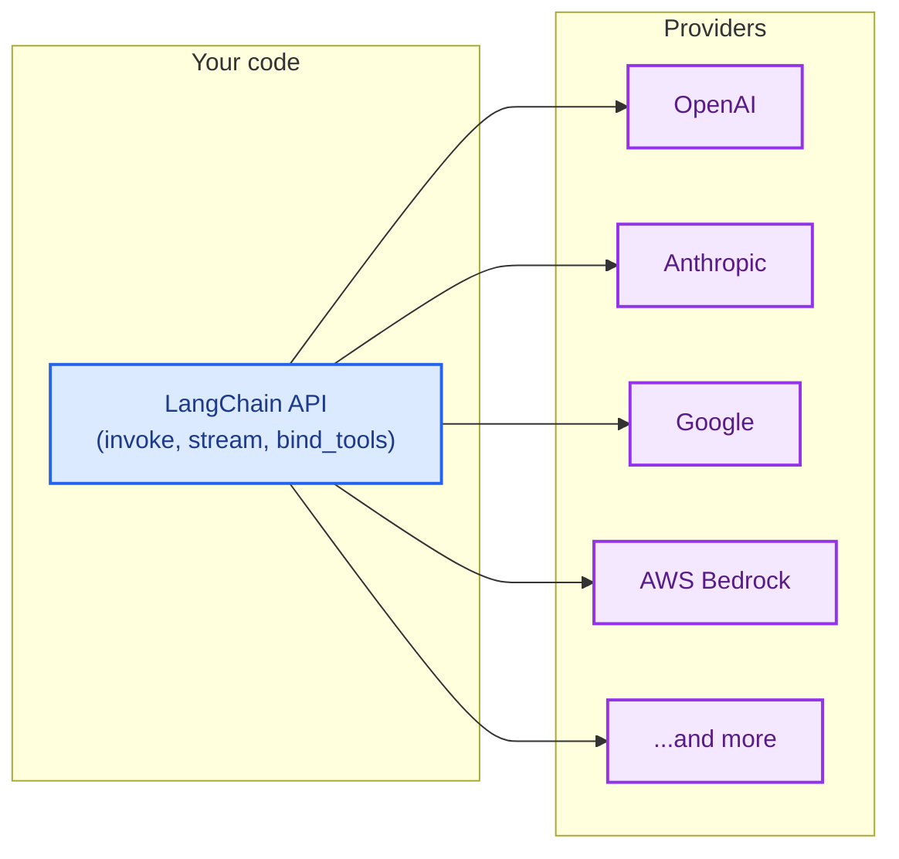

LangChain 给您提供了统一的 API 来处理来自不同提供商的模型。安装一个提供程序包，选择一个模型名称，然后开始构建——无论您使用的是 OpenAI、Anthropic、Google 还是其他任何支持的提供商，相同的代码都适用。



## 任意模型的单一 API

无论提供商如何，LangChain 的每个聊天模型都实现相同的接口。这意味着您可以：

- **无需重写应用逻辑即可切换提供程序**
- **使用相同代码并排比较模型**
- **利用高级功能**（例如 [工具调用](/oss/python/langchain/tools)、[结构化输出](/oss/python/langchain/structured-output) 和 [流式传输](/oss/python/langchain/streaming)）

```python
from langchain.chat_models import init_chat_model

openai_model = init_chat_model("openai:gpt-5.4")
anthropic_model = init_chat_model("anthropic:claude-opus-4-6")
google_model = init_chat_model("google-genai:gemini-3.1-pro-preview")

for model in [openai_model, anthropic_model, google_model]:
    response = model.invoke("Explain quantum computing in one sentence.")
    print(response.text)
```


## 什么是提供程序？

**提供程序**是指托管 AI 模型并通过 API 接口公开的公司或平台。示例包括 OpenAI、Anthropic、Google 和 AWS Bedrock。

在 LangChain 中，每个提供程序都有一个专用的 **集成包**（例如 `langchain-openai`、`langchain-anthropic`），该包实现了该提供程序模型的标准 LangChain 接口。这意味着：

- **为每个提供程序提供专用包，并进行适当的版本管理和依赖项管理**
- **在需要时使用特定于提供商的功能**（例如 OpenAI 的 Responses API、Anthropic 的扩展思考）
- **通过环境变量自动处理 API 密钥**

```shell
uv add langchain-openai       # 用于 OpenAI 模型
uv add langchain-anthropic    # 用于 Anthropic 模型
uv add langchain-google-genai # 用于 Google 模型
```

要查看完整的提供程序包列表，请参阅 [集成页面](/oss/python/integrations/providers/overview)。

## 查找模型名称

每个提供商支持特定的模型名称，您在初始化聊天模型时需要传递这些名称。有以下两种方式指定模型：

<CodeGroup>
    ```python Provider prefix format
    from langchain.chat_models import init_chat_model

    model = init_chat_model("openai:gpt-5.4")
    ```

    ```python Direct class instantiation
    from langchain_openai import ChatOpenAI

    model = ChatOpenAI(model="gpt-5.4")
    ```
</CodeGroup>

使用 `init_chat_model` 时，如果模型名称明确，则可以省略提供程序前缀（例如，“gpt-5.4”解析为 OpenAI）。

要查找提供商可用的模型名称，请参阅提供商自己的文档。以下是一些流行的提供商：

| 提供商 | 查找模型名称的位置 |
| :--- | :--- |
| [OpenAI](/oss/python/integrations/providers/openai) | [OpenAI 模型页面](https://platform.openai.com/docs/models) |
| [Anthropic](/oss/python/integrations/providers/anthropic) | [Anthropic 模型页面](https://docs.anthropic.com/en/docs/about-claude/models) |
| [Google](/oss/python/integrations/providers/google) | [Google AI 模型页面](https://ai.google.dev/gemini-api/docs/models) |
| [AWS Bedrock](/oss/python/integrations/providers/aws) | [Bedrock 支持的模型](https://docs.aws.amazon.com/bedrock/latest/userguide/models-supported.html) |
| [Ollama](/oss/python/integrations/providers/ollama) | [Ollama 模型库](https://ollama.com/library) |
| [Groq](/oss/python/integrations/providers/groq) | [Groq 支持的模型](https://console.groq.com/docs/models) |

## 立即使用新模型

由于 LangChain 提供程序包直接将模型名称传递给提供商的 API，因此您可以立即使用提供商发布的任何新模型——无需更新 LangChain。只需传递新的模型名称：

```python
model = init_chat_model("anthropic:claude-mythos")
```

只要您的提供程序包版本支持所需 API 版本的新模型，则新模型名称可以立即使用。

## 模型功能

不同的提供商和模型支持不同的功能。
要查看聊天模型集成及其功能，请参阅 [聊天模型集成页面](/oss/python/integrations/chat)。

## 路由器和代理

**路由器**（也称为代理或网关）通过单一 API 和凭证为您提供多个提供商的访问权限。它们可以简化计费、让您无需更改集成即可切换模型，并提供自动回退和负载均衡等功能。

| 提供商 | 集成 | 描述 |
| :------- | :---------- | :---------- |
| [OpenRouter](https://openrouter.ai/) | [`ChatOpenRouter`](/oss/python/integrations/chat/openrouter) | 统一访问来自 OpenAI、Anthropic、Google 和 Meta 等提供商的模型 |
| [LiteLLM](https://www.litellm.ai/) | [`ChatLiteLLM`](/oss/python/integrations/chat/litellm) | 通过路由、回退和花费跟踪提供与 100 多个提供商的统一接口 |

当您希望：

- **使用单一 API 密钥和计费账户访问多个提供商**
- **动态切换模型而无需管理多个提供商凭证**
- **利用自动回退模型**，如果主模型失败则会自动重试其他模型

```python
from langchain.chat_models import init_chat_model

model = init_chat_model("openrouter:anthropic/claude-sonnet-4-6")
response = model.invoke("Hello!")
```

## 兼容 OpenAI 的端点

许多提供商提供了与 [OpenAI Chat Completions API](https://platform.openai.com/docs/api-reference/chat) 兼容的端点。您可以使用带有自定义 `base_url` 的 `ChatOpenAI` 连接到这些端点：

```python
from langchain_openai import ChatOpenAI

model = ChatOpenAI(
    base_url="https://your-provider.com/v1",
    api_key="your-api-key",
    model="provider-model-name",
)
```

<Warning>
    `ChatOpenAI` 仅针对 [官方 OpenAI API 规范](https://github.com/openai/openai-openapi)。第三方提供商的非标准响应字段不会被提取或保留。当您需要访问非标准功能时，请使用专用提供程序包或路由器。
</Warning>

## 下一步

<CardGroup cols={2}>
    <Card title="Models guide" icon="cpu" href="/oss/python/langchain/models">
        学习如何使用模型：调用、流式传输、批处理、工具调用等。
    </Card>
    <Card title="Chat model integrations" icon="message" href="/oss/python/integrations/chat">
        浏览所有聊天模型集成及其功能。
    </Card>
    <Card title="All providers" icon="grid-dots" href="/oss/python/integrations/providers/overview">
        查看完整的提供程序包和集成列表。
    </Card>
    <Card title="Agents" icon="robot" href="/oss/python/langchain/agents">
        构建使用模型作为推理引擎的代理。
    </Card>
</CardGroup>

---

<div className="source-links">
<Callout icon="edit">
    [在 GitHub 上编辑此页面](https://github.com/langchain-ai/docs/edit/main/src/oss/concepts/providers-and-models.mdx) 或 [提交问题](https://github.com/langchain-ai/docs/issues/new/choose)。
</Callout>
<Callout icon="terminal-2">
    通过 MCP 将这些文档连接到 Claude、VSCode 等，以获取实时答案。
</Callout>
</div>