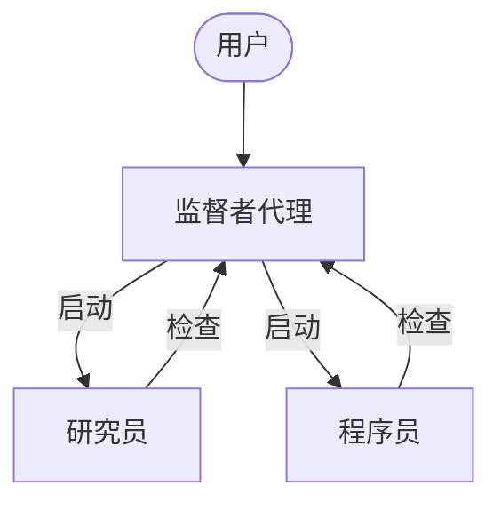
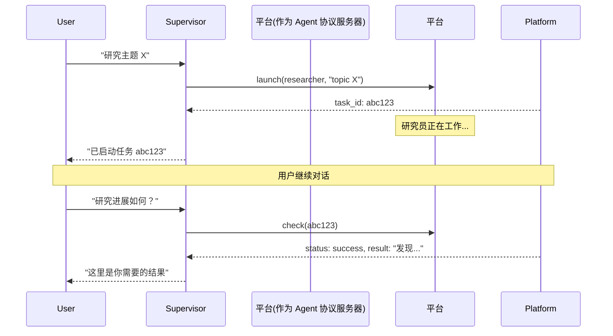

异步子代理允许监督者代理在后台启动立即返回的任务，因此监督者可以在子代理工作时继续与用户进行交互。监督者可以随时检查进度、发送后续指令或取消任务。

这建立在[同步子代理](/oss/python/deepagents/subagents)的基础上，后者是同步运行的，并且在完成之前会阻塞监督者。当任务长时间运行、可并行化或需要中途调整时，请使用异步子代理。

<Note>
异步子代理是 `deepagents` 0.5.0 中的一项预览功能。预览功能正处于积极开发中，API 可能会发生变化。


</Note>



<Note>
异步子代理与任何实现 [Agent 协议](https://github.com/langchain-ai/agent-protocol) 的服务器通信。您可以使用 [LangSmith 部署](/langsmith/deployment)，或自行托管任何兼容 Agent 协议的服务器。每个子代理独立于监督者运行，监督者通过 SDK 来启动、检查、更新和取消它们。
</Note>

## 使用异步子代理的场景

| 维度            | 同步子代理                                                  | 异步子代理                                                   |
|-----------------|------------------------------------------------------------|-------------------------------------------------------------|
| **执行模型**    | 监督者在子代理完成前会被阻塞                              | 立即返回作业 ID；监督者继续运行                                |
| **并发性**      | 并发但阻塞                                                 | 并发且非阻塞                                                |
| **中途更新**    | 不可能                                                       | 通过 `update_async_task` 发送后续指令                       |
| **取消**        | 不可能                                                       | 通过 `cancel_async_task` 取消运行中的任务                    |
| **状态性**      | 无状态 — 每次调用之间没有持久状态                           | 状态化 — 在交互过程中在自己的线程上维护状态                   |
| **最适合的场景** | 代理应在收到结果前等待继续执行的任务                         | 长时间运行、复杂的任务通过聊天进行互动式管理                   |

## 配置异步子代理

将异步子代理定义为一个包含多个 [`AsyncSubAgent`](https://reference.langchain.com/python/deepagents/middleware/async_subagents/AsyncSubAgent) 规范的列表，每个规范指向一个 Agent 协议服务器：

```python
from deepagents import AsyncSubAgent, create_deep_agent

async_subagents = [
    AsyncSubAgent(
        name="researcher",
        description="研究代理用于信息收集和综合",
        graph_id="researcher",
        # 未指定 url → 使用 ASGI 运输（在同一部署中共同部署）
    ),
    AsyncSubAgent(
        name="coder",
        description="编码代理用于代码生成和审查",
        graph_id="coder",
        # url="https://coder-deployment.langsmith.dev"  # 可选：使用 HTTP 运输远程
    ),
]

agent = create_deep_agent(
    model="google_genai:gemini-3.1-pro-preview",
    subagents=async_subagents,
)
```

| 字段 | 类型 | 描述 |
|------|------|-------------|
| `name` | `str` | 必需。唯一标识符。监督者在启动任务时使用此标识符。 |
| `description` | `str` | 必需。子代理的功能描述。监督者根据此描述决定将任务委派给哪个子代理。 |
| `graph_id` | `str` | 必需。Agent 协议服务器上的图 ID（或助手 ID）。对于基于 LangGraph 的部署，这必须与 `langgraph.json` 中注册的图匹配。 |
| `url` | `str` | 可选。省略时使用 ASGI 运输（进程内）。设置时通过远程 Agent 协议服务器使用 HTTP 运输。 |
| `headers` | `dict[str, str]` | 可选。请求到远程服务器的附加标头。用于自托管 Agent 协议服务器的自定义身份验证。 |


对于基于 LangGraph 的部署，在同一个 `langgraph.json` 中注册所有图以实现共同部署：

```json
{
  "graphs": {
    "supervisor": "./src/supervisor.py:graph",
    "researcher": "./src/researcher.py:graph",
    "coder": "./src/coder.py:graph"
  }
}
```

## 使用异步子代理工具

`AsyncSubAgentMiddleware` 给监督者提供了五种工具：

| 工具 | 目的 | 返回 |
|------|---------|---------|
| `start_async_task` | 启动新的后台任务 | 任务 ID（立即返回） |
| `check_async_task` | 获取任务当前状态和结果 | 状态 + 结果（如果已完成） |
| `update_async_task` | 发送运行中的任务的新指令 | 确认 + 更新的状态 |
| `cancel_async_task` | 停止运行的任务 | 确认 |
| `list_async_tasks` | 列出所有跟踪的任务及其实时状态 | 所有任务的摘要 |

监督者的语言模型像调用其他工具一样调用这些工具。中间件自动处理线程创建、运行管理和状态持久化。

### 了解生命周期

典型交互遵循以下顺序：



- **启动** 在服务器上创建新的线程，以任务描述作为输入开始运行，并返回线程 ID 作为任务 ID。监督者将此 ID 报告给用户且不轮询检查完成情况。
- **检查** 获取当前运行状态。如果运行成功，则检索线程状态以提取子代理的最终输出。如果仍在运行，则向用户报告该信息。
- **更新** 在同一线程上创建新的运行，使用中断多任务策略。之前的运行被中断，并且子代理在会话历史记录加上新指令的情况下重新启动。任务 ID 保持不变。
- **取消** 调用服务器上的 `runs.cancel()` 并将任务标记为 `"cancelled"`。
- **列出** 遍历所有跟踪的任务。对于非终端任务，它并行从服务器获取实时状态。终端状态（`success`, `error`, `cancelled`）从缓存中返回。

## 理解状态管理

任务元数据存储在监督者的图中的专用状态通道 (`async_tasks`) 中，与消息历史记录分离。这对于深代理 [压缩其消息历史记录](/oss/python/deepagents/context-engineering#summarization) 时至关重要。如果仅将任务 ID 存储在工具消息中，则在压缩过程中会丢失它们。专用通道确保监督者可以通过 `list_async_tasks` 始终回忆起其任务，即使经过多次总结。

每个跟踪的任务记录任务 ID、代理名称、线程 ID、运行 ID、状态以及时间戳（`created_at`, `last_checked_at`, `last_updated_at`）。


## 选择传输方式

### ASGI 传输（共同部署）

当子代理规范省略了 `url` 字段时，LangGraph SDK 使用 ASGI 传输 —— SDK 调用通过进程内函数调用路由而不是 HTTP。对于基于 LangGraph 的部署，这需要两个图都注册在同一个 `langgraph.json` 中。

ASGI 传输消除了网络延迟且不需要额外的身份验证配置。子代理仍然作为一个独立的线程运行，并具有自己的状态。这是推荐的默认设置。

### HTTP 传输（远程）

添加一个 `url` 字段以切换到 HTTP 传输，其中 SDK 调用通过网络发送到远程 Agent 协议服务器：

```python
AsyncSubAgent(
    name="researcher",
    description="研究代理",
    graph_id="researcher",
    url="https://my-research-deployment.langsmith.dev",
)
```


对于基于 LangGraph 的部署，认证由 LangGraph SDK 使用环境变量中的 `LANGSMITH_API_KEY`（或 `LANGGRAPH_API_KEY`）处理。自托管 Agent 协议服务器可能使用不同的身份验证机制。

当子代理需要独立扩展、不同资源配置或由其他团队维护时，请使用 HTTP 传输。

## 选择部署拓扑

### 单个部署

单个部署意味着所有代理都在同一服务器上共同部署，使用 ASGI 传输。对于基于 LangGraph 的部署，在一个 `langgraph.json` 中注册所有图。这是推荐的起点 —— 只需管理一台服务器且无代理之间的网络延迟。

### 分裂部署

监督者在一台服务器上，子代理通过 HTTP 传输在另一台服务器上。当子代理需要不同的计算配置或独立扩展时，请使用此方式。

### 混合部署

在分裂部署中，您有监督者在一台服务器上，子代理通过 HTTP 传输在另一台服务器上。当子代理需要不同的计算配置或独立扩展时，请使用此方式。

### 混合部署

在混合部署中，一些子代理共同部署并通过 ASGI 运行，其他子代理远程运行通过 HTTP：

```python
async_subagents = [
    AsyncSubAgent(
        name="researcher",
        description="研究代理",
        graph_id="researcher",
        # 未指定 url → 使用 ASGI (共同部署)
    ),
    AsyncSubAgent(
        name="coder",
        description="编码代理",
        graph_id="coder",
        url="https://coder-deployment.langsmith.dev",
        # url 存在 → 使用 HTTP (远程)
    ),
]
```


## 最佳实践

### 为本地开发调整工作池大小

当使用 `langgraph dev` 运行时，增加工作池以容纳并发子代理运行。每个活跃的运行占用一个工作槽位。监督者有三个并发子代理任务需要四个槽位（1 监督者 + 3 子代理）。如果配置不足会导致启动排队。

```bash
langgraph dev --n-jobs-per-worker 10
```

### 清晰地编写子代理描述

监督者使用描述来决定要启动哪个子代理。具体且具有行动导向：

```python
# 好的
AsyncSubAgent(
    name="researcher",
    description="使用网络搜索进行深入研究。用于需要多次搜索和综合的问题。",
    graph_id="researcher",
)

# 不好的
AsyncSubAgent(
    name="helper",
    description="帮助做事情",
    graph_id="helper",
)
```


### 使用线程 ID 追踪

当使用基于 LangGraph 的部署时，每个异步子代理运行都是一个标准的 LangGraph 运行，完全可见于 LangSmith。监督者的追踪显示 `launch`, `check`, `update`, `cancel` 和 `list` 调用工具。每个子代理运行作为单独的追踪出现，并通过线程 ID 相关联。使用线程 ID（任务 ID）将监督者协调追踪与子代理执行追踪相关联。

## 故障排除

### 监督者在启动后立即进行轮询

**问题**: 监督者在启动后立即以循环方式调用 `check`，从而将异步执行变为阻塞。

**解决方案**: 中间件注入系统提示规则以防止此行为。如果持续轮询，请强化监督者的系统提示：

```python
agent = create_deep_agent(
    model="google_genai:gemini-3.1-pro-preview",
    system_prompt="""...你的指令...

    在启动异步子代理后，始终将控制权交还给用户。
    从启动后立即调用 `check_async_task`。”,
    subagents=async_subagents,
)
```


### 监督者报告过时的状态

**问题**: 监督者引用对话历史中的任务状态而不是进行新的 `check` 调用。

**解决方案**: 中间件提示指示模型“对话历史中的任务状态总是过时的”。如果仍然发生这种情况，请添加明确的指令，要求在报告状态之前调用 `check` 或 `list`。

### 任务 ID 查找失败

**问题**: 监督者截断或重新格式化任务 ID，导致 `check` 或 `cancel` 失败。

**解决方案**: 中间件提示指示模型始终使用完整的任务 ID。如果截断仍然存在，则这通常是特定于模型的问题 —— 尝试不同的模型或将“总是显示完整 task_id，从不截断或缩写它”添加到系统提示中。

### 子代理启动排队而不是运行

**问题**: 启动子代理挂起或长时间开始。

**解决方案**: 工作池可能已耗尽。使用 `--n-jobs-per-worker` 增加工作池大小。参见 [调整工作池大小](#为本地开发调整工作池大小)。

## 参考实现

[async-deep-agents](https://github.com/langchain-ai/async-deep-agents) 仓库包含使用 Python 和 TypeScript 编写的示例代码，部署到 LangSmith 部署。它演示了一个监督者代理与研究员和程序员子代理作为后台任务运行的场景。

---

<div className="source-links">
<Callout icon="edit">
    [在 GitHub 上编辑此页面](https://github.com/langchain-ai/docs/edit/main/src/oss/deepagents/async-subagents.mdx) 或 [提交问题](https://github.com/langchain-ai/docs/issues/new/choose)。
</Callout>
<Callout icon="terminal-2">
    通过 MCP 将这些文档与 Claude、VSCode 等连接，以获得实时答案。
</Callout>
</div>