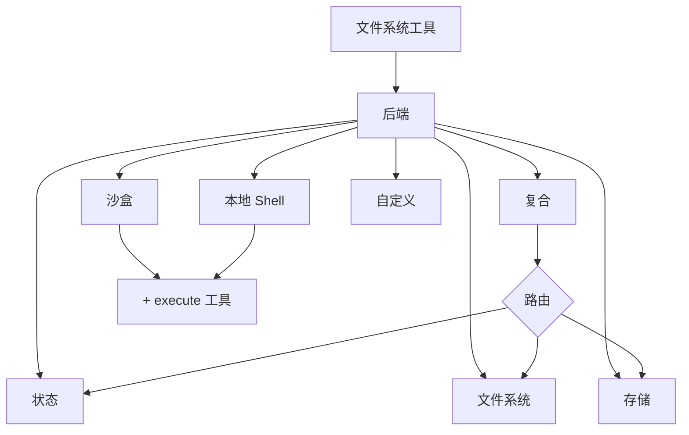

import BackendState from '/snippets/backend-state.mdx';
import BackendFilesystem from '/snippets/backend-filesystem.mdx';
import BackendLocalShell from '/snippets/backend-local-shell.mdx';
import BackendStore from '/snippets/backend-store.mdx';
import BackendComposite from '/snippets/backend-composite.mdx';

Deep agents 通过 `ls`、`read_file`、`write_file`、`edit_file`、`glob` 和 `grep` 等工具向智能体暴露文件系统界面。这些工具通过可插拔的后端运行。`read_file` 工具原生支持所有后端的图像文件（`.png`、`.jpg`、`.jpeg`、`.gif`、`.webp`），并以多模态内容块的形式返回。

沙盒和 `LocalShellBackend` 还提供 `execute` 工具。



本页面介绍如何[选择后端](#specify-a-backend)、[将不同路径路由到不同后端](#route-to-different-backends)、[实现自定义虚拟文件系统](#use-a-virtual-filesystem)（例如 S3 或 Postgres）、[添加策略钩子](#add-policy-hooks)以及[遵守后端协议](#protocol-reference)。

## 快速开始

以下是一些可以快速与 deep agent 配合使用的预建文件系统后端：

| 内置后端 | 描述 |
|---|---|
| [默认](#statebackend-ephemeral) | `agent = create_deep_agent()` <br></br> 存储在状态中的临时数据。智能体的默认文件系统后端存储在 `langgraph` 状态中。注意此文件系统仅在_单个线程_内持久化。 |
| [本地文件系统持久化](#filesystembackend-local-disk) | `agent = create_deep_agent(backend=FilesystemBackend(root_dir="/Users/nh/Desktop/"))` <br></br>这使 deep agent 可以访问本地机器的文件系统。您可以指定智能体可访问的根目录。注意所提供的 `root_dir` 必须是绝对路径。 |
| [持久化存储（LangGraph store）](#storebackend-langgraph-store) | `agent = create_deep_agent(backend=lambda rt: StoreBackend(rt))` <br></br>这使智能体可以访问_跨线程持久化_的长期存储。非常适合存储适用于多次执行的长期记忆或指令。 |
| [沙盒](/oss/python/deepagents/sandboxes) | `agent = create_deep_agent(backend=sandbox)` <br></br>在隔离环境中执行代码。沙盒提供文件系统工具以及用于运行 Shell 命令的 `execute` 工具。可选择 Modal、Daytona、Deno 或本地 VFS。 |
| [本地 Shell](#localshellbackend-local-shell) | `agent = create_deep_agent(backend=LocalShellBackend(root_dir=".", env={"PATH": "/usr/bin:/bin"}))` <br></br>直接在主机上进行文件系统和 Shell 执行。无隔离——仅在受控开发环境中使用。请参阅下方的[安全注意事项](#local-shell)。 |
| [复合](#compositebackend-router) | 默认为临时存储，`/memories/` 为持久化存储。复合后端具有最大灵活性。您可以指定文件系统中的不同路由指向不同后端。有关复合路由的即用示例，请参阅下方内容。 |


## 内置后端

### StateBackend（临时存储）

<BackendState />

**工作原理：**
- 将文件存储在当前线程的 LangGraph 智能体状态中。
- 通过检查点在同一线程的多个智能体轮次中持久化。

**最适合：**
- 作为智能体写入中间结果的草稿本。
- 自动清除智能体可按块读回的大型工具输出。

注意此后端在监督智能体和子智能体之间共享，子智能体写入的任何文件在该子智能体执行完成后仍将保留在 LangGraph 智能体状态中。这些文件将继续对监督智能体和其他子智能体可用。

### FilesystemBackend（本地磁盘）

<Warning>
此后端授予智能体直接的文件系统读写权限。
请谨慎使用，仅在适当的环境中使用。

**适用场景：**
- 本地开发 CLI（编码助手、开发工具）
- CI/CD 流水线（参见下方安全注意事项）

**不适用场景：**
- Web 服务器或 HTTP API——改用 `StateBackend`、`StoreBackend` 或[沙盒后端](/oss/python/deepagents/sandboxes)

**安全风险：**
- 智能体可以读取任何可访问的文件，包括密钥（API 密钥、凭证、`.env` 文件）
- 结合网络工具，密钥可能通过 SSRF 攻击泄露
- 文件修改是永久且不可撤销的

**推荐的安全措施：**
1. 启用[人工干预（HITL）中间件](/oss/python/deepagents/human-in-the-loop)以审查敏感操作。
1. 将密钥排除在可访问的文件系统路径之外（尤其是在 CI/CD 中）。
1. 在生产环境中需要文件系统交互时使用[沙盒后端](/oss/python/deepagents/sandboxes)。
1. **始终**将 `virtual_mode=True` 与 `root_dir` 配合使用，以启用基于路径的访问限制（阻止 `..`、`~` 以及根目录之外的绝对路径）。
   注意默认值（`virtual_mode=False`）即使设置了 `root_dir` 也不提供任何安全保护。
</Warning>

<BackendFilesystem />

**工作原理：**
- 在可配置的 `root_dir` 下读写真实文件。
- 您可以选择设置 `virtual_mode=True` 以在 `root_dir` 下沙盒化和规范化路径。
- 使用安全路径解析，尽可能防止不安全的符号链接遍历，可使用 ripgrep 进行快速 `grep`。

**最适合：**
- 本地机器上的项目
- CI 沙盒
- 挂载的持久化卷

### LocalShellBackend（本地 Shell）

<Warning>
此后端授予智能体直接的文件系统读写权限**以及**在主机上无限制的 Shell 执行权限。
请极其谨慎地使用，仅在适当的环境中使用。

**适用场景：**
- 本地开发 CLI（编码助手、开发工具）
- 信任智能体代码的个人开发环境
- 具有适当密钥管理的 CI/CD 流水线

**不适用场景：**
- 生产环境（如 Web 服务器、API、多租户系统）
- 处理不受信任的用户输入或执行不受信任的代码

**安全风险：**
- 智能体可以以您的用户权限执行**任意 Shell 命令**
- 智能体可以读取任何可访问的文件，包括密钥（API 密钥、凭证、`.env` 文件）
- 密钥可能被暴露
- 文件修改和命令执行**永久且不可撤销**
- 命令直接在主机系统上运行
- 命令可消耗无限的 CPU、内存、磁盘

**推荐的安全措施：**
1. 启用[人工干预（HITL）中间件](/oss/python/deepagents/human-in-the-loop)以在执行前审查和批准操作。**强烈推荐**。
2. 仅在专用开发环境中运行。切勿在共享或生产系统上使用。
3. 在生产环境中需要 Shell 执行时使用[沙盒后端](/oss/python/deepagents/sandboxes)。

**注意：** 启用 Shell 访问后，`virtual_mode=True` 不提供任何安全保护，因为命令可以访问系统上的任何路径。
</Warning>

<BackendLocalShell />

**工作原理：**
- 通过 `execute` 工具扩展 `FilesystemBackend`，用于在主机上运行 Shell 命令。
- 命令使用 `subprocess.run(shell=True)` 直接在您的机器上运行，无沙盒。
- 支持 `timeout`（默认 120 秒）、`max_output_bytes`（默认 100,000）、`env` 和 `inherit_env` 用于环境变量。
- Shell 命令使用 `root_dir` 作为工作目录，但可以访问系统上的任何路径。

**最适合：**
- 本地编码助手和开发工具
- 信任智能体时在开发阶段快速迭代

### StoreBackend（LangGraph store）

<BackendStore />

**工作原理：**
- 将文件存储在运行时提供的 LangGraph [`BaseStore`](https://reference.langchain.com/python/langchain-core/stores/BaseStore) 中，实现跨线程的持久化存储。

**最适合：**
- 当您已在使用配置了 LangGraph store 的运行时（例如 Redis、Postgres 或 [`BaseStore`](https://reference.langchain.com/python/langchain-core/stores/BaseStore) 背后的云实现）。
- 当您通过 LangSmith Deployment 部署智能体时（会自动为您的智能体配置 store）。


### CompositeBackend（路由器）

<BackendComposite />

**工作原理：**
- 根据路径前缀将文件操作路由到不同的后端。
- 在列表和搜索结果中保留原始路径前缀。

**最适合：**
- 当您希望为智能体提供临时存储和跨线程存储时，`CompositeBackend` 允许您同时提供 `StateBackend` 和 `StoreBackend`。
- 当您有多个信息来源，并希望以单一文件系统的形式提供给智能体时。
    - 例如：您在某个 Store 的 `/memories/` 下存储了长期记忆，同时还有一个在 `/docs/` 提供文档的自定义后端。

## 指定后端

- 将后端传递给 `create_deep_agent(backend=...)`。文件系统中间件将其用于所有工具。
- 您可以传递：
    - 实现 `BackendProtocol` 的实例（例如 `FilesystemBackend(root_dir=".")`），或
    - 工厂函数 `BackendFactory = Callable[[ToolRuntime], BackendProtocol]`（适用于需要运行时的后端，如 `StateBackend` 或 `StoreBackend`）。
- 如果省略，默认为 `lambda rt: StateBackend(rt)`。


## 路由到不同后端

将命名空间的各部分路由到不同的后端。通常用于持久化 `/memories/*` 并保持其他内容为临时存储。

```python
from deepagents import create_deep_agent
from deepagents.backends import CompositeBackend, StateBackend, FilesystemBackend

composite_backend = lambda rt: CompositeBackend(
    default=StateBackend(rt),
    routes={
        "/memories/": FilesystemBackend(root_dir="/deepagents/myagent", virtual_mode=True),
    },
)

agent = create_deep_agent(backend=composite_backend)
```


行为：
- `/workspace/plan.md` → `StateBackend`（临时）
- `/memories/agent.md` → `FilesystemBackend`，位于 `/deepagents/myagent` 下
- `ls`、`glob`、`grep` 聚合结果并显示原始路径前缀。

注意事项：
- 较长的前缀优先（例如，路由 `"/memories/projects/"` 可以覆盖 `"/memories/"`）。
- 对于 StoreBackend 路由，确保智能体运行时提供 store（`runtime.store`）。

## 使用虚拟文件系统

构建自定义后端，将远程或数据库文件系统（例如 S3 或 Postgres）投影到工具命名空间中。

设计指南：

- 路径是绝对路径（`/x/y.txt`）。决定如何将它们映射到存储键/行。
- 高效实现 `ls_info` 和 `glob_info`（在可能的情况下使用服务器端列表，否则使用本地过滤）。
- 为缺失文件或无效正则表达式模式返回用户可读的错误字符串。
- 对于外部持久化，在结果中设置 `files_update=None`；只有状态内后端才应返回 `files_update` 字典。

S3 风格的概要：

```python
from deepagents.backends.protocol import BackendProtocol, WriteResult, EditResult
from deepagents.backends.utils import FileInfo, GrepMatch

class S3Backend(BackendProtocol):
    def __init__(self, bucket: str, prefix: str = ""):
        self.bucket = bucket
        self.prefix = prefix.rstrip("/")

    def _key(self, path: str) -> str:
        return f"{self.prefix}{path}"

    def ls_info(self, path: str) -> list[FileInfo]:
        # 列出 _key(path) 下的对象；构建 FileInfo 条目（path、size、modified_at）
        ...

    def read(self, file_path: str, offset: int = 0, limit: int = 2000) -> str:
        # 获取对象；返回带行号的内容或错误字符串
        ...

    def grep_raw(self, pattern: str, path: str | None = None, glob: str | None = None) -> list[GrepMatch] | str:
        # 可选地在服务器端过滤；否则列出并扫描内容
        ...

    def glob_info(self, pattern: str, path: str = "/") -> list[FileInfo]:
        # 跨键对 path 应用 glob
        ...

    def write(self, file_path: str, content: str) -> WriteResult:
        # 强制仅创建语义；返回 WriteResult(path=file_path, files_update=None)
        ...

    def edit(self, file_path: str, old_string: str, new_string: str, replace_all: bool = False) -> EditResult:
        # 读取 → 替换（遵循唯一性与 replace_all）→ 写入 → 返回出现次数
        ...
```


Postgres 风格的概要：

- 表 `files(path text primary key, content text, created_at timestamptz, modified_at timestamptz)`
- 将工具操作映射到 SQL：
  - `ls_info` 使用 `WHERE path LIKE $1 || '%'`
  - `glob_info` 在 SQL 中过滤或获取后在 Python 中应用 glob
  - `grep_raw` 可以按扩展名或最后修改时间获取候选行，然后扫描行

## 添加策略钩子

通过继承或包装后端来执行企业规则。

阻止对选定前缀的写入/编辑（继承方式）：

```python
from deepagents.backends.filesystem import FilesystemBackend
from deepagents.backends.protocol import WriteResult, EditResult

class GuardedBackend(FilesystemBackend):
    def __init__(self, *, deny_prefixes: list[str], **kwargs):
        super().__init__(**kwargs)
        self.deny_prefixes = [p if p.endswith("/") else p + "/" for p in deny_prefixes]

    def write(self, file_path: str, content: str) -> WriteResult:
        if any(file_path.startswith(p) for p in self.deny_prefixes):
            return WriteResult(error=f"Writes are not allowed under {file_path}")
        return super().write(file_path, content)

    def edit(self, file_path: str, old_string: str, new_string: str, replace_all: bool = False) -> EditResult:
        if any(file_path.startswith(p) for p in self.deny_prefixes):
            return EditResult(error=f"Edits are not allowed under {file_path}")
        return super().edit(file_path, old_string, new_string, replace_all)
```


通用包装器（适用于任何后端）：

```python
from deepagents.backends.protocol import BackendProtocol, WriteResult, EditResult
from deepagents.backends.utils import FileInfo, GrepMatch

class PolicyWrapper(BackendProtocol):
    def __init__(self, inner: BackendProtocol, deny_prefixes: list[str] | None = None):
        self.inner = inner
        self.deny_prefixes = [p if p.endswith("/") else p + "/" for p in (deny_prefixes or [])]

    def _deny(self, path: str) -> bool:
        return any(path.startswith(p) for p in self.deny_prefixes)

    def ls_info(self, path: str) -> list[FileInfo]:
        return self.inner.ls_info(path)
    def read(self, file_path: str, offset: int = 0, limit: int = 2000) -> str:
        return self.inner.read(file_path, offset=offset, limit=limit)
    def grep_raw(self, pattern: str, path: str | None = None, glob: str | None = None) -> list[GrepMatch] | str:
        return self.inner.grep_raw(pattern, path, glob)
    def glob_info(self, pattern: str, path: str = "/") -> list[FileInfo]:
        return self.inner.glob_info(pattern, path)
    def write(self, file_path: str, content: str) -> WriteResult:
        if self._deny(file_path):
            return WriteResult(error=f"Writes are not allowed under {file_path}")
        return self.inner.write(file_path, content)
    def edit(self, file_path: str, old_string: str, new_string: str, replace_all: bool = False) -> EditResult:
        if self._deny(file_path):
            return EditResult(error=f"Edits are not allowed under {file_path}")
        return self.inner.edit(file_path, old_string, new_string, replace_all)
```


## 协议参考

后端必须实现 `BackendProtocol`。

必需的端点：
- `ls_info(path: str) -> list[FileInfo]`
  - 返回至少包含 `path` 的条目。在可用时包含 `is_dir`、`size`、`modified_at`。按 `path` 排序以获得确定性输出。
- `read(file_path: str, offset: int = 0, limit: int = 2000) -> str`
  - 返回带行号的内容。对于缺失文件，返回 `"Error: File '/x' not found"`。
- `grep_raw(pattern: str, path: Optional[str] = None, glob: Optional[str] = None) -> list[GrepMatch] | str`
  - 返回结构化匹配。对于无效正则表达式，返回类似 `"Invalid regex pattern: ..."` 的字符串（不要抛出异常）。
- `glob_info(pattern: str, path: str = "/") -> list[FileInfo]`
  - 将匹配的文件作为 `FileInfo` 条目返回（无匹配时返回空列表）。
- `write(file_path: str, content: str) -> WriteResult`
  - 仅创建。发生冲突时，返回 `WriteResult(error=...)`。成功时，设置 `path`；对于状态后端设置 `files_update={...}`；外部后端应使用 `files_update=None`。
- `edit(file_path: str, old_string: str, new_string: str, replace_all: bool = False) -> EditResult`
  - 除非 `replace_all=True`，否则强制 `old_string` 的唯一性。如果未找到，返回错误。成功时包含 `occurrences`。

支持类型：
- `WriteResult(error, path, files_update)`
- `EditResult(error, path, files_update, occurrences)`
- `FileInfo`，字段：`path`（必需），可选 `is_dir`、`size`、`modified_at`。
- `GrepMatch`，字段：`path`、`line`、`text`。

---

<div className="source-links">
<Callout icon="edit">
    [在 GitHub 上编辑此页面](https://github.com/langchain-ai/docs/edit/main/src/oss/deepagents/backends.mdx) 或 [提交问题](https://github.com/langchain-ai/docs/issues/new/choose)。
</Callout>
<Callout icon="terminal-2">
    [将这些文档连接到](/use-these-docs) Claude、VSCode 等工具，通过 MCP 获取实时答案。
</Callout>
</div>
