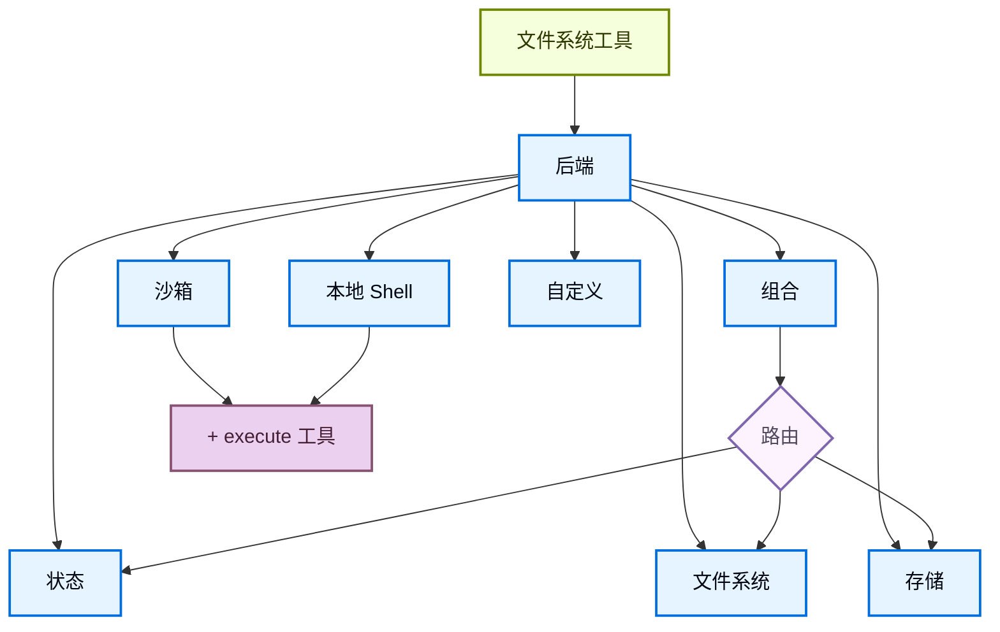

import BackendStatePy from "/snippets/backend-state-py.mdx";
import BackendStateJs from "/snippets/backend-state-js.mdx";
import BackendFilesystemPy from "/snippets/backend-filesystem-py.mdx";
import BackendFilesystemJs from "/snippets/backend-filesystem-js.mdx";
import BackendLocalShellPy from "/snippets/backend-local-shell-py.mdx";
import BackendLocalShellJs from "/snippets/backend-local-shell-js.mdx";
import BackendStorePy from "/snippets/backend-store-py.mdx";
import BackendStoreJs from "/snippets/backend-store-js.mdx";
import BackendCompositePy from "/snippets/backend-composite-py.mdx";
import BackendCompositeJs from "/snippets/backend-composite-js.mdx";

Deep Agents 通过 `ls`、`read_file`、`write_file`、`edit_file`、`glob` 和 `grep` 等工具向代理暴露文件系统接口。这些工具通过一个可插拔的后端运行。`read_file` 工具在所有后端中都原生支持图像文件（`.png`、`.jpg`、`.jpeg`、`.gif`、`.webp`），并将其作为多模态内容块返回。

沙箱和 [`LocalShellBackend`](https://reference.langchain.com/python/deepagents/backends/local_shell/LocalShellBackend) 还提供了一个 `execute` 工具。
本页说明如何：

- [选择后端](#specify-a-backend)，
- [将不同路径路由到不同后端](#route-to-different-backends)，
- [实现您自己的虚拟文件系统](#use-a-virtual-filesystem)（例如，S3 或 Postgres），
- [设置文件系统访问权限](#permissions)，

- [遵守后端协议](#protocol-reference)，

## 快速入门

以下是几个预构建的文件系统后端，您可以快速将其与您的 deep agent 一起使用：

| 内置后端                                                      | 描述                                                                                                                                                                                                                                                                                          |
| ------------------------------------------------------------- | --------------------------------------------------------------------------------------------------------------------------------------------------------------------------------------------------------------------------------------------------------------------------------------------- |
| [默认](#statebackend-ephemeral)                               | `agent = create_deep_agent(model="google_genai:gemini-3.1-pro-preview")` <br></br> 临时存储在状态中。代理的默认文件系统后端存储在 `langgraph` 状态中。请注意，此文件系统仅在*单个线程*内持久化。                                                                                              |
| [本地文件系统持久化](#filesystembackend-local-disk)           | `agent = create_deep_agent(model="google_genai:gemini-3.1-pro-preview", backend=FilesystemBackend(root_dir="/Users/nh/Desktop/"))` <br></br>这使 deep agent 可以访问您本地机器的文件系统。您可以指定代理有权访问的根目录。请注意，任何提供的 `root_dir` 必须是绝对路径。                      |
| [持久化存储（LangGraph 存储）](#storebackend-langgraph-store) | `agent = create_deep_agent(model="google_genai:gemini-3.1-pro-preview", backend=StoreBackend())` <br></br>这使代理可以访问*跨线程持久化*的长期存储。这对于存储长期记忆或适用于代理多次执行的指令非常有用。                                                                                    |
| [沙箱](/oss/python/deepagents/sandboxes)                      | `agent = create_deep_agent(model="google_genai:gemini-3.1-pro-preview", backend=sandbox)` <br></br>在隔离环境中执行代码。沙箱提供文件系统工具以及用于运行 shell 命令的 `execute` 工具。可从 Modal、Daytona、Deno 或本地 VFS 中选择。                                                          |
| [本地 shell](#localshellbackend-local-shell)                  | `agent = create_deep_agent(model="google_genai:gemini-3.1-pro-preview", backend=LocalShellBackend(root_dir=".", env={"PATH": "/usr/bin:/bin"}))` <br></br>直接在主机上进行文件系统和 shell 执行。无隔离——仅在受控开发环境中使用。请参阅下面的[安全注意事项](#localshellbackend-local-shell)。 |
| [组合](#compositebackend-router)                              | 默认为临时存储，`/memories/` 持久化。组合后端具有最大的灵活性。您可以指定文件系统中的不同路由指向不同的后端。有关可直接粘贴的示例，请参阅下面的组合路由。                                                                                                                                     |


```mermaid
graph TB
    Tools[文件系统工具] --> Backend[后端]

    Backend --> State[状态]
    Backend --> Disk[文件系统]
    Backend --> Store[存储]
    Backend --> Sandbox[沙箱]
    Backend --> LocalShell[本地 Shell]
    Backend --> Composite[组合]
    Backend --> Custom[自定义]

    Composite --> Router{路由}
    Router --> State
    Router --> Disk
    Router --> Store

    Sandbox --> Execute["#43; execute 工具"]
    LocalShell --> Execute["#43; execute 工具"]

    classDef trigger fill:#F6FFDB,stroke:#6E8900,stroke-width:2px,color:#2E3900
    classDef process fill:#E5F4FF,stroke:#006DDD,stroke-width:2px,color:#030710
    classDef decision fill:#FDF3FF,stroke:#7E65AE,stroke-width:2px,color:#504B5F
    classDef output fill:#EBD0F0,stroke:#885270,stroke-width:2px,color:#441E33

    class Tools trigger
    class Backend,State,Disk,Store,Sandbox,LocalShell,Composite,Custom process
    class Router decision
    class Execute output
```

## 内置后端

### StateBackend（临时）

<BackendStatePy />

**工作原理：**

- 通过 [`StateBackend`](https://reference.langchain.com/python/deepagents/backends/state/StateBackend) 将文件存储在当前线程的 LangGraph 代理状态中。
- 通过检查点在同一线程的多个代理轮次中持久化。

**最适合：**

- 代理用于编写中间结果的临时记事本。
- 自动清除大型工具输出，然后代理可以逐块读回。

请注意，此后端在主管代理和子代理之间共享，子代理编写的任何文件在该子代理执行完成后仍会保留在 LangGraph 代理状态中。这些文件将继续对主管代理和其他子代理可用。

### FilesystemBackend（本地磁盘）

[`FilesystemBackend`](https://reference.langchain.com/python/deepagents/backends/filesystem/FilesystemBackend) 在可配置的根目录下读写真实文件。

<Warning>
此后端授予代理直接的文件系统读/写访问权限。
请谨慎使用，仅在适当的环境中使用。

**适当的用例：**

- 本地开发 CLI（编码助手、开发工具）
- CI/CD 流水线（请参阅下面的安全注意事项）

**不适当的用例：**

- Web 服务器或 HTTP API - 请改用 `StateBackend`、`StoreBackend` 或[沙箱后端](/oss/python/deepagents/sandboxes)

**安全风险：**

- 代理可以读取任何可访问的文件，包括密钥（API 密钥、凭据、`.env` 文件）
- 结合网络工具，密钥可能通过 SSRF 攻击被窃取
- 文件修改是永久且不可逆的

**推荐的安全措施：**

1. 启用[Human in the Loop (HITL) 中间件](/oss/python/deepagents/human-in-the-loop)以审查敏感操作。
1. 将密钥排除在可访问的文件系统路径之外（尤其是在 CI/CD 中）。
1. 对于需要文件系统交互的生产环境，请使用[沙箱后端](/oss/python/deepagents/sandboxes)。
1. **始终**使用 `virtual_mode=True` 和 `root_dir` 以启用基于路径的访问限制（阻止 `..`、`~` 和根目录外的绝对路径）。
   请注意，默认设置（`virtual_mode=False`）即使设置了 `root_dir` 也不提供安全性。
   </Warning>

<BackendFilesystemPy />

**工作原理：**

- 在可配置的 `root_dir` 下读写真实文件。
- 您可以选择设置 `virtual_mode=True` 以在 `root_dir` 下沙箱化并规范化路径。
- 使用安全的路径解析，尽可能防止不安全的符号链接遍历，可以使用 ripgrep 进行快速 `grep`。

**最适合：**

- 您机器上的本地项目
- CI 沙箱
- 挂载的持久卷

### LocalShellBackend（本地 shell）

<Warning>
此后端授予代理直接的文件系统读/写访问权限**以及**在您的主机上不受限制的 shell 执行权限。
请极其谨慎地使用，仅在适当的环境中使用。

**适当的用例：**

- 本地开发 CLI（编码助手、开发工具）
- 您信任代理代码的个人开发环境
- 具有适当密钥管理的 CI/CD 流水线

**不适当的用例：**

- 生产环境（如 Web 服务器、API、多租户系统）
- 处理不受信任的用户输入或执行不受信任的代码

**安全风险：**

- 代理可以使用您的用户权限执行**任意 shell 命令**
- 代理可以读取任何可访问的文件，包括密钥（API 密钥、凭据、`.env` 文件）
- 密钥可能被暴露
- 文件修改和命令执行是**永久且不可逆的**
- 命令直接在您的主机系统上运行
- 命令可以消耗无限的 CPU、内存、磁盘

**推荐的安全措施：**

1. 启用[Human in the Loop (HITL) 中间件](/oss/python/deepagents/human-in-the-loop)以在执行前审查和批准操作。**强烈建议**这样做。
2. 仅在专用开发环境中运行。切勿在共享或生产系统上使用。
3. 对于需要 shell 执行的生产环境，请使用[沙箱后端](/oss/python/deepagents/sandboxes)。

**注意：** 启用 shell 访问后，`virtual_mode=True` 不提供安全性，因为命令可以访问系统上的任何路径。

</Warning>

<BackendLocalShellPy />

**工作原理：**

- 扩展 `FilesystemBackend`，添加了用于在主机上运行 shell 命令的 `execute` 工具。
- 命令直接在您的机器上使用 `subprocess.run(shell=True)` 运行，无沙箱化。
- 支持 `timeout`（默认 120 秒）、`max_output_bytes`（默认 100,000）、`env` 和 `inherit_env` 用于环境变量。
- Shell 命令使用 `root_dir` 作为工作目录，但可以访问系统上的任何路径。

**最适合：**

- 本地编码助手和开发工具
- 在您信任代理时进行快速开发迭代

### StoreBackend（LangGraph 存储）

<BackendStorePy />

<Tip>
  `namespace`
  参数控制数据隔离。对于多用户部署，请始终设置[命名空间工厂](/oss/python/deepagents/backends#namespace-factories)以按用户或租户隔离数据。
</Tip>

**工作原理：**

- [`StoreBackend`](https://reference.langchain.com/python/deepagents/backends/store/StoreBackend) 将文件存储在运行时提供的 LangGraph [`BaseStore`](https://reference.langchain.com/python/langchain-core/stores/BaseStore) 中，实现跨线程的持久化存储。

**最适合：**

- 当您已经使用配置好的 LangGraph 存储运行时（例如，Redis、Postgres 或 [`BaseStore`](https://reference.langchain.com/python/langchain-core/stores/BaseStore) 背后的云实现）。
- 当您通过 [LangSmith Deployment](/langsmith/deployment) 部署代理时（会自动为您的代理配置存储）。

#### 命名空间工厂

命名空间工厂控制 `StoreBackend` 读写数据的位置。它接收一个 LangGraph [`Runtime`](https://reference.langchain.com/python/langgraph/runtime/Runtime) 并返回一个字符串元组，用作存储命名空间。使用命名空间工厂在用户、租户或助手之间隔离数据。

在构造 `StoreBackend` 时将命名空间工厂传递给 `namespace` 参数：

```python
NamespaceFactory = Callable[[Runtime], tuple[str, ...]]
```

`Runtime` 提供：

- `rt.context` — 通过 LangGraph 的[上下文模式](https://langchain-ai.github.io/langgraph/concepts/runtime/)传递的用户提供的上下文（例如，`user_id`）
- `rt.server_info` — 在 LangGraph Server 上运行时的服务器特定元数据（助手 ID、图 ID、已认证用户）
- `rt.execution_info` — 执行身份信息（线程 ID、运行 ID、检查点 ID）

<Note>
`Runtime` 参数在 `deepagents>=0.5.2` 中可用。早期的 0.5.x 版本传递的是 `BackendContext` — 请参阅下面的[从 `BackendContext` 迁移](#migrating-from-backendcontext)。`rt.server_info` 和 `rt.execution_info` 需要 `deepagents>=0.5.0`。
</Note>

**常见的命名空间模式：**

```python
from deepagents.backends import StoreBackend

# 按用户：每个用户获得自己的隔离存储
backend = StoreBackend(
    namespace=lambda rt: (rt.server_info.user.identity,),  # [!code highlight]
)

# 按助手：同一助手的所有用户共享存储
backend = StoreBackend(
    namespace=lambda rt: (
        rt.server_info.assistant_id,  # [!code highlight]
    ),
)

# 按线程：存储范围限定于单个对话
backend = StoreBackend(
    namespace=lambda rt: (
        rt.execution_info.thread_id,  # [!code highlight]
    ),
)
```

您可以组合多个组件以创建更具体的范围——例如，`(user_id, thread_id)` 用于按用户按对话隔离，或附加后缀如 `"filesystem"` 以在相同范围使用多个存储命名空间时消除歧义。

命名空间组件只能包含字母数字字符、连字符、下划线、点、`@`、`+`、冒号和波浪号。通配符（`*`、`?`）会被拒绝以防止 glob 注入。

<Warning>
  `namespace` 参数在 v0.5.0 中将是**必需的**。对于新代码，请始终显式设置它。
</Warning>

<Note>
  当未提供命名空间工厂时，旧版默认使用 LangGraph 配置元数据中的
  `assistant_id`。这意味着同一[助手](/langsmith/assistants)的所有用户共享相同的存储。对于多用户[投入生产](/oss/python/deepagents/going-to-production)，请始终提供命名空间工厂。
</Note>

### CompositeBackend（路由器）

<BackendCompositePy />

**工作原理：**

- [`CompositeBackend`](https://reference.langchain.com/python/deepagents/backends/composite/CompositeBackend) 根据路径前缀将文件操作路由到不同的后端。
- 在列表和搜索结果中保留原始路径前缀。

**最适合：**

- 当您想为代理提供临时和跨线程存储时，`CompositeBackend` 允许您同时提供 `StateBackend` 和 `StoreBackend`
- 当您有多个信息源希望作为单个文件系统的一部分提供给代理时。
  - 例如，您在一个存储中将长期记忆存储在 `/memories/` 下，并且还有一个自定义后端，其文档可在 /docs/ 访问。

## 指定后端

- 将后端实例传递给 `create_deep_agent(model=..., backend=...)`。文件系统中间件将其用于所有工具。
- 后端必须实现 `BackendProtocol`（例如，`StateBackend()`、`FilesystemBackend(root_dir=".")`、`StoreBackend()`）。
- 如果省略，默认为 `StateBackend()`。

## 路由到不同后端

将命名空间的不同部分路由到不同的后端。通常用于持久化 `/memories/*` 并保持其他所有内容为临时存储。

```python
from deepagents import create_deep_agent
from deepagents.backends import CompositeBackend, StateBackend, FilesystemBackend

agent = create_deep_agent(
    model="google_genai:gemini-3.1-pro-preview",
    backend=CompositeBackend(
        default=StateBackend(),
        routes={
            "/memories/": FilesystemBackend(root_dir="/deepagents/myagent", virtual_mode=True),
        },
    )
)
```

行为：

- `/workspace/plan.md` → `StateBackend`（临时）
- `/memories/agent.md` → `FilesystemBackend` 在 `/deepagents/myagent` 下
- `ls`、`glob`、`grep` 聚合结果并显示原始路径前缀。

注意：

- 更长的前缀优先（例如，路由 `"/memories/projects/"` 可以覆盖 `"/memories/"`）。
- 对于 StoreBackend 路由，请确保通过 `create_deep_agent(model=..., store=...)` 提供存储或由平台配置。

## 使用虚拟文件系统

构建自定义后端以将远程或数据库文件系统（例如，S3 或 Postgres）投影到工具命名空间中。

设计指南：

- 路径是绝对的（`/x/y.txt`）。决定如何将它们映射到您的存储键/行。
- 高效实现 `ls` 和 `glob`（尽可能进行服务器端过滤，否则进行本地过滤）。
- 对于外部持久化（S3、Postgres 等），在写入/编辑结果中返回 `files_update=None`（Python）或省略 `filesUpdate`（JS）——只有内存状态后端需要返回文件更新字典。

- 使用 `ls` 和 `glob` 作为方法名。
- 返回带有 `error` 字段的结构化结果类型，用于缺失文件或无效模式（不要引发异常）。

S3 风格大纲：

```python
from deepagents.backends.protocol import (
    BackendProtocol, WriteResult, EditResult, LsResult, ReadResult, GrepResult, GlobResult,
)

class S3Backend(BackendProtocol):
    def __init__(self, bucket: str, prefix: str = ""):
        self.bucket = bucket
        self.prefix = prefix.rstrip("/")

    def _key(self, path: str) -> str:
        return f"{self.prefix}{path}"

    def ls(self, path: str) -> LsResult:
        # 列出 _key(path) 下的对象；构建 FileInfo 条目（path, size, modified_at）
        ...

    def read(self, file_path: str, offset: int = 0, limit: int = 2000) -> ReadResult:
        # 获取对象；返回 ReadResult(file_data=...) 或 ReadResult(error=...)
        ...

    def grep(self, pattern: str, path: str | None = None, glob: str | None = None) -> GrepResult:
        # 可选地进行服务器端过滤；否则列出并扫描内容
        ...

    def glob(self, pattern: str, path: str = "/") -> GlobResult:
        # 在路径上应用 glob，跨键进行
        ...

    def write(self, file_path: str, content: str) -> WriteResult:
        # 强制执行仅创建语义；返回 WriteResult(path=file_path, files_update=None)
        ...

    def edit(self, file_path: str, old_string: str, new_string: str, replace_all: bool = False) -> EditResult:
        # 读取 → 替换（根据唯一性与 replace_all） → 写入 → 返回出现次数
        ...
```

Postgres 风格大纲：

- 表 `files(path text primary key, content text, created_at timestamptz, modified_at timestamptz)`
- 将工具操作映射到 SQL：
  - `ls` 使用 `WHERE path LIKE $1 || '%'`
  - `glob` 在 SQL 中过滤或获取后在 Python 中应用 glob
  - `grep` 可以按扩展名或最后修改时间获取候选行，然后扫描行

## 权限

使用[权限](/oss/python/deepagents/permissions)来声明式地控制代理可以读取或写入哪些文件和目录。权限适用于内置的文件系统工具，并在调用后端之前进行评估。

```python
from deepagents import create_deep_agent, FilesystemPermission

agent = create_deep_agent(
    model="google_genai:gemini-3.1-pro-preview",
    backend=CompositeBackend(
        default=StateBackend(),
        routes={
            "/memories/": StoreBackend(
                namespace=lambda rt: (rt.server_info.user.identity,),
            ),
            "/policies/": StoreBackend(
                namespace=lambda rt: (rt.context.org_id,),
            ),
        },
    ),
    permissions=[
        FilesystemPermission(
            operations=["write"],
            paths=["/policies/**"],
            mode="deny",
        ),
    ],
)
```

有关完整选项集，包括规则排序、子代理权限和组合后端交互，请参阅[权限指南](/oss/python/deepagents/permissions)。

## 添加策略钩子

对于超出基于路径的允许/拒绝规则（速率限制、审计日志、内容检查）的自定义验证逻辑，通过子类化或包装后端来强制执行企业规则。

阻止在选定前缀下的写入/编辑（子类化）：

```python
from deepagents.backends.filesystem import FilesystemBackend
from deepagents.backends.protocol import WriteResult, EditResult

class GuardedBackend(FilesystemBackend):
    def __init__(self, *, deny_prefixes: list[str], **kwargs):
        super().__init__(**kwargs)
        self.deny_prefixes = [p if p.endswith("/") else p + "/" for p in deny_prefixes]

    def write(self, file_path: str, content: str) -> WriteResult:
        if any(file_path.startswith(p) for p in self.deny_prefixes):
            return WriteResult(error=f"Writes are not allowed under {file_path}")
        return super().write(file_path, content)

    def edit(self, file_path: str, old_string: str, new_string: str, replace_all: bool = False) -> EditResult:
        if any(file_path.startswith(p) for p in self.deny_prefixes):
            return EditResult(error=f"Edits are not allowed under {file_path}")
        return super().edit(file_path, old_string, new_string, replace_all)
```

通用包装器（适用于任何后端）：

```python
from deepagents.backends.protocol import (
    BackendProtocol, WriteResult, EditResult, LsResult, ReadResult, GrepResult, GlobResult,
)

class PolicyWrapper(BackendProtocol):
    def __init__(self, inner: BackendProtocol, deny_prefixes: list[str] | None = None):
        self.inner = inner
        self.deny_prefixes = [p if p.endswith("/") else p + "/" for p in (deny_prefixes or [])]

    def _deny(self, path: str) -> bool:
        return any(path.startswith(p) for p in self.deny_prefixes)

    def ls(self, path: str) -> LsResult:
        return self.inner.ls(path)

    def read(self, file_path: str, offset: int = 0, limit: int = 2000) -> ReadResult:
        return self.inner.read(file_path, offset=offset, limit=limit)
    def grep(self, pattern: str, path: str | None = None, glob: str | None = None) -> GrepResult:
        return self.inner.grep(pattern, path, glob)
    def glob(self, pattern: str, path: str = "/") -> GlobResult:
        return self.inner.glob(pattern, path)
    def write(self, file_path: str, content: str) -> WriteResult:
        if self._deny(file_path):
            return WriteResult(error=f"Writes are not allowed under {file_path}")
        return self.inner.write(file_path, content)
    def edit(self, file_path: str, old_string: str, new_string: str, replace_all: bool = False) -> EditResult:
        if self._deny(file_path):
            return EditResult(error=f"Edits are not allowed under {file_path}")
        return self.inner.edit(file_path, old_string, new_string, replace_all)
```

## 从后端工厂迁移

<Warning>
自 `deepagents` 0.5.0 起，后端工厂模式已**弃用**。请直接传递预构建的后端实例，而不是工厂函数。

</Warning>

以前，像 `StateBackend` 和 `StoreBackend` 这样的后端需要一个接收运行时对象的工厂函数，因为它们需要运行时上下文（状态、存储）才能运行。现在后端通过 LangGraph 的 `get_config()`、`get_store()` 和 `get_runtime()` 辅助函数内部解析此上下文，因此您可以直接传递实例。

### 变更内容

| 之前（已弃用）                                                       | 之后                                                    |
| -------------------------------------------------------------------- | ------------------------------------------------------- |
| `backend=lambda rt: StateBackend(rt)`                                | `backend=StateBackend()`                                |
| `backend=lambda rt: StoreBackend(rt)`                                | `backend=StoreBackend()`                                |
| `backend=lambda rt: CompositeBackend(default=StateBackend(rt), ...)` | `backend=CompositeBackend(default=StateBackend(), ...)` |
| `backend: (config) => new StateBackend(config)`                      | `backend: new StateBackend()`                           |
| `backend: (config) => new StoreBackend(config)`                      | `backend: new StoreBackend()`                           |

### 已弃用的 API

| 已弃用                                                 | 替代方案                                                     |
| ------------------------------------------------------ | ------------------------------------------------------------ |
| 将可调用对象传递给 `create_deep_agent` 中的 `backend=` | 直接传递后端实例                                             |
| `StateBackend(runtime)` 上的 `runtime` 构造函数参数    | `StateBackend()`（无需参数）                                 |
| `StoreBackend(runtime)` 上的 `runtime` 构造函数参数    | `StoreBackend()` 或 `StoreBackend(namespace=..., store=...)` |
| `WriteResult` 和 `EditResult` 上的 `files_update` 字段 | 状态写入现在由后端内部处理                                   |
| 中间件写入/编辑工具中的 `Command` 包装                 | 工具返回普通字符串；不需要 `Command(update=...)`             |

<Note>
  工厂模式在运行时仍然有效，但会发出弃用警告。请在下一个主要版本之前更新您的代码以使用直接实例。
</Note>

### 迁移示例

```python
# 之前（已弃用）
from deepagents import create_deep_agent
from deepagents.backends import CompositeBackend, StateBackend, StoreBackend

agent = create_deep_agent(
    model="google_genai:gemini-3.1-pro-preview",
    backend=lambda rt: CompositeBackend(
        default=StateBackend(rt),
        routes={"/memories/": StoreBackend(rt, namespace=lambda rt: (rt.server_info.user.identity,))},
    ),
)

# 之后
agent = create_deep_agent(
    model="google_genai:gemini-3.1-pro-preview",
    backend=CompositeBackend(
        default=StateBackend(),
        routes={"/memories/": StoreBackend(namespace=lambda rt: (rt.server_info.user.identity,))},
    ),
)
```

### 从 `BackendContext` 迁移

在 `deepagents>=0.5.2`（Python）和 `deepagents>=1.9.1`（TypeScript）中，命名空间工厂直接接收 LangGraph [`Runtime`](https://reference.langchain.com/python/langgraph/runtime/Runtime)，而不是 `BackendContext` 包装器。旧的 `BackendContext` 形式仍然通过向后兼容的 `.runtime` 和 `.state` 访问器工作，但这些访问器会发出弃用警告，并将在 `deepagents>=0.7` 中移除。

**变更内容：**

- 工厂参数现在是 `Runtime`，而不是 `BackendContext`。
- 删除 `.runtime` 访问器——例如，`ctx.runtime.context.user_id` 变为 `rt.server_info.user.identity`。
- `ctx.state` 没有直接替代方案。命名空间信息应该是只读的，并且在运行生命周期内保持稳定，而状态是可变的，并且会逐步变化——从中派生命名空间可能导致数据最终位于不一致的键下。如果您有需要读取代理状态的用例，请[提交 issue](https://github.com/langchain-ai/deepagents/issues)。

```python
# 之前（已弃用，在 v0.7 中移除）
StoreBackend(
    namespace=lambda ctx: (ctx.runtime.context.user_id,),  # [!code --]
)

# 之后
StoreBackend(
    namespace=lambda rt: (rt.server_info.user.identity,),  # [!code ++]
)
```

## 协议参考

后端必须实现 [`BackendProtocol`](https://reference.langchain.com/python/deepagents/backends/protocol/BackendProtocol)。

必需的方法：

- `ls(path: str) -> LsResult`
  - 返回至少包含 `path` 的条目。在可用时包含 `is_dir`、`size`、`modified_at`。按 `path` 排序以获得确定性输出。
- `read(file_path: str, offset: int = 0, limit: int = 2000) -> ReadResult`
  - 成功时返回文件数据。文件缺失时，返回 `ReadResult(error="Error: File '/x' not found")`。
- `grep(pattern: str, path: Optional[str] = None, glob: Optional[str] = None) -> GrepResult`
  - 返回结构化匹配项。出错时，返回 `GrepResult(error="...")`（不要引发异常）。
- `glob(pattern: str, path: str = "/") -> GlobResult`
  - 将匹配的文件作为 `FileInfo` 条目返回（如果没有则为空列表）。
- `write(file_path: str, content: str) -> WriteResult`
  - 仅创建。冲突时，返回 `WriteResult(error=...)`。成功时，设置 `path`，对于状态后端设置 `files_update={...}`；外部后端应使用 `files_update=None`。
- `edit(file_path: str, old_string: str, new_string: str, replace_all: bool = False) -> EditResult`
  - 除非 `replace_all=True`，否则强制 `old_string` 的唯一性。如果未找到，返回错误。成功时包含 `occurrences`。

支持类型：

- `LsResult(error, entries)` — 成功时 `entries` 是 `list[FileInfo]`，失败时为 `None`。
- `ReadResult(error, file_data)` — 成功时 `file_data` 是 `FileData` 字典，失败时为 `None`。
- `GrepResult(error, matches)` — 成功时 `matches` 是 `list[GrepMatch]`，失败时为 `None`。
- `GlobResult(error, matches)` — 成功时 `matches` 是 `list[FileInfo]`，失败时为 `None`。
- `WriteResult(error, path, files_update)`
- `EditResult(error, path, files_update, occurrences)`
- `FileInfo` 字段：`path`（必需），可选 `is_dir`、`size`、`modified_at`。
- `GrepMatch` 字段：`path`、`line`、`text`。
- `FileData` 字段：`content`（str）、`encoding`（`"utf-8"` 或 `"base64"`）、`created_at`、`modified_at`。
  :::

---

<div className="source-links">
  <Callout icon="terminal-2">
    [将这些文档连接](/use-these-docs)到 Claude、VSCode 等，通过 MCP
    获取实时答案。
  </Callout>
  <Callout icon="edit">
    [在 GitHub
    上编辑此页面](https://github.com/langchain-ai/docs/edit/main/src/oss/deepagents/backends.mdx)
    或 [提交 issue](https://github.com/langchain-ai/docs/issues/new/choose)。
  </Callout>
</div>
