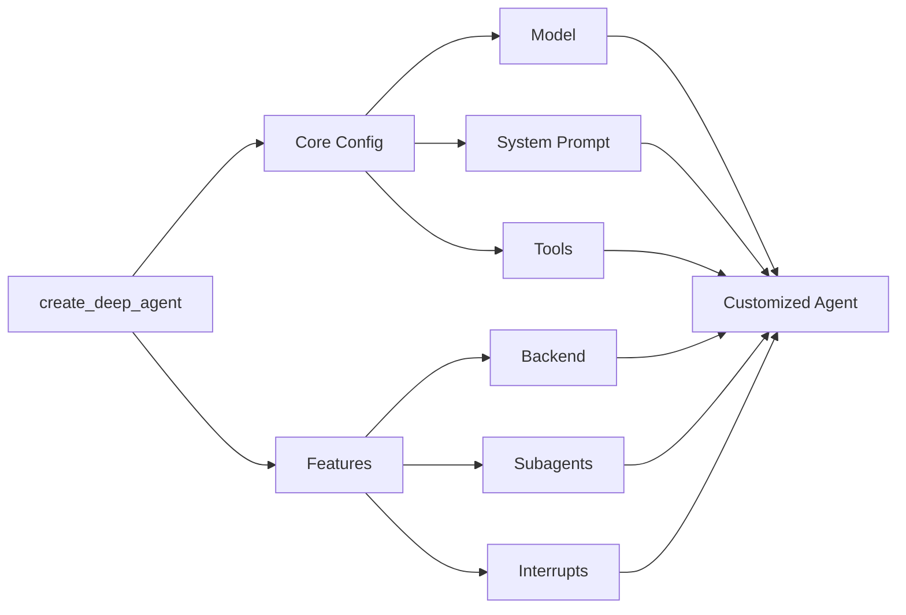

## 模型

默认情况下，`deepagents` 使用 [`claude-sonnet-4-5-20250929`](https://platform.claude.com/docs/en/about-claude/models/overview)。你可以通过传递任何支持的<Tooltip tip="遵循 `provider:model` 格式的字符串（例如 openai:gpt-5）" cta="查看映射" href="https://reference.langchain.com/python/langchain/models/#langchain.chat_models.init_chat_model(model)">模型标识符字符串</Tooltip>或 [LangChain 模型对象](/oss/python/integrations/chat)来自定义使用的模型。

<Tip>
    使用 `provider:model` 格式（例如 `openai:gpt-5`）在模型之间快速切换。
</Tip>

<CodeGroup>
    ```python Model string
    from langchain.chat_models import init_chat_model
    from deepagents import create_deep_agent

    model = init_chat_model(model="openai:gpt-5")
    agent = create_deep_agent(model=model)
    ```

    ```python LangChain model object
    # ollama pull llama3.1
    from langchain_ollama import ChatOllama
    from langchain.chat_models import init_chat_model
    from deepagents import create_deep_agent

    model = init_chat_model(
        model=ChatOllama(
            model="llama3.1",
            temperature=0,
            # other params...
        )
    )
    agent = create_deep_agent(model=model)
    ```
</CodeGroup>


## 系统提示

Deep agents 配备了一个受 Claude Code 系统提示启发的内置系统提示。默认系统提示包含使用内置规划工具、文件系统工具和子 agent 的详细指令。

针对特定用例定制的每个 deep agent 都应包含针对该用例的自定义系统提示。

```python
from deepagents import create_deep_agent

research_instructions = """\
You are an expert researcher. Your job is to conduct \
thorough research, and then write a polished report. \
"""

agent = create_deep_agent(
    system_prompt=research_instructions,
)
```


## 工具

除了你提供的自定义工具外，deep agents 还包括用于规划、文件管理和子 agent 生成的[内置工具](/oss/python/deepagents/overview#core-capabilities)。

```python
import os
from typing import Literal
from tavily import TavilyClient
from deepagents import create_deep_agent

tavily_client = TavilyClient(api_key=os.environ["TAVILY_API_KEY"])

def internet_search(
    query: str,
    max_results: int = 5,
    topic: Literal["general", "news", "finance"] = "general",
    include_raw_content: bool = False,
):
    """Run a web search"""
    return tavily_client.search(
        query,
        max_results=max_results,
        include_raw_content=include_raw_content,
        topic=topic,
    )

agent = create_deep_agent(
    tools=[internet_search]
)
```


## 技能

你可以使用[技能](/oss/python/deepagents/overview)为你的 deep agent 提供新的能力和专业知识。
虽然[工具](/oss/python/deepagents/customization#tools)倾向于涵盖较低级别的功能，如原生文件系统操作或规划，但技能可以包含有关如何完成任务的详细指令、参考信息和其他资源，如模板。
这些文件仅在 agent 确定该技能对当前提示有用时才会加载。
这种渐进式披露减少了 agent 在启动时需要考虑的 token 和上下文的数量。

有关示例技能，请参阅 [Deep Agent 示例技能](https://github.com/langchain-ai/deepagentsjs/tree/main/examples/skills)。

要向你的 deep agent 添加技能，请将它们作为参数传递给 `create_deep_agent`：

<Tabs>
  <Tab title="StateBackend">
    ```python
    from urllib.request import urlopen
    from deepagents import create_deep_agent
    from langgraph.checkpoint.memory import MemorySaver

    checkpointer = MemorySaver()

    skill_url = "https://raw.githubusercontent.com/langchain-ai/deepagentsjs/refs/heads/main/examples/skills/langgraph-docs/SKILL.md"
    with urlopen(skill_url) as response:
        skill_content = response.read().decode('utf-8')

    skills_files = {
        "/skills/langgraph-docs/SKILL.md": skill_content
    }

    agent = create_deep_agent(
        skills=["./skills/"],
        checkpointer=checkpointer,
    )

    result = agent.invoke(
        {
            "messages": [
                {
                    "role": "user",
                    "content": "What is langgraph?",
                }
            ],
            # Seed the default StateBackend's in-state filesystem (virtual paths must start with "/").
            "files": skills_files
        },
        config={"configurable": {"thread_id": "12345"}},
    )
    ```
  </Tab>
  <Tab title="StoreBackend">
    ```python
    from urllib.request import urlopen
    from deepagents import create_deep_agent
    from deepagents.backends import StoreBackend
    from langgraph.store.memory import InMemoryStore


    store = InMemoryStore()

    skill_url = "https://raw.githubusercontent.com/langchain-ai/deepagentsjs/refs/heads/main/examples/skills/langgraph-docs/SKILL.md"
    with urlopen(skill_url) as response:
        skill_content = response.read().decode('utf-8')

    store.put(
        namespace=("filesystem",),
        key="/skills/langgraph-docs/SKILL.md",
        value=skill_content
    )

    agent = create_deep_agent(
        backend=(lambda rt: StoreBackend(rt)),
        store=store,
        skills=["./skills/"]
    )

    result = agent.invoke(
        {
            "messages": [
                {
                    "role": "user",
                    "content": "What is langgraph?",
                }
            ]
        },
        config={"configurable": {"thread_id": "12345"}},
    )
    ```
  </Tab>
  <Tab title="FilesystemBackend">
    ```python
    from deepagents import create_deep_agent
    from langgraph.checkpoint.memory import MemorySaver
    from deepagents.backends.filesystem import FilesystemBackend

    # Checkpointer is REQUIRED for human-in-the-loop
    checkpointer = MemorySaver()

    agent = create_deep_agent(
        backend=FilesystemBackend(root_dir="/Users/user/{project}"),
        skills=["/Users/user/{project}/skills/"],
        interrupt_on={
            "write_file": True,  # Default: approve, edit, reject
            "read_file": False,  # No interrupts needed
            "edit_file": True    # Default: approve, edit, reject
        },
        checkpointer=checkpointer,  # Required!
    )

    result = agent.invoke(
        {
            "messages": [
                {
                    "role": "user",
                    "content": "What is langgraph?",
                }
            ]
        },
        config={"configurable": {"thread_id": "12345"}},
    )
    ```
  </Tab>
</Tabs>


## 记忆

使用 [`AGENTS.md` 文件](https://agents.md/)为你的 deep agent 提供额外的上下文。

在创建 deep agent 时，你可以将一个或多个文件路径传递给 `memory` 参数：

<Tabs>
  <Tab title="StateBackend">
    ```python
    from urllib.request import urlopen

    from deepagents import create_deep_agent
    from deepagents.backends.utils import create_file_data
    from langgraph.checkpoint.memory import MemorySaver

    with urlopen("https://raw.githubusercontent.com/langchain-ai/deepagents/refs/heads/master/examples/text-to-sql-agent/AGENTS.md") as response:
        agents_md = response.read().decode("utf-8")
    checkpointer = MemorySaver()

    agent = create_deep_agent(
        memory=[
            "/AGENTS.md"
        ],
        checkpointer=checkpointer,
    )

    result = agent.invoke(
        {
            "messages": [
                {
                    "role": "user",
                    "content": "Please tell me what's in your memory files.",
                }
            ],
            # Seed the default StateBackend's in-state filesystem (virtual paths must start with "/").
            "files": {"/AGENTS.md": create_file_data(agents_md)},
        },
        config={"configurable": {"thread_id": "123456"}},
    )
    ```
  </Tab>
  <Tab title="StoreBackend">
    ```python
    from urllib.request import urlopen

    from deepagents import create_deep_agent
    from deepagents.backends import StoreBackend
    from deepagents.backends.utils import create_file_data
    from langgraph.store.memory import InMemoryStore

    with urlopen("https://raw.githubusercontent.com/langchain-ai/deepagents/refs/heads/master/examples/text-to-sql-agent/AGENTS.md") as response:
        agents_md = response.read().decode("utf-8")

    # Create the store and add the file to it
    store = InMemoryStore()
    file_data = create_file_data(agents_md)
    store.put(
        namespace=("filesystem",),
        key="/AGENTS.md",
        value=file_data
    )

    agent = create_deep_agent(
        backend=(lambda rt: StoreBackend(rt)),
        store=store,
        memory=[
            "/AGENTS.md"
        ]
    )

    result = agent.invoke(
        {
            "messages": [
                {
                    "role": "user",
                    "content": "Please tell me what's in your memory files.",
                }
            ],
            "files": {"/AGENTS.md": create_file_data(agents_md)},
        },
        config={"configurable": {"thread_id": "12345"}},
    )
    ```
  </Tab>
  <Tab title="FilesystemBackend">
    ```python
    from deepagents import create_deep_agent
    from langgraph.checkpoint.memory import MemorySaver
    from deepagents.backends import FilesystemBackend

    # Checkpointer is REQUIRED for human-in-the-loop
    checkpointer = MemorySaver()

    agent = create_deep_agent(
        backend=FilesystemBackend(root_dir="/Users/user/{project}"),
        memory=[
            "./AGENTS.md"
        ],
        interrupt_on={
            "write_file": True,  # Default: approve, edit, reject
            "read_file": False,  # No interrupts needed
            "edit_file": True    # Default: approve, edit, reject
        },
        checkpointer=checkpointer,  # Required!
    )
    ```
  </Tab>
</Tabs>

---

<Callout icon="pen-to-square" iconType="regular">
    [Edit this page on GitHub](https://github.com/langchain-ai/docs/edit/main/src/oss/deepagents/customization.mdx) or [file an issue](https://github.com/langchain-ai/docs/issues/new/choose).
</Callout>
<Tip icon="terminal" iconType="regular">
    [Connect these docs](/use-these-docs) to Claude, VSCode, and more via MCP for real-time answers.
</Tip>
<div class='fixed right-2 bg-white bottom-2'></div>