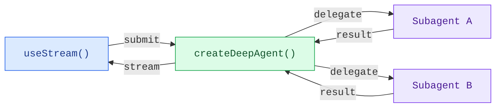

构建能够实时可视化深度代理工作流程的前端界面。这些模式展示了如何渲染子代理进度、任务规划、流式内容以及来自使用 `createDeepAgent` 创建的代理的 IDE 类型沙盒体验。

## 架构

深度代理采用协调者-工作者架构。主代理计划任务并将任务委派给专门的子代理，每个子代理都在隔离环境中运行。在前端中，`useStream` 表面化了协调者的消息以及每个子代理的流式状态。



```python
from deepagents import create_deep_agent

agent = create_deep_agent(
    model="google_genai:gemini-3.1-pro-preview",
    tools=[get_weather],
    system_prompt="You are a helpful assistant",
    subagents=[
        {
            "name": "researcher",
            "description": "Research assistant",
        }
    ],
)
```

在前端，使用 `useStream` 连接代理与 `createAgent` 的方式相同。深度代理模式利用了额外的 `useStream` 特性，如 `stream.subagents`、`stream.values.todos` 和 `filterSubagentMessages` 来渲染特定于子代理的用户界面。

```ts
import { useStream } from "@langchain/react";

function App() {
  const stream = useStream<typeof agent>({
    apiUrl: "http://localhost:2024",
    assistantId: "agent",
  });

  // 深度代理状态超出消息之外的部分
  const todos = stream.values?.todos;
  const subagents = stream.subagents;
}
```

## 模式

<CardGroup cols={3}>
  <Card title="子代理流" icon="arrows-split" href="/oss/python/deepagents/frontend/subagent-streaming">
    显示具有流式内容、进度跟踪和可折叠卡片的专家级子代理。
  </Card>
  <Card title="待办事项列表" icon="list-check" href="/oss/python/deepagents/frontend/todo-list">
    使用与代理状态同步的实时待办事项列表追踪代理进度。
  </Card>
  <Card title="沙盒" icon="code" href="/oss/python/deepagents/frontend/sandbox">
    构建一个具有文件浏览器、代码查看器和差异面板的 IDE 类型界面，这些功能由沙盒支持。
  </Card>
</CardGroup>

## 相关模式

[LangChain 前端模式](/oss/python/langchain/frontend/overview)，包括
Markdown 消息、工具调用以及人类在环中操作，都适用于深度代理。深度代理基于相同的 LangGraph 运行时，因此 `useStream` 提供了相同的核心 API。

---

<div className="source-links">
<Callout icon="edit">
    [在 GitHub 上编辑此页面](https://github.com/langchain-ai/docs/edit/main/src/oss/deepagents/frontend/overview.mdx) 或 [提交问题](https://github.com/langchain-ai/docs/issues/new/choose)。
</Callout>
<Callout icon="terminal-2">
    通过 MCP 连接这些文档，实现实时答案与 Claude、VSCode 等工具的交互。
</Callout>
</div>