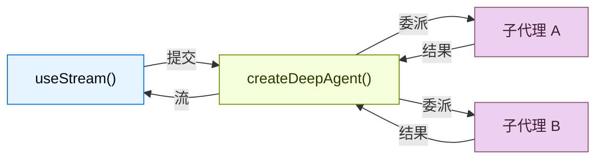

构建可实时可视化深度代理工作流的前端。这些模式展示了如何渲染子代理进度、任务规划、流式内容以及使用 `createDeepAgent` 创建的代理的类 IDE 沙盒体验。

## 架构

Deep Agents 使用协调者-工作者架构。主代理规划任务并委派给专门的子代理，每个子代理都在隔离环境中运行。在前端，`useStream` 同时呈现协调者的消息和每个子代理的流式状态。


```mermaid
%%{
  init: {
    "fontFamily": "monospace",
    "flowchart": {
      "curve": "curve"
    }
  }
}%%
graph LR
  FRONTEND["useStream()"]
  BACKEND["createDeepAgent()"]
  SUB1["子代理 A"]
  SUB2["子代理 B"]

  BACKEND --"流"--> FRONTEND
  FRONTEND --"提交"--> BACKEND
  BACKEND --"委派"--> SUB1
  BACKEND --"委派"--> SUB2
  SUB1 --"结果"--> BACKEND
  SUB2 --"结果"--> BACKEND

  classDef blueHighlight fill:#E5F4FF,stroke:#006DDD,color:#030710;
  classDef greenHighlight fill:#F6FFDB,stroke:#6E8900,color:#2E3900;
  classDef purpleHighlight fill:#EBD0F0,stroke:#885270,color:#441E33;
  class FRONTEND blueHighlight;
  class BACKEND greenHighlight;
  class SUB1,SUB2 purpleHighlight;
```

```python
from deepagents import create_deep_agent

agent = create_deep_agent(
    model="google_genai:gemini-3.1-pro-preview",
    tools=[get_weather],
    system_prompt="You are a helpful assistant",
    subagents=[
        {
            "name": "researcher",
            "description": "Research assistant",
        }
    ],
)
```


在前端，使用 `useStream` 连接的方式与使用 `createAgent` 相同。深度代理模式使用额外的 `useStream` 功能，如 `stream.subagents`、`stream.values.todos` 和 `filterSubagentMessages` 来渲染特定于子代理的用户界面。

```ts
import { useStream } from "@langchain/react";

function App() {
  const stream = useStream<typeof agent>({
    apiUrl: "http://localhost:2024",
    assistantId: "agent",
  });

  // 超越消息的深度代理状态
  const todos = stream.values?.todos;
  const subagents = stream.subagents;
}
```

## 模式

<CardGroup cols={3}>
  <Card title="子代理流" icon="arrows-split" href="/oss/python/deepagents/frontend/subagent-streaming">
    显示具有流式内容、进度跟踪和可折叠卡片的专业子代理。
  </Card>
  <Card title="待办事项列表" icon="list-check" href="/oss/python/deepagents/frontend/todo-list">
    使用从代理状态同步的实时待办事项列表跟踪代理进度。
  </Card>
  <Card title="沙盒" icon="code" href="/oss/python/deepagents/frontend/sandbox">
    构建一个类 IDE 的用户界面，包含文件浏览器、代码查看器和由沙盒支持的差异面板。
  </Card>
</CardGroup>

## 相关模式

[LangChain 前端模式](/oss/python/langchain/frontend/overview)，包括
Markdown 消息、工具调用和人在回路中，也都适用于深度
代理。Deep Agents 构建在相同的 LangGraph 运行时之上，因此
`useStream` 提供相同的核心 API。

---

<div className="source-links">
<Callout icon="terminal-2">
    [连接这些文档](/use-these-docs) 到 Claude、VSCode 等，通过 MCP 获取实时答案。
</Callout>
<Callout icon="edit">
    [在 GitHub 上编辑此页面](https://github.com/langchain-ai/docs/edit/main/src/oss/deepagents/frontend/overview.mdx) 或 [提交问题](https://github.com/langchain-ai/docs/issues/new/choose)。
</Callout>
</div>