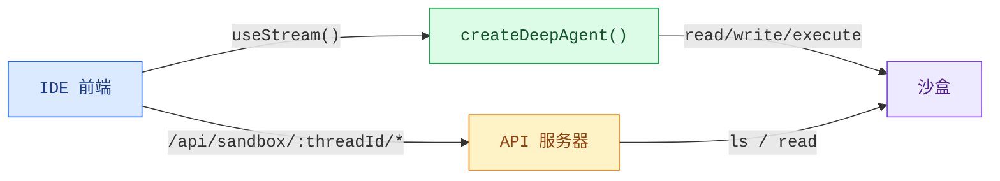
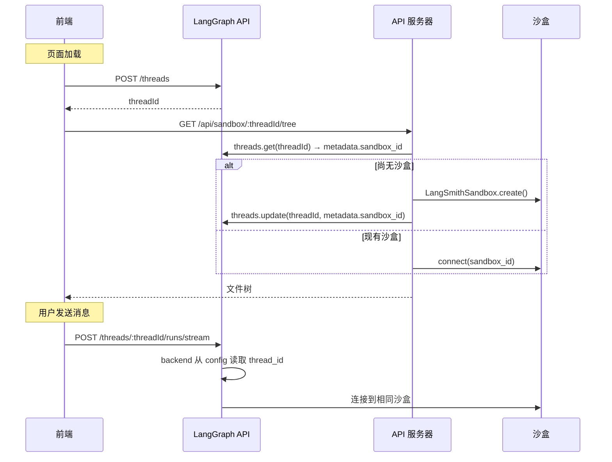

Coding agent 需要的不仅仅是一个聊天窗口。它们需要文件浏览器、代码
查看器和差异面板，一种 IDE 体验。此模式将深度代理连接到 [沙盒](/oss/python/deepagents/sandboxes)，以便它可以在隔离环境中读取、
写入和执行代码，然后通过自定义 API 服务器暴露沙盒
文件系统，以便前端可以在代理工作时实时显示文件。

import { PatternEmbed } from "/snippets/pattern-embed.jsx";

<PatternEmbed pattern="deep-agent-ide" minHeight={700} />

## 架构

沙盒模式有三层：

1. **带有沙盒后端的深度代理：** 代理自动从沙盒获取文件系统工具
   （`read_file`、`write_file`、`edit_file`、`execute`）

2. **自定义 API 服务器** — 一个通过 `langgraph.json` 的 `http.app`
   字段暴露的 FastAPI 应用，提供前端可以调用的文件浏览端点


3. **IDE 前端：** 三面板布局（文件树、代码/差异查看器、聊天）
   在代理进行更改时实时同步文件



## 沙盒生命周期

在深入代码之前，了解沙盒的作用域很重要。作用域策略决定谁共享沙盒、沙盒存活多久以及如何在运行时解析它。

### 线程作用域沙盒（推荐）

每个 LangGraph 线程拥有自己的沙盒。沙盒 ID 存储在线程的
metadata 中，并在运行时通过 `getConfig()` 解析。
这是大多数应用的推荐方法：

- 对话是隔离的 — 一个线程中的文件更改不会影响另一个
- 沙盒状态在页面刷新后持久化（相同线程 = 相同沙盒）
- 清理很简单：当线程被删除时，其沙盒也可以被删除



### 代理作用域沙盒

同一助手下的所有线程共享单个沙盒。适用于
希望更改跨对话保留的持久化项目环境：

```python
from langgraph.config import get_config

def get_sandbox_backend_for_assistant():
    config = get_config()
    assistant_id = config.get("metadata", {}).get("assistant_id")
    return get_or_create_sandbox_for_assistant(assistant_id)
```


### 用户作用域沙盒

每个用户在所有线程中获得自己的沙盒。需要自定义
身份验证和用户识别：

```python
from langgraph.config import get_config

def get_sandbox_backend_for_user():
    config = get_config()
    user_id = config.get("configurable", {}).get("user_id")
    return get_or_create_sandbox_for_user(user_id)
```


### 会话作用域沙盒（客户端）

对于没有 LangGraph 线程的更简单应用，前端可以生成
session ID 并直接传递。此方法不会跨
浏览器会话持久化，最适合演示或原型制作：

```python
import uuid
import urllib.parse
import urllib.request

session_id = str(uuid.uuid4())
query = urllib.parse.urlencode({"sessionId": session_id})
urllib.request.urlopen(f"http://localhost:2024/api/sandbox/tree?{query}")
```


本指南的其余部分使用 **线程作用域沙盒** 作为主要示例。

## 设置代理

### 选择沙盒提供商

Deep Agents 支持多个 [沙盒提供商](/oss/python/integrations/sandboxes)。任何实现 `SandboxBackendProtocol` 的提供商都可以工作：

```python
from deepagents import create_deep_agent
from deepagents.sandbox import LangSmithSandbox  # 或 DaytonaSandbox 等

sandbox = LangSmithSandbox.create()
agent = create_deep_agent(model="google_genai:gemini-3.1-pro-preview", backend=sandbox)
```


代理自动获取文件系统工具（`read_file`、`write_file`、
`edit_file`、`ls`、`glob`、`grep`）和用于运行 shell
命令的 `execute` 工具。无需工具配置。

### 每个线程解析一个沙盒

不是在模块级别创建沙盒（这将在所有线程间共享且可能过期），而是在运行时每个线程解析沙盒。沙盒通过 `getConfig()` 从 LangGraph config 读取 `thread_id`：


```python
from deepagents import create_deep_agent
from deepagents.sandbox import LangSmithSandbox
from langgraph.config import get_config


def get_or_create_sandbox_for_thread(thread_id: str) -> LangSmithSandbox:
    # 根据 thread_id 查找或创建沙盒
    ...


sandbox = LangSmithSandbox(
    resolve=lambda: get_or_create_sandbox_for_thread(
        get_config()["configurable"]["thread_id"]
    ),
)

agent = create_deep_agent(
    model="google_genai:gemini-3.1-pro-preview",
    backend=sandbox,
)
```


### 初始化沙盒

在代理运行之前，使用
`uploadFiles` 填充沙盒项目文件：

<Info>
  对于 **LangSmith** 沙盒，容器镜像和资源限制来自
  [沙盒模板](/langsmith/sandbox-templates)。创建沙盒时传递 `templateName`
  （参见上面的 `get_or_create_sandbox_for_thread`）。`upload_files` 在该镜像之上
  在运行时初始化或更新项目文件。
</Info>

```ts
const SEED_FILES: Record<string, string> = {
  "package.json": JSON.stringify({ name: "my-app", version: "1.0.0" }, null, 2),
  "src/index.js": 'console.log("Hello");',
};

const encoder = new TextEncoder();
await sandbox.uploadFiles(
  Object.entries(SEED_FILES).map(([path, content]) => [`/app/${path}`, encoder.encode(content)]),
);
```

<Tip>
  上传 `package.json` 后运行 `sandbox.execute("cd /app && npm install")` 以便在代理启动前安装
  依赖项。
</Tip>

## 添加文件浏览 API


代理可以读取和写入文件，但前端也需要直接访问
浏览沙盒文件系统。添加一个自定义 [FastAPI](https://fastapi.tiangolo.com) API 服务器
并通过 `langgraph.json` 中的 `http.app` 字段暴露它。


### 创建 API 服务器

沙盒 API 端点使用线程 ID 作为 URL 路径参数。这
确保前端始终访问当前对话的正确沙盒，使用与


代理后端相同的 `get_or_create_sandbox_for_thread` 函数：


```python
# src/api/server.py
from fastapi import FastAPI, Query, Path
from utils import get_or_create_sandbox_for_thread

app = FastAPI()

@app.get("/api/sandbox/{thread_id}/tree")
async def list_tree(
    thread_id: str = Path(...),
    path: str = Query("/app"),
):
    sandbox = await get_or_create_sandbox_for_thread(thread_id)
    result = await sandbox.aexecute(
        f"find {path} -printf '%y\\t%s\\t%p\\n' 2>/dev/null | sort"
    )
    entries = []
    for line in result.output.strip().split("\n"):
        if not line:
            continue
        type_char, size_str, full_path = line.split("\t")
        entries.append({
            "name": full_path.split("/")[-1],
            "type": "directory" if type_char == "d" else "file",
            "path": full_path,
            "size": int(size_str),
        })
    return {"path": path, "entries": entries, "sandbox_id": sandbox.id}

@app.get("/api/sandbox/{thread_id}/file")
async def read_file(
    thread_id: str = Path(...),
    path: str = Query(...),
):
    sandbox = await get_or_create_sandbox_for_thread(thread_id)
    results = await sandbox.adownload_files([path])
    return {"path": path, "content": results[0].content.decode()}
```


<Note>
  代理的后端和 API 服务器都调用相同的
  `get_or_create_sandbox_for_thread` 函数。这确保它们始终为给定线程解析


  到相同的沙盒。线程 metadata 中的沙盒 ID
  是单一事实来源 — 无需内存缓存。
</Note>

### 配置 `langgraph.json`

注册代理图和 API 服务器。`http.app` 字段告诉
LangGraph 平台 alongside 默认路由服务你的自定义路由：


```json
{
  "graphs": {
    "coding_agent": "./src/agents/my_agent.py:agent"
  },
  "env": ".env",
  "http": {
    "app": "./src/api/server.py:app"
  }
}
```


你的自定义路由在与 LangGraph API 相同的主机上可用。对于
使用 `langgraph dev` 的本地开发，那是 `http://localhost:2024`。

<Note>
  `http.app` 中定义的自定义路由优先于默认 LangGraph 路由。这意味着你可以
  根据需要遮蔽内置端点，但注意不要意外覆盖像
  `/threads` 或 `/runs` 这样的路由。
</Note>

## 构建前端

前端有三个面板：文件树侧边栏、代码/差异查看器和
聊天面板。它使用 `useStream` 进行代理对话，使用自定义 API
端点进行文件浏览。

### 线程创建

页面加载时创建 LangGraph 线程并将其 ID 持久化到
`sessionStorage`，以便页面重新连接到相同的沙盒：

```tsx
const THREAD_KEY = "sandbox-thread-id";

function IDEPreview() {
  const [threadId, setThreadId] = useState<string | null>(
    () => sessionStorage.getItem(THREAD_KEY),
  );

  const updateThreadId = useCallback((id: string | null) => {
    setThreadId(id);
    if (id) sessionStorage.setItem(THREAD_KEY, id);
    else sessionStorage.removeItem(THREAD_KEY);
  }, []);

  const stream = useStream<typeof myAgent>({
    apiUrl: AGENT_URL,
    assistantId: "coding_agent",
    threadId,
    onThreadId: updateThreadId,
  });

  // 首次挂载时创建线程
  useEffect(() => {
    if (threadId) return;
    stream.client.threads.create().then((t) => updateThreadId(t.thread_id));
  }, [stream.client, threadId, updateThreadId]);

  // 将 threadId 传递给沙盒文件 hooks
  const { tree, files } = useSandboxFiles(threadId);
  // ...
}
```

“新建线程”按钮清除存储的 ID，以便下次挂载创建
新线程（和沙盒）：

```tsx
function handleNewThread() {
  stream.switchThread(null);
  updateThreadId(null);
}
```

### 文件状态管理

跟踪沙盒文件系统的两个快照：原始状态（代理运行前）和当前状态（实时更新）。线程 ID 包含在 API URL 中，以便请求始终命中正确的沙盒：

```ts
const AGENT_URL = "http://localhost:2024";

async function fetchTree(threadId: string): Promise<FileEntry[]> {
  const res = await fetch(
    `${AGENT_URL}/api/sandbox/${encodeURIComponent(threadId)}/tree?filePath=/app`,
  );
  const data = await res.json();
  return data.entries.filter((e: FileEntry) => !e.path.includes("node_modules"));
}

async function fetchFile(threadId: string, path: string): Promise<string | null> {
  const res = await fetch(
    `${AGENT_URL}/api/sandbox/${encodeURIComponent(threadId)}/file?filePath=${encodeURIComponent(path)}`,
  );
  const data = await res.json();
  return data.content ?? null;
}
```

### 实时文件同步

IDE 体验的关键是 **在代理工作时** 更新文件，而不是
在它完成后。监视流的 messages 以查找来自文件变更工具的 `ToolMessage` 实例。当 `write_file` 或 `edit_file` 工具调用
完成时，刷新该特定文件。当 `execute` 完成时，刷新
所有内容（因为 shell 命令可能修改任何文件）：

<CodeGroup>
```tsx React
import { useStream } from "@langchain/react";
import { ToolMessage, AIMessage } from "langchain";

const FILE_MUTATING_TOOLS = new Set(["write_file", "edit_file", "execute"]);

export function IDEPreview() {
  const stream = useStream<typeof myAgent>({
    apiUrl: AGENT_URL,
    assistantId: "coding_agent",
  });

  const processedIds = useRef(new Set<string>());

  useEffect(() => {
    // 从 AI 消息构建文件变更工具调用的映射
    const toolCallMap = new Map();
    for (const msg of stream.messages) {
      if (!AIMessage.isInstance(msg)) continue;
      for (const tc of msg.tool_calls ?? []) {
        if (tc.id && FILE_MUTATING_TOOLS.has(tc.name)) {
          toolCallMap.set(tc.id, { name: tc.name, args: tc.args });
        }
      }
    }

    // 当文件变更工具出现 ToolMessage 时，刷新
    for (const msg of stream.messages) {
      if (!ToolMessage.isInstance(msg)) continue;
      const id = msg.id ?? msg.tool_call_id;
      if (!id || processedIds.current.has(id)) continue;

      const call = toolCallMap.get(msg.tool_call_id);
      if (!call) continue;
      processedIds.current.add(id);

      if (call.name === "write_file" || call.name === "edit_file") {
        refreshSingleFile(call.args.path);
      } else if (call.name === "execute") {
        refreshAllFiles();
      }
    }
  }, [stream.messages]);
}
```

```vue Vue
<script setup lang="ts">
import { useStream } from "@langchain/vue";
import { ToolMessage, AIMessage } from "langchain";
import { watch } from "vue";

const FILE_MUTATING_TOOLS = new Set(["write_file", "edit_file", "execute"]);
const processedIds = new Set<string>();

const stream = useStream<typeof myAgent>({
  apiUrl: AGENT_URL,
  assistantId: "coding_agent",
});

watch(
  () => stream.messages.value,
  (messages) => {
    const toolCallMap = new Map();
    for (const msg of messages) {
      if (AIMessage.isInstance(msg)) {
        for (const tc of msg.tool_calls ?? []) {
          if (tc.id && FILE_MUTATING_TOOLS.has(tc.name)) {
            toolCallMap.set(tc.id, { name: tc.name, args: tc.args });
          }
        }
      }
    }

    for (const msg of messages) {
      if (!ToolMessage.isInstance(msg)) continue;
      const id = msg.id ?? msg.tool_call_id;
      if (!id || processedIds.has(id)) continue;

      const call = toolCallMap.get(msg.tool_call_id);
      if (!call) continue;
      processedIds.add(id);

      if (call.name === "write_file" || call.name === "edit_file") {
        refreshSingleFile(call.args.path);
      } else if (call.name === "execute") {
        refreshAllFiles();
      }
    }
  },
  { deep: true },
);
</script>
````

```svelte Svelte
<script lang="ts">
  import { useStream } from "@langchain/svelte";
  import { ToolMessage, AIMessage } from "langchain";

  const FILE_MUTATING_TOOLS = new Set(["write_file", "edit_file", "execute"]);
  const processedIds = new Set<string>();

  const { messages, submit } = useStream<typeof myAgent>({
    apiUrl: AGENT_URL,
    assistantId: "coding_agent",
  });

  $effect(() => {
    const msgs = $messages;
    const toolCallMap = new Map();
    for (const msg of msgs) {
      if (AIMessage.isInstance(msg)) {
        for (const tc of msg.tool_calls ?? []) {
          if (tc.id && FILE_MUTATING_TOOLS.has(tc.name)) {
            toolCallMap.set(tc.id, { name: tc.name, args: tc.args });
          }
        }
      }
    }

    for (const msg of msgs) {
      if (!ToolMessage.isInstance(msg)) continue;
      const id = msg.id ?? msg.tool_call_id;
      if (!id || processedIds.has(id)) continue;

      const call = toolCallMap.get(msg.tool_call_id);
      if (!call) continue;
      processedIds.add(id);

      if (call.name === "write_file" || call.name === "edit_file") {
        refreshSingleFile(call.args.path);
      } else if (call.name === "execute") {
        refreshAllFiles();
      }
    }
  });
</script>
```

```ts Angular
import { Component, effect } from "@angular/core";
import { useStream } from "@langchain/angular";
import { ToolMessage, AIMessage } from "langchain";

const FILE_MUTATING_TOOLS = new Set(["write_file", "edit_file", "execute"]);

@Component({
  selector: "app-ide-preview",
  template: `<!-- ... -->`,
})
export class IdePreviewComponent {
  stream = useStream<typeof myAgent>({
    apiUrl: AGENT_URL,
    assistantId: "coding_agent",
  });

  private processedIds = new Set<string>();

  constructor() {
    effect(() => {
      const messages = this.stream.messages();
      const toolCallMap = new Map();
      for (const msg of messages) {
        if (AIMessage.isInstance(msg)) {
          for (const tc of (msg as AIMessage).tool_calls ?? []) {
            if (tc.id && FILE_MUTATING_TOOLS.has(tc.name)) {
              toolCallMap.set(tc.id, { name: tc.name, args: tc.args });
            }
          }
        }
      }

      for (const msg of messages) {
        if (!ToolMessage.isInstance(msg)) continue;
        const id = (msg as ToolMessage).id ?? (msg as ToolMessage).tool_call_id;
        if (!id || this.processedIds.has(id)) continue;

        const call = toolCallMap.get((msg as ToolMessage).tool_call_id);
        if (!call) continue;
        this.processedIds.add(id);

        if (call.name === "write_file" || call.name === "edit_file") {
          this.refreshSingleFile(call.args.path);
        } else if (call.name === "execute") {
          this.refreshAllFiles();
        }
      }
    });
  }
}
```

</CodeGroup>

### 检测变更文件

在每次代理运行之前，快照当前文件内容。文件刷新后，
与快照比较以识别哪些文件发生了更改：

```ts
function detectChanges(current: FileSnapshot, original: FileSnapshot): Set<string> {
  const changed = new Set<string>();
  for (const [path, content] of Object.entries(current)) {
    if (original[path] !== content) changed.add(path);
  }
  for (const path of Object.keys(original)) {
    if (!(path in current)) changed.add(path);
  }
  return changed;
}
```

当用户选择变更文件时，默认使用差异视图，以便他们
立即看到代理修改了什么。

### 显示差异

使用适合框架的差异库来渲染统一差异：

| Framework | Library                                                                    | Component                                                       |
| --------- | -------------------------------------------------------------------------- | --------------------------------------------------------------- |
| React     | [`@pierre/diffs`](https://diffs.com)                                       | `<FileDiff>` 配合 `parseDiffFromFile`                           |
| Vue       | [`@git-diff-view/vue`](https://github.com/MrWangJustToDo/git-diff-view)    | `<DiffView>` 配合 `@git-diff-view/file` 的 `generateDiffFile` |
| Svelte    | [`@git-diff-view/svelte`](https://github.com/MrWangJustToDo/git-diff-view) | `<DiffView>` 配合 `@git-diff-view/file` 的 `generateDiffFile` |
| Angular   | [`ngx-diff`](https://github.com/rars/ngx-diff)                             | `<ngx-unified-diff>` 配合 `[before]` 和 `[after]`              |

`@pierre/diffs` (React) 示例：

```tsx
import { FileDiff } from "@pierre/diffs/react";
import { parseDiffFromFile } from "@pierre/diffs";

function DiffPanel({ original, current, fileName }) {
  const diff = parseDiffFromFile(
    { name: fileName, contents: original },
    { name: fileName, contents: current },
  );

  return (
    <FileDiff
      fileDiff={diff}
      options={{ theme: "github-dark", diffStyle: "unified", diffIndicators: "bars" }}
    />
  );
}
```

### 变更文件摘要

显示所有修改文件的摘要，包含行级添加/删除计数。
这让用户快速了解代理的影响 — 类似于 `git
status`：

```tsx
function ChangedFilesSummary({ changedFiles, files, originalFiles, onSelect }) {
  const stats = [...changedFiles].map((path) => {
    const oldLines = (originalFiles[path] ?? "").split("\n");
    const newLines = (files[path] ?? "").split("\n");
    // 通过比较行计算添加/删除
    return { path, additions, deletions };
  });

  return (
    <div>
      <h3>{stats.length} 文件已更改</h3>
      {stats.map((file) => (
        <button key={file.path} onClick={() => onSelect(file.path)}>
          {file.path}
          <span className="text-green-400">+{file.additions}</span>
          <span className="text-red-400">-{file.deletions}</span>
        </button>
      ))}
    </div>
  );
}
```

## 三面板布局

IDE 布局将三个面板并排排列：

| Panel       | Width         | Purpose                                     |
| ----------- | ------------- | ------------------------------------------- |
| 文件树   | 固定 (208px) | 浏览沙盒文件，查看变更指示器 |
| 代码 / 差异 | 灵活      | 查看文件内容或统一差异           |
| 聊天        | 固定 (320px) | 与代理交互                     |

```tsx
<div className="flex h-screen">
  <div className="w-52 shrink-0">
    <FileTree />
    <ChangedFilesSummary />
  </div>

  <CodePanel /* flex-1 */ />

  <div className="w-80 shrink-0">
    <ChatPanel />
  </div>
</div>
```

文件树显示 VS Code 风格图标（使用
[`@iconify-json/vscode-icons`](https://www.npmjs.com/package/@iconify-json/vscode-icons)）
和修改文件上的琥珀色圆点。选择修改文件会自动
切换到差异标签页。

## 用例

在以下情况下沙盒是合适的选择：

- **Coding agents** 创建、修改和运行代码需要超越聊天的视觉界面
- **代码审查工作流** 代理建议更改，用户在接受前审查差异
- **教程或学习应用** AI 助手帮助用户逐步构建项目，在上下文中显示更改
- **原型制作工具** 用户用自然语言描述功能，并观看代理实时实现它们

## 最佳实践

- **对生产应用使用线程作用域沙盒**。将沙盒 ID 存储在线程
  metadata 中，并在运行时通过 `getConfig()` 解析它。这避免
  模块级别状态并使沙盒每个对话隔离。
- **在代理后端和 API 服务器之间共享 `getOrCreateSandboxForThread`**。
  两者应以相同方式解析沙盒 — 通过线程
  metadata — 以便有一个单一事实来源且无内存缓存。
- **在 `sessionStorage` 中持久化 `threadId`**，以便页面重新连接到
  相同线程和沙盒，而不是创建新线程。
- **在每个相关工具调用上同步文件**，而不仅仅是在运行完成时。这
  让 IDE 感觉是实时的。监视 `write_file`、`edit_file` 和 `execute`
  工具消息并立即刷新。
- **默认对变更文件使用差异视图**。当用户点击被
  代理修改的文件时，首先显示差异 — 那是他们关心的。
- **对只读操作显示紧凑的工具结果**。不要在聊天中转储
  `read_file` 的完整输出，显示一行摘要如
  `Read router.js L1-42`。为变更工具保留完整输出显示。
- **用真实项目初始化沙盒**。从空沙盒开始会让人
  迷失方向。上传一个可工作的 starter 项目，以便用户（和代理）立即拥有
  上下文。
- **从文件树过滤 `node_modules`**。没人想浏览
  数千个依赖文件。获取树时过滤掉它们。

---

<div className="source-links">
<Callout icon="edit">
    [在 GitHub 上编辑此页面](https://github.com/langchain-ai/docs/edit/main/src/oss/deepagents/frontend/sandbox.mdx) 或 [提交问题](https://github.com/langchain-ai/docs/issues/new/choose)。
</Callout>
<Callout icon="terminal-2">
    通过 MCP 将 [这些文档](/use-these-docs) 连接到 Claude、VSCode 等以获得实时答案。
</Callout>
</div>
