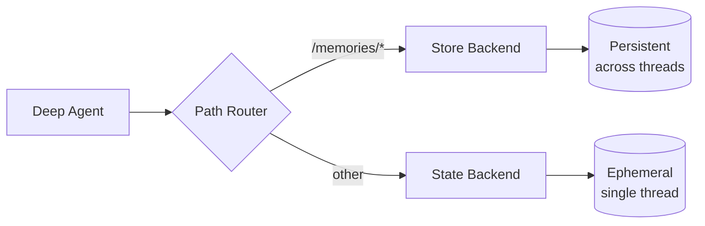

深度智能体自带本地文件系统用于卸载记忆。默认情况下，该文件系统存储在智能体状态中，**仅在单个线程内有效**——对话结束后文件将丢失。

你可以通过使用 `CompositeBackend` 将特定路径路由到持久化存储，从而为深度智能体添加**长期记忆**。这种混合存储方式使部分文件可以跨线程持久保存，而其他文件则保持临时状态。



## 设置

通过使用 `CompositeBackend` 将 `/memories/` 路径路由到 `StoreBackend` 来配置长期记忆：

```python
from deepagents import create_deep_agent
from deepagents.backends import CompositeBackend, StateBackend, StoreBackend
from langgraph.store.memory import InMemoryStore
from langgraph.checkpoint.memory import MemorySaver

checkpointer = MemorySaver()

def make_backend(runtime):
    return CompositeBackend(
        default=StateBackend(runtime),  # Ephemeral storage
        routes={
            "/memories/": StoreBackend(runtime)  # Persistent storage
        }
    )

agent = create_deep_agent(
    store=InMemoryStore(),  # Good for local dev; omit for LangSmith Deployment
    backend=make_backend,
    checkpointer=checkpointer
)
```


## 工作原理

使用 `CompositeBackend` 时，深度智能体维护**两个独立的文件系统**：

### 1. 短期（临时）文件系统
- 存储在智能体状态中（通过 `StateBackend`）
- 仅在单个线程内持久保存
- 线程结束后文件将丢失
- 通过标准路径访问：`/notes.txt`、`/workspace/draft.md`

### 2. 长期（持久）文件系统
- 存储在 LangGraph Store 中（通过 `StoreBackend`）
- 跨所有线程和对话持久保存
- 智能体重启后依然存在
- 通过以 `/memories/` 为前缀的路径访问：`/memories/preferences.txt`

### 路径路由

`CompositeBackend` 根据路径前缀路由文件操作：
- 以 `/memories/` 开头的路径文件存储在 Store 中（持久化）
- 不含此前缀的文件保留在临时状态中
- 所有文件系统工具（`ls`、`read_file`、`write_file`、`edit_file`）均可与两者配合使用

<Note>
    `CompositeBackend` 在存储前会去除路由前缀。例如，`/memories/preferences.txt` 在 `StoreBackend` 中存储为 `/preferences.txt`。智能体始终使用完整路径。详见 [CompositeBackend](/oss/python/deepagents/backends#compositebackend-router)。
</Note>

```python
# Transient file (lost after thread ends)
agent.invoke({
    "messages": [{"role": "user", "content": "Write draft to /draft.txt"}]
})

# Persistent file (survives across threads)
agent.invoke({
    "messages": [{"role": "user", "content": "Save final report to /memories/report.txt"}]
})
```


## 跨线程持久化

`/memories/` 中的文件可从任意线程访问：

```python
import uuid

# Thread 1: Write to long-term memory
config1 = {"configurable": {"thread_id": str(uuid.uuid4())}}
agent.invoke({
    "messages": [{"role": "user", "content": "Save my preferences to /memories/preferences.txt"}]
}, config=config1)

# Thread 2: Read from long-term memory (different conversation!)
config2 = {"configurable": {"thread_id": str(uuid.uuid4())}}
agent.invoke({
    "messages": [{"role": "user", "content": "What are my preferences?"}]
}, config=config2)
# Agent can read /memories/preferences.txt from the first thread
```


## 从外部代码访问记忆（LangSmith）

如果你在 LangSmith 上部署智能体，可以使用 [Store API](/langsmith/agent-server-api/store) 从服务器端代码（智能体外部）读取或写入记忆。`StoreBackend` 使用命名空间 `(assistant_id, "filesystem")` 存储文件。

```python
from langgraph_sdk import get_client

client = get_client(url="<DEPLOYMENT_URL>")

# Read a memory file (path without /memories/ prefix)
item = await client.store.get_item(
    (assistant_id, "filesystem"),
    "/preferences.txt"
)

# Write a memory file
await client.store.put_item(
    (assistant_id, "filesystem"),
    "/preferences.txt",
    {
        "content": ["line 1", "line 2"],
        "created_at": "2024-01-15T10:30:00Z",
        "modified_at": "2024-01-15T10:30:00Z"
    }
)

# Search for items
items = await client.store.search_items(
    (assistant_id, "filesystem")
)
```


<Note>
    键值不包含 `/memories/` 前缀，因为 `CompositeBackend` 在存储前会去除该前缀。详见[路径路由](#路径路由)。
</Note>

更多信息请参见 [Store API 参考](/langsmith/agent-server-api/store)。

## 使用场景

### 用户偏好设置

存储跨会话持久保存的用户偏好：

```python
agent = create_deep_agent(
    store=InMemoryStore(),
    backend=lambda rt: CompositeBackend(
        default=StateBackend(rt),
        routes={"/memories/": StoreBackend(rt)}
    ),
    system_prompt="""When users tell you their preferences, save them to
    /memories/user_preferences.txt so you remember them in future conversations."""
)
```


### 自我优化指令

智能体可以根据反馈更新自身的指令：

```python
agent = create_deep_agent(
    store=InMemoryStore(),
    backend=lambda rt: CompositeBackend(
        default=StateBackend(rt),
        routes={"/memories/": StoreBackend(rt)}
    ),
    system_prompt="""You have a file at /memories/instructions.txt with additional
    instructions and preferences.

    Read this file at the start of conversations to understand user preferences.

    When users provide feedback like "please always do X" or "I prefer Y",
    update /memories/instructions.txt using the edit_file tool."""
)
```


随着时间推移，指令文件会积累用户偏好，帮助智能体持续改进。

### 知识库

在多次对话中积累知识：

```python
# Conversation 1: Learn about a project
agent.invoke({
    "messages": [{"role": "user", "content": "We're building a web app with React. Save project notes."}]
})

# Conversation 2: Use that knowledge
agent.invoke({
    "messages": [{"role": "user", "content": "What framework are we using?"}]
})
# Agent reads /memories/project_notes.txt from previous conversation
```


### 研究项目

跨会话维护研究状态：

```python
research_agent = create_deep_agent(
    store=InMemoryStore(),
    backend=lambda rt: CompositeBackend(
        default=StateBackend(rt),
        routes={"/memories/": StoreBackend(rt)}
    ),
    system_prompt="""You are a research assistant.

    Save your research progress to /memories/research/:
    - /memories/research/sources.txt - List of sources found
    - /memories/research/notes.txt - Key findings and notes
    - /memories/research/report.md - Final report draft

    This allows research to continue across multiple sessions."""
)
```


## Store 实现方式

任何 LangGraph `BaseStore` 实现均可使用：

### InMemoryStore（开发环境）

适用于测试和开发，但重启后数据将丢失：

```python
from langgraph.store.memory import InMemoryStore

store = InMemoryStore()
agent = create_deep_agent(
    store=store,
    backend=lambda rt: CompositeBackend(
        default=StateBackend(rt),
        routes={"/memories/": StoreBackend(rt)}
    )
)
```


### PostgresStore（生产环境）

生产环境中请使用持久化存储：

```python
from langgraph.store.postgres import PostgresStore
import os

# Use PostgresStore.from_conn_string as a context manager
store_ctx = PostgresStore.from_conn_string(os.environ["DATABASE_URL"])
store = store_ctx.__enter__()
store.setup()

agent = create_deep_agent(
    store=store,
    backend=lambda rt: CompositeBackend(
        default=StateBackend(rt),
        routes={"/memories/": StoreBackend(rt)}
    )
)
```


## FileData 模式

通过 `StoreBackend` 存储的文件使用以下模式：

```python
{
    "content": ["line 1", "line 2", "line 3"],  # List of strings (one per line)
    "created_at": "2024-01-15T10:30:00Z",       # ISO 8601 timestamp
    "modified_at": "2024-01-15T11:45:00Z"       # ISO 8601 timestamp
}
```

你可以使用 `create_file_data` 辅助函数创建格式正确的文件数据：

```python
from deepagents.backends.utils import create_file_data

file_data = create_file_data("Hello\nWorld")
# {'content': ['Hello', 'World'], 'created_at': '...', 'modified_at': '...'}
```


有关后端协议的更多详情，请参见[后端](/oss/python/deepagents/backends#protocol-reference)。

## 最佳实践

### 使用具描述性的路径

使用清晰的路径组织持久化文件：

```
/memories/user_preferences.txt
/memories/research/topic_a/sources.txt
/memories/research/topic_a/notes.txt
/memories/project/requirements.md
```

### 记录记忆结构

在系统提示中告知智能体各位置存储了哪些内容：

```
Your persistent memory structure:
- /memories/preferences.txt: User preferences and settings
- /memories/context/: Long-term context about the user
- /memories/knowledge/: Facts and information learned over time
```

### 清理旧数据

定期清理过时的持久化文件，以保持存储可管理性。

### 选择合适的存储方式

- **开发环境**：使用 `InMemoryStore` 快速迭代
- **生产环境**：使用 `PostgresStore` 或其他持久化存储
- **多租户**：考虑在 store 中使用基于 `assistant_id` 的命名空间

---

<div className="source-links">
<Callout icon="edit">
    [Edit this page on GitHub](https://github.com/langchain-ai/docs/edit/main/src/oss/deepagents/long-term-memory.mdx) or [file an issue](https://github.com/langchain-ai/docs/issues/new/choose).
</Callout>
<Callout icon="terminal-2">
    [Connect these docs](/use-these-docs) to Claude, VSCode, and more via MCP for real-time answers.
</Callout>
</div>
