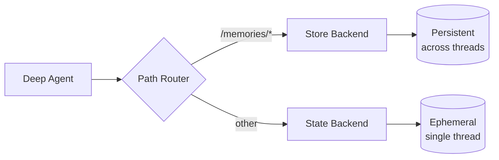

Deep agents 配备了一个本地文件系统来卸载记忆。默认情况下，此文件系统存储在 agent 状态中，并且**对单个线程是临时的**——文件在对话结束时丢失。

你可以通过使用将特定路径路由到持久存储的 `CompositeBackend` 来扩展 deep agents 的**长期记忆**。这启用了混合存储，其中一些文件跨线程持久存在，而其他文件保持临时。



## 设置

通过使用将 `/memories/` 路径路由到 `StoreBackend` 的 `CompositeBackend` 来配置长期记忆：

```python
from deepagents import create_deep_agent
from deepagents.backends import CompositeBackend, StateBackend, StoreBackend
from langgraph.store.memory import InMemoryStore
from langgraph.checkpoint.memory import MemorySaver

checkpointer = MemorySaver()

def make_backend(runtime):
    return CompositeBackend(
        default=StateBackend(runtime),  # Ephemeral storage
        routes={
            "/memories/": StoreBackend(runtime)  # Persistent storage
        }
    )

agent = create_deep_agent(
    store=InMemoryStore(),  # Required for StoreBackend
    backend=make_backend,
    checkpointer=checkpointer
)
```


## 工作原理

使用 `CompositeBackend` 时，deep agents 维护**两个独立的文件系统**：

### 1. 短期（临时）文件系统
- 存储在 agent 的状态中（通过 `StateBackend`）
- 仅在单个线程内持久存在
- 线程结束时文件丢失
- 通过标准路径访问：`/notes.txt`、`/workspace/draft.md`

### 2. 长期（持久）文件系统
- 存储在 LangGraph Store 中（通过 `StoreBackend`）
- 跨所有线程和对话持久存在
- agent 重启后仍然存在
- 通过以 `/memories/` 为前缀的路径访问：`/memories/preferences.txt`

### 路径路由

`CompositeBackend` 根据路径前缀路由文件操作：
- 以 `/memories/` 开头的路径的文件存储在 Store 中（持久）
- 没有此前缀的文件保持在临时状态
- 所有文件系统工具（`ls`、`read_file`、`write_file`、`edit_file`）都可以使用这两者

```python
# Transient file (lost after thread ends)
agent.invoke({
    "messages": [{"role": "user", "content": "Write draft to /draft.txt"}]
})

# Persistent file (survives across threads)
agent.invoke({
    "messages": [{"role": "user", "content": "Save final report to /memories/report.txt"}]
})
```


## 跨线程持久化

`/memories/` 中的文件可以从任何线程访问：

```python
import uuid

# Thread 1: Write to long-term memory
config1 = {"configurable": {"thread_id": str(uuid.uuid4())}}
agent.invoke({
    "messages": [{"role": "user", "content": "Save my preferences to /memories/preferences.txt"}]
}, config=config1)

# Thread 2: Read from long-term memory (different conversation!)
config2 = {"configurable": {"thread_id": str(uuid.uuid4())}}
agent.invoke({
    "messages": [{"role": "user", "content": "What are my preferences?"}]
}, config=config2)
# Agent can read /memories/preferences.txt from the first thread
```


## 用例

### 用户偏好

存储跨会话持久化的用户偏好：

```python
agent = create_deep_agent(
    store=InMemoryStore(),
    backend=lambda rt: CompositeBackend(
        default=StateBackend(rt),
        routes={"/memories/": StoreBackend(rt)}
    ),
    system_prompt="""When users tell you their preferences, save them to
    /memories/user_preferences.txt so you remember them in future conversations."""
)
```


### 自我改进的指令

Agent 可以根据反馈更新自己的指令：

```python
agent = create_deep_agent(
    store=InMemoryStore(),
    backend=lambda rt: CompositeBackend(
        default=StateBackend(rt),
        routes={"/memories/": StoreBackend(rt)}
    ),
    system_prompt="""You have a file at /memories/instructions.txt with additional
    instructions and preferences.

    Read this file at the start of conversations to understand user preferences.

    When users provide feedback like "please always do X" or "I prefer Y",
    update /memories/instructions.txt using the edit_file tool."""
)
```


随着时间的推移，指令文件会积累用户偏好，帮助 agent 改进。

### 知识库

在多次对话中积累知识：

```python
# Conversation 1: Learn about a project
agent.invoke({
    "messages": [{"role": "user", "content": "We're building a web app with React. Save project notes."}]
})

# Conversation 2: Use that knowledge
agent.invoke({
    "messages": [{"role": "user", "content": "What framework are we using?"}]
})
# Agent reads /memories/project_notes.txt from previous conversation
```


### 研究项目

跨会话维护研究状态：

```python
research_agent = create_deep_agent(
    store=InMemoryStore(),
    backend=lambda rt: CompositeBackend(
        default=StateBackend(rt),
        routes={"/memories/": StoreBackend(rt)}
    ),
    system_prompt="""You are a research assistant.

    Save your research progress to /memories/research/:
    - /memories/research/sources.txt - List of sources found
    - /memories/research/notes.txt - Key findings and notes
    - /memories/research/report.md - Final report draft

    This allows research to continue across multiple sessions."""
)
```


## Store 实现

任何 LangGraph `BaseStore` 实现都可以工作：

### InMemoryStore（开发）

适合测试和开发，但数据在重启时丢失：

```python
from langgraph.store.memory import InMemoryStore

store = InMemoryStore()
agent = create_deep_agent(
    store=store,
    backend=lambda rt: CompositeBackend(
        default=StateBackend(rt),
        routes={"/memories/": StoreBackend(rt)}
    )
)
```


### PostgresStore（生产）

对于生产环境，使用持久化 store：

```python
from langgraph.store.postgres import PostgresStore
import os

# Use PostgresStore.from_conn_string as a context manager
store_ctx = PostgresStore.from_conn_string(os.environ["DATABASE_URL"])
store = store_ctx.__enter__()
store.setup()

agent = create_deep_agent(
    store=store,
    backend=lambda rt: CompositeBackend(
        default=StateBackend(rt),
        routes={"/memories/": StoreBackend(rt)}
    )
)
```


## 最佳实践

### 使用描述性路径

使用清晰的路径组织持久文件：

```
/memories/user_preferences.txt
/memories/research/topic_a/sources.txt
/memories/research/topic_a/notes.txt
/memories/project/requirements.md
```

### 记录记忆结构

在系统提示中告诉 agent 什么存储在哪里：

```
你的持久记忆结构：
- /memories/preferences.txt: 用户偏好和设置
- /memories/context/: 关于用户的长期上下文
- /memories/knowledge/: 随时间学习的事实和信息
```

### 清理旧数据

实施对过时持久文件的定期清理，以保持存储可管理。

### 选择正确的存储

- **开发**：使用 `InMemoryStore` 进行快速迭代
- **生产**：使用 `PostgresStore` 或其他持久化 store
- **多租户**：考虑在 store 中使用基于 `assistant_id` 的命名空间

---

<Callout icon="pen-to-square" iconType="regular">
    [Edit this page on GitHub](https://github.com/langchain-ai/docs/edit/main/src/oss/deepagents/long-term-memory.mdx) or [file an issue](https://github.com/langchain-ai/docs/issues/new/choose).
</Callout>
<Tip icon="terminal" iconType="regular">
    [Connect these docs](/use-these-docs) to Claude, VSCode, and more via MCP for real-time answers.
</Tip>
<div class='fixed right-2 bg-white bottom-2'></div>