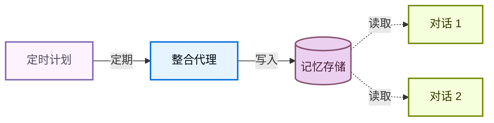

记忆让你的代理能够跨对话学习和改进。Deep Agents 通过文件系统支持的记忆将记忆作为一等公民：代理将记忆作为文件进行读写，你可以使用[后端](/oss/python/deepagents/backends)来控制这些文件的存储位置。

<Note>
本页介绍**长期记忆**：跨对话持久化的记忆。关于短期记忆（单个会话内的对话历史和临时文件），请参阅[上下文工程](/oss/python/deepagents/context-engineering)指南。短期记忆作为代理[状态](/oss/python/langgraph/graph-api#state)的一部分自动管理。


</Note>

## 记忆如何工作

1. **将代理指向记忆文件。** 创建代理时通过 `memory=` 传递文件路径。你也可以通过 `skills=` 传递[技能](/oss/python/deepagents/skills)作为程序性记忆（告诉代理*如何*执行任务的可重用指令）。[后端](/oss/python/deepagents/backends)控制文件的存储位置和访问权限。
2. **代理读取记忆。** 代理可以在启动时将记忆文件加载到系统提示中，或在对话过程中按需读取。例如，[技能](/oss/python/deepagents/skills)使用按需加载：代理在启动时只读取技能描述，仅在匹配任务时才读取完整的技能文件。这使得上下文保持精简，直到需要该能力。
3. **代理更新记忆（可选）。** 当代理学习到新信息时，可以使用内置的 `edit_file` 工具更新记忆文件。更新可以在对话过程中（默认）或通过[后台整合](#background-consolidation)在对话之间后台进行。更改会被持久化并在下次对话中可用。并非所有记忆都是可写的：开发者定义的[技能](/oss/python/deepagents/skills)和[组织策略](#organization-level-memory)通常是只读的。详情请参阅[只读与可写记忆](#read-only-vs-writable-memory)。

最常见的两种模式是[代理作用域记忆](#agent-scoped-memory)（所有用户共享）和[用户作用域记忆](#user-scoped-memory)（每个用户隔离）。

## 作用域记忆

代理记忆可以设置作用域，使得相同的记忆文件可被所有使用该代理的用户访问，或者记忆文件可以为每个用户单独设置。

### 代理作用域记忆

为代理提供一个随时间演进的持久身份。代理作用域记忆在所有用户之间共享，因此代理通过每次对话积累自己的角色、知识和学习到的偏好。在与用户交互时，它会发展专业知识、完善方法并记住有效的方式。当拥有写入权限时，它还可以学习和更新[技能](/oss/python/deepagents/skills)。

关键是后端命名空间：将其设置为 `(assistant_id,)` 意味着该代理的每次对话都读写相同的记忆文件。

<Note>
访问 `rt.server_info` 需要 `deepagents>=0.5.0`。在旧版本中，请从 `get_config()["metadata"]["assistant_id"]` 读取助手 ID。
</Note>

```python
from deepagents import create_deep_agent
from deepagents.backends import CompositeBackend, StateBackend, StoreBackend

agent = create_deep_agent(
    model="google_genai:gemini-3.1-pro-preview",
    memory=["/memories/AGENTS.md"],
    skills=["/skills/"],
    backend=CompositeBackend(
        default=StateBackend(),
        routes={
            "/memories/": StoreBackend(
                namespace=lambda rt: (
                    rt.server_info.assistant_id,  # [!code highlight]
                ),
            ),
            "/skills/": StoreBackend(
                namespace=lambda rt: (
                    rt.server_info.assistant_id,  # [!code highlight]
                ),
            ),
        },
    ),
)
```

<Accordion title="完整示例：种子记忆和调用">

向存储填充初始记忆，然后在两个线程中调用代理，观察它如何记住并更新所学内容。

```python
from langchain_core.utils.uuid import uuid7

from deepagents import create_deep_agent
from deepagents.backends import CompositeBackend, StateBackend, StoreBackend
from deepagents.backends.utils import create_file_data
from langgraph.store.memory import InMemoryStore

store = InMemoryStore()  # 部署到 LangSmith 时使用平台存储

# 填充记忆文件
store.put(
    ("my-agent",),
    "/memories/AGENTS.md",
    create_file_data("""## 回复风格
- 保持回复简洁
- 尽可能使用代码示例
"""),
)

# 填充技能
store.put(
    ("my-agent",),
    "/skills/langgraph-docs/SKILL.md",
    create_file_data("""---
name: langgraph-docs
description: 获取相关 LangGraph 文档以提供准确指导。
---

# langgraph-docs

使用 fetch_url 工具读取 https://docs.langchain.com/llms.txt，然后获取相关页面。
"""),
)

agent = create_deep_agent(
    model="google_genai:gemini-3.1-pro-preview",
    memory=["/memories/AGENTS.md"],
    skills=["/skills/"],
    backend=lambda rt: CompositeBackend(
        default=StateBackend(rt),
        routes={
            "/memories/": StoreBackend(
                rt, namespace=lambda rt: ("my-agent",)
            ),
            "/skills/": StoreBackend(
                rt, namespace=lambda rt: ("my-agent",)
            ),
        },
    ),
    store=store,
)

# 线程 1：代理学习新偏好并保存到记忆
config1 = {"configurable": {"thread_id": str(uuid7())}}
agent.invoke(
    {"messages": [{"role": "user", "content": "我更喜欢详细的解释。请记住这一点。"}]},
    config=config1,
)

# 线程 2：代理读取记忆并应用偏好
config2 = {"configurable": {"thread_id": str(uuid7())}}
agent.invoke(
    {"messages": [{"role": "user", "content": "解释一下变压器是如何工作的。"}]},
    config=config2,
)
```

</Accordion>

### 用户作用域记忆

为每个用户提供自己的记忆文件。代理记住每个用户的偏好、上下文和历史记录，同时核心代理指令保持固定。如果存储在用户作用域的后端中，用户也可以拥有每个用户的[技能](/oss/python/deepagents/skills)。

命名空间使用 `(user_id,)`，因此每个用户获得记忆文件的隔离副本。用户 A 的偏好永远不会泄露到用户 B 的对话中。

```python
from deepagents import create_deep_agent
from deepagents.backends import CompositeBackend, StateBackend, StoreBackend

agent = create_deep_agent(
    model="google_genai:gemini-3.1-pro-preview",
    memory=["/memories/preferences.md"],
    skills=["/skills/"],
    backend=CompositeBackend(
        default=StateBackend(),
        routes={
            "/memories/": StoreBackend(
                namespace=lambda rt: (rt.server_info.user.identity,),
            ),
            "/skills/": StoreBackend(
                namespace=lambda rt: (rt.server_info.user.identity,),
            ),
        },
    ),
)
```

<Accordion title="完整示例：跨用户的隔离记忆">

为每个用户填充记忆，并以两个不同用户身份调用代理。每个用户只能看到自己的偏好。

```python
from langchain_core.utils.uuid import uuid7

from deepagents import create_deep_agent
from deepagents.backends import CompositeBackend, StateBackend, StoreBackend
from deepagents.backends.utils import create_file_data
from langgraph.store.memory import InMemoryStore


store = InMemoryStore()  # 部署到 LangSmith 时使用平台存储

# 为两个用户填充偏好
store.put(
    ("user-alice",),
    "/memories/preferences.md",
    create_file_data("""## 偏好
- 喜欢简洁的要点
- 偏好 Python 示例
"""),
)
store.put(
    ("user-bob",),
    "/memories/preferences.md",
    create_file_data("""## 偏好
- 喜欢详细的解释
- 偏好 TypeScript 示例
"""),
)

# 为 Alice 填充技能
store.put(
    ("user-alice",),
    "/skills/langgraph-docs/SKILL.md",
    create_file_data("""---
name: langgraph-docs
description: 获取相关 LangGraph 文档以提供准确指导。
---

# langgraph-docs

使用 fetch_url 工具读取 https://docs.langchain.com/llms.txt，然后获取相关页面。
"""),
)

agent = create_deep_agent(
    model="google_genai:gemini-3.1-pro-preview",
    memory=["/memories/preferences.md"],
    skills=["/skills/"],
    backend=lambda rt: CompositeBackend(
        default=StateBackend(rt),
        routes={
            "/memories/": StoreBackend(
                rt,
                namespace=lambda rt: (rt.server_info.user.identity,),
            ),
            "/skills/": StoreBackend(
                rt,
                namespace=lambda rt: (rt.server_info.user.identity,),
            ),
        },
    ),
    store=store,
)

# 部署后，每个经过身份验证的请求会将
# `rt.server_info.user.identity` 解析为调用用户，因此 Alice 和 Bob
# 自动只能看到自己的偏好。
agent.invoke(
    {"messages": [{"role": "user", "content": "我如何读取 CSV 文件？"}]},
    config={"configurable": {"thread_id": str(uuid7())}},
)
```

</Accordion>

## 高级用法

除了记忆路径和作用域的基本配置选项外，你还可以为记忆配置更高级的参数：

| 维度         | 它回答的问题         | 选项                                                                                                                                                       |
| ------------ | -------------------- | ---------------------------------------------------------------------------------------------------------------------------------------------------------- |
| **持续时间** | 它持续多久？         | [短期](/oss/python/deepagents/context-engineering)（单次对话）或[长期](#scoped-memory)（跨对话）                                                           |
| **信息类型** | 它是什么类型的信息？ | [情景](#episodic-memory)（过去的经历）、[程序性](/oss/python/deepagents/skills)（指令和技能）或[语义](/oss/python/concepts/memory#semantic-memory)（事实） |
| **作用域**   | 谁可以查看和修改它？ | [用户](#user-scoped-memory)、[代理](#agent-scoped-memory)或[组织](#organization-level-memory)                                                              |
| **更新策略** | 何时写入记忆？       | 对话期间（默认）或[对话之间](#background-consolidation)                                                                                                    |
| **检索**     | 如何读取记忆？       | 加载到提示中（默认）或按需（例如[技能](/oss/python/deepagents/skills)）                                                                                    |
| **代理权限** | 代理可以写入记忆吗？ | [读写](#read-only-vs-writable-memory)（默认）或[只读](#read-only-vs-writable-memory)（用于共享策略）                                                       |

### 情景记忆

情景记忆存储过去经历的记录：发生了什么、按什么顺序发生以及结果如何。与语义记忆（存储在 `AGENTS.md` 等文件中的事实和偏好）不同，情景记忆保留完整的对话上下文，以便代理可以回忆起*如何*解决问题，而不仅仅是*学到了什么*。

Deep Agents 已经使用[检查点](/oss/python/langgraph/persistence#checkpoints)，这是支持情景记忆的机制：每次对话都作为检查点线程持久化。

为了使过去的对话可搜索，将线程搜索包装在一个工具中。`user_id` 从运行时上下文获取，而不是作为参数传递：

```python
from langgraph_sdk import get_client
from langchain.tools import tool, ToolRuntime

client = get_client(url="<DEPLOYMENT_URL>")


@tool
async def search_past_conversations(query: str, runtime: ToolRuntime) -> str:
    """搜索过去的对话以获取相关上下文。"""
    user_id = runtime.server_info.user.identity  # [!code highlight]
    threads = await client.threads.search(
        metadata={"user_id": user_id},
        limit=5,
    )
    results = []
    for thread in threads:
        history = await client.threads.get_history(thread_id=thread["thread_id"])
        results.append(history)
    return str(results)
```

你可以通过调整元数据过滤器按用户或组织限定线程搜索范围：

```python
# 搜索特定用户的对话
threads = await client.threads.search(
    metadata={"user_id": user_id},
    limit=5,
)

# 搜索整个组织的对话
threads = await client.threads.search(
    metadata={"org_id": org_id},
    limit=5,
)
```

这对于执行复杂多步骤任务的代理很有用。例如，编码代理可以回顾过去的调试会话，并直接跳到可能的根本原因。

### 组织级记忆

组织级记忆遵循与用户作用域记忆相同的模式，但使用组织范围的命名空间而不是每个用户的命名空间。用于应适用于组织中所有用户和代理的策略或知识。

组织记忆通常是**只读的**，以防止通过共享状态进行提示注入。详情请参阅[只读与可写记忆](#read-only-vs-writable-memory)。

```python
from deepagents import create_deep_agent
from deepagents.backends import CompositeBackend, StateBackend, StoreBackend

agent = create_deep_agent(
    model="google_genai:gemini-3.1-pro-preview",
    memory=[
        "/memories/preferences.md",
        "/policies/compliance.md",
    ],
    backend=CompositeBackend(
        default=StateBackend(),
        routes={
            "/memories/": StoreBackend(
                namespace=lambda rt: (rt.server_info.user.identity,),
            ),
            "/policies/": StoreBackend(
                namespace=lambda rt: (rt.context.org_id,),
            ),
        },
    ),
)
```

从你的应用程序代码填充组织记忆：

```python
from langgraph_sdk import get_client
from deepagents.backends.utils import create_file_data

client = get_client(url="<DEPLOYMENT_URL>")

await client.store.put_item(
    (org_id,),
    "/compliance.md",
    create_file_data("""## 合规策略
- 永远不要泄露内部定价
- 在财务建议中始终包含免责声明
"""),
)
```

使用[权限](/oss/python/deepagents/permissions)来强制组织级记忆为只读，或使用[策略钩子](/oss/python/deepagents/backends#add-policy-hooks)进行自定义验证逻辑。

### 后台整合

默认情况下，代理在对话期间写入记忆（热路径）。另一种选择是在**对话之间**作为后台任务处理记忆，有时称为**睡眠时间计算**。一个单独的深度代理审查最近的对话，提取关键事实，并将其与现有记忆合并。

| 方法                   | 优点                                 | 缺点                                   |
| ---------------------- | ------------------------------------ | -------------------------------------- |
| **热路径**（对话期间） | 记忆立即可用，对用户透明             | 增加延迟，代理必须多任务处理           |
| **后台**（对话之间）   | 无用户感知的延迟，可以跨多个对话综合 | 记忆在下次对话前不可用，需要第二个代理 |

对于大多数应用程序，热路径就足够了。当你需要减少延迟或提高跨多个对话的记忆质量时，添加后台整合。

推荐的模式是在主代理旁边部署一个**整合代理**——一个深度代理，读取最近的对话历史，提取关键事实，并将其合并到记忆存储中——并按[定时计划](#cron)触发它。选择一个反映用户实际与代理交互频率的节奏：具有稳定每日流量的聊天产品可能每几小时整合一次，而每周只使用几次的工具只需要每晚或每周运行一次。比用户对话频率高得多的整合只会浪费令牌在无操作运行上。

#### 整合代理

整合代理读取最近的对话历史，并将关键事实合并到记忆存储中。在 `langgraph.json` 中将其与主代理一起注册：

```python consolidation_agent.py
from datetime import datetime, timedelta, timezone

from deepagents import create_deep_agent
from langchain.tools import tool, ToolRuntime
from langgraph_sdk import get_client

sdk_client = get_client(url="<DEPLOYMENT_URL>")


@tool
async def search_recent_conversations(query: str, runtime: ToolRuntime) -> str:
    """搜索此用户在过去 6 小时内更新的对话。"""
    user_id = runtime.server_info.user.identity  # [!code highlight]

    since = datetime.now(timezone.utc) - timedelta(hours=6)
    threads = await sdk_client.threads.search(
        metadata={"user_id": user_id},
        updated_after=since.isoformat(),
        limit=20,
    )
    conversations = []
    for thread in threads:
        history = await sdk_client.threads.get_history(
            thread_id=thread["thread_id"]
        )
        conversations.append(history["values"]["messages"])
    return str(conversations)


agent = create_deep_agent(
    model="google_genai:gemini-3.1-pro-preview",
    system_prompt="""审查最近的对话并更新用户的记忆文件。
合并新事实，删除过时信息，并保持简洁。""",
    tools=[search_recent_conversations],
)
```

```json langgraph.json
{
  "dependencies": ["."],
  "graphs": {
    "agent": "./agent.py:agent",
    "consolidation_agent": "./consolidation_agent.py:agent"
  },
  "env": ".env"
}
```

#### 定时任务

[定时任务](/langsmith/cron-jobs)按固定计划运行整合代理。代理搜索最近的对话并将其综合到记忆中。使计划与你的使用模式匹配，以便整合运行大致跟踪实际活动。



使用定时任务安排整合代理：

```python
from langgraph_sdk import get_client

client = get_client(url="<DEPLOYMENT_URL>")

cron_job = await client.crons.create(
    assistant_id="consolidation_agent",
    schedule="0 */6 * * *",
    input={"messages": [{"role": "user", "content": "整合最近的记忆。"}]},
)
```

<Note>
  所有定时计划均以 **UTC**
  解释。有关管理和删除定时任务的详细信息，请参阅[定时任务](/langsmith/cron-jobs)。
</Note>

<Warning>
  定时间隔必须与整合代理内的回溯窗口匹配。上面的示例每 6 小时运行一次（`0 */6 *
  * *`），代理的 `search_recent_conversations` 工具回溯 `timedelta(hours=6)` ——
  请保持同步。如果定时任务运行频率高于回溯窗口，你将重新处理相同的对话；如果运行频率较低，你将丢失窗口之外的记忆。
</Warning>

有关使用后台进程部署代理的更多信息，请参阅[投入生产](/oss/python/deepagents/going-to-production)。

### 只读与可写记忆

默认情况下，代理可以读写记忆文件。对于共享状态（如组织策略或合规规则），你可能希望将记忆设为**只读**，以便代理可以引用但不能修改它。这可以防止通过共享记忆进行提示注入，并确保只有你的应用程序代码控制文件中的内容。

| 权限             | 用例                                                                              | 工作原理                                                                                                                                                                                                             |
| ---------------- | --------------------------------------------------------------------------------- | -------------------------------------------------------------------------------------------------------------------------------------------------------------------------------------------------------------------- |
| **读写**（默认） | 用户偏好、代理自我改进、学习到的[技能](/oss/python/deepagents/skills)             | 代理通过 `edit_file` 工具更新文件                                                                                                                                                                                    |
| **只读**         | 组织策略、合规规则、共享知识库、开发者定义的[技能](/oss/python/deepagents/skills) | 通过应用程序代码或 [Store API](/langsmith/custom-store) 填充。使用[权限](/oss/python/deepagents/permissions)拒绝写入特定路径，或使用[策略钩子](/oss/python/deepagents/backends#add-policy-hooks)进行自定义验证逻辑。 |

**安全考虑：** 如果一个用户可以写入另一个用户读取的记忆，恶意用户可能会将指令注入共享状态。为缓解此问题：

- **默认使用用户作用域** `(user_id)`，除非你有特定原因需要共享
- 对共享策略使用**只读记忆**（通过应用程序代码填充，而不是代理）
- 在代理写入共享记忆之前添加**Human in the Loop**验证。使用[中断](/oss/python/langgraph/interrupts)要求对敏感路径的写入进行人工批准。

要强制只读记忆，请使用[权限](/oss/python/deepagents/permissions)声明式地拒绝写入特定路径。对于自定义验证逻辑（速率限制、审计日志、内容检查），请使用[后端策略钩子](/oss/python/deepagents/backends#add-policy-hooks)。

### 并发写入

多个线程可以并行写入记忆，但对**同一文件**的并发写入可能导致最后写入者获胜的冲突。对于用户作用域记忆，这种情况很少见，因为用户通常一次只有一个活动对话。对于代理作用域或组织作用域记忆，考虑使用[后台整合](#background-consolidation)来序列化写入，或将记忆结构化为每个主题的单独文件以减少争用。

实际上，如果写入因冲突而失败，LLM 通常足够智能可以重试或优雅恢复，因此单个丢失的写入不是灾难性的。

### 同一部署中的多个代理

要在共享部署中为每个代理提供自己的记忆，请将 `assistant_id` 添加到命名空间：

```python
StoreBackend(
    namespace=lambda rt: (
        rt.server_info.assistant_id,  # [!code highlight]
        rt.server_info.user.identity,
    ),
)
```

如果只需要每个代理的隔离而不需要每个用户的作用域，则单独使用 `assistant_id`。

<Tip>
  使用 [LangSmith
  跟踪](/langsmith/trace-with-langgraph)来审计你的代理写入记忆的内容。每次文件写入都会在跟踪中显示为工具调用。
</Tip>

---

<div className="source-links">
  <Callout icon="terminal-2">
    [将这些文档](/use-these-docs)通过 MCP 连接到 Claude、VSCode
    等，以获取实时答案。
  </Callout>
  <Callout icon="edit">
    [在 GitHub
    上编辑此页面](https://github.com/langchain-ai/docs/edit/main/src/oss/deepagents/memory.mdx)
    或 [提交问题](https://github.com/langchain-ai/docs/issues/new/choose)。
  </Callout>
</div>
