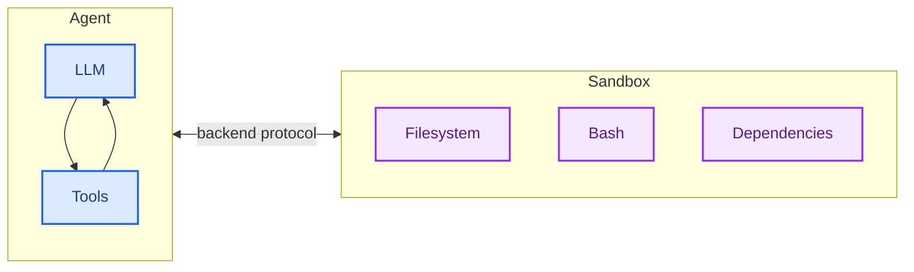
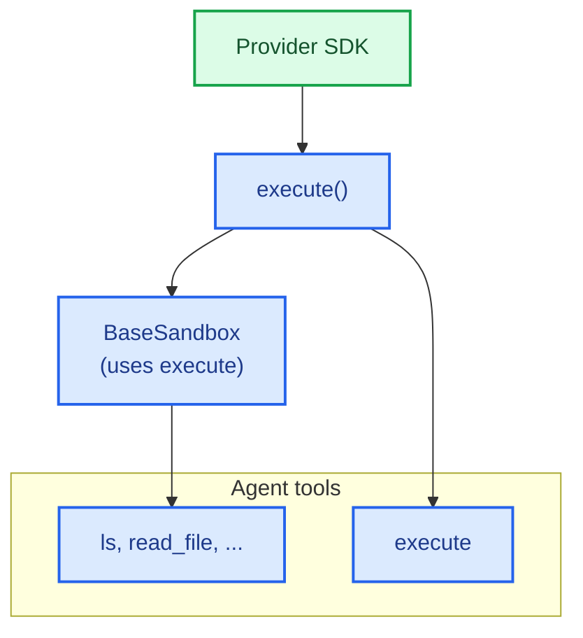
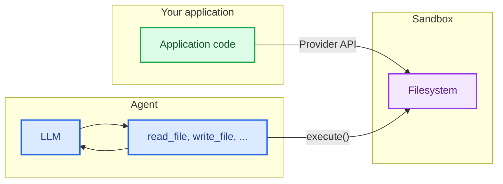

import SandboxBasicPy from '/snippets/deepagents-sandbox-basic-py.mdx';
import SandboxBasicJs from '/snippets/deepagents-sandbox-basic-js.mdx';

智能体生成代码、与文件系统交互并运行 Shell 命令。因为我们无法预测智能体可能会做什么，所以重要的是其环境必须是隔离的，以便它无法访问凭据、文件或网络。沙盒通过在智能体的执行环境和你的主机系统之间创建边界来提供这种隔离。

在 Deep Agents 中，**沙盒是 [后端](/oss/python/deepagents/backends)**，用于定义智能体运行的环境。与其他仅公开文件操作的后端（State、Filesystem、Store）不同，沙盒后端还为智能体提供一个 `execute` 工具用于运行 Shell 命令。当你配置沙盒后端时，智能体将获得：

- 所有标准文件系统工具（`ls`、`read_file`、`write_file`、`edit_file`、`glob`、`grep`）
- 用于在沙盒中运行任意 Shell 命令的 `execute` 工具
- 保护你的主机系统的安全边界



## 为什么使用沙盒？

沙盒用于安全目的。
它们让智能体执行任意代码、访问文件并使用网络，而不会危及你的凭据、本地文件或主机系统。
当智能体自主运行时，这种隔离至关重要。

沙盒特别适用于：

- 编码智能体：自主运行的智能体可以使用 Shell、Git、克隆仓库（许多提供商提供原生 Git API，例如 [Daytona 的 Git 操作](https://www.daytona.io/docs/en/git-operations/)），并运行 Docker-in-Docker 用于构建和测试管道
- 数据分析智能体——在安全、隔离的环境中加载文件、安装数据分析库（pandas、numpy 等）、运行统计计算并创建输出（如 PowerPoint 演示文稿）

<Tip>
    **使用 Deep Agents CLI？** CLI 通过 `--sandbox` 标志内置了沙盒支持。请参阅 [使用远程沙盒](/oss/python/deepagents/cli/overview#use-remote-sandboxes) 了解特定于 CLI 的设置、标志（`--sandbox-id`、`--sandbox-setup`）和示例。
</Tip>

## 基本用法

这些示例假设你已经使用提供商的 SDK 创建了沙盒/devbox 并设置了凭据。有关注册、身份验证和特定于提供商的生命周期详细信息，请参阅 [可用提供商](#available-providers)。


<SandboxBasicPy />


## 可用提供商

有关特定于提供商的设置、身份验证和生命周期详细信息，请参阅 [沙盒集成](/oss/python/integrations/sandboxes)。


没有看到你的提供商？你可以实现自己的沙盒后端。请参阅 [贡献沙盒集成](/oss/python/contributing/integrations-langchain)。

## 生命周期和作用域

沙盒会消耗资源并在关闭之前产生费用。如何管理其生命周期取决于你的应用程序。

选择沙盒生命周期如何映射到应用程序的资源。有关此决策的更多信息，请参阅 [投入生产](/oss/python/deepagents/going-to-production#sandboxes)。

### 线程作用域（默认）

每个对话获得自己的沙盒。沙盒在第一次运行开始时创建，并在同一线程的后续消息中重用。当线程被清理（或沙盒 TTL 过期）时，沙盒将被销毁。这对于大多数智能体来说是正确的默认设置。

示例：一个数据分析机器人，每次对话都从干净的环境开始。

### 助手作用域

给定 [助手](/langsmith/assistants) 的所有线程共享一个沙盒。沙盒 ID 存储在助手的配置上，因此每次对话都返回到相同的环境。文件、安装的包和克隆的仓库在对话之间持久存在。当智能体维护一个长期运行的工作区时使用此选项。

示例：一个编码助手，在对话之间维护克隆的仓库和安装的依赖项。

<Warning>
    助手作用域的沙盒会随着时间的推移积累文件、安装的包和其他沙盒内状态。与你的沙盒提供商配置 TTL，使用快照定期重置，或实现清理逻辑以防止沙盒的磁盘和内存无限增长。线程作用域的沙盒通过每次对话重新开始来避免这种情况。
</Warning>

### 基本生命周期


<Tabs>
    <Tab title="Daytona">

        ```python
        from daytona import Daytona

        from langchain_daytona import DaytonaSandbox

        sandbox = Daytona().create()
        backend = DaytonaSandbox(sandbox=sandbox)

        result = backend.execute("echo hello")
        # ... 使用沙盒
        sandbox.stop()
        ```

    </Tab>
    <Tab title="Modal">

        ```python
        import modal

        from langchain_modal import ModalSandbox

        app = modal.App.lookup("your-app")
        modal_sandbox = modal.Sandbox.create(app=app)
        backend = ModalSandbox(sandbox=modal_sandbox)

        result = backend.execute("echo hello")
        # ... 使用沙盒
        modal_sandbox.terminate()
        ```

    </Tab>
    <Tab title="Runloop">

        ```python
        from runloop_api_client import RunloopSDK

        from langchain_runloop import RunloopSandbox

        client = RunloopSDK(bearer_token="...")
        devbox = client.devbox.create()
        backend = RunloopSandbox(devbox=devbox)

        result = backend.execute("echo hello")
        # ... 使用沙盒
        devbox.shutdown()
        ```

    </Tab>
    <Tab title="AgentCore">

        ```python
        from bedrock_agentcore.tools.code_interpreter_client import CodeInterpreter

        from langchain_agentcore_codeinterpreter import AgentCoreSandbox

        interpreter = CodeInterpreter(region="us-west-2")
        interpreter.start()

        backend = AgentCoreSandbox(interpreter=interpreter)

        result = backend.execute("echo hello")
        # ... 使用沙盒
        interpreter.stop()
        ```

    </Tab>
    <Tab title="LangSmith">

        ```python
        from langsmith.sandbox import SandboxClient

        from deepagents.backends.langsmith import LangSmithSandbox

        client = SandboxClient()
        ls_sandbox = client.create_sandbox(template_name="deepagents-deploy")

        backend = LangSmithSandbox(sandbox=ls_sandbox)

        result = backend.execute("echo hello")
        # ... 使用沙盒
        client.delete_sandbox(backend.id)
        ```

    </Tab>
</Tabs>


### 每次对话的生命周期

在聊天应用程序中，对话通常由 `thread_id` 表示。
通常，每个 `thread_id` 应使用其自己唯一的沙盒。

将沙盒 ID 和 `thread_id` 之间的映射存储在你的应用程序中，或者如果沙盒提供商允许将元数据附加到沙盒，则与沙盒一起存储。

<Tip>
**聊天应用程序的 TTL。** 当用户可以在空闲后重新参与时，你通常不知道他们是否会返回或何时返回。在沙盒上配置生存时间 (TTL)——例如，归档 TTL 或删除 TTL——以便提供商自动清理空闲沙盒。许多沙盒提供商支持此功能。
</Tip>

以下示例展示了使用 Daytona 的 get-or-create 模式。
对于其他提供商，请咨询沙盒提供商 API 以获取等效的标签、元数据和 TTL 选项：

```python
from langchain_core.utils.uuid import uuid7

from daytona import CreateSandboxFromSnapshotParams, Daytona
from deepagents import create_deep_agent
from langchain_daytona import DaytonaSandbox

client = Daytona()
thread_id = str(uuid7())

# 通过 thread_id 获取或创建沙盒
try:
    sandbox = client.find_one(labels={"thread_id": thread_id})
except Exception:
    params = CreateSandboxFromSnapshotParams(
        labels={"thread_id": thread_id},
        # 添加 TTL 以便在空闲时清理沙盒
        auto_delete_interval=3600,
    )
    sandbox = client.create(params)

backend = DaytonaSandbox(sandbox=sandbox)
agent = create_deep_agent(
    model="google_genai:gemini-3.1-pro-preview",
    backend=backend,
    system_prompt="你是一个具有沙盒访问权限的编码助手。你可以在沙盒中创建和运行代码。",
)

try:
    result = agent.invoke(
        {
            "messages": [
                {
                    "role": "user",
                    "content": "创建一个 hello world Python 脚本并运行它",
                }
            ]
        },
        config={
            "configurable": {
                "thread_id": thread_id,
            }
        },
    )
    print(result["messages"][-1].content)
except Exception:
    # 可选：在发生异常时主动删除沙盒
    client.delete(sandbox)
    raise
```


## 集成模式

有两种架构模式用于将智能体与沙盒集成，基于智能体运行的位置。

### 沙盒内智能体模式

智能体在沙盒内运行，你通过网络与其通信。你构建一个预装了智能体框架的 Docker 或 VM 镜像，在沙盒内运行它，并从外部连接以发送消息。

好处：

- ✅ 紧密镜像本地开发。
- ✅ 智能体与环境之间的紧密耦合。

权衡：

- 🔴 API 密钥必须存在于沙盒内（安全风险）。
- 🔴 更新需要重建镜像。
- 🔴 需要通信基础设施（WebSocket 或 HTTP 层）。

要在沙盒中运行智能体，请构建一个镜像并在其上安装 deepagents。

```dockerfile
FROM python:3.11
RUN pip install deepagents-cli
```

然后在沙盒内运行智能体。
要在沙盒内使用智能体，你必须添加额外的基础设施来处理应用程序与沙盒内智能体之间的通信。

### 沙盒即工具模式

智能体在你的机器或服务器上运行。当需要执行代码时，它调用沙盒工具（如 `execute`、`read_file` 或 `write_file`），这些工具调用提供商的 API 在远程沙盒中运行操作。

好处：

- ✅ 无需重建镜像即可即时更新智能体代码。
- ✅ 智能体状态和执行之间更清晰的分离。
    - API 密钥保持在沙盒外部。
    - 沙盒故障不会丢失智能体状态。
    - 可以选择在多个沙盒中并行运行任务。
- ✅ 仅支付执行时间费用。

权衡：

- 🔴 每次执行调用都有网络延迟。

```python 示例
from daytona import Daytona
from deepagents import create_deep_agent
from dotenv import load_dotenv
from langchain_daytona import DaytonaSandbox


load_dotenv()

# 也可以使用 AgentCore、E2B、Runloop、Modal 执行此操作
sandbox = Daytona().create()
backend = DaytonaSandbox(sandbox=sandbox)

agent = create_deep_agent(
    model="google_genai:gemini-3.1-pro-preview",
    backend=backend,
    system_prompt="你是一个具有沙盒访问权限的编码助手。你可以在沙盒中创建和运行代码。",
)

try:
    result = agent.invoke(
        {
            "messages": [
                {
                    "role": "user",
                    "content": "创建一个 hello world Python 脚本并运行它",
                }
            ]
        }
    )
    print(result["messages"][-1].content)
except Exception:
    # 可选：在发生异常时主动删除沙盒
    sandbox.stop()
    raise
```


本文档中的示例使用沙盒即工具模式。
当你的提供商的 SDK 处理通信层并且你希望生产环境镜像本地开发时，选择沙盒内智能体模式。
当你需要快速迭代智能体逻辑、将 API 密钥保持在沙盒外部或更喜欢更清晰的关注点分离时，选择沙盒即工具模式。

## 沙盒如何工作

### 隔离边界

所有沙盒提供商都保护你的主机系统免受智能体的文件系统和 Shell 操作的影响。智能体无法读取你的本地文件、访问你机器上的环境变量或干扰其他进程。但是，仅沙盒**不能**防止：

- **上下文注入**：控制部分智能体输入的攻击者可以指示它在沙盒内运行任意命令。沙盒是隔离的，但智能体在其中拥有完全控制权。
- **网络外泄**：除非阻止网络访问，否则上下文注入的智能体可以通过 HTTP 或 DNS 将数据发送出沙盒。一些提供商支持阻止网络访问（例如，Modal 上的 `blockNetwork: true`）。

请参阅 [安全注意事项](#security-considerations) 了解如何处理机密信息并减轻这些风险。

### `execute` 方法

沙盒后端具有简单的架构：提供商必须实现的唯一方法是 `execute()`，它运行 Shell 命令并返回其输出。所有其他文件系统操作（`read`、`write`、`edit`、`ls`、`glob`、`grep`）都由 [`BaseSandbox`](https://reference.langchain.com/python/deepagents/backends/sandbox/BaseSandbox) 基类在 `execute()` 之上构建，该类构造脚本并通过 `execute()` 在沙盒内运行它们。



这种设计意味着：
- **添加新提供商很简单。** 实现 `execute()`——基类处理其他所有内容。
- **`execute` 工具是条件可用的。** 在每次模型调用时， harness 检查后端是否实现了 [`SandboxBackendProtocol`](https://reference.langchain.com/python/deepagents/backends/protocol/SandboxBackendProtocol)。如果没有，该工具将被过滤掉，智能体永远看不到它。

当智能体调用 `execute` 工具时，它提供一个 `command` 字符串并返回组合的 stdout/stderr、退出码，如果输出太大则返回截断通知。

你也可以在应用程序代码中直接调用后端 `execute()` 方法。

<Tabs>
    <Tab title="Daytona">
        <CodeGroup>
            ```bash pip
            pip install langchain-daytona
            ```

            ```bash uv
            uv add langchain-daytona
            ```
        </CodeGroup>

        ```python
        from daytona import Daytona

        from langchain_daytona import DaytonaSandbox

        sandbox = Daytona().create()
        backend = DaytonaSandbox(sandbox=sandbox)

        result = backend.execute("python --version")
        print(result.output)
        ```
    </Tab>
    <Tab title="Modal">
        ```python
        import modal

        from langchain_modal import ModalSandbox

        app = modal.App.lookup("your-app")
        modal_sandbox = modal.Sandbox.create(app=app)
        backend = ModalSandbox(sandbox=modal_sandbox)

        result = backend.execute("python --version")
        print(result.output)
        ```
    </Tab>
    <Tab title="Runloop">
        <CodeGroup>
            ```bash pip
            pip install langchain-runloop
            ```

            ```bash uv
            uv add langchain-runloop
            ```
        </CodeGroup>

        ```python
        from runloop_api_client import RunloopSDK

        from langchain_runloop import RunloopSandbox

        api_key = "..."
        client = RunloopSDK(bearer_token=api_key)

        devbox = client.devbox.create()
        backend = RunloopSandbox(devbox=devbox)

        try:
            result = backend.execute("python --version")
            print(result.output)
        finally:
            devbox.shutdown()
        ```
    </Tab>
    <Tab title="AgentCore">
        <CodeGroup>
            ```bash pip
            pip install langchain-agentcore-codeinterpreter
            ```

            ```bash uv
            uv add langchain-agentcore-codeinterpreter
            ```
        </CodeGroup>

        ```python
        from bedrock_agentcore.tools.code_interpreter_client import CodeInterpreter

        from langchain_agentcore_codeinterpreter import AgentCoreSandbox

        interpreter = CodeInterpreter(region="us-west-2")
        interpreter.start()

        backend = AgentCoreSandbox(interpreter=interpreter)

        try:
            result = backend.execute("python3 --version")
            print(result.output)
        finally:
            interpreter.stop()
        ```
    </Tab>
    <Tab title="LangSmith">
        ```python
        from langsmith.sandbox import SandboxClient

        from deepagents.backends.langsmith import LangSmithSandbox

        client = SandboxClient()
        ls_sandbox = client.create_sandbox(template_name="deepagents-deploy")
        backend = LangSmithSandbox(sandbox=ls_sandbox)

        result = backend.execute("python --version")
        print(result.output)
        ```
    </Tab>
</Tabs>


例如：

```
4
[命令成功，退出码为 0]
```

```
bash: foobar: 命令未找到
[命令失败，退出码为 127]
```

如果命令产生非常大的输出，结果将自动保存到文件，并指示智能体使用 `read_file` 逐步访问它。这可以防止上下文窗口溢出。

### 文件访问的两个平面

文件进出沙盒有两种不同的方式，了解何时使用每种方式很重要：

**智能体文件系统工具**：`read_file`、`write_file`、`edit_file`、`ls`、`glob`、`grep` 和 `execute` 是 LLM 在执行期间调用的工具。这些通过沙盒内的 `execute()` 进行。智能体使用它们读取代码、写入文件并作为其任务的一部分运行命令。

**文件传输 API**：你的应用程序代码调用的 `uploadFiles()` 和 `downloadFiles()` 方法。这些使用提供商的原生文件传输 API（而不是 Shell 命令），旨在在你的主机环境和沙盒之间移动文件。使用这些来：
- 在智能体运行之前用源代码、配置或数据**种子化沙盒**
- 在智能体完成后**检索产物**（生成的代码、构建输出、报告）
- **预填充依赖项**，智能体将需要这些依赖项




## 使用文件

deepagents 沙盒后端支持文件传输 API，用于在你的应用程序和沙盒之间移动文件。

### 种子化沙盒

使用 `upload_files()` 在智能体运行之前填充沙盒。路径必须是绝对的，内容是 `bytes`：

<Tabs>
    <Tab title="Daytona">
        <CodeGroup>
            ```bash pip
            pip install langchain-daytona
            ```

            ```bash uv
            uv add langchain-daytona
            ```
        </CodeGroup>

        ```python
        from daytona import Daytona

        from langchain_daytona import DaytonaSandbox

        sandbox = Daytona().create()
        backend = DaytonaSandbox(sandbox=sandbox)

        backend.upload_files(
            [
                ("/src/index.py", b"print('Hello')\n"),
                ("/pyproject.toml", b"[project]\nname = 'my-app'\n"),
            ]
        )
        ```
    </Tab>
    <Tab title="Modal">
        ```python
        import modal

        from langchain_modal import ModalSandbox

        app = modal.App.lookup("your-app")
        modal_sandbox = modal.Sandbox.create(app=app)
        backend = ModalSandbox(sandbox=modal_sandbox)

        backend.upload_files(
            [
                ("/src/index.py", b"print('Hello')\n"),
                ("/pyproject.toml", b"[project]\nname = 'my-app'\n"),
            ]
        )
        ```
    </Tab>
    <Tab title="Runloop">
        <CodeGroup>
            ```bash pip
            pip install langchain-runloop
            ```

            ```bash uv
            uv add langchain-runloop
            ```
        </CodeGroup>

        ```python
        from runloop_api_client import RunloopSDK

        from langchain_runloop import RunloopSandbox

        api_key = "..."
        client = RunloopSDK(bearer_token=api_key)

        devbox = client.devbox.create()
        backend = RunloopSandbox(devbox=devbox)

        backend.upload_files(
            [
                ("/src/index.py", b"print('Hello')\n"),
                ("/pyproject.toml", b"[project]\nname = 'my-app'\n"),
            ]
        )
        ```
    </Tab>
    <Tab title="AgentCore">
        <CodeGroup>
            ```bash pip
            pip install langchain-agentcore-codeinterpreter
            ```

            ```bash uv
            uv add langchain-agentcore-codeinterpreter
            ```
        </CodeGroup>

        ```python
        from bedrock_agentcore.tools.code_interpreter_client import CodeInterpreter

        from langchain_agentcore_codeinterpreter import AgentCoreSandbox

        interpreter = CodeInterpreter(region="us-west-2")
        interpreter.start()

        backend = AgentCoreSandbox(interpreter=interpreter)

        backend.upload_files(
            [
                ("hello.py", b"print('Hello')\n"),
                ("data.csv", b"name,value\na,1\nb,2\n"),
            ]
        )
        ```
    </Tab>
    <Tab title="LangSmith">

        ```python
        from langsmith.sandbox import SandboxClient

        from deepagents.backends.langsmith import LangSmithSandbox

        client = SandboxClient()
        ls_sandbox = client.create_sandbox(template_name="deepagents-deploy")
        backend = LangSmithSandbox(sandbox=ls_sandbox)

        backend.upload_files(
            [
                ("/src/index.py", b"print('Hello')\n"),
                ("/pyproject.toml", b"[project]\nname = 'my-app'\n"),
            ]
        )
        ```
    </Tab>
</Tabs>

### 检索产物

使用 `download_files()` 在智能体完成后从沙盒检索文件：

<Tabs>
    <Tab title="Daytona">
        <CodeGroup>
            ```bash pip
            pip install langchain-daytona
            ```

            ```bash uv
            uv add langchain-daytona
            ```
        </CodeGroup>

        ```python
        from daytona import Daytona

        from langchain_daytona import DaytonaSandbox

        sandbox = Daytona().create()
        backend = DaytonaSandbox(sandbox=sandbox)

        results = backend.download_files(["/src/index.py", "/output.txt"])
        for result in results:
            if result.content is not None:
                print(f"{result.path}: {result.content.decode()}")
            else:
                print(f"Failed to download {result.path}: {result.error}")
        ```
    </Tab>
    <Tab title="Modal">
        ```python
        import modal

        from langchain_modal import ModalSandbox

        app = modal.App.lookup("your-app")
        modal_sandbox = modal.Sandbox.create(app=app)
        backend = ModalSandbox(sandbox=modal_sandbox)

        results = backend.download_files(["/src/index.py", "/output.txt"])
        for result in results:
            if result.content is not None:
                print(f"{result.path}: {result.content.decode()}")
            else:
                print(f"Failed to download {result.path}: {result.error}")
        ```
    </Tab>
    <Tab title="Runloop">
        <CodeGroup>
            ```bash pip
            pip install langchain-runloop
            ```

            ```bash uv
            uv add langchain-runloop
            ```
        </CodeGroup>

        ```python
        from runloop_api_client import RunloopSDK

        from langchain_runloop import RunloopSandbox

        api_key = "..."
        client = RunloopSDK(bearer_token=api_key)

        devbox = client.devbox.create()
        backend = RunloopSandbox(devbox=devbox)

        results = backend.download_files(["/src/index.py", "/output.txt"])
        for result in results:
            if result.content is not None:
                print(f"{result.path}: {result.content.decode()}")
            else:
                print(f"Failed to download {result.path}: {result.error}")
        ```
    </Tab>
    <Tab title="AgentCore">
        <CodeGroup>
            ```bash pip
            pip install langchain-agentcore-codeinterpreter
            ```

            ```bash uv
            uv add langchain-agentcore-codeinterpreter
            ```
        </CodeGroup>

        ```python
        from bedrock_agentcore.tools.code_interpreter_client import CodeInterpreter

        from langchain_agentcore_codeinterpreter import AgentCoreSandbox

        interpreter = CodeInterpreter(region="us-west-2")
        interpreter.start()

        backend = AgentCoreSandbox(interpreter=interpreter)

        results = backend.download_files(["hello.py"])
        for result in results:
            if result.content is not None:
                print(f"{result.path}: {result.content.decode()}")
            else:
                print(f"Failed to download {result.path}: {result.error}")

        interpreter.stop()
        ```
    </Tab>
    <Tab title="LangSmith">
        ```python
        from langsmith.sandbox import SandboxClient

        from deepagents.backends.langsmith import LangSmithSandbox

        client = SandboxClient()
        ls_sandbox = client.create_sandbox(template_name="deepagents-deploy")
        backend = LangSmithSandbox(sandbox=ls_sandbox)

        results = backend.download_files(["/src/index.py", "/output.txt"])
        for result in results:
            if result.content is not None:
                print(f"{result.path}: {result.content.decode()}")
            else:
                print(f"Failed to download {result.path}: {result.error}")
        ```
    </Tab>
</Tabs>

<Note>
在沙盒内部，智能体使用文件系统工具（`read_file`、`write_file`）。`upload_files` 和 `download_files` 方法用于你的应用程序代码在主机和沙盒之间的边界移动文件。
</Note>


## 安全注意事项

沙盒将代码执行与你的主机系统隔离，但它们不能防止**上下文注入**。控制部分智能体输入的攻击者可以指示它读取文件、运行命令或从沙盒内外泄数据。这使得沙盒内的凭据特别危险。

<Warning>
**切勿将密钥放入沙盒中。** 注入到沙盒中的 API 密钥、令牌、数据库凭据和其他密钥（通过环境变量、挂载的文件或 `secrets` 选项）可以被上下文注入的智能体读取和外泄。即使对于短期或范围受限的凭据也是如此——如果智能体可以访问它们，攻击者也可以。
</Warning>

### 安全处理密钥

如果你的智能体需要调用经过身份验证的 API 或访问受保护的资源，你有两个选项：

1. **将密钥保持在沙盒外部的工具中。** 定义在你的主机环境（不在沙盒内）运行并在那里处理身份验证的工具。智能体按名称调用这些工具，但永远看不到凭据。这是推荐的方法。

2. **使用注入密钥的网络代理。** 一些沙盒提供商支持代理，拦截来自沙盒的传出 HTTP 请求并在转发之前附加凭据（例如，`Authorization` 标头）。智能体永远看不到密钥——它只是向 URL 发出普通请求。这种方法尚未在提供商中广泛可用。

<Warning>
如果你必须将密钥注入沙盒（不推荐），请采取以下预防措施：

- 为**所有**工具调用启用 [人机协同](/oss/python/deepagents/human-in-the-loop) 批准，而不仅仅是敏感调用
- 阻止或限制来自沙盒的网络访问以限制外泄路径
- 使用尽可能窄的凭据范围和尽可能短的寿命
- 监控沙盒网络流量以查找意外的传出请求

即使有这些保障措施，这仍然是一个不安全的变通方法。足够有创造性的上下文注入攻击可以绕过输出过滤和 HITL 审查。
</Warning>

### 一般最佳实践

- 在应用程序中采取行动之前审查沙盒输出
- 不需要时阻止沙盒网络访问
- 使用 [中间件](/oss/python/langchain/middleware) 过滤或编辑工具输出中的敏感模式
- 将沙盒内产生的所有内容视为不可信的输入

---

<div className="source-links">
<Callout icon="edit">
    [在 GitHub 上编辑此页面](https://github.com/langchain-ai/docs/edit/main/src/oss/deepagents/sandboxes.mdx) 或 [提交问题](https://github.com/langchain-ai/docs/issues/new/choose)。
</Callout>
<Callout icon="terminal-2">
    通过 MCP 将 [这些文档](/use-these-docs) 连接到 Claude、VSCode 等以获得实时答案。
</Callout>
</div>
