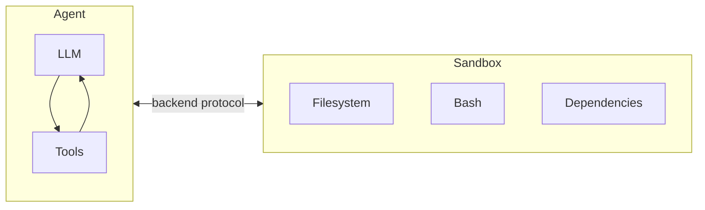
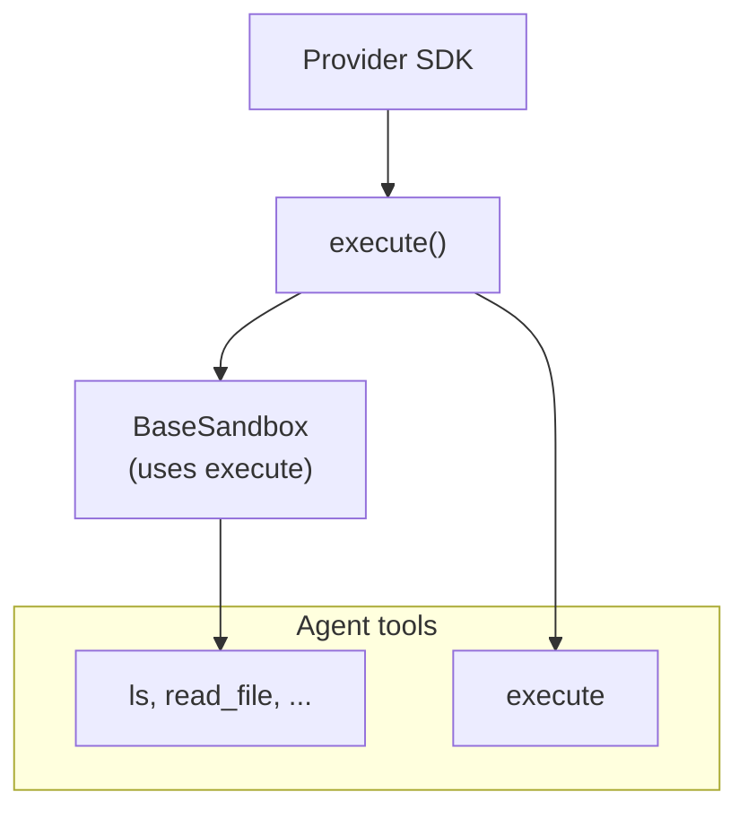
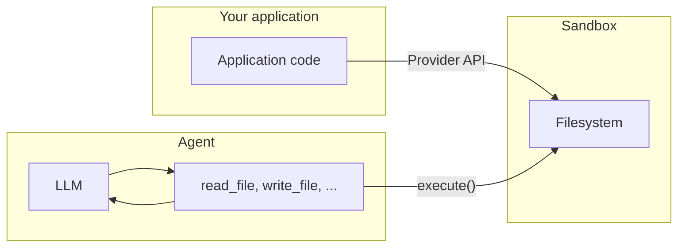

import SandboxBasicPy from '/snippets/deepagents-sandbox-basic-py.mdx';
import SandboxBasicJs from '/snippets/deepagents-sandbox-basic-js.mdx';

智能体会生成代码、与文件系统交互并执行 shell 命令。由于我们无法预测智能体可能执行的操作，因此必须将其运行环境隔离，以防止其访问凭据、文件或网络。沙盒通过在智能体执行环境与宿主系统之间创建边界来提供这种隔离。

在深度智能体中，**沙盒是[后端](/oss/python/deepagents/backends)**，定义了智能体运行的环境。与仅暴露文件操作的其他后端（State、Filesystem、Store）不同，沙盒后端还为智能体提供了用于执行 shell 命令的 `execute` 工具。配置沙盒后端后，智能体将获得：

- 所有标准文件系统工具（`ls`、`read_file`、`write_file`、`edit_file`、`glob`、`grep`）
- 用于在沙盒中运行任意 shell 命令的 `execute` 工具
- 保护宿主系统的安全边界



## 为何使用沙盒？

沙盒用于保障安全性。
它们让智能体能够执行任意代码、访问文件和使用网络，而不会危及您的凭据、本地文件或宿主系统。
在智能体自主运行时，这种隔离至关重要。

沙盒特别适用于：

- 编码智能体：自主运行的智能体可以使用 shell、git、克隆代码库（许多提供商提供原生 git API，例如 [Daytona 的 git 操作](https://www.daytona.io/docs/en/git-operations/)），并在 Docker-in-Docker 中运行构建和测试流水线
- 数据分析智能体 — 在安全隔离的环境中加载文件、安装数据分析库（pandas、numpy 等）、运行统计计算，并创建 PowerPoint 演示文稿等输出

## 集成模式

根据智能体运行位置的不同，有两种架构模式可将智能体与沙盒集成。

### 智能体在沙盒内模式

智能体在沙盒内运行，您通过网络与其通信。您构建一个预安装了智能体框架的 Docker 或 VM 镜像，在沙盒内运行它，并从外部连接发送消息。

优势：

- ✅ 与本地开发环境高度一致。
- ✅ 智能体与环境紧密耦合。

劣势：

- 🔴 API 密钥必须存在于沙盒内（安全风险）。
- 🔴 更新需要重新构建镜像。
- 🔴 需要通信基础设施（WebSocket 或 HTTP 层）。

要在沙盒内运行智能体，请构建镜像并在其上安装 deepagents。

```dockerfile
FROM python:3.11
RUN pip install deepagents-cli
```

然后在沙盒内运行智能体。
要在沙盒内使用智能体，您需要添加额外的基础设施来处理应用程序与沙盒内智能体之间的通信。

### 沙盒作为工具模式

智能体在您的机器或服务器上运行。当需要执行代码时，它调用沙盒工具（如 `execute`、`read_file` 或 `write_file`），这些工具会调用提供商的 API 在远程沙盒中运行操作。

优势：

- ✅ 无需重建镜像即可立即更新智能体代码。
- ✅ 智能体状态与执行之间的清晰分离。
    - API 密钥保留在沙盒外。
    - 沙盒故障不会丢失智能体状态。
    - 可以选择在多个沙盒中并行运行任务。
- ✅ 仅为执行时间付费。

劣势：

- 🔴 每次执行调用都有网络延迟。

示例：

```python
from dotenv import load_dotenv
from daytona import Daytona

from langchain_daytona import DaytonaSandbox
from deepagents import create_deep_agent


load_dotenv()

# Can also do this with E2B, Runloop, Modal
sandbox = Daytona().create()
backend = DaytonaSandbox(sandbox=sandbox)

agent = create_deep_agent(
    backend=backend,
    system_prompt="You are a coding assistant with sandbox access. You can create and run code in the sandbox.",
)

try:
    result = agent.invoke(
        {
            "messages": [
                {
                    "role": "user",
                    "content": "Create a hello world Python script and run it",
                }
            ]
        }
    )
    print(result["messages"][-1].content)
except Exception:
    # Optional: delete the sandbox proactively on an exception
    sandbox.stop()
    raise
```


本文档中的示例使用沙盒作为工具模式。
当提供商的 SDK 处理通信层且您希望生产环境与本地开发一致时，选择智能体在沙盒内模式。
当您需要快速迭代智能体逻辑、将 API 密钥保留在沙盒外，或偏好更清晰的关注点分离时，选择沙盒作为工具模式。

## 可用提供商

有关特定提供商的设置、身份验证和生命周期详情，请参阅提供商集成页面：


<CardGroup cols={2}>
    <Card title="Modal" icon="/images/providers/modal-icon.svg" href="/oss/python/integrations/providers/modal">
        ML/AI 工作负载、GPU 访问。
    </Card>
    <Card title="Daytona" icon="/images/providers/daytona-icon.svg" href="/oss/python/integrations/providers/daytona">
        TypeScript/Python 开发，快速冷启动。
    </Card>
    <Card title="Runloop" href="/oss/python/integrations/providers/runloop">
        用于隔离代码执行的一次性开发箱。
    </Card>
</CardGroup>


如果您是沙盒平台提供商并希望贡献集成，请参阅[贡献沙盒集成](/oss/python/contributing/integrations-langchain)。


## 基本用法

以下示例假设您已使用提供商的 SDK 创建了沙盒/开发箱并设置了凭据。有关注册、身份验证和特定提供商生命周期详情，请参阅[可用提供商](#available-providers)。

<SandboxBasicPy />


## 沙盒工作原理

### 隔离边界

所有沙盒提供商都保护您的宿主系统免受智能体文件系统和 shell 操作的影响。智能体无法读取您的本地文件、访问您机器上的环境变量或干扰其他进程。但是，沙盒本身**不能**防范：

- **上下文注入** — 控制智能体部分输入的攻击者可以指示其在沙盒内运行任意命令。沙盒是隔离的，但智能体在其中拥有完全控制权。
- **网络渗漏** — 除非阻止网络访问，否则被注入上下文的智能体可以通过 HTTP 或 DNS 将数据从沙盒中发送出去。某些提供商支持阻止网络访问（例如 Modal 上的 `blockNetwork: true`）。

有关如何处理机密信息和降低这些风险的方法，请参阅[安全注意事项](#security-considerations)。

### `execute` 方法

沙盒后端采用简单架构：提供商只需实现 `execute()` 方法，该方法运行 shell 命令并返回其输出。所有其他文件系统操作——`read`、`write`、`edit`、`ls`、`glob`、`grep`——都由 `BaseSandbox` 基类通过 `execute()` 构建，它会构造脚本并通过 `execute()` 在沙盒内运行。



这种设计意味着：
- **添加新提供商非常简单。** 只需实现 `execute()`——基类处理其他所有事情。
- **`execute` 工具是条件可用的。** 每次模型调用时，框架会检查后端是否实现了 `SandboxBackendProtocol`。如果没有，该工具会被过滤掉，智能体永远不会看到它。

当智能体调用 `execute` 工具时，它提供一个 `command` 字符串并获得合并的 stdout/stderr、退出码以及输出过大时的截断提示。

您也可以在应用代码中直接调用后端的 `execute()` 方法。

<Tabs>
  <Tab title="Modal">

```python
import modal

from langchain_modal import ModalSandbox

app = modal.App.lookup("your-app")
modal_sandbox = modal.Sandbox.create(app=app)
backend = ModalSandbox(sandbox=modal_sandbox)

result = backend.execute("python --version")
print(result.output)
```

  </Tab>
  <Tab title="Runloop">

<CodeGroup>
```bash pip
pip install langchain-runloop
```

```bash uv
uv add langchain-runloop
```
</CodeGroup>

```python
from runloop_api_client import RunloopSDK

from langchain_runloop import RunloopSandbox

api_key = "..."
client = RunloopSDK(bearer_token=api_key)

devbox = client.devbox.create()
backend = RunloopSandbox(devbox=devbox)

try:
    result = backend.execute("python --version")
    print(result.output)
finally:
    devbox.shutdown()
```

  </Tab>
  <Tab title="Daytona">

<CodeGroup>
```bash pip
pip install langchain-daytona
```

```bash uv
uv add langchain-daytona
```
</CodeGroup>

```python
from daytona import Daytona

from langchain_daytona import DaytonaSandbox

sandbox = Daytona().create()
backend = DaytonaSandbox(sandbox=sandbox)

result = backend.execute("python --version")
print(result.output)
```

  </Tab>
</Tabs>


例如：

```
4
[Command succeeded with exit code 0]
```

```
bash: foobar: command not found
[Command failed with exit code 127]
```

如果命令产生非常大的输出，结果会自动保存到文件中，并指示智能体使用 `read_file` 逐步访问。这可以防止上下文窗口溢出。

### 两种文件访问平面

文件在沙盒中移入移出有两种不同方式，了解各自的适用场景非常重要：

**智能体文件系统工具** — `read_file`、`write_file`、`edit_file`、`ls`、`glob`、`grep` 和 `execute` 是 LLM 在执行过程中调用的工具。这些工具通过沙盒内的 `execute()` 运行。智能体使用它们来读取代码、写入文件，并在任务执行过程中运行命令。

**文件传输 API** — 您的应用代码调用的 `uploadFiles()` 和 `downloadFiles()` 方法。这些方法使用提供商的原生文件传输 API（而非 shell 命令），用于在宿主环境和沙盒之间移动文件。使用场景：
- **预置沙盒** — 在智能体运行前将源代码、配置或数据注入沙盒
- **获取产物** — 在智能体完成后检索产出（生成的代码、构建输出、报告）
- **预填充依赖** — 预先准备智能体所需的依赖项




## 文件操作

deepagents 沙盒后端支持文件传输 API，用于在应用程序和沙盒之间移动文件。

### 预置沙盒

在智能体运行前使用 `upload_files()` 填充沙盒。路径必须为绝对路径，内容为 `bytes`：

<Tabs>
  <Tab title="Modal">

```python
import modal

from langchain_modal import ModalSandbox

app = modal.App.lookup("your-app")
modal_sandbox = modal.Sandbox.create(app=app)
backend = ModalSandbox(sandbox=modal_sandbox)

backend.upload_files(
    [
        ("/src/index.py", b"print('Hello')\n"),
        ("/pyproject.toml", b"[project]\nname = 'my-app'\n"),
    ]
)
```

  </Tab>
  <Tab title="Runloop">

<CodeGroup>
```bash pip
pip install langchain-runloop
```

```bash uv
uv add langchain-runloop
```
</CodeGroup>

```python
from runloop_api_client import RunloopSDK

from langchain_runloop import RunloopSandbox

api_key = "..."
client = RunloopSDK(bearer_token=api_key)

devbox = client.devbox.create()
backend = RunloopSandbox(devbox=devbox)

backend.upload_files(
    [
        ("/src/index.py", b"print('Hello')\n"),
        ("/pyproject.toml", b"[project]\nname = 'my-app'\n"),
    ]
)
```

  </Tab>
  <Tab title="Daytona">

<CodeGroup>
```bash pip
pip install langchain-daytona
```

```bash uv
uv add langchain-daytona
```
</CodeGroup>

```python
from daytona import Daytona

from langchain_daytona import DaytonaSandbox

sandbox = Daytona().create()
backend = DaytonaSandbox(sandbox=sandbox)

backend.upload_files(
    [
        ("/src/index.py", b"print('Hello')\n"),
        ("/pyproject.toml", b"[project]\nname = 'my-app'\n"),
    ]
)
```

  </Tab>
</Tabs>

### 获取产物

在智能体完成后使用 `download_files()` 从沙盒中检索文件：

<Tabs>
  <Tab title="Modal">

```python
import modal

from langchain_modal import ModalSandbox

app = modal.App.lookup("your-app")
modal_sandbox = modal.Sandbox.create(app=app)
backend = ModalSandbox(sandbox=modal_sandbox)

results = backend.download_files(["/src/index.py", "/output.txt"])
for result in results:
    if result.content is not None:
        print(f"{result.path}: {result.content.decode()}")
    else:
        print(f"Failed to download {result.path}: {result.error}")
```

  </Tab>
  <Tab title="Runloop">

<CodeGroup>
```bash pip
pip install langchain-runloop
```

```bash uv
uv add langchain-runloop
```
</CodeGroup>

```python
from runloop_api_client import RunloopSDK

from langchain_runloop import RunloopSandbox

api_key = "..."
client = RunloopSDK(bearer_token=api_key)

devbox = client.devbox.create()
backend = RunloopSandbox(devbox=devbox)

results = backend.download_files(["/src/index.py", "/output.txt"])
for result in results:
    if result.content is not None:
        print(f"{result.path}: {result.content.decode()}")
    else:
        print(f"Failed to download {result.path}: {result.error}")
```

  </Tab>
  <Tab title="Daytona">

<CodeGroup>
```bash pip
pip install langchain-daytona
```

```bash uv
uv add langchain-daytona
```
</CodeGroup>

```python
from daytona import Daytona

from langchain_daytona import DaytonaSandbox

sandbox = Daytona().create()
backend = DaytonaSandbox(sandbox=sandbox)

results = backend.download_files(["/src/index.py", "/output.txt"])
for result in results:
    if result.content is not None:
        print(f"{result.path}: {result.content.decode()}")
    else:
        print(f"Failed to download {result.path}: {result.error}")
```

  </Tab>
</Tabs>

<Note>
在沙盒内，智能体使用文件系统工具（`read_file`、`write_file`）。`upload_files` 和 `download_files` 方法供您的应用代码在宿主机和沙盒之间移动文件时使用。
</Note>


## 生命周期与清理

沙盒消耗资源并持续产生费用，直到关闭为止。
为避免为不再需要的资源付费，请在应用程序不再需要沙盒时立即关闭它。

<Tip>
**聊天应用的 TTL 配置。** 当用户可以在空闲后重新接入时，您往往不知道他们是否会或何时会返回。为沙盒配置生存时间（TTL）——例如归档 TTL 或删除 TTL——使提供商能够自动清理空闲的沙盒。许多沙盒提供商都支持此功能。
</Tip>

### 基本生命周期


<Tabs>
  <Tab title="Modal">

```python
import modal

from langchain_modal import ModalSandbox

app = modal.App.lookup("your-app")
modal_sandbox = modal.Sandbox.create(app=app)
backend = ModalSandbox(sandbox=modal_sandbox)

result = backend.execute("echo hello")
# ... use sandbox
modal_sandbox.terminate()
```

  </Tab>
  <Tab title="Runloop">

```python
from runloop_api_client import RunloopSDK

from langchain_runloop import RunloopSandbox

client = RunloopSDK(bearer_token="...")
devbox = client.devbox.create()
backend = RunloopSandbox(devbox=devbox)

result = backend.execute("echo hello")
# ... use sandbox
devbox.shutdown()
```

  </Tab>
  <Tab title="Daytona">

```python
from daytona import Daytona

from langchain_daytona import DaytonaSandbox

sandbox = Daytona().create()
backend = DaytonaSandbox(sandbox=sandbox)

result = backend.execute("echo hello")
# ... use sandbox
sandbox.stop()
```

  </Tab>
</Tabs>


### 按对话生命周期

在聊天应用中，对话通常由 `thread_id` 表示。
一般而言，每个 `thread_id` 应使用其专属的沙盒。

在您的应用中存储沙盒 ID 与 `thread_id` 的映射，或者如果沙盒提供商允许为沙盒附加元数据，则将映射存储在沙盒中。

以下示例展示了使用 Daytona 的获取或创建模式。
对于其他提供商，请查阅沙盒提供商 API 以了解等效的标签、元数据和 TTL 选项：

```python
import uuid

from daytona import CreateSandboxFromSnapshotParams, Daytona
from langchain_daytona import DaytonaSandbox

client = Daytona()
thread_id = str(uuid.uuid4())

from deepagents import create_deep_agent

# Get or create sandbox by thread_id
try:
    sandbox = client.find_one(labels={"thread_id": thread_id})
except Exception:
    params = CreateSandboxFromSnapshotParams(
        labels={"thread_id": thread_id},
        # Add TTL so the sandbox is cleaned up when idle
        auto_delete_interval=3600,
    )
    sandbox = client.create(params)

backend = DaytonaSandbox(sandbox=sandbox)
agent = create_deep_agent(
    backend=backend,
    system_prompt="You are a coding assistant with sandbox access. You can create and run code in the sandbox.",
)

try:
    result = agent.invoke(
        {
            "messages": [
                {
                    "role": "user",
                    "content": "Create a hello world Python script and run it",
                }
            ]
        },
        config={
            "configurable": {
                "thread_id": thread_id,
            }
        },
    )
    print(result["messages"][-1].content)
except Exception:
    # Optional: delete the sandbox proactively on an exception
    client.delete(sandbox)
    raise
```


## 安全注意事项

沙盒将代码执行与宿主系统隔离，但无法防范**上下文注入**。控制智能体部分输入的攻击者可以指示其读取文件、运行命令或从沙盒内部渗漏数据。这使沙盒内的凭据尤为危险。

<Warning>
**切勿将机密信息放入沙盒。** 注入沙盒的 API 密钥、令牌、数据库凭据和其他机密信息（通过环境变量、挂载文件或 `secrets` 选项）可以被上下文注入的智能体读取和渗漏。即使是短期或有限范围的凭据也如此——只要智能体能访问，攻击者同样可以。
</Warning>

### 安全处理机密信息

如果您的智能体需要调用经身份验证的 API 或访问受保护资源，您有两种选择：

1. **将机密信息保留在沙盒外的工具中。** 定义在宿主环境（而非沙盒内）运行的工具，并在那里处理身份验证。智能体按名称调用这些工具，但永远看不到凭据。这是推荐做法。

2. **使用注入凭据的网络代理。** 某些沙盒提供商支持代理，可拦截沙盒的出站 HTTP 请求，并在转发前附加凭据（例如 `Authorization` 标头）。智能体永远看不到机密信息——它只是向 URL 发起普通请求。这种方法目前在各提供商中尚未广泛支持。

<Warning>
如果您必须将机密信息注入沙盒（不推荐），请采取以下预防措施：

- 为**所有**工具调用启用[人工介入](/oss/python/deepagents/human-in-the-loop)审批，而不仅限于敏感操作
- 阻止或限制沙盒的网络访问，以限制渗漏路径
- 使用尽可能窄的凭据权限范围和最短的有效期
- 监控沙盒网络流量，检测意外的出站请求

即使采取了这些保护措施，这仍然是不安全的变通方法。足够有创意的上下文注入攻击可以绕过输出过滤和人工介入审查。
</Warning>

### 通用最佳实践

- 在应用程序中采取行动前审查沙盒输出
- 不需要时阻止沙盒网络访问
- 使用[中间件](/oss/python/langchain/middleware)过滤或脱敏工具输出中的敏感模式
- 将沙盒内产生的所有内容视为不可信输入

---

<div className="source-links">
<Callout icon="edit">
    [在 GitHub 上编辑此页面](https://github.com/langchain-ai/docs/edit/main/src/oss/deepagents/sandboxes.mdx) 或[提交问题](https://github.com/langchain-ai/docs/issues/new/choose)。
</Callout>
<Callout icon="terminal-2">
    通过 MCP 将这些文档[连接](/use-these-docs)到 Claude、VSCode 等工具，获取实时答案。
</Callout>
</div>
