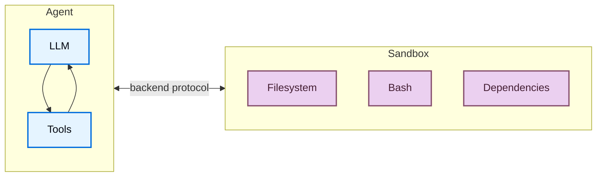
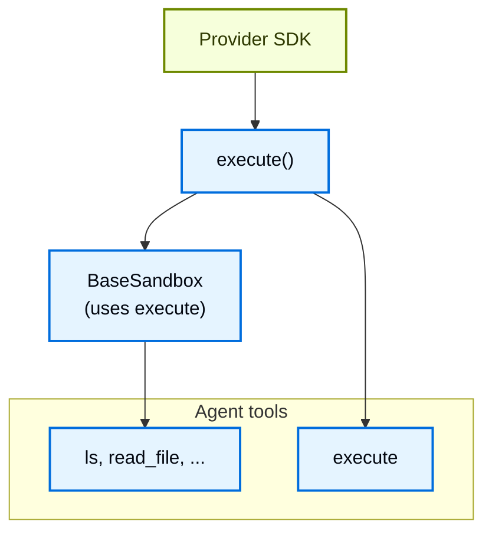
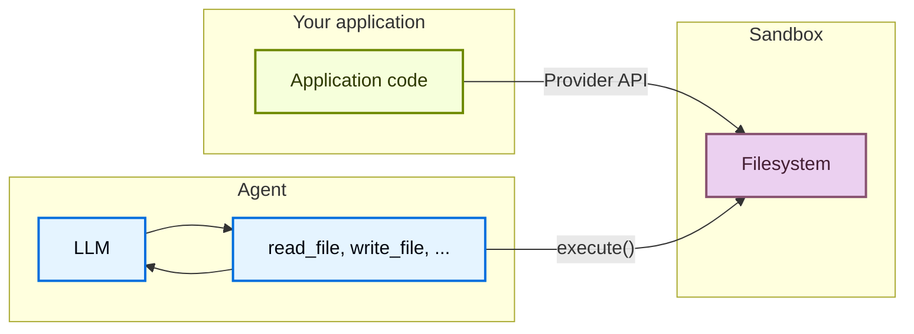

import SandboxBasicPy from '/snippets/deepagents-sandbox-basic-py.mdx';
import SandboxBasicJs from '/snippets/deepagents-sandbox-basic-js.mdx';

智能体会生成代码、与文件系统交互并运行shell命令。由于我们无法预测智能体可能执行的操作，因此确保其环境隔离至关重要，以防止其访问凭证、文件或网络。沙盒通过在智能体的执行环境与你的主机系统之间创建边界来提供这种隔离。

在 Deep Agents 中，**沙盒是[后端](/oss/python/deepagents/backends)**，它们定义了智能体运行的环境。与其他仅暴露文件操作的后端（State、Filesystem、Store）不同，沙盒后端还为智能体提供了一个用于运行shell命令的 `execute` 工具。当你配置沙盒后端时，智能体会获得：

- 所有标准文件系统工具（`ls`、`read_file`、`write_file`、`edit_file`、`glob`、`grep`）
- 用于在沙盒中运行任意shell命令的 `execute` 工具
- 保护你主机系统的安全边界


```mermaid
graph LR
    subgraph Agent
        LLM --> Tools
        Tools --> LLM
    end

    Agent <-- backend protocol --> Sandbox

    subgraph Sandbox
        Filesystem
        Bash
        Dependencies
    end

    classDef process fill:#E5F4FF,stroke:#006DDD,stroke-width:2px,color:#030710
    classDef output fill:#EBD0F0,stroke:#885270,stroke-width:2px,color:#441E33

    class LLM,Tools process
    class Filesystem,Bash,Dependencies output
```

## 为什么使用沙盒？

沙盒用于安全目的。
它们允许智能体执行任意代码、访问文件和使用网络，而不会危及你的凭证、本地文件或主机系统。
当智能体自主运行时，这种隔离至关重要。

沙盒特别适用于：

- 编码智能体：自主运行的智能体可以使用shell、git、克隆仓库（许多提供商提供原生git API，例如 [Daytona的git操作](https://www.daytona.io/docs/en/git-operations/)），并在Docker-in-Docker中运行构建和测试流水线
- 数据分析智能体——在安全、隔离的环境中加载文件、安装数据分析库（pandas、numpy等）、运行统计计算并创建输出（如PowerPoint演示文稿）

<Tip>
    **使用 Deep Agents CLI？** CLI通过 `--sandbox` 标志内置了沙盒支持。有关CLI特定的设置、标志（`--sandbox-id`、`--sandbox-setup`）和示例，请参阅[使用远程沙盒](/oss/python/deepagents/cli/overview#use-remote-sandboxes)。
</Tip>

## 基本用法

这些示例假设你已经使用提供商的SDK创建了沙盒/devbox并设置了凭证。有关注册、认证和提供商特定的生命周期详情，请参阅[可用提供商](#available-providers)。


<SandboxBasicPy />


## 可用提供商

有关提供商特定的设置、认证和生命周期详情，请参阅[沙盒集成](/oss/python/integrations/sandboxes)。


没有看到你的提供商？你可以实现自己的沙盒后端。请参阅[贡献沙盒集成](/oss/python/contributing/integrations-langchain)。

## 生命周期和作用域

沙盒在关闭之前会消耗资源并产生费用。如何管理其生命周期取决于你的应用程序。

选择沙盒生命周期如何映射到你的应用程序资源。有关此决策的更多信息，请参阅[投入生产](/oss/python/deepagents/going-to-production#sandboxes)。

### 线程作用域（默认）

每个对话都有自己的沙盒。沙盒在第一次运行开始时创建，并在同一对话线程的后续消息中重复使用。当对话线程被清理（或沙盒TTL过期）时，沙盒将被销毁。这是大多数智能体的正确默认设置。

示例：一个数据分析机器人，每个对话都从一个干净的环境开始。

### 助手作用域

给定[助手](/langsmith/assistants)的所有对话线程共享一个沙盒。沙盒ID存储在助手的配置中，因此每个对话都会返回到相同的环境。文件、安装的包和克隆的仓库在对话之间持续存在。当智能体维护一个长期运行的工作区时使用此模式。

示例：一个编码助手，在对话之间维护一个克隆的仓库和已安装的依赖项。

<Warning>
助手作用域的沙盒会随着时间的推移积累文件、安装的包和其他沙盒内状态。请使用你的沙盒提供商配置TTL，使用快照定期重置，或实现清理逻辑以防止沙盒的磁盘和内存无限增长。线程作用域的沙盒通过每次对话都从新开始来避免此问题。
</Warning>

### 基本生命周期


<Tabs>
    <Tab title="Daytona">

        ```python
        from daytona import Daytona

        from langchain_daytona import DaytonaSandbox

        sandbox = Daytona().create()
        backend = DaytonaSandbox(sandbox=sandbox)

        result = backend.execute("echo hello")
        # ... 使用沙盒
        sandbox.stop()
        ```

    </Tab>
    <Tab title="Modal">

        ```python
        import modal

        from langchain_modal import ModalSandbox

        app = modal.App.lookup("your-app")
        modal_sandbox = modal.Sandbox.create(app=app)
        backend = ModalSandbox(sandbox=modal_sandbox)

        result = backend.execute("echo hello")
        # ... 使用沙盒
        modal_sandbox.terminate()
        ```

    </Tab>
    <Tab title="Runloop">

        ```python
        from runloop_api_client import RunloopSDK

        from langchain_runloop import RunloopSandbox

        client = RunloopSDK(bearer_token="...")
        devbox = client.devbox.create()
        backend = RunloopSandbox(devbox=devbox)

        result = backend.execute("echo hello")
        # ... 使用沙盒
        devbox.shutdown()
        ```

    </Tab>
    <Tab title="AgentCore">

        ```python
        from bedrock_agentcore.tools.code_interpreter_client import CodeInterpreter

        from langchain_agentcore_codeinterpreter import AgentCoreSandbox

        interpreter = CodeInterpreter(region="us-west-2")
        interpreter.start()

        backend = AgentCoreSandbox(interpreter=interpreter)

        result = backend.execute("echo hello")
        # ... 使用沙盒
        interpreter.stop()
        ```

    </Tab>
    <Tab title="LangSmith">

        ```python
        from langsmith.sandbox import SandboxClient

        from deepagents.backends.langsmith import LangSmithSandbox

        client = SandboxClient()
        ls_sandbox = client.create_sandbox(template_name="deepagents-deploy")

        backend = LangSmithSandbox(sandbox=ls_sandbox)

        result = backend.execute("echo hello")
        # ... 使用沙盒
        client.delete_sandbox(backend.id)
        ```

    </Tab>
</Tabs>


### 每次对话的生命周期

在聊天应用中，一个对话通常由一个 `thread_id` 表示。
通常，每个 `thread_id` 应该使用自己独特的沙盒。

在你的应用程序中存储沙盒ID和 `thread_id` 之间的映射，或者如果沙盒提供商允许向沙盒附加元数据，则将其存储在沙盒中。

<Tip>
**聊天应用的TTL。** 当用户可以在空闲时间后重新参与时，你通常不知道他们是否会返回或何时返回。在沙盒上配置生存时间（TTL）——例如，TTL归档或TTL删除——以便提供商自动清理空闲的沙盒。许多沙盒提供商支持此功能。
</Tip>

以下示例展示了使用 Daytona 的获取或创建模式。
有关其他提供商，请查阅沙盒提供商API以获取等效的标签、元数据和TTL选项：

```python
from langchain_core.utils.uuid import uuid7

from daytona import CreateSandboxFromSnapshotParams, Daytona
from deepagents import create_deep_agent
from langchain_daytona import DaytonaSandbox

client = Daytona()
thread_id = str(uuid7())

# 通过 thread_id 获取或创建沙盒
try:
    sandbox = client.find_one(labels={"thread_id": thread_id})
except Exception:
    params = CreateSandboxFromSnapshotParams(
        labels={"thread_id": thread_id},
        # 添加TTL以便沙盒在空闲时被清理
        auto_delete_interval=3600,
    )
    sandbox = client.create(params)

backend = DaytonaSandbox(sandbox=sandbox)
agent = create_deep_agent(
    model="google_genai:gemini-3.1-pro-preview",
    backend=backend,
    system_prompt="You are a coding assistant with sandbox access. You can create and run code in the sandbox.",
)

try:
    result = agent.invoke(
        {
            "messages": [
                {
                    "role": "user",
                    "content": "Create a hello world Python script and run it",
                }
            ]
        },
        config={
            "configurable": {
                "thread_id": thread_id,
            }
        },
    )
    print(result["messages"][-1].content)
except Exception:
    # 可选：在异常时主动删除沙盒
    client.delete(sandbox)
    raise
```


## 集成模式

有两种架构模式用于将智能体与沙盒集成，基于智能体运行的位置。

### 沙盒内智能体模式

智能体在沙盒内运行，你通过网络与其通信。你构建一个预装了智能体框架的Docker或VM镜像，在沙盒内运行它，并从外部连接以发送消息。

优点：

- ✅ 与本地开发高度相似。
- ✅ 智能体与环境紧密耦合。

权衡：

- 🔴 API密钥必须存放在沙盒内（安全风险）。
- 🔴 更新需要重新构建镜像。
- 🔴 需要通信基础设施（WebSocket或HTTP层）。

要在沙盒内运行智能体，构建一个镜像并在其上安装deepagents。

```dockerfile
FROM python:3.11
RUN pip install deepagents-cli
```

然后在沙盒内运行智能体。
要在沙盒内使用智能体，你必须添加额外的基础设施来处理你的应用程序与沙盒内智能体之间的通信。

### 沙盒作为工具模式

智能体在你的机器或服务器上运行。当它需要执行代码时，它会调用沙盒工具（如 `execute`、`read_file` 或 `write_file`），这些工具调用提供商的API在远程沙盒中运行操作。

优点：

- ✅ 无需重新构建镜像即可即时更新智能体代码。
- ✅ 智能体状态与执行之间更清晰的分离。
    - API密钥保持在沙盒外。
    - 沙盒故障不会丢失智能体状态。
    - 可以选择在多个沙盒中并行运行任务。
- ✅ 仅为执行时间付费。

权衡：

- 🔴 每次执行调用都有网络延迟。

```python Example
from daytona import Daytona
from deepagents import create_deep_agent
from dotenv import load_dotenv
from langchain_daytona import DaytonaSandbox


load_dotenv()

# 也可以使用 AgentCore、E2B、Runloop、Modal 实现
sandbox = Daytona().create()
backend = DaytonaSandbox(sandbox=sandbox)

agent = create_deep_agent(
    model="google_genai:gemini-3.1-pro-preview",
    backend=backend,
    system_prompt="You are a coding assistant with sandbox access. You can create and run code in the sandbox.",
)

try:
    result = agent.invoke(
        {
            "messages": [
                {
                    "role": "user",
                    "content": "Create a hello world Python script and run it",
                }
            ]
        }
    )
    print(result["messages"][-1].content)
except Exception:
    # 可选：在异常时主动删除沙盒
    sandbox.stop()
    raise
```


本文档中的示例使用沙盒作为工具模式。
当你的提供商的SDK处理通信层并且你希望生产环境与本地开发相似时，选择沙盒内智能体模式。
当你需要快速迭代智能体逻辑、将API密钥保持在沙盒外，或者更喜欢更清晰的关注点分离时，选择沙盒作为工具模式。

## 沙盒如何工作

### 隔离边界

所有沙盒提供商都保护你的主机系统免受智能体的文件系统和shell操作的影响。智能体无法读取你的本地文件、访问你机器上的环境变量或干扰其他进程。然而，沙盒本身**不能**防止：

- **上下文注入**：控制智能体部分输入的攻击者可以指示其在沙盒内运行任意命令。沙盒是隔离的，但智能体在其中拥有完全控制权。
- **网络数据泄露**：除非网络访问被阻止，否则上下文注入的智能体可以通过HTTP或DNS将数据从沙盒中发送出去。一些提供商支持阻止网络访问（例如，Modal上的 `blockNetwork: true`）。

有关如何处理密钥和缓解这些风险的信息，请参阅[安全注意事项](#security-considerations)。

### `execute` 方法

沙盒后端具有简单的架构：提供商必须实现的唯一方法是 `execute()`，它运行一个shell命令并返回其输出。所有其他文件系统操作（`read`、`write`、`edit`、`ls`、`glob`、`grep`）都是由 [`BaseSandbox`](https://reference.langchain.com/python/deepagents/backends/sandbox/BaseSandbox) 基类在 `execute()` 之上构建的，该基类构造脚本并通过 `execute()` 在沙盒内运行它们。


```mermaid
graph TB
    subgraph "Agent tools"
        Tools["ls, read_file, ..."]
        execute
    end

    BaseSandbox["BaseSandbox<br/>(uses execute)"] --> Tools
    execute_method["execute()"] --> BaseSandbox
    execute_method --> execute
    Provider["Provider SDK"] --> execute_method

    classDef process fill:#E5F4FF,stroke:#006DDD,stroke-width:2px,color:#030710
    classDef trigger fill:#F6FFDB,stroke:#6E8900,stroke-width:2px,color:#2E3900

    class Tools,execute process
    class BaseSandbox,execute_method process
    class Provider trigger
```

这种设计意味着：
- **添加新提供商很简单。** 实现 `execute()`——基类处理其他所有事情。
- **`execute` 工具是条件可用的。** 在每次模型调用时，工具检查后端是否实现了 [`SandboxBackendProtocol`](https://reference.langchain.com/python/deepagents/backends/protocol/SandboxBackendProtocol)。如果没有，该工具将被过滤掉，智能体永远不会看到它。

当智能体调用 `execute` 工具时，它提供一个 `command` 字符串，并返回组合的stdout/stderr、退出码，以及如果输出过大时的截断通知。

你也可以在应用程序代码中直接调用后端的 `execute()` 方法。

<Tabs>
    <Tab title="Daytona">
        <CodeGroup>
            ```bash pip
            pip install langchain-daytona
            ```

            ```bash uv
            uv add langchain-daytona
            ```
        </CodeGroup>

        ```python
        from daytona import Daytona

        from langchain_daytona import DaytonaSandbox

        sandbox = Daytona().create()
        backend = DaytonaSandbox(sandbox=sandbox)

        result = backend.execute("python --version")
        print(result.output)
        ```
    </Tab>
    <Tab title="Modal">
        ```python
        import modal

        from langchain_modal import ModalSandbox

        app = modal.App.lookup("your-app")
        modal_sandbox = modal.Sandbox.create(app=app)
        backend = ModalSandbox(sandbox=modal_sandbox)

        result = backend.execute("python --version")
        print(result.output)
        ```
    </Tab>
    <Tab title="Runloop">
        <CodeGroup>
            ```bash pip
            pip install langchain-runloop
            ```

            ```bash uv
            uv add langchain-runloop
            ```
        </CodeGroup>

        ```python
        from runloop_api_client import RunloopSDK

        from langchain_runloop import RunloopSandbox

        api_key = "..."
        client = RunloopSDK(bearer_token=api_key)

        devbox = client.devbox.create()
        backend = RunloopSandbox(devbox=devbox)

        try:
            result = backend.execute("python --version")
            print(result.output)
        finally:
            devbox.shutdown()
        ```
    </Tab>
    <Tab title="AgentCore">
        <CodeGroup>
            ```bash pip
            pip install langchain-agentcore-codeinterpreter
            ```

            ```bash uv
            uv add langchain-agentcore-codeinterpreter
            ```
        </CodeGroup>

        ```python
        from bedrock_agentcore.tools.code_interpreter_client import CodeInterpreter

        from langchain_agentcore_codeinterpreter import AgentCoreSandbox

        interpreter = CodeInterpreter(region="us-west-2")
        interpreter.start()

        backend = AgentCoreSandbox(interpreter=interpreter)

        try:
            result = backend.execute("python3 --version")
            print(result.output)
        finally:
            interpreter.stop()
        ```
    </Tab>
    <Tab title="LangSmith">
        ```python
        from langsmith.sandbox import SandboxClient

        from deepagents.backends.langsmith import LangSmithSandbox

        client = SandboxClient()
        ls_sandbox = client.create_sandbox(template_name="deepagents-deploy")
        backend = LangSmithSandbox(sandbox=ls_sandbox)

        result = backend.execute("python --version")
        print(result.output)
        ```
    </Tab>
</Tabs>


例如：

```
4
[Command succeeded with exit code 0]
```

```
bash: foobar: command not found
[Command failed with exit code 127]
```

如果命令产生非常大的输出，结果会自动保存到一个文件中，并指示智能体使用 `read_file` 来增量访问它。这可以防止上下文窗口溢出。

### 文件访问的两个平面

文件进出沙盒有两种不同的方式，理解何时使用每种方式非常重要：

**智能体文件系统工具**：`read_file`、`write_file`、`edit_file`、`ls`、`glob`、`grep` 和 `execute` 是LLM在其执行期间调用的工具。这些工具通过沙盒内的 `execute()` 运行。智能体使用它们来读取代码、写入文件和运行命令，作为其任务的一部分。

**文件传输API**：你的应用程序代码调用的 `uploadFiles()` 和 `downloadFiles()` 方法。这些使用提供商的原生文件传输API（不是shell命令），旨在在你的主机环境和沙盒之间移动文件。使用这些来：
- 在智能体运行之前，用源代码、配置或数据**填充沙盒**
- 在智能体完成后**检索工件**（生成的代码、构建输出、报告）
- **预填充依赖项**，智能体将需要这些依赖项


```mermaid
graph LR
    subgraph "Your application"
        App[Application code]
    end

    subgraph "Agent"
        LLM --> Tools["read_file, write_file, ..."]
        Tools --> LLM
    end

    subgraph "Sandbox"
        FS[Filesystem]
    end

    App -- "Provider API" --> FS
    Tools -- "execute()" --> FS

    classDef trigger fill:#F6FFDB,stroke:#6E8900,stroke-width:2px,color:#2E3900
    classDef process fill:#E5F4FF,stroke:#006DDD,stroke-width:2px,color:#030710
    classDef output fill:#EBD0F0,stroke:#885270,stroke-width:2px,color:#441E33

    class App trigger
    class LLM,Tools process
    class FS output
```


## 处理文件

deepagents 沙盒后端支持文件传输API，用于在你的应用程序和沙盒之间移动文件。

### 填充沙盒

使用 `upload_files()` 在智能体运行之前填充沙盒。路径必须是绝对路径，内容是 `bytes`：

<Tabs>
    <Tab title="Daytona">
        <CodeGroup>
            ```bash pip
            pip install langchain-daytona
            ```

            ```bash uv
            uv add langchain-daytona
            ```
        </CodeGroup>

        ```python
        from daytona import Daytona

        from langchain_daytona import DaytonaSandbox

        sandbox = Daytona().create()
        backend = DaytonaSandbox(sandbox=sandbox)

        backend.upload_files(
            [
                ("/src/index.py", b"print('Hello')\n"),
                ("/pyproject.toml", b"[project]\nname = 'my-app'\n"),
            ]
        )
        ```
    </Tab>
    <Tab title="Modal">
        ```python
        import modal

        from langchain_modal import ModalSandbox

        app = modal.App.lookup("your-app")
        modal_sandbox = modal.Sandbox.create(app=app)
        backend = ModalSandbox(sandbox=modal_sandbox)

        backend.upload_files(
            [
                ("/src/index.py", b"print('Hello')\n"),
                ("/pyproject.toml", b"[project]\nname = 'my-app'\n"),
            ]
        )
        ```
    </Tab>
    <Tab title="Runloop">
        <CodeGroup>
            ```bash pip
            pip install langchain-runloop
            ```

            ```bash uv
            uv add langchain-runloop
            ```
        </CodeGroup>

        ```python
        from runloop_api_client import RunloopSDK

        from langchain_runloop import RunloopSandbox

        api_key = "..."
        client = RunloopSDK(bearer_token=api_key)

        devbox = client.devbox.create()
        backend = RunloopSandbox(devbox=devbox)

        backend.upload_files(
            [
                ("/src/index.py", b"print('Hello')\n"),
                ("/pyproject.toml", b"[project]\nname = 'my-app'\n"),
            ]
        )
        ```
    </Tab>
    <Tab title="AgentCore">
        <CodeGroup>
            ```bash pip
            pip install langchain-agentcore-codeinterpreter
            ```

            ```bash uv
            uv add langchain-agentcore-codeinterpreter
            ```
        </CodeGroup>

        ```python
        from bedrock_agentcore.tools.code_interpreter_client import CodeInterpreter

        from langchain_agentcore_codeinterpreter import AgentCoreSandbox

        interpreter = CodeInterpreter(region="us-west-2")
        interpreter.start()

        backend = AgentCoreSandbox(interpreter=interpreter)

        backend.upload_files(
            [
                ("hello.py", b"print('Hello')\n"),
                ("data.csv", b"name,value\na,1\nb,2\n"),
            ]
        )
        ```
    </Tab>
    <Tab title="LangSmith">

        ```python
        from langsmith.sandbox import SandboxClient

        from deepagents.backends.langsmith import LangSmithSandbox

        client = SandboxClient()
        ls_sandbox = client.create_sandbox(template_name="deepagents-deploy")
        backend = LangSmithSandbox(sandbox=ls_sandbox)

        backend.upload_files(
            [
                ("/src/index.py", b"print('Hello')\n"),
                ("/pyproject.toml", b"[project]\nname = 'my-app'\n"),
            ]
        )
        ```
    </Tab>
</Tabs>

### 检索工件

使用 `download_files()` 在智能体完成后从沙盒检索文件：

<Tabs>
    <Tab title="Daytona">
        <CodeGroup>
            ```bash pip
            pip install langchain-daytona
            ```

            ```bash uv
            uv add langchain-daytona
            ```
        </CodeGroup>

        ```python
        from daytona import Daytona

        from langchain_daytona import DaytonaSandbox

        sandbox = Daytona().create()
        backend = DaytonaSandbox(sandbox=sandbox)

        results = backend.download_files(["/src/index.py", "/output.txt"])
        for result in results:
            if result.content is not None:
                print(f"{result.path}: {result.content.decode()}")
            else:
                print(f"Failed to download {result.path}: {result.error}")
        ```
    </Tab>
    <Tab title="Modal">
        ```python
        import modal

        from langchain_modal import ModalSandbox

        app = modal.App.lookup("your-app")
        modal_sandbox = modal.Sandbox.create(app=app)
        backend = ModalSandbox(sandbox=modal_sandbox)

        results = backend.download_files(["/src/index.py", "/output.txt"])
        for result in results:
            if result.content is not None:
                print(f"{result.path}: {result.content.decode()}")
            else:
                print(f"Failed to download {result.path}: {result.error}")
        ```
    </Tab>
    <Tab title="Runloop">
        <CodeGroup>
            ```bash pip
            pip install langchain-runloop
            ```

            ```bash uv
            uv add langchain-runloop
            ```
        </CodeGroup>

        ```python
        from runloop_api_client import RunloopSDK

        from langchain_runloop import RunloopSandbox

        api_key = "..."
        client = RunloopSDK(bearer_token=api_key)

        devbox = client.devbox.create()
        backend = RunloopSandbox(devbox=devbox)

        results = backend.download_files(["/src/index.py", "/output.txt"])
        for result in results:
            if result.content is not None:
                print(f"{result.path}: {result.content.decode()}")
            else:
                print(f"Failed to download {result.path}: {result.error}")
        ```
    </Tab>
    <Tab title="AgentCore">
        <CodeGroup>
            ```bash pip
            pip install langchain-agentcore-codeinterpreter
            ```

            ```bash uv
            uv add langchain-agentcore-codeinterpreter
            ```
        </CodeGroup>

        ```python
        from bedrock_agentcore.tools.code_interpreter_client import CodeInterpreter

        from langchain_agentcore_codeinterpreter import AgentCoreSandbox

        interpreter = CodeInterpreter(region="us-west-2")
        interpreter.start()

        backend = AgentCoreSandbox(interpreter=interpreter)

        results = backend.download_files(["hello.py"])
        for result in results:
            if result.content is not None:
                print(f"{result.path}: {result.content.decode()}")
            else:
                print(f"Failed to download {result.path}: {result.error}")

        interpreter.stop()
        ```
    </Tab>
    <Tab title="LangSmith">
        ```python
        from langsmith.sandbox import SandboxClient

        from deepagents.backends.langsmith import LangSmithSandbox

        client = SandboxClient()
        ls_sandbox = client.create_sandbox(template_name="deepagents-deploy")
        backend = LangSmithSandbox(sandbox=ls_sandbox)

        results = backend.download_files(["/src/index.py", "/output.txt"])
        for result in results:
            if result.content is not None:
                print(f"{result.path}: {result.content.decode()}")
            else:
                print(f"Failed to download {result.path}: {result.error}")
        ```
    </Tab>
</Tabs>

<Note>
在沙盒内，智能体使用文件系统工具（`read_file`、`write_file`）。`upload_files` 和 `download_files` 方法是供你的应用程序代码在主机和沙盒之间的边界移动文件使用的。
</Note>


## 安全注意事项

沙盒将代码执行与你的主机系统隔离，但它们不能防止**上下文注入**。控制智能体部分输入的攻击者可以指示其在沙盒内读取文件、运行命令或泄露数据。这使得沙盒内的凭证尤其危险。

<Warning>
**切勿将密钥放入沙盒内。** 通过环境变量、挂载文件或 `secrets` 选项注入沙盒的API密钥、令牌、数据库凭证和其他密钥，可以被上下文注入的智能体读取和泄露。这甚至适用于短期或有范围的凭证——如果智能体可以访问它们，攻击者也可以。
</Warning>

### 安全处理密钥

如果你的智能体需要调用经过身份验证的API或访问受保护的资源，你有两个选择：

1. **将密钥保存在沙盒外的工具中。** 定义在你的主机环境中运行（而不是在沙盒内）的工具，并在那里处理身份验证。智能体按名称调用这些工具，但永远看不到凭证。这是推荐的方法。

2. **使用注入凭证的网络代理。** 一些沙盒提供商支持代理，这些代理拦截来自沙盒的传出HTTP请求，并在转发之前附加凭证（例如，`Authorization` 头）。智能体永远看不到密钥——它只是向URL发出普通请求。这种方法尚未在提供商中广泛可用。

<Warning>
如果你必须将密钥注入沙盒（不推荐），请采取以下预防措施：

- 为**所有**工具调用启用[人在回路](/oss/python/deepagents/human-in-the-loop)批准，而不仅仅是敏感调用
- 阻止或限制沙盒的网络访问以限制泄露路径
- 使用尽可能窄的凭证范围和尽可能短的生存时间
- 监控沙盒网络流量以发现意外的出站请求

即使有这些保障措施，这仍然是一个不安全的变通方法。足够有创意的上下文注入攻击可以绕过输出过滤和HITL审查。
</Warning>

### 通用最佳实践

- 在应用程序中对沙盒输出采取行动之前，请先审查它们
- 当不需要时阻止沙盒网络访问
- 使用[中间件](/oss/python/langchain/middleware)过滤或编辑工具输出中的敏感模式
- 将沙盒内产生的所有内容视为不受信任的输入

---

<div className="source-links">
<Callout icon="terminal-2">
    [将这些文档连接](/use-these-docs)到Claude、VSCode等，通过MCP获取实时答案。
</Callout>
<Callout icon="edit">
    [在GitHub上编辑此页面](https://github.com/langchain-ai/docs/edit/main/src/oss/deepagents/sandboxes.mdx)或[提交问题](https://github.com/langchain-ai/docs/issues/new/choose)。
</Callout>
</div>