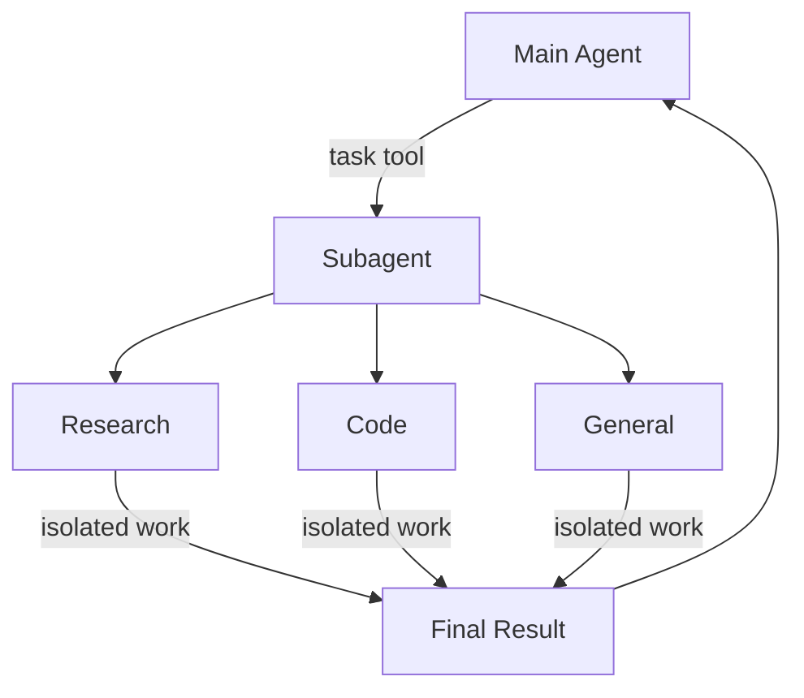

import SubagentBasic from '/snippets/subagent-basic.mdx';

深度智能体可以创建子智能体来委托工作。您可以在 `subagents` 参数中指定自定义子智能体。子智能体适用于[上下文隔离](https://www.dbreunig.com/2025/06/26/how-to-fix-your-context.html#context-quarantine)（保持主智能体上下文整洁）以及提供专业化指令。



## 为何使用子智能体？

子智能体解决了**上下文膨胀问题**。当智能体使用具有大量输出的工具（网络搜索、文件读取、数据库查询）时，上下文窗口会迅速被中间结果填满。子智能体将这些详细工作隔离——主智能体只接收最终结果，而不是产生结果的数十个工具调用。

**适合使用子智能体的场景：**
- ✅ 会使主智能体上下文混乱的多步骤任务
- ✅ 需要自定义指令或工具的专业领域
- ✅ 需要不同模型能力的任务
- ✅ 希望主智能体专注于高层级协调时

**不适合使用子智能体的场景：**
- ❌ 简单的单步骤任务
- ❌ 需要维护中间上下文时
- ❌ 开销超过收益时

## 配置

`subagents` 应为字典列表或 `CompiledSubAgent` 对象列表。有两种类型：

### SubAgent（基于字典）

对于大多数用例，将子智能体定义为具有以下字段的字典：

| 字段 | 类型 | 描述 |
|-------|------|-------------|
| `name` | `str` | 必填。子智能体的唯一标识符。主智能体在调用 `task()` 工具时使用此名称。子智能体名称会成为 `AIMessage` 的元数据及流式传输标识，有助于区分不同智能体。 |
| `description` | `str` | 必填。描述此子智能体的功能。请具体描述且以动作为导向。主智能体根据此描述决定何时委托。 |
| `system_prompt` | `str` | 必填。子智能体的指令。自定义子智能体必须自行定义。包含工具使用指南和输出格式要求。<br></br>不继承主智能体的设置。 |
| `tools` | `list[Callable]` | 必填。子智能体可使用的工具。自定义子智能体自行指定。请保持最小化，仅包含必要的工具。<br></br>不继承主智能体的设置。 |
| `model` | `str` \| `BaseChatModel` | 可选。覆盖主智能体的模型。省略则使用主智能体的模型。<br></br>默认继承自主智能体。可以传入模型标识字符串（如 `'openai:gpt-5'`，使用 `'provider:model'` 格式）或 LangChain 聊天模型对象（`init_chat_model("gpt-5")` 或 `ChatOpenAI(model="gpt-5")`）。 |
| `middleware` | `list[Middleware]` | 可选。用于自定义行为、日志记录或限流的额外中间件。<br></br>不继承主智能体的设置。 |
| `interrupt_on` | `dict[str, bool]` | 可选。为特定工具配置[人工介入](/oss/python/deepagents/human-in-the-loop)。子智能体值覆盖主智能体。需要检查点（checkpointer）。<br></br>默认继承自主智能体，子智能体值覆盖默认值。 |
| `skills` | `list[str]` | 可选。[技能](/oss/python/deepagents/skills)来源路径。指定后，子智能体将从这些目录加载技能（例如 `["/skills/research/", "/skills/web-search/"]`），使子智能体拥有与主智能体不同的技能集。<br></br>不继承主智能体的设置。只有通用子智能体才继承主智能体的技能。当子智能体具有技能时，它会运行自己独立的 `SkillsMiddleware` 实例。技能状态完全隔离——子智能体加载的技能对父智能体不可见，反之亦然。 |


### CompiledSubAgent

对于复杂工作流，使用预构建的 LangGraph 图：

| 字段 | 类型 | 描述 |
|-------|------|-------------|
| `name` | `str` | 必填。子智能体的唯一标识符。子智能体名称会成为 `AIMessage` 的元数据及流式传输标识，有助于区分不同智能体。 |
| `description` | `str` | 必填。描述此子智能体的功能。 |
| `runnable` | `Runnable` | 必填。已编译的 LangGraph 图（必须先调用 `.compile()`）。 |

## 使用 SubAgent

<SubagentBasic />

## 使用 CompiledSubAgent

对于更复杂的用例，您可以提供自定义子智能体。
您可以使用 LangChain 的 `create_agent` 或通过[图 API](/oss/python/langgraph/graph-api) 创建自定义 LangGraph 图来构建自定义子智能体。

如果您正在创建自定义 LangGraph 图，请确保图中包含[名为 `"messages"` 的状态键](/oss/python/langgraph/quickstart#2-define-state)：

```python
from deepagents import create_deep_agent, CompiledSubAgent
from langchain.agents import create_agent

# Create a custom agent graph
custom_graph = create_agent(
    model=your_model,
    tools=specialized_tools,
    prompt="You are a specialized agent for data analysis..."
)

# Use it as a custom subagent
custom_subagent = CompiledSubAgent(
    name="data-analyzer",
    description="Specialized agent for complex data analysis tasks",
    runnable=custom_graph
)

subagents = [custom_subagent]

agent = create_deep_agent(
    model="claude-sonnet-4-6",
    tools=[internet_search],
    system_prompt=research_instructions,
    subagents=subagents
)
```


## 流式传输

流式传输跟踪信息时，智能体名称以 `lc_agent_name` 的形式出现在元数据中。
查看跟踪信息时，您可以使用此元数据区分数据来自哪个智能体。

以下示例创建了名为 `main-agent` 的深度智能体和名为 `research-agent` 的子智能体：

```python
import os
from typing import Literal
from tavily import TavilyClient
from deepagents import create_deep_agent

tavily_client = TavilyClient(api_key=os.environ["TAVILY_API_KEY"])

def internet_search(
    query: str,
    max_results: int = 5,
    topic: Literal["general", "news", "finance"] = "general",
    include_raw_content: bool = False,
):
    """Run a web search"""
    return tavily_client.search(
        query,
        max_results=max_results,
        include_raw_content=include_raw_content,
        topic=topic,
    )

research_subagent = {
    "name": "research-agent",
    "description": "Used to research more in depth questions",
    "system_prompt": "You are a great researcher",
    "tools": [internet_search],
    "model": "claude-sonnet-4-6",  # Optional override, defaults to main agent model
}
subagents = [research_subagent]

agent = create_deep_agent(
    model="claude-sonnet-4-6",
    subagents=subagents,
    name="main-agent"
)
```

提示深度智能体时，所有由子智能体或深度智能体执行的智能体运行，其元数据中都会包含智能体名称。
在此例中，名为 `"research-agent"` 的子智能体，其所有关联智能体运行元数据中都会包含 `{'lc_agent_name': 'research-agent'}`：


## 结构化输出

所有子智能体均支持[结构化输出](/oss/python/langchain/structured-output)，可用于验证子智能体的输出。

您可以通过向 `create_agent()` 调用传入 `response_format` 参数来设置期望的结构化输出模式。
当模型生成结构化数据时，数据会被捕获并验证。
结构化对象本身不会返回给父智能体。
在子智能体中使用结构化输出时，请将结构化数据包含在 `ToolMessage` 中。


有关更多信息，请参阅[响应格式](/oss/python/langchain/structured-output#response-format)。

## 通用子智能体

除用户自定义的子智能体之外，深度智能体始终可以访问一个 `general-purpose`（通用）子智能体。此子智能体：

- 与主智能体具有相同的系统提示
- 可访问所有相同的工具
- 使用相同的模型（除非被覆盖）
- 从主智能体继承技能（配置技能时）

### 覆盖通用子智能体

在 `subagents` 列表中包含 `name="general-purpose"` 的子智能体即可替换默认值。可用此方式为通用子智能体配置不同的模型、工具或系统提示：

```python
from deepagents import create_deep_agent

# Main agent uses Claude; general-purpose subagent uses GPT
agent = create_deep_agent(
    model="claude-sonnet-4-6",
    tools=[internet_search],
    subagents=[
        {
            "name": "general-purpose",
            "description": "General-purpose agent for research and multi-step tasks",
            "system_prompt": "You are a general-purpose assistant.",
            "tools": [internet_search],
            "model": "openai:gpt-4o",  # Different model for delegated tasks
        },
    ],
)
```


当您提供使用通用名称的子智能体时，默认的通用子智能体不会被添加。您的规格将完全替换它。

### 适用场景

通用子智能体非常适合在不需要专业化行为的情况下进行上下文隔离。主智能体可以将复杂的多步骤任务委托给此子智能体，并获得简洁的结果，而无需中间工具调用造成的上下文膨胀。

<Card title="示例">
    主智能体不必进行 10 次网络搜索并用结果填满上下文，而是委托给通用子智能体：`task(name="general-purpose", task="Research quantum computing trends")`。子智能体在内部执行所有搜索，只返回摘要。
</Card>

### 技能继承

使用 `create_deep_agent` 配置[技能](/oss/python/deepagents/skills)时：

- **通用子智能体**：自动继承主智能体的技能
- **自定义子智能体**：默认不继承技能——使用 `skills` 参数为其提供专属技能

<Note>
    只有配置了技能的子智能体才会获得 `SkillsMiddleware` 实例——没有 `skills` 参数的自定义子智能体不会获得。技能状态在两个方向上完全隔离：父智能体的技能对子智能体不可见，子智能体的技能也不会传播回父智能体。
</Note>

```python
from deepagents import create_deep_agent

# Research subagent with its own skills
research_subagent = {
    "name": "researcher",
    "description": "Research assistant with specialized skills",
    "system_prompt": "You are a researcher.",
    "tools": [web_search],
    "skills": ["/skills/research/", "/skills/web-search/"],  # Subagent-specific skills
}

agent = create_deep_agent(
    model="claude-sonnet-4-6",
    skills=["/skills/main/"],  # Main agent and GP subagent get these
    subagents=[research_subagent],  # Gets only /skills/research/ and /skills/web-search/
)
```


## 最佳实践

### 编写清晰的描述

主智能体使用描述来决定调用哪个子智能体。请具体描述：

✅ **好的描述：** `"Analyzes financial data and generates investment insights with confidence scores"`

❌ **不好的描述：** `"Does finance stuff"`

### 保持系统提示详细

包含关于如何使用工具和格式化输出的具体指导：

```python
research_subagent = {
    "name": "research-agent",
    "description": "Conducts in-depth research using web search and synthesizes findings",
    "system_prompt": """You are a thorough researcher. Your job is to:

    1. Break down the research question into searchable queries
    2. Use internet_search to find relevant information
    3. Synthesize findings into a comprehensive but concise summary
    4. Cite sources when making claims

    Output format:
    - Summary (2-3 paragraphs)
    - Key findings (bullet points)
    - Sources (with URLs)

    Keep your response under 500 words to maintain clean context.""",
    "tools": [internet_search],
}
```


### 最小化工具集

只给子智能体它们需要的工具，以提高专注度和安全性：

```python
# ✅ Good: Focused tool set
email_agent = {
    "name": "email-sender",
    "tools": [send_email, validate_email],  # Only email-related
}

# ❌ Bad: Too many tools
email_agent = {
    "name": "email-sender",
    "tools": [send_email, web_search, database_query, file_upload],  # Unfocused
}
```


### 按任务选择模型

不同的模型擅长不同的任务：

```python
subagents = [
    {
        "name": "contract-reviewer",
        "description": "Reviews legal documents and contracts",
        "system_prompt": "You are an expert legal reviewer...",
        "tools": [read_document, analyze_contract],
        "model": "claude-sonnet-4-6",  # Large context for long documents
    },
    {
        "name": "financial-analyst",
        "description": "Analyzes financial data and market trends",
        "system_prompt": "You are an expert financial analyst...",
        "tools": [get_stock_price, analyze_fundamentals],
        "model": "openai:gpt-5",  # Better for numerical analysis
    },
]
```


### 返回简洁的结果

指示子智能体返回摘要而非原始数据：

```python
data_analyst = {
    "system_prompt": """Analyze the data and return:
    1. Key insights (3-5 bullet points)
    2. Overall confidence score
    3. Recommended next actions

    Do NOT include:
    - Raw data
    - Intermediate calculations
    - Detailed tool outputs

    Keep response under 300 words."""
}
```


## 常见模式

### 多个专业子智能体

为不同领域创建专业子智能体：

```python
from deepagents import create_deep_agent

subagents = [
    {
        "name": "data-collector",
        "description": "Gathers raw data from various sources",
        "system_prompt": "Collect comprehensive data on the topic",
        "tools": [web_search, api_call, database_query],
    },
    {
        "name": "data-analyzer",
        "description": "Analyzes collected data for insights",
        "system_prompt": "Analyze data and extract key insights",
        "tools": [statistical_analysis],
    },
    {
        "name": "report-writer",
        "description": "Writes polished reports from analysis",
        "system_prompt": "Create professional reports from insights",
        "tools": [format_document],
    },
]

agent = create_deep_agent(
    model="claude-sonnet-4-6",
    system_prompt="You coordinate data analysis and reporting. Use subagents for specialized tasks.",
    subagents=subagents
)
```


**工作流程：**
1. 主智能体创建高层级计划
2. 将数据收集委托给 data-collector
3. 将结果传递给 data-analyzer
4. 将洞察发送给 report-writer
5. 汇总最终输出

每个子智能体都在清晰的上下文中专注于其任务。

## 上下文管理

当您使用[运行时上下文](/oss/python/langchain/runtime)调用父智能体时，该上下文会自动传播到所有子智能体。父智能体的完整 `config`（包括 `context`）会在内部传递给每个子智能体调用。

这意味着在任何子智能体内运行的工具都可以访问您提供给父智能体的相同上下文值：

```python
from deepagents import create_deep_agent
from langchain.agents import tool
from pydantic import BaseModel

@tool
def get_user_data(query: str, config) -> str:
    """Fetch data for the current user."""
    user_id = config.get("context", {}).get("user_id")
    return f"Data for user {user_id}: {query}"

research_subagent = {
    "name": "researcher",
    "description": "Conducts research for the current user",
    "system_prompt": "You are a research assistant.",
    "tools": [get_user_data],
}

agent = create_deep_agent(
    model="claude-sonnet-4-6",
    subagents=[research_subagent],
    context_schema={"user_id": str, "session_id": str},
)

# Context flows to the researcher subagent and its tools automatically
result = await agent.invoke(
    {"messages": [HumanMessage("Look up my recent activity")]},
    {"context": {"user_id": "user-123", "session_id": "abc"}},
)
```


### 子智能体特定上下文

所有子智能体接收相同的父上下文。要传递特定子智能体的配置，请使用**命名空间键**——为上下文键添加子智能体名称前缀：

```python
result = await agent.invoke(
    {"messages": [HumanMessage("Research this and verify the claims")]},
    {
        "context": {
            "user_id": "user-123",                        # shared by all agents
            "researcher:max_depth": 3,                    # only for researcher
            "fact-checker:strict_mode": True,             # only for fact-checker
        }
    },
)
```


然后在工具内部读取相关键：

```python
@tool
def verify_claim(claim: str, config) -> str:
    """Verify a factual claim."""
    strict_mode = config.get("context", {}).get("fact-checker:strict_mode", False)
    if strict_mode:
        return strict_verification(claim)
    return basic_verification(claim)
```


### 识别调用工具的子智能体

当同一工具被父智能体和多个子智能体共享时，您可以使用 `lc_agent_name` 元数据（与[流式传输](#streaming)中使用的值相同）来确定是哪个智能体发起了调用：

```python
@tool
def shared_lookup(query: str, config) -> str:
    """Look up information."""
    agent_name = config.get("metadata", {}).get("lc_agent_name")
    if agent_name == "fact-checker":
        return strict_lookup(query)
    return general_lookup(query)
```


您可以结合两种模式——使用命名空间上下文进行智能体特定配置，使用 `lc_agent_name` 元数据进行工具行为分支：

```python
@tool
def flexible_search(query: str, config) -> str:
    """Search with agent-specific settings."""
    agent_name = config.get("metadata", {}).get("lc_agent_name", "unknown")
    ctx = config.get("context", {})

    max_results = ctx.get(f"{agent_name}:max_results", 5)
    include_raw = ctx.get(f"{agent_name}:include_raw", False)

    return perform_search(query, max_results=max_results, include_raw=include_raw)
```


## 故障排除

### 子智能体未被调用

**问题**：主智能体试图自己完成工作而不委托。

**解决方案**：

1. **让描述更具体：**

   ```python
   # ✅ Good
   {"name": "research-specialist", "description": "Conducts in-depth research on specific topics using web search. Use when you need detailed information that requires multiple searches."}

   # ❌ Bad
   {"name": "helper", "description": "helps with stuff"}
   ```


2. **指示主智能体委托：**

   ```python
   agent = create_deep_agent(
       system_prompt="""...your instructions...

       IMPORTANT: For complex tasks, delegate to your subagents using the task() tool.
       This keeps your context clean and improves results.""",
       subagents=[...]
   )
   ```


### 上下文仍然膨胀

**问题**：尽管使用了子智能体，上下文仍然填满。

**解决方案**：

1. **指示子智能体返回简洁结果：**

   ```python
   system_prompt="""...

   IMPORTANT: Return only the essential summary.
   Do NOT include raw data, intermediate search results, or detailed tool outputs.
   Your response should be under 500 words."""
   ```


2. **使用文件系统处理大量数据：**

   ```python
   system_prompt="""When you gather large amounts of data:
   1. Save raw data to /data/raw_results.txt
   2. Process and analyze the data
   3. Return only the analysis summary

   This keeps context clean."""
   ```


### 选择了错误的子智能体

**问题**：主智能体为任务调用了不合适的子智能体。

**解决方案**：在描述中明确区分子智能体：

```python
subagents = [
    {
        "name": "quick-researcher",
        "description": "For simple, quick research questions that need 1-2 searches. Use when you need basic facts or definitions.",
    },
    {
        "name": "deep-researcher",
        "description": "For complex, in-depth research requiring multiple searches, synthesis, and analysis. Use for comprehensive reports.",
    }
]
```

---

<div className="source-links">
<Callout icon="edit">
    [在 GitHub 上编辑此页面](https://github.com/langchain-ai/docs/edit/main/src/oss/deepagents/subagents.mdx) 或[提交问题](https://github.com/langchain-ai/docs/issues/new/choose)。
</Callout>
<Callout icon="terminal-2">
    通过 MCP 将这些文档[连接](/use-these-docs)到 Claude、VSCode 等工具，获取实时答案。
</Callout>
</div>
