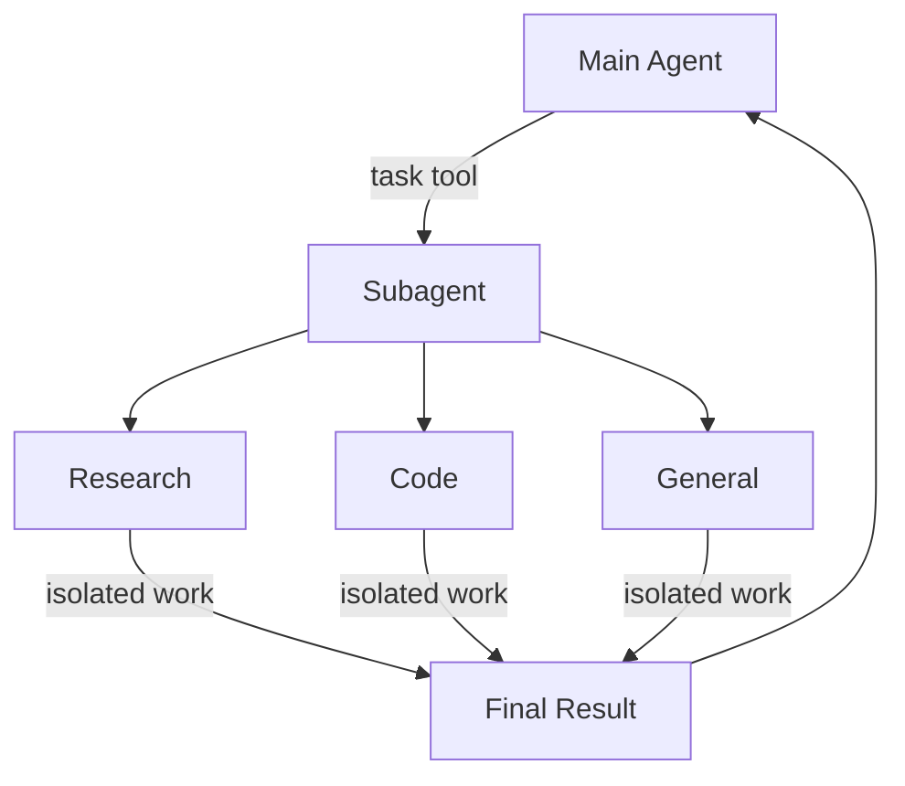

Deep agents 可以创建子 agent 来委托工作。你可以在 `subagents` 参数中指定自定义子 agent。子 agent 对于[上下文隔离](https://www.dbreunig.com/2025/06/26/how-to-fix-your-context.html#context-quarantine)（保持主 agent 的上下文清洁）和提供专门指令很有用。



## 为什么使用子 agent？

子 agent 解决了**上下文膨胀问题**。当 agent 使用具有大型输出的工具（网络搜索、文件读取、数据库查询）时，上下文窗口会迅速被中间结果填满。子 agent 隔离这些详细工作——主 agent 只接收最终结果，而不是产生它的数十个工具调用。

**何时使用子 agent：**
- ✅ 会使主 agent 上下文混乱的多步骤任务
- ✅ 需要自定义指令或工具的专业领域
- ✅ 需要不同模型能力的任务
- ✅ 当你想让主 agent 专注于高级协调时

**何时不使用子 agent：**
- ❌ 简单的单步骤任务
- ❌ 当你需要维护中间上下文时
- ❌ 当开销超过收益时

## 配置

`subagents` 应该是字典或 `CompiledSubAgent` 对象的列表。有两种类型：

### SubAgent（基于字典）

对于大多数用例，将子 agent 定义为字典：

**必需字段：**

<ParamField body="name" type="str" required>
    子 agent 的唯一标识符。
    主 agent 在调用 `task()` 工具时使用此名称。
    子 agent 名称成为 `AIMessage` 和流式传输的元数据，有助于区分不同的 agent。
</ParamField>

<ParamField body="description" type="str" required>
    此子 agent 的功能。要具体且面向操作。主 agent 使用此来决定何时委托。
</ParamField>

<ParamField body="system_prompt" type="str" required>
    子 agent 的指令。包括工具使用指南和输出格式要求。
</ParamField>

<ParamField body="tools" type="list[Callable]" required>
    子 agent 可以使用的工具。保持最小化，只包含必要的工具。
</ParamField>

**可选字段：**

<ParamField body="model" type="str | BaseChatModel">
    覆盖主 agent 的模型。使用格式 `'provider:model-name'`（例如 `'openai:gpt-4o'`）。
</ParamField>

<ParamField body="middleware" type="list[Middleware]">
    用于自定义行为、日志记录或速率限制的额外中间件。
</ParamField>

<ParamField body="interrupt_on" type="dict[str, bool]">
    为特定工具配置人机协作。需要 checkpointer。
</ParamField>

### CompiledSubAgent

对于复杂的工作流，使用预构建的 LangGraph 图：

<ParamField body="name" type="str" required>
    子 agent 的唯一标识符。
    子 agent 名称成为 `AIMessage` 和流式传输的元数据，有助于区分不同的 agent。
</ParamField>

<ParamField body="description" type="str" required>
    此子 agent 的功能。
</ParamField>

<ParamField body="runnable" type="Runnable" required>
    已编译的 LangGraph 图（必须先调用 `.compile()`）。
</ParamField>

## 使用 SubAgent

```python
import os
from typing import Literal
from tavily import TavilyClient
from deepagents import create_deep_agent

tavily_client = TavilyClient(api_key=os.environ["TAVILY_API_KEY"])

def internet_search(
    query: str,
    max_results: int = 5,
    topic: Literal["general", "news", "finance"] = "general",
    include_raw_content: bool = False,
):
    """Run a web search"""
    return tavily_client.search(
        query,
        max_results=max_results,
        include_raw_content=include_raw_content,
        topic=topic,
    )

research_subagent = {
    "name": "research-agent",
    "description": "Used to research more in depth questions",
    "system_prompt": "You are a great researcher",
    "tools": [internet_search],
    "model": "openai:gpt-4o",  # Optional override, defaults to main agent model
}
subagents = [research_subagent]

agent = create_deep_agent(
    model="claude-sonnet-4-5-20250929",
    subagents=subagents
)
```


## 使用 CompiledSubAgent

对于更复杂的用例，你可以提供自定义子 agent。
你可以使用 LangChain 的 `create_agent` 或使用[图 API](https://github.com/langchain-ai/docs/pull/)创建自定义 LangGraph 图来创建自定义子 agent。

如果你正在创建自定义 LangGraph 图，请确保图具有[名为 `"messages"` 的状态键](/oss/python/langgraph/quickstart#2-define-state)：

```python
from deepagents import create_deep_agent, CompiledSubAgent
from langchain.agents import create_agent

# Create a custom agent graph
custom_graph = create_agent(
    model=your_model,
    tools=specialized_tools,
    prompt="You are a specialized agent for data analysis..."
)

# Use it as a custom subagent
custom_subagent = CompiledSubAgent(
    name="data-analyzer",
    description="Specialized agent for complex data analysis tasks",
    runnable=custom_graph
)

subagents = [custom_subagent]

agent = create_deep_agent(
    model="claude-sonnet-4-5-20250929",
    tools=[internet_search],
    system_prompt=research_instructions,
    subagents=subagents
)
```


## 流式传输

在流式传输追踪信息时，agent 的名称可以在元数据中作为 `lc_agent_name` 获取。
在审查追踪信息时，你可以使用此元数据来区分数据来自哪个 agent。

以下示例创建了一个名为 `main-agent` 的 deep agent 和一个名为 `research-agent` 的子 agent：

```python
import os
from typing import Literal
from tavily import TavilyClient
from deepagents import create_deep_agent

tavily_client = TavilyClient(api_key=os.environ["TAVILY_API_KEY"])

def internet_search(
    query: str,
    max_results: int = 5,
    topic: Literal["general", "news", "finance"] = "general",
    include_raw_content: bool = False,
):
    """Run a web search"""
    return tavily_client.search(
        query,
        max_results=max_results,
        include_raw_content=include_raw_content,
        topic=topic,
    )

research_subagent = {
    "name": "research-agent",
    "description": "Used to research more in depth questions",
    "system_prompt": "You are a great researcher",
    "tools": [internet_search],
    "model": "claude-sonnet-4-5-20250929",  # Optional override, defaults to main agent model
}
subagents = [research_subagent]

agent = create_deep_agent(
    model="claude-sonnet-4-5-20250929",
    subagents=subagents,
    name="main-agent"
)
```

当你提示 deepagents 时，由子 agent 或 deep agent 执行的所有 agent 运行都将在其元数据中包含 agent 名称。
在这种情况下，名为 `"research-agent"` 的子 agent 将在任何关联的 agent 运行元数据中包含 `{'lc_agent_name': 'research-agent'}`：


## 通用子 agent

除了任何用户定义的子 agent 外，deep agents 始终可以访问一个 `general-purpose` 子 agent。这个子 agent：
- 具有与主 agent 相同的系统提示
- 可以访问所有相同的工具
- 使用相同的模型（除非被覆盖）

### 何时使用

通用子 agent 非常适合没有专门行为的上下文隔离。主 agent 可以将复杂的多步骤任务委托给这个子 agent，并获得简洁的结果，而不会因中间工具调用而膨胀。

<Card title="示例">
    主 agent 不是进行 10 次网络搜索并用结果填充其上下文，而是委托给通用子 agent：`task(name="general-purpose", task="Research quantum computing trends")`。子 agent 在内部执行所有搜索，仅返回摘要。
</Card>

## 最佳实践

### 编写清晰的描述

主 agent 使用描述来决定调用哪个子 agent。要具体：

✅ **好：** `"分析财务数据并生成带有置信度分数的投资见解"`

❌ **差：** `"处理财务事务"`

### 保持系统提示详细

包括关于如何使用工具和格式化输出的具体指导：

```python
research_subagent = {
    "name": "research-agent",
    "description": "Conducts in-depth research using web search and synthesizes findings",
    "system_prompt": """You are a thorough researcher. Your job is to:

    1. Break down the research question into searchable queries
    2. Use internet_search to find relevant information
    3. Synthesize findings into a comprehensive but concise summary
    4. Cite sources when making claims

    Output format:
    - Summary (2-3 paragraphs)
    - Key findings (bullet points)
    - Sources (with URLs)

    Keep your response under 500 words to maintain clean context.""",
    "tools": [internet_search],
}
```


### 最小化工具集

只给子 agent 提供它们需要的工具。这可以提高专注度和安全性：

```python
# ✅ Good: Focused tool set
email_agent = {
    "name": "email-sender",
    "tools": [send_email, validate_email],  # Only email-related
}

# ❌ Bad: Too many tools
email_agent = {
    "name": "email-sender",
    "tools": [send_email, web_search, database_query, file_upload],  # Unfocused
}
```


### 按任务选择模型

不同的模型在不同的任务上表现出色：

```python
subagents = [
    {
        "name": "contract-reviewer",
        "description": "Reviews legal documents and contracts",
        "system_prompt": "You are an expert legal reviewer...",
        "tools": [read_document, analyze_contract],
        "model": "claude-sonnet-4-5-20250929",  # Large context for long documents
    },
    {
        "name": "financial-analyst",
        "description": "Analyzes financial data and market trends",
        "system_prompt": "You are an expert financial analyst...",
        "tools": [get_stock_price, analyze_fundamentals],
        "model": "openai:gpt-5",  # Better for numerical analysis
    },
]
```


### 返回简洁的结果

指示子 agent 返回摘要，而不是原始数据：

```python
data_analyst = {
    "system_prompt": """Analyze the data and return:
    1. Key insights (3-5 bullet points)
    2. Overall confidence score
    3. Recommended next actions

    Do NOT include:
    - Raw data
    - Intermediate calculations
    - Detailed tool outputs

    Keep response under 300 words."""
}
```


## 常见模式

### 多个专门的子 agent

为不同领域创建专门的子 agent：

```python
from deepagents import create_deep_agent

subagents = [
    {
        "name": "data-collector",
        "description": "Gathers raw data from various sources",
        "system_prompt": "Collect comprehensive data on the topic",
        "tools": [web_search, api_call, database_query],
    },
    {
        "name": "data-analyzer",
        "description": "Analyzes collected data for insights",
        "system_prompt": "Analyze data and extract key insights",
        "tools": [statistical_analysis],
    },
    {
        "name": "report-writer",
        "description": "Writes polished reports from analysis",
        "system_prompt": "Create professional reports from insights",
        "tools": [format_document],
    },
]

agent = create_deep_agent(
    model="claude-sonnet-4-5-20250929",
    system_prompt="You coordinate data analysis and reporting. Use subagents for specialized tasks.",
    subagents=subagents
)
```


**工作流：**
1. 主 agent 创建高级计划
2. 将数据收集委托给 data-collector
3. 将结果传递给 data-analyzer
4. 将见解发送给 report-writer
5. 编译最终输出

每个子 agent 都使用仅专注于其任务的清洁上下文工作。

## 故障排除

### 子 agent 未被调用

**问题**：主 agent 尝试自己完成工作而不是委托。

**解决方案**：

1. **使描述更具体：**

   ```python
   # ✅ Good
   {"name": "research-specialist", "description": "Conducts in-depth research on specific topics using web search. Use when you need detailed information that requires multiple searches."}

   # ❌ Bad
   {"name": "helper", "description": "helps with stuff"}
   ```


2. **指示主 agent 委托：**

   ```python
   agent = create_deep_agent(
       system_prompt="""...your instructions...

       IMPORTANT: For complex tasks, delegate to your subagents using the task() tool.
       This keeps your context clean and improves results.""",
       subagents=[...]
   )
   ```


### 上下文仍然膨胀

**问题**：尽管使用子 agent，上下文仍然填满。

**解决方案**：

1. **指示子 agent 返回简洁的结果：**

   ```python
   system_prompt="""...

   IMPORTANT: Return only the essential summary.
   Do NOT include raw data, intermediate search results, or detailed tool outputs.
   Your response should be under 500 words."""
   ```


2. **对大型数据使用文件系统：**

   ```python
   system_prompt="""When you gather large amounts of data:
   1. Save raw data to /data/raw_results.txt
   2. Process and analyze the data
   3. Return only the analysis summary

   This keeps context clean."""
   ```


### 选择了错误的子 agent

**问题**：主 agent 为任务调用了不适当的子 agent。

**解决方案**：在描述中清楚地区分子 agent：

```python
subagents = [
    {
        "name": "quick-researcher",
        "description": "For simple, quick research questions that need 1-2 searches. Use when you need basic facts or definitions.",
    },
    {
        "name": "deep-researcher",
        "description": "For complex, in-depth research requiring multiple searches, synthesis, and analysis. Use for comprehensive reports.",
    }
]
```

---

<Callout icon="pen-to-square" iconType="regular">
    [Edit this page on GitHub](https://github.com/langchain-ai/docs/edit/main/src/oss/deepagents/subagents.mdx) or [file an issue](https://github.com/langchain-ai/docs/issues/new/choose).
</Callout>
<Tip icon="terminal" iconType="regular">
    [Connect these docs](/use-these-docs) to Claude, VSCode, and more via MCP for real-time answers.
</Tip>
<div class='fixed right-2 bg-white bottom-2'></div>