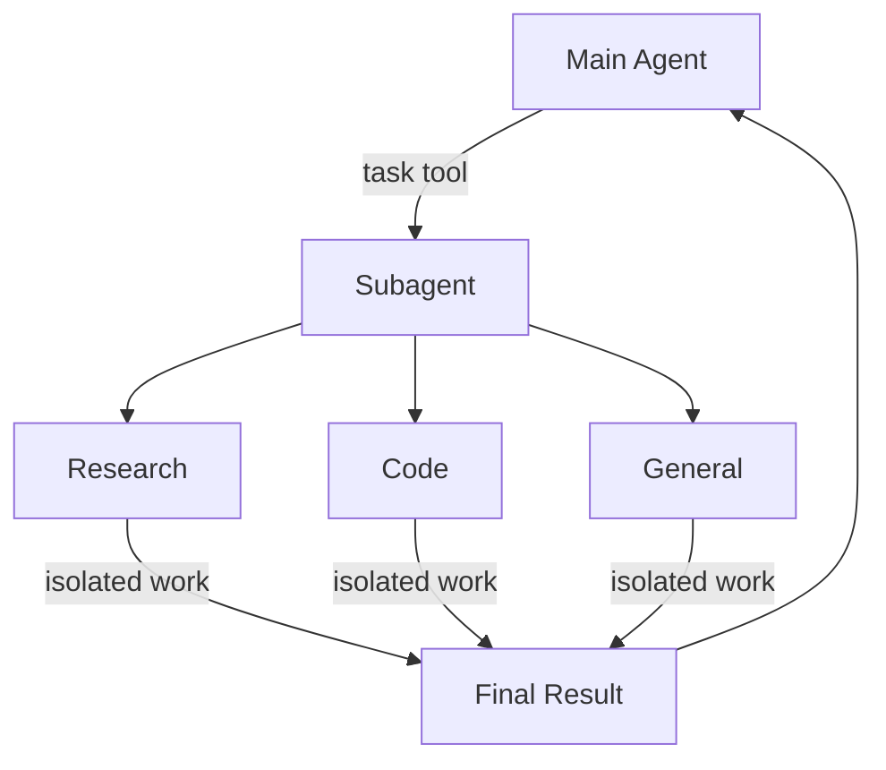

import SubagentBasicPy from '/snippets/subagent-basic-py.mdx';
import SubagentBasicJs from '/snippets/subagent-basic-js.mdx';

Deep Agents 可以创建子代理来委派工作。你可以在 `subagents` 参数中指定自定义子代理。子代理对于 [context quarantine](https://www.dbreunig.com/2025/06/26/how-to-fix-your-context.html#context-quarantine)（保持主代理的上下文整洁）和提供专业指令非常有用。

本页介绍 **同步** 子代理，其中监督者会阻塞直到子代理完成。对于长时间运行的任务、并行工作流，或者需要中途 steering 和 cancellation 的情况，请参阅 [异步子代理](/oss/python/deepagents/async-subagents)。



## 为什么使用子代理？

子代理解决了 **上下文膨胀问题**。当代理使用具有大量输出的工具（web 搜索、文件读取、数据库查询）时，上下文窗口会迅速被中间结果填满。子代理隔离了这些详细工作——主代理只接收最终结果，而不是产生结果的数十次工具调用。

**何时使用子代理：**
- ✅ 会使主代理上下文混乱的多步任务
- ✅ 需要自定义指令或工具的专业领域
- ✅ 需要不同模型能力的任务
- ✅ 当你希望主代理专注于高层协调时

**何时不使用子代理：**
- ❌ 简单的单步任务
- ❌ 当你需要维护中间上下文时
- ❌ 当开销超过收益时

## 配置

`subagents` 应该是字典列表或 [`CompiledSubAgent`](https://reference.langchain.com/python/deepagents/middleware/subagents/CompiledSubAgent) 对象。有两种类型：

### SubAgent（基于字典）

对于大多数用例，将子代理定义为符合 [`SubAgent`](https://reference.langchain.com/python/deepagents/middleware/subagents/SubAgent) 规范的字典，包含以下字段：

| 字段 | 类型 | 描述 |
|-------|------|-------------|
| `name` | `str` | 必填。子代理的唯一标识符。主代理在调用 `task()` 工具时使用此名称。子代理名称成为 `AIMessage` 和流式传输的元数据，有助于区分不同的代理。 |
| `description` | `str` | 必填。此子代理做什么的描述。要具体且面向行动。主代理使用此信息来决定何时委派。 |
| `system_prompt` | `str` | 必填。子代理的指令。自定义子代理必须定义自己的指令。包括工具使用指导和输出格式要求。<br></br>不从主代理继承。 |
| `tools` | `list[Callable]` | 可选。子代理可以使用的工具。保持最小化，仅包含所需内容。<br></br>默认从主代理继承。指定时，完全覆盖继承的工具。 |
| `model` | `str` \| `BaseChatModel` | 可选。覆盖主代理的模型。省略则使用主代理的模型。<br></br>默认从主代理继承。你可以传递模型标识符字符串，如 `'openai:gpt-5.4'`（使用 `'provider:model'` 格式）或 LangChain 聊天模型对象（`init_chat_model("gpt-5.4")` 或 `ChatOpenAI(model="gpt-5.4")`）。 |
| `middleware` | `list[Middleware]` | 可选。用于自定义行为、日志记录或速率限制的附加中间件。<br></br>不从主代理继承。 |
| `interrupt_on` | `dict[str, bool]` | 可选。为特定工具配置 [human-in-the-loop](/oss/python/deepagents/human-in-the-loop)。子代理值覆盖主代理。需要 checkpointer。<br></br>默认从主代理继承。子代理值覆盖默认值。 |
| `skills` | `list[str]` | 可选。[Skills](/oss/python/deepagents/skills) 源路径。指定时，子代理将从这些目录加载 skills（例如 `["/skills/research/", "/skills/web-search/"]`）。这允许子代理拥有与主代理不同的 skill 集。<br></br>不从主代理继承。只有通用子代理继承主代理的 skills。当子代理拥有 skills 时，它会运行自己独立的 [`SkillsMiddleware`](https://reference.langchain.com/python/deepagents/middleware/skills/SkillsMiddleware) 实例。Skill 状态完全隔离——子代理加载的 skills 对父代理不可见，反之亦然。 |
| `response_format` | `ResponseFormat` | 可选。子代理的 [结构化输出](/oss/python/langchain/structured-output) schema。设置后，父代理接收子代理的结果为 JSON 而非自由格式文本。接受 Pydantic 模型、`ToolStrategy(...)`、`ProviderStrategy(...)` 或原始 schema 类型。请参阅 [结构化输出](#structured-output)。 |
| `permissions` | `list[FilesystemPermission]` | 可选。子代理的 [文件系统权限规则](/oss/python/deepagents/permissions)。设置时，**替换** 父代理的权限。<br></br>默认从主代理继承。 |


<Tip>
    **CLI 用户：** 你也可以将子代理定义为磁盘上的 `AGENTS.md` 文件，而不是在代码中定义。`name`、`description` 和 `model` 字段映射到 YAML frontmatter，markdown 正文成为 `system_prompt`。有关文件格式，请参阅 [自定义子代理](/oss/python/deepagents/cli/overview#subagents)。

    **Deploy 用户：** 将子代理定义为 `subagents/` 下的目录，包含它们自己的 `deepagents.toml` 和 `AGENTS.md`。打包器会自动发现它们。有关完整配置参考，请参阅 [部署子代理](/oss/python/deepagents/deploy#subagents)。
</Tip>

### CompiledSubAgent

对于复杂的工作流，使用预建的 LangGraph 图作为 [`CompiledSubAgent`](https://reference.langchain.com/python/deepagents/middleware/subagents/CompiledSubAgent)：

| 字段 | 类型 | 描述 |
|-------|------|-------------|
| `name` | `str` | 必填。子代理的唯一标识符。子代理名称成为 `AIMessage` 和流式传输的元数据，有助于区分不同的代理。 |
| `description` | `str` | 必填。此子代理做什么。 |
| `runnable` | `Runnable` | 必填。编译后的 LangGraph 图（必须先调用 `.compile()`）。 |

## 使用 SubAgent

<SubagentBasicPy />


## 使用 CompiledSubAgent

对于更复杂的用例，你可以使用 [`CompiledSubAgent`](https://reference.langchain.com/python/deepagents/middleware/subagents/CompiledSubAgent) 提供自定义子代理。
你可以使用 LangChain 的 [`create_agent`](https://reference.langchain.com/python/langchain/agents/factory/create_agent) 创建自定义子代理，或者使用 [graph API](/oss/python/langgraph/graph-api) 创建自定义 LangGraph 图。

如果你正在创建自定义 LangGraph 图，请确保该图有一个 [名为 `"messages"` 的状态键](/oss/python/langgraph/quickstart#2-define-state)：

```python
from deepagents import create_deep_agent, CompiledSubAgent
from langchain.agents import create_agent

# 创建自定义代理图
custom_graph = create_agent(
    model=your_model,
    tools=specialized_tools,
    prompt="You are a specialized agent for data analysis..."
)

# 将其用作自定义子代理
custom_subagent = CompiledSubAgent(
    name="data-analyzer",
    description="Specialized agent for complex data analysis tasks",
    runnable=custom_graph
)

subagents = [custom_subagent]

agent = create_deep_agent(
    model="google_genai:gemini-3.1-pro-preview",
    tools=[internet_search],
    system_prompt=research_instructions,
    subagents=subagents
)
```


## 流式传输

当流式传输追踪信息时，代理的名称可作为 `lc_agent_name` 在元数据中使用。
查看追踪信息时，你可以使用此元数据来区分数据来自哪个代理。

以下示例创建了一个名为 `main-agent` 的 deep agent 和一个名为 `research-agent` 的子代理：

```python
import os
from typing import Literal
from tavily import TavilyClient
from deepagents import create_deep_agent

tavily_client = TavilyClient(api_key=os.environ["TAVILY_API_KEY"])

def internet_search(
    query: str,
    max_results: int = 5,
    topic: Literal["general", "news", "finance"] = "general",
    include_raw_content: bool = False,
):
    """运行 web 搜索"""
    return tavily_client.search(
        query,
        max_results=max_results,
        include_raw_content=include_raw_content,
        topic=topic,
    )

research_subagent = {
    "name": "research-agent",
    "description": "Used to research more in depth questions",
    "system_prompt": "You are a great researcher",
    "tools": [internet_search],
    "model": "google_genai:gemini-3.1-pro-preview",  # 可选覆盖，默认为主代理模型
}
subagents = [research_subagent]

agent = create_deep_agent(
    model="google_genai:gemini-3.1-pro-preview",
    subagents=subagents,
    name="main-agent"
)
```

当你 prompt 你的 deepagents 时，由子代理或 deep agent 执行的所有代理运行将在其元数据中包含代理名称。
在这种情况下，名为 `"research-agent"` 的子代理将在任何关联的代理运行元数据中具有 `{'lc_agent_name': 'research-agent'}`：


## 结构化输出

子代理支持 [结构化输出](/oss/python/langchain/structured-output)，因此父代理接收可预测、可解析的 JSON 而不是自由格式文本。

在子代理配置上传递 `response_format`。当子代理完成时，其结构化响应被 JSON 序列化并作为 `ToolMessage` 内容返回给父代理。schema 接受 [`create_agent`](https://reference.langchain.com/python/langchain/agents/factory/create_agent) 支持的任何内容：Pydantic 模型、`ToolStrategy(...)`、`ProviderStrategy(...)` 或原始 schema 类型。

```python
from pydantic import BaseModel, Field

from deepagents import create_deep_agent


class ResearchFindings(BaseModel):
    """来自研究任务的结构化发现。"""
    summary: str = Field(description="发现摘要")
    confidence: float = Field(description="置信度分数，从 0 到 1")
    sources: list[str] = Field(description="源 URL 列表")

research_subagent = {
    "name": "researcher",
    "description": "研究主题并返回结构化发现",
    "system_prompt": "彻底研究给定主题。返回你的发现。",
    "tools": [web_search],
    "response_format": ResearchFindings,
}

agent = create_deep_agent(
    model="claude-sonnet-4-6",
    subagents=[research_subagent],
)

result = await agent.ainvoke(
    {"messages": [{"role": "user", "content": "Research recent advances in quantum computing"}]}
)

# 父代理的 ToolMessage 包含 JSON 序列化的结构化数据：
# '{"summary": "...", "confidence": 0.87, "sources": ["https://..."]}'
```


如果没有 `response_format`，父代理原样接收子代理的最后一条消息文本。有了它，父代理总是获得匹配 schema 的有效 JSON，当父代理需要以编程方式处理结果或将其传递给下游工具时非常有用。

有关 schema 类型和策略（工具调用与 provider 原生）的完整详细信息，请参阅 [结构化输出](/oss/python/langchain/structured-output)。

## 通用子代理

除了任何用户定义的子代理外，Deep Agents 始终可以访问 `general-purpose` 子代理。此子代理：

- 具有与主代理相同的 system prompt
- 可以访问所有相同的工具
- 使用相同的模型（除非被覆盖）
- 从主代理继承 skills（当配置了 skills 时）

### 覆盖通用子代理

在 `subagents` 列表中包含一个 `name="general-purpose"` 的子代理以替换默认值。使用此方法为通用子代理配置不同的模型、工具或 system prompt：

```python
from deepagents import create_deep_agent

# 主代理使用 Gemini；通用子代理使用 GPT
agent = create_deep_agent(
    model="google_genai:gemini-3.1-pro-preview",
    tools=[internet_search],
    subagents=[
        {
            "name": "general-purpose",
            "description": "用于研究和多步任务的通用代理",
            "system_prompt": "你是一个通用助手。",
            "tools": [internet_search],
            "model": "openai:gpt-5.4",  # 委派任务使用不同的模型
        },
    ],
)
```


当你提供具有通用名称的子代理时，不会添加默认通用子代理。你的规范完全替换它。

### 何时使用它

通用子代理非常适合上下文隔离而无需专业行为。主代理可以将复杂的多步任务委派给此子代理，并获得简洁的结果，而不会因中间工具调用而产生膨胀。

<Card title="示例">
    主代理不是进行 10 次 web 搜索并用结果填充其上下文，而是委派给通用子代理：`task(name="general-purpose", task="Research quantum computing trends")`。子代理在内部执行所有搜索并仅返回摘要。
</Card>

### Skills 继承

当使用 `create_deep_agent` 配置 [skills](/oss/python/deepagents/skills) 时：

- **通用子代理**：自动从主代理继承 skills
- **自定义子代理**：默认不继承 skills——使用 `skills` 参数赋予它们自己的 skills

<Note>
    只有配置了 skills 的子代理才会获得 `SkillsMiddleware` 实例——没有 `skills` 参数的自定义子代理不会。当存在时，skill 状态在两个方向上完全隔离：父代理的 skills 对子代理不可见，子代理的 skills 也不会传播回父代理。
</Note>

```python
from deepagents import create_deep_agent

# 具有自己 skills 的研究子代理
research_subagent = {
    "name": "researcher",
    "description": "具有专业 skills 的研究助手",
    "system_prompt": "你是一个研究员。",
    "tools": [web_search],
    "skills": ["/skills/research/", "/skills/web-search/"],  # 子代理特定的 skills
}

agent = create_deep_agent(
    model="google_genai:gemini-3.1-pro-preview",
    skills=["/skills/main/"],  # 主代理和 GP 子代理获得这些
    subagents=[research_subagent],  # 仅获得 /skills/research/ 和 /skills/web-search/
)
```


## 最佳实践

### 编写清晰的描述

主代理使用描述来决定调用哪个子代理。要具体：

✅ **好：** `"分析财务数据并生成带有置信度分数的投资见解"`

❌ **坏：** `"做财务 stuff"`

### 保持 system prompt 详细

包括关于如何使用工具和格式化输出的具体指导：

```python
research_subagent = {
    "name": "research-agent",
    "description": "使用 web 搜索进行深入研究并综合发现",
    "system_prompt": """你是一个 thorough researcher。你的工作是：

    1. 将研究问题分解为可搜索的查询
    2. 使用 internet_search 查找相关信息
    3. 将发现综合为全面但简洁的摘要
    4. 提出主张时引用来源

    输出格式：
    - 摘要（2-3 段）
    - 关键发现（要点）
    - 来源（带 URL）

    将你的响应保持在 500 字以内以保持上下文整洁。""",
    "tools": [internet_search],
}
```


### 最小化工具集

仅给予子代理所需的工具。这提高了专注度和安全性：

```python
# ✅ 好：专注的工具集
email_agent = {
    "name": "email-sender",
    "tools": [send_email, validate_email],  # 仅与 email 相关
}

# ❌ 坏：工具太多
email_agent = {
    "name": "email-sender",
    "tools": [send_email, web_search, database_query, file_upload],  # 不专注
}
```


### 根据任务选择模型

不同的模型擅长不同的任务：

```python
subagents = [
    {
        "name": "contract-reviewer",
        "description": "审查法律文档和合同",
        "system_prompt": "你是专家法律审查员...",
        "tools": [read_document, analyze_contract],
        "model": "google_genai:gemini-3.1-pro-preview",  # 长文档需要大上下文
    },
    {
        "name": "financial-analyst",
        "description": "分析财务数据和市场趋势",
        "system_prompt": "你是专家财务分析师...",
        "tools": [get_stock_price, analyze_fundamentals],
        "model": "openai:gpt-5.4",  # 更适合数值分析
    },
]
```


### 返回简洁的结果

指示子代理返回摘要，而不是原始数据：

```python
data_analyst = {
    "system_prompt": """分析数据并返回：
    1. 关键见解（3-5 个要点）
    2. 整体置信度分数
    3. 推荐的下一步操作

    不要包括：
    - 原始数据
    - 中间计算
    - 详细的工具输出

    将响应保持在 300 字以内。"""
}
```


## 常见模式

### 多个专业子代理

为不同领域创建专业子代理：

```python
from deepagents import create_deep_agent

subagents = [
    {
        "name": "data-collector",
        "description": "从各种来源收集原始数据",
        "system_prompt": "收集关于该主题的全面数据",
        "tools": [web_search, api_call, database_query],
    },
    {
        "name": "data-analyzer",
        "description": "分析收集的数据以获取见解",
        "system_prompt": "分析数据并提取关键见解",
        "tools": [statistical_analysis],
    },
    {
        "name": "report-writer",
        "description": "根据分析撰写 polished 报告",
        "system_prompt": "根据见解创建专业报告",
        "tools": [format_document],
    },
]

agent = create_deep_agent(
    model="google_genai:gemini-3.1-pro-preview",
    system_prompt="你协调数据分析和报告。使用子代理处理专业任务。",
    subagents=subagents
)
```


**工作流：**
1. 主代理创建高层计划
2. 将数据收集委派给 data-collector
3. 将结果传递给 data-analyzer
4. 将见解发送给 report-writer
5. 编译最终输出

每个子代理都在仅专注于其任务的整洁上下文中工作。

## 上下文管理

当你使用 [运行时上下文](/oss/python/langchain/runtime) 调用父代理时，该上下文会自动传播到所有子代理。每个子代理运行都会接收你在父 `invoke` / `ainvoke` 调用上传递的相同运行时上下文。

这意味着在任何子代理内运行的工具都可以访问你提供给父代理的相同上下文值：

```python
from dataclasses import dataclass

from deepagents import create_deep_agent
from langchain.messages import HumanMessage
from langchain.tools import tool, ToolRuntime

@dataclass
class Context:
    user_id: str
    session_id: str

@tool
def get_user_data(query: str, runtime: ToolRuntime[Context]) -> str:
    """获取当前用户的数据。"""
    user_id = runtime.context.user_id
    return f"Data for user {user_id}: {query}"

research_subagent = {
    "name": "researcher",
    "description": "为当前用户进行研究",
    "system_prompt": "你是一个研究助手。",
    "tools": [get_user_data],
}

agent = create_deep_agent(
    model="google_genai:gemini-3.1-pro-preview",
    subagents=[research_subagent],
    context_schema=Context,
)

# 上下文自动流向 researcher 子代理及其工具
result = await agent.invoke(
    {"messages": [HumanMessage("Look up my recent activity")]},
    context=Context(user_id="user-123", session_id="abc"),
)
```


### 每个子代理的上下文

所有子代理接收相同的父上下文。要传递特定于特定子代理的配置，请在扁平 `context` 映射中使用 **命名空间键**（以前缀键与子代理名称，例如 `researcher:max_depth`），**或** 将这些设置建模为上下文类型上的单独字段：

```python
from dataclasses import dataclass

from langchain.messages import HumanMessage
from langchain.tools import tool, ToolRuntime

@dataclass
class Context:
    user_id: str
    researcher_max_depth: int | None = None
    fact_checker_strict_mode: bool | None = None

result = await agent.invoke(
    {"messages": [HumanMessage("Research this and verify the claims")]},
    context=Context(
        user_id="user-123",
        researcher_max_depth=3,
        fact_checker_strict_mode=True,
    ),
)

@tool
def verify_claim(claim: str, runtime: ToolRuntime[Context]) -> str:
    """验证事实主张。"""
    strict_mode = runtime.context.fact_checker_strict_mode or False
    if strict_mode:
        return strict_verification(claim)
    return basic_verification(claim)
```


### 识别哪个子代理调用了工具

当同一个工具在父代理和多个子代理之间共享时，你可以使用 `lc_agent_name` 元数据（与 [流式传输](#streaming) 中使用的值相同）来确定哪个代理发起了调用：

```python
from langchain.tools import tool, ToolRuntime

@tool
def shared_lookup(query: str, runtime: ToolRuntime) -> str:
    """查找信息。"""
    agent_name = runtime.config.get("metadata", {}).get("lc_agent_name")
    if agent_name == "fact-checker":
        return strict_lookup(query)
    return general_lookup(query)
```


你可以结合这两种模式——从 `runtime.context` 读取特定于代理的设置，并在分支工具行为时从 `runtime.config` 元数据读取 `lc_agent_name`。

```python
from langchain.tools import tool, ToolRuntime

@tool
def flexible_search(query: str, runtime: ToolRuntime[Context]) -> str:
    """使用特定于代理的设置进行搜索。"""
    agent_name = runtime.config.get("metadata", {}).get("lc_agent_name", "unknown")
    ctx = runtime.context
    if agent_name == "researcher":
        max_results = ctx.researcher_max_depth or 5
    else:
        max_results = 5
    include_raw = False

    return perform_search(query, max_results=max_results, include_raw=include_raw)
```


## 故障排除

### 子代理未被调用

**问题**：主代理尝试自己完成工作而不是委派。

**解决方案**：

1. **使描述更具体：**

   ```python
   # ✅ 好
   {"name": "research-specialist", "description": "使用 web 搜索对特定主题进行深入研究。当你需要需要多次搜索的详细信息时使用。"}

   # ❌ 坏
   {"name": "helper", "description": "helps with stuff"}
   ```


2. **指示主代理进行委派：**

   ```python
   agent = create_deep_agent(
       model="google_genai:gemini-3.1-pro-preview",
       system_prompt="""...你的指令...

       重要：对于复杂任务，使用 task() 工具委派给你的子代理。
       这保持你的上下文整洁并改善结果。""",
       subagents=[...]
   )
   ```


### 上下文仍然膨胀

**问题**：尽管使用了子代理，上下文仍然填满。

**解决方案**：

1. **指示子代理返回简洁的结果：**

   ```python
   system_prompt="""...

   重要：仅返回基本摘要。
   不要包括原始数据、中间搜索结果或详细的工具输出。
   你的响应应在 500 字以内。"""
   ```


2. **对大数据使用文件系统：**

   ```python
   system_prompt="""当你收集大量数据时：
   1. 将原始数据保存到 /data/raw_results.txt
   2. 处理和分析数据
   3. 仅返回分析摘要

   这保持上下文整洁。"""
   ```


### 选择了错误的子代理

**问题**：主代理为该任务调用了不适当的子代理。

**解决方案**：在描述中清楚地区分子代理：

```python
subagents = [
    {
        "name": "quick-researcher",
        "description": "用于需要 1-2 次搜索的简单、快速研究问题。当你需要基本事实或定义时使用。",
    },
    {
        "name": "deep-researcher",
        "description": "用于需要多次搜索、综合和分析的复杂、深入研究。用于综合报告。",
    }
]
```


:::

---

<div className="source-links">
<Callout icon="edit">
    [在 GitHub 上编辑此页面](https://github.com/langchain-ai/docs/edit/main/src/oss/deepagents/subagents.mdx) 或 [提交问题](https://github.com/langchain-ai/docs/issues/new/choose)。
</Callout>
<Callout icon="terminal-2">
    [连接这些文档](/use-these-docs) 到 Claude、VSCode 等 via MCP 以获取实时答案。
</Callout>
</div>