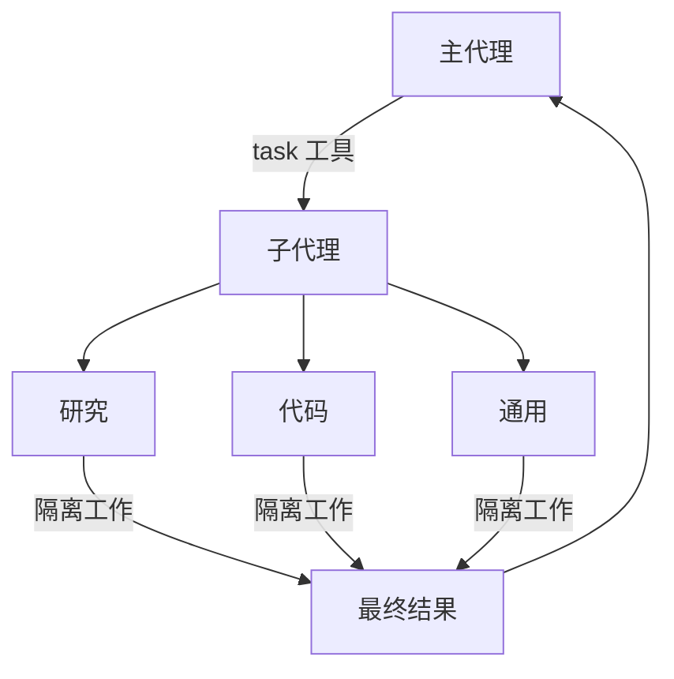

import SubagentBasicPy from '/snippets/subagent-basic-py.mdx';
import SubagentBasicJs from '/snippets/subagent-basic-js.mdx';

深度代理可以创建子代理来委派工作。你可以在 `subagents` 参数中指定自定义子代理。子代理对于[上下文隔离](https://www.dbreunig.com/2025/06/26/how-to-fix-your-context.html#context-quarantine)（保持主代理的上下文整洁）和提供专门指令非常有用。

本页介绍**同步**子代理，即主管家会阻塞直到子代理完成。对于长时间运行的任务、并行工作流，或需要中途调整和取消的情况，请参阅[异步子代理](/oss/python/deepagents/async-subagents)。


```mermaid
graph TB
    Main[主代理] --> |task 工具| Sub[子代理]

    Sub --> Research[研究]
    Sub --> Code[代码]
    Sub --> General[通用]

    Research --> |隔离工作| Result[最终结果]
    Code --> |隔离工作| Result
    General --> |隔离工作| Result

    Result --> Main
```

## 为什么使用子代理？

子代理解决了**上下文膨胀问题**。当代理使用具有大量输出的工具（网络搜索、文件读取、数据库查询）时，上下文窗口会很快被中间结果填满。子代理隔离了这些详细工作——主代理只接收最终结果，而不是产生它的数十个工具调用。

**何时使用子代理：**
- ✅ 会弄乱主代理上下文的多步骤任务
- ✅ 需要自定义指令或工具的专业领域
- ✅ 需要不同模型能力的任务
- ✅ 当你希望主代理专注于高层协调时

**何时不使用子代理：**
- ❌ 简单的单步任务
- ❌ 当你需要维护中间上下文时
- ❌ 当开销大于收益时

## 配置

`subagents` 应该是一个字典列表或 [`CompiledSubAgent`](https://reference.langchain.com/python/deepagents/middleware/subagents/CompiledSubAgent) 对象。有两种类型：

### 默认子代理

深度代理会自动添加一个同步的 `general-purpose` 子代理，除非你已经提供了一个同名的同步子代理。

- 要替换它，请传递你自己的名为 `general-purpose` 的子代理。
- 要重命名或重新提示自动添加的版本，请在活动的[配置文件](/oss/python/deepagents/profiles#harness-profiles)上设置 `general_purpose_subagent=GeneralPurposeSubagentProfile(...)`。
- 要禁用它，请参阅下面的[不使用子代理运行](#running-without-subagents)。

### 不使用子代理运行

要运行一个没有 `task` 工具的代理，请做两件事：

1. 在活动的[配置文件](/oss/python/deepagents/profiles#harness-profiles)上设置 `general_purpose_subagent=GeneralPurposeSubagentProfile(enabled=False)`。
2. 在 `create_deep_agent` 上通过 `subagents=` 不传递任何同步子代理。

深度代理仅在存在至少一个同步子代理时才附加 `SubAgentMiddleware`（和 `task` 工具）。如果没有默认的也没有调用者提供的，代理将在没有委派的情况下运行。

异步子代理不受影响——它们通过自己的中间件和工具运行，详见[异步子代理](/oss/python/deepagents/async-subagents)。

<Tip>
    不要在这里使用 `excluded_middleware` —— `SubAgentMiddleware` 是必需的脚手架，列出它会引发 `ValueError`。`general_purpose_subagent.enabled = False` 旋钮是受支持的路径。
</Tip>

### SubAgent（基于字典）

对于大多数用例，将子代理定义为与 [`SubAgent`](https://reference.langchain.com/python/deepagents/middleware/subagents/SubAgent) 规范匹配的字典，包含以下字段：

| 字段 | 类型 | 描述 |
|-------|------|-------------|
| `name` | `str` | 必需。子代理的唯一标识符。主代理在调用 `task()` 工具时使用此名称。子代理名称成为 `AIMessage` 和流的元数据，有助于区分代理。 |
| `description` | `str` | 必需。此子代理功能的描述。要具体且面向行动。主代理使用此来决定何时委派。 |
| `system_prompt` | `str` | 必需。子代理的指令。自定义子代理必须定义自己的。包括工具使用指南和输出格式要求。<br></br>不从主代理继承。 |
| `tools` | `list[Callable]` | 可选。子代理可以使用的工具。保持最小化，只包含所需内容。<br></br>默认从主代理继承。指定时，完全覆盖继承的工具。 |
| `model` | `str` \| `BaseChatModel` | 可选。覆盖主代理的模型。省略以使用主代理的模型。<br></br>默认从主代理继承。你可以传递模型标识符字符串（如 `'openai:gpt-5.4'`，使用 `'provider:model'` 格式）或 LangChain 聊天模型对象（`init_chat_model("gpt-5.4")` 或 `ChatOpenAI(model="gpt-5.4")`）。 |
| `middleware` | `list[Middleware]` | 可选。用于自定义行为、日志记录或速率限制的额外中间件。<br></br>不从主代理继承。 |
| `interrupt_on` | `dict[str, bool]` | 可选。为特定工具配置[人在回路中](/oss/python/deepagents/human-in-the-loop)。子代理值覆盖主代理。需要检查点。<br></br>默认从主代理继承。子代理值覆盖默认值。 |
| `skills` | `list[str]` | 可选。[技能](/oss/python/deepagents/skills)源路径。指定时，子代理将从这些目录加载技能（例如 `["/skills/research/", "/skills/web-search/"]`）。这允许子代理拥有与主代理不同的技能集。<br></br>不从主代理继承。只有通用子代理继承主代理的技能。当子代理有技能时，它运行自己的独立 [`SkillsMiddleware`](https://reference.langchain.com/python/deepagents/middleware/skills/SkillsMiddleware) 实例。技能状态完全隔离——子代理加载的技能对父代理不可见，反之亦然。 |
| `response_format` | `ResponseFormat` | 可选。子代理的[结构化输出](/oss/python/langchain/structured-output)模式。设置后，父代理以 JSON 而非自由格式文本接收子代理的结果。接受 Pydantic 模型、`ToolStrategy(...)`、`ProviderStrategy(...)` 或原始模式类型。参见[结构化输出](#structured-output)。 |
| `permissions` | `list[FilesystemPermission]` | 可选。子代理的[文件系统权限规则](/oss/python/deepagents/permissions)。设置时，**完全替换**父代理的权限。<br></br>默认从主代理继承。 |


<Tip>
    **CLI 用户：** 你也可以将子代理定义为磁盘上的 `AGENTS.md` 文件，而不是在代码中。`name`、`description` 和 `model` 字段映射到 YAML frontmatter，markdown 正文成为 `system_prompt`。有关文件格式，请参阅[自定义子代理](/oss/python/deepagents/cli/overview#subagents)。

    **部署用户：** 将子代理定义为 `subagents/` 下的目录，包含自己的 `deepagents.toml` 和 `AGENTS.md`。打包器会自动发现它们。有关完整配置参考，请参阅[部署子代理](/oss/python/deepagents/deploy#subagents)。
</Tip>

### CompiledSubAgent

对于复杂工作流，使用预构建的 LangGraph 图作为 [`CompiledSubAgent`](https://reference.langchain.com/python/deepagents/middleware/subagents/CompiledSubAgent)：

| 字段 | 类型 | 描述 |
|-------|------|-------------|
| `name` | `str` | 必需。子代理的唯一标识符。子代理名称成为 `AIMessage` 和流的元数据，有助于区分代理。 |
| `description` | `str` | 必需。此子代理的功能。 |
| `runnable` | `Runnable` | 必需。一个编译后的 LangGraph 图（必须先调用 `.compile()`）。 |

## 使用 SubAgent

<SubagentBasicPy />


## 使用 CompiledSubAgent

对于更复杂的用例，你可以使用 [`CompiledSubAgent`](https://reference.langchain.com/python/deepagents/middleware/subagents/CompiledSubAgent) 提供自定义子代理。
你可以使用 LangChain 的 [`create_agent`](https://reference.langchain.com/python/langchain/agents/factory/create_agent) 或使用 [graph API](/oss/python/langgraph/graph-api) 创建自定义 LangGraph 图来创建自定义子代理。

如果你正在创建自定义 LangGraph 图，请确保图有一个[名为 `"messages"` 的状态键](/oss/python/langgraph/quickstart#2-define-state)：

```python
from deepagents import create_deep_agent, CompiledSubAgent
from langchain.agents import create_agent

# 创建一个自定义代理图
custom_graph = create_agent(
    model=your_model,
    tools=specialized_tools,
    prompt="You are a specialized agent for data analysis..."
)

# 将其用作自定义子代理
custom_subagent = CompiledSubAgent(
    name="data-analyzer",
    description="Specialized agent for complex data analysis tasks",
    runnable=custom_graph
)

subagents = [custom_subagent]

agent = create_deep_agent(
    model="google_genai:gemini-3.1-pro-preview",
    tools=[internet_search],
    system_prompt=research_instructions,
    subagents=subagents
)
```


## 流式传输

流式传输跟踪信息时，代理名称在元数据中作为 `lc_agent_name` 可用。
查看跟踪信息时，你可以使用此元数据来区分数据来自哪个代理。

以下示例创建一个名为 `main-agent` 的深度代理和一个名为 `research-agent` 的子代理：

```python
import os
from typing import Literal
from tavily import TavilyClient
from deepagents import create_deep_agent

tavily_client = TavilyClient(api_key=os.environ["TAVILY_API_KEY"])

def internet_search(
    query: str,
    max_results: int = 5,
    topic: Literal["general", "news", "finance"] = "general",
    include_raw_content: bool = False,
):
    """运行网络搜索"""
    return tavily_client.search(
        query,
        max_results=max_results,
        include_raw_content=include_raw_content,
        topic=topic,
    )

research_subagent = {
    "name": "research-agent",
    "description": "Used to research more in depth questions",
    "system_prompt": "You are a great researcher",
    "tools": [internet_search],
    "model": "google_genai:gemini-3.1-pro-preview",  # 可选覆盖，默认使用主代理模型
}
subagents = [research_subagent]

agent = create_deep_agent(
    model="google_genai:gemini-3.1-pro-preview",
    subagents=subagents,
    name="main-agent"
)
```

当你提示你的深度代理时，所有由子代理或深度代理执行的代理运行都将在其元数据中包含代理名称。
在这种情况下，名为 `"research-agent"` 的子代理将在任何相关的代理运行元数据中包含 `{'lc_agent_name': 'research-agent'}`：


## 结构化输出

子代理支持[结构化输出](/oss/python/langchain/structured-output)，因此父代理接收可预测、可解析的 JSON，而不是自由格式的文本。

<Note>
    子代理的结构化输出需要 `deepagents>=0.5.3`。
</Note>

在子代理配置上传递 `response_format`。当子代理完成时，其结构化响应被 JSON 序列化并作为 `ToolMessage` 内容返回给父代理。模式接受 [`create_agent`](https://reference.langchain.com/python/langchain/agents/factory/create_agent) 支持的任何内容：Pydantic 模型、`ToolStrategy(...)`、`ProviderStrategy(...)` 或原始模式类型。

```python
from pydantic import BaseModel, Field

from deepagents import create_deep_agent


class ResearchFindings(BaseModel):
    """来自研究任务的结构化发现。"""
    summary: str = Field(description="发现摘要")
    confidence: float = Field(description="0 到 1 的置信度分数")
    sources: list[str] = Field(description="来源 URL 列表")

research_subagent = {
    "name": "researcher",
    "description": "Researches topics and returns structured findings",
    "system_prompt": "Research the given topic thoroughly. Return your findings.",
    "tools": [web_search],
    "response_format": ResearchFindings,
}

agent = create_deep_agent(
    model="claude-sonnet-4-6",
    subagents=[research_subagent],
)

result = await agent.ainvoke(
    {"messages": [{"role": "user", "content": "Research recent advances in quantum computing"}]}
)

# 父代理的 ToolMessage 包含 JSON 序列化的结构化数据：
# '{"summary": "...", "confidence": 0.87, "sources": ["https://..."]}'
```


没有 `response_format` 时，父代理原样接收子代理的最后一条消息文本。有了它，父代理总是获得符合模式的有效 JSON，这在父代理需要以编程方式处理结果或将其传递给下游工具时很有用。

有关模式类型和策略（工具调用与提供者原生）的完整详细信息，请参阅[结构化输出](/oss/python/langchain/structured-output)。

## 通用子代理

除了任何用户定义的子代理外，每个深度代理始终可以访问一个 `general-purpose` 子代理。此子代理：

- 具有与主代理相同的系统提示
- 可以访问所有相同的工具
- 使用相同的模型（除非被覆盖）
- 从主代理继承技能（当配置了技能时）

### 覆盖通用子代理

在你的 `subagents` 列表中包含一个 `name="general-purpose"` 的子代理以替换默认值。使用此方法为通用子代理配置不同的模型、工具或系统提示：

```python
from deepagents import create_deep_agent

# 主代理使用 Gemini；通用子代理使用 GPT
agent = create_deep_agent(
    model="google_genai:gemini-3.1-pro-preview",
    tools=[internet_search],
    subagents=[
        {
            "name": "general-purpose",
            "description": "General-purpose agent for research and multi-step tasks",
            "system_prompt": "You are a general-purpose assistant.",
            "tools": [internet_search],
            "model": "openai:gpt-5.4",  # 委派任务使用不同的模型
        },
    ],
)
```


当你提供一个具有通用名称的子代理时，默认的通用子代理不会被添加。你的规范完全替换它。

要完全移除内置的通用子代理而不是替换它，请将活动配置文件的通用子代理 `enabled` 标志设置为 `False`。

### 何时使用它

通用子代理非常适合没有专门行为的上下文隔离。主代理可以将复杂的多步骤任务委派给此子代理，并获得简洁的结果，而不会因中间工具调用而膨胀。

<Card title="示例">
    与其让主代理进行 10 次网络搜索并用结果填充其上下文，不如委派给通用子代理：`task(name="general-purpose", task="Research quantum computing trends")`。子代理在内部执行所有搜索，只返回摘要。
</Card>

### 技能继承

使用 `create_deep_agent` 配置[技能](/oss/python/deepagents/skills)时：

- **通用子代理**：自动从主代理继承技能
- **自定义子代理**：默认不继承技能——使用 `skills` 参数为它们提供自己的技能

<Note>
    只有配置了技能的子代理才会获得 `SkillsMiddleware` 实例——没有 `skills` 参数的自定义子代理不会。存在时，技能状态在两个方向上完全隔离：父代理的技能对子代理不可见，子代理的技能也不会传播回父代理。
</Note>

```python
from deepagents import create_deep_agent

# 具有自己技能的研究子代理
research_subagent = {
    "name": "researcher",
    "description": "Research assistant with specialized skills",
    "system_prompt": "You are a researcher.",
    "tools": [web_search],
    "skills": ["/skills/research/", "/skills/web-search/"],  # 子代理特定的技能
}

agent = create_deep_agent(
    model="google_genai:gemini-3.1-pro-preview",
    skills=["/skills/main/"],  # 主代理和通用子代理获得这些
    subagents=[research_subagent],  # 只获得 /skills/research/ 和 /skills/web-search/
)
```


## 最佳实践

### 编写清晰的描述

主代理使用描述来决定调用哪个子代理。要具体：

✅ **好：** `"分析财务数据并生成带有置信度分数的投资见解"`

❌ **坏：** `"处理财务事务"`

### 保持系统提示详细

包括关于如何使用工具和格式化输出的具体指导：

```python
research_subagent = {
    "name": "research-agent",
    "description": "Conducts in-depth research using web search and synthesizes findings",
    "system_prompt": """You are a thorough researcher. Your job is to:

    1. Break down the research question into searchable queries
    2. Use internet_search to find relevant information
    3. Synthesize findings into a comprehensive but concise summary
    4. Cite sources when making claims

    Output format:
    - Summary (2-3 paragraphs)
    - Key findings (bullet points)
    - Sources (with URLs)

    Keep your response under 500 words to maintain clean context.""",
    "tools": [internet_search],
}
```


### 最小化工具集

只给子代理它们需要的工具。这提高了专注度和安全性：

```python
# ✅ 好：专注的工具集
email_agent = {
    "name": "email-sender",
    "tools": [send_email, validate_email],  # 只与电子邮件相关
}

# ❌ 坏：工具太多
email_agent = {
    "name": "email-sender",
    "tools": [send_email, web_search, database_query, file_upload],  # 不专注
}
```


### 根据任务选择模型

不同的模型擅长不同的任务：

```python
subagents = [
    {
        "name": "contract-reviewer",
        "description": "Reviews legal documents and contracts",
        "system_prompt": "You are an expert legal reviewer...",
        "tools": [read_document, analyze_contract],
        "model": "google_genai:gemini-3.1-pro-preview",  # 大上下文用于长文档
    },
    {
        "name": "financial-analyst",
        "description": "Analyzes financial data and market trends",
        "system_prompt": "You are an expert financial analyst...",
        "tools": [get_stock_price, analyze_fundamentals],
        "model": "openai:gpt-5.4",  # 更适合数值分析
    },
]
```


### 返回简洁结果

指示子代理返回摘要，而不是原始数据：

```python
data_analyst = {
    "system_prompt": """Analyze the data and return:
    1. Key insights (3-5 bullet points)
    2. Overall confidence score
    3. Recommended next actions

    Do NOT include:
    - Raw data
    - Intermediate calculations
    - Detailed tool outputs

    Keep response under 300 words."""
}
```


## 常见模式

### 多个专门子代理

为不同领域创建专门子代理：

```python
from deepagents import create_deep_agent

subagents = [
    {
        "name": "data-collector",
        "description": "Gathers raw data from various sources",
        "system_prompt": "Collect comprehensive data on the topic",
        "tools": [web_search, api_call, database_query],
    },
    {
        "name": "data-analyzer",
        "description": "Analyzes collected data for insights",
        "system_prompt": "Analyze data and extract key insights",
        "tools": [statistical_analysis],
    },
    {
        "name": "report-writer",
        "description": "Writes polished reports from analysis",
        "system_prompt": "Create professional reports from insights",
        "tools": [format_document],
    },
]

agent = create_deep_agent(
    model="google_genai:gemini-3.1-pro-preview",
    system_prompt="You coordinate data analysis and reporting. Use subagents for specialized tasks.",
    subagents=subagents
)
```


**工作流程：**
1. 主代理创建高层计划
2. 将数据收集委派给 data-collector
3. 将结果传递给 data-analyzer
4. 将见解发送给 report-writer
5. 编译最终输出

每个子代理都在专注于其任务的干净上下文中工作。

## 上下文管理

当你使用[运行时上下文](/oss/python/langchain/runtime)调用父代理时，该上下文会自动传播到所有子代理。每个子代理运行都接收你在父 `invoke` / `ainvoke` 调用上传递的相同运行时上下文。

这意味着在任何子代理内运行的工具都可以访问你提供给父代理的相同上下文值：

```python
from dataclasses import dataclass

from deepagents import create_deep_agent
from langchain.messages import HumanMessage
from langchain.tools import tool, ToolRuntime

@dataclass
class Context:
    user_id: str
    session_id: str

@tool
def get_user_data(query: str, runtime: ToolRuntime[Context]) -> str:
    """获取当前用户的数据。"""
    user_id = runtime.context.user_id
    return f"Data for user {user_id}: {query}"

research_subagent = {
    "name": "researcher",
    "description": "Conducts research for the current user",
    "system_prompt": "You are a research assistant.",
    "tools": [get_user_data],
}

agent = create_deep_agent(
    model="google_genai:gemini-3.1-pro-preview",
    subagents=[research_subagent],
    context_schema=Context,
)

# 上下文自动流向研究子代理及其工具
result = await agent.invoke(
    {"messages": [HumanMessage("Look up my recent activity")]},
    context=Context(user_id="user-123", session_id="abc"),
)
```


### 每个子代理的上下文

所有子代理接收相同的父上下文。要传递特定于某个子代理的配置，请使用**命名空间键**（在扁平 `context` 映射中以子代理名称为前缀，例如 `researcher:max_depth`），**或者**将这些设置建模为上下文类型上的单独字段：

```python
from dataclasses import dataclass

from langchain.messages import HumanMessage
from langchain.tools import tool, ToolRuntime

@dataclass
class Context:
    user_id: str
    researcher_max_depth: int | None = None
    fact_checker_strict_mode: bool | None = None

result = await agent.invoke(
    {"messages": [HumanMessage("Research this and verify the claims")]},
    context=Context(
        user_id="user-123",
        researcher_max_depth=3,
        fact_checker_strict_mode=True,
    ),
)

@tool
def verify_claim(claim: str, runtime: ToolRuntime[Context]) -> str:
    """验证事实声明。"""
    strict_mode = runtime.context.fact_checker_strict_mode or False
    if strict_mode:
        return strict_verification(claim)
    return basic_verification(claim)
```


### 识别哪个子代理调用了工具

当同一个工具在父代理和多个子代理之间共享时，你可以使用 `lc_agent_name` 元数据（与[流式传输](#streaming)中使用的值相同）来确定哪个代理发起了调用：

```python
from langchain.tools import tool, ToolRuntime

@tool
def shared_lookup(query: str, runtime: ToolRuntime) -> str:
    """查找信息。"""
    agent_name = runtime.config.get("metadata", {}).get("lc_agent_name")
    if agent_name == "fact-checker":
        return strict_lookup(query)
    return general_lookup(query)
```


你可以结合两种模式——从 `runtime.context` 读取代理特定的设置，并在分支工具行为时从 `runtime.config` 元数据读取 `lc_agent_name`。

```python
from langchain.tools import tool, ToolRuntime

@tool
def flexible_search(query: str, runtime: ToolRuntime[Context]) -> str:
    """使用代理特定设置进行搜索。"""
    agent_name = runtime.config.get("metadata", {}).get("lc_agent_name", "unknown")
    ctx = runtime.context
    if agent_name == "researcher":
        max_results = ctx.researcher_max_depth or 5
    else:
        max_results = 5
    include_raw = False

    return perform_search(query, max_results=max_results, include_raw=include_raw)
```


## 故障排除

### 子代理未被调用

**问题**：主代理试图自己完成工作，而不是委派。

**解决方案**：

1. **使描述更具体：**

   ```python
   # ✅ 好
   {"name": "research-specialist", "description": "Conducts in-depth research on specific topics using web search. Use when you need detailed information that requires multiple searches."}

   # ❌ 坏
   {"name": "helper", "description": "helps with stuff"}
   ```


2. **指示主代理委派：**

   ```python
   agent = create_deep_agent(
       model="google_genai:gemini-3.1-pro-preview",
       system_prompt="""...your instructions...

       IMPORTANT: For complex tasks, delegate to your subagents using the task() tool.
       This keeps your context clean and improves results.""",
       subagents=[...]
   )
   ```


### 上下文仍然膨胀

**问题**：尽管使用了子代理，上下文仍然填满。

**解决方案**：

1. **指示子代理返回简洁结果：**

   ```python
   system_prompt="""...

   IMPORTANT: Return only the essential summary.
   Do NOT include raw data, intermediate search results, or detailed tool outputs.
   Your response should be under 500 words."""
   ```


2. **对大数据使用文件系统：**

   ```python
   system_prompt="""When you gather large amounts of data:
   1. Save raw data to /data/raw_results.txt
   2. Process and analyze the data
   3. Return only the analysis summary

   This keeps context clean."""
   ```


### 选择了错误的子代理

**问题**：主代理为任务调用了不合适的子代理。

**解决方案**：在描述中清晰区分子代理：

```python
subagents = [
    {
        "name": "quick-researcher",
        "description": "For simple, quick research questions that need 1-2 searches. Use when you need basic facts or definitions.",
    },
    {
        "name": "deep-researcher",
        "description": "For complex, in-depth research requiring multiple searches, synthesis, and analysis. Use for comprehensive reports.",
    }
]
```


:::

---

<div className="source-links">
<Callout icon="terminal-2">
    [将这些文档连接](/use-these-docs)到 Claude、VSCode 等，通过 MCP 获取实时答案。
</Callout>
<Callout icon="edit">
    [在 GitHub 上编辑此页面](https://github.com/langchain-ai/docs/edit/main/src/oss/deepagents/subagents.mdx) 或 [提交问题](https://github.com/langchain-ai/docs/issues/new/choose)。
</Callout>
</div>