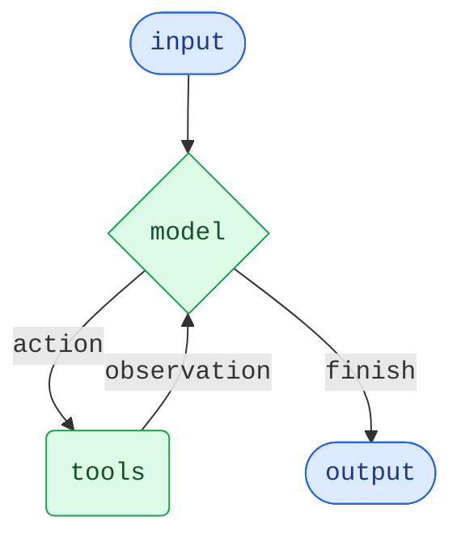

代理将语言模型与[工具](/oss/python/langchain/tools)相结合，以创建能够推理任务、决定使用哪些工具并迭代工作以达成解决方案的系统。

[`create_agent`](https://reference.langchain.com/python/langchain/agents/factory/create_agent) 提供了一个生产就绪的代理实现。

[一个 LLM 代理在循环中运行工具以实现目标](https://simonwillison.net/2025/Sep/18/agents/)。
代理会一直运行，直到满足停止条件——即模型发出最终输出或达到迭代限制。



<Info>

[`create_agent`](https://reference.langchain.com/python/langchain/agents/factory/create_agent) 使用 [LangGraph](/oss/python/langgraph/overview) 构建一个基于**图**的代理运行时。图由节点（步骤）和边（连接）组成，定义了代理如何处理信息。代理通过此图移动，执行节点，例如模型节点（调用模型）、工具节点（执行工具）或中间件。

了解更多关于[图 API](/oss/python/langgraph/graph-api) 的信息。

</Info>

## 核心组件

### 模型

[模型](/oss/python/langchain/models) 是代理的推理引擎。可以通过多种方式指定，支持静态和动态模型选择。

#### 静态模型

静态模型在创建代理时配置一次，并在整个执行过程中保持不变。这是最常见且最直接的方法。

要从 <Tooltip tip="遵循格式 `provider:model` 的字符串（例如 openai:gpt-5）" cta="查看映射" href="https://reference.langchain.com/python/langchain/models/#langchain.chat_models.init_chat_model(model)">模型标识符字符串</Tooltip> 初始化静态模型：

```python wrap
from langchain.agents import create_agent

agent = create_agent("openai:gpt-5", tools=tools)
```

<Tip>
    模型标识符字符串支持自动推断（例如，`"gpt-5"` 将被推断为 `"openai:gpt-5"`）。请参阅[参考](https://reference.langchain.com/python/langchain/chat_models/base/init_chat_model) 以查看完整的模型标识符字符串映射列表。
</Tip>

要更精细地控制模型配置，可以直接使用提供程序包初始化模型实例。在此示例中，我们使用 [`ChatOpenAI`](https://reference.langchain.com/python/langchain-openai/chat_models/base/ChatOpenAI)。请参阅[聊天模型](/oss/python/integrations/chat) 以查看其他可用的聊天模型类。

```python wrap
from langchain.agents import create_agent
from langchain_openai import ChatOpenAI

model = ChatOpenAI(
    model="gpt-5",
    temperature=0.1,
    max_tokens=1000,
    timeout=30
    # ... (其他参数)
)
agent = create_agent(model, tools=tools)
```

模型实例让您完全控制配置。当您需要设置特定的[参数](/oss/python/langchain/models#parameters)（如 `temperature`、`max_tokens`、`timeouts`、`base_url` 以及其他提供程序特定的设置）时，请使用它们。请参阅[参考](/oss/python/integrations/providers/all_providers) 以查看模型上可用的参数和方法。

#### 动态模型

动态模型在<Tooltip tip="代理的执行环境，包含不可变配置和在整个代理执行期间持续存在的上下文数据（例如，用户 ID、会话详细信息或应用程序特定配置）。">运行时</Tooltip>根据当前的<Tooltip tip="流经代理执行的数据，包括消息、自定义字段以及在处理期间需要跟踪和可能修改的任何信息（例如，用户偏好或工具使用统计信息）。">状态</Tooltip>和上下文进行选择。这支持复杂的路由逻辑和成本优化。

要使用动态模型，请使用 [`@wrap_model_call`](https://reference.langchain.com/python/langchain/agents/middleware/types/wrap_model_call) 装饰器创建中间件，以修改请求中的模型：

```python
from langchain_openai import ChatOpenAI
from langchain.agents import create_agent
from langchain.agents.middleware import wrap_model_call, ModelRequest, ModelResponse


basic_model = ChatOpenAI(model="gpt-4.1-mini")
advanced_model = ChatOpenAI(model="gpt-4.1")

@wrap_model_call
def dynamic_model_selection(request: ModelRequest, handler) -> ModelResponse:
    """根据对话复杂度选择模型"""
    message_count = len(request.state["messages"])

    if message_count > 10:
        # 对于较长的对话，使用高级模型
        model = advanced_model
    else:
        model = basic_model

    return handler(request.override(model=model))

agent = create_agent(
    model=basic_model,  # 默认模型
    tools=tools,
    middleware=[dynamic_model_selection]
)
```

<Warning>
当使用结构化输出时，不支持预绑定模型（已调用 [`bind_tools`](https://reference.langchain.com/python/langchain-core/language_models/chat_models/BaseChatModel/bind_tools) 的模型）。如果需要在结构化输出时进行动态模型选择，请确保传递给中间件的模型未预绑定。
</Warning>

<Tip>
有关模型配置的详细信息，请参阅[模型](/oss/python/langchain/models)。有关动态模型选择模式，请参阅[中间件中的动态模型](/oss/python/langchain/middleware#dynamic-model)。
</Tip>

### 工具

工具赋予代理采取行动的能力。代理超越了简单的仅模型工具绑定，支持：

- 按顺序进行多次工具调用（由单个提示触发）
- 在适当时进行并行工具调用
- 基于先前结果的动态工具选择
- 工具重试逻辑和错误处理
- 跨工具调用的状态持久性

有关更多信息，请参阅[工具](/oss/python/langchain/tools)。

#### 静态工具

静态工具在创建代理时定义，并在整个执行过程中保持不变。这是最常见且最直接的方法。

要定义具有静态工具的代理，请将工具列表传递给代理。

<Tip>
工具可以指定为普通 Python 函数或<Tooltip tip="一种可以暂停执行并在以后恢复的方法">协程</Tooltip>。

可以使用[工具装饰器](/oss/python/langchain/tools#create-tools)来自定义工具名称、描述、参数模式和其他属性。
</Tip>

```python wrap
from langchain.tools import tool
from langchain.agents import create_agent


@tool
def search(query: str) -> str:
    """搜索信息"""
    return f"Results for: {query}"

@tool
def get_weather(location: str) -> str:
    """获取某地的天气信息"""
    return f"Weather in {location}: Sunny, 72°F"

agent = create_agent(model, tools=[search, get_weather])
```

如果提供了空的工具列表，代理将由一个没有工具调用能力的单个 LLM 节点组成。

#### 动态工具

使用动态工具时，代理可用的工具集是在运行时修改的，而不是预先定义的。并非所有工具都适用于所有情况。工具太多可能会使模型不堪重负（上下文过载）并增加错误；工具太少会限制功能。动态工具选择支持根据身份验证状态、用户权限、功能标志或对话阶段调整可用工具集。

根据工具是否提前已知，有两种方法：

<Tabs>
  <Tab title="过滤预注册工具">

    当所有可能的工具在代理创建时已知时，您可以预先注册它们，并根据状态、权限或上下文动态过滤暴露给模型的工具。

    <Tabs>
      <Tab title="状态">
        仅在达到特定对话里程碑后启用高级工具：

        ```python
        from langchain.agents import create_agent
        from langchain.agents.middleware import wrap_model_call, ModelRequest, ModelResponse
        from typing import Callable

        @wrap_model_call
        def state_based_tools(
            request: ModelRequest,
            handler: Callable[[ModelRequest], ModelResponse]
        ) -> ModelResponse:
            """根据对话状态过滤工具"""
            # 从状态读取：检查用户是否已认证
            state = request.state
            is_authenticated = state.get("authenticated", False)
            message_count = len(state["messages"])

            # 仅在认证后启用敏感工具
            if not is_authenticated:
                tools = [t for t in request.tools if t.name.startswith("public_")]
                request = request.override(tools=tools)
            elif message_count < 5:
                # 在对话早期限制工具
                tools = [t for t in request.tools if t.name != "advanced_search"]
                request = request.override(tools=tools)

            return handler(request)

        agent = create_agent(
            model="gpt-4.1",
            tools=[public_search, private_search, advanced_search],
            middleware=[state_based_tools]
        )
        ```

      </Tab>

      <Tab title="存储">
        根据存储中的用户偏好或功能标志过滤工具：

        ```python
        from dataclasses import dataclass
        from langchain.agents import create_agent
        from langchain.agents.middleware import wrap_model_call, ModelRequest, ModelResponse
        from typing import Callable
        from langgraph.store.memory import InMemoryStore

        @dataclass
        class Context:
            user_id: str

        @wrap_model_call
        def store_based_tools(
            request: ModelRequest,
            handler: Callable[[ModelRequest], ModelResponse]
        ) -> ModelResponse:
            """根据存储偏好过滤工具"""
            user_id = request.runtime.context.user_id

            # 从存储读取：获取用户启用的功能
            store = request.runtime.store
            feature_flags = store.get(("features",), user_id)

            if feature_flags:
                enabled_features = feature_flags.value.get("enabled_tools", [])
                # 仅包含为此用户启用的工具
                tools = [t for t in request.tools if t.name in enabled_features]
                request = request.override(tools=tools)

            return handler(request)

        agent = create_agent(
            model="gpt-4.1",
            tools=[search_tool, analysis_tool, export_tool],
            middleware=[store_based_tools],
            context_schema=Context,
            store=InMemoryStore()
        )
        ```

      </Tab>

      <Tab title="运行时上下文">
        根据运行时上下文中的用户权限过滤工具：

        ```python
        from dataclasses import dataclass
        from langchain.agents import create_agent
        from langchain.agents.middleware import wrap_model_call, ModelRequest, ModelResponse
        from typing import Callable

        @dataclass
        class Context:
            user_role: str

        @wrap_model_call
        def context_based_tools(
            request: ModelRequest,
            handler: Callable[[ModelRequest], ModelResponse]
        ) -> ModelResponse:
            """根据运行时上下文权限过滤工具"""
            # 从运行时上下文读取：获取用户角色
            if request.runtime is None or request.runtime.context is None:
                # 如果未提供上下文，默认为查看者（限制最严格）
                user_role = "viewer"
            else:
                user_role = request.runtime.context.user_role

            if user_role == "admin":
                # 管理员获得所有工具
                pass
            elif user_role == "editor":
                # 编辑器不能删除
                tools = [t for t in request.tools if t.name != "delete_data"]
                request = request.override(tools=tools)
            else:
                # 查看者获得只读工具
                tools = [t for t in request.tools if t.name.startswith("read_")]
                request = request.override(tools=tools)

            return handler(request)

        agent = create_agent(
            model="gpt-4.1",
            tools=[read_data, write_data, delete_data],
            middleware=[context_based_tools],
            context_schema=Context
        )
        ```

      </Tab>
    </Tabs>

    此方法在以下情况下最佳：
    - 所有可能的工具在编译/启动时已知
    - 您希望基于权限、功能标志或对话状态进行过滤
    - 工具是静态的，但其可用性是动态的

    有关更多示例，请参阅[动态选择工具](/oss/python/langchain/middleware/custom#dynamically-selecting-tools)。

  </Tab>

  <Tab title="运行时工具注册">

    当工具在运行时被发现或创建时（例如，从 MCP 服务器加载、基于用户数据生成或从远程注册表获取），您需要同时注册工具并动态处理其执行。

    这需要两个中间件钩子：
    1. `wrap_model_call` - 将动态工具添加到请求中
    2. `wrap_tool_call` - 处理动态添加的工具的执行

    ```python
    from langchain.tools import tool
    from langchain.agents import create_agent
    from langchain.agents.middleware import AgentMiddleware, ModelRequest, ToolCallRequest

    # 一个将在运行时动态添加的工具
    @tool
    def calculate_tip(bill_amount: float, tip_percentage: float = 20.0) -> str:
        """计算账单的小费金额"""
        tip = bill_amount * (tip_percentage / 100)
        return f"Tip: ${tip:.2f}, Total: ${bill_amount + tip:.2f}"

    class DynamicToolMiddleware(AgentMiddleware):
        """注册和处理动态工具的中间件"""

        def wrap_model_call(self, request: ModelRequest, handler):
            # 将动态工具添加到请求中
            # 这可以从 MCP 服务器、数据库等加载
            updated = request.override(tools=[*request.tools, calculate_tip])
            return handler(updated)

        def wrap_tool_call(self, request: ToolCallRequest, handler):
            # 处理动态工具的执行
            if request.tool_call["name"] == "calculate_tip":
                return handler(request.override(tool=calculate_tip))
            return handler(request)

    agent = create_agent(
        model="gpt-4o",
        tools=[get_weather],  # 仅在此处注册静态工具
        middleware=[DynamicToolMiddleware()],
    )

    # 代理现在可以同时使用 get_weather 和 calculate_tip
    result = agent.invoke({
        "messages": [{"role": "user", "content": "Calculate a 20% tip on $85"}]
    })
    ```

    此方法在以下情况下最佳：
    - 工具在运行时被发现（例如，从 MCP 服务器）
    - 工具基于用户数据或配置动态生成
    - 您正在与外部工具注册表集成

    <Note>
    `wrap_tool_call` 钩子对于运行时注册的工具是必需的，因为代理需要知道如何执行不在原始工具列表中的工具。没有它，代理将不知道如何调用动态添加的工具。
    </Note>

  </Tab>
</Tabs>

<Tip>
要了解有关工具的更多信息，请参阅[工具](/oss/python/langchain/tools)。
</Tip>

#### 工具错误处理

要自定义工具错误的处理方式，请使用 [`@wrap_tool_call`](https://reference.langchain.com/python/langchain/agents/middleware/types/wrap_tool_call) 装饰器创建中间件：

```python wrap
from langchain.agents import create_agent
from langchain.agents.middleware import wrap_tool_call
from langchain.messages import ToolMessage


@wrap_tool_call
def handle_tool_errors(request, handler):
    """使用自定义消息处理工具执行错误"""
    try:
        return handler(request)
    except Exception as e:
        # 向模型返回自定义错误消息
        return ToolMessage(
            content=f"Tool error: Please check your input and try again. ({str(e)})",
            tool_call_id=request.tool_call["id"]
        )

agent = create_agent(
    model="gpt-4.1",
    tools=[search, get_weather],
    middleware=[handle_tool_errors]
)
```

当工具失败时，代理将返回一个带有自定义错误消息的 [`ToolMessage`](https://reference.langchain.com/python/langchain-core/messages/tool/ToolMessage)：

```python
[
    ...
    ToolMessage(
        content="Tool error: Please check your input and try again. (division by zero)",
        tool_call_id="..."
    ),
    ...
]
```

#### ReAct 循环中的工具使用

代理遵循 ReAct（“推理 + 行动”）模式，在简短的推理步骤和有针对性的工具调用之间交替进行，并将结果观察结果输入后续决策，直到可以提供最终答案。

<Accordion title="ReAct 循环示例">
**提示：** 识别当前最受欢迎的无线耳机并验证库存。

```
================================ Human Message =================================

Find the most popular wireless headphones right now and check if they're in stock
```

* **推理**： “流行度是时间敏感的，我需要使用提供的搜索工具。”
* **行动**： 调用 `search_products("wireless headphones")`

```
================================== Ai Message ==================================
Tool Calls:
  search_products (call_abc123)
 Call ID: call_abc123
  Args:
    query: wireless headphones
```
```
================================= Tool Message =================================

Found 5 products matching "wireless headphones". Top 5 results: WH-1000XM5, ...
```

* **推理**： “我需要在回答前确认排名靠前的项目的库存。”
* **行动**： 调用 `check_inventory("WH-1000XM5")`

```
================================== Ai Message ==================================
Tool Calls:
  check_inventory (call_def456)
 Call ID: call_def456
  Args:
    product_id: WH-1000XM5
```
```
================================= Tool Message =================================

Product WH-1000XM5: 10 units in stock
```

* **推理**： “我有了最受欢迎的型号及其库存状态。我现在可以回答用户的问题了。”
* **行动**： 生成最终答案

```
================================== Ai Message ==================================

I found wireless headphones (model WH-1000XM5) with 10 units in stock...
```
</Accordion>

### 系统提示

您可以通过提供提示来塑造代理处理任务的方式。[`system_prompt`](https://reference.langchain.com/python/langchain/agents/#langchain.agents.create_agent(system_prompt)) 参数可以作为字符串提供：

```python wrap
agent = create_agent(
    model,
    tools,
    system_prompt="You are a helpful assistant. Be concise and accurate."
)
```

如果未提供 [`system_prompt`](https://reference.langchain.com/python/langchain/agents/#langchain.agents.create_agent(system_prompt))，代理将直接从消息中推断其任务。

[`system_prompt`](https://reference.langchain.com/python/langchain/agents/#langchain.agents.create_agent(system_prompt)) 参数接受 `str` 或 [`SystemMessage`](https://reference.langchain.com/python/langchain-core/messages/system/SystemMessage)。使用 `SystemMessage` 可以让您更好地控制提示结构，这对于提供程序特定的功能（如 [Anthropic 的提示缓存](/oss/python/integrations/chat/anthropic#prompt-caching)）非常有用：

```python wrap
from langchain.agents import create_agent
from langchain.messages import SystemMessage, HumanMessage

literary_agent = create_agent(
    model="anthropic:claude-sonnet-4-5",
    system_prompt=SystemMessage(
        content=[
            {
                "type": "text",
                "text": "You are an AI assistant tasked with analyzing literary works.",
            },
            {
                "type": "text",
                "text": "<the entire contents of 'Pride and Prejudice'>",
                "cache_control": {"type": "ephemeral"}
            }
        ]
    )
)

result = literary_agent.invoke(
    {"messages": [HumanMessage("Analyze the major themes in 'Pride and Prejudice'.")]}
)
```

带有 `{"type": "ephemeral"}` 的 `cache_control` 字段告诉 Anthropic 缓存该内容块，从而减少重复请求的延迟和成本。

#### 动态系统提示

对于更高级的用例，您需要根据运行时上下文或代理状态修改系统提示，您可以使用[中间件](/oss/python/langchain/middleware)。

[`@dynamic_prompt`](https://reference.langchain.com/python/langchain/agents/middleware/types/dynamic_prompt) 装饰器创建一个中间件，根据模型请求生成系统提示：

```python wrap
from typing import TypedDict

from langchain.agents import create_agent
from langchain.agents.middleware import dynamic_prompt, ModelRequest


class Context(TypedDict):
    user_role: str

@dynamic_prompt
def user_role_prompt(request: ModelRequest) -> str:
    """根据用户角色生成系统提示"""
    user_role = request.runtime.context.get("user_role", "user")
    base_prompt = "You are a helpful assistant."

    if user_role == "expert":
        return f"{base_prompt} Provide detailed technical responses."
    elif user_role == "beginner":
        return f"{base_prompt} Explain concepts simply and avoid jargon."

    return base_prompt

agent = create_agent(
    model="gpt-4.1",
    tools=[web_search],
    middleware=[user_role_prompt],
    context_schema=Context
)

# 系统提示将根据上下文动态设置
result = agent.invoke(
    {"messages": [{"role": "user", "content": "Explain machine learning"}]},
    context={"user_role": "expert"}
)
```

<Tip>
有关消息类型和格式的更多详细信息，请参阅[消息](/oss/python/langchain/messages)。有关中间件的综合文档，请参阅[中间件](/oss/python/langchain/middleware)。
</Tip>

### 名称

为代理设置一个可选的[`名称`](https://reference.langchain.com/python/langchain/agents/factory/create_agent)。当将代理作为子图添加到[多代理系统](/oss/python/langchain/multi-agent)时，这将用作节点标识符：

```python
agent = create_agent(
    model,
    tools,
    name="research_assistant"
)
```

<Warning>
    代理名称首选 `snake_case`（例如，`research_assistant` 而不是 `Research Assistant`）。某些模型提供程序会拒绝包含空格或特殊字符的名称并报错。仅使用字母数字字符、下划线和连字符可确保与所有提供程序的兼容性。这同样适用于[工具名称](/oss/python/langchain/tools)。
</Warning>

## 调用

您可以通过向其[`状态`](/oss/python/langgraph/graph-api#state)传递更新来调用代理。所有代理的状态中都包含一个[消息序列](/oss/python/langgraph/use-graph-api#messagesstate)；要调用代理，请传递一个新消息：

```python
result = agent.invoke(
    {"messages": [{"role": "user", "content": "What's the weather in San Francisco?"}]}
)
```

要流式传输代理的步骤和/或令牌，请参阅[流式传输](/oss/python/langchain/streaming) 指南。

否则，代理遵循 LangGraph [图 API](/oss/python/langgraph/use-graph-api) 并支持所有相关方法，例如 `stream` 和 `invoke`。

<Tip>
使用 [LangSmith](/langsmith/home) 来跟踪、调试和评估您的代理。
</Tip>

## 高级概念

### 结构化输出

在某些情况下，您可能希望代理以特定格式返回输出。LangChain 通过 [`response_format`](https://reference.langchain.com/python/langchain/agents/factory/create_agent) 参数提供结构化输出的策略。

#### ToolStrategy

`ToolStrategy` 使用人工工具调用来生成结构化输出。这适用于任何支持工具调用的模型。当提供程序原生的结构化输出（通过 [`ProviderStrategy`](#providerstrategy)）不可用或不可靠时，应使用 `ToolStrategy`。

```python wrap
from pydantic import BaseModel
from langchain.agents import create_agent
from langchain.agents.structured_output import ToolStrategy


class ContactInfo(BaseModel):
    name: str
    email: str
    phone: str

agent = create_agent(
    model="gpt-4.1-mini",
    tools=[search_tool],
    response_format=ToolStrategy(ContactInfo)
)

result = agent.invoke({
    "messages": [{"role": "user", "content": "Extract contact info from: John Doe, john@example.com, (555) 123-4567"}]
})

result["structured_response"]
# ContactInfo(name='John Doe', email='john@example.com', phone='(555) 123-4567')
```

#### ProviderStrategy

`ProviderStrategy` 使用模型提供程序的原生结构化输出生成。这更可靠，但仅适用于支持原生结构化输出的提供程序：

```python wrap
from langchain.agents.structured_output import ProviderStrategy

agent = create_agent(
    model="gpt-4.1",
    response_format=ProviderStrategy(ContactInfo)
)
```

<Note>
截至 `langchain 1.0`，只需传递一个模式（例如，`response_format=ContactInfo`）将默认为 `ProviderStrategy`（如果模型支持原生结构化输出）。否则将回退到 `ToolStrategy`。
</Note>

<Tip>
    要了解有关结构化输出的信息，请参阅[结构化输出](/oss/python/langchain/structured-output)。
</Tip>

### 内存

代理通过消息状态自动维护对话历史记录。您还可以配置代理使用自定义状态模式，以在对话期间记住附加信息。

存储在状态中的信息可以被认为是代理的[短期记忆](/oss/python/langchain/short-term-memory)：

自定义状态模式必须将 [`AgentState`](https://reference.langchain.com/python/langchain/agents/middleware/types/AgentState) 扩展为 `TypedDict`。

有两种定义自定义状态的方法：
1. 通过[中间件](/oss/python/langchain/middleware)（首选）
2. 通过 [`create_agent`](https://reference.langchain.com/python/langchain/agents/factory/create_agent) 上的 [`state_schema`](https://reference.langchain.com/python/langchain/middleware/#langchain.agents.middleware.AgentMiddleware.state_schema)

#### 通过中间件定义状态

当您的自定义状态需要被特定中间件钩子和附加到所述中间件的工具访问时，使用中间件定义自定义状态。

```python
from langchain.agents import AgentState
from langchain.agents.middleware import AgentMiddleware
from typing import Any


class CustomState(AgentState):
    user_preferences: dict

class CustomMiddleware(AgentMiddleware):
    state_schema = CustomState
    tools = [tool1, tool2]

    def before_model(self, state: CustomState, runtime) -> dict[str, Any] | None:
        ...

agent = create_agent(
    model,
    tools=tools,
    middleware=[CustomMiddleware()]
)

# 代理现在可以跟踪消息之外的附加状态
result = agent.invoke({
    "messages": [{"role": "user", "content": "I prefer technical explanations"}],
    "user_preferences": {"style": "technical", "verbosity": "detailed"},
})
```

#### 通过 `state_schema` 定义状态

使用 [`state_schema`](https://reference.langchain.com/python/langchain/middleware/#langchain.agents.middleware.AgentMiddleware.state_schema) 参数作为快捷方式，定义仅在工具中使用的自定义状态。

```python
from langchain.agents import AgentState


class CustomState(AgentState):
    user_preferences: dict

agent = create_agent(
    model,
    tools=[tool1, tool2],
    state_schema=CustomState
)
# 代理现在可以跟踪消息之外的附加状态
result = agent.invoke({
    "messages": [{"role": "user", "content": "I prefer technical explanations"}],
    "user_preferences": {"style": "technical", "verbosity": "detailed"},
})
```

<Note>
截至 `langchain 1.0`，自定义状态模式**必须**是 `TypedDict` 类型。不再支持 Pydantic 模型和数据类。有关更多详细信息，请参阅[v1 迁移指南](/oss/python/migrate/langchain-v1#state-type-restrictions)。
</Note>

<Note>
    通过中间件定义自定义状态优于通过 [`create_agent`](https://reference.langchain.com/python/langchain/agents/factory/create_agent) 上的 [`state_schema`](https://reference.langchain.com/python/langchain/middleware/#langchain.agents.middleware.AgentMiddleware.state_schema) 定义，因为它允许您将状态扩展在概念上限定在相关的中间件和工具范围内。

    [`state_schema`](https://reference.langchain.com/python/langchain/middleware/#langchain.agents.middleware.AgentMiddleware.state_schema) 仍受支持，用于 [`create_agent`](https://reference.langchain.com/python/langchain/agents/factory/create_agent) 的向后兼容性。
</Note>

<Tip>
    要了解有关内存的更多信息，请参阅[内存](/oss/python/concepts/memory)。有关实现跨会话持久化的长期记忆的信息，请参阅[长期记忆](/oss/python/langchain/long-term-memory)。
</Tip>

### 流式传输

我们已经了解了如何使用 `invoke` 调用代理以获取最终响应。如果代理执行多个步骤，这可能需要一段时间。为了显示中间进度，我们可以在消息发生时流式传回消息。

```python
from langchain.messages import AIMessage, HumanMessage

for chunk in agent.stream({
    "messages": [{"role": "user", "content": "Search for AI news and summarize the findings"}]
}, stream_mode="values"):
    # 每个块包含该时间点的完整状态
    latest_message = chunk["messages"][-1]
    if latest_message.content:
        if isinstance(latest_message, HumanMessage):
            print(f"User: {latest_message.content}")
        elif isinstance(latest_message, AIMessage):
            print(f"Agent: {latest_message.content}")
    elif latest_message.tool_calls:
        print(f"Calling tools: {[tc['name'] for tc in latest_message.tool_calls]}")
```

<Tip>
有关流式传输的更多详细信息，请参阅[流式传输](/oss/python/langchain/streaming)。
</Tip>

### 中间件

[中间件](/oss/python/langchain/middleware) 为在执行的不同阶段自定义代理行为提供了强大的可扩展性。您可以使用中间件来：

- 在调用模型之前处理状态（例如，消息修剪、上下文注入）
- 修改或验证模型的响应（例如，护栏、内容过滤）
- 使用自定义逻辑处理工具执行错误
- 基于状态或上下文实现动态模型选择
- 添加自定义日志记录、监控或分析

中间件无缝集成到代理的执行中，允许您在关键点拦截和修改数据流，而无需更改核心代理逻辑。

<Tip>
有关中间件的综合文档，包括装饰器如 [`@before_model`](https://reference.langchain.com/python/langchain/agents/middleware/types/before_model)、[`@after_model`](https://reference.langchain.com/python/langchain/agents/middleware/types/after_model) 和 [`@wrap_tool_call`](https://reference.langchain.com/python/langchain/agents/middleware/types/wrap_tool_call)，请参阅[中间件](/oss/python/langchain/middleware)。
</Tip>

---

<div className="source-links">
<Callout icon="edit">
    [在 GitHub 上编辑此页面](https://github.com/langchain-ai/docs/edit/main/src/oss/langchain/agents.mdx) 或[提交问题](https://github.com/langchain-ai/docs/issues/new/choose)。
</Callout>
<Callout icon="terminal-2">
    [通过 MCP 将这些文档连接到 Claude、VSCode 等](/use-these-docs) 以获取实时答案。
</Callout>
</div>