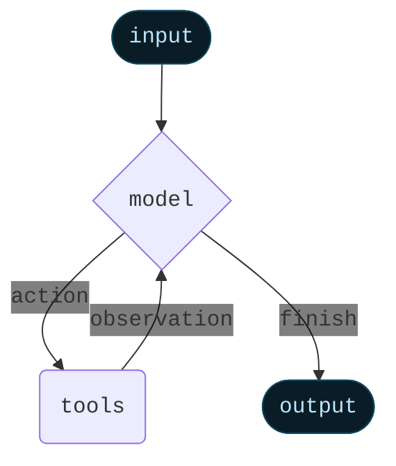

Agent 将语言模型与[工具](/oss/python/langchain/tools)结合起来，创建能够推理任务、决定使用哪些工具并迭代地朝着解决方案努力的系统。

[`create_agent`](https://reference.langchain.com/python/langchain/agents/#langchain.agents.create_agent) 提供了一个生产就绪的 Agent 实现。


[LLM Agent 在循环中运行工具以实现目标](https://simonwillison.net/2025/Sep/18/agents/)。
Agent 会一直运行直到满足停止条件——即当模型发出最终输出或达到迭代限制时。



<Info>

[`create_agent`](https://reference.langchain.com/python/langchain/agents/#langchain.agents.create_agent) 使用 [LangGraph](/oss/python/langgraph/overview) 构建基于**图**的 Agent 运行时。图由节点（步骤）和边（连接）组成，定义了 Agent 如何处理信息。Agent 在这个图中移动，执行诸如模型节点（调用模型）、工具节点（执行工具）或中间件等节点。


了解更多关于 [Graph API](/oss/python/langgraph/graph-api)。

</Info>

## 核心组件

### 模型

[模型](/oss/python/langchain/models)是 Agent 的推理引擎。它可以通过多种方式指定，支持静态和动态模型选择。

#### 静态模型

静态模型在创建 Agent 时配置一次，并在整个执行过程中保持不变。这是最常见和最直接的方法。

从<Tooltip tip="遵循 `provider:model` 格式的字符串（例如 openai:gpt-5）" cta="查看映射" href="https://reference.langchain.com/python/langchain/models/#langchain.chat_models.init_chat_model(model)">模型标识符字符串</Tooltip>初始化静态模型：

```python wrap
from langchain.agents import create_agent

agent = create_agent("openai:gpt-5", tools=tools)
```


<Tip>
    模型标识符字符串支持自动推断（例如，`"gpt-5"` 将被推断为 `"openai:gpt-5"`）。参考 [参考文档](https://reference.langchain.com/python/langchain/models/#langchain.chat_models.init_chat_model(model)) 查看完整的模型标识符字符串映射列表。
</Tip>

要更好地控制模型配置，请使用服务商包直接初始化模型实例。在此示例中，我们使用 [`ChatOpenAI`](https://reference.langchain.com/python/integrations/langchain_openai/ChatOpenAI)。参见[聊天模型](/oss/python/integrations/chat)了解其他可用的聊天模型类。

```python wrap
from langchain.agents import create_agent
from langchain_openai import ChatOpenAI

model = ChatOpenAI(
    model="gpt-5",
    temperature=0.1,
    max_tokens=1000,
    timeout=30
    # ... (other params)
)
agent = create_agent(model, tools=tools)
```

模型实例让你完全控制配置。当你需要设置特定的[参数](/oss/python/langchain/models#parameters)如 `temperature`、`max_tokens`、`timeouts`、`base_url` 和其他服务商特定设置时使用它们。参考[参考文档](/oss/python/integrations/providers/all_providers)查看模型上可用的参数和方法。


#### 动态模型

动态模型在<Tooltip tip="Agent 的执行环境，包含在 Agent 执行期间持续存在的不可变配置和上下文数据（例如用户 ID、会话详情或应用程序特定配置）。">运行时</Tooltip>根据当前<Tooltip tip="流经 Agent 执行的数据，包括消息、自定义字段以及在处理过程中需要跟踪和可能修改的任何信息（例如用户偏好或工具使用统计）。">状态</Tooltip>和上下文选择。这支持复杂的路由逻辑和成本优化。

要使用动态模型，请使用 [`@wrap_model_call`](https://reference.langchain.com/python/langchain/middleware/#langchain.agents.middleware.wrap_model_call) 装饰器创建中间件来修改请求中的模型：

```python
from langchain_openai import ChatOpenAI
from langchain.agents import create_agent
from langchain.agents.middleware import wrap_model_call, ModelRequest, ModelResponse


basic_model = ChatOpenAI(model="gpt-4o-mini")
advanced_model = ChatOpenAI(model="gpt-4o")

@wrap_model_call
def dynamic_model_selection(request: ModelRequest, handler) -> ModelResponse:
    """Choose model based on conversation complexity."""
    message_count = len(request.state["messages"])

    if message_count > 10:
        # Use an advanced model for longer conversations
        model = advanced_model
    else:
        model = basic_model

    return handler(request.override(model=model))

agent = create_agent(
    model=basic_model,  # Default model
    tools=tools,
    middleware=[dynamic_model_selection]
)
```

<Warning>
使用结构化输出时不支持预绑定模型（已调用 [`bind_tools`](https://reference.langchain.com/python/langchain_core/language_models/#langchain_core.language_models.chat_models.BaseChatModel.bind_tools) 的模型）。如果你需要使用结构化输出的动态模型选择，请确保传递给中间件的模型未预绑定。
</Warning>


<Tip>
有关模型配置详细信息，请参阅[模型](/oss/python/langchain/models)。有关动态模型选择模式，请参阅[中间件中的动态模型](/oss/python/langchain/middleware#dynamic-model)。
</Tip>

### 工具

工具赋予 Agent 执行操作的能力。Agent 通过以下方式超越简单的仅模型工具绑定：

- 按顺序进行多个工具调用（由单个提示触发）
- 在适当时并行调用工具
- 基于先前结果动态选择工具
- 工具重试逻辑和错误处理
- 跨工具调用的状态持久化

有关更多信息，请参阅[工具](/oss/python/langchain/tools)。

#### 定义工具

向 Agent 传递工具列表。

<Tip>
工具可以指定为普通 Python 函数或<Tooltip tip="可以暂停执行并在稍后恢复的方法">协程</Tooltip>。

[tool 装饰器](/oss/python/langchain/tools#create-tools)可用于自定义工具名称、描述、参数模式和其他属性。
</Tip>

```python wrap
from langchain.tools import tool
from langchain.agents import create_agent


@tool
def search(query: str) -> str:
    """Search for information."""
    return f"Results for: {query}"

@tool
def get_weather(location: str) -> str:
    """Get weather information for a location."""
    return f"Weather in {location}: Sunny, 72°F"

agent = create_agent(model, tools=[search, get_weather])
```


如果提供空的工具列表，Agent 将由一个没有工具调用能力的单一 LLM 节点组成。

#### 工具错误处理

要自定义工具错误的处理方式，请使用 [`@wrap_tool_call`](https://reference.langchain.com/python/langchain/middleware/#langchain.agents.middleware.wrap_tool_call) 装饰器创建中间件：

```python wrap
from langchain.agents import create_agent
from langchain.agents.middleware import wrap_tool_call
from langchain.messages import ToolMessage


@wrap_tool_call
def handle_tool_errors(request, handler):
    """Handle tool execution errors with custom messages."""
    try:
        return handler(request)
    except Exception as e:
        # Return a custom error message to the model
        return ToolMessage(
            content=f"Tool error: Please check your input and try again. ({str(e)})",
            tool_call_id=request.tool_call["id"]
        )

agent = create_agent(
    model="gpt-4o",
    tools=[search, get_weather],
    middleware=[handle_tool_errors]
)
```

当工具失败时，Agent 将返回带有自定义错误消息的 [`ToolMessage`](https://reference.langchain.com/python/langchain/messages/#langchain.messages.ToolMessage)：

```python
[
    ...
    ToolMessage(
        content="Tool error: Please check your input and try again. (division by zero)",
        tool_call_id="..."
    ),
    ...
]
```


#### ReAct 循环中的工具使用

Agent 遵循 ReAct（"Reasoning + Acting"，即推理 + 行动）模式，在简短的推理步骤与有针对性的工具调用之间交替，并将结果观察反馈到后续决策中，直到它们能够提供最终答案。

<Accordion title="ReAct 循环示例">
**提示词：** 识别当前最流行的无线耳机并验证可用性。

```
================================ Human Message =================================

Find the most popular wireless headphones right now and check if they're in stock
```

* **推理**："流行度是时间敏感的，我需要使用提供的搜索工具。"
* **行动**：调用 `search_products("wireless headphones")`

```
================================== Ai Message ==================================
Tool Calls:
  search_products (call_abc123)
 Call ID: call_abc123
  Args:
    query: wireless headphones
```
```
================================= Tool Message =================================

Found 5 products matching "wireless headphones". Top 5 results: WH-1000XM5, ...
```

* **推理**："在回答之前，我需要确认排名第一的商品的可用性。"
* **行动**：调用 `check_inventory("WH-1000XM5")`

```
================================== Ai Message ==================================
Tool Calls:
  check_inventory (call_def456)
 Call ID: call_def456
  Args:
    product_id: WH-1000XM5
```
```
================================= Tool Message =================================

Product WH-1000XM5: 10 units in stock
```

* **推理**："我有最流行的型号及其库存状态。现在我可以回答用户的问题了。"
* **行动**：生成最终答案

```
================================== Ai Message ==================================

I found wireless headphones (model WH-1000XM5) with 10 units in stock...
```
</Accordion>

#### 动态工具

在某些场景中，你需要在运行时修改 Agent 可用的工具集，而不是预先定义所有工具。根据工具是否提前已知，有两种方法：

<Tabs>
  <Tab title="过滤预注册的工具">

    当所有可能的工具在 Agent 创建时已知时，你可以预注册它们，并根据状态、权限或上下文动态过滤哪些工具暴露给模型。

    ```python
    from langchain.agents import create_agent
    from langchain.agents.middleware import wrap_model_call, ModelRequest, ModelResponse
    from typing import Callable

    @wrap_model_call
    def filter_tools(
        request: ModelRequest,
        handler: Callable[[ModelRequest], ModelResponse],
    ) -> ModelResponse:
        """Filter tools based on user permissions."""
        user_role = request.runtime.context.user_role

        if user_role == "admin":
            # Admins get all tools
            tools = request.tools
        else:
            # Regular users get read-only tools
            tools = [t for t in request.tools if t.name.startswith("read_")]

        return handler(request.override(tools=tools))

    agent = create_agent(
        model="gpt-4o",
        tools=[read_data, write_data, delete_data],  # All tools pre-registered
        middleware=[filter_tools],
    )
    ```


    此方法最适合以下情况：
    - 所有可能的工具在编译/启动时已知
    - 你想基于权限、功能标志或对话状态进行过滤
    - 工具是静态的，但其可用性是动态的

    有关更多示例，请参阅[动态选择工具](/oss/python/langchain/middleware/custom#dynamically-selecting-tools)。

  </Tab>

  <Tab title="运行时工具注册">

    当工具在运行时被发现或创建时（例如，从 MCP 服务器加载、基于用户数据生成或从远程注册表获取），你需要同时注册工具并动态处理它们的执行。

    这需要两个中间件钩子：
    1. `wrap_model_call` - 将动态工具添加到请求中
    2. `wrap_tool_call` - 处理动态添加工具的执行

    ```python
    from langchain.tools import tool
    from langchain.agents import create_agent
    from langchain.agents.middleware import AgentMiddleware, ModelRequest, ToolCallRequest

    # A tool that will be added dynamically at runtime
    @tool
    def calculate_tip(bill_amount: float, tip_percentage: float = 20.0) -> str:
        """Calculate the tip amount for a bill."""
        tip = bill_amount * (tip_percentage / 100)
        return f"Tip: ${tip:.2f}, Total: ${bill_amount + tip:.2f}"

    class DynamicToolMiddleware(AgentMiddleware):
        """Middleware that registers and handles dynamic tools."""

        def wrap_model_call(self, request: ModelRequest, handler):
            # Add dynamic tool to the request
            # This could be loaded from an MCP server, database, etc.
            updated = request.override(tools=[*request.tools, calculate_tip])
            return handler(updated)

        def wrap_tool_call(self, request: ToolCallRequest, handler):
            # Handle execution of the dynamic tool
            if request.tool_call["name"] == "calculate_tip":
                return handler(request.override(tool=calculate_tip))
            return handler(request)

    agent = create_agent(
        model="gpt-4o",
        tools=[get_weather],  # Only static tools registered here
        middleware=[DynamicToolMiddleware()],
    )

    # The agent can now use both get_weather AND calculate_tip
    result = agent.invoke({
        "messages": [{"role": "user", "content": "Calculate a 20% tip on $85"}]
    })
    ```


    此方法最适合以下情况：
    - 工具在运行时被发现（例如，从 MCP 服务器）
    - 工具基于用户数据或配置动态生成
    - 你正在与外部工具注册表集成

    <Note>
    运行时注册的工具需要 `wrap_tool_call` 钩子，因为 Agent 需要知道如何执行不在原始工具列表中的工具。没有它，Agent 将不知道如何调用动态添加的工具。
    </Note>

  </Tab>
</Tabs>

<Tip>
要了解更多关于工具的信息，请参阅[工具](/oss/python/langchain/tools)。
</Tip>

### 系统提示词

你可以通过提供提示词来塑造 Agent 处理任务的方式。[`system_prompt`](https://reference.langchain.com/python/langchain/agents/#langchain.agents.create_agent(system_prompt)) 参数可以作为字符串提供：


```python wrap
agent = create_agent(
    model,
    tools,
    system_prompt="You are a helpful assistant. Be concise and accurate."
)
```


当未提供 [`system_prompt`](https://reference.langchain.com/python/langchain/agents/#langchain.agents.create_agent(system_prompt)) 时，Agent 将直接从消息中推断其任务。

[`system_prompt`](https://reference.langchain.com/python/langchain/agents/#langchain.agents.create_agent(system_prompt)) 参数接受 `str` 或 [`SystemMessage`](https://reference.langchain.com/python/langchain/messages/#langchain.messages.SystemMessage)。使用 `SystemMessage` 可以让你更好地控制提示词结构，这对于服务商特定功能如 [Anthropic 的提示词缓存](/oss/python/integrations/chat/anthropic#prompt-caching)很有用：

```python wrap
from langchain.agents import create_agent
from langchain.messages import SystemMessage, HumanMessage

literary_agent = create_agent(
    model="anthropic:claude-sonnet-4-5",
    system_prompt=SystemMessage(
        content=[
            {
                "type": "text",
                "text": "You are an AI assistant tasked with analyzing literary works.",
            },
            {
                "type": "text",
                "text": "<the entire contents of 'Pride and Prejudice'>",
                "cache_control": {"type": "ephemeral"}
            }
        ]
    )
)

result = literary_agent.invoke(
    {"messages": [HumanMessage("Analyze the major themes in 'Pride and Prejudice'.")]}
)
```

带有 `{"type": "ephemeral"}` 的 `cache_control` 字段告诉 Anthropic 缓存该内容块，减少使用相同系统提示词的重复请求的延迟和成本。


#### 动态系统提示词

对于需要根据运行时上下文或 Agent 状态修改系统提示词的更高级用例，你可以使用[中间件](/oss/python/langchain/middleware)。

[`@dynamic_prompt`](https://reference.langchain.com/python/langchain/middleware/#langchain.agents.middleware.dynamic_prompt) 装饰器创建基于模型请求生成系统提示词的中间件：

```python wrap
from typing import TypedDict

from langchain.agents import create_agent
from langchain.agents.middleware import dynamic_prompt, ModelRequest


class Context(TypedDict):
    user_role: str

@dynamic_prompt
def user_role_prompt(request: ModelRequest) -> str:
    """Generate system prompt based on user role."""
    user_role = request.runtime.context.get("user_role", "user")
    base_prompt = "You are a helpful assistant."

    if user_role == "expert":
        return f"{base_prompt} Provide detailed technical responses."
    elif user_role == "beginner":
        return f"{base_prompt} Explain concepts simply and avoid jargon."

    return base_prompt

agent = create_agent(
    model="gpt-4o",
    tools=[web_search],
    middleware=[user_role_prompt],
    context_schema=Context
)

# The system prompt will be set dynamically based on context
result = agent.invoke(
    {"messages": [{"role": "user", "content": "Explain machine learning"}]},
    context={"user_role": "expert"}
)
```


<Tip>
有关消息类型和格式的更多详细信息，请参阅[消息](/oss/python/langchain/messages)。有关中间件的完整文档，请参阅[中间件](/oss/python/langchain/middleware)。
</Tip>

## 调用

你可以通过传递更新到 Agent 的 [`State`](/oss/python/langgraph/graph-api#state) 来调用 Agent。所有 Agent 在其状态中都包含一个[消息序列](/oss/python/langgraph/use-graph-api#messagesstate)；要调用 Agent，请传递一条新消息：

```python
result = agent.invoke(
    {"messages": [{"role": "user", "content": "What's the weather in San Francisco?"}]}
)
```


有关从 Agent 流式传输步骤和/或 token 的信息，请参阅[流式传输](/oss/python/langchain/streaming)指南。

否则，Agent 遵循 LangGraph [Graph API](/oss/python/langgraph/use-graph-api) 并支持所有相关方法，如 `stream` 和 `invoke`。

## 高级概念

### 结构化输出

在某些情况下，你可能希望 Agent 以特定格式返回输出。LangChain 通过 [`response_format`](https://reference.langchain.com/python/langchain/agents/#langchain.agents.create_agent(response_format)) 参数提供结构化输出策略。

#### ToolStrategy

`ToolStrategy` 使用人工工具调用来生成结构化输出。这适用于任何支持工具调用的模型。当服务商原生的结构化输出（通过 [`ProviderStrategy`](#ProviderStrategy)）不可用或不可靠时，应使用 `ToolStrategy`。

```python wrap
from pydantic import BaseModel
from langchain.agents import create_agent
from langchain.agents.structured_output import ToolStrategy


class ContactInfo(BaseModel):
    name: str
    email: str
    phone: str

agent = create_agent(
    model="gpt-4o-mini",
    tools=[search_tool],
    response_format=ToolStrategy(ContactInfo)
)

result = agent.invoke({
    "messages": [{"role": "user", "content": "Extract contact info from: John Doe, john@example.com, (555) 123-4567"}]
})

result["structured_response"]
# ContactInfo(name='John Doe', email='john@example.com', phone='(555) 123-4567')
```

#### ProviderStrategy

`ProviderStrategy` 使用模型服务商的原生结构化输出生成。这更可靠，但仅适用于支持原生结构化输出的服务商：

```python wrap
from langchain.agents.structured_output import ProviderStrategy

agent = create_agent(
    model="gpt-4o",
    response_format=ProviderStrategy(ContactInfo)
)
```

<Note>
从 `langchain 1.0` 开始，如果模型支持原生结构化输出，简单地传递一个模式（例如 `response_format=ContactInfo`）将默认使用 `ProviderStrategy`。否则将回退到 `ToolStrategy`。
</Note>


<Tip>
    要了解结构化输出，请参阅[结构化输出](/oss/python/langchain/structured-output)。
</Tip>

### 记忆

Agent 通过消息状态自动维护对话历史。你还可以配置 Agent 使用自定义状态模式来记住对话期间的额外信息。

存储在状态中的信息可以被视为 Agent 的[短期记忆](/oss/python/langchain/short-term-memory)：

自定义状态模式必须作为 `TypedDict` 扩展 [`AgentState`](https://reference.langchain.com/python/langchain/agents/#langchain.agents.AgentState)。

有两种方式定义自定义状态：
1. 通过[中间件](/oss/python/langchain/middleware)（首选）
2. 通过 [`create_agent`](https://reference.langchain.com/python/langchain/agents/#langchain.agents.create_agent) 上的 [`state_schema`](https://reference.langchain.com/python/langchain/middleware/#langchain.agents.middleware.AgentMiddleware.state_schema)

#### 通过中间件定义状态

当你的自定义状态需要被特定中间件钩子和附加到该中间件的工具访问时，使用中间件定义自定义状态。

```python
from langchain.agents import AgentState
from langchain.agents.middleware import AgentMiddleware
from typing import Any


class CustomState(AgentState):
    user_preferences: dict

class CustomMiddleware(AgentMiddleware):
    state_schema = CustomState
    tools = [tool1, tool2]

    def before_model(self, state: CustomState, runtime) -> dict[str, Any] | None:
        ...

agent = create_agent(
    model,
    tools=tools,
    middleware=[CustomMiddleware()]
)

# The agent can now track additional state beyond messages
result = agent.invoke({
    "messages": [{"role": "user", "content": "I prefer technical explanations"}],
    "user_preferences": {"style": "technical", "verbosity": "detailed"},
})
```

#### 通过 `state_schema` 定义状态

使用 [`state_schema`](https://reference.langchain.com/python/langchain/middleware/#langchain.agents.middleware.AgentMiddleware.state_schema) 参数作为快捷方式来定义仅在工具中使用的自定义状态。

```python
from langchain.agents import AgentState


class CustomState(AgentState):
    user_preferences: dict

agent = create_agent(
    model,
    tools=[tool1, tool2],
    state_schema=CustomState
)
# The agent can now track additional state beyond messages
result = agent.invoke({
    "messages": [{"role": "user", "content": "I prefer technical explanations"}],
    "user_preferences": {"style": "technical", "verbosity": "detailed"},
})
```

<Note>
从 `langchain 1.0` 开始，自定义状态模式**必须**是 `TypedDict` 类型。不再支持 Pydantic 模型和 dataclass。有关更多详细信息，请参阅 [v1 迁移指南](/oss/python/migrate/langchain-v1#state-type-restrictions)。
</Note>


<Note>
    通过中间件定义自定义状态优于通过 [`create_agent`](https://reference.langchain.com/python/langchain/agents/#langchain.agents.create_agent) 上的 [`state_schema`](https://reference.langchain.com/python/langchain/middleware/#langchain.agents.middleware.AgentMiddleware.state_schema) 定义，因为它允许你在概念上将状态扩展限定在相关的中间件和工具范围内。

    [`state_schema`](https://reference.langchain.com/python/langchain/middleware/#langchain.agents.middleware.AgentMiddleware.state_schema) 仍然在 [`create_agent`](https://reference.langchain.com/python/langchain/agents/#langchain.agents.create_agent) 上支持以保持向后兼容性。
</Note>


<Tip>
    要了解更多关于记忆的信息，请参阅[记忆](/oss/python/concepts/memory)。有关实现跨会话持久化的长期记忆的信息，请参阅[长期记忆](/oss/python/langchain/long-term-memory)。
</Tip>

### 流式传输

我们已经看到如何使用 `invoke` 调用 Agent 来获取最终响应。如果 Agent 执行多个步骤，这可能需要一段时间。为了显示中间进度，我们可以在消息发生时流式传输它们。

```python
for chunk in agent.stream({
    "messages": [{"role": "user", "content": "Search for AI news and summarize the findings"}]
}, stream_mode="values"):
    # Each chunk contains the full state at that point
    latest_message = chunk["messages"][-1]
    if latest_message.content:
        print(f"Agent: {latest_message.content}")
    elif latest_message.tool_calls:
        print(f"Calling tools: {[tc['name'] for tc in latest_message.tool_calls]}")
```


<Tip>
有关流式传输的更多详细信息，请参阅[流式传输](/oss/python/langchain/streaming)。
</Tip>

### 中间件

[中间件](/oss/python/langchain/middleware)提供了强大的可扩展性，用于在执行的不同阶段自定义 Agent 行为。你可以使用中间件来：

- 在调用模型之前处理状态（例如，消息裁剪、上下文注入）
- 修改或验证模型的响应（例如，护栏、内容过滤）
- 使用自定义逻辑处理工具执行错误
- 基于状态或上下文实现动态模型选择
- 添加自定义日志记录、监控或分析

中间件无缝集成到 Agent 的执行中，允许你在关键点拦截和修改数据流，而无需更改核心 Agent 逻辑。

<Tip>
有关中间件的完整文档，包括 [`@before_model`](https://reference.langchain.com/python/langchain/middleware/#langchain.agents.middleware.before_model)、[`@after_model`](https://reference.langchain.com/python/langchain/middleware/#langchain.agents.middleware.after_model) 和 [`@wrap_tool_call`](https://reference.langchain.com/python/langchain/middleware/#langchain.agents.middleware.wrap_tool_call) 等装饰器，请参阅[中间件](/oss/python/langchain/middleware)。
</Tip>

---

<Callout icon="pen-to-square" iconType="regular">
    [Edit this page on GitHub](https://github.com/langchain-ai/docs/edit/main/src/oss/langchain/agents.mdx) or [file an issue](https://github.com/langchain-ai/docs/issues/new/choose).
</Callout>
<Tip icon="terminal" iconType="regular">
    [Connect these docs](/use-these-docs) to Claude, VSCode, and more via MCP for real-time answers.
</Tip>
<div class='fixed right-2 bg-white bottom-2'></div>