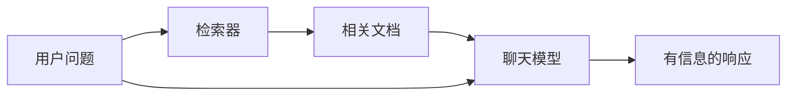
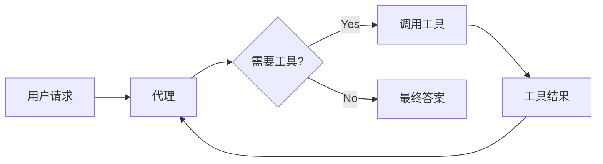
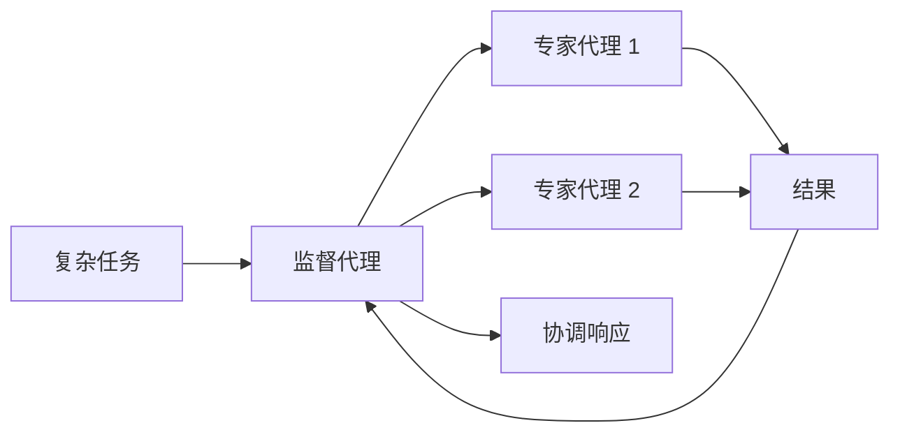

LangChain 的强大之处在于其组件如何协同工作以创建复杂的 AI 应用程序。本页面提供了展示不同组件之间关系的图表。

## 核心组件生态系统

下图展示了 LangChain 的主要组件如何连接以形成完整的 AI 应用程序：

```mermaid
graph TD
    %% 输入处理
    subgraph "📥 输入处理"
        A[文本输入] --> B[文档加载器]
        B --> C[文本分割器]
        C --> D[文档]
    end

    %% 嵌入与存储
    subgraph "🔧 嵌入与存储"
        D --> E[嵌入模型]
        E --> F[向量]
        F --> G[(向量存储)]
    end

    %% 检索
    subgraph "🔍 检索"
        H[用户查询] --> I[嵌入模型]
        I --> J[查询向量]
        J --> K[检索器]
        K --> G
        G --> L[相关上下文]
    end

    %% 生成
    subgraph "🤖 生成"
        M[聊天模型] --> N[工具]
        N --> O[工具结果]
        O --> M
        L --> M
        M --> P[AI 响应]
    end

    %% 编排
    subgraph "🎯 编排"
        Q[代理] --> M
        Q --> N
        Q --> K
        Q --> R[记忆]
```

### 如何连接组件

每个组件层都建立在前一层的基础上：

1. **输入处理** – 将原始数据转换为结构化文档
2. **嵌入与存储** – 将文本转换为可搜索的向量表示
3. **检索** – 基于用户查询找到相关信息
4. **生成** – 使用 AI 模型创建响应，可选地使用工具
5. **编排** – 通过代理和记忆系统协调一切

## 组件类别

LangChain 将组件分为以下主要类别：

| 类别                                                      | 目的          | 关键组件                 | 使用场景                 |
| --------------------------------------------------------- | ------------- | ------------------------ | ------------------------ |
| **[模型](/oss/python/langchain/models)**                  | AI 推理和生成 | 聊天模型、LLMs、嵌入模型 | 文本生成、推理、语义理解 |
| **[工具](/oss/python/langchain/tools)**                   | 外部能力      | API、数据库等            | 网络搜索、数据访问、计算 |
| **[代理](/oss/python/langchain/agents)**                  | 编排和推理    | ReAct 代理、工具调用代理 | 非确定性工作流、决策制定 |
| **[记忆](/oss/python/langchain/short-term-memory)**       | 上下文保存    | 消息历史、自定义状态     | 对话、状态化交互         |
| **[检索器](/oss/python/integrations/retrievers)**         | 信息访问      | 向量检索器、网络检索器   | RAG、知识库搜索          |
| **[文档处理](/oss/python/integrations/document_loaders)** | 数据摄入      | 加载器、分割器、转换器   | PDF 处理、网络爬虫       |
| **[向量存储](/oss/python/integrations/vectorstores)**     | 语义搜索      | Chroma、Pinecone、FAISS  | 相似性搜索、嵌入存储     |

## 常见模式

### RAG (检索增强生成)



### 代理与工具



### 多代理系统



## 学习更多

- [创建代理](/oss/python/langchain/agents)
- [使用工具](/oss/python/langchain/tools)
- [浏览集成](/oss/python/integrations/providers/overview)

---

<div className="source-links">
  <Callout icon="edit">
    [在 GitHub
    上编辑此页面](https://github.com/langchain-ai/docs/edit/main/src/oss/langchain/component-architecture.mdx)
    或 [提交问题](https://github.com/langchain-ai/docs/issues/new/choose).
  </Callout>
  <Callout icon="terminal-2">
    [连接这些文档](/use-these-docs) 到 Claude、VSCode 等通过 MCP 实时获取答案。
  </Callout>
</div>
