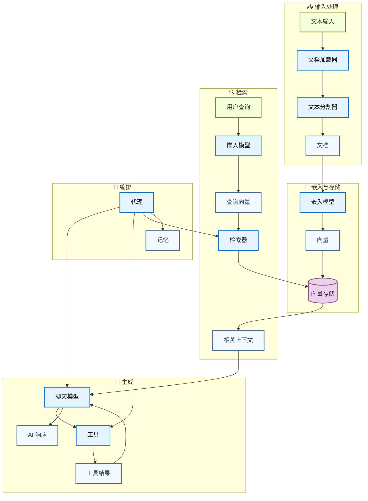
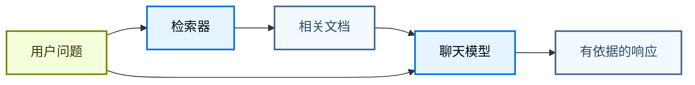
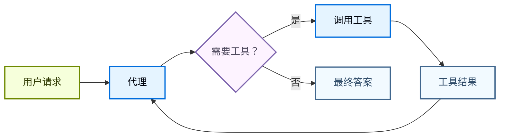
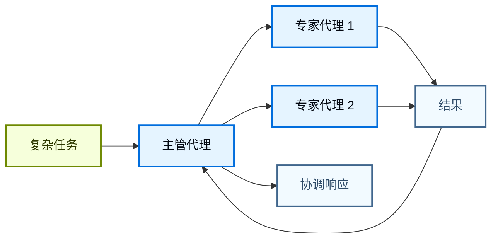

LangChain 的强大之处在于其组件如何协同工作以构建复杂的 AI 应用程序。本页提供图表，展示不同组件之间的关系。

## 核心组件生态系统

下图展示了 LangChain 的主要组件如何连接以形成完整的 AI 应用程序：

```mermaid
graph TD
    %% 输入处理
    subgraph "📥 输入处理"
        A[文本输入] --> B[文档加载器]
        B --> C[文本分割器]
        C --> D[文档]
    end

    %% 嵌入与存储
    subgraph "🔢 嵌入与存储"
        D --> E[嵌入模型]
        E --> F[向量]
        F --> G[(向量存储)]
    end

    %% 检索
    subgraph "🔍 检索"
        H[用户查询] --> I[嵌入模型]
        I --> J[查询向量]
        J --> K[检索器]
        K --> G
        G --> L[相关上下文]
    end

    %% 生成
    subgraph "🤖 生成"
        M[聊天模型] --> N[工具]
        N --> O[工具结果]
        O --> M
        L --> M
        M --> P[AI 响应]
    end

    %% 编排
    subgraph "🎯 编排"
        Q[代理] --> M
        Q --> N
        Q --> K
        Q --> R[记忆]
    end

    classDef trigger fill:#F6FFDB,stroke:#6E8900,stroke-width:2px,color:#2E3900
    classDef process fill:#E5F4FF,stroke:#006DDD,stroke-width:2px,color:#030710
    classDef output fill:#EBD0F0,stroke:#885270,stroke-width:2px,color:#441E33
    classDef neutral fill:#F2FAFF,stroke:#40668D,stroke-width:2px,color:#2F4B68

    class A,H trigger
    class B,C,E,I,K,M,N,Q process
    class D,F,J,L,O,P,R neutral
    class G output
```

### 组件如何连接

每个组件层都建立在前一层的基础上：

1. **输入处理** – 将原始数据转换为结构化文档
2. **嵌入与存储** – 将文本转换为可搜索的向量表示
3. **检索** – 根据用户查询查找相关信息
4. **生成** – 使用 AI 模型创建响应，可选择使用工具
5. **编排** – 通过代理和记忆系统协调一切

## 组件类别

LangChain 将组件组织为以下主要类别：

| 类别 | 用途 | 关键组件 | 用例 |
|------|------|----------|------|
| **[模型](/oss/python/langchain/models)** | AI 推理与生成 | 聊天模型、LLM、嵌入模型 | 文本生成、推理、语义理解 |
| **[工具](/oss/python/langchain/tools)** | 外部能力 | API、数据库等 | 网络搜索、数据访问、计算 |
| **[代理](/oss/python/langchain/agents)** | 编排与推理 | ReAct 代理、工具调用代理 | 非确定性工作流、决策制定 |
| **[记忆](/oss/python/langchain/short-term-memory)** | 上下文保存 | 消息历史、自定义状态 | 对话、有状态交互 |
| **[检索器](/oss/python/integrations/retrievers)** | 信息访问 | 向量检索器、网络检索器 | RAG、知识库搜索 |
| **[文档处理](/oss/python/integrations/document_loaders)** | 数据摄入 | 加载器、分割器、转换器 | PDF 处理、网络抓取 |
| **[向量存储](/oss/python/integrations/vectorstores)** | 语义搜索 | Chroma、Pinecone、FAISS | 相似性搜索、嵌入存储 |

## 常见模式

### RAG（检索增强生成）

```mermaid
graph LR
    A[用户问题] --> B[检索器]
    B --> C[相关文档]
    C --> D[聊天模型]
    A --> D
    D --> E[有依据的响应]

    classDef trigger fill:#F6FFDB,stroke:#6E8900,stroke-width:2px,color:#2E3900
    classDef process fill:#E5F4FF,stroke:#006DDD,stroke-width:2px,color:#030710
    classDef neutral fill:#F2FAFF,stroke:#40668D,stroke-width:2px,color:#2F4B68

    class A trigger
    class B,D process
    class C,E neutral
```

### 使用工具的代理

```mermaid
graph LR
    A[用户请求] --> B[代理]
    B --> C{需要工具？}
    C -->|是| D[调用工具]
    D --> E[工具结果]
    E --> B
    C -->|否| F[最终答案]

    classDef trigger fill:#F6FFDB,stroke:#6E8900,stroke-width:2px,color:#2E3900
    classDef process fill:#E5F4FF,stroke:#006DDD,stroke-width:2px,color:#030710
    classDef decision fill:#FDF3FF,stroke:#7E65AE,stroke-width:2px,color:#504B5F
    classDef neutral fill:#F2FAFF,stroke:#40668D,stroke-width:2px,color:#2F4B68

    class A trigger
    class B,D process
    class C decision
    class E,F neutral
```

### 多代理系统

```mermaid
graph LR
    A[复杂任务] --> B[主管代理]
    B --> C[专家代理 1]
    B --> D[专家代理 2]
    C --> E[结果]
    D --> E
    E --> B
    B --> F[协调响应]

    classDef trigger fill:#F6FFDB,stroke:#6E8900,stroke-width:2px,color:#2E3900
    classDef process fill:#E5F4FF,stroke:#006DDD,stroke-width:2px,color:#030710
    classDef neutral fill:#F2FAFF,stroke:#40668D,stroke-width:2px,color:#2F4B68

    class A trigger
    class B,C,D process
    class E,F neutral
```

## 了解更多

- [创建代理](/oss/python/langchain/agents)
- [使用工具](/oss/python/langchain/tools)
- [浏览集成](/oss/python/integrations/providers/overview)

---

<Callout icon="terminal-2">
    [将这些文档连接](/use-these-docs)到 Claude、VSCode 等，通过 MCP 获取实时答案。
</Callout>
<Callout icon="edit">
    [在 GitHub 上编辑此页面](https://github.com/langchain-ai/docs/edit/main/src/oss/langchain/component-architecture.mdx) 或 [提交问题](https://github.com/langchain-ai/docs/issues/new/choose)。
</Callout>

