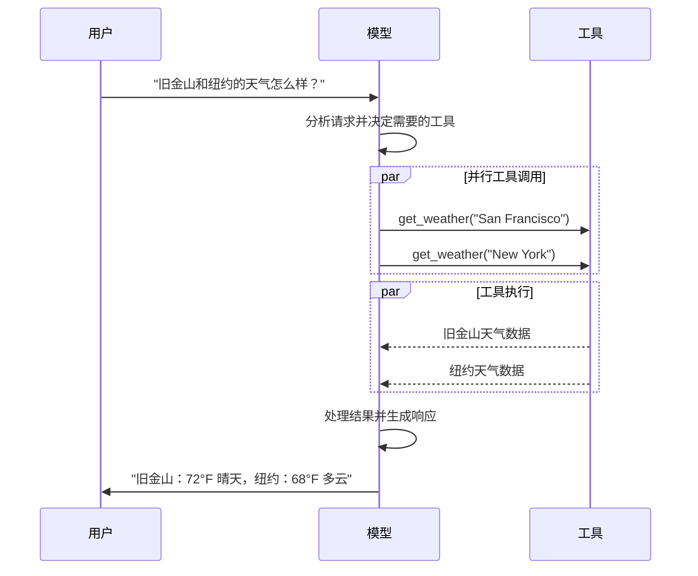

import ChatModelTabsPy from '/snippets/chat-model-tabs.mdx';
import ChatModelTabsJS from '/snippets/chat-model-tabs-js.mdx';

[LLMs](https://en.wikipedia.org/wiki/Large_language_model) 是强大的 AI 工具，可以像人类一样解释和生成文本。它们用途广泛，可以撰写内容、翻译语言、总结和回答问题，而无需为每个任务进行专门的训练。

除了文本生成，许多模型还支持：

* <Icon icon="hammer" size={16} /> [工具调用](#tool-calling) - 调用外部工具（如数据库查询或 API 调用）并在其响应中使用结果。
* <Icon icon="layout-grid" size={16} /> [结构化输出](#structured-output) - 模型的响应被约束为遵循定义的格式。
* <Icon icon="photo" size={16} /> [多模态](#multimodal) - 处理和返回文本以外的数据，如图像、音频和视频。
* <Icon icon="brain" size={16} /> [推理](#reasoning) - 模型执行多步推理以得出结论。

模型是[智能体](/oss/python/langchain/agents)的推理引擎。它们驱动智能体的决策过程，决定调用哪些工具、如何解释结果以及何时提供最终答案。

您选择的模型的质量和能力直接影响智能体的基线可靠性和性能。不同的模型擅长不同的任务——有些更擅长遵循复杂的指令，有些更擅长结构化推理，有些则支持更大的上下文窗口以处理更多信息。

LangChain 的标准模型接口让您能够访问许多不同的提供商集成，这使得轻松试验和切换模型以找到最适合您用例的模型变得容易。

<Info>
    有关特定提供商的集成信息和功能，请参阅提供商的[聊天模型页面](/oss/python/integrations/chat)。
</Info>

## 基本用法

模型可以通过两种方式使用：

1. **与智能体一起使用** - 在创建[智能体](/oss/python/langchain/agents#model)时可以动态指定模型。
2. **独立使用** - 可以直接调用模型（在智能体循环之外），用于文本生成、分类或提取等任务，而无需智能体框架。

相同的模型接口在两种上下文中都有效，这为您提供了灵活性，可以从简单开始，并根据需要扩展到更复杂的基于智能体的工作流。

### 初始化模型

在 LangChain 中开始使用独立模型的最简单方法是使用 [`init_chat_model`](https://reference.langchain.com/python/langchain/chat_models/base/init_chat_model) 从您选择的聊天模型提供商初始化一个模型（示例如下）：

<ChatModelTabsPy />
```python
response = model.invoke("为什么鹦鹉会说话？")
```

有关更多详细信息，包括如何传递模型[参数](#parameters)的信息，请参阅 [`init_chat_model`](https://reference.langchain.com/python/langchain/chat_models/base/init_chat_model)。

### 支持的提供商和模型

LangChain 通过专用的集成包支持所有主要的模型提供商。每个提供商包都实现了相同的标准接口，因此您可以在不重写应用程序逻辑的情况下交换提供商。新的模型名称可以立即使用——无需更新 LangChain——因为提供商包会将模型名称直接传递给提供商的 API。

浏览[支持的提供商完整列表](/oss/python/integrations/providers/overview)，或参阅[提供商和模型](/oss/python/concepts/providers-and-models)以了解提供商、包和模型名称在 LangChain 中如何协同工作的概念概述。

### 关键方法

<Card title="调用 (Invoke)" href="#invoke" icon="send" arrow="true" horizontal>
    模型将消息作为输入，并在生成完整响应后输出消息。
</Card>
<Card title="流式处理 (Stream)" href="#stream" icon="broadcast" arrow="true" horizontal>
    调用模型，但实时流式传输生成的输出。
</Card>
<Card title="批处理 (Batch)" href="#batch" icon="grip-vertical" arrow="true" horizontal>
    向模型批量发送多个请求以实现更高效的处理。
</Info>

<Info>
    除了聊天模型，LangChain 还提供对其他相邻技术的支持，例如嵌入模型和向量存储。有关详细信息，请参阅[集成页面](/oss/python/integrations/providers/overview)。
</Info>

## 参数

聊天模型接受可用于配置其行为的参数。支持的完整参数集因模型和提供商而异，但标准参数包括：

<ParamField body="model" type="string" required>
   您希望与提供商一起使用的特定模型的名称或标识符。您也可以使用 '{model_provider}:{model}' 格式在单个参数中同时指定模型及其提供商，例如 'openai:o1'。
</ParamField>

<ParamField body="api_key" type="string">
    用于向模型提供商进行身份验证所需的密钥。这通常在您注册访问模型时颁发。通常通过设置<Tooltip tip="一个值在程序外部设置的变量，通常通过操作系统或微服务内置的功能设置。">环境变量</Tooltip>来访问。
</ParamField>

<ParamField body="temperature" type="number">
    控制模型输出的随机性。数字越高，响应越有创意；数字越低，响应越确定。
</ParamField>

<ParamField body="max_tokens" type="number">
    限制响应中<Tooltip tip="模型读取和生成的基本单位。提供商可能以不同方式定义它们，但通常可以表示整个单词或部分单词。">令牌</Tooltip>的总数，从而有效控制输出的长度。
</ParamField>

<ParamField body="timeout" type="number">
    在取消请求之前等待模型响应的最长时间（以秒为单位）。
</ParamField>

<ParamField body="max_retries" type="number" default="6">
    如果请求因网络超时或速率限制等问题失败，系统将尝试重新发送请求的最大次数。重试使用带有抖动的指数退避。网络错误、速率限制 (429) 和服务器错误 (5xx) 会自动重试。客户端错误（如 401（未授权）或 404）不会重试。对于不可靠网络上的长时间运行的[智能体](/oss/python/deepagents/overview)任务，建议将此值增加到 10-15。
</ParamField>

使用 [`init_chat_model`](https://reference.langchain.com/python/langchain/chat_models/base/init_chat_model)，将这些参数作为内联<Tooltip tip="任意关键字参数" cta="了解更多" href="https://www.w3schools.com/python/python_args_kwargs.asp">`**kwargs`</Tooltip>传递：

```python 使用模型参数初始化
model = init_chat_model(
    "claude-sonnet-4-6",
    # 传递给模型的 Kwargs：
    temperature=0.7,
    timeout=30,
    max_tokens=1000,
    max_retries=6,  # 默认值；对于不可靠网络请增加
)
```

<Info>
    每个聊天模型集成可能有额外的参数用于控制特定于提供商的功能。

    例如，[`ChatOpenAI`](https://reference.langchain.com/python/langchain-openai/chat_models/base/ChatOpenAI) 有 `use_responses_api` 来决定是使用 OpenAI Responses API 还是 Completions API。

    要查找给定聊天模型支持的所有参数，请访问[聊天模型集成](/oss/python/integrations/chat)页面。
</Info>

---

## 调用

必须调用聊天模型才能生成输出。有三种主要的调用方法，每种方法适用于不同的用例。

### 调用 (Invoke)

调用模型最直接的方法是使用 [`invoke()`](https://reference.langchain.com/python/langchain-core/language_models/chat_models/BaseChatModel/invoke) 传递单个消息或消息列表。

```python 单条消息
response = model.invoke("为什么鹦鹉有彩色的羽毛？")
print(response)
```

可以向聊天模型提供消息列表以表示对话历史。每条消息都有一个角色，模型使用该角色来指示对话中谁发送了消息。

有关角色、类型和内容的更多详细信息，请参阅[消息](/oss/python/langchain/messages)指南。

```python 字典格式
conversation = [
    {"role": "system", "content": "您是一个将英语翻译成法语的有用助手。"},
    {"role": "user", "content": "翻译：我喜欢编程。"},
    {"role": "assistant", "content": "J'adore la programmation."},
    {"role": "user", "content": "翻译：我喜欢构建应用程序。"}
]

response = model.invoke(conversation)
print(response)  # AIMessage("J'adore créer des applications.")
```
```python 消息对象
from langchain.messages import HumanMessage, AIMessage, SystemMessage

conversation = [
    SystemMessage("您是一个将英语翻译成法语的有用助手。"),
    HumanMessage("翻译：我喜欢编程。"),
    AIMessage("J'adore la programmation."),
    HumanMessage("翻译：我喜欢构建应用程序。")
]

response = model.invoke(conversation)
print(response)  # AIMessage("J'adore créer des applications.")
```

<Info>
    如果您的调用返回类型是字符串，请确保您使用的是聊天模型而不是 LLM。传统的文本完成 LLM 会直接返回字符串。LangChain 聊天模型以 "Chat" 为前缀，例如 [`ChatOpenAI`](https://reference.langchain.com/python/langchain-openai/chat_models/base/ChatOpenAI)(/oss/integrations/chat/openai)。
</Info>

### 流式处理 (Stream)

大多数模型可以在生成时流式传输其输出内容。通过逐步显示输出，流式处理显著改善了用户体验，特别是对于较长的响应。

调用 [`stream()`](https://reference.langchain.com/python/langchain-core/language_models/chat_models/BaseChatModel/stream) 返回一个<Tooltip tip="一个对象，按顺序逐步提供对集合中每个项目的访问。">迭代器</Tooltip>，该迭代器在生成时产生输出块。您可以使用循环实时处理每个块：

<CodeGroup>
    ```python 基本文本流式处理
    for chunk in model.stream("为什么鹦鹉有彩色的羽毛？"):
        print(chunk.text, end="|", flush=True)
    ```

    ```python 流式处理工具调用、推理和其他内容
    for chunk in model.stream("天空是什么颜色？"):
        for block in chunk.content_blocks:
            if block["type"] == "reasoning" and (reasoning := block.get("reasoning")):
                print(f"推理: {reasoning}")
            elif block["type"] == "tool_call_chunk":
                print(f"工具调用块: {block}")
            elif block["type"] == "text":
                print(block["text"])
            else:
                ...
    ```
</CodeGroup>

与 [`invoke()`](#invoke) 在模型完成生成完整响应后返回单个 [`AIMessage`](https://reference.langchain.com/python/langchain-core/messages/ai/AIMessage) 不同，`stream()` 返回多个 [`AIMessageChunk`](https://reference.langchain.com/python/langchain-core/messages/ai/AIMessageChunk) 对象，每个对象包含部分输出文本。重要的是，流中的每个块都设计为通过求和收集到完整消息中：

```python 构建 AIMessage
full = None  # None | AIMessageChunk
for chunk in model.stream("天空是什么颜色？"):
    full = chunk if full is None else full + chunk
    print(full.text)

# 天空
# 天空是
# 天空通常是
# 天空通常是蓝色
# ...

print(full.content_blocks)
# [{"type": "text", "text": "天空通常是蓝色..."}]
```

生成的消息可以与使用 [`invoke()`](#invoke) 生成的消息相同对待——例如，它可以聚合到消息历史中并作为对话上下文传回模型。

<Warning>
    流式处理仅在程序的所有步骤都知道如何处理块流时才有效。例如，一个不具备流式处理能力的应用程序需要在内存中存储整个输出才能进行处理。
</Warning>

<Accordion title="高级流式处理主题">
    <Accordion title="流式处理事件">
        LangChain 聊天模型还可以使用 `astream_events()` 流式传输语义事件。

        这简化了基于事件类型和其他元数据的过滤，并将在后台聚合完整消息。下面是一个示例。

        ```python
        async for event in model.astream_events("Hello"):

            if event["event"] == "on_chat_model_start":
                print(f"输入: {event['data']['input']}")

            elif event["event"] == "on_chat_model_stream":
                print(f"令牌: {event['data']['chunk'].text}")

            elif event["event"] == "on_chat_model_end":
                print(f"完整消息: {event['data']['output'].text}")

            else:
                pass
        ```
        ```txt
        输入: Hello
        令牌: Hi
        令牌:  there
        令牌: !
        令牌:  How
        令牌:  can
        令牌:  I
        ...
        完整消息: Hi there! How can I help today?
        ```

        <Tip>
            有关事件类型和其他详细信息，请参阅 [`astream_events()`](https://reference.langchain.com/python/langchain_core/language_models/#langchain_core.language_models.chat_models.BaseChatModel.astream_events) 参考。
        </Tip>

    </Accordion>
    <Accordion title="“自动流式处理”聊天模型">
        LangChain 通过在某些情况下自动启用流式处理模式来简化从聊天模型的流式处理，即使您没有显式调用流式处理方法。当您使用非流式调用方法但仍希望流式传输整个应用程序（包括来自聊天模型的中间结果）时，这尤其有用。

        在 [LangGraph 智能体](/oss/python/langchain/agents) 中，例如，您可以在节点内调用 `model.invoke()`，但如果在流式处理模式下运行，LangChain 会自动委托给流式处理。

        #### 工作原理

        当您 `invoke()` 一个聊天模型时，如果 LangChain 检测到您正在尝试流式传输整个应用程序，它会自动切换到内部流式处理模式。调用的结果对于使用 invoke 的代码来说是相同的；但是，当聊天模型被流式处理时，LangChain 会负责在 LangChain 的回调系统中调用 [`on_llm_new_token`](https://reference.langchain.com/python/langchain-core/callbacks/base/AsyncCallbackHandler/on_llm_new_token) 事件。

        回调事件允许 LangGraph `stream()` 和 `astream_events()` 实时显示聊天模型的输出。

    </Accordion>
</Accordion>

### 批处理 (Batch)

将独立请求的集合批量发送到模型可以显著提高性能并降低成本，因为处理可以并行完成：

```python 批处理
responses = model.batch([
    "为什么鹦鹉有彩色的羽毛？",
    "飞机如何飞行？",
    "什么是量子计算？"
])
for response in responses:
    print(response)
```

<Note>
    本节描述聊天模型方法 [`batch()`](https://reference.langchain.com/python/langchain_core/language_models/#langchain_core.language_models.chat_models.BaseChatModel.batch)，它在客户端并行化模型调用。

    它与推理提供商支持的批处理 API（如 [OpenAI](https://platform.openai.com/docs/guides/batch) 或 [Anthropic](https://platform.claude.com/docs/en/build-with-claude/batch-processing#message-batches-api)）**不同**。
</Note>

默认情况下，[`batch()`](https://reference.langchain.com/python/langchain_core/language_models/#langchain_core.language_models.chat_models.BaseChatModel.batch) 仅返回整个批处理的最终输出。如果您希望在每个输入完成生成时接收其输出，可以使用 [`batch_as_completed()`](https://reference.langchain.com/python/langchain_core/language_models/#langchain_core.language_models.chat_models.BaseChatModel.batch_as_completed) 流式传输结果：

```python 在完成时产生批处理响应
for response in model.batch_as_completed([
    "为什么鹦鹉有彩色的羽毛？",
    "飞机如何飞行？",
    "什么是量子计算？"
]):
    print(response)
```
<Note>
    使用 [`batch_as_completed()`](https://reference.langchain.com/python/langchain_core/language_models/#langchain_core.language_models.chat_models.BaseChatModel.batch_as_completed) 时，结果可能按非顺序到达。每个结果都包含输入索引，以便在需要时匹配以重建原始顺序。
</Note>

<Tip>
    使用 [`batch()`](https://reference.langchain.com/python/langchain_core/language_models/#langchain_core.language_models.chat_models.BaseChatModel.batch) 或 [`batch_as_completed()`](https://reference.langchain.com/python/langchain_core/language_models/#langchain_core.language_models.chat_models.BaseChatModel.batch_as_completed) 处理大量输入时，您可能希望控制最大并行调用数。这可以通过在 [`RunnableConfig`](https://reference.langchain.com/python/langchain-core/runnables/config/RunnableConfig) 字典中设置 [`max_concurrency`](https://reference.langchain.com/python/langchain-core/runnables/config/RunnableConfig) 属性来完成。

    ```python 具有最大并发性的批处理
    model.batch(
        list_of_inputs,
        config={
            'max_concurrency': 5,  # 限制为 5 个并行调用
        }
    )
    ```

    有关支持的属性的完整列表，请参阅 [`RunnableConfig`](https://reference.langchain.com/python/langchain-core/runnables/config/RunnableConfig) 参考。
</Tip>

有关批处理的更多详细信息，请参阅[参考](https://reference.langchain.com/python/langchain_core/language_models/#langchain_core.language_models.chat_models.BaseChatModel.batch)。

---

## 工具调用

模型可以请求调用执行任务的工具，例如从数据库获取数据、搜索网络或运行代码。工具是以下内容的配对：

1. 一个模式，包括工具的名称、描述和/或参数定义（通常是 JSON 模式）
2. 一个函数或<Tooltip tip="一种可以暂停执行并在以后恢复的方法">协程</Tooltip>来执行。

<Note>
    您可能会听到“函数调用”这个术语。我们将其与“工具调用”互换使用。
</Note>

以下是用户和模型之间的基本工具调用流程：



要使您定义的工具可供模型使用，必须使用 [`bind_tools`](https://reference.langchain.com/python/langchain-core/language_models/chat_models/BaseChatModel/bind_tools) 将它们绑定。在后续调用中，模型可以根据需要选择调用任何绑定的工具。

一些模型提供商提供<Tooltip tip="在服务器端执行的工具，例如网络搜索和代码解释器">内置工具</Tooltip>，可以通过模型或调用参数启用（例如 [`ChatOpenAI`](/oss/python/integrations/chat/openai), [`ChatAnthropic`](/oss/python/integrations/chat/anthropic)）。有关详细信息，请检查相应的[提供商参考](/oss/python/integrations/providers/overview)。

<Tip>
    有关创建工具的详细信息和其他选项，请参阅[工具指南](/oss/python/langchain/tools)。
</Tip>

```python 绑定用户工具
from langchain.tools import tool

@tool
def get_weather(location: str) -> str:
    """获取某个位置的天气。"""
    return f"It's sunny in {location}."


model_with_tools = model.bind_tools([get_weather])  # [!code highlight]

response = model_with_tools.invoke("波士顿的天气怎么样？")
for tool_call in response.tool_calls:
    # 查看模型进行的工具调用
    print(f"工具: {tool_call['name']}")
    print(f"参数: {tool_call['args']}")
```

当绑定用户定义的工具时，模型的响应包含一个执行工具的**请求**。当在[智能体](/oss/python/langchain/agents)之外单独使用模型时，由您来执行请求的工具并将结果返回给模型以供后续推理使用。当使用[智能体](/oss/python/langchain/agents)时，智能体循环将为您处理工具执行循环。

下面，我们展示了一些使用工具调用的常见方法。

<AccordionGroup>
    <Accordion title="工具执行循环" icon="refresh">
        当模型返回工具调用时，您需要执行工具并将结果传回模型。这会创建一个对话循环，模型可以使用工具结果来生成其最终响应。LangChain 包括处理此编排的[智能体](/oss/python/langchain/agents)抽象。

        以下是如何执行此操作的简单示例：

        ```python 工具执行循环
        # 将（可能多个）工具绑定到模型
        model_with_tools = model.bind_tools([get_weather])

        # 步骤 1：模型生成工具调用
        messages = [{"role": "user", "content": "波士顿的天气怎么样？"}]
        ai_msg = model_with_tools.invoke(messages)
        messages.append(ai_msg)

        # 步骤 2：执行工具并收集结果
        for tool_call in ai_msg.tool_calls:
            # 使用生成的参数执行工具
            tool_result = get_weather.invoke(tool_call)
            messages.append(tool_result)

        # 步骤 3：将结果传回模型以获取最终响应
        final_response = model_with_tools.invoke(messages)
        print(final_response.text)
        # "波士顿当前天气为 72°F 且晴朗。"
        ```

        工具返回的每个 [`ToolMessage`](https://reference.langchain.com/python/langchain-core/messages/tool/ToolMessage) 都包含一个 `tool_call_id`，该 ID 与原始工具调用匹配，帮助模型将结果与请求关联起来。
    </Accordion>
    <Accordion title="强制工具调用" icon="asterisk">
        默认情况下，模型可以自由选择使用哪个绑定工具，具体取决于用户的输入。但是，您可能希望强制选择一个工具，确保模型使用特定工具或给定列表中的**任何**工具：

        <CodeGroup>
            ```python 强制使用任何工具
            model_with_tools = model.bind_tools([tool_1], tool_choice="any")
            ```
            ```python 强制使用特定工具
            model_with_tools = model.bind_tools([tool_1], tool_choice="tool_1")
            ```
        </CodeGroup>

    </Accordion>
    <Accordion title="并行工具调用" icon="stack-2">
        许多模型支持在适当时并行调用多个工具。这允许模型同时从不同来源收集信息。

        ```python 并行工具调用
        model_with_tools = model.bind_tools([get_weather])

        response = model_with_tools.invoke(
            "波士顿和东京的天气怎么样？"
        )


        # 模型可能生成多个工具调用
        print(response.tool_calls)
        # [
        #   {'name': 'get_weather', 'args': {'location': 'Boston'}, 'id': 'call_1'},
        #   {'name': 'get_weather', 'args': {'location': 'Tokyo'}, 'id': 'call_2'},
        # ]


        # 执行所有工具（可以使用异步并行完成）
        results = []
        for tool_call in response.tool_calls:
            if tool_call['name'] == 'get_weather':
                result = get_weather.invoke(tool_call)
            ...
            results.append(result)
        ```

        模型会根据请求操作的独立性智能地确定何时适合并行执行。

        <Tip>
        大多数支持工具调用的模型默认启用并行工具调用。有些（包括 [OpenAI](/oss/python/integrations/chat/openai) 和 [Anthropic](/oss/python/integrations/chat/anthropic)）允许您禁用此功能。为此，请设置 `parallel_tool_calls=False`：
        ```python
        model.bind_tools([get_weather], parallel_tool_calls=False)
        ```
        </Tip>
    </Accordion>
    <Accordion title="流式工具调用" icon="rss">
        在流式传输响应时，工具调用通过 [`ToolCallChunk`](https://reference.langchain.com/python/langchain-core/messages/tool/ToolCallChunk) 逐步构建。这允许您在工具调用生成时查看它们，而不是等待完整的响应。

        ```python 流式工具调用
        for chunk in model_with_tools.stream(
            "波士顿和东京的天气怎么样？"
        ):
            # 工具调用块逐步到达
            for tool_chunk in chunk.tool_call_chunks:
                if name := tool_chunk.get("name"):
                    print(f"工具: {name}")
                if id_ := tool_chunk.get("id"):
                    print(f"ID: {id_}")
                if args := tool_chunk.get("args"):
                    print(f"参数: {args}")

        # 输出:
        # 工具: get_weather
        # ID: call_SvMlU1TVIZugrFLckFE2ceRE
        # 参数: {"lo
        # 参数: catio
        # 参数: n": "B
        # 参数: osto
        # 参数: n"}
        # 工具: get_weather
        # ID: call_QMZdy6qInx13oWKE7KhuhOLR
        # 参数: {"lo
        # 参数: catio
        # 参数: n": "T
        # 参数: okyo
        # 参数: "}
        ```

        您可以累积块以构建完整的工具调用：

        ```python 累积工具调用
        gathered = None
        for chunk in model_with_tools.stream("波士顿的天气怎么样？"):
            gathered = chunk if gathered is None else gathered + chunk
            print(gathered.tool_calls)
        ```

    </Accordion>
</AccordionGroup>

---

## 结构化输出

可以请求模型以匹配给定模式的格式提供其响应。这对于确保输出易于解析并在后续处理中使用非常有用。LangChain 支持多种模式类型和强制结构化输出的方法。

<Tip>
    要了解结构化输出，请参阅[结构化输出](/oss/python/langchain/structured-output)。
</Tip>

<Tabs>
    <Tab title="Pydantic">
        [Pydantic 模型](https://docs.pydantic.dev/latest/concepts/models/#basic-model-usage) 提供了最丰富的功能集，包括字段验证、描述和嵌套结构。

        ```python
        from pydantic import BaseModel, Field

        class Movie(BaseModel):
            """一部包含详细信息的电影。"""
            title: str = Field(description="电影标题")
            year: int = Field(description="电影发行年份")
            director: str = Field(description="电影导演")
            rating: float = Field(description="电影评分（满分10分）")

        model_with_structure = model.with_structured_output(Movie)
        response = model_with_structure.invoke("提供电影《盗梦空间》的详细信息")
        print(response)  # Movie(title="Inception", year=2010, director="Christopher Nolan", rating=8.8)
        ```
    </Tab>
    <Tab title="TypedDict">
        Python 的 `TypedDict` 提供了比 Pydantic 模型更简单的替代方案，当您不需要运行时验证时非常理想。

        ```python
        from typing_extensions import TypedDict, Annotated

        class MovieDict(TypedDict):
            """一部包含详细信息的电影。"""
            title: Annotated[str, ..., "电影标题"]
            year: Annotated[int, ..., "电影发行年份"]
            director: Annotated[str, ..., "电影导演"]
            rating: Annotated[float, ..., "电影评分（满分10分）"]

        model_with_structure = model.with_structured_output(MovieDict)
        response = model_with_structure.invoke("提供电影《盗梦空间》的详细信息")
        print(response)  # {'title': 'Inception', 'year': 2010, 'director': 'Christopher Nolan', 'rating': 8.8}
        ```
    </Tab>
    <Tab title="JSON 模式">
        提供 [JSON 模式](https://json-schema.org/understanding-json-schema/about) 以获得最大控制和互操作性。

        ```python
        import json

        json_schema = {
            "title": "Movie",
            "description": "一部包含详细信息的电影",
            "type": "object",
            "properties": {
                "title": {
                    "type": "string",
                    "description": "电影标题"
                },
                "year": {
                    "type": "integer",
                    "description": "电影发行年份"
                },
                "director": {
                    "type": "string",
                    "description": "电影导演"
                },
                "rating": {
                    "type": "number",
                    "description": "电影评分（满分10分）"
                }
            },
            "required": ["title", "year", "director", "rating"]
        }

        model_with_structure = model.with_structured_output(
            json_schema,
            method="json_schema",
        )
        response = model_with_structure.invoke("提供电影《盗梦空间》的详细信息")
        print(response)  # {'title': 'Inception', 'year': 2010, ...}
        ```
    </Tab>
</Tabs>

<Note>
    **结构化输出的关键注意事项**

    - **方法参数**：一些提供商支持不同的结构化输出方法：
        - `'json_schema'`：使用提供商提供的专用结构化输出功能。
        - `'function_calling'`：通过强制遵循给定模式的[工具调用](#tool-calling)来派生结构化输出。
        - `'json_mode'`：某些提供商提供的 `'json_schema'` 的前身。生成有效的 JSON，但模式必须在提示中描述。
    - **包含原始消息**：设置 `include_raw=True` 以获取解析后的输出和原始 AI 消息。
    - **验证**：Pydantic 模型提供自动验证。`TypedDict` 和 JSON 模式需要手动验证。

    有关支持的方法和配置选项，请参阅您的[提供商集成页面](/oss/python/integrations/providers/overview)。
</Note>

<Accordion title="示例：消息输出与解析结构一起返回">

    返回原始 [`AIMessage`](https://reference.langchain.com/python/langchain-core/messages/ai/AIMessage) 对象以及解析后的表示形式可能很有用，以便访问响应元数据，例如[令牌计数](#token-usage)。为此，在调用 [`with_structured_output`](https://reference.langchain.com/python/langchain-core/language_models/chat_models/BaseChatModel/with_structured_output) 时设置 [`include_raw=True`](https://reference.langchain.com/python/langchain-core/language_models/chat_models/BaseChatModel/with_structured_output)：

    ```python
    from pydantic import BaseModel, Field

    class Movie(BaseModel):
        """一部包含详细信息的电影。"""
        title: str = Field(description="电影标题")
        year: int = Field(description="电影发行年份")
        director: str = Field(description="电影导演")
        rating: float = Field(description="电影评分（满分10分）")

    model_with_structure = model.with_structured_output(Movie, include_raw=True)  # [!code highlight]
    response = model_with_structure.invoke("提供电影《盗梦空间》的详细信息")
    response
    # {
    #     "raw": AIMessage(...),
    #     "parsed": Movie(title=..., year=..., ...),
    #     "parsing_error": None,
    # }
    ```

</Accordion>
<Accordion title="示例：嵌套结构">
    模式可以嵌套：
    <CodeGroup>
        ```python Pydantic BaseModel
        from pydantic import BaseModel, Field

        class Actor(BaseModel):
            name: str
            role: str

        class MovieDetails(BaseModel):
            title: str
            year: int
            cast: list[Actor]
            genres: list[str]
            budget: float | None = Field(None, description="预算（百万美元）")

        model_with_structure = model.with_structured_output(MovieDetails)
        ```

        ```python TypedDict
        from typing_extensions import Annotated, TypedDict

        class Actor(TypedDict):
            name: str
            role: str

        class MovieDetails(TypedDict):
            title: str
            year: int
            cast: list[Actor]
            genres: list[str]
            budget: Annotated[float | None, ..., "预算（百万美元）"]

        model_with_structure = model.with_structured_output(MovieDetails)
        ```
    </CodeGroup>

</Accordion>

---

## 高级主题

### 模型配置文件

<Info>
    模型配置文件需要 `langchain>=1.1`。
</Info>

LangChain 聊天模型可以通过 `profile` 属性公开支持的功能和能力的字典：

```python
model.profile
# {
#   "max_input_tokens": 400000,
#   "image_inputs": True,
#   "reasoning_output": True,
#   "tool_calling": True,
#   ...
# }
```

有关字段的完整列表，请参阅 [API 参考](https://reference.langchain.com/python/langchain-core/language_models/model_profile/ModelProfile)。

大部分模型配置文件数据由 [models.dev](https://github.com/sst/models.dev) 项目提供，这是一个提供模型能力数据的开源计划。这些数据通过额外的字段进行了增强，以便与 LangChain 一起使用。这些增强功能会随着上游项目的演变而保持一致。

模型配置文件数据允许应用程序动态地处理模型能力。例如：

1. [摘要中间件](/oss/python/langchain/middleware/built-in#summarization) 可以根据模型的上下文窗口大小触发摘要。
2. `create_agent` 中的[结构化输出](/oss/python/langchain/structured-output) 策略可以自动推断（例如，通过检查对原生结构化输出功能的支持）。
3. 模型输入可以根据支持的[模态](#multimodal)和最大输入令牌数进行限制。
4. [Deep Agents CLI](/oss/python/deepagents/cli) 过滤[交互式模型切换器](/oss/python/deepagents/cli/providers#which-models-appear-in-the-switcher) 以显示其配置文件报告支持 `tool_calling` 和文本 I/O 的模型，并在选择器详细视图中显示上下文窗口大小和能力标志。

<Accordion title="更新或覆盖配置文件数据">
    如果模型配置文件数据缺失、过时或不正确，可以进行更改。

    **选项 1（快速修复）**

    您可以使用任何有效的配置文件实例化聊天模型：

    ```python
    custom_profile = {
        "max_input_tokens": 100_000,
        "tool_calling": True,
        "structured_output": True,
        # ...
    }
    model = init_chat_model("...", profile=custom_profile)
    ```

    `profile` 也是一个常规的 `dict`，可以就地更新。如果模型实例是共享的，请考虑使用 `model_copy` 以避免改变共享状态。

    ```python
    new_profile = model.profile | {"key": "value"}
    model.model_copy(update={"profile": new_profile})
    ```

    **选项 2（修复上游数据）**

    数据的主要来源是 [models.dev](https://models.dev/) 项目。这些数据与 LangChain [集成包](/oss/python/integrations/providers/overview) 中的额外字段和覆盖项合并，并随这些包一起发布。

    模型配置文件数据可以通过以下过程更新：

    1. （如果需要）通过向其 [GitHub 仓库](https://github.com/sst/models.dev) 提交拉取请求，在 [models.dev](https://models.dev/) 更新源数据。
    2. （如果需要）通过向 LangChain [集成包](/oss/python/integrations/providers/overview) 提交拉取请求，在 `langchain_<package>/data/profile_augmentations.toml` 中更新额外字段和覆盖项。
    3. 使用 [`langchain-model-profiles`](https://pypi.org/project/langchain-model-profiles/) CLI 工具从 [models.dev](https://models.dev/) 拉取最新数据，合并增强项并更新配置文件数据：

    ```bash
    pip install langchain-model-profiles
    ```

    ```bash
    langchain-profiles refresh --provider <provider> --data-dir <data_dir>
    ```

    此命令：
    - 从 models.dev 下载 `<provider>` 的最新数据
    - 合并来自 `<data_dir>` 中 `profile_augmentations.toml` 的增强项
    - 将合并后的配置文件写入 `<data_dir>` 中的 `profiles.py`

    例如：从 [LangChain 单一仓库](https://github.com/langchain-ai/langchain) 中的 [`libs/partners/anthropic`](https://github.com/langchain-ai/langchain/tree/master/libs/partners/anthropic)：

    ```bash
    uv run --with langchain-model-profiles --provider anthropic --data-dir langchain_anthropic/data
    ```
</Accordion>

<Warning>
    模型配置文件是测试版功能。配置文件的格式可能会发生变化。
</Warning>

### 多模态

某些模型可以处理和返回非文本数据，如图像、音频和视频。您可以通过提供[内容块](/oss/python/langchain/messages#message-content)将非文本数据传递给模型。

<Tip>
    所有具有底层多模态功能的 LangChain 聊天模型都支持：

    1. 跨提供商标准格式的数据（请参阅[我们的消息指南](/oss/python/langchain/messages)）
    2. OpenAI [聊天补全](https://platform.openai.com/docs/api-reference/chat) 格式
    3. 特定于该提供商的任何原生格式（例如，Anthropic 模型接受 Anthropic 原生格式）
</Tip>

有关详细信息，请参阅消息指南的[多模态部分](/oss/python/langchain/messages#multimodal)。

<Tooltip tip="并非所有 LLM 都是平等的！" cta="参见参考" href="https://models.dev/">某些模型</Tooltip> 可以在其响应中返回多模态数据。如果调用这样做，生成的 [`AIMessage`](https://reference.langchain.com/python/langchain-core/messages/ai/AIMessage) 将包含具有多模态类型的内容块。

```python 多模态输出
response = model.invoke("创建一张猫的图片")
print(response.content_blocks)
# [
#     {"type": "text", "text": "这是一张猫的图片"},
#     {"type": "image", "base64": "...", "mime_type": "image/jpeg"},
# ]
```

有关特定提供商的详细信息，请参阅[集成页面](/oss/python/integrations/providers/overview)。

### 推理

许多模型能够执行多步推理以得出结论。这涉及将复杂问题分解为更小、更易管理的步骤。

**如果底层模型支持，** 您可以显示此推理过程以更好地了解模型如何得出最终答案。

<CodeGroup>
    ```python 流式处理推理输出
    for chunk in model.stream("为什么鹦鹉有彩色的羽毛？"):
        reasoning_steps = [r for r in chunk.content_blocks if r["type"] == "reasoning"]
        print(reasoning_steps if reasoning_steps else chunk.text)
    ```

    ```python 完整推理输出
    response = model.invoke("为什么鹦鹉有彩色的羽毛？")
    reasoning_steps = [b for b in response.content_blocks if b["type"] == "reasoning"]
    print(" ".join(step["reasoning"] for step in reasoning_steps))
    ```
</CodeGroup>

根据模型的不同，您有时可以指定其应投入推理的级别。同样，您可以请求模型完全关闭推理。这可能采用分类的推理“层级”（例如 `'low'` 或 `'high'`）或整数令牌预算的形式。

有关详细信息，请参阅[集成页面](/oss/python/integrations/providers/overview) 或您相应聊天模型的[参考](https://reference.langchain.com/python/integrations/)。

### 本地模型

LangChain 支持在您自己的硬件上本地运行模型。这在数据隐私至关重要、您想调用自定义模型或希望避免使用基于云的模型时产生的成本等场景中非常有用。

[Ollama](/oss/python/integrations/chat/ollama) 是在本地运行聊天和嵌入模型的最简单方法之一。

{/* TODO: whenever we have a better integrations directory, x-ref to that page with a local query filter */}

### 提示缓存

许多提供商提供提示缓存功能，以减少重复处理相同令牌时的延迟和成本。这些功能可以是**隐式**或**显式**的：

- **隐式提示缓存**：如果请求命中缓存，提供商将自动传递成本节省。示例：[OpenAI](/oss/python/integrations/chat/openai) 和 [Gemini](/oss/python/integrations/chat/google_generative_ai)。
- **显式缓存**：提供商允许您手动指示缓存点以获得更大的控制或保证成本节省。示例：
    - [`ChatOpenAI`](https://reference.langchain.com/python/langchain-openai/chat_models/base/ChatOpenAI)（通过 `prompt_cache_key`）
    - Anthropic 的 [`AnthropicPromptCachingMiddleware`](/oss/python/integrations/chat/anthropic#prompt-caching)
    - [Gemini](https://reference.langchain.com/python/integrations/langchain_google_genai/)。
    - [AWS Bedrock](/oss/python/integrations/chat/bedrock)

<Warning>
    提示缓存通常仅在超过最小输入令牌阈值时才启用。有关详细信息，请参阅[提供商页面](/oss/python/integrations/chat)。
</Warning>

缓存使用情况将反映在模型响应的[使用元数据](/oss/python/langchain/messages#token-usage)中。

### 服务器端工具使用

一些提供商支持服务器端[工具调用](#tool-calling)循环：模型可以与网络搜索、代码解释器和其他工具交互，并在单个对话回合中分析结果。

如果模型在服务器端调用工具，响应消息的内容将包含表示工具调用和结果的内容。访问响应的[内容块](/oss/python/langchain/messages#standard-content-blocks)将返回服务器端工具调用和结果，格式与提供商无关：

```python 使用服务器端工具调用
from langchain.chat_models import init_chat_model

model = init_chat_model("gpt-4.1-mini")

tool = {"type": "web_search"}
model_with_tools = model.bind_tools([tool])

response = model_with_tools.invoke("今天有什么积极的新闻故事吗？")
print(response.content_blocks)
```
```python 可展开的结果
[
    {
        "type": "server_tool_call",
        "name": "web_search",
        "args": {
            "query": "positive news stories today",
            "type": "search"
        },
        "id": "ws_abc123"
    },
    {
        "type": "server_tool_result",
        "tool_call_id": "ws_abc123",
        "status": "success"
    },
    {
        "type": "text",
        "text": "Here are some positive news stories from today...",
        "annotations": [
            {
                "end_index": 410,
                "start_index": 337,
                "title": "article title",
                "type": "citation",
                "url": "..."
            }
        ]
    }
]
```

这代表一个对话回合；没有需要作为客户端[工具调用](#tool-calling)传入的关联 [ToolMessage](/oss/python/langchain/messages#tool-message) 对象。

有关可用工具和使用详细信息，请参阅您给定提供商的[集成页面](/oss/python/integrations/chat)。

### 速率限制

许多聊天模型提供商对在给定时间段内可以进行的调用次数施加限制。如果您达到速率限制，通常会从提供商处收到速率限制错误响应，并且需要等待才能发出更多请求。

为了帮助管理速率限制，聊天模型集成接受一个 `rate_limiter` 参数，可以在初始化时提供以控制发出请求的速率。

<Accordion title="初始化和使用速率限制器" icon="gauge">
    LangChain 附带（可选的）内置 [`InMemoryRateLimiter`](https://reference.langchain.com/python/langchain-core/rate_limiters/InMemoryRateLimiter)。此限制器是线程安全的，可以由同一进程中的多个线程共享。

    ```python 定义速率限制器
    from langchain_core.rate_limiters import InMemoryRateLimiter

    rate_limiter = InMemoryRateLimiter(
        requests_per_second=0.1,  # 每 10 秒 1 个请求
        check_every_n_seconds=0.1,  # 每 100 毫秒检查一次是否允许发出请求
        max_bucket_size=10,  # 控制最大突发大小。
    )

    model = init_chat_model(
        model="gpt-5",
        model_provider="openai",
        rate_limiter=rate_limiter  # [!code highlight]
    )
    ```

    <Warning>
        提供的速率限制器只能限制单位时间内的请求数量。如果您还需要根据请求大小进行限制，它将无济于事。
    </Warning>
</Accordion>

### 基础 URL 和代理设置

您可以为实现 OpenAI 聊天补全 API 的提供商配置自定义基础 URL。

<Warning>
    `model_provider="openai"`（或直接使用 `ChatOpenAI`）针对官方的 OpenAI API 规范。来自路由器和代理的提供商特定字段可能无法提取或保留。

    对于 OpenRouter 和 LiteLLM，建议使用专用集成：
    - [OpenRouter 通过 `ChatOpenRouter`](/oss/python/integrations/chat/openrouter) (`langchain-openrouter`)
    - [LiteLLM 通过 `ChatLiteLLM` / `ChatLiteLLMRouter`](/oss/python/integrations/chat) (`langchain-litellm`)
</Warning>

<Accordion title="自定义基础 URL" icon="link">
    许多模型提供商提供与 OpenAI 兼容的 API（例如 [Together AI](https://www.together.ai/), [vLLM](https://github.com/vllm-project/vllm)）。您可以使用 [`init_chat_model`](https://reference.langchain.com/python/langchain/chat_models/base/init_chat_model) 与这些提供商一起使用，通过指定适当的 `base_url` 参数：

    ```python
    model = init_chat_model(
        model="MODEL_NAME",
        model_provider="openai",
        base_url="BASE_URL",
        api_key="YOUR_API_KEY",
    )
    ```

    <Note>
        当使用直接聊天模型类实例化时，参数名称可能因提供商而异。有关详细信息，请检查相应的[参考](/oss/python/integrations/providers/overview)。
    </Note>
</Accordion>

<Accordion title="HTTP 代理配置" icon="shield">
    对于需要 HTTP 代理的部署，一些模型集成支持代理配置：

    ```python
    from langchain_openai import ChatOpenAI

    model = ChatOpenAI(
        model="gpt-4.1",
        openai_proxy="http://proxy.example.com:8080"
    )
    ```

<Note>
    代理支持因集成而异。有关代理配置选项，请检查特定模型提供商的[参考](/oss/python/integrations/providers/overview)。
</Note>

</Accordion>

### 对数概率

某些模型可以通过在初始化模型时设置 `logprobs` 参数来配置为返回令牌级别的对数概率，该概率表示给定令牌的可能性：

```python
model = init_chat_model(
    model="gpt-4.1",
    model_provider="openai"
).bind(logprobs=True)

response = model.invoke("为什么鹦鹉会说话？")
print(response.response_metadata["logprobs"])
```

### 令牌使用情况

许多模型提供商在调用响应中返回令牌使用情况信息。如果可用，此信息将包含在相应模型生成的 [`AIMessage`](https://reference.langchain.com/python/langchain-core/messages/ai/AIMessage) 对象上。有关更多详细信息，请参阅[消息](/oss/python/langchain/messages)指南。

<Note>
    某些提供商 API，特别是 OpenAI 和 Azure OpenAI 聊天补全，要求用户选择在流式处理上下文中接收令牌使用情况数据。有关详细信息，请参阅集成指南的[流式处理使用元数据](/oss/python/integrations/chat/openai#streaming-usage-metadata)部分。
</Note>

您可以使用回调或上下文管理器跟踪应用程序中跨模型的聚合令牌计数，如下所示：

<Tabs>
    <Tab title="回调处理程序">
        ```python
        from langchain.chat_models import init_chat_model
        from langchain_core.callbacks import UsageMetadataCallbackHandler

        model_1 = init_chat_model(model="gpt-4.1-mini")
        model_2 = init_chat_model(model="claude-haiku-4-5-20251001")

        callback = UsageMetadataCallbackHandler()
        result_1 = model_1.invoke("Hello", config={"callbacks": [callback]})
        result_2 = model_2.invoke("Hello", config={"callbacks": [callback]})
        print(callback.usage_metadata)
        ```
        ```python
        {
            'gpt-4.1-mini-2025-04-14': {
                'input_tokens': 8,
                'output_tokens': 10,
                'total_tokens': 18,
                'input_token_details': {'audio': 0, 'cache_read': 0},
                'output_token_details': {'audio': 0, 'reasoning': 0}
            },
            'claude-haiku-4-5-20251001': {
                'input_tokens': 8,
                'output_tokens': 21,
                'total_tokens': 29,
                'input_token_details': {'cache_read': 0, 'cache_creation': 0}
            }
        }
        ```
    </Tab>
    <Tab title="上下文管理器">
        ```python
        from langchain.chat_models import init_chat_model
        from langchain_core.callbacks import get_usage_metadata_callback

        model_1 = init_chat_model(model="gpt-4.1-mini")
        model_2 = init_chat_model(model="claude-haiku-4-5-20251001")

        with get_usage_metadata_callback() as cb:
            model_1.invoke("Hello")
            model_2.invoke("Hello")
            print(cb.usage_metadata)
        ```
        ```python
        {
            'gpt-4.1-mini-2025-04-14': {
                'input_tokens': 8,
                'output_tokens': 10,
                'total_tokens': 18,
                'input_token_details': {'audio': 0, 'cache_read': 0},
                'output_token_details': {'audio': 0, 'reasoning': 0}
            },
            'claude-haiku-4-5-20251001': {
                'input_tokens': 8,
                'output_tokens': 21,
                'total_tokens': 29,
                'input_token_details': {'cache_read': 0, 'cache_creation': 0}
            }
        }
        ```
    </Tab>
</Tabs>

### 调用配置

调用模型时，您可以通过 `config` 参数使用 [`RunnableConfig`](https://reference.langchain.com/python/langchain-core/runnables/config/RunnableConfig) 字典传递其他配置。这提供了对执行行为、回调和元数据跟踪的运行时控制。

常见的配置选项包括：

```python 使用配置调用
response = model.invoke(
    "讲个笑话",
    config={
        "run_name": "joke_generation",      # 此运行的自定义名称
        "tags": ["humor", "demo"],          # 用于分类的标签
        "metadata": {"user_id": "123"},     # 自定义元数据
        "callbacks": [my_callback_handler], # 回调处理程序
    }
)
```

这些配置值在以下情况下特别有用：
- 使用 [LangSmith](/langsmith/home) 跟踪进行调试
- 实现自定义日志记录或监控
- 在生产中控制资源使用
- 跟踪复杂管道中的调用

<Accordion title="关键配置属性">
    <ParamField body="run_name" type="string">
        在日志和跟踪中标识此特定调用。不会被子调用继承。
    </ParamField>

    <ParamField body="tags" type="string[]">
        由所有子调用继承的标签，用于在调试工具中进行过滤和组织。
    </ParamField>

    <ParamField body="metadata" type="object">
        用于跟踪附加上下文的自定义键值对，由所有子调用继承。
    </ParamField>

    <ParamField body="max_concurrency" type="number">
        控制使用 [`batch()`](https://reference.langchain.com/python/langchain_core/language_models/#langchain_core.language_models.chat_models.BaseChatModel.batch) 或 [`batch_as_completed()`](https://reference.langchain.com/python/langchain_core/language_models/#langchain_core.language_models.chat_models.BaseChatModel.batch_as_completed) 时的最大并行调用数。
    </ParamField>

    <ParamField body="callbacks" type="array">
        用于监控和响应执行期间事件的处理程序。
    </ParamField>

    <ParamField body="recursion_limit" type="number">
        链的最大递归深度，以防止复杂管道中的无限循环。
    </ParamField>
</Accordion>

<Tip>
    有关所有支持的属性，请参阅完整的 [`RunnableConfig`](https://reference.langchain.com/python/langchain-core/runnables/config/RunnableConfig) 参考。
</Tip>

### 可配置模型

您还可以通过指定 [`configurable_fields`](https://reference.langchain.com/python/langchain_core/language_models/#langchain_core.language_models.chat_models.BaseChatModel.configurable_fields) 创建运行时可配置的模型。如果您未指定模型值，则 `'model'` 和 `'model_provider'` 将默认可配置。

```python
from langchain.chat_models import init_chat_model

configurable_model = init_chat_model(temperature=0)

configurable_model.invoke(
    "你叫什么名字",
    config={"configurable": {"model": "gpt-5-nano"}},  # 使用 GPT-5-Nano 运行
)
configurable_model.invoke(
    "你叫什么名字",
    config={"configurable": {"model": "claude-sonnet-4-6"}},  # 使用 Claude 运行
)
```

<Accordion title="具有默认值的可配置模型">
    我们可以创建一个具有默认模型值的可配置模型，指定哪些参数是可配置的，并为可配置参数添加前缀：

    ```python
    first_model = init_chat_model(
            model="gpt-4.1-mini",
            temperature=0,
            configurable_fields=("model", "model_provider", "temperature", "max_tokens"),
            config_prefix="first",  # 当链中有多个模型时很有用
    )

    first_model.invoke("你叫什么名字")
    ```

    ```python
    first_model.invoke(
        "你叫什么名字",
        config={
            "configurable": {
                "first_model": "claude-sonnet-4-6",
                "first_temperature": 0.5,
                "first_max_tokens": 100,
            }
        },
    )
    ```

    有关 `configurable_fields` 和 `config_prefix` 的更多详细信息，请参阅 [`init_chat_model`](https://reference.langchain.com/python/langchain/chat_models/base/init_chat_model) 参考。
</Accordion>

<Accordion title="声明式使用可配置模型">
    我们可以对可配置模型调用声明式操作，如 `bind_tools`、`with_structured_output`、`with_configurable` 等，并以与常规实例化聊天模型对象相同的方式链接可配置模型。

    ```python
    from pydantic import BaseModel, Field


    class GetWeather(BaseModel):
        """获取给定位置的当前天气"""

            location: str = Field(description="城市和州，例如旧金山，加利福尼亚州")


    class GetPopulation(BaseModel):
        """获取给定位置的当前人口"""

            location: str = Field(description="城市和州，例如旧金山，加利福尼亚州")


    model = init_chat_model(temperature=0)
    model_with_tools = model.bind_tools([GetWeather, GetPopulation])

    model_with_tools.invoke(
        "2024 年洛杉矶和纽约哪个更大", config={"configurable": {"model": "gpt-4.1-mini"}}
    ).tool_calls
    ```
    ```
    [
        {
            'name': 'GetPopulation',
            'args': {'location': 'Los Angeles, CA'},
            'id': 'call_Ga9m8FAArIyEjItHmztPYA22',
            'type': 'tool_call'
        },
        {
            'name': 'GetPopulation',
            'args': {'location': 'New York, NY'},
            'id': 'call_jh2dEvBaAHRaw5JUDthOs7rt',
            'type': 'tool_call'
        }
    ]
    ```
    ```python
    model_with_tools.invoke(
        "2024 年洛杉矶和纽约哪个更大",
        config={"configurable": {"model": "claude-sonnet-4-6"}},
    ).tool_calls
    ```
    ```
    [
        {
            'name': 'GetPopulation',
            'args': {'location': 'Los Angeles, CA'},
            'id': 'toolu_01JMufPf4F4t2zLj7miFeqXp',
            'type': 'tool_call'
        },
        {
            'name': 'GetPopulation',
            'args': {'location': 'New York City, NY'},
            'id': 'toolu_01RQBHcE8kEEbYTuuS8WqY1u',
            'type': 'tool_call'
        }
    ]
    ```
</Accordion>

---

<div className="source-links">
<Callout icon="edit">
    [在 GitHub 上编辑此页面](https://github.com/langchain-ai/docs/edit/main/src/oss/langchain/models.mdx) 或[提交问题](https://github.com/langchain-ai/docs/issues/new/choose)。
</Callout>
<Callout icon="terminal-2">
    [通过 MCP 将这些文档](/use-these-docs) 连接到 Claude、VSCode 等以获取实时答案。
</Callout>
</div>