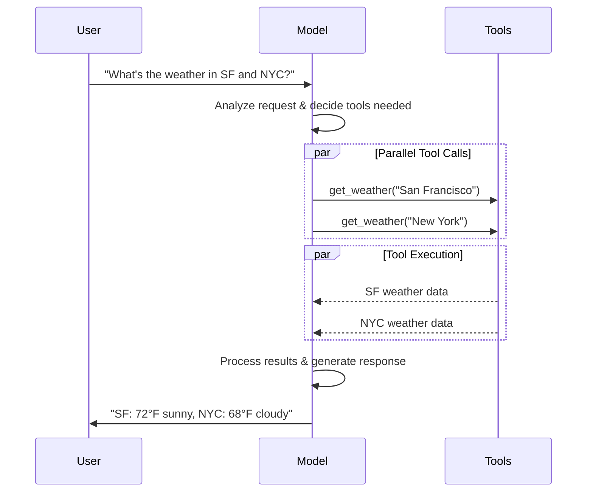

import ChatModelTabsPy from "/snippets/chat-model-tabs.mdx";
import ChatModelTabsJS from "/snippets/chat-model-tabs-js.mdx";

[LLMs](https://en.wikipedia.org/wiki/Large_language_model) 是强大的 AI 工具，可以像人类一样解释和生成文本。它们功能多样，无需针对每个任务进行专门训练即可撰写内容、翻译语言、总结和回答问题。

除了文本生成之外，许多模型还支持：

- <Icon icon="hammer" size={16} /> [工具调用](#tool-calling) -
  调用外部工具（如数据库查询或 API 调用）并在响应中使用结果。
- <Icon icon="layout-grid" size={16} /> [结构化输出](#structured-output) -
  模型的响应被限制为遵循定义的格式。
- <Icon icon="photo" size={16} /> [多模态](#multimodal) -
  处理和返回除文本以外的数据，例如图像、音频和视频。
- <Icon icon="brain" size={16} /> [推理](#reasoning) -
  模型执行多步推理以得出结论。

模型是 [代理](/oss/python/langchain/agents) 的推理引擎。它们驱动代理的决策过程，决定调用哪些工具、如何解释结果以及何时提供最终答案。

您选择的模型的质量和功能直接影响代理的基础可靠性和性能。不同的模型擅长不同的任务 - 有些更擅长遵循复杂指令，有些擅长结构化推理，还有一些支持更大的上下文窗口以处理更多信息。

LangChain 的标准模型接口为您提供了许多不同提供商的集成，使您可以轻松地实验和切换模型，以找到最适合您用例的模型。

<Info>
  有关特定提供商的集成信息和功能，请参阅提供商的
  [聊天模型页面](/oss/python/integrations/chat)。
</Info>

## 基本用法

模型可以通过两种方式使用：

1. **与代理一起使用** - 在创建 [代理](/oss/python/langchain/agents#model) 时可以动态指定模型。
2. **独立使用** - 模型可以直接调用（在代理循环之外），用于文本生成、分类或提取等任务，而无需代理框架。

相同的模型接口在这两种情况下都适用，这使您可以灵活地从简单开始，并根据需要扩展到更复杂的基于代理的工作流。

### 初始化模型

在 LangChain 中使用独立模型的最简单方法是使用 [`init_chat_model`](https://reference.langchain.com/python/langchain/chat_models/base/init_chat_model) 从您选择的聊天模型提供商处初始化一个模型（如下示例）：

<ChatModelTabsPy />
```python response = model.invoke("为什么鹦鹉会说话？") ```

有关更多详细信息，包括如何传递模型 [参数](#parameters)，请参阅 [`init_chat_model`](https://reference.langchain.com/python/langchain/chat_models/base/init_chat_model)。

### 支持的模型

LangChain 支持所有主要模型提供商，包括 OpenAI、Anthropic、Google、Azure、AWS Bedrock 等。每个提供商都提供多种模型，具有不同的能力。有关 LangChain 支持的完整模型列表，请参阅 [集成页面](/oss/python/integrations/providers/overview)。

### 关键方法

<Card title="Invoke" href="#invoke" icon="send" arrow="true" horizontal>
  模型接受消息作为输入，并在生成完整响应后输出消息。
</Card>
<Card title="Stream" href="#stream" icon="broadcast" arrow="true" horizontal>
  调用模型，但实时流式输出。
</Card>
<Card title="Batch" href="#batch" icon="grip-vertical" arrow="true" horizontal>
  向模型发送多个请求以进行更高效的处理。
</Card>

<Info>
  除了聊天模型，LangChain 还提供对其他相邻技术的支持，如嵌入模型和向量存储。详见
  [集成页面](/oss/python/integrations/providers/overview)。
</Info>

## 参数

聊天模型接受参数，可以用来配置其行为。支持的参数因模型和提供商而异，但标准参数包括：

<ParamField body="model" type="string" required>
  您想与提供商一起使用的特定模型的名称或标识符。您也可以指定模型和其提供商，使用
  '{model_provider}:{model}' 格式，例如，'openai:o1'。
</ParamField>

<ParamField body="api_key" type="string">
  认证与模型提供商的密钥。这通常在您注册访问模型时颁发。通常通过设置一个{" "}
  <Tooltip tip="A variable whose value is set outside the program, typically through functionality built into the operating system or microservice.">
    环境变量
  </Tooltip>{" "}
  访问。
</ParamField>

<ParamField body="temperature" type="number">
  控制模型输出的随机性。较高的数字使响应更具创造性；较低的数字使响应更具确定性。
</ParamField>

<ParamField body="max_tokens" type="number">
  限制响应中的{" "}
  <Tooltip tip="The basic unit that a model reads and generates. Providers may define them differently, but in general, they can represent a whole or part of word.">
    令牌
  </Tooltip>{" "}
  总数，从而控制输出的长度。
</ParamField>

<ParamField body="timeout" type="number">
  等待模型响应的最大时间（以秒为单位）。
</ParamField>

<ParamField body="max_retries" type="number" default="6">
  系统在请求失败时（如网络超时或速率限制）会尝试重发请求的最大次数。重试使用指数退避和抖动。网络错误、速率限制（429）和服务器错误（5xx）会自动重试。客户端错误如
  401（未授权）或 404 不会重试。对于在不可靠网络上运行的
  [代理](/oss/python/deepagents/overview) 任务，考虑增加到 10–15。
</ParamField>

使用 [`init_chat_model`](https://reference.langchain.com/python/langchain/chat_models/base/init_chat_model)，通过 inline <Tooltip tip="Arbitrary keyword arguments" cta="Learn more" href="https://www.w3schools.com/python/python_args_kwargs.asp">`**kwargs`</Tooltip>：

```python Initialize using model parameters
model = init_chat_model(
    "claude-sonnet-4-6",
    # Kwargs passed to the model:
    temperature=0.7,
    timeout=30,
    max_tokens=1000,
    max_retries=6,  # Default; increase for unreliable networks
)
```

<Info>
    每个聊天模型集成可能有额外的参数用于控制提供商特定的功能。

    例如，[`ChatOpenAI`](https://reference.langchain.com/python/langchain-openai/chat_models/base/ChatOpenAI) 有 `use_responses_api` 来决定是否使用 OpenAI Responses 或 Completions API。

    要找到给定聊天模型支持的所有参数，请前往 [聊天模型集成](/oss/python/integrations/chat) 页面。

</Info>

---

## 调用

一个聊天模型必须被调用以生成输出。有三种主要的调用方法，每种方法都适合不同的使用场景。

### 调用

最直接的方式是使用 [`invoke()`](https://reference.langchain.com/python/langchain-core/language_models/chat_models/BaseChatModel/invoke) 传入单个消息或消息列表。

```python Single message
response = model.invoke("Why do parrots have colorful feathers?")
print(response)
```

一个消息列表可以提供给聊天模型，以代表对话历史。每个消息都有一个角色，模型使用这个角色来指示谁在对话中发送了消息。

见 [消息](/oss/python/langchain/messages) 指南，了解角色、类型和内容的更多细节。

```python Dictionary format
conversation = [
    {"role": "system", "content": "You are a helpful assistant that translates English to French."},
    {"role": "user", "content": "Translate: I love programming."},
    {"role": "assistant", "content": "J'adore la programmation."},
    {"role": "user", "content": "Translate: I love building applications."}
]

response = model.invoke(conversation)
print(response)  # AIMessage("J'adore créer des applications.")
```

```python Message objects
from langchain.messages import HumanMessage, AIMessage, SystemMessage

conversation = [
    SystemMessage("You are a helpful assistant that translates English to French."),
    HumanMessage("Translate: I love programming."),
    AIMessage("J'adore la programmation."),
    HumanMessage("Translate: I love building applications.")
]

response = model.invoke(conversation)
print(response)  # AIMessage("J'adore créer des applications.")
```

<Info>
  如果您的调用返回类型是字符串，请确保您使用的是聊天模型而不是
  LLM。旧的、文本补全 LLM 直接返回字符串。LangChain 聊天模型以 "Chat" 开头，例如
  [`ChatOpenAI`](https://reference.langchain.com/python/langchain-openai/chat_models/base/ChatOpenAI)(/oss/integrations/chat/openai)。
</Info>

### 流式输出

大多数模型可以流式输出其内容，同时生成。通过逐步显示输出，流式输出显著改善了用户体验，特别是对于较长的响应。

调用 [`stream()`](https://reference.langchain.com/python/langchain-core/language_models/chat_models/BaseChatModel/stream) 返回一个 <Tooltip tip="An object that progressively provides access to each item of a collection, in order.">迭代器</Tooltip>，它会逐步产生输出块。您可以使用循环实时处理每个块：

<CodeGroup>
    ```python Basic text streaming
    for chunk in model.stream("Why do parrots have colorful feathers?"):
        print(chunk.text, end="|", flush=True)
    ```

    ```python Stream tool calls, reasoning, and other content
    for chunk in model.stream("What color is the sky?"):
        for block in chunk.content_blocks:
            if block["type"] == "reasoning" and (reasoning := block.get("reasoning")):
                print(f"Reasoning: {reasoning}")
            elif block["type"] == "tool_call_chunk":
                print(f"Tool call chunk: {block}")
            elif block["type"] == "text":
                print(block["text"])
            else:
                ...
    ```

</CodeGroup>

与 [`invoke()`](#invoke) 不同，`stream()` 返回多个 [`AIMessageChunk`](https://reference.langchain.com/python/langchain-core/messages/ai/AIMessageChunk) 对象，每个对象包含输出文本的一部分。重要的是，每个流中的块都设计为通过求和聚集成完整消息：

```python Construct an AIMessage
full = None  # None | AIMessageChunk
for chunk in model.stream("What color is the sky?"):
    full = chunk if full is None else full + chunk
    print(full.text)

# The
# The sky
# The sky is
# The sky is typically
# The sky is typically blue
# ...

print(full.content_blocks)
# [{"type": "text", "text": "The sky is typically blue..."}]
```

最终消息可以像使用 [`invoke()`](#invoke) 生成的消息一样处理，例如，可以聚合到消息历史并返回给模型作为对话上下文。

<Warning>
  流式输出只在所有步骤都知道如何处理流式块时才有效。例如，一个不能流式处理的应用程序需要在能处理之前将整个输出存储在内存中。
</Warning>

<Accordion title="高级流式输出话题">
    <Accordion title="流式事件">
        LangChain 聊天模型也可以使用 `astream_events()` 流式输出语义事件。

        这简化了基于事件类型和其他元数据的过滤，并将在后台聚合完整消息。见下例。

        ```python
        async for event in model.astream_events("Hello"):

            if event["event"] == "on_chat_model_start":
                print(f"Input: {event['data']['input']}")

            elif event["event"] == "on_chat_model_stream":
                print(f"Token: {event['data']['chunk'].text}")

            elif event["event"] == "on_chat_model_end":
                print(f"Full message: {event['data']['output'].text}")

            else:
                pass
        ```
        ```txt
        Input: Hello
        Token: Hi
        Token:  there
        Token: !
        Token:  How
        Token:  can
        Token:  I
        ...
        Full message: Hi there! How can I help today?
        ```

        <Tip>
            请参阅 [`astream_events()`](https://reference.langchain.com/python/langchain_core/language_models/#langchain_core.language.models.chat_models.BaseChatModel.astream_events) 参考，了解事件类型和其他细节。
        </Tip>


    </Accordion>
    <Accordion title='"Auto-streaming" chat models'>
        LangChain 通过在某些情况下自动启用流式模式，简化了从聊天模型的流式输出。这在您没有明确调用流式方法时特别有用。例如，当您使用非流式 `invoke` 方法但仍然想流式处理整个应用程序，包括来自聊天模型的中间结果时。

        在 [LangGraph 代理](/oss/python/langchain/agents) 中，例如，您可以在节点内调用 `model.invoke()`，但 LangChain 会自动委托到流式模式。

        #### 如何工作

        当您 `invoke()` 一个聊天模型时，LangChain 会自动切换到内部流式模式，如果它检测到您正在尝试流式处理整个应用程序。调用的结果将与使用 `invoke` 的代码相同；然而，当聊天模型被流式处理时，LangChain 会处理 [`on_llm_new_token`](https://reference.langchain.com/python/langchain-core/callbacks/base/AsyncCallbackHandler/on_llm_new_token) 事件。

        Callback events allow LangGraph `stream()` and `astream_events()` to surface the chat model's output in real-time.


    </Accordion>

</Accordion>

### 批处理

批量处理独立请求的集合可以显著提高性能并减少成本，因为处理可以并行进行：

```python Batch
responses = model.batch([
    "Why do parrots have colorful feathers?",
    "How do airplanes fly?",
    "What is quantum computing?"
])
for response in responses:
    print(response)
```

<Note>
    这个部分描述了 [`batch()`](https://reference.langchain.com/python/langchain_core/language_models/#langchain_core.language.models.chat_models.BaseChatModel.batch) 方法，它在客户端并行化模型调用。

    它是 **不同的** 于推理提供商支持的批量 API，如 [OpenAI](https://platform.openai.com/docs/guides/batch) 或 [Anthropic](https://platform.claude.com/docs/en/build-with-claude/batch-processing#message-batches-api)。

</Note>

默认情况下，[`batch()`](https://reference.langchain.com/python/langchain_core/language_models/#langchain_core.language.models.chat_models.BaseChatModel.batch) 只会返回整个批次的最终输出。如果您想在每个输入生成时接收输出，可以使用 [`batch_as_completed()`](https://reference.langchain.com/python/langchain_core/language_models/#langchain_core.language.models.chat_models.BaseChatModel.batch_as_completed):

```python Yield batch responses upon completion
for response in model.batch_as_completed([
    "Why do parrots have colorful feathers?",
    "How do airplanes fly?",
    "What is quantum computing?"
]):
    print(response)
```

<Note>
  当使用
  [`batch_as_completed()`](https://reference.langchain.com/python/langchain_core/language_models/#langchain_core.language.models.chat_models.BaseChatModel.batch_as_completed)
  时，结果可能以非顺序到达。每个结果都包含输入索引，用于重建原始顺序。
</Note>

<Tip>
    当使用 [`batch()`](https://reference.langchain.com/python/langchain_core/language_models/#langchain_core.language.models.chat_models.BaseChatModel.batch) 或 [`batch_as_completed()`](https://reference.langchain.com/python/langchain_core/language_models/#langchain_core.language.models.chat_models.BaseChatModel.batch_as_completed) 处理大量输入时，您可能想控制最大并行调用数。这可以通过在 [`RunnableConfig`](https://reference.langchain.com/python/langchain-core/runnables/config/RunnableConfig) 字典中设置 [`max_concurrency`](https://reference.langchain.com/python/langchain-core/runnables/config/RunnableConfig) 属性来实现。

    ```python Batch with max concurrency
    model.batch(
        list_of_inputs,
        config={
            'max_concurrency': 5,  # Limit to 5 parallel calls
        }
    )
    ```

    详见 [`RunnableConfig`](https://reference.langchain.com/python/langchain-core/runnables/config/RunnableConfig) 参考，了解所有支持的属性。

</Tip>

关于批量处理的更多细节，请参阅 [参考](https://reference.langchain.com/python/langchain_core/language_models/#langchain_core.language.models.chat_models.BaseChatModel.batch)。

---

## 工具调用

模型可以请求调用工具，执行诸如从数据库获取数据、搜索网络或运行代码的任务。工具是成对的：

1. 一个模式，包括工具的名称、描述和/或参数定义（通常是一个 JSON 模式）
2. 一个函数或 <Tooltip tip="A method that can suspend execution and resume at a later time">协程</Tooltip> 来执行。

<Note>您可能会听到“函数调用”这个词。我们用这个词来表示“工具调用”。</Note>

这里的基本工具调用流程是用户和模型之间的：



要使您定义的工具对模型可用，必须使用 [`bind_tools`](https://reference.langchain.com/python/langchain-core/language_models/chat_models/BaseChatModel/bind_tools) 绑定它们。在后续调用中，模型可以按需调用任何已绑定的工具。

一些模型提供商提供 <Tooltip tip="Tools that are executed server-side, such as web search and code interpreters">内置工具</Tooltip>，可以通过模型或调用参数启用（例如，[`ChatOpenAI`](/oss/python/integrations/chat/openai)，[`ChatAnthropic`](/oss/python/integrations/chat/anthropic))。检查相应的 [提供商参考](/oss/python/integrations/providers/overview) 以获取详细信息。

<Tip>
  请参阅 [工具指南](/oss/python/langchain/tools)
  了解创建工具的详细信息和其他选项。
</Tip>

```python Binding user tools
from langchain.tools import tool

@tool
def get_weather(location: str) -> str:
    """Get the weather at a location."""
    return f"It's sunny in {location}."


model_with_tools = model.bind_tools([get_weather])  # [!code highlight]

response = model_with_tools.invoke("What's the weather like in Boston?")
for tool_call in response.tool_calls:
    # View tool calls made by the model
    print(f"Tool: {tool_call['name']}")
    print(f"Args: {tool_call['args']}")
```

当绑定用户定义的工具时，模型的响应包括一个 **请求** 来执行一个工具。当使用模型单独从 [代理](/oss/python/langchain/agents) 外部时，您需要执行请求的工具并返回结果给模型用于后续推理。当使用 [代理](/oss/python/langchain/agents) 时，代理循环会处理工具执行循环。

下面，我们展示一些常见的工具调用方式。

<AccordionGroup>
    <Accordion title="工具执行循环" icon="refresh">
        当模型返回工具调用时，您需要执行工具并把结果返回给模型。这会创建一个对话循环，模型可以使用工具结果来生成最终响应。LangChain 包含 [代理](/oss/python/langchain/agents) 抽象，处理这种编排。

        这里是一个简单的例子：

        ```python Tool execution loop
        # Bind (potentially multiple) tools to the model
        model_with_tools = model.bind_tools([get_weather])

        # Step 1: Model generates tool calls
        messages = [{"role": "user", "content": "What's the weather in Boston?"}]
        ai_msg = model_with_tools.invoke(messages)
        messages.append(ai_msg)

        # Step 2: Execute tools and collect results
        for tool_call in ai_msg.tool_calls:
            # Execute the tool with the generated arguments
            tool_result = get_weather.invoke(tool_call)
            messages.append(tool_result)

        # Step 3: Pass results back to model for final response
        final_response = model_with_tools.invoke(messages)
        print(final_response.text)
        # "The current weather in Boston is 72°F and sunny."
        ```


        每个 [`ToolMessage`](https://reference.langchain.com/python/langchain-core/messages/tool/ToolMessage) 返回的工具都包含一个 `tool_call_id`，匹配原始工具调用，帮助模型关联结果与请求。
    </Accordion>
    <Accordion title="强制工具调用" icon="asterisk">
        默认情况下，模型有自由选择使用哪个已绑定工具，基于用户的输入。然而，您可能想强制选择一个工具，确保模型使用特定工具或 **任何** 工具从给定列表：

        <CodeGroup>
            ```python Force use of any tool
            model_with_tools = model.bind_tools([tool_1], tool_choice="any")
            ```
            ```python Force use of specific tools
            model_with_tools = model.bind_tools([tool_1], tool_choice="tool_1")
            ```
        </CodeGroup>


    </Accordion>
    <Accordion title="并行工具调用" icon="stack-2">
        许多模型支持在适当情况下并行调用多个工具。这允许模型同时从不同来源收集信息。

        ```python Parallel tool calls
        model_with_tools = model.bind_tools([get_weather])

        response = model_with_tools.invoke(
            "What's the weather in Boston and Tokyo?"
        )


        # The model may generate multiple tool calls
        print(response.tool_calls)
        # [
        #   {'name': 'get_weather', 'args': {'location': 'Boston'}, 'id': 'call_1'},
        #   {'name': 'get_weather', 'args': {'location': 'Tokyo'}, 'id': 'call_2'},
        # ]


        # Execute all tools (can be done in parallel with async)
        results = []
        for tool_call in response.tool_calls:
            if tool_call['name'] == 'get_weather':
                result = get_weather.invoke(tool_call)
            ...
            results.append(result)
        ```


        模型智能地确定何时并行执行是适当的，基于请求操作的独立性。

        <Tip>
        大多数支持工具调用的模型默认启用并行工具调用。一些（包括 [OpenAI](/oss/python/integrations/chat/openai) 和 [Anthropic](/oss/python/integrations/chat/anthropic)）允许您禁用此功能。要这样做，设置 `parallel_tool_calls=False`:
        ```python
        model.bind_tools([get_weather], parallel_tool_calls=False)
        ```
        </Tip>
    </Accordion>
    <Accordion title="流式工具调用" icon="rss">
        当流式输出时，工具调用是通过 [`ToolCallChunk`](https://reference.langchain.com/python/langchain-core/messages/tool/ToolCallChunk) 逐步构建的。这允许您看到工具调用作为它们被生成，而不是等待完整响应。

        ```python Streaming tool calls
        for chunk in model_with_tools.stream(
            "What's the weather in Boston and Tokyo?"
        ):
            # Tool call chunks arrive progressively
            for tool_chunk in chunk.tool_call_chunks:
                if name := tool_chunk.get("name"):
                    print(f"Tool: {name}")
                if id_ := tool_chunk.get("id"):
                    print(f"ID: {id_}")
                if args := tool_chunk.get("args"):
                    print(f"Args: {args}")

        # Output:
        # Tool: get_weather
        # ID: call_SvMlU1TVIZugrFLckFE2ceRE
        # Args: {"lo
        # Args: catio
        # Args: n": "B
        # Args: osto
        # Args: n"}
        # Tool: get_weather
        # ID: call_QMZdy6qInx13oWKE7KhuhOLR
        # Args: {"lo
        # Args: catio
        # Args: n": "T
        # Args: okyo
        # Args: "}
        ```

        您可以累积块来构建完整的工具调用：

        ```python Accumulate tool calls
        gathered = None
        for chunk in model_with_tools.stream("What's the weather in Boston?"):
            gathered = chunk if gathered is None else gathered + chunk
            print(gathered.tool_calls)
        ```


    </Accordion>

</AccordionGroup>

---

## 结构化输出

模型可以被请求以提供符合给定模式的响应。这有助于确保输出可以轻松解析和用于后续处理。LangChain 支持多种模式类型和方法来强制结构化输出。

<Tip>
  要了解结构化输出，请参阅
  [结构化输出](/oss/python/langchain/structured-output)。
</Tip>

<Tabs>
    <Tab title="Pydantic">
        [Pydantic 模型](https://docs.pydantic.dev/latest/concepts/models/#basic-model-usage) 提供了最丰富的功能集，包括字段验证、描述和嵌套结构。

        ```python
        from pydantic import BaseModel, Field

        class Movie(BaseModel):
            """A movie with details."""
            title: str = Field(..., description="The title of the movie")
            year: int = Field(..., description="The year the movie was released")
            director: str = Field(..., description="The director of the movie")
            rating: float = Field(..., description="The movie's rating out of 10")

        model_with_structure = model.with_structured_output(Movie)
        response = model_with_structure.invoke("Provide details about the movie Inception")
        print(response)  # Movie(title="Inception", year=2010, director="Christopher Nolan", rating=8.8)
        ```
    </Tab>
    <Tab title="TypedDict">
        Python 的 `TypedDict` 提供了一个更简单的替代品，理想用于您不需要运行时验证的情况。

        ```python
        from typing_extensions import TypedDict, Annotated

        class MovieDict(TypedDict):
            """A movie with details."""
            title: Annotated[str, ..., "The title of the movie"]
            year: Annotated[int, ..., "The year the movie was released"]
            director: Annotated[str, ..., "The director of the movie"]
            rating: Annotated[float, ..., "The movie's rating out of 10"]

        model_with_structure = model.with_structured_output(MovieDict)
        response = model_with_structure.invoke("Provide details about the movie Inception")
        print(response)  # {'title': 'Inception', 'year': 2010, 'director': 'Christopher Nolan', 'rating': 8.8}
        ```
    </Tab>
    <Tab title="JSON Schema">
        提供一个 [JSON Schema](https://json-schema.org/understanding-json-schema/about) 以获得最大控制和互操作性。

        ```python
        import json

        json_schema = {
            "title": "Movie",
            "description": "A movie with details",
            "type": "object",
            "properties": {
                "title": {
                    "type": "string",
                    "description": "The title of the movie"
                },
                "year": {
                    "type": "integer",
                    "description": "The year the movie was released"
                },
                "director": {
                    "type": "string",
                    "description": "The director of the movie"
                },
                "rating": {
                    "type": "number",
                    "description": "The movie's rating out of 10"
                }
            },
            "required": ["title", "year", "director", "rating"]
        }

        model_with_structure = model.with_structured_output(
            json_schema,
            method="json_schema",
        )
        response = model_with_structure.invoke("Provide details about the movie Inception")
        print(response)  # {'title': 'Inception', 'year': 2010, ...}
        ```
    </Tab>

</Tabs>

<Note>
    **结构化输出的关键考虑**

    - **方法参数**: 一些提供商支持不同的方法来强制结构化输出：
        - `'json_schema'`: 使用提供商提供的专用结构化输出功能。
        - `'function_calling'`: 通过强制一个 [工具调用](#tool-calling) 来推导结构化输出。
        - `'json_mode'`: 一些提供商提供的 `'json_schema'` 的前身。生成有效的 JSON，但必须在提示中描述模式。
    - **包含原始**: 设置 `include_raw=True` 以获得解析输出和原始 AI 消息。
    - **验证**: Pydantic 模型提供自动验证。`TypedDict` 和 JSON Schema 需要手动验证。

    详见您的 [提供商集成页面](/oss/python/integrations/providers/overview)。

</Note>

<Accordion title="示例: 消息输出和解析结构">

返回原始 [`AIMessage`](https://reference.langchain.com/python/langchain-core/messages/ai/AIMessage) 对象，以访问响应元数据，如 [token counts](#token-usage)。要这样做，设置 [`include_raw=True`](https://reference.langchain.com/python/langchain-core/language_models/chat_models/BaseChatModel/with_structured_output) 当调用 [`with_structured_output`](https://reference.langchain.com/python/langchain-core/language_models/chat_models/BaseChatModel/with_structured_output):

    ```python
    from pydantic import BaseModel, Field

    class Movie(BaseModel):
        """A movie with details."""
        title: str = Field(..., description="The title of the movie")
        year: int = Field(..., description="The year the movie was released")
        director: str = Field(..., description="The director of the movie")
        rating: float = Field(..., description="The movie's rating out of 10")

    model_with_structure = model.with_structured_output(Movie, include_raw=True)  # [!code highlight]
    response = model_with_structure.invoke("Provide details about the movie Inception")
    response
    # {
    #     "raw": AIMessage(...),
    #     "parsed": Movie(title=..., year=..., ...),
    #     "parsing_error": None,
    # }
    ```

</Accordion>
<Accordion title="示例: 嵌套结构">
    模式可以是嵌套的：
    <CodeGroup>
        ```python Pydantic BaseModel
        from pydantic import BaseModel, Field

        class Actor(BaseModel):
            name: str
            role: str

        class MovieDetails(BaseModel):
            title: str
            year: int
            cast: list[Actor]
            genres: list[str]
            budget: float | None = Field(None, description="Budget in millions USD")

        model_with_structure = model.with_structured_output(MovieDetails)
        ```

        ```python TypedDict
        from typing_extensions import Annotated, TypedDict

        class Actor(TypedDict):
            name: str
            role: str

        class MovieDetails(TypedDict):
            title: str
            year: int
            cast: list[Actor]
            genres: list[str]
            budget: Annotated[float | None, ..., "Budget in millions USD"]

        model_with_structure = model.with_structured_output(MovieDetails)
        ```
    </CodeGroup>

</Accordion>

---

## 高级主题

### 模型配置文件

<Info>
    模型配置文件需要 `langchain>=1.1`。
</Info>

LangChain 聊天模型可以暴露一个支持的特征和能力的字典，通过一个 `.profile` 属性：

```python
model.profile
# {
#   "max_input_tokens": 400000,
#   "image_inputs": True,
#   "reasoning_output": True,
#   "tool_calling": True,
#   ...
# }
```

参见 API 参考中的完整字段列表。

Much of the model profile data is powered by the [models.dev](https://github.com/sst/models.dev) project, an open source initiative that provides model capability data. These data are augmented with additional fields for purposes of use with LangChain. These augmentations are kept aligned with the upstream project as it evolves.

Model profile data allow applications to work around model capabilities dynamically. For example:

1. [Summarization middleware](/oss/python/langchain/middleware/built-in#summarization) can trigger summarization based on a model's context window size.
2. [Structured output](/oss/python/langchain/structured-output) strategies in `create_agent` can be inferred automatically (e.g., by checking support for native structured output features).
3. Model inputs can be gated based on supported [modalities](#multimodal) and maximum input tokens.

<Accordion title="更新或覆盖配置数据">
    模型配置数据可以被更改，如果它缺失、过时或不正确。

    **选项 1 (快速修复)**

    您可以实例化一个聊天模型，具有任何有效的配置：

    ```python
    custom_profile = {
        "max_input_tokens": 100_000,
        "tool_calling": True,
        "structured_output": True,
        # ...
    }
    model = init_chat_model("...", profile=custom_profile)
    ```

    `profile` 也是一个普通的 `dict`，可以原地更新。如果模型实例是共享的，考虑使用 `model_copy` 来避免突变共享状态。

    ```python
    new_profile = model.profile | {"key": "value"}
    model.model_copy(update={"profile": new_profile})
    ```

    **选项 2 (修复数据上游)**

    数据的主要来源是 [models.dev](https://models.dev/) 项目。这个数据与额外字段和覆盖在 LangChain [集成包](/oss/python/integrations/providers/overview) 中合并，并随这些包一起分发。

    模型配置数据可以通过以下过程更新：

    1. (如果需要) 更新 [models.dev](https://models.dev/) 的源数据，通过一个 pull request 到其 [GitHub 仓库](https://github.com/sst/models.dev)。
    2. (如果需要) 更新额外字段和覆盖在 `langchain_<package>/data/profile_augmentations.toml` 中，通过一个 pull request 到 LangChain [集成包](/oss/python/integrations/providers/overview)。
    3. 使用 [`langchain-model-profiles`](https://pypi.org/project/langchain-model-profiles/) CLI 工具从 [models.dev](https://models.dev/) 下载最新数据，合并增补并更新配置数据：

    ```bash
    pip install langchain-model-profiles
    ```

    ```bash
    langchain-profiles refresh --provider <provider> --data-dir <data_dir>
    ```

    这个命令：
    - 下载 `<provider>` 的最新数据。
    - 合并增补来自 `profile_augmentations.toml` 的数据。
    - 写入 `profiles.py`。

    例如：从 [`libs/partners/anthropic`](https://github.com/langchain-ai/langchain/tree/master/libs/partners/anthropic) 在 [LangChain monorepo](https://github.com/langchain-ai/langchain):

    ```bash
    uv run --with langchain-model-profiles --provider anthropic --data-dir langchain_anthropic/data
    ```

</Accordion>

<Warning>模型配置文件是 beta 特性。配置的格式可能会改变。</Warning>

### 多模态

某些模型可以处理和返回非文本数据，如图像、音频和视频。您可以通过提供 [内容块](/oss/python/langchain/messages#message-content) 来向模型传递非文本数据。

<Tip>
    所有 LangChain 聊天模型都支持：

    1. 数据在跨提供商标准格式（见 [我们的消息指南](/oss/python/langchain/messages)）
    2. OpenAI [聊天完成](https://platform.openai.com/docs/api-reference/chat) 格式
    3. 任何特定提供商的原生格式（例如，Anthropic 模型接受 Anthropic 原生格式）

</Tip>

见 [多模态部分](/oss/python/langchain/messages#multimodal) 的消息指南以获取详细信息。

<Tooltip
  tip="Not all LLMs are made equally!"
  cta="See reference"
  href="https://models.dev/"
>
  Some models
</Tooltip>
可以返回多模态数据作为其响应的一部分。如果这样调用，结果
[`AIMessage`](https://reference.langchain.com/python/langchain-core/messages/ai/AIMessage)
将包含多模态类型的内容块。

```python Multimodal output
response = model.invoke("Create a picture of a cat")
print(response.content_blocks)
# [
#     {"type": "text", "text": "Here's a picture of a cat"},
#     {"type": "image", "base64": "...", "mime_type": "image/jpeg"},
# ]
```

See the [integrations page](/oss/python/integrations/providers/overview) for details on specific providers.

### 推理

许多模型能够执行多步推理以得出结论。这涉及将复杂问题分解为更小、更易管理的步骤。

**如果底层模型支持，** 您可以表面这个推理过程，以更好地理解模型如何得出最终答案。

<CodeGroup>
    ```python Stream reasoning output
    for chunk in model.stream("Why do parrots have colorful feathers?"):
        reasoning_steps = [r for r in chunk.content_blocks if r["type"] == "reasoning"]
        print(reasoning_steps if reasoning_steps else chunk.text)
    ```

    ```python Complete reasoning output
    response = model.invoke("Why do parrots have colorful feathers?")
    reasoning_steps = [b for b in response.content_blocks if b["type"] == "reasoning"]
    print(" ".join(step["reasoning"] for step in reasoning_steps))
    ```

</CodeGroup>

Depending on the model, you can sometimes specify the level of effort it should put into reasoning. Similarly, you can request that the model turn off reasoning entirely. This may take the form of categorical "tiers" of reasoning (e.g., `'low'` or `'high'`) or integer token budgets.

For details, see the [integrations page](/oss/python/integrations/providers/overview) or [reference](https://reference.langchain.com/python/integrations/) for your respective chat model.

### 本地模型

LangChain 支持在您的本地硬件上运行模型。这在数据隐私至关重要、您想调用自定义模型或避免使用云基础模型产生的成本时特别有用。

[Ollama](/oss/python/integrations/chat/ollama) 是运行聊天和嵌入模型的最容易方式。

{/* TODO: whenever we have a better integrations directory, x-ref to that page with a local query filter */}

### 提示缓存

许多提供商提供提示缓存功能，以减少重复处理相同令牌的延迟和成本。这些功能可以是 **隐式** 或 **显式**：

- **隐式提示缓存**：提供商将自动通过缓存命中来节省成本。例子：[OpenAI](/oss/python/integrations/chat/openai) 和 [Gemini](/oss/python/integrations/chat/google_generative_ai)。
- **显式缓存**：提供商允许您手动指示缓存点，以获得更大的控制或保证成本节省。例子：
  - [`ChatOpenAI`](https://reference.langchain.com/python/langchain-openai/chat_models/base/ChatOpenAI) (via `prompt_cache_key`)
  - Anthropic's [`AnthropicPromptCachingMiddleware`](/oss/python/integrations/chat/anthropic#prompt-caching)
  - [Gemini](https://reference.langchain.com/python/integrations/langchain_google_genai/).
  - [AWS Bedrock](/oss/python/integrations/chat/bedrock#prompt-caching)

<Warning>
  提示缓存通常只在输入令牌阈值以上才被启用。见
  [提供商页面](/oss/python/integrations/chat) 以获取详情。
</Warning>

Cache usage will be reflected in the [usage metadata](/oss/python/langchain/messages#token-usage) of the model response.

### 服务器端工具使用

一些提供商支持服务器端 [工具调用](#tool-calling) 循环：模型可以与网络搜索、代码解释器和其他工具交互，并在单个对话回合中分析结果。

如果模型在服务器端调用工具，响应消息的内容将包括表示调用和结果的工具内容。访问响应的 [内容块](/oss/python/langchain/messages#standard-content-blocks) 将返回服务器端工具调用和结果，以提供商无关的格式：

```python Invoke with server-side tool use
from langchain.chat_models import init_chat_model

model = init_chat_model("gpt-4.1-mini")

tool = {"type": "web_search"}
model_with_tools = model.bind_tools([tool])

response = model_with_tools.invoke("What was a positive news story from today?")
print(response.content_blocks)
```

```python Result expandable
[
    {
        "type": "server_tool_call",
        "name": "web_search",
        "args": {
            "query": "positive news stories today",
            "type": "search"
        },
        "id": "ws_abc123"
    },
    {
        "type": "server_tool_result",
        "tool_call_id": "ws_abc123",
        "status": "success"
    },
    {
        "type": "text",
        "text": "Here are some positive news stories from today...",
        "annotations": [
            {
                "end_index": 410,
                "start_index": 337,
                "title": "article title",
                "type": "citation",
                "url": "..."
            }
        ]
    }
]
```

This represents a single conversational turn; there are no associated [ToolMessage](/oss/python/langchain/messages#tool-message) objects that need to be passed in as in client-side [tool-calling](#tool-calling).

See the [integration page](/oss/python/integrations/chat) for your given provider for available tools and usage details.

### 速率限制

许多聊天模型提供商对在给定时间周期内可以发出的调用数量施加限制。如果达到速率限制，您通常会收到速率限制错误响应，需要等待才能发出更多请求。

为了帮助管理速率限制，聊天模型集成接受一个 `rate_limiter` 参数，可以在初始化时提供，以控制请求的速率。

<Accordion title="Initialize and use a rate limiter" icon="gauge">
    LangChain 附带 (可选的) 内置 [`InMemoryRateLimiter`](https://reference.langchain.com/python/langchain-core/rate_limiters/InMemoryRateLimiter)。这个限流器是线程安全的，可以被同一进程中的多个线程共享。

    ```python Define a rate limiter
    from langchain_core.rate_limiters import InMemoryRateLimiter

    rate_limiter = InMemoryRateLimiter(
        requests_per_second=0.1,  # 1 request every 10s
        check_every_n_seconds=0.1,  # Check every 100ms whether allowed to make a request
        max_bucket_size=10,  # Controls the maximum burst size.
    )

    model = init_chat_model(
        model="gpt-5",
        model_provider="openai",
        rate_limiter=rate_limiter  # [!code highlight]
    )
    ```

    <Warning>
        提供的速率限流器只能限制每单位时间的请求数量。如果需要基于请求大小的限制，它将无法帮助。
    </Warning>

</Accordion>

### 基础 URL 和代理设置

您可以配置一个自定义的基础 URL，用于实现 OpenAI 聊天完成 API 的提供商。

<Warning>
    `model_provider="openai"` (或直接 `ChatOpenAI` 使用) 目标是官方 OpenAI API 规范。提供商特定字段从路由器和代理可能不会被提取或保留。

    对于 OpenRouter 和 LiteLLM，推荐使用专用集成：
    - [OpenRouter via `ChatOpenRouter`](/oss/python/integrations/chat/openrouter) (`langchain-openrouter`)
    - [LiteLLM via `ChatLiteLLM` / `ChatLiteLLMRouter`](/oss/python/integrations/chat/litellm) (`langchain-litellm`)

</Warning>

<Accordion title="Custom base URL" icon="link">
    Many model providers offer OpenAI-compatible APIs (e.g., [Together AI](https://www.together.ai/), [vLLM](https://github.com/vllm-project/vllm)). You can use [`init_chat_model`](https://reference.langchain.com/python/langchain/chat_models/base/init_chat_model) with these providers by specifying the appropriate `base_url` parameter:

    ```python
    model = init_chat_model(
        model="MODEL_NAME",
        model_provider="openai",
        base_url="BASE_URL",
        api_key="YOUR_API_KEY",
    )
    ```


    <Note>
        当使用直接聊天模型类实例化时，参数名可能因提供商而异。检查相应的 [参考](/oss/python/integrations/providers/overview) 以获取详情。
    </Note>

</Accordion>

<Accordion title="HTTP proxy configuration" icon="shield">
    For deployments requiring HTTP proxies, some model integrations support proxy configuration:

    ```python
    from langchain_openai import ChatOpenAI

    model = ChatOpenAI(
        model="gpt-4.1",
        openai_proxy="http://proxy.example.com:8080"
    )
    ```

<Note>
  Proxy support varies by integration. Check the specific model provider's
  [reference](/oss/python/integrations/providers/overview) for proxy
  configuration options.
</Note>

</Accordion>

### Log probabilities

Certain models can be configured to return token-level log probabilities representing the likelihood of a given token by setting the `logprobs` parameter when initializing the model:

```python
model = init_chat_model(
    model="gpt-4.1",
    model_provider="openai"
).bind(logprobs=True)

response = model.invoke("Why do parrots talk?")
print(response.response_metadata["logprobs"])
```

### Token usage

A number of model providers return token usage information as part of the invocation response. When available, this information will be included on the [`AIMessage`](https://reference.langchain.com/python/langchain-core/messages/ai/AIMessage) objects produced by the corresponding model. For more details, see the [messages](/oss/python/langchain/messages) guide.

<Note>
  Some provider APIs, notably OpenAI and Azure OpenAI chat completions, require
  users opt-in to receiving token usage data in streaming contexts. See the
  [streaming usage
  metadata](/oss/python/integrations/chat/openai#streaming-usage-metadata)
  section of the integration guide for details.
</Note>

You can track aggregate token counts across models in an application using either a callback or context manager, as shown below:

<Tabs>
    <Tab title="Callback handler">
        ```python
        from langchain.chat_models import init_chat_model
        from langchain_core.callbacks import UsageMetadataCallbackHandler

        model_1 = init_chat_model(model="gpt-4.1-mini")
        model_2 = init_chat_model(model="claude-haiku-4-5-20251001")

        callback = UsageMetadataCallbackHandler()
        result_1 = model_1.invoke("Hello", config={"callbacks": [callback]})
        result_2 = model_2.invoke("Hello", config={"callbacks": [callback]})
        print(callback.usage_metadata)
        ```
        ```python
        {
            'gpt-4.1-mini-2025-04-14': {
                'input_tokens': 8,
                'output_tokens': 10,
                'total_tokens': 18,
                'input_token_details': {'audio': 0, 'cache_read': 0},
                'output_token_details': {'audio': 0, 'reasoning': 0}
            },
            'claude-haiku-4-5-20251001': {
                'input_tokens': 8,
                'output_tokens': 21,
                'total_tokens': 29,
                'input_token_details': {'cache_read': 0, 'cache_creation': 0}
            }
        }
        ```
    </Tab>
    <Tab title="Context manager">
        ```python
        from langchain.chat_models import init_chat_model
        from langchain_core.callbacks import get_usage_metadata_callback

        model_1 = init_chat_model(model="gpt-4.1-mini")
        model_2 = init_chat_model(model="claude-haiku-4-5-20251001")

        with get_usage_metadata_callback() as cb:
            model_1.invoke("Hello")
            model_2.invoke("Hello")
            print(cb.usage_metadata)
        ```
        ```python
        {
            'gpt-4.1-mini-2025-04-14': {
                'input_tokens': 8,
                'output_tokens': 10,
                'total_tokens': 18,
                'input_token_details': {'audio': 0, 'cache_read': 0},
                'output_token_details': {'audio': 0, 'reasoning': 0}
            },
            'claude-haiku-4-5-20251001': {
                'input_tokens': 8,
                'output_tokens': 21,
                'total_tokens': 29,
                'input_token_details': {'cache_read': 0, 'cache_creation': 0}
            }
        }
        ```
    </Tab>

</Tabs>

### Invocation config

When invoking a model, you can pass additional configuration through the `config` parameter using a [`RunnableConfig`](https://reference.langchain.com/python/langchain-core/runnables/config/RunnableConfig) dictionary. This provides run-time control over execution behavior, callbacks, and metadata tracking.

Common configuration options include:

```python Invocation with config
response = model.invoke(
    "Tell me a joke",
    config={
        "run_name": "joke_generation",      # Custom name for this run
        "tags": ["humor", "demo"],          # Tags for categorization
        "metadata": {"user_id": "123"},     # Custom metadata
        "callbacks": [my_callback_handler], # Callback handlers
    }
)
```

These configuration values are particularly useful when:

- Debugging with [LangSmith](/langsmith/home) tracing
- Implementing custom logging or monitoring
- Controlling resource usage in production
- Tracking invocations across complex pipelines

<Accordion title="Key configuration attributes">
    <ParamField body="run_name" type="string">
        Identifies this specific invocation in logs and traces. Not inherited by sub-calls.
    </ParamField>

    <ParamField body="tags" type="string[]">
        Labels inherited by all sub-calls for filtering and organization in debugging tools.
    </ParamField>

    <ParamField body="metadata" type="object">
        Custom key-value pairs for tracking additional context, inherited by all sub-calls.
    </ParamField>

    <ParamField body="max_concurrency" type="number">
        Controls the maximum number of parallel calls when using [`batch()`](https://reference.langchain.com/python/langchain_core/language_models/#langchain_core.language.models.chat_models.BaseChatModel.batch) or [`batch_as_completed()`](https://reference.langchain.com/python/langchain_core/language_models/#langchain_core.language.models.chat_models.BaseChatModel.batch_as_completed).
    </ParamField>

    <ParamField body="callbacks" type="array">
        Handlers for monitoring and responding to events during execution.
    </ParamField>

    <ParamField body="recursion_limit" type="number">
        Maximum recursion depth for chains to prevent infinite loops in complex pipelines.
    </ParamField>

</Accordion>

<Tip>
  See full
  [`RunnableConfig`](https://reference.langchain.com/python/langchain-core/runnables/config/RunnableConfig)
  reference for all supported attributes.
</Tip>

### Configurable models

You can also create a runtime-configurable model by specifying [`configurable_fields`](https://reference.langchain.com/python/langchain_core/language_models/#langchain_core.language.models.chat_models.BaseChatModel.configurable_fields). If you don't specify a model value, then `'model'` and `'model_provider'` will be configurable by default.

```python
from langchain.chat_models import init_chat_model

configurable_model = init_chat_model(temperature=0)

configurable_model.invoke(
    "what's your name",
    config={"configurable": {"model": "gpt-5-nano"}},  # Run with GPT-5-Nano
)
configurable_model.invoke(
    "what's your name",
    config={"configurable": {"model": "claude-sonnet-4-6"}},  # Run with Claude
)
```

<Accordion title="Configurable model with default values">
    We can create a configurable model with default model values, specify which parameters are configurable, and add prefixes to configurable params:

    ```python
    first_model = init_chat_model(
            model="gpt-4.1-mini",
            temperature=0,
            configurable_fields=("model", "model_provider", "temperature", "max_tokens"),
            config_prefix="first",  # Useful when you have a chain with multiple models
    )

    first_model.invoke("what's your name")
    ```

    ```python
    first_model.invoke(
        "what's your name",
        config={
            "configurable": {
                "first_model": "claude-sonnet-4-6",
                "first_temperature": 0.5,
                "first_max_tokens": 100,
            }
        },
    )
    ```

    See the [`init_chat_model`](https://reference.langchain.com/python/langchain/chat_models/base/init_chat_model) reference for more details on `configurable_fields` and `config_prefix`.

</Accordion>

<Accordion title="Using a configurable model declaratively">
    We can call declarative operations like `bind_tools`, `with_structured_output`, `with_configurable`, etc. on a configurable model and chain a configurable model in the same way that we would a regularly instantiated chat model object.

    ```python
    from pydantic import BaseModel, Field


    class GetWeather(BaseModel):
        """Get the current weather in a given location"""

            location: str = Field(..., description="The city and state, e.g. San Francisco, CA")


    class GetPopulation(BaseModel):
        """Get the current population in a given location"""

            location: str = Field(..., description="The city and state, e.g. San Francisco, CA")


    model = init_chat_model(temperature=0)
    model_with_tools = model.bind_tools([GetWeather, GetPopulation])

    model_with_tools.invoke(
        "what's bigger in 2024 LA or NYC", config={"configurable": {"model": "gpt-4.1-mini"}}
    ).tool_calls
    ```
    ```
    [
        {
            'name': 'GetPopulation',
            'args': {'location': 'Los Angeles, CA'},
            'id': 'call_Ga9m8FAArIyEjItHmztPYA22',
            'type': 'tool_call'
        },
        {
            'name': 'GetPopulation',
            'args': {'location': 'New York, NY'},
            'id': 'call_jh2dEvBaAHRaw5JUDthOs7rt',
            'type': 'tool_call'
        }
    ]
    ```
    ```python
    model_with_tools.invoke(
        "what's bigger in 2024 LA or NYC",
        config={"configurable": {"model": "claude-sonnet-4-6"}},
    ).tool_calls
    ```
    ```
    [
        {
            'name': 'GetPopulation',
            'args': {'location': 'Los Angeles, CA'},
            'id': 'toolu_01JMufPf4F4t2zLj7miFeqXp',
            'type': 'tool_call'
        },
        {
            'name': 'GetPopulation',
            'args': {'location': 'New York City, NY'},
            'id': 'toolu_01RQBHcE8kEEbYTuuS8WqY1u',
            'type': 'tool_call'
        }
    ]
    ```

</Accordion>

---

<div className="source-links">
  <Callout icon="edit">
    [Edit this page on
    GitHub](https://github.com/langchain-ai/docs/edit/main/src/oss/langchain/models.mdx)
    or [file an issue](https://github.com/langchain-ai/docs/issues/new/choose).
  </Callout>
  <Callout icon="terminal-2">
    [Connect these docs](/use-these-docs) to Claude, VSCode, and more via MCP
    for real-time answers.
  </Callout>
</div>
