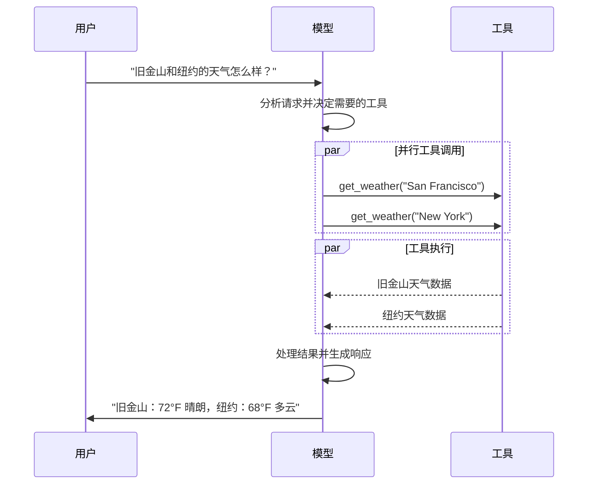

import ChatModelTabsPy from '/snippets/chat-model-tabs.mdx';
import ChatModelTabsJS from '/snippets/chat-model-tabs-js.mdx';

[大语言模型](https://en.wikipedia.org/wiki/Large_language_model)是强大的AI工具，能够像人类一样理解和生成文本。它们用途广泛，可以撰写内容、翻译语言、总结信息和回答问题，无需为每项任务进行专门训练。

除了文本生成，许多模型还支持：

* <Icon icon="hammer" size={16} /> [工具调用](#tool-calling) - 调用外部工具（如数据库查询或API调用），并在响应中使用结果。
* <Icon icon="layout-grid" size={16} /> [结构化输出](#structured-output) - 模型的响应被约束为遵循预定义格式。
* <Icon icon="photo" size={16} /> [多模态](#multimodal) - 处理和返回文本以外的数据，如图像、音频和视频。
* <Icon icon="brain" size={16} /> [推理](#reasoning) - 模型执行多步推理以得出结论。

模型是[智能体](/oss/python/langchain/agents)的推理引擎。它们驱动智能体的决策过程，决定调用哪些工具、如何解释结果以及何时提供最终答案。

您选择的模型的质量和能力直接影响智能体的基线可靠性和性能。不同的模型擅长不同的任务——有些更擅长遵循复杂指令，有些擅长结构化推理，还有一些支持更大的上下文窗口以处理更多信息。

LangChain的标准模型接口让您能够访问许多不同的提供商集成，这使得您可以轻松地在模型之间进行实验和切换，以找到最适合您用例的模型。

<Info>
    有关特定提供商的集成信息和功能，请参阅提供商的[聊天模型页面](/oss/python/integrations/chat)。
</Info>

## 基本用法

模型可以通过两种方式使用：

1. **与智能体一起使用** - 在创建[智能体](/oss/python/langchain/agents#model)时可以动态指定模型。
2. **独立使用** - 可以直接调用模型（在智能体循环之外），用于文本生成、分类或提取等任务，无需智能体框架。

相同的模型接口在两种场景下都适用，这使您可以从简单开始，并根据需要扩展到更复杂的基于智能体的工作流。

### 初始化模型

在LangChain中开始使用独立模型的最简单方法是使用 [`init_chat_model`](https://reference.langchain.com/python/langchain/chat_models/base/init_chat_model) 从您选择的聊天模型提供商初始化一个模型（示例如下）：

<ChatModelTabsPy />
```python
response = model.invoke("Why do parrots talk?")
```

有关更多详细信息，包括如何传递模型[参数](#parameters)的信息，请参阅 [`init_chat_model`](https://reference.langchain.com/python/langchain/chat_models/base/init_chat_model)。

### 支持的提供商和模型

LangChain通过专用的集成包支持所有主要的模型提供商。每个提供商包都实现了相同的标准接口，因此您可以更换提供商而无需重写应用程序逻辑。新的模型名称可以立即使用——无需更新LangChain——因为提供商包会将模型名称直接传递给提供商的API。

浏览[支持的提供商完整列表](/oss/python/integrations/providers/overview)，或参阅[提供商和模型](/oss/python/concepts/providers-and-models)了解提供商、包和模型名称在LangChain中如何协同工作的概念概述。

### 关键方法

<Card title="调用" href="#invoke" icon="send" arrow="true" horizontal>
    模型接收消息作为输入，并在生成完整响应后输出消息。
</Card>
<Card title="流式传输" href="#stream" icon="broadcast" arrow="true" horizontal>
    调用模型，但实时流式传输生成的输出。
</Card>
<Card title="批处理" href="#batch" icon="grip-vertical" arrow="true" horizontal>
    向模型发送多个请求进行批处理，以实现更高效的处理。
</Card>

<Info>
    除了聊天模型，LangChain还支持其他相关技术，如嵌入模型和向量存储。有关详细信息，请参阅[集成页面](/oss/python/integrations/providers/overview)。
</Info>

## 参数

聊天模型接受可用于配置其行为的参数。支持的完整参数集因模型和提供商而异，但标准参数包括：

<ParamField body="model" type="string" required>
   您要与提供商一起使用的特定模型的名称或标识符。您也可以使用 '{model_provider}:{model}' 格式在单个参数中同时指定模型及其提供商，例如 'openai:o1'。
</ParamField>

<ParamField body="api_key" type="string">
    与模型提供商进行身份验证所需的密钥。这通常在您注册访问模型时颁发。通常通过设置<Tooltip tip="一个值在程序外部设置的变量，通常通过操作系统或微服务内置的功能设置。">环境变量</Tooltip>来访问。
</ParamField>

<ParamField body="temperature" type="number">
    控制模型输出的随机性。较高的数字使响应更具创造性；较低的数字使响应更具确定性。
</ParamField>

<ParamField body="max_tokens" type="number">
    限制响应中<Tooltip tip="模型读取和生成的基本单位。提供商可能有不同的定义，但通常可以表示整个或部分单词。">令牌</Tooltip>的总数，从而有效控制输出的长度。
</ParamField>

<ParamField body="timeout" type="number">
    在取消请求之前等待模型响应的最大时间（以秒为单位）。
</ParamField>

<ParamField body="max_retries" type="number" default="6">
    如果请求因网络超时或速率限制等问题失败，系统将尝试重新发送请求的最大次数。重试使用带有抖动的指数退避。网络错误、速率限制（429）和服务器错误（5xx）会自动重试。客户端错误（如401未授权或404）不会重试。对于在不可靠网络上运行的长时间[智能体](/oss/python/deepagents/overview)任务，考虑将其增加到10-15。
</ParamField>

使用 [`init_chat_model`](https://reference.langchain.com/python/langchain/chat_models/base/init_chat_model) 时，将这些参数作为内联<Tooltip tip="任意关键字参数" cta="了解更多" href="https://www.w3schools.com/python/python_args_kwargs.asp">`**kwargs`</Tooltip>传递：

```python 使用模型参数初始化
model = init_chat_model(
    "claude-sonnet-4-6",
    # 传递给模型的关键字参数：
    temperature=0.7,
    timeout=30,
    max_tokens=1000,
    max_retries=6,  # 默认值；对于不可靠网络请增加
)
```

<Info>
    每个聊天模型集成可能有用于控制提供商特定功能的额外参数。

    例如，[`ChatOpenAI`](https://reference.langchain.com/python/langchain-openai/chat_models/base/ChatOpenAI) 有 `use_responses_api` 来决定是使用 OpenAI Responses 还是 Completions API。

    要查找给定聊天模型支持的所有参数，请转到[聊天模型集成](/oss/python/integrations/chat)页面。
</Info>

---

## 调用

必须调用聊天模型才能生成输出。有三种主要的调用方法，每种方法都适用于不同的用例。

### 调用

调用模型最直接的方法是使用 [`invoke()`](https://reference.langchain.com/python/langchain-core/language_models/chat_models/BaseChatModel/invoke) 并传递单个消息或消息列表。

```python 单条消息
response = model.invoke("Why do parrots have colorful feathers?")
print(response)
```

可以向聊天模型提供消息列表以表示对话历史。每条消息都有一个角色，模型使用该角色来指示对话中谁发送了消息。

有关角色、类型和内容的更多详细信息，请参阅[消息](/oss/python/langchain/messages)指南。

```python 字典格式
conversation = [
    {"role": "system", "content": "You are a helpful assistant that translates English to French."},
    {"role": "user", "content": "Translate: I love programming."},
    {"role": "assistant", "content": "J'adore la programmation."},
    {"role": "user", "content": "Translate: I love building applications."}
]

response = model.invoke(conversation)
print(response)  # AIMessage("J'adore créer des applications.")
```
```python 消息对象
from langchain.messages import HumanMessage, AIMessage, SystemMessage

conversation = [
    SystemMessage("You are a helpful assistant that translates English to French."),
    HumanMessage("Translate: I love programming."),
    AIMessage("J'adore la programmation."),
    HumanMessage("Translate: I love building applications.")
]

response = model.invoke(conversation)
print(response)  # AIMessage("J'adore créer des applications.")
```

<Info>
    如果您的调用返回类型是字符串，请确保您使用的是聊天模型而不是LLM。传统的文本补全LLM直接返回字符串。LangChain聊天模型以"Chat"为前缀，例如 [`ChatOpenAI`](https://reference.langchain.com/python/langchain-openai/chat_models/base/ChatOpenAI)(/oss/integrations/chat/openai)。
</Info>

### 流式传输

大多数模型可以在生成输出内容时对其进行流式传输。通过逐步显示输出，流式传输显著改善了用户体验，特别是对于较长的响应。

调用 [`stream()`](https://reference.langchain.com/python/langchain-core/language_models/chat_models/BaseChatModel/stream) 返回一个<Tooltip tip="一个对象，按顺序逐步提供对集合中每个项目的访问。">迭代器</Tooltip>，该迭代器在生成时产出输出块。您可以使用循环实时处理每个块：

<CodeGroup>
    ```python 基本文本流式传输
    for chunk in model.stream("Why do parrots have colorful feathers?"):
        print(chunk.text, end="|", flush=True)
    ```

    ```python 流式传输工具调用、推理和其他内容
    for chunk in model.stream("What color is the sky?"):
        for block in chunk.content_blocks:
            if block["type"] == "reasoning" and (reasoning := block.get("reasoning")):
                print(f"Reasoning: {reasoning}")
            elif block["type"] == "tool_call_chunk":
                print(f"Tool call chunk: {block}")
            elif block["type"] == "text":
                print(block["text"])
            else:
                ...
    ```
</CodeGroup>

与 [`invoke()`](#invoke)（在模型完成生成完整响应后返回单个 [`AIMessage`](https://reference.langchain.com/python/langchain-core/messages/ai/AIMessage)）不同，`stream()` 返回多个 [`AIMessageChunk`](https://reference.langchain.com/python/langchain-core/messages/ai/AIMessageChunk) 对象，每个对象包含输出文本的一部分。重要的是，流中的每个块都设计为可以通过求和聚合成完整消息：

```python 构造 AIMessage
full = None  # None | AIMessageChunk
for chunk in model.stream("What color is the sky?"):
    full = chunk if full is None else full + chunk
    print(full.text)

# The
# The sky
# The sky is
# The sky is typically
# The sky is typically blue
# ...

print(full.content_blocks)
# [{"type": "text", "text": "The sky is typically blue..."}]
```

生成的消息可以像使用 [`invoke()`](#invoke) 生成的消息一样处理——例如，它可以被聚合到消息历史中，并作为对话上下文传递回模型。

<Warning>
    流式传输仅在程序的所有步骤都知道如何处理块流时才有效。例如，不具备流式处理能力的应用程序是那种需要将整个输出存储在内存中才能进行处理的应用程序。
</Warning>

<Accordion title="高级流式传输主题">
    <Accordion title="流式传输事件">
        LangChain 聊天模型也可以使用 `astream_events()` 流式传输语义事件。

        这简化了基于事件类型和其他元数据的过滤，并将在后台聚合完整消息。请参阅下面的示例。

        ```python
        async for event in model.astream_events("Hello"):

            if event["event"] == "on_chat_model_start":
                print(f"Input: {event['data']['input']}")

            elif event["event"] == "on_chat_model_stream":
                print(f"Token: {event['data']['chunk'].text}")

            elif event["event"] == "on_chat_model_end":
                print(f"Full message: {event['data']['output'].text}")

            else:
                pass
        ```
        ```txt
        Input: Hello
        Token: Hi
        Token:  there
        Token: !
        Token:  How
        Token:  can
        Token:  I
        ...
        Full message: Hi there! How can I help today?
        ```

        <Tip>
            有关事件类型和其他详细信息，请参阅 [`astream_events()`](https://reference.langchain.com/python/langchain_core/language_models/#langchain_core.language_models.chat_models.BaseChatModel.astream_events) 参考。
        </Tip>

    </Accordion>
    <Accordion title="“自动流式传输”聊天模型">
        LangChain 通过在某些情况下自动启用流式传输模式来简化从聊天模型的流式传输，即使您没有显式调用流式传输方法。当您使用非流式传输的 invoke 方法但仍希望流式传输整个应用程序（包括来自聊天模型的中间结果）时，这特别有用。

        例如，在 [LangGraph 智能体](/oss/python/langchain/agents)中，您可以在节点内调用 `model.invoke()`，但如果在流式传输模式下运行，LangChain 将自动委托给流式传输。

        #### 工作原理

        当您 `invoke()` 聊天模型时，如果您尝试流式传输整个应用程序，LangChain 将自动切换到内部流式传输模式。就使用 invoke 的代码而言，调用的结果将是相同的；但是，当聊天模型被流式传输时，LangChain 将负责在 LangChain 的回调系统中调用 [`on_llm_new_token`](https://reference.langchain.com/python/langchain-core/callbacks/base/AsyncCallbackHandler/on_llm_new_token) 事件。

        回调事件允许 LangGraph `stream()` 和 `astream_events()` 实时显示聊天模型的输出。

    </Accordion>
</Accordion>

### 批处理

将一组独立请求批处理到模型可以显著提高性能并降低成本，因为处理可以并行进行：

```python 批处理
responses = model.batch([
    "Why do parrots have colorful feathers?",
    "How do airplanes fly?",
    "What is quantum computing?"
])
for response in responses:
    print(response)
```

<Note>
    本节描述了聊天模型方法 [`batch()`](https://reference.langchain.com/python/langchain_core/language_models/#langchain_core.language_models.chat_models.BaseChatModel.batch)，它在客户端并行化模型调用。

    它与推理提供商支持的批处理 API（如 [OpenAI](https://platform.openai.com/docs/guides/batch) 或 [Anthropic](https://platform.claude.com/docs/en/build-with-claude/batch-processing#message-batches-api)）**不同**。
</Note>

默认情况下，[`batch()`](https://reference.langchain.com/python/langchain_core/language_models/#langchain_core.language_models.chat_models.BaseChatModel.batch) 仅返回整个批处理的最终输出。如果您希望在每个输入完成生成时接收其输出，可以使用 [`batch_as_completed()`](https://reference.langchain.com/python/langchain_core/language_models/#langchain_core.language_models.chat_models.BaseChatModel.batch_as_completed) 流式传输结果：

```python 在完成时产出批处理响应
for response in model.batch_as_completed([
    "Why do parrots have colorful feathers?",
    "How do airplanes fly?",
    "What is quantum computing?"
]):
    print(response)
```
<Note>
    使用 [`batch_as_completed()`](https://reference.langchain.com/python/langchain_core/language_models/#langchain_core.language_models.chat_models.BaseChatModel.batch_as_completed) 时，结果可能以乱序到达。每个结果都包含输入索引，以便在需要时匹配以重建原始顺序。
</Note>

<Tip>
    使用 [`batch()`](https://reference.langchain.com/python/langchain_core/language_models/#langchain_core.language_models.chat_models.BaseChatModel.batch) 或 [`batch_as_completed()`](https://reference.langchain.com/python/langchain_core/language_models/#langchain_core.language_models.chat_models.BaseChatModel.batch_as_completed) 处理大量输入时，您可能希望控制最大并行调用数。这可以通过在 [`RunnableConfig`](https://reference.langchain.com/python/langchain-core/runnables/config/RunnableConfig) 字典中设置 [`max_concurrency`](https://reference.langchain.com/python/langchain-core/runnables/config/RunnableConfig) 属性来实现。

    ```python 带最大并发数的批处理
    model.batch(
        list_of_inputs,
        config={
            'max_concurrency': 5,  # 限制为5个并行调用
        }
    )
    ```

    有关支持的属性的完整列表，请参阅 [`RunnableConfig`](https://reference.langchain.com/python/langchain-core/runnables/config/RunnableConfig) 参考。
</Tip>

有关批处理的更多详细信息，请参阅[参考](https://reference.langchain.com/python/langchain_core/language_models/#langchain_core.language_models.chat_models.BaseChatModel.batch)。

---

## 工具调用

模型可以请求调用执行任务的工具，例如从数据库获取数据、搜索网络或运行代码。工具是以下内容的配对：

1. 一个模式，包括工具的名称、描述和/或参数定义（通常是JSON模式）
2. 一个要执行的函数或<Tooltip tip="一种可以暂停执行并在稍后恢复的方法">协程</Tooltip>。

<Note>
    您可能听说过“函数调用”这个术语。我们将其与“工具调用”互换使用。
</Note>

以下是用户和模型之间的基本工具调用流程：


```mermaid
sequenceDiagram
    participant U as 用户
    participant M as 模型
    participant T as 工具

    U->>M: "旧金山和纽约的天气怎么样？"
    M->>M: 分析请求并决定需要的工具

    par 并行工具调用
        M->>T: get_weather("San Francisco")
        M->>T: get_weather("New York")
    end

    par 工具执行
        T-->>M: 旧金山天气数据
        T-->>M: 纽约天气数据
    end

    M->>M: 处理结果并生成响应
    M->>U: "旧金山：72°F 晴朗，纽约：68°F 多云"
```

要使您定义的工具可供模型使用，必须使用 [`bind_tools`](https://reference.langchain.com/python/langchain-core/language_models/chat_models/BaseChatModel/bind_tools) 将它们绑定。在后续调用中，模型可以根据需要选择调用任何已绑定的工具。

一些模型提供商提供<Tooltip tip="在服务器端执行的工具，例如网络搜索和代码解释器">内置工具</Tooltip>，可以通过模型或调用参数启用（例如 [`ChatOpenAI`](/oss/python/integrations/chat/openai)、[`ChatAnthropic`](/oss/python/integrations/chat/anthropic)）。有关详细信息，请查看相应的[提供商参考](/oss/python/integrations/providers/overview)。

<Tip>
    有关创建工具的详细信息和其他选项，请参阅[工具指南](/oss/python/langchain/tools)。
</Tip>

```python 绑定用户工具
from langchain.tools import tool

@tool
def get_weather(location: str) -> str:
    """Get the weather at a location."""
    return f"It's sunny in {location}."


model_with_tools = model.bind_tools([get_weather])  # [!code highlight]

response = model_with_tools.invoke("What's the weather like in Boston?")
for tool_call in response.tool_calls:
    # 查看模型进行的工具调用
    print(f"Tool: {tool_call['name']}")
    print(f"Args: {tool_call['args']}")
```

当绑定用户定义的工具时，模型的响应包含一个执行工具的**请求**。当在[智能体](/oss/python/langchain/agents)之外单独使用模型时，您需要执行请求的工具并将结果返回给模型以用于后续推理。当使用[智能体](/oss/python/langchain/agents)时，智能体循环将为您处理工具执行循环。

下面，我们展示一些使用工具调用的常见方式。

<AccordionGroup>
    <Accordion title="工具执行循环" icon="refresh">
        当模型返回工具调用时，您需要执行工具并将结果传回模型。这创建了一个对话循环，模型可以使用工具结果来生成其最终响应。LangChain 包含[智能体](/oss/python/langchain/agents)抽象来为您处理此编排。

        以下是执行此操作的简单示例：

        ```python 工具执行循环
        # 将（可能多个）工具绑定到模型
        model_with_tools = model.bind_tools([get_weather])

        # 步骤 1：模型生成工具调用
        messages = [{"role": "user", "content": "What's the weather in Boston?"}]
        ai_msg = model_with_tools.invoke(messages)
        messages.append(ai_msg)

        # 步骤 2：执行工具并收集结果
        for tool_call in ai_msg.tool_calls:
            # 使用生成的参数执行工具
            tool_result = get_weather.invoke(tool_call)
            messages.append(tool_result)

        # 步骤 3：将结果传回模型以获得最终响应
        final_response = model_with_tools.invoke(messages)
        print(final_response.text)
        # "The current weather in Boston is 72°F and sunny."
        ```

        工具返回的每个 [`ToolMessage`](https://reference.langchain.com/python/langchain-core/messages/tool/ToolMessage) 都包含一个 `tool_call_id`，与原始工具调用匹配，帮助模型将结果与请求关联起来。
    </Accordion>
    <Accordion title="强制工具调用" icon="asterisk">
        默认情况下，模型可以自由选择使用哪个绑定工具，具体取决于用户的输入。但是，您可能希望强制选择一个工具，确保模型使用特定工具或给定列表中的**任何**工具：

        <CodeGroup>
            ```python 强制使用任何工具
            model_with_tools = model.bind_tools([tool_1], tool_choice="any")
            ```
            ```python 强制使用特定工具
            model_with_tools = model.bind_tools([tool_1], tool_choice="tool_1")
            ```
        </CodeGroup>

    </Accordion>
    <Accordion title="并行工具调用" icon="stack-2">
        许多模型支持在适当时并行调用多个工具。这允许模型同时从不同来源收集信息。

        ```python 并行工具调用
        model_with_tools = model.bind_tools([get_weather])

        response = model_with_tools.invoke(
            "What's the weather in Boston and Tokyo?"
        )


        # 模型可能生成多个工具调用
        print(response.tool_calls)
        # [
        #   {'name': 'get_weather', 'args': {'location': 'Boston'}, 'id': 'call_1'},
        #   {'name': 'get_weather', 'args': {'location': 'Tokyo'}, 'id': 'call_2'},
        # ]


        # 执行所有工具（可以使用异步并行完成）
        results = []
        for tool_call in response.tool_calls:
            if tool_call['name'] == 'get_weather':
                result = get_weather.invoke(tool_call)
            ...
            results.append(result)
        ```

        模型根据请求操作的独立性智能地确定何时适合并行执行。

        <Tip>
        大多数支持工具调用的模型默认启用并行工具调用。一些（包括 [OpenAI](/oss/python/integrations/chat/openai) 和 [Anthropic](/oss/python/integrations/chat/anthropic)）允许您禁用此功能。为此，请设置 `parallel_tool_calls=False`：
        ```python
        model.bind_tools([get_weather], parallel_tool_calls=False)
        ```
        </Tip>
    </Accordion>
    <Accordion title="流式传输工具调用" icon="rss">
        流式传输响应时，工具调用通过 [`ToolCallChunk`](https://reference.langchain.com/python/langchain-core/messages/tool/ToolCallChunk) 逐步构建。这允许您在生成时查看工具调用，而不是等待完整响应。

        ```python 流式传输工具调用
        for chunk in model_with_tools.stream(
            "What's the weather in Boston and Tokyo?"
        ):
            # 工具调用块逐步到达
            for tool_chunk in chunk.tool_call_chunks:
                if name := tool_chunk.get("name"):
                    print(f"Tool: {name}")
                if id_ := tool_chunk.get("id"):
                    print(f"ID: {id_}")
                if args := tool_chunk.get("args"):
                    print(f"Args: {args}")

        # 输出：
        # Tool: get_weather
        # ID: call_SvMlU1TVIZugrFLckFE2ceRE
        # Args: {"lo
        # Args: catio
        # Args: n": "B
        # Args: osto
        # Args: n"}
        # Tool: get_weather
        # ID: call_QMZdy6qInx13oWKE7KhuhOLR
        # Args: {"lo
        # Args: catio
        # Args: n": "T
        # Args: okyo
        # Args: "}
        ```

        您可以累积块以构建完整的工具调用：

        ```python 累积工具调用
        gathered = None
        for chunk in model_with_tools.stream("What's the weather in Boston?"):
            gathered = chunk if gathered is None else gathered + chunk
            print(gathered.tool_calls)
        ```

    </Accordion>
</AccordionGroup>

---

## 结构化输出

可以请求模型以匹配给定模式的格式提供其响应。这对于确保输出可以轻松解析并在后续处理中使用非常有用。LangChain 支持多种模式类型和强制结构化输出的方法。

<Tip>
    要了解结构化输出，请参阅[结构化输出](/oss/python/langchain/structured-output)。
</Tip>

<Tabs>
    <Tab title="Pydantic">
        [Pydantic 模型](https://docs.pydantic.dev/latest/concepts/models/#basic-model-usage)提供最丰富的功能集，包括字段验证、描述和嵌套结构。

        ```python
        from pydantic import BaseModel, Field

        class Movie(BaseModel):
            """A movie with details."""
            title: str = Field(description="The title of the movie")
            year: int = Field(description="The year the movie was released")
            director: str = Field(description="The director of the movie")
            rating: float = Field(description="The movie's rating out of 10")

        model_with_structure = model.with_structured_output(Movie)
        response = model_with_structure.invoke("Provide details about the movie Inception")
        print(response)  # Movie(title="Inception", year=2010, director="Christopher Nolan", rating=8.8)
        ```
    </Tab>
    <Tab title="TypedDict">
        Python 的 `TypedDict` 提供了比 Pydantic 模型更简单的替代方案，当您不需要运行时验证时非常理想。

        ```python
        from typing_extensions import TypedDict, Annotated

        class MovieDict(TypedDict):
            """A movie with details."""
            title: Annotated[str, ..., "The title of the movie"]
            year: Annotated[int, ..., "The year the movie was released"]
            director: Annotated[str, ..., "The director of the movie"]
            rating: Annotated[float, ..., "The movie's rating out of 10"]

        model_with_structure = model.with_structured_output(MovieDict)
        response = model_with_structure.invoke("Provide details about the movie Inception")
        print(response)  # {'title': 'Inception', 'year': 2010, 'director': 'Christopher Nolan', 'rating': 8.8}
        ```
    </Tab>
    <Tab title="JSON Schema">
        提供 [JSON Schema](https://json-schema.org/understanding-json-schema/about) 以获得最大的控制和互操作性。

        ```python
        import json

        json_schema = {
            "title": "Movie",
            "description": "A movie with details",
            "type": "object",
            "properties": {
                "title": {
                    "type": "string",
                    "description": "The title of the movie"
                },
                "year": {
                    "type": "integer",
                    "description": "The year the movie was released"
                },
                "director": {
                    "type": "string",
                    "description": "The director of the movie"
                },
                "rating": {
                    "type": "number",
                    "description": "The movie's rating out of 10"
                }
            },
            "required": ["title", "year", "director", "rating"]
        }

        model_with_structure = model.with_structured_output(
            json_schema,
            method="json_schema",
        )
        response = model_with_structure.invoke("Provide details about the movie Inception")
        print(response)  # {'title': 'Inception', 'year': 2010, ...}
        ```
    </Tab>
</Tabs>

<Note>
    **结构化输出的关键考虑因素**

    - **方法参数**：一些提供商支持不同的结构化输出方法：
        - `'json_schema'`：使用提供商提供的专用结构化输出功能。
        - `'function_calling'`：通过强制遵循给定模式的[工具调用](#tool-calling)来派生结构化输出。
        - `'json_mode'`：某些提供商提供的 `'json_schema'` 的前身。生成有效的 JSON，但模式必须在提示中描述。
    - **包含原始输出**：设置 `include_raw=True` 以同时获取解析后的输出和原始 AI 消息。
    - **验证**：Pydantic 模型提供自动验证。`TypedDict` 和 JSON Schema 需要手动验证。

    有关支持的方法和配置选项，请参阅您的[提供商集成页面](/oss/python/integrations/providers/overview)。
</Note>

<Accordion title="示例：消息输出与解析结构并存">
    返回原始 [`AIMessage`](https://reference.langchain.com/python/langchain-core/messages/ai/AIMessage) 对象与解析后的表示一起返回可能很有用，以便访问响应元数据，如[令牌计数](#token-usage)。为此，请在调用 [`with_structured_output`](https://reference.langchain.com/python/langchain-core/language_models/chat_models/BaseChatModel/with_structured_output) 时设置 [`include_raw=True`](https://reference.langchain.com/python/langchain-core/language_models/chat_models/BaseChatModel/with_structured_output)：

    ```python
    from pydantic import BaseModel, Field

    class Movie(BaseModel):
        """A movie with details."""
        title: str = Field(description="The title of the movie")
        year: int = Field(description="The year the movie was released")
        director: str = Field(description="The director of the movie")
        rating: float = Field(description="The movie's rating out of 10")

    model_with_structure = model.with_structured_output(Movie, include_raw=True)  # [!code highlight]
    response = model_with_structure.invoke("Provide details about the movie Inception")
    response
    # {
    #     "raw": AIMessage(...),
    #     "parsed": Movie(title=..., year=..., ...),
    #     "parsing_error": None,
    # }
    ```

</Accordion>
<Accordion title="示例：嵌套结构">
    模式可以嵌套：
    <CodeGroup>
        ```python Pydantic BaseModel
        from pydantic import BaseModel, Field

        class Actor(BaseModel):
            name: str
            role: str

        class MovieDetails(BaseModel):
            title: str
            year: int
            cast: list[Actor]
            genres: list[str]
            budget: float | None = Field(None, description="Budget in millions USD")

        model_with_structure = model.with_structured_output(MovieDetails)
        ```

        ```python TypedDict
        from typing_extensions import Annotated, TypedDict

        class Actor(TypedDict):
            name: str
            role: str

        class MovieDetails(TypedDict):
            title: str
            year: int
            cast: list[Actor]
            genres: list[str]
            budget: Annotated[float | None, ..., "Budget in millions USD"]

        model_with_structure = model.with_structured_output(MovieDetails)
        ```
    </CodeGroup>

</Accordion>

---

## 高级主题

### 模型配置文件

<Info>
    模型配置文件需要 `langchain>=1.1`。
</Info>

LangChain 聊天模型可以通过 `profile` 属性公开支持的功能和能力的字典：

```python
model.profile
# {
#   "max_input_tokens": 400000,
#   "image_inputs": True,
#   "reasoning_output": True,
#   "tool_calling": True,
#   ...
# }
```

有关字段的完整集合，请参阅 [API 参考](https://reference.langchain.com/python/langchain-core/language_models/model_profile/ModelProfile)。

大部分模型配置文件数据由 [models.dev](https://github.com/sst/models.dev) 项目提供，这是一个提供模型能力数据的开源计划。这些数据通过额外字段进行了增强，以用于 LangChain。随着上游项目的发展，这些增强内容会保持同步。

模型配置文件数据允许应用程序动态地处理模型能力。例如：

1. [摘要中间件](/oss/python/langchain/middleware/built-in#summarization)可以根据模型的上下文窗口大小触发摘要。
2. `create_agent` 中的[结构化输出](/oss/python/langchain/structured-output)策略可以自动推断（例如，通过检查对原生结构化输出功能的支持）。
3. 模型输入可以根据支持的[模态](#multimodal)和最大输入令牌数进行门控。
4. [Deep Agents CLI](/oss/python/deepagents/cli) 将[交互式模型切换器](/oss/python/deepagents/cli/providers#which-models-appear-in-the-switcher)过滤为配置文件报告支持 `tool_calling` 和文本 I/O 的模型，并在选择器详细视图中显示上下文窗口大小和能力标志。

<Accordion title="更新或覆盖配置文件数据">
    如果模型配置文件数据缺失、过时或不正确，可以更改它。

    **选项 1（快速修复）**

    您可以使用任何有效的配置文件实例化聊天模型：

    ```python
    custom_profile = {
        "max_input_tokens": 100_000,
        "tool_calling": True,
        "structured_output": True,
        # ...
    }
    model = init_chat_model("...", profile=custom_profile)
    ```

    `profile` 也是一个常规 `dict`，可以就地更新。如果模型实例是共享的，请考虑使用 `model_copy` 以避免修改共享状态。

    ```python
    new_profile = model.profile | {"key": "value"}
    model.model_copy(update={"profile": new_profile})
    ```

    **选项 2（在上游修复数据）**

    数据的主要来源是 [models.dev](https://models.dev/) 项目。这些数据与 LangChain [集成包](/oss/python/integrations/providers/overview)中的额外字段和覆盖合并，并随这些包一起发布。

    模型配置文件数据可以通过以下流程更新：

    1. （如果需要）通过向其 [GitHub 仓库](https://github.com/sst/models.dev)提交拉取请求来更新 [models.dev](https://models.dev/) 上的源数据。
    2. （如果需要）通过向 LangChain [集成包](/oss/python/integrations/providers/overview)提交拉取请求来更新 `langchain_<package>/data/profile_augmentations.toml` 中的额外字段和覆盖。
    3. 使用 [`langchain-model-profiles`](https://pypi.org/project/langchain-model-profiles/) CLI 工具从 [models.dev](https://models.dev/) 拉取最新数据，合并增强内容并更新配置文件数据：

    ```bash
    pip install langchain-model-profiles
    ```

    ```bash
    langchain-profiles refresh --provider <provider> --data-dir <data_dir>
    ```

    此命令：
    - 从 models.dev 下载 `<provider>` 的最新数据
    - 合并 `<data_dir>` 中 `profile_augmentations.toml` 的增强内容
    - 将合并后的配置文件写入 `<data_dir>` 中的 `profiles.py`

    例如：来自 [LangChain 单仓库](https://github.com/langchain-ai/langchain) 中的 [`libs/partners/anthropic`](https://github.com/langchain-ai/langchain/tree/master/libs/partners/anthropic)：

    ```bash
    uv run --with langchain-model-profiles --provider anthropic --data-dir langchain_anthropic/data
    ```
</Accordion>

<Warning>
    模型配置文件是测试版功能。配置文件的格式可能会更改。
</Warning>

### 多模态

某些模型可以处理和返回非文本数据，如图像、音频和视频。您可以通过提供[内容块](/oss/python/langchain/messages#message-content)将非文本数据传递给模型。

<Tip>
    所有具有底层多模态能力的 LangChain 聊天模型都支持：

    1. 跨提供商标准格式的数据（参见[我们的消息指南](/oss/python/langchain/messages)）
    2. OpenAI [聊天补全](https://platform.openai.com/docs/api-reference/chat)格式
    3. 该特定提供商原生的任何格式（例如，Anthropic 模型接受 Anthropic 原生格式）
</Tip>

有关详细信息，请参阅消息指南的[多模态部分](/oss/python/langchain/messages#multimodal)。

<Tooltip tip="并非所有 LLM 都生而平等！" cta="参见参考" href="https://models.dev/">某些模型</Tooltip>可以在其响应中返回多模态数据。如果被调用这样做，生成的 [`AIMessage`](https://reference.langchain.com/python/langchain-core/messages/ai/AIMessage) 将包含具有多模态类型的内容块。

```python 多模态输出
response = model.invoke("Create a picture of a cat")
print(response.content_blocks)
# [
#     {"type": "text", "text": "Here's a picture of a cat"},
#     {"type": "image", "base64": "...", "mime_type": "image/jpeg"},
# ]
```

有关特定提供商的详细信息，请参阅[集成页面](/oss/python/integrations/providers/overview)。

### 推理

许多模型能够执行多步推理以得出结论。这涉及将复杂问题分解为更小、更易于管理的步骤。

**如果底层模型支持，**您可以显示此推理过程，以更好地理解模型如何得出最终答案。

<CodeGroup>
    ```python 流式传输推理输出
    for chunk in model.stream("Why do parrots have colorful feathers?"):
        reasoning_steps = [r for r in chunk.content_blocks if r["type"] == "reasoning"]
        print(reasoning_steps if reasoning_steps else chunk.text)
    ```

    ```python 完整推理输出
    response = model.invoke("Why do parrots have colorful feathers?")
    reasoning_steps = [b for b in response.content_blocks if b["type"] == "reasoning"]
    print(" ".join(step["reasoning"] for step in reasoning_steps))
    ```
</CodeGroup>

根据模型，您有时可以指定其应投入推理的努力程度。同样，您可以请求模型完全关闭推理。这可能采用分类的推理“层级”（例如 `'low'` 或 `'high'`）或整数令牌预算的形式。

有关详细信息，请参阅您的相应聊天模型的[集成页面](/oss/python/integrations/providers/overview)或[参考](https://reference.langchain.com/python/integrations/)。

### 本地模型

LangChain 支持在您自己的硬件上本地运行模型。这对于数据隐私至关重要、您想调用自定义模型或希望避免使用基于云的模型产生的成本等场景非常有用。

[Ollama](/oss/python/integrations/chat/ollama) 是本地运行聊天和嵌入模型的最简单方法之一。

{/* TODO: whenever we have a better integrations directory, x-ref to that page with a local query filter */}

### 提示缓存

许多提供商提供提示缓存功能，以减少重复处理相同令牌时的延迟和成本。这些功能可以是**隐式**的或**显式**的：

- **隐式提示缓存：** 如果请求命中缓存，提供商将自动传递成本节省。示例：[OpenAI](/oss/python/integrations/chat/openai) 和 [Gemini](/oss/python/integrations/chat/google_generative_ai)。
- **显式缓存：** 提供商允许您手动指示缓存点，以获得更大的控制权或保证成本节省。示例：
    - [`ChatOpenAI`](https://reference.langchain.com/python/langchain-openai/chat_models/base/ChatOpenAI)（通过 `prompt_cache_key`）
    - Anthropic 的 [`AnthropicPromptCachingMiddleware`](/oss/python/integrations/chat/anthropic#prompt-caching)
    - [Gemini](https://reference.langchain.com/python/integrations/langchain_google_genai/)。
    - [AWS Bedrock](/oss/python/integrations/chat/bedrock)

<Warning>
    提示缓存通常仅在超过最小输入令牌阈值时才会启用。有关详细信息，请参阅[提供商页面](/oss/python/integrations/chat)。
</Warning>

缓存使用情况将反映在模型响应的[使用元数据](/oss/python/langchain/messages#token-usage)中。

### 服务器端工具使用

一些提供商支持服务器端[工具调用](#tool-calling)循环：模型可以在单个对话轮次中与网络搜索、代码解释器和其他工具交互并分析结果。

如果模型在服务器端调用工具，响应消息的内容将包含表示工具调用和结果的内容。访问响应的[内容块](/oss/python/langchain/messages#standard-content-blocks)将以与提供商无关的格式返回服务器端工具调用和结果：

```python 使用服务器端工具调用进行调用
from langchain.chat_models import init_chat_model

model = init_chat_model("gpt-5.4-mini")

tool = {"type": "web_search"}
model_with_tools = model.bind_tools([tool])

response = model_with_tools.invoke("What was a positive news story from today?")
print(response.content_blocks)
```
```python 结果可展开
[
    {
        "type": "server_tool_call",
        "name": "web_search",
        "args": {
            "query": "positive news stories today",
            "type": "search"
        },
        "id": "ws_abc123"
    },
    {
        "type": "server_tool_result",
        "tool_call_id": "ws_abc123",
        "status": "success"
    },
    {
        "type": "text",
        "text": "Here are some positive news stories from today...",
        "annotations": [
            {
                "end_index": 410,
                "start_index": 337,
                "title": "article title",
                "type": "citation",
                "url": "..."
            }
        ]
    }
]
```

这代表一个对话轮次；没有需要像客户端[工具调用](#tool-calling)那样传入的关联 [ToolMessage](/oss/python/langchain/messages#tool-message) 对象。

有关可用工具和使用详情，请参阅您给定提供商的[集成页面](/oss/python/integrations/chat)。

### 速率限制

许多聊天模型提供商对在给定时间段内可以进行的调用次数施加限制。如果您达到速率限制，通常会从提供商收到速率限制错误响应，并且需要等待才能发出更多请求。

为了帮助管理速率限制，聊天模型集成接受一个 `rate_limiter` 参数，该参数可以在初始化时提供，以控制发出请求的速率。

<Accordion title="初始化和使用速率限制器" icon="gauge">
    LangChain 自带（可选的）内置 [`InMemoryRateLimiter`](https://reference.langchain.com/python/langchain-core/rate_limiters/InMemoryRateLimiter)。此限制器是线程安全的，可以由同一进程中的多个线程共享。

    ```python 定义速率限制器
    from langchain_core.rate_limiters import InMemoryRateLimiter

    rate_limiter = InMemoryRateLimiter(
        requests_per_second=0.1,  # 每10秒1个请求
        check_every_n_seconds=0.1,  # 每100毫秒检查一次是否允许发出请求
        max_bucket_size=10,  # 控制最大突发大小。
    )

    model = init_chat_model(
        model="gpt-5.4",
        model_provider="openai",
        rate_limiter=rate_limiter  # [!code highlight]
    )
    ```

    <Warning>
        提供的速率限制器只能限制每单位时间的请求数量。如果您还需要根据请求大小进行限制，它将无济于事。
    </Warning>
</Accordion>

### 基础 URL 和代理设置

您可以为实现 OpenAI 聊天补全 API 的提供商配置自定义基础 URL。

<Warning>
    `model_provider="openai"`（或直接使用 `ChatOpenAI`）针对的是官方 OpenAI API 规范。来自路由器和代理的提供商特定字段可能不会被提取或保留。

    对于 OpenRouter 和 LiteLLM，请优先使用专用集成：
    - [通过 `ChatOpenRouter` 使用 OpenRouter](/oss/python/integrations/chat/openrouter)（`langchain-openrouter`）
    - [通过 `ChatLiteLLM` / `ChatLiteLLMRouter` 使用 LiteLLM](/oss/python/integrations/chat)（`langchain-litellm`）
</Warning>

<Accordion title="自定义基础 URL" icon="link">
    许多模型提供商提供 OpenAI 兼容的 API（例如 [Together AI](https://www.together.ai/)、[vLLM](https://github.com/vllm-project/vllm)）。您可以使用 [`init_chat_model`](https://reference.langchain.com/python/langchain/chat_models/base/init_chat_model) 与这些提供商一起使用，方法是指定适当的 `base_url` 参数：

    ```python
    model = init_chat_model(
        model="MODEL_NAME",
        model_provider="openai",
        base_url="BASE_URL",
        api_key="YOUR_API_KEY",
    )
    ```

    <Note>
        使用直接聊天模型类实例化时，参数名称可能因提供商而异。有关详细信息，请查看相应的[参考](/oss/python/integrations/providers/overview)。
    </Note>
</Accordion>

<Accordion title="HTTP 代理配置" icon="shield">
    对于需要 HTTP 代理的部署，一些模型集成支持代理配置：

    ```python
    from langchain_openai import ChatOpenAI

    model = ChatOpenAI(
        model="gpt-5.4",
        openai_proxy="http://proxy.example.com:8080"
    )
    ```

<Note>
    代理支持因集成而异。有关代理配置选项，请查看特定模型提供商的[参考](/oss/python/integrations/providers/overview)。
</Note>

</Accordion>

### 对数概率

某些模型可以通过在初始化模型时设置 `logprobs` 参数来配置返回令牌级别的对数概率，表示给定令牌的可能性：

```python
model = init_chat_model(
    model="gpt-5.4",
    model_provider="openai"
).bind(logprobs=True)

response = model.invoke("Why do parrots talk?")
print(response.response_metadata["logprobs"])
```

### 令牌使用情况

许多模型提供商在调用响应中返回令牌使用情况信息。当可用时，此信息将包含在相应模型生成的 [`AIMessage`](https://reference.langchain.com/python/langchain-core/messages/ai/AIMessage) 对象上。有关更多详细信息，请参阅[消息](/oss/python/langchain/messages)指南。

<Note>
    一些提供商 API，特别是 OpenAI 和 Azure OpenAI 聊天补全，要求用户选择加入以在流式传输上下文中接收令牌使用情况数据。有关详细信息，请参阅集成指南的[流式传输使用元数据](/oss/python/integrations/chat/openai#streaming-usage-metadata)部分。
</Note>

您可以使用回调或上下文管理器跟踪应用程序中跨模型的聚合令牌计数，如下所示：

<Tabs>
    <Tab title="回调处理器">
        ```python
        from langchain.chat_models import init_chat_model
        from langchain_core.callbacks import UsageMetadataCallbackHandler

        model_1 = init_chat_model(model="gpt-5.4-mini")
        model_2 = init_chat_model(model="claude-haiku-4-5-20251001")

        callback = UsageMetadataCallbackHandler()
        result_1 = model_1.invoke("Hello", config={"callbacks": [callback]})
        result_2 = model_2.invoke("Hello", config={"callbacks": [callback]})
        print(callback.usage_metadata)
        ```
        ```python
        {
            'gpt-5.4-mini': {
                'input_tokens': 8,
                'output_tokens': 10,
                'total_tokens': 18,
                'input_token_details': {'audio': 0, 'cache_read': 0},
                'output_token_details': {'audio': 0, 'reasoning': 0}
            },
            'claude-haiku-4-5-20251001': {
                'input_tokens': 8,
                'output_tokens': 21,
                'total_tokens': 29,
                'input_token_details': {'cache_read': 0, 'cache_creation': 0}
            }
        }
        ```
    </Tab>
    <Tab title="上下文管理器">
        ```python
        from langchain.chat_models import init_chat_model
        from langchain_core.callbacks import get_usage_metadata_callback

        model_1 = init_chat_model(model="gpt-5.4-mini")
        model_2 = init_chat_model(model="claude-haiku-4-5-20251001")

        with get_usage_metadata_callback() as cb:
            model_1.invoke("Hello")
            model_2.invoke("Hello")
            print(cb.usage_metadata)
        ```
        ```python
        {
            'gpt-5.4-mini': {
                'input_tokens': 8,
                'output_tokens': 10,
                'total_tokens': 18,
                'input_token_details': {'audio': 0, 'cache_read': 0},
                'output_token_details': {'audio': 0, 'reasoning': 0}
            },
            'claude-haiku-4-5-20251001': {
                'input_tokens': 8,
                'output_tokens': 21,
                'total_tokens': 29,
                'input_token_details': {'cache_read': 0, 'cache_creation': 0}
            }
        }
        ```
    </Tab>
</Tabs>

### 调用配置

调用模型时，您可以使用 [`RunnableConfig`](https://reference.langchain.com/python/langchain-core/runnables/config/RunnableConfig) 字典通过 `config` 参数传递额外的配置。这提供了对执行行为、回调和元数据跟踪的运行时控制。

常见的配置选项包括：

```python 使用配置进行调用
response = model.invoke(
    "Tell me a joke",
    config={
        "run_name": "joke_generation",      # 此次运行的自定义名称
        "tags": ["humor", "demo"],          # 用于分类的标签
        "metadata": {"user_id": "123"},     # 自定义元数据
        "callbacks": [my_callback_handler], # 回调处理器
    }
)
```

这些配置值在以下情况下特别有用：
- 使用 [LangSmith](/langsmith/home) 跟踪进行调试
- 实现自定义日志记录或监控
- 在生产环境中控制资源使用
- 跟踪复杂管道中的调用

<Accordion title="关键配置属性">
    <ParamField body="run_name" type="string">
        在日志和跟踪中标识此特定调用。不会被子调用继承。
    </ParamField>

    <ParamField body="tags" type="string[]">
        由所有子调用继承的标签，用于调试工具中的过滤和组织。
    </ParamField>

    <ParamField body="metadata" type="object">
        用于跟踪额外上下文的自定义键值对，由所有子调用继承。
    </ParamField>

    <ParamField body="max_concurrency" type="number">
        使用 [`batch()`](https://reference.langchain.com/python/langchain_core/language_models/#langchain_core.language_models.chat_models.BaseChatModel.batch) 或 [`batch_as_completed()`](https://reference.langchain.com/python/langchain_core/language_models/#langchain_core.language_models.chat_models.BaseChatModel.batch_as_completed) 时控制最大并行调用数。
    </ParamField>

    <ParamField body="callbacks" type="array">
        用于监控和响应执行期间事件的处理器。
    </ParamField>

    <ParamField body="recursion_limit" type="number">
        链的最大递归深度，以防止复杂管道中的无限循环。
    </ParamField>
</Accordion>

<Tip>
    有关所有支持的属性，请参阅完整的 [`RunnableConfig`](https://reference.langchain.com/python/langchain-core/runnables/config/RunnableConfig) 参考。
</Tip>

### 可配置模型

您还可以通过指定 [`configurable_fields`](https://reference.langchain.com/python/langchain_core/language_models/#langchain_core.language_models.chat_models.BaseChatModel.configurable_fields) 创建运行时可配置的模型。如果您没有指定模型值，则 `'model'` 和 `'model_provider'` 将默认可配置。

```python
from langchain.chat_models import init_chat_model

configurable_model = init_chat_model(temperature=0)

configurable_model.invoke(
    "what's your name",
    config={"configurable": {"model": "gpt-5-nano"}},  # 使用 GPT-5-Nano 运行
)
configurable_model.invoke(
    "what's your name",
    config={"configurable": {"model": "claude-sonnet-4-6"}},  # 使用 Claude 运行
)
```

<Accordion title="具有默认值的可配置模型">
    我们可以创建一个具有默认模型值的可配置模型，指定哪些参数是可配置的，并为可配置参数添加前缀：

    ```python
    first_model = init_chat_model(
            model="gpt-5.4-mini",
            temperature=0,
            configurable_fields=("model", "model_provider", "temperature", "max_tokens"),
            config_prefix="first",  # 当您有包含多个模型的链时很有用
    )

    first_model.invoke("what's your name")
    ```

    ```python
    first_model.invoke(
        "what's your name",
        config={
            "configurable": {
                "first_model": "claude-sonnet-4-6",
                "first_temperature": 0.5,
                "first_max_tokens": 100,
            }
        },
    )
    ```

    有关 `configurable_fields` 和 `config_prefix` 的更多详细信息，请参阅 [`init_chat_model`](https://reference.langchain.com/python/langchain/chat_models/base/init_chat_model) 参考。
</Accordion>

<Accordion title="以声明方式使用可配置模型">
    我们可以对可配置模型调用声明性操作，如 `bind_tools`、`with_structured_output`、`with_configurable` 等，并以与常规实例化的聊天模型对象相同的方式链接可配置模型。

    ```python
    from pydantic import BaseModel, Field


    class GetWeather(BaseModel):
        """Get the current weather in a given location"""

            location: str = Field(description="The city and state, e.g. San Francisco, CA")


    class GetPopulation(BaseModel):
        """Get the current population in a given location"""

            location: str = Field(description="The city and state, e.g. San Francisco, CA")


    model = init_chat_model(temperature=0)
    model_with_tools = model.bind_tools([GetWeather, GetPopulation])

    model_with_tools.invoke(
        "what's bigger in 2024 LA or NYC", config={"configurable": {"model": "gpt-5.4-mini"}}
    ).tool_calls
    ```
    ```
    [
        {
            'name': 'GetPopulation',
            'args': {'location': 'Los Angeles, CA'},
            'id': 'call_Ga9m8FAArIyEjItHmztPYA22',
            'type': 'tool_call'
        },
        {
            'name': 'GetPopulation',
            'args': {'location': 'New York, NY'},
            'id': 'call_jh2dEvBaAHRaw5JUDthOs7rt',
            'type': 'tool_call'
        }
    ]
    ```
    ```python
    model_with_tools.invoke(
        "what's bigger in 2024 LA or NYC",
        config={"configurable": {"model": "claude-sonnet-4-6"}},
    ).tool_calls
    ```
    ```
    [
        {
            'name': 'GetPopulation',
            'args': {'location': 'Los Angeles, CA'},
            'id': 'toolu_01JMufPf4F4t2zLj7miFeqXp',
            'type': 'tool_call'
        },
        {
            'name': 'GetPopulation',
            'args': {'location': 'New York City, NY'},
            'id': 'toolu_01RQBHcE8kEEbYTuuS8WqY1u',
            'type': 'tool_call'
        }
    ]
    ```
</Accordion>

---

<div className="source-links">
<Callout icon="terminal-2">
    [将这些文档](/use-these-docs)通过 MCP 连接到 Claude、VSCode 等，以获取实时答案。
</Callout>
<Callout icon="edit">
    [在 GitHub 上编辑此页面](https://github.com/langchain-ai/docs/edit/main/src/oss/langchain/models.mdx) 或 [提交问题](https://github.com/langchain-ai/docs/issues/new/choose)。
</Callout>
</div>