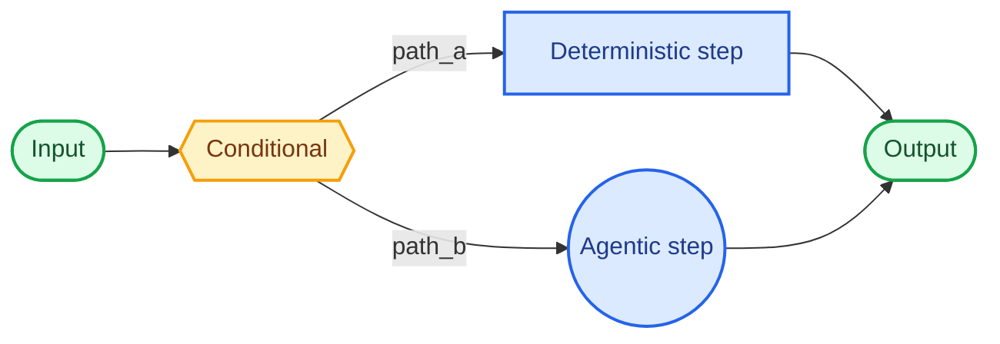
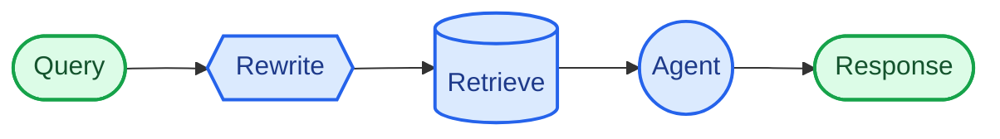

在**自定义工作流**架构中，您可以使用 [LangGraph](/oss/python/langgraph/overview) 定义自己的定制执行流程。您完全控制图结构——包括顺序步骤、条件分支、循环和并行执行。



## 关键特性

* 完全控制图结构
* 混合确定性逻辑与智能体行为
* 支持顺序步骤、条件分支、循环和并行执行
* 将其他模式嵌入为工作流中的节点

## 使用场景

当标准模式（子智能体、技能等）不符合您的需求，或者您需要混合确定性逻辑与智能体行为，或者您的用例需要复杂路由或多阶段处理时，使用自定义工作流。

工作流中的每个节点可以是一个简单函数、一个 LLM 调用，或者一个包含[工具](/oss/python/langchain/tools)的完整[智能体](/oss/python/langchain/agents)。您还可以在自定义工作流中组合其他架构——例如，将多智能体系统嵌入为单个节点。

有关自定义工作流的完整示例，请参阅下面的教程。

<Card
    title="教程：使用路由构建多源知识库"
    icon="book"
    href="/oss/python/langchain/multi-agent/router-knowledge-base"
    arrow cta="了解更多"
>
    [路由模式](/oss/python/langchain/multi-agent/router) 是自定义工作流的一个示例。本教程逐步指导您构建一个路由器，该路由器并行查询 GitHub、Notion 和 Slack，然后综合结果。
>
</Card>

## 基本实现

核心思路是，您可以在任何 LangGraph 节点内直接调用 LangChain 智能体，将自定义工作流的灵活性与预构建智能体的便利性相结合：

```python
from langchain.agents import create_agent
from langgraph.graph import StateGraph, START, END

agent = create_agent(model="openai:gpt-4.1", tools=[...])

def agent_node(state: State) -> dict:
    """一个调用 LangChain 智能体的 LangGraph 节点。"""
    result = agent.invoke({
        "messages": [{"role": "user", "content": state["query"]}]
    })
    return {"answer": result["messages"][-1].content}

# 构建一个简单的工作流
workflow = (
    StateGraph(State)
    .add_node("agent", agent_node)
    .add_edge(START, "agent")
    .add_edge("agent", END)
    .compile()
)
```


## 示例：RAG 流水线

一个常见的用例是将[检索](/oss/python/langchain/retrieval)与智能体相结合。此示例构建了一个 WNBA 统计助手，该助手从知识库检索并可以获取实时新闻。

<Accordion title="自定义 RAG 工作流">

该工作流演示了三种类型的节点：

- **模型节点**（重写）：使用[结构化输出](/oss/python/langchain/structured-output)重写用户查询以获得更好的检索。
- **确定性节点**（检索）：执行向量相似性搜索——不涉及 LLM。
- **智能体节点**（智能体）：对检索到的上下文进行推理，并可以通过工具获取额外信息。



<Tip>
您可以使用 LangGraph 状态在工作流步骤之间传递信息。这允许工作流的每个部分读取和更新结构化字段，从而轻松地在节点之间共享数据和上下文。
</Tip>

```python
from typing import TypedDict
from pydantic import BaseModel
from langgraph.graph import StateGraph, START, END
from langchain.agents import create_agent
from langchain.tools import tool
from langchain_openai import ChatOpenAI, OpenAIEmbeddings
from langchain_core.vectorstores import InMemoryVectorStore

class State(TypedDict):
    question: str
    rewritten_query: str
    documents: list[str]
    answer: str

# WNBA 知识库，包含阵容、比赛结果和球员统计数据
embeddings = OpenAIEmbeddings()
vector_store = InMemoryVectorStore(embeddings)
vector_store.add_texts([
    # 阵容
    "New York Liberty 2024 阵容: Breanna Stewart, Sabrina Ionescu, Jonquel Jones, Courtney Vandersloot.",
    "Las Vegas Aces 2024 阵容: A'ja Wilson, Kelsey Plum, Jackie Young, Chelsea Gray.",
    "Indiana Fever 2024 阵容: Caitlin Clark, Aliyah Boston, Kelsey Mitchell, NaLyssa Smith.",
    # 比赛结果
    "2024 WNBA 总决赛: New York Liberty 击败 Minnesota Lynx 3-2 赢得冠军。",
    "2024年6月15日: Indiana Fever 85, Chicago Sky 79。Caitlin Clark 得到 23 分和 8 次助攻。",
    "2024年8月20日: Las Vegas Aces 92, Phoenix Mercury 84。A'ja Wilson 得到 35 分。",
    # 球员统计数据
    "A'ja Wilson 2024 赛季统计数据: 26.9 PPG, 11.9 RPG, 2.6 BPG。赢得 MVP 奖项。",
    "Caitlin Clark 2024 新秀统计数据: 19.2 PPG, 8.4 APG, 5.7 RPG。赢得年度最佳新秀。",
    "Breanna Stewart 2024 统计数据: 20.4 PPG, 8.5 RPG, 3.5 APG。",
])
retriever = vector_store.as_retriever(search_kwargs={"k": 5})

@tool
def get_latest_news(query: str) -> str:
    """获取最新的 WNBA 新闻和更新。"""
    # 在此放置您的新闻 API
    return "最新消息：WNBA 宣布了 2025 年扩大的季后赛赛制..."

agent = create_agent(
    model="openai:gpt-4.1",
    tools=[get_latest_news],
)

model = ChatOpenAI(model="gpt-4.1")

class RewrittenQuery(BaseModel):
    query: str

def rewrite_query(state: State) -> dict:
    """重写用户查询以获得更好的检索。"""
    system_prompt = """重写此查询以检索相关的 WNBA 信息。
知识库包含：球队阵容、带比分的比赛结果以及球员统计数据（PPG、RPG、APG）。
重点关注提到的特定球员姓名、球队名称或统计类别。"""
    response = model.with_structured_output(RewrittenQuery).invoke([
        {"role": "system", "content": system_prompt},
        {"role": "user", "content": state["question"]}
    ])
    return {"rewritten_query": response.query}

def retrieve(state: State) -> dict:
    """基于重写的查询检索文档。"""
    docs = retriever.invoke(state["rewritten_query"])
    return {"documents": [doc.page_content for doc in docs]}

def call_agent(state: State) -> dict:
    """使用检索到的上下文生成答案。"""
    context = "\n\n".join(state["documents"])
    prompt = f"Context:\n{context}\n\nQuestion: {state['question']}"
    response = agent.invoke({"messages": [{"role": "user", "content": prompt}]})
    return {"answer": response["messages"][-1].content_blocks}

workflow = (
    StateGraph(State)
    .add_node("rewrite", rewrite_query)
    .add_node("retrieve", retrieve)
    .add_node("agent", call_agent)
    .add_edge(START, "rewrite")
    .add_edge("rewrite", "retrieve")
    .add_edge("retrieve", "agent")
    .add_edge("agent", END)
    .compile()
)

result = workflow.invoke({"question": "Who won the 2024 WNBA Championship?"})
print(result["answer"])
```


</Accordion>

---

<div className="source-links">
<Callout icon="edit">
    [在 GitHub 上编辑此页面](https://github.com/langchain-ai/docs/edit/main/src/oss/langchain/multi-agent/custom-workflow.mdx) 或[提交问题](https://github.com/langchain-ai/docs/issues/new/choose)。
</Callout>
<Callout icon="terminal-2">
    [通过 MCP 将这些文档连接到 Claude、VSCode 等](/use-these-docs) 以获取实时答案。
</Callout>
</div>