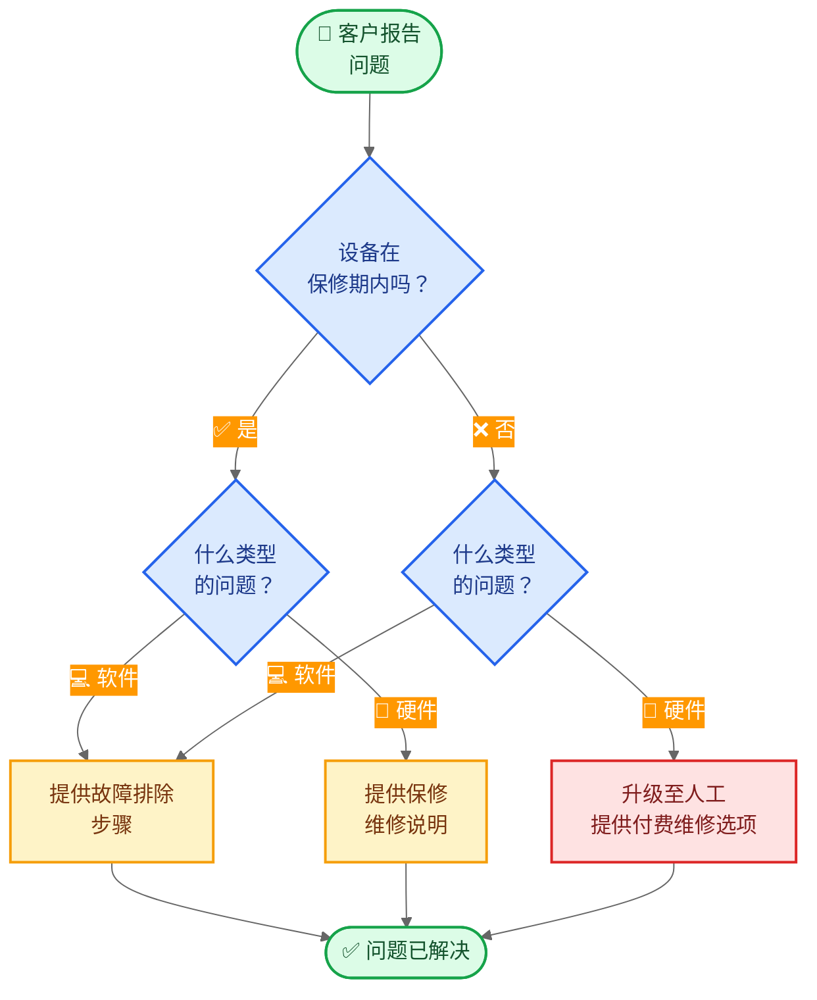

import ChatModelTabsPy from '/snippets/chat-model-tabs.mdx';
import ChatModelTabsJs from '/snippets/chat-model-tabs-js.mdx';

[状态机模式](/oss/python/langchain/multi-agent/handoffs)描述了代理行为随着任务的不同状态而变化的工作流。本教程演示如何通过工具调用动态更改单个代理配置来实现状态机——根据当前状态更新其可用工具和指令。状态可以从多个来源确定：代理过去的操作（工具调用）、外部状态（如 API 调用结果），甚至初始用户输入（例如，通过运行分类器来确定用户意图）。

在本教程中，你将构建一个客户支持代理，该代理将执行以下操作：

- 在继续之前收集保修信息。
- 将问题分类为硬件或软件。
- 提供解决方案或升级至人工支持。
- 在多轮对话中维护对话状态。

与[子代理模式](/oss/python/langchain/multi-agent/subagents-personal-assistant)（子代理作为工具被调用）不同，**状态机模式**使用一个代理，其配置根据工作流进度而变化。每个"步骤"只是同一底层代理的不同配置（系统提示 + 工具），根据状态动态选择。

以下是我们将要构建的工作流：



## 安装与配置

### 安装

本教程需要 `langchain` 包：

<CodeGroup>
```bash pip
pip install langchain
```
```bash uv
uv add langchain
```
```bash conda
conda install langchain -c conda-forge
```
</CodeGroup>


更多详情，请参阅[安装指南](/oss/python/langchain/install)。

### LangSmith

设置 [LangSmith](https://smith.langchain.com) 以检查代理内部发生的情况。然后设置以下环境变量：

<CodeGroup>
```bash bash
export LANGSMITH_TRACING="true"
export LANGSMITH_API_KEY="..."
```
```python python
import getpass
import os

os.environ["LANGSMITH_TRACING"] = "true"
os.environ["LANGSMITH_API_KEY"] = getpass.getpass()
```
</CodeGroup>


### 选择 LLM

从 LangChain 的集成套件中选择一个聊天模型：

<ChatModelTabsPy />


## 1. 定义自定义状态

首先，定义一个跟踪当前活动步骤的自定义状态模式：

```python
from langchain.agents import AgentState
from typing_extensions import NotRequired
from typing import Literal

# Define the possible workflow steps
SupportStep = Literal["warranty_collector", "issue_classifier", "resolution_specialist"]  # [!code highlight]

class SupportState(AgentState):  # [!code highlight]
    """State for customer support workflow."""
    current_step: NotRequired[SupportStep]  # [!code highlight]
    warranty_status: NotRequired[Literal["in_warranty", "out_of_warranty"]]
    issue_type: NotRequired[Literal["hardware", "software"]]
```


`current_step` 字段是状态机模式的核心——它决定了每轮加载哪种配置（提示 + 工具）。

## 2. 创建管理工作流状态的工具

创建更新工作流状态的工具。这些工具允许代理记录信息并转换到下一步。

关键在于使用 `Command` 来更新状态，包括 `current_step` 字段：

```python
from langchain.tools import tool, ToolRuntime
from langchain.messages import ToolMessage
from langgraph.types import Command

@tool
def record_warranty_status(
    status: Literal["in_warranty", "out_of_warranty"],
    runtime: ToolRuntime[None, SupportState],
) -> Command:  # [!code highlight]
    """Record the customer's warranty status and transition to issue classification."""
    return Command(  # [!code highlight]
        update={  # [!code highlight]
            "messages": [
                ToolMessage(
                    content=f"Warranty status recorded as: {status}",
                    tool_call_id=runtime.tool_call_id,
                )
            ],
            "warranty_status": status,
            "current_step": "issue_classifier",  # [!code highlight]
        }
    )


@tool
def record_issue_type(
    issue_type: Literal["hardware", "software"],
    runtime: ToolRuntime[None, SupportState],
) -> Command:  # [!code highlight]
    """Record the type of issue and transition to resolution specialist."""
    return Command(  # [!code highlight]
        update={  # [!code highlight]
            "messages": [
                ToolMessage(
                    content=f"Issue type recorded as: {issue_type}",
                    tool_call_id=runtime.tool_call_id,
                )
            ],
            "issue_type": issue_type,
            "current_step": "resolution_specialist",  # [!code highlight]
        }
    )


@tool
def escalate_to_human(reason: str) -> str:
    """Escalate the case to a human support specialist."""
    # In a real system, this would create a ticket, notify staff, etc.
    return f"Escalating to human support. Reason: {reason}"


@tool
def provide_solution(solution: str) -> str:
    """Provide a solution to the customer's issue."""
    return f"Solution provided: {solution}"
```


注意 `record_warranty_status` 和 `record_issue_type` 如何返回 `Command` 对象，该对象同时更新数据（`warranty_status`、`issue_type`）和 `current_step`。这就是状态机的工作方式——工具控制工作流的进展。

## 3. 定义步骤配置

为每个步骤定义提示和工具。首先，定义每个步骤的提示：

<Accordion title="查看完整提示定义">

```python
# Define prompts as constants for easy reference
WARRANTY_COLLECTOR_PROMPT = """You are a customer support agent helping with device issues.

CURRENT STAGE: Warranty verification

At this step, you need to:
1. Greet the customer warmly
2. Ask if their device is under warranty
3. Use record_warranty_status to record their response and move to the next step

Be conversational and friendly. Don't ask multiple questions at once."""

ISSUE_CLASSIFIER_PROMPT = """You are a customer support agent helping with device issues.

CURRENT STAGE: Issue classification
CUSTOMER INFO: Warranty status is {warranty_status}

At this step, you need to:
1. Ask the customer to describe their issue
2. Determine if it's a hardware issue (physical damage, broken parts) or software issue (app crashes, performance)
3. Use record_issue_type to record the classification and move to the next step

If unclear, ask clarifying questions before classifying."""

RESOLUTION_SPECIALIST_PROMPT = """You are a customer support agent helping with device issues.

CURRENT STAGE: Resolution
CUSTOMER INFO: Warranty status is {warranty_status}, issue type is {issue_type}

At this step, you need to:
1. For SOFTWARE issues: provide troubleshooting steps using provide_solution
2. For HARDWARE issues:
   - If IN WARRANTY: explain warranty repair process using provide_solution
   - If OUT OF WARRANTY: escalate_to_human for paid repair options

Be specific and helpful in your solutions."""
```


</Accordion>

然后使用字典将步骤名称映射到其配置：

```python
# Step configuration: maps step name to (prompt, tools, required_state)
STEP_CONFIG = {
    "warranty_collector": {
        "prompt": WARRANTY_COLLECTOR_PROMPT,
        "tools": [record_warranty_status],
        "requires": [],
    },
    "issue_classifier": {
        "prompt": ISSUE_CLASSIFIER_PROMPT,
        "tools": [record_issue_type],
        "requires": ["warranty_status"],
    },
    "resolution_specialist": {
        "prompt": RESOLUTION_SPECIALIST_PROMPT,
        "tools": [provide_solution, escalate_to_human],
        "requires": ["warranty_status", "issue_type"],
    },
}
```


这种基于字典的配置使得以下操作变得简单：
- 一眼看出所有步骤
- 添加新步骤（只需添加另一个条目）
- 理解工作流依赖关系（`requires` 字段）
- 使用带有状态变量的提示模板（例如，`{warranty_status}`）

## 4. 创建基于步骤的中间件

创建从状态中读取 `current_step` 并应用相应配置的中间件。我们将使用 `@wrap_model_call` 装饰器实现简洁的实现：

```python
from langchain.agents.middleware import wrap_model_call, ModelRequest, ModelResponse
from typing import Callable


@wrap_model_call  # [!code highlight]
def apply_step_config(
    request: ModelRequest,
    handler: Callable[[ModelRequest], ModelResponse],
) -> ModelResponse:
    """Configure agent behavior based on the current step."""
    # Get current step (defaults to warranty_collector for first interaction)
    current_step = request.state.get("current_step", "warranty_collector")  # [!code highlight]

    # Look up step configuration
    stage_config = STEP_CONFIG[current_step]  # [!code highlight]

    # Validate required state exists
    for key in stage_config["requires"]:
        if request.state.get(key) is None:
            raise ValueError(f"{key} must be set before reaching {current_step}")

    # Format prompt with state values (supports {warranty_status}, {issue_type}, etc.)
    system_prompt = stage_config["prompt"].format(**request.state)

    # Inject system prompt and step-specific tools
    request = request.override(  # [!code highlight]
        system_prompt=system_prompt,  # [!code highlight]
        tools=stage_config["tools"],  # [!code highlight]
    )

    return handler(request)
```


此中间件：

1. **读取当前步骤**：从状态中获取 `current_step`（默认为 "warranty_collector"）。
2. **查找配置**：在 `STEP_CONFIG` 中找到匹配的条目。
3. **验证依赖**：确保所需的状态字段存在。
4. **格式化提示**：将状态值注入提示模板。
5. **应用配置**：覆盖系统提示和可用工具。

`request.override()` 方法是关键——它允许我们根据状态动态更改代理的行为，而无需创建单独的代理实例。

## 5. 创建代理

现在使用基于步骤的中间件和用于状态持久化的检查点创建代理：

```python
from langchain.agents import create_agent
from langgraph.checkpoint.memory import InMemorySaver

# Collect all tools from all step configurations
all_tools = [
    record_warranty_status,
    record_issue_type,
    provide_solution,
    escalate_to_human,
]

# Create the agent with step-based configuration
agent = create_agent(
    model,
    tools=all_tools,
    state_schema=SupportState,  # [!code highlight]
    middleware=[apply_step_config],  # [!code highlight]
    checkpointer=InMemorySaver(),  # [!code highlight]
)
```


<Note>
**为什么需要检查点？** 检查点在对话轮次之间维护状态。没有它，`current_step` 状态将在用户消息之间丢失，从而破坏工作流。
</Note>

## 6. 测试工作流

测试完整的工作流：

```python
from langchain.messages import HumanMessage
import uuid

# Configuration for this conversation thread
thread_id = str(uuid.uuid4())
config = {"configurable": {"thread_id": thread_id}}

# Turn 1: Initial message - starts with warranty_collector step
print("=== Turn 1: Warranty Collection ===")
result = agent.invoke(
    {"messages": [HumanMessage("Hi, my phone screen is cracked")]},
    config
)
for msg in result['messages']:
    msg.pretty_print()

# Turn 2: User responds about warranty
print("\n=== Turn 2: Warranty Response ===")
result = agent.invoke(
    {"messages": [HumanMessage("Yes, it's still under warranty")]},
    config
)
for msg in result['messages']:
    msg.pretty_print()
print(f"Current step: {result.get('current_step')}")

# Turn 3: User describes the issue
print("\n=== Turn 3: Issue Description ===")
result = agent.invoke(
    {"messages": [HumanMessage("The screen is physically cracked from dropping it")]},
    config
)
for msg in result['messages']:
    msg.pretty_print()
print(f"Current step: {result.get('current_step')}")

# Turn 4: Resolution
print("\n=== Turn 4: Resolution ===")
result = agent.invoke(
    {"messages": [HumanMessage("What should I do?")]},
    config
)
for msg in result['messages']:
    msg.pretty_print()
```


预期流程：
1. **保修验证步骤**：询问保修状态
2. **问题分类步骤**：询问问题，确定为硬件问题
3. **解决步骤**：提供保修维修说明

## 7. 理解状态转换

让我们追踪每轮发生的情况：

### 第 1 轮：初始消息

```python
{
    "messages": [HumanMessage("Hi, my phone screen is cracked")],
    "current_step": "warranty_collector"  # Default value
}
```


中间件应用：
- 系统提示：`WARRANTY_COLLECTOR_PROMPT`
- 工具：`[record_warranty_status]`

### 第 2 轮：记录保修后

工具调用：`record_warranty_status("in_warranty")` 返回：
```python
Command(update={
    "warranty_status": "in_warranty",
    "current_step": "issue_classifier"  # State transition!
})
```


下一轮，中间件应用：
- 系统提示：`ISSUE_CLASSIFIER_PROMPT`（格式化为 `warranty_status="in_warranty"`）
- 工具：`[record_issue_type]`

### 第 3 轮：分类问题后

工具调用：`record_issue_type("hardware")` 返回：
```python
Command(update={
    "issue_type": "hardware",
    "current_step": "resolution_specialist"  # State transition!
})
```


下一轮，中间件应用：
- 系统提示：`RESOLUTION_SPECIALIST_PROMPT`（格式化为 `warranty_status` 和 `issue_type`）
- 工具：`[provide_solution, escalate_to_human]`

关键洞察：**工具通过更新 `current_step` 来驱动工作流**，而**中间件响应**是在下一轮应用相应的配置。

## 8. 管理消息历史

随着代理在各步骤中推进，消息历史会增长。使用[摘要中间件](/oss/python/langchain/short-term-memory#summarize-messages)压缩早期消息，同时保留对话上下文：

```python
from langchain.agents import create_agent
from langchain.agents.middleware import SummarizationMiddleware  # [!code highlight]
from langgraph.checkpoint.memory import InMemorySaver

agent = create_agent(
    model,
    tools=all_tools,
    state_schema=SupportState,
    middleware=[
        apply_step_config,
        SummarizationMiddleware(  # [!code highlight]
            model="gpt-4.1-mini",
            trigger=("tokens", 4000),
            keep=("messages", 10)
        )
    ],
    checkpointer=InMemorySaver(),
)
```


有关其他内存管理技术，请参阅[短期记忆指南](/oss/python/langchain/short-term-memory)。

## 9. 增加灵活性：回退

某些工作流需要允许用户返回到之前的步骤以纠正信息（例如，更改保修状态或问题分类）。但并非所有转换都合理——例如，一旦退款处理完毕，通常就无法回退。对于此支持工作流，我们将添加返回到保修验证和问题分类步骤的工具。

<Tip>
如果你的工作流需要在大多数步骤之间进行任意转换，考虑是否真的需要结构化工作流。这种模式在步骤遵循清晰的顺序进展且偶尔需要向后转换进行纠正时效果最佳。
</Tip>

将"回退"工具添加到解决步骤：

```python
@tool
def go_back_to_warranty() -> Command:  # [!code highlight]
    """Go back to warranty verification step."""
    return Command(update={"current_step": "warranty_collector"})  # [!code highlight]


@tool
def go_back_to_classification() -> Command:  # [!code highlight]
    """Go back to issue classification step."""
    return Command(update={"current_step": "issue_classifier"})  # [!code highlight]


# Update the resolution_specialist configuration to include these tools
STEP_CONFIG["resolution_specialist"]["tools"].extend([
    go_back_to_warranty,
    go_back_to_classification
])
```


更新解决专家的提示以提及这些工具：

```python
RESOLUTION_SPECIALIST_PROMPT = """You are a customer support agent helping with device issues.

CURRENT STAGE: Resolution
CUSTOMER INFO: Warranty status is {warranty_status}, issue type is {issue_type}

At this step, you need to:
1. For SOFTWARE issues: provide troubleshooting steps using provide_solution
2. For HARDWARE issues:
   - If IN WARRANTY: explain warranty repair process using provide_solution
   - If OUT OF WARRANTY: escalate_to_human for paid repair options

If the customer indicates any information was wrong, use:
- go_back_to_warranty to correct warranty status
- go_back_to_classification to correct issue type

Be specific and helpful in your solutions."""
```


现在代理可以处理纠正：

```python
result = agent.invoke(
    {"messages": [HumanMessage("Actually, I made a mistake - my device is out of warranty")]},
    config
)
# Agent will call go_back_to_warranty and restart the warranty verification step
```


## 完整示例

以下是可运行脚本中的所有内容：

<Expandable title="完整代码" defaultOpen={false}>
```python
"""
Customer Support State Machine Example

This example demonstrates the state machine pattern.
A single agent dynamically changes its behavior based on the current_step state,
creating a state machine for sequential information collection.
"""

import uuid

from langgraph.checkpoint.memory import InMemorySaver
from langgraph.types import Command
from typing import Callable, Literal
from typing_extensions import NotRequired

from langchain.agents import AgentState, create_agent
from langchain.agents.middleware import wrap_model_call, ModelRequest, ModelResponse, SummarizationMiddleware
from langchain.chat_models import init_chat_model
from langchain.messages import HumanMessage, ToolMessage
from langchain.tools import tool, ToolRuntime

model = init_chat_model("anthropic:claude-3-5-sonnet-latest")


# Define the possible workflow steps
SupportStep = Literal["warranty_collector", "issue_classifier", "resolution_specialist"]


class SupportState(AgentState):
    """State for customer support workflow."""

    current_step: NotRequired[SupportStep]
    warranty_status: NotRequired[Literal["in_warranty", "out_of_warranty"]]
    issue_type: NotRequired[Literal["hardware", "software"]]


@tool
def record_warranty_status(
    status: Literal["in_warranty", "out_of_warranty"],
    runtime: ToolRuntime[None, SupportState],
) -> Command:
    """Record the customer's warranty status and transition to issue classification."""
    return Command(
        update={
            "messages": [
                ToolMessage(
                    content=f"Warranty status recorded as: {status}",
                    tool_call_id=runtime.tool_call_id,
                )
            ],
            "warranty_status": status,
            "current_step": "issue_classifier",
        }
    )


@tool
def record_issue_type(
    issue_type: Literal["hardware", "software"],
    runtime: ToolRuntime[None, SupportState],
) -> Command:
    """Record the type of issue and transition to resolution specialist."""
    return Command(
        update={
            "messages": [
                ToolMessage(
                    content=f"Issue type recorded as: {issue_type}",
                    tool_call_id=runtime.tool_call_id,
                )
            ],
            "issue_type": issue_type,
            "current_step": "resolution_specialist",
        }
    )


@tool
def escalate_to_human(reason: str) -> str:
    """Escalate the case to a human support specialist."""
    # In a real system, this would create a ticket, notify staff, etc.
    return f"Escalating to human support. Reason: {reason}"


@tool
def provide_solution(solution: str) -> str:
    """Provide a solution to the customer's issue."""
    return f"Solution provided: {solution}"


# Define prompts as constants
WARRANTY_COLLECTOR_PROMPT = """You are a customer support agent helping with device issues.

CURRENT STEP: Warranty verification

At this step, you need to:
1. Greet the customer warmly
2. Ask if their device is under warranty
3. Use record_warranty_status to record their response and move to the next step

Be conversational and friendly. Don't ask multiple questions at once."""

ISSUE_CLASSIFIER_PROMPT = """You are a customer support agent helping with device issues.

CURRENT STEP: Issue classification
CUSTOMER INFO: Warranty status is {warranty_status}

At this step, you need to:
1. Ask the customer to describe their issue
2. Determine if it's a hardware issue (physical damage, broken parts) or software issue (app crashes, performance)
3. Use record_issue_type to record the classification and move to the next step

If unclear, ask clarifying questions before classifying."""

RESOLUTION_SPECIALIST_PROMPT = """You are a customer support agent helping with device issues.

CURRENT STEP: Resolution
CUSTOMER INFO: Warranty status is {warranty_status}, issue type is {issue_type}

At this step, you need to:
1. For SOFTWARE issues: provide troubleshooting steps using provide_solution
2. For HARDWARE issues:
   - If IN WARRANTY: explain warranty repair process using provide_solution
   - If OUT OF WARRANTY: escalate_to_human for paid repair options

Be specific and helpful in your solutions."""


# Step configuration: maps step name to (prompt, tools, required_state)
STEP_CONFIG = {
    "warranty_collector": {
        "prompt": WARRANTY_COLLECTOR_PROMPT,
        "tools": [record_warranty_status],
        "requires": [],
    },
    "issue_classifier": {
        "prompt": ISSUE_CLASSIFIER_PROMPT,
        "tools": [record_issue_type],
        "requires": ["warranty_status"],
    },
    "resolution_specialist": {
        "prompt": RESOLUTION_SPECIALIST_PROMPT,
        "tools": [provide_solution, escalate_to_human],
        "requires": ["warranty_status", "issue_type"],
    },
}


@wrap_model_call
def apply_step_config(
    request: ModelRequest,
    handler: Callable[[ModelRequest], ModelResponse],
) -> ModelResponse:
    """Configure agent behavior based on the current step."""
    # Get current step (defaults to warranty_collector for first interaction)
    current_step = request.state.get("current_step", "warranty_collector")

    # Look up step configuration
    step_config = STEP_CONFIG[current_step]

    # Validate required state exists
    for key in step_config["requires"]:
        if request.state.get(key) is None:
            raise ValueError(f"{key} must be set before reaching {current_step}")

    # Format prompt with state values
    system_prompt = step_config["prompt"].format(**request.state)

    # Inject system prompt and step-specific tools
    request = request.override(
        system_prompt=system_prompt,
        tools=step_config["tools"],
    )

    return handler(request)


# Collect all tools from all step configurations
all_tools = [
    record_warranty_status,
    record_issue_type,
    provide_solution,
    escalate_to_human,
]

# Create the agent with step-based configuration and summarization
agent = create_agent(
    model,
    tools=all_tools,
    state_schema=SupportState,
    middleware=[
        apply_step_config,
        SummarizationMiddleware(
            model="gpt-4.1-mini",
            trigger=("tokens", 4000),
            keep=("messages", 10)
        )
    ],
    checkpointer=InMemorySaver(),
)


# ============================================================================
# Test the workflow
# ============================================================================

if __name__ == "__main__":
    thread_id = str(uuid.uuid4())
    config = {"configurable": {"thread_id": thread_id}}

    result = agent.invoke(
        {"messages": [HumanMessage("Hi, my phone screen is cracked")]},
        config
    )

    result = agent.invoke(
        {"messages": [HumanMessage("Yes, it's still under warranty")]},
        config
    )

    result = agent.invoke(
        {"messages": [HumanMessage("The screen is physically cracked from dropping it")]},
        config
    )

    result = agent.invoke(
        {"messages": [HumanMessage("What should I do?")]},
        config
    )
    for msg in result['messages']:
        msg.pretty_print()
```


</Expandable>

## 后续步骤

- 了解[子代理模式](/oss/python/langchain/multi-agent/subagents-personal-assistant)的集中式编排
- 探索[中间件](/oss/python/langchain/middleware)以实现更动态的行为
- 阅读[多代理概述](/oss/python/langchain/multi-agent)以比较不同模式
- 使用 [LangSmith](https://smith.langchain.com) 调试和监控你的多代理系统

---

<div className="source-links">
<Callout icon="edit">
    [Edit this page on GitHub](https://github.com/langchain-ai/docs/edit/main/src/oss/langchain/multi-agent/handoffs-customer-support.mdx) or [file an issue](https://github.com/langchain-ai/docs/issues/new/choose).
</Callout>
<Callout icon="terminal-2">
    [Connect these docs](/use-these-docs) to Claude, VSCode, and more via MCP for real-time answers.
</Callout>
</div>
