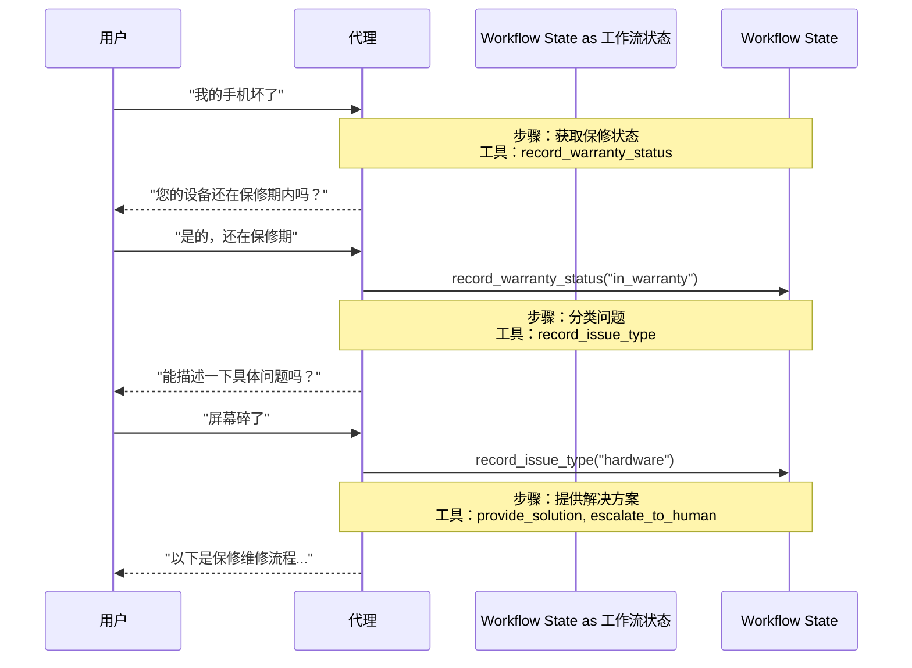

在 **交接（handoffs）** 架构中，行为会根据状态动态改变。核心机制是：[工具](/oss/python/langchain/tools)更新一个状态变量（例如 `current_step` 或 `active_agent`），该变量在多轮对话中持久存在，系统读取此变量来调整行为——要么应用不同的配置（系统提示词、工具），要么路由到不同的[代理](/oss/python/langchain/agents)。此模式同时支持不同代理之间的交接，以及单个代理内的动态配置变更。

<Tip>
**交接（handoffs）** 这一术语由 [OpenAI](https://openai.github.io/openai-agents-python/handoffs/) 提出，用于通过工具调用（例如 `transfer_to_sales_agent`）在代理或状态之间转移控制权。
</Tip>



## 核心特征

* 状态驱动的行为：行为根据状态变量（例如 `current_step` 或 `active_agent`）的变化而改变
* 基于工具的状态转换：工具更新状态变量以在不同状态之间切换
* 直接用户交互：每个状态的配置直接处理用户消息
* 持久化状态：状态在多轮对话中持续存在

## 适用场景

当您需要强制执行顺序约束（仅在满足前置条件后才解锁某些能力）、代理需要在不同状态下直接与用户对话，或者正在构建多阶段对话流程时，请使用交接模式。该模式对于客户支持场景尤为有价值——例如需要按特定顺序收集信息的场景，如在处理退款之前先收集保修 ID。

## 基础实现

核心机制是一个[工具](/oss/python/langchain/tools)，它返回一个 [`Command`](/oss/python/langgraph/graph-api#command) 来更新状态，从而触发到新步骤或代理的转换：

```python
from langchain.tools import tool
from langchain.messages import ToolMessage
from langgraph.types import Command

@tool
def transfer_to_specialist(runtime) -> Command:
    """Transfer to the specialist agent."""
    return Command(
        update={
            "messages": [
                ToolMessage(  # [!code highlight]
                    content="Transferred to specialist",
                    tool_call_id=runtime.tool_call_id  # [!code highlight]
                )
            ],
            "current_step": "specialist"  # Triggers behavior change
        }
    )
```


<Note>
**为什么要包含 `ToolMessage`？** 当 LLM 调用工具时，它期望收到响应。带有匹配 `tool_call_id` 的 `ToolMessage` 完成了这个请求-响应循环——没有它，对话历史将变得格式错误。每当您的交接工具更新消息时，这都是必需的。
</Note>

完整的实现请参阅下方教程。

<Card
    title="教程：使用交接模式构建客户支持系统"
    icon="users"
    href="/oss/python/langchain/multi-agent/handoffs-customer-support"
    arrow cta="了解更多"
>
    学习如何使用交接模式构建客户支持代理，其中单个代理在不同配置之间切换。
</Card>

## 实现方式

实现交接有两种方式：**[带中间件的单代理](#single-agent-with-middleware)**（一个代理具有动态配置）或**[多代理子图](#multiple-agent-subgraphs)**（各自独立的代理作为图节点）。

### 带中间件的单代理

单个代理根据状态改变其行为。中间件拦截每次模型调用并动态调整系统提示词和可用工具。工具更新状态变量以触发状态转换：

```python
from langchain.tools import ToolRuntime, tool
from langchain.messages import ToolMessage
from langgraph.types import Command

@tool
def record_warranty_status(
    status: str,
    runtime: ToolRuntime[None, SupportState]
) -> Command:
    """Record warranty status and transition to next step."""
    return Command(
        update={
            "messages": [
                ToolMessage(
                    content=f"Warranty status recorded: {status}",
                    tool_call_id=runtime.tool_call_id
                )
            ],
            "warranty_status": status,
            "current_step": "specialist"  # Update state to trigger transition
        }
    )
```


<Accordion title="完整示例：带中间件的客户支持">

```python
from langchain.agents import AgentState, create_agent
from langchain.agents.middleware import wrap_model_call, ModelRequest, ModelResponse
from langchain.tools import tool, ToolRuntime
from langchain.messages import ToolMessage
from langgraph.types import Command
from typing import Callable

# 1. Define state with current_step tracker
class SupportState(AgentState):  # [!code highlight]
    """Track which step is currently active."""
    current_step: str = "triage"  # [!code highlight]
    warranty_status: str | None = None

# 2. Tools update current_step via Command
@tool
def record_warranty_status(
    status: str,
    runtime: ToolRuntime[None, SupportState]
) -> Command:  # [!code highlight]
    """Record warranty status and transition to next step."""
    return Command(update={  # [!code highlight]
        "messages": [  # [!code highlight]
            ToolMessage(
                content=f"Warranty status recorded: {status}",
                tool_call_id=runtime.tool_call_id
            )
        ],
        "warranty_status": status,
        # Transition to next step
        "current_step": "specialist"    # [!code highlight]
    })

# 3. Middleware applies dynamic configuration based on current_step
@wrap_model_call  # [!code highlight]
def apply_step_config(
    request: ModelRequest,
    handler: Callable[[ModelRequest], ModelResponse]
) -> ModelResponse:
    """Configure agent behavior based on current_step."""
    step = request.state.get("current_step", "triage")  # [!code highlight]

    # Map steps to their configurations
    configs = {
        "triage": {
            "prompt": "Collect warranty information...",
            "tools": [record_warranty_status]
        },
        "specialist": {
            "prompt": "Provide solutions based on warranty: {warranty_status}",
            "tools": [provide_solution, escalate]
        }
    }

    config = configs[step]
    request = request.override(  # [!code highlight]
        system_prompt=config["prompt"].format(**request.state),  # [!code highlight]
        tools=config["tools"]  # [!code highlight]
    )
    return handler(request)

# 4. Create agent with middleware
agent = create_agent(
    model,
    tools=[record_warranty_status, provide_solution, escalate],
    state_schema=SupportState,
    middleware=[apply_step_config],  # [!code highlight]
    checkpointer=InMemorySaver()  # Persist state across turns  # [!code highlight]
)
```


</Accordion>

### 多代理子图

多个独立的代理作为图中的独立节点存在。交接工具使用 `Command.PARENT` 来指定下一个要执行的节点，从而在代理节点之间导航。

<Warning>
子图交接需要仔细进行**[上下文工程](/oss/python/langchain/context-engineering)**。与单代理中间件（消息历史自然流动）不同，您必须明确决定哪些消息在代理之间传递。如果处理不当，代理将收到格式错误的对话历史或臃肿的上下文。请参阅下方的[上下文工程](#context-engineering)部分。
</Warning>

```python
from langchain.messages import AIMessage, ToolMessage
from langchain.tools import tool, ToolRuntime
from langgraph.types import Command

@tool
def transfer_to_sales(
    runtime: ToolRuntime,
) -> Command:
    """Transfer to the sales agent."""
    last_ai_message = next(  # [!code highlight]
        msg for msg in reversed(runtime.state["messages"]) if isinstance(msg, AIMessage)  # [!code highlight]
    )  # [!code highlight]
    transfer_message = ToolMessage(  # [!code highlight]
        content="Transferred to sales agent",  # [!code highlight]
        tool_call_id=runtime.tool_call_id,  # [!code highlight]
    )  # [!code highlight]
    return Command(
        goto="sales_agent",
        update={
            "active_agent": "sales_agent",
            "messages": [last_ai_message, transfer_message],  # [!code highlight]
        },
        graph=Command.PARENT
    )
```


<Accordion title="完整示例：带交接的销售与支持代理">

本示例展示了一个具有独立销售代理和支持代理的多代理系统。每个代理都是一个独立的图节点，交接工具允许代理之间相互转移对话。

```python
from typing import Literal

from langchain.agents import AgentState, create_agent
from langchain.messages import AIMessage, ToolMessage
from langchain.tools import tool, ToolRuntime
from langgraph.graph import StateGraph, START, END
from langgraph.types import Command
from typing_extensions import NotRequired


# 1. Define state with active_agent tracker
class MultiAgentState(AgentState):
    active_agent: NotRequired[str]


# 2. Create handoff tools
@tool
def transfer_to_sales(
    runtime: ToolRuntime,
) -> Command:
    """Transfer to the sales agent."""
    last_ai_message = next(  # [!code highlight]
        msg for msg in reversed(runtime.state["messages"]) if isinstance(msg, AIMessage)  # [!code highlight]
    )  # [!code highlight]
    transfer_message = ToolMessage(  # [!code highlight]
        content="Transferred to sales agent from support agent",  # [!code highlight]
        tool_call_id=runtime.tool_call_id,  # [!code highlight]
    )  # [!code highlight]
    return Command(
        goto="sales_agent",
        update={
            "active_agent": "sales_agent",
            "messages": [last_ai_message, transfer_message],  # [!code highlight]
        },
        graph=Command.PARENT,
    )


@tool
def transfer_to_support(
    runtime: ToolRuntime,
) -> Command:
    """Transfer to the support agent."""
    last_ai_message = next(  # [!code highlight]
        msg for msg in reversed(runtime.state["messages"]) if isinstance(msg, AIMessage)  # [!code highlight]
    )  # [!code highlight]
    transfer_message = ToolMessage(  # [!code highlight]
        content="Transferred to support agent from sales agent",  # [!code highlight]
        tool_call_id=runtime.tool_call_id,  # [!code highlight]
    )  # [!code highlight]
    return Command(
        goto="support_agent",
        update={
            "active_agent": "support_agent",
            "messages": [last_ai_message, transfer_message],  # [!code highlight]
        },
        graph=Command.PARENT,
    )


# 3. Create agents with handoff tools
sales_agent = create_agent(
    model="anthropic:claude-sonnet-4-20250514",
    tools=[transfer_to_support],
    system_prompt="You are a sales agent. Help with sales inquiries. If asked about technical issues or support, transfer to the support agent.",
)

support_agent = create_agent(
    model="anthropic:claude-sonnet-4-20250514",
    tools=[transfer_to_sales],
    system_prompt="You are a support agent. Help with technical issues. If asked about pricing or purchasing, transfer to the sales agent.",
)


# 4. Create agent nodes that invoke the agents
def call_sales_agent(state: MultiAgentState) -> Command:
    """Node that calls the sales agent."""
    response = sales_agent.invoke(state)
    return response


def call_support_agent(state: MultiAgentState) -> Command:
    """Node that calls the support agent."""
    response = support_agent.invoke(state)
    return response


# 5. Create router that checks if we should end or continue
def route_after_agent(
    state: MultiAgentState,
) -> Literal["sales_agent", "support_agent", "__end__"]:
    """Route based on active_agent, or END if the agent finished without handoff."""
    messages = state.get("messages", [])

    # Check the last message - if it's an AIMessage without tool calls, we're done
    if messages:
        last_msg = messages[-1]
        if isinstance(last_msg, AIMessage) and not last_msg.tool_calls:  # [!code highlight]
            return "__end__"  # [!code highlight]

    # Otherwise route to the active agent
    active = state.get("active_agent", "sales_agent")
    return active if active else "sales_agent"


def route_initial(
    state: MultiAgentState,
) -> Literal["sales_agent", "support_agent"]:
    """Route to the active agent based on state, default to sales agent."""
    return state.get("active_agent") or "sales_agent"


# 6. Build the graph
builder = StateGraph(MultiAgentState)
builder.add_node("sales_agent", call_sales_agent)
builder.add_node("support_agent", call_support_agent)

# Start with conditional routing based on initial active_agent
builder.add_conditional_edges(START, route_initial, ["sales_agent", "support_agent"])

# After each agent, check if we should end or route to another agent
builder.add_conditional_edges(
    "sales_agent", route_after_agent, ["sales_agent", "support_agent", END]
)
builder.add_conditional_edges(
    "support_agent", route_after_agent, ["sales_agent", "support_agent", END]
)

graph = builder.compile()
result = graph.invoke(
    {
        "messages": [
            {
                "role": "user",
                "content": "Hi, I'm having trouble with my account login. Can you help?",
            }
        ]
    }
)

for msg in result["messages"]:
    msg.pretty_print()
```


</Accordion>

<Tip>
大多数交接用例推荐使用**带中间件的单代理**——它更简单。只有当您需要特定的代理实现（例如，某个节点本身是一个包含反思或检索步骤的复杂图）时，才使用**多代理子图**。
</Tip>

#### 上下文工程

在使用子图交接时，您可以精确控制哪些消息在代理之间流动。这种精确性对于维护有效的对话历史和避免可能混淆下游代理的上下文膨胀至关重要。有关此主题的更多信息，请参阅[上下文工程](/oss/python/langchain/context-engineering)。

**交接过程中的上下文处理**

在代理之间进行交接时，您需要确保对话历史保持有效。LLM 期望工具调用与其响应配对，因此当使用 `Command.PARENT` 将控制权交接给另一个代理时，您必须同时包含以下两项：

1. **包含工具调用的 `AIMessage`**（触发交接的消息）
2. **确认交接的 `ToolMessage`**（对该工具调用的人工响应）

如果没有这种配对，接收代理将看到不完整的对话，可能产生错误或意外行为。

以下示例假设只调用了交接工具（没有并行工具调用）：

```python
@tool
def transfer_to_sales(runtime: ToolRuntime) -> Command:
    # Get the AI message that triggered this handoff
    last_ai_message = runtime.state["messages"][-1]

    # Create an artificial tool response to complete the pair
    transfer_message = ToolMessage(
        content="Transferred to sales agent",
        tool_call_id=runtime.tool_call_id,
    )

    return Command(
        goto="sales_agent",
        update={
            "active_agent": "sales_agent",
            # Pass only these two messages, not the full subagent history
            "messages": [last_ai_message, transfer_message],
        },
        graph=Command.PARENT,
    )
```


<Note>
**为什么不传递所有子代理消息？** 虽然您可以在交接时包含完整的子代理对话，但这通常会造成问题。接收代理可能会被不相关的内部推理所干扰，同时不必要地增加 token 消耗。通过仅传递交接配对，您可以让父图的上下文专注于高层协调。如果接收代理需要额外上下文，请考虑在 ToolMessage 内容中总结子代理的工作，而不是传递原始消息历史。
</Note>

**将控制权还给用户**

当将控制权归还给用户（结束代理的轮次）时，请确保最终消息是 `AIMessage`。这可以维护有效的对话历史，并向用户界面发出代理已完成工作的信号。

## 实现注意事项

在设计您的多代理系统时，请考虑：

* **上下文过滤策略**：每个代理是否接收完整的对话历史、经过过滤的部分内容还是摘要？根据代理的角色，不同代理可能需要不同的上下文。
* **工具语义**：明确交接工具是否仅更新路由状态，还是也执行副作用操作。例如，`transfer_to_sales()` 是否应该同时创建支持工单，还是应该将其作为单独的操作？
* **Token 效率**：在上下文完整性与 token 成本之间取得平衡。随着对话变长，摘要和选择性上下文传递变得越来越重要。

---

<div className="source-links">
<Callout icon="edit">
    [在 GitHub 上编辑此页面](https://github.com/langchain-ai/docs/edit/main/src/oss/langchain/multi-agent/handoffs.mdx) 或[提交问题](https://github.com/langchain-ai/docs/issues/new/choose)。
</Callout>
<Callout icon="terminal-2">
    [连接这些文档](/use-these-docs)到 Claude、VSCode 等，通过 MCP 获取实时解答。
</Callout>
</div>
