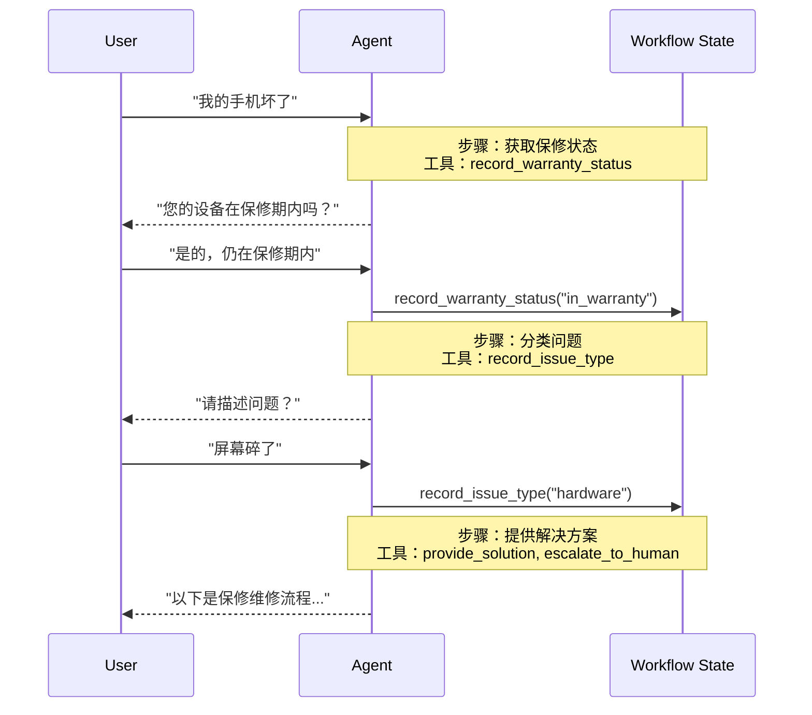

在**手动交接**架构中，行为会根据状态动态变化。其核心机制是：[工具](/oss/python/langchain/tools) 更新一个状态变量（例如 `current_step` 或 `active_agent`），该变量在多个轮次中持久存在，系统读取此变量以调整行为——要么应用不同的配置（系统提示、工具），要么路由到不同的[代理](/oss/python/langchain/agents)。此模式支持不同代理之间的手动交接，以及单个代理内的动态配置更改。

<Tip>
  术语**手动交接**由
  [OpenAI](https://openai.github.io/openai-agents-python/handoffs/)
  创造，用于使用工具调用（例如
  `transfer_to_sales_agent`）在代理或状态之间转移控制权。
</Tip>



## 关键特性

- **状态驱动行为**：行为根据状态变量（例如 `current_step` 或 `active_agent`）而变化
- **基于工具的转换**：工具更新状态变量以在状态之间移动
- **直接用户交互**：每个状态的配置直接处理用户消息
- **持久状态**：状态在对话轮次中持续存在

## 使用时机

当您需要强制执行顺序约束（仅在满足先决条件后解锁功能）、代理需要在不同状态下直接与用户对话，或者您正在构建多阶段对话流时，请使用手动交接模式。此模式对于客户支持场景特别有价值，例如在处理退款之前需要按特定顺序收集信息——例如，在处理退款之前收集保修 ID。

## 基本实现

核心机制是一个[工具](/oss/python/langchain/tools)，它返回一个 [`Command`](/oss/python/langgraph/graph-api#command) 来更新状态，从而触发向新步骤或代理的转换：

```python
from langchain.tools import tool
from langchain.messages import ToolMessage
from langgraph.types import Command

@tool
def transfer_to_specialist(runtime) -> Command:
    """转移到专家代理。"""
    return Command(
        update={
            "messages": [
                ToolMessage(  # [!code highlight]
                    content="已转移到专家",
                    tool_call_id=runtime.tool_call_id  # [!code highlight]
                )
            ],
            "current_step": "specialist"  # 触发行为更改
        }
    )
```

<Note>
  **为什么包含 `ToolMessage`？** 当 LLM 调用工具时，它期望一个响应。具有匹配
  `tool_call_id` 的 `ToolMessage`
  完成了此请求-响应周期——没有它，对话历史将变得不完整。每当您的交接工具更新消息时，这都是必需的。
</Note>

有关完整实现，请参阅下面的教程。

<Card
  title="教程：使用手动交接构建客户支持"
  icon="users"
  href="/oss/python/langchain/multi-agent/handoffs-customer-support"
  arrow
  cta="了解更多"
>
  了解如何使用手动交接模式构建客户支持代理，其中单个代理在不同配置之间转换。
</Card>

## 实现方法

有两种实现手动交接的方法：**[带中间件的单代理](#single-agent-with-middleware)**（具有动态配置的单个代理）或**[多代理子图](#multiple-agent-subgraphs)**（作为图节点的不同代理）。

### 带中间件的单代理

单个代理根据状态更改其行为。中间件拦截每个模型调用，并动态调整系统提示和可用工具。工具更新状态变量以触发转换：

```python
from langchain.tools import ToolRuntime, tool
from langchain.messages import ToolMessage
from langgraph.types import Command

@tool
def record_warranty_status(
    status: str,
    runtime: ToolRuntime[None, SupportState]
) -> Command:
    """记录保修状态并转换到下一步。"""
    return Command(
        update={
            "messages": [
                ToolMessage(
                    content=f"已记录保修状态：{status}",
                    tool_call_id=runtime.tool_call_id
                )
            ],
            "warranty_status": status,
            "current_step": "specialist"  # 更新状态以触发转换
        }
    )
```

<Accordion title="完整示例：带中间件的客户支持">

```python
from langchain.agents import AgentState, create_agent
from langchain.agents.middleware import wrap_model_call, ModelRequest, ModelResponse
from langchain.tools import tool, ToolRuntime
from langchain.messages import ToolMessage
from langgraph.types import Command
from typing import Callable

# 1. 定义带有 current_step 跟踪器的状态
class SupportState(AgentState):  # [!code highlight]
    """跟踪当前活动的步骤。"""
    current_step: str = "triage"  # [!code highlight]
    warranty_status: str | None = None

# 2. 工具通过 Command 更新 current_step
@tool
def record_warranty_status(
    status: str,
    runtime: ToolRuntime[None, SupportState]
) -> Command:  # [!code highlight]
    """记录保修状态并转换到下一步。"""
    return Command(update={  # [!code highlight]
        "messages": [  # [!code highlight]
            ToolMessage(
                content=f"已记录保修状态：{status}",
                tool_call_id=runtime.tool_call_id
            )
        ],
        "warranty_status": status,
        # 转换到下一步
        "current_step": "specialist"    # [!code highlight]
    })

# 3. 中间件根据 current_step 应用动态配置
@wrap_model_call  # [!code highlight]
def apply_step_config(
    request: ModelRequest,
    handler: Callable[[ModelRequest], ModelResponse]
) -> ModelResponse:
    """根据 current_step 配置代理行为。"""
    step = request.state.get("current_step", "triage")  # [!code highlight]

    # 将步骤映射到其配置
    configs = {
        "triage": {
            "prompt": "收集保修信息...",
            "tools": [record_warranty_status]
        },
        "specialist": {
            "prompt": "根据保修提供解决方案：{warranty_status}",
            "tools": [provide_solution, escalate]
        }
    }

    config = configs[step]
    request = request.override(  # [!code highlight]
        system_prompt=config["prompt"].format(**request.state),  # [!code highlight]
        tools=config["tools"]  # [!code highlight]
    )
    return handler(request)

# 4. 创建带有中间件的代理
agent = create_agent(
    model,
    tools=[record_warranty_status, provide_solution, escalate],
    state_schema=SupportState,
    middleware=[apply_step_config],  # [!code highlight]
    checkpointer=InMemorySaver()  # 在轮次间持久化状态  # [!code highlight]
)
```

</Accordion>

### 多代理子图

多个不同的代理作为图中的独立节点存在。交接工具使用 `Command.PARENT` 在代理节点之间导航，指定下一个要执行的节点。

<Warning>
  子图交接需要仔细的**[上下文工程](/oss/python/langchain/context-engineering)**。与单代理中间件（消息历史自然流动）不同，您必须明确决定哪些消息在代理之间传递。如果出错，代理将收到不完整的对话历史或臃肿的上下文。请参阅下面的[上下文工程](#context-engineering)。
</Warning>

```python
from langchain.messages import AIMessage, ToolMessage
from langchain.tools import tool, ToolRuntime
from langgraph.types import Command

@tool
def transfer_to_sales(
    runtime: ToolRuntime,
) -> Command:
    """转移到销售代理。"""
    last_ai_message = next(  # [!code highlight]
        msg for msg in reversed(runtime.state["messages"]) if isinstance(msg, AIMessage)  # [!code highlight]
    )  # [!code highlight]
    transfer_message = ToolMessage(  # [!code highlight]
        content="已转移到销售代理",  # [!code highlight]
        tool_call_id=runtime.tool_call_id,  # [!code highlight]
    )  # [!code highlight]
    return Command(
        goto="sales_agent",
        update={
            "active_agent": "sales_agent",
            "messages": [last_ai_message, transfer_message],  # [!code highlight]
        },
        graph=Command.PARENT
    )
```

<Accordion title="完整示例：使用手动交接的销售和支持">

此示例展示了一个具有独立销售和支持代理的多代理系统。每个代理都是一个独立的图节点，交接工具允许代理将对话相互转移。

```python
from typing import Literal

from langchain.agents import AgentState, create_agent
from langchain.messages import AIMessage, ToolMessage
from langchain.tools import tool, ToolRuntime
from langgraph.graph import StateGraph, START, END
from langgraph.types import Command
from typing_extensions import NotRequired


# 1. 定义带有 active_agent 跟踪器的状态
class MultiAgentState(AgentState):
    active_agent: NotRequired[str]


# 2. 创建交接工具
@tool
def transfer_to_sales(
    runtime: ToolRuntime,
) -> Command:
    """转移到销售代理。"""
    last_ai_message = next(  # [!code highlight]
        msg for msg in reversed(runtime.state["messages"]) if isinstance(msg, AIMessage)  # [!code highlight]
    )  # [!code highlight]
    transfer_message = ToolMessage(  # [!code highlight]
        content="已从支持代理转移到销售代理",  # [!code highlight]
        tool_call_id=runtime.tool_call_id,  # [!code highlight]
    )  # [!code highlight]
    return Command(
        goto="sales_agent",
        update={
            "active_agent": "sales_agent",
            "messages": [last_ai_message, transfer_message],  # [!code highlight]
        },
        graph=Command.PARENT,
    )


@tool
def transfer_to_support(
    runtime: ToolRuntime,
) -> Command:
    """转移到支持代理。"""
    last_ai_message = next(  # [!code highlight]
        msg for msg in reversed(runtime.state["messages"]) if isinstance(msg, AIMessage)  # [!code highlight]
    )  # [!code highlight]
    transfer_message = ToolMessage(  # [!code highlight]
        content="已从销售代理转移到支持代理",  # [!code highlight]
        tool_call_id=runtime.tool_call_id,  # [!code highlight]
    )  # [!code highlight]
    return Command(
        goto="support_agent",
        update={
            "active_agent": "support_agent",
            "messages": [last_ai_message, transfer_message],  # [!code highlight]
        },
        graph=Command.PARENT,
    )


# 3. 创建带有交接工具的代理
sales_agent = create_agent(
    model="anthropic:claude-sonnet-4-20250514",
    tools=[transfer_to_support],
    system_prompt="您是销售代理。帮助处理销售咨询。如果被问及技术问题或支持，请转移到支持代理。",
)

support_agent = create_agent(
    model="anthropic:claude-sonnet-4-20250514",
    tools=[transfer_to_sales],
    system_prompt="您是支持代理。帮助处理技术问题。如果被问及定价或购买，请转移到销售代理。",
)


# 4. 创建调用代理的节点
def call_sales_agent(state: MultiAgentState) -> Command:
    """调用销售代理的节点。"""
    response = sales_agent.invoke(state)
    return response


def call_support_agent(state: MultiAgentState) -> Command:
    """调用支持代理的节点。"""
    response = support_agent.invoke(state)
    return response


# 5. 创建路由器，检查是否应结束或继续
def route_after_agent(
    state: MultiAgentState,
) -> Literal["sales_agent", "support_agent", "__end__"]:
    """根据 active_agent 路由，或者如果代理在没有交接的情况下完成，则结束。"""
    messages = state.get("messages", [])

    # 检查最后一条消息 - 如果是不带工具调用的 AIMessage，则完成
    if messages:
        last_msg = messages[-1]
        if isinstance(last_msg, AIMessage) and not last_msg.tool_calls:  # [!code highlight]
            return "__end__"  # [!code highlight]

    # 否则路由到活动代理
    active = state.get("active_agent", "sales_agent")
    return active if active else "sales_agent"


def route_initial(
    state: MultiAgentState,
) -> Literal["sales_agent", "support_agent"]:
    """根据状态路由到活动代理，默认为销售代理。"""
    return state.get("active_agent") or "sales_agent"


# 6. 构建图
builder = StateGraph(MultiAgentState)
builder.add_node("sales_agent", call_sales_agent)
builder.add_node("support_agent", call_support_agent)

# 根据初始 active_agent 开始条件路由
builder.add_conditional_edges(START, route_initial, ["sales_agent", "support_agent"])

# 每个代理之后，检查是否应结束或路由到另一个代理
builder.add_conditional_edges(
    "sales_agent", route_after_agent, ["sales_agent", "support_agent", END]
)
builder.add_conditional_edges(
    "support_agent", route_after_agent, ["sales_agent", "support_agent", END]
)

graph = builder.compile()
result = graph.invoke(
    {
        "messages": [
            {
                "role": "user",
                "content": "嗨，我的账户登录遇到问题。你能帮忙吗？",
            }
        ]
    }
)

for msg in result["messages"]:
    msg.pretty_print()
```

</Accordion>

<Tip>
  对于大多数手动交接用例，请使用**带中间件的单代理**——它更简单。仅当您需要定制代理实现（例如，一个本身是具有反思或检索步骤的复杂图的节点）时，才使用**多代理子图**。
</Tip>

#### 上下文工程

使用子图交接时，您可以精确控制代理之间流动的消息。这种精确性对于维护有效的对话历史和避免可能混淆下游代理的上下文膨胀至关重要。有关此主题的更多信息，请参阅[上下文工程](/oss/python/langchain/context-engineering)。

**在交接期间处理上下文**

在代理之间交接时，您需要确保对话历史保持有效。LLM 期望工具调用与其响应配对，因此当使用 `Command.PARENT` 交接给另一个代理时，您必须同时包含：

1.  **包含工具调用的 `AIMessage`**（触发交接的消息）
2.  **确认交接的 `ToolMessage`**（该工具调用的人工响应）

没有此配对，接收代理将看到不完整的对话，并可能产生错误或意外行为。

下面的示例假设只调用了交接工具（没有并行工具调用）：

```python
@tool
def transfer_to_sales(runtime: ToolRuntime) -> Command:
    # 获取触发此交接的 AI 消息
    last_ai_message = runtime.state["messages"][-1]

    # 创建人工工具响应以完成配对
    transfer_message = ToolMessage(
        content="已转移到销售代理",
        tool_call_id=runtime.tool_call_id,
    )

    return Command(
        goto="sales_agent",
        update={
            "active_agent": "sales_agent",
            # 仅传递这两个消息，而不是完整的子代理历史
            "messages": [last_ai_message, transfer_message],
        },
        graph=Command.PARENT,
    )
```

<Note>
  **为什么不传递所有子代理消息？**
  虽然您可以在交接中包含完整的子代理对话，但这通常会产生问题。接收代理可能会被无关的内部推理混淆，并且令牌成本会不必要地增加。通过仅传递交接对，您可以保持父图的上下文专注于高层协调。如果接收代理需要额外的上下文，请考虑在
  `ToolMessage` 内容中总结子代理的工作，而不是传递原始消息历史。
</Note>

**将控制权返回给用户**

当将控制权返回给用户（结束代理的轮次）时，请确保最终消息是 `AIMessage`。这可以维护有效的对话历史，并向用户界面发出信号，表明代理已完成其工作。

## 实现注意事项

在设计多代理系统时，请考虑：

- **上下文过滤策略**：每个代理是接收完整的对话历史、过滤的部分，还是摘要？不同的代理可能根据其角色需要不同的上下文。
- **工具语义**：澄清交接工具是仅更新路由状态还是也执行副作用。例如，`transfer_to_sales()` 是否还应创建支持票证，或者这应该是单独的操作？
- **令牌效率**：在上下文完整性和令牌成本之间取得平衡。随着对话变长，摘要和选择性上下文传递变得更加重要。

---

<div className="source-links">
  <Callout icon="edit">
    [在 GitHub
    上编辑此页面](https://github.com/langchain-ai/docs/edit/main/src/oss/langchain/multi-agent/handoffs.mdx)
    或[提交问题](https://github.com/langchain-ai/docs/issues/new/choose)。
  </Callout>
  <Callout icon="terminal-2">
    [通过 MCP 将这些文档](/use-these-docs)连接到 Claude、VSCode
    等，以获取实时答案。
  </Callout>
</div>
