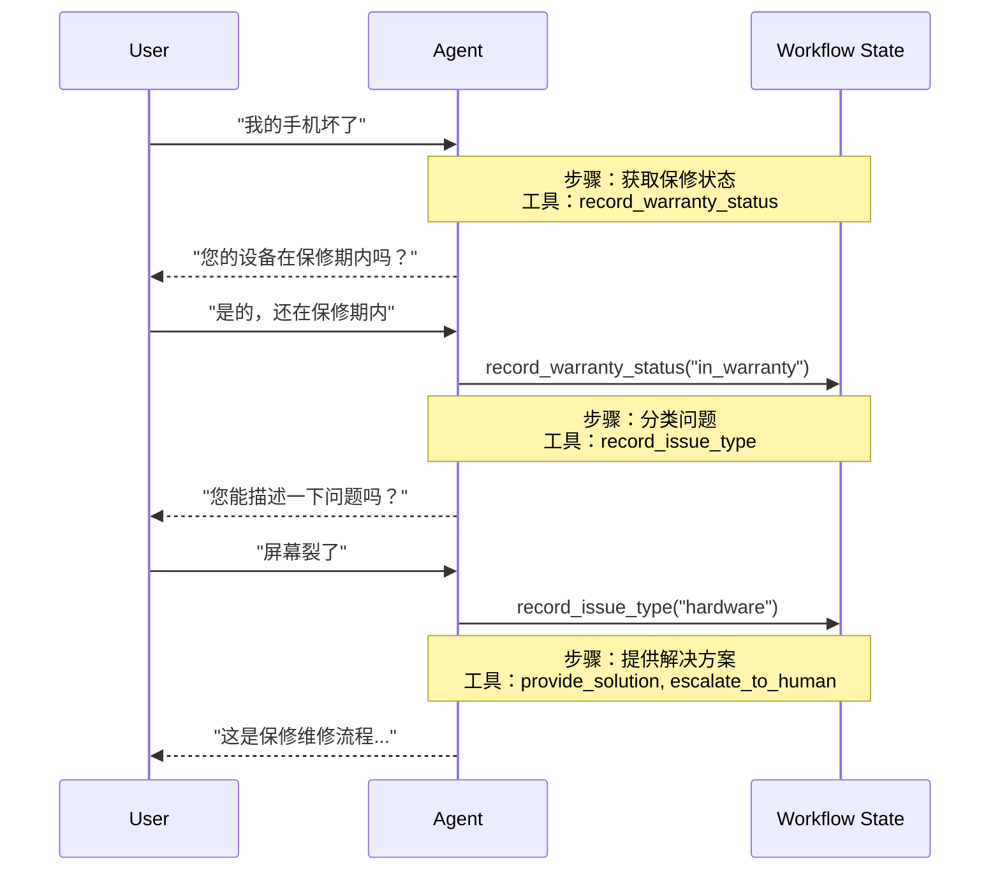

在**交接**架构中，行为会根据状态动态变化。核心机制是：[工具](/oss/python/langchain/tools)更新一个跨轮次持久化的状态变量（例如 `current_step` 或 `active_agent`），系统读取该变量以调整行为——要么应用不同的配置（系统提示、工具），要么路由到不同的[智能体](/oss/python/langchain/agents)。此模式既支持不同智能体之间的交接，也支持单个智能体内的动态配置变更。

<Tip>
术语**交接**由 [OpenAI](https://openai.github.io/openai-agents-python/handoffs/) 提出，指使用工具调用（例如 `transfer_to_sales_agent`）在智能体或状态之间转移控制权。
</Tip>


```mermaid
sequenceDiagram
    participant User
    participant Agent
    participant Workflow State

    User->>Agent: "我的手机坏了"
    Note over Agent,Workflow State: 步骤：获取保修状态<br/>工具：record_warranty_status
    Agent-->>User: "您的设备在保修期内吗？"

    User->>Agent: "是的，还在保修期内"
    Agent->>Workflow State: record_warranty_status("in_warranty")
    Note over Agent,Workflow State: 步骤：分类问题<br/>工具：record_issue_type
    Agent-->>User: "您能描述一下问题吗？"

    User->>Agent: "屏幕裂了"
    Agent->>Workflow State: record_issue_type("hardware")
    Note over Agent,Workflow State: 步骤：提供解决方案<br/>工具：provide_solution, escalate_to_human
    Agent-->>User: "这是保修维修流程..."
```

## 关键特性

* 状态驱动行为：行为根据状态变量（例如 `current_step` 或 `active_agent`）变化
* 基于工具的转换：工具更新状态变量以在状态间移动
* 直接用户交互：每个状态的配置直接处理用户消息
* 持久化状态：状态在对话轮次间保持

## 何时使用

当您需要强制执行顺序约束（仅在满足前置条件后解锁功能）、智能体需要在不同状态下直接与用户对话，或者您正在构建多阶段对话流程时，请使用交接模式。此模式对于需要按特定顺序收集信息的客户支持场景特别有价值——例如，在处理退款之前收集保修 ID。

## 基本实现

核心机制是一个[工具](/oss/python/langchain/tools)，它返回一个用于更新状态的 [`Command`](/oss/python/langgraph/graph-api#command)，从而触发向新步骤或智能体的转换：

```python
from langchain.tools import tool
from langchain.messages import ToolMessage
from langgraph.types import Command

@tool
def transfer_to_specialist(runtime) -> Command:
    """转接到专家智能体。"""
    return Command(
        update={
            "messages": [
                ToolMessage(  # [!code highlight]
                    content="已转接到专家",
                    tool_call_id=runtime.tool_call_id  # [!code highlight]
                )
            ],
            "current_step": "specialist"  # 触发行为变更
        }
    )
```


<Note>
**为什么包含 `ToolMessage`？** 当 LLM 调用工具时，它期望得到一个响应。带有匹配 `tool_call_id` 的 `ToolMessage` 完成了这个请求-响应循环——没有它，对话历史记录就会格式错误。每当您的交接工具更新消息时，这都是必需的。
</Note>

有关完整实现，请参阅下面的教程。

<Card
    title="教程：使用交接构建客户支持"
    icon="users"
    href="/oss/python/langchain/multi-agent/handoffs-customer-support"
    arrow cta="了解更多"
>
    了解如何使用交接模式构建客户支持智能体，其中单个智能体在不同配置之间转换。
</Card>

## 实现方法

有两种实现交接的方式：**[带中间件的单智能体](#single-agent-with-middleware)**（一个具有动态配置的智能体）或**[多智能体子图](#multiple-agent-subgraphs)**（作为图节点的不同智能体）。

### 带中间件的单智能体

单个智能体根据状态改变其行为。中间件拦截每个模型调用，并动态调整系统提示和可用工具。工具更新状态变量以触发转换：

```python
from langchain.tools import ToolRuntime, tool
from langchain.messages import ToolMessage
from langgraph.types import Command

@tool
def record_warranty_status(
    status: str,
    runtime: ToolRuntime[None, SupportState]
) -> Command:
    """记录保修状态并转换到下一步。"""
    return Command(
        update={
            "messages": [
                ToolMessage(
                    content=f"已记录保修状态：{status}",
                    tool_call_id=runtime.tool_call_id
                )
            ],
            "warranty_status": status,
            "current_step": "specialist"  # 更新状态以触发转换
        }
    )
```


<Accordion title="完整示例：带中间件的客户支持">

```python
from langchain.agents import AgentState, create_agent
from langchain.agents.middleware import wrap_model_call, ModelRequest, ModelResponse
from langchain.tools import tool, ToolRuntime
from langchain.messages import ToolMessage
from langgraph.types import Command
from typing import Callable

# 1. 定义带有 current_step 跟踪器的状态
class SupportState(AgentState):  # [!code highlight]
    """跟踪当前活动的步骤。"""
    current_step: str = "triage"  # [!code highlight]
    warranty_status: str | None = None

# 2. 工具通过 Command 更新 current_step
@tool
def record_warranty_status(
    status: str,
    runtime: ToolRuntime[None, SupportState]
) -> Command:  # [!code highlight]
    """记录保修状态并转换到下一步。"""
    return Command(update={  # [!code highlight]
        "messages": [  # [!code highlight]
            ToolMessage(
                content=f"已记录保修状态：{status}",
                tool_call_id=runtime.tool_call_id
            )
        ],
        "warranty_status": status,
        # 转换到下一步
        "current_step": "specialist"    # [!code highlight]
    })

# 3. 中间件根据 current_step 应用动态配置
@wrap_model_call  # [!code highlight]
def apply_step_config(
    request: ModelRequest,
    handler: Callable[[ModelRequest], ModelResponse]
) -> ModelResponse:
    """根据 current_step 配置智能体行为。"""
    step = request.state.get("current_step", "triage")  # [!code highlight]

    # 将步骤映射到其配置
    configs = {
        "triage": {
            "prompt": "收集保修信息...",
            "tools": [record_warranty_status]
        },
        "specialist": {
            "prompt": "根据保修提供解决方案：{warranty_status}",
            "tools": [provide_solution, escalate]
        }
    }

    config = configs[step]
    request = request.override(  # [!code highlight]
        system_prompt=config["prompt"].format(**request.state),  # [!code highlight]
        tools=config["tools"]  # [!code highlight]
    )
    return handler(request)

# 4. 使用中间件创建智能体
agent = create_agent(
    model,
    tools=[record_warranty_status, provide_solution, escalate],
    state_schema=SupportState,
    middleware=[apply_step_config],  # [!code highlight]
    checkpointer=InMemorySaver()  # 跨轮次持久化状态  # [!code highlight]
)
```


</Accordion>

### 多智能体子图

多个不同的智能体作为图中的独立节点存在。交接工具使用 `Command.PARENT` 在智能体节点之间导航，以指定接下来要执行哪个节点。

<Warning>
子图交接需要仔细的**[上下文工程](/oss/python/langchain/context-engineering)**。与单智能体中间件（消息历史自然流动）不同，您必须明确决定哪些消息在智能体之间传递。如果处理不当，智能体会收到格式错误的对话历史或臃肿的上下文。请参阅下面的[上下文工程](#context-engineering)。
</Warning>

```python
from langchain.messages import AIMessage, ToolMessage
from langchain.tools import tool, ToolRuntime
from langgraph.types import Command

@tool
def transfer_to_sales(
    runtime: ToolRuntime,
) -> Command:
    """转接到销售智能体。"""
    last_ai_message = next(  # [!code highlight]
        msg for msg in reversed(runtime.state["messages"]) if isinstance(msg, AIMessage)  # [!code highlight]
    )  # [!code highlight]
    transfer_message = ToolMessage(  # [!code highlight]
        content="已转接到销售智能体",  # [!code highlight]
        tool_call_id=runtime.tool_call_id,  # [!code highlight]
    )  # [!code highlight]
    return Command(
        goto="sales_agent",
        update={
            "active_agent": "sales_agent",
            "messages": [last_ai_message, transfer_message],  # [!code highlight]
        },
        graph=Command.PARENT
    )
```


<Accordion title="完整示例：带交接的销售与支持">

此示例展示了一个具有独立销售和支持智能体的多智能体系统。每个智能体是一个独立的图节点，交接工具允许智能体将对话相互转移。

```python
from typing import Literal

from langchain.agents import AgentState, create_agent
from langchain.messages import AIMessage, ToolMessage
from langchain.tools import tool, ToolRuntime
from langgraph.graph import StateGraph, START, END
from langgraph.types import Command
from typing_extensions import NotRequired


# 1. 定义带有 active_agent 跟踪器的状态
class MultiAgentState(AgentState):
    active_agent: NotRequired[str]


# 2. 创建交接工具
@tool
def transfer_to_sales(
    runtime: ToolRuntime,
) -> Command:
    """转接到销售智能体。"""
    last_ai_message = next(  # [!code highlight]
        msg for msg in reversed(runtime.state["messages"]) if isinstance(msg, AIMessage)  # [!code highlight]
    )  # [!code highlight]
    transfer_message = ToolMessage(  # [!code highlight]
        content="已从支持智能体转接到销售智能体",  # [!code highlight]
        tool_call_id=runtime.tool_call_id,  # [!code highlight]
    )  # [!code highlight]
    return Command(
        goto="sales_agent",
        update={
            "active_agent": "sales_agent",
            "messages": [last_ai_message, transfer_message],  # [!code highlight]
        },
        graph=Command.PARENT,
    )


@tool
def transfer_to_support(
    runtime: ToolRuntime,
) -> Command:
    """转接到支持智能体。"""
    last_ai_message = next(  # [!code highlight]
        msg for msg in reversed(runtime.state["messages"]) if isinstance(msg, AIMessage)  # [!code highlight]
    )  # [!code highlight]
    transfer_message = ToolMessage(  # [!code highlight]
        content="已从销售智能体转接到支持智能体",  # [!code highlight]
        tool_call_id=runtime.tool_call_id,  # [!code highlight]
    )  # [!code highlight]
    return Command(
        goto="support_agent",
        update={
            "active_agent": "support_agent",
            "messages": [last_ai_message, transfer_message],  # [!code highlight]
        },
        graph=Command.PARENT,
    )


# 3. 使用交接工具创建智能体
sales_agent = create_agent(
    model="google_genai:gemini-3.1-pro-preview",
    tools=[transfer_to_support],
    system_prompt="您是销售智能体。帮助处理销售咨询。如果被问及技术问题或支持，请转接到支持智能体。",
)

support_agent = create_agent(
    model="google_genai:gemini-3.1-pro-preview",
    tools=[transfer_to_sales],
    system_prompt="您是支持智能体。帮助处理技术问题。如果被问及价格或购买，请转接到销售智能体。",
)


# 4. 创建调用智能体的智能体节点
def call_sales_agent(state: MultiAgentState) -> Command:
    """调用销售智能体的节点。"""
    response = sales_agent.invoke(state)
    return response


def call_support_agent(state: MultiAgentState) -> Command:
    """调用支持智能体的节点。"""
    response = support_agent.invoke(state)
    return response


# 5. 创建路由器，检查是否应该结束或继续
def route_after_agent(
    state: MultiAgentState,
) -> Literal["sales_agent", "support_agent", "__end__"]:
    """根据 active_agent 路由，如果智能体在没有交接的情况下完成，则结束。"""
    messages = state.get("messages", [])

    # 检查最后一条消息 - 如果它是没有工具调用的 AIMessage，则完成
    if messages:
        last_msg = messages[-1]
        if isinstance(last_msg, AIMessage) and not last_msg.tool_calls:  # [!code highlight]
            return "__end__"  # [!code highlight]

    # 否则路由到活动智能体
    active = state.get("active_agent", "sales_agent")
    return active if active else "sales_agent"


def route_initial(
    state: MultiAgentState,
) -> Literal["sales_agent", "support_agent"]:
    """根据状态路由到活动智能体，默认为销售智能体。"""
    return state.get("active_agent") or "sales_agent"


# 6. 构建图
builder = StateGraph(MultiAgentState)
builder.add_node("sales_agent", call_sales_agent)
builder.add_node("support_agent", call_support_agent)

# 根据初始 active_agent 开始条件路由
builder.add_conditional_edges(START, route_initial, ["sales_agent", "support_agent"])

# 每个智能体之后，检查是否应该结束或路由到另一个智能体
builder.add_conditional_edges(
    "sales_agent", route_after_agent, ["sales_agent", "support_agent", END]
)
builder.add_conditional_edges(
    "support_agent", route_after_agent, ["sales_agent", "support_agent", END]
)

graph = builder.compile()
result = graph.invoke(
    {
        "messages": [
            {
                "role": "user",
                "content": "你好，我的账户登录遇到问题了。你能帮忙吗？",
            }
        ]
    }
)

for msg in result["messages"]:
    msg.pretty_print()
```


</Accordion>

<Tip>
对于大多数交接用例，请使用**带中间件的单智能体**——它更简单。仅当您需要定制的智能体实现（例如，一个节点本身是具有反思或检索步骤的复杂图）时，才使用**多智能体子图**。
</Tip>

#### 上下文工程

使用子图交接时，您可以精确控制哪些消息在智能体之间流动。这种精确性对于维护有效的对话历史和避免可能使下游智能体混淆的上下文膨胀至关重要。有关此主题的更多信息，请参阅[上下文工程](/oss/python/langchain/context-engineering)。

**交接期间处理上下文**

在智能体之间交接时，您需要确保对话历史保持有效。LLM 期望工具调用与其响应配对，因此当使用 `Command.PARENT` 交接给另一个智能体时，您必须包含两者：

1. **包含工具调用的 `AIMessage`**（触发交接的消息）
2. **确认交接的 `ToolMessage`**（对该工具调用的人工响应）

没有这种配对，接收智能体将看到不完整的对话，并可能产生错误或意外行为。

以下示例假设仅调用了交接工具（没有并行工具调用）：

```python
@tool
def transfer_to_sales(runtime: ToolRuntime) -> Command:
    # 获取触发此交接的 AI 消息
    last_ai_message = runtime.state["messages"][-1]

    # 创建人工工具响应以完成配对
    transfer_message = ToolMessage(
        content="已转接到销售智能体",
        tool_call_id=runtime.tool_call_id,
    )

    return Command(
        goto="sales_agent",
        update={
            "active_agent": "sales_agent",
            # 仅传递这两条消息，而不是完整的子智能体历史
            "messages": [last_ai_message, transfer_message],
        },
        graph=Command.PARENT,
    )
```


<Note>
**为什么不传递所有子智能体消息？** 虽然您可以在交接中包含完整的子智能体对话，但这通常会产生问题。接收智能体可能会被无关的内部推理搞混，并且令牌成本会不必要地增加。通过仅传递交接对，您可以保持父图的上下文专注于高层协调。如果接收智能体需要额外的上下文，请考虑在 ToolMessage 内容中总结子智能体的工作，而不是传递原始消息历史。
</Note>

**将控制权返回给用户**

将控制权返回给用户（结束智能体的轮次）时，请确保最终消息是 `AIMessage`。这可以维护有效的对话历史，并向用户界面发出信号，表明智能体已完成其工作。

## 实现注意事项

在设计多智能体系统时，请考虑：

* **上下文过滤策略**：每个智能体是接收完整的对话历史、过滤后的部分还是摘要？不同的智能体可能根据其角色需要不同的上下文。
* **工具语义**：明确交接工具是仅更新路由状态还是也执行副作用。例如，`transfer_to_sales()` 是否还应创建支持工单，或者这应该是一个单独的操作？
* **令牌效率**：在上下文完整性和令牌成本之间取得平衡。随着对话变长，摘要和选择性上下文传递变得更加重要。

---

<div className="source-links">
<Callout icon="terminal-2">
    [将这些文档连接](/use-these-docs)到 Claude、VSCode 等，通过 MCP 获取实时答案。
</Callout>
<Callout icon="edit">
    [在 GitHub 上编辑此页面](https://github.com/langchain-ai/docs/edit/main/src/oss/langchain/multi-agent/handoffs.mdx) 或 [提交问题](https://github.com/langchain-ai/docs/issues/new/choose)。
</Callout>
</div>