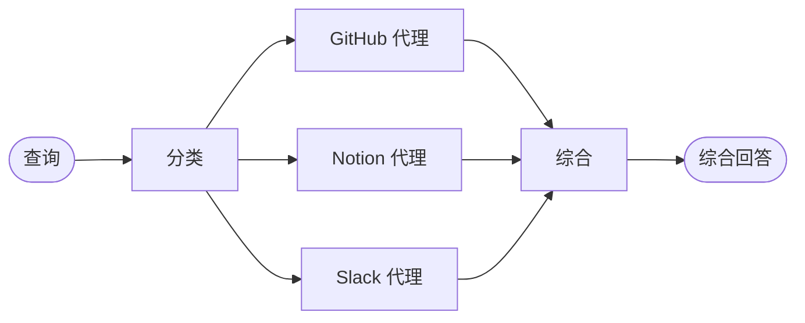

import ChatModelTabsPy from '/snippets/chat-model-tabs.mdx';
import ChatModelTabsJs from '/snippets/chat-model-tabs-js.mdx';

## 概述

**路由器模式**是一种[多代理](/oss/python/langchain/multi-agent)架构，其中路由步骤对输入进行分类并将其定向到专用代理，然后将结果综合为一个组合响应。当你的组织知识分布在不同的**垂直领域**——每个领域都有其专用工具和提示的独立知识域时，这种模式非常出色。

在本教程中，你将构建一个多源知识库路由器，通过一个真实的企业场景演示这些优势。该系统将协调三个专家代理：

- 一个**GitHub 代理**，用于搜索代码、问题和拉取请求。
- 一个 **Notion 代理**，用于搜索内部文档和 wiki。
- 一个 **Slack 代理**，用于搜索相关线程和讨论。

当用户询问"如何对 API 请求进行身份验证？"时，路由器将查询分解为特定来源的子问题，并行将其路由到相关代理，然后将结果综合为一个连贯的回答。



### 为什么使用路由器？

路由器模式提供了以下几个优势：

- **并行执行**：同时查询多个来源，与顺序方法相比降低延迟。
- **专用代理**：每个垂直领域都有针对其领域优化的专注工具和提示。
- **选择性路由**：并非每个查询都需要每个来源——路由器智能地选择相关的垂直领域。
- **定向子问题**：每个代理接收针对其领域定制的问题，提高结果质量。
- **清晰综合**：来自多个来源的结果被合并为一个单一、连贯的响应。

### 概念

我们将涵盖以下概念：

- [多代理系统](/oss/python/langchain/multi-agent)
- 用于工作流编排的 [StateGraph](/oss/python/langgraph/graph-api)
- 用于并行执行的 [Send API](/oss/python/langgraph/graph-api#send)

<Tip>
**路由器 vs. 子代理**：[子代理模式](/oss/python/langchain/multi-agent/subagents)也可以路由到多个代理。当你需要专门的预处理、自定义路由逻辑或想要对并行执行进行显式控制时，使用路由器模式。当你希望 LLM 动态决定调用哪些代理时，使用子代理模式。
</Tip>

## 安装与配置

### 安装

本教程需要 `langchain` 和 `langgraph` 包：

<CodeGroup>
```bash pip
pip install langchain langgraph
```
```bash uv
uv add langchain langgraph
```
```bash conda
conda install langchain langgraph -c conda-forge
```
</CodeGroup>


更多详情，请参阅[安装指南](/oss/python/langchain/install)。

### LangSmith

设置 [LangSmith](https://smith.langchain.com) 以检查代理内部发生的情况。然后设置以下环境变量：

<CodeGroup>
```bash bash
export LANGSMITH_TRACING="true"
export LANGSMITH_API_KEY="..."
```
```python python
import getpass
import os

os.environ["LANGSMITH_TRACING"] = "true"
os.environ["LANGSMITH_API_KEY"] = getpass.getpass()
```
</CodeGroup>


### 选择 LLM

从 LangChain 的集成套件中选择一个聊天模型：

<ChatModelTabsPy />


## 1. 定义状态

首先，定义状态模式。我们使用三种类型：

- **`AgentInput`**：传递给每个子代理的简单状态（仅包含查询）
- **`AgentOutput`**：每个子代理返回的结果（来源名称 + 结果）
- **`RouterState`**：主工作流状态，跟踪查询、分类、结果和最终回答

```python
from typing import Annotated, Literal, TypedDict
import operator


class AgentInput(TypedDict):
    """Simple input state for each subagent."""
    query: str


class AgentOutput(TypedDict):
    """Output from each subagent."""
    source: str
    result: str


class Classification(TypedDict):
    """A single routing decision: which agent to call with what query."""
    source: Literal["github", "notion", "slack"]
    query: str


class RouterState(TypedDict):
    query: str
    classifications: list[Classification]
    results: Annotated[list[AgentOutput], operator.add]  # Reducer collects parallel results
    final_answer: str
```


`results` 字段使用**归约器**（Python 中的 `operator.add`，JS 中的 concat 函数）将并行代理执行的输出收集到单个列表中。

## 2. 为每个垂直领域定义工具

为每个知识域创建工具。在生产系统中，这些工具会调用实际的 API。在本教程中，我们使用返回模拟数据的存根实现。我们在 3 个垂直领域中定义了 7 个工具：GitHub（搜索代码、问题、PR）、Notion（搜索文档、获取页面）和 Slack（搜索消息、获取线程）。

```python expandable
from langchain.tools import tool


@tool
def search_code(query: str, repo: str = "main") -> str:
    """Search code in GitHub repositories."""
    return f"Found code matching '{query}' in {repo}: authentication middleware in src/auth.py"


@tool
def search_issues(query: str) -> str:
    """Search GitHub issues and pull requests."""
    return f"Found 3 issues matching '{query}': #142 (API auth docs), #89 (OAuth flow), #203 (token refresh)"


@tool
def search_prs(query: str) -> str:
    """Search pull requests for implementation details."""
    return f"PR #156 added JWT authentication, PR #178 updated OAuth scopes"


@tool
def search_notion(query: str) -> str:
    """Search Notion workspace for documentation."""
    return f"Found documentation: 'API Authentication Guide' - covers OAuth2 flow, API keys, and JWT tokens"


@tool
def get_page(page_id: str) -> str:
    """Get a specific Notion page by ID."""
    return f"Page content: Step-by-step authentication setup instructions"


@tool
def search_slack(query: str) -> str:
    """Search Slack messages and threads."""
    return f"Found discussion in #engineering: 'Use Bearer tokens for API auth, see docs for refresh flow'"


@tool
def get_thread(thread_id: str) -> str:
    """Get a specific Slack thread."""
    return f"Thread discusses best practices for API key rotation"
```


## 3. 创建专用代理

为每个垂直领域创建一个代理。每个代理都有特定领域的工具和针对其知识来源优化的提示。三个代理遵循相同的模式——只有工具和系统提示不同。

```python expandable
from langchain.agents import create_agent
from langchain.chat_models import init_chat_model

model = init_chat_model("openai:gpt-4.1")

github_agent = create_agent(
    model,
    tools=[search_code, search_issues, search_prs],
    system_prompt=(
        "You are a GitHub expert. Answer questions about code, "
        "API references, and implementation details by searching "
        "repositories, issues, and pull requests."
    ),
)

notion_agent = create_agent(
    model,
    tools=[search_notion, get_page],
    system_prompt=(
        "You are a Notion expert. Answer questions about internal "
        "processes, policies, and team documentation by searching "
        "the organization's Notion workspace."
    ),
)

slack_agent = create_agent(
    model,
    tools=[search_slack, get_thread],
    system_prompt=(
        "You are a Slack expert. Answer questions by searching "
        "relevant threads and discussions where team members have "
        "shared knowledge and solutions."
    ),
)
```


## 4. 构建路由器工作流

现在使用 StateGraph 构建路由器工作流。该工作流有四个主要步骤：

1. **分类**：分析查询并确定要以什么子问题调用哪些代理
2. **路由**：使用 `Send` 并行扇出到所选代理
3. **查询代理**：每个代理接收简单的 `AgentInput` 并返回 `AgentOutput`
4. **综合**：将收集的结果合并为一个连贯的响应

```python
from pydantic import BaseModel, Field
from langgraph.graph import StateGraph, START, END
from langgraph.types import Send

router_llm = init_chat_model("openai:gpt-4.1-mini")


# Define structured output schema for the classifier
class ClassificationResult(BaseModel):  # [!code highlight]
    """Result of classifying a user query into agent-specific sub-questions."""
    classifications: list[Classification] = Field(
        description="List of agents to invoke with their targeted sub-questions"
    )


def classify_query(state: RouterState) -> dict:
    """Classify query and determine which agents to invoke."""
    structured_llm = router_llm.with_structured_output(ClassificationResult)  # [!code highlight]

    result = structured_llm.invoke([
        {
            "role": "system",
            "content": """Analyze this query and determine which knowledge bases to consult.
For each relevant source, generate a targeted sub-question optimized for that source.

Available sources:
- github: Code, API references, implementation details, issues, pull requests
- notion: Internal documentation, processes, policies, team wikis
- slack: Team discussions, informal knowledge sharing, recent conversations

Return ONLY the sources that are relevant to the query. Each source should have
a targeted sub-question optimized for that specific knowledge domain.

Example for "How do I authenticate API requests?":
- github: "What authentication code exists? Search for auth middleware, JWT handling"
- notion: "What authentication documentation exists? Look for API auth guides"
(slack omitted because it's not relevant for this technical question)"""
        },
        {"role": "user", "content": state["query"]}
    ])

    return {"classifications": result.classifications}


def route_to_agents(state: RouterState) -> list[Send]:
    """Fan out to agents based on classifications."""
    return [
        Send(c["source"], {"query": c["query"]})  # [!code highlight]
        for c in state["classifications"]
    ]


def query_github(state: AgentInput) -> dict:
    """Query the GitHub agent."""
    result = github_agent.invoke({
        "messages": [{"role": "user", "content": state["query"]}]  # [!code highlight]
    })
    return {"results": [{"source": "github", "result": result["messages"][-1].content}]}


def query_notion(state: AgentInput) -> dict:
    """Query the Notion agent."""
    result = notion_agent.invoke({
        "messages": [{"role": "user", "content": state["query"]}]  # [!code highlight]
    })
    return {"results": [{"source": "notion", "result": result["messages"][-1].content}]}


def query_slack(state: AgentInput) -> dict:
    """Query the Slack agent."""
    result = slack_agent.invoke({
        "messages": [{"role": "user", "content": state["query"]}]  # [!code highlight]
    })
    return {"results": [{"source": "slack", "result": result["messages"][-1].content}]}


def synthesize_results(state: RouterState) -> dict:
    """Combine results from all agents into a coherent answer."""
    if not state["results"]:
        return {"final_answer": "No results found from any knowledge source."}

    # Format results for synthesis
    formatted = [
        f"**From {r['source'].title()}:**\n{r['result']}"
        for r in state["results"]
    ]

    synthesis_response = router_llm.invoke([
        {
            "role": "system",
            "content": f"""Synthesize these search results to answer the original question: "{state['query']}"

- Combine information from multiple sources without redundancy
- Highlight the most relevant and actionable information
- Note any discrepancies between sources
- Keep the response concise and well-organized"""
        },
        {"role": "user", "content": "\n\n".join(formatted)}
    ])

    return {"final_answer": synthesis_response.content}
```


## 5. 编译工作流

现在通过连接带有边的节点来组装工作流。关键是使用带有路由函数的 `add_conditional_edges` 来启用并行执行：

```python
workflow = (
    StateGraph(RouterState)
    .add_node("classify", classify_query)
    .add_node("github", query_github)
    .add_node("notion", query_notion)
    .add_node("slack", query_slack)
    .add_node("synthesize", synthesize_results)
    .add_edge(START, "classify")
    .add_conditional_edges("classify", route_to_agents, ["github", "notion", "slack"])
    .add_edge("github", "synthesize")
    .add_edge("notion", "synthesize")
    .add_edge("slack", "synthesize")
    .add_edge("synthesize", END)
    .compile()
)
```


`add_conditional_edges` 调用通过 `route_to_agents` 函数将分类节点连接到代理节点。当 `route_to_agents` 返回多个 `Send` 对象时，这些节点将并行执行。

## 6. 使用路由器

使用跨越多个知识域的查询测试你的路由器：

```python
result = workflow.invoke({
    "query": "How do I authenticate API requests?"
})

print("Original query:", result["query"])
print("\nClassifications:")
for c in result["classifications"]:
    print(f"  {c['source']}: {c['query']}")
print("\n" + "=" * 60 + "\n")
print("Final Answer:")
print(result["final_answer"])
```


预期输出：
```
Original query: How do I authenticate API requests?

Classifications:
  github: What authentication code exists? Search for auth middleware, JWT handling
  notion: What authentication documentation exists? Look for API auth guides

============================================================

Final Answer:
To authenticate API requests, you have several options:

1. **JWT Tokens**: The recommended approach for most use cases.
   Implementation details are in `src/auth.py` (PR #156).

2. **OAuth2 Flow**: For third-party integrations, follow the OAuth2
   flow documented in Notion's 'API Authentication Guide'.

3. **API Keys**: For server-to-server communication, use Bearer tokens
   in the Authorization header.

For token refresh handling, see issue #203 and PR #178 for the latest
OAuth scope updates.
```

路由器分析了查询，分类确定调用哪些代理（GitHub 和 Notion，但不包括 Slack，因为这是技术问题），并行查询了两个代理，并将结果综合为一个连贯的回答。

## 7. 理解架构

路由器工作流遵循清晰的模式：

### 分类阶段

`classify_query` 函数使用**结构化输出**分析用户查询并确定要调用哪些代理。这是路由智能所在：

- 使用 Pydantic 模型（Python）或 Zod 模式（JS）确保有效输出
- 返回 `Classification` 对象列表，每个对象包含一个 `source` 和定向的 `query`
- 只包含相关的来源——不相关的来源直接省略

这种结构化方法比自由格式的 JSON 解析更可靠，使路由逻辑更加明确。

### 使用 Send 进行并行执行

`route_to_agents` 函数将分类映射到 `Send` 对象。每个 `Send` 指定目标节点和要传递的状态：

```python
# Classifications: [{"source": "github", "query": "..."}, {"source": "notion", "query": "..."}]
# Becomes:
[Send("github", {"query": "..."}), Send("notion", {"query": "..."})]
# Both agents execute simultaneously, each receiving only the query it needs
```


每个代理节点接收只包含 `query` 字段的简单 `AgentInput`——而不是完整的路由器状态。这使接口保持简洁和明确。

### 使用归约器收集结果

代理结果通过**归约器**流回主状态。每个代理返回：

```python
{"results": [{"source": "github", "result": "..."}]}
```


归约器（Python 中的 `operator.add`）将这些列表串联起来，将所有并行结果收集到 `state["results"]` 中。

### 综合阶段

所有代理完成后，`synthesize_results` 函数遍历收集的结果：

- 等待所有并行分支完成（LangGraph 自动处理此项）
- 引用原始查询以确保回答针对用户提问
- 将多个来源的信息合并，避免冗余

<Note>
**部分结果**：在本教程中，所有选定的代理都必须在综合之前完成。
</Note>

## 8. 完整工作示例

以下是可运行脚本中的所有内容：

<Expandable title="查看完整代码" defaultOpen={false}>

```python
"""
Multi-Source Knowledge Router Example

This example demonstrates the router pattern for multi-agent systems.
A router classifies queries, routes them to specialized agents in parallel,
and synthesizes results into a combined response.
"""

import operator
from typing import Annotated, Literal, TypedDict

from langchain.agents import create_agent
from langchain.chat_models import init_chat_model
from langchain.tools import tool
from langgraph.graph import StateGraph, START, END
from langgraph.types import Send
from pydantic import BaseModel, Field


# State definitions
class AgentInput(TypedDict):
    """Simple input state for each subagent."""
    query: str


class AgentOutput(TypedDict):
    """Output from each subagent."""
    source: str
    result: str


class Classification(TypedDict):
    """A single routing decision: which agent to call with what query."""
    source: Literal["github", "notion", "slack"]
    query: str


class RouterState(TypedDict):
    query: str
    classifications: list[Classification]
    results: Annotated[list[AgentOutput], operator.add]
    final_answer: str


# Structured output schema for classifier
class ClassificationResult(BaseModel):
    """Result of classifying a user query into agent-specific sub-questions."""
    classifications: list[Classification] = Field(
        description="List of agents to invoke with their targeted sub-questions"
    )


# Tools
@tool
def search_code(query: str, repo: str = "main") -> str:
    """Search code in GitHub repositories."""
    return f"Found code matching '{query}' in {repo}: authentication middleware in src/auth.py"


@tool
def search_issues(query: str) -> str:
    """Search GitHub issues and pull requests."""
    return f"Found 3 issues matching '{query}': #142 (API auth docs), #89 (OAuth flow), #203 (token refresh)"


@tool
def search_prs(query: str) -> str:
    """Search pull requests for implementation details."""
    return f"PR #156 added JWT authentication, PR #178 updated OAuth scopes"


@tool
def search_notion(query: str) -> str:
    """Search Notion workspace for documentation."""
    return f"Found documentation: 'API Authentication Guide' - covers OAuth2 flow, API keys, and JWT tokens"


@tool
def get_page(page_id: str) -> str:
    """Get a specific Notion page by ID."""
    return f"Page content: Step-by-step authentication setup instructions"


@tool
def search_slack(query: str) -> str:
    """Search Slack messages and threads."""
    return f"Found discussion in #engineering: 'Use Bearer tokens for API auth, see docs for refresh flow'"


@tool
def get_thread(thread_id: str) -> str:
    """Get a specific Slack thread."""
    return f"Thread discusses best practices for API key rotation"


# Models and agents
model = init_chat_model("openai:gpt-4.1")
router_llm = init_chat_model("openai:gpt-4.1-mini")

github_agent = create_agent(
    model,
    tools=[search_code, search_issues, search_prs],
    system_prompt=(
        "You are a GitHub expert. Answer questions about code, "
        "API references, and implementation details by searching "
        "repositories, issues, and pull requests."
    ),
)

notion_agent = create_agent(
    model,
    tools=[search_notion, get_page],
    system_prompt=(
        "You are a Notion expert. Answer questions about internal "
        "processes, policies, and team documentation by searching "
        "the organization's Notion workspace."
    ),
)

slack_agent = create_agent(
    model,
    tools=[search_slack, get_thread],
    system_prompt=(
        "You are a Slack expert. Answer questions by searching "
        "relevant threads and discussions where team members have "
        "shared knowledge and solutions."
    ),
)


# Workflow nodes
def classify_query(state: RouterState) -> dict:
    """Classify query and determine which agents to invoke."""
    structured_llm = router_llm.with_structured_output(ClassificationResult)

    result = structured_llm.invoke([
        {
            "role": "system",
            "content": """Analyze this query and determine which knowledge bases to consult.
For each relevant source, generate a targeted sub-question optimized for that source.

Available sources:
- github: Code, API references, implementation details, issues, pull requests
- notion: Internal documentation, processes, policies, team wikis
- slack: Team discussions, informal knowledge sharing, recent conversations

Return ONLY the sources that are relevant to the query."""
        },
        {"role": "user", "content": state["query"]}
    ])

    return {"classifications": result.classifications}


def route_to_agents(state: RouterState) -> list[Send]:
    """Fan out to agents based on classifications."""
    return [
        Send(c["source"], {"query": c["query"]})
        for c in state["classifications"]
    ]


def query_github(state: AgentInput) -> dict:
    """Query the GitHub agent."""
    result = github_agent.invoke({
        "messages": [{"role": "user", "content": state["query"]}]
    })
    return {"results": [{"source": "github", "result": result["messages"][-1].content}]}


def query_notion(state: AgentInput) -> dict:
    """Query the Notion agent."""
    result = notion_agent.invoke({
        "messages": [{"role": "user", "content": state["query"]}]
    })
    return {"results": [{"source": "notion", "result": result["messages"][-1].content}]}


def query_slack(state: AgentInput) -> dict:
    """Query the Slack agent."""
    result = slack_agent.invoke({
        "messages": [{"role": "user", "content": state["query"]}]
    })
    return {"results": [{"source": "slack", "result": result["messages"][-1].content}]}


def synthesize_results(state: RouterState) -> dict:
    """Combine results from all agents into a coherent answer."""
    if not state["results"]:
        return {"final_answer": "No results found from any knowledge source."}

    formatted = [
        f"**From {r['source'].title()}:**\n{r['result']}"
        for r in state["results"]
    ]

    synthesis_response = router_llm.invoke([
        {
            "role": "system",
            "content": f"""Synthesize these search results to answer the original question: "{state['query']}"

- Combine information from multiple sources without redundancy
- Highlight the most relevant and actionable information
- Note any discrepancies between sources
- Keep the response concise and well-organized"""
        },
        {"role": "user", "content": "\n\n".join(formatted)}
    ])

    return {"final_answer": synthesis_response.content}


# Build workflow
workflow = (
    StateGraph(RouterState)
    .add_node("classify", classify_query)
    .add_node("github", query_github)
    .add_node("notion", query_notion)
    .add_node("slack", query_slack)
    .add_node("synthesize", synthesize_results)
    .add_edge(START, "classify")
    .add_conditional_edges("classify", route_to_agents, ["github", "notion", "slack"])
    .add_edge("github", "synthesize")
    .add_edge("notion", "synthesize")
    .add_edge("slack", "synthesize")
    .add_edge("synthesize", END)
    .compile()
)


if __name__ == "__main__":
    result = workflow.invoke({
        "query": "How do I authenticate API requests?"
    })

    print("Original query:", result["query"])
    print("\nClassifications:")
    for c in result["classifications"]:
        print(f"  {c['source']}: {c['query']}")
    print("\n" + "=" * 60 + "\n")
    print("Final Answer:")
    print(result["final_answer"])
```


</Expandable>

## 9. 进阶：有状态路由器

到目前为止，我们构建的路由器是**无状态的**——每个请求独立处理，调用之间没有记忆。对于多轮对话，你需要**有状态**的方法。

### 工具包装方法

添加对话记忆的最简单方法是将无状态路由器包装为对话代理可以调用的工具：

```python
from langgraph.checkpoint.memory import InMemorySaver


@tool
def search_knowledge_base(query: str) -> str:
    """Search across multiple knowledge sources (GitHub, Notion, Slack).

    Use this to find information about code, documentation, or team discussions.
    """
    result = workflow.invoke({"query": query})
    return result["final_answer"]


conversational_agent = create_agent(
    model,
    tools=[search_knowledge_base],
    system_prompt=(
        "You are a helpful assistant that answers questions about our organization. "
        "Use the search_knowledge_base tool to find information across our code, "
        "documentation, and team discussions."
    ),
    checkpointer=InMemorySaver(),
)
```


这种方法保持路由器无状态，而对话代理处理记忆和上下文。用户可以进行多轮对话，代理根据需要调用路由器工具。

```python
config = {"configurable": {"thread_id": "user-123"}}

result = conversational_agent.invoke(
    {"messages": [{"role": "user", "content": "How do I authenticate API requests?"}]},
    config
)
print(result["messages"][-1].content)

result = conversational_agent.invoke(
    {"messages": [{"role": "user", "content": "What about rate limiting for those endpoints?"}]},
    config
)
print(result["messages"][-1].content)
```


<Tip>
对于大多数使用场景，推荐使用工具包装方法。它提供了清晰的分离：路由器处理多源查询，而对话代理处理上下文和记忆。
</Tip>

### 完全持久化方法

如果你需要路由器本身维护状态——例如，在路由决策中使用之前的搜索结果——请使用[持久化](/oss/python/langchain/short-term-memory)在路由器级别存储消息历史。

<Warning>
**有状态路由器会增加复杂性。** 当跨轮次路由到不同代理时，如果代理具有不同的语气或提示，对话可能会感觉不一致。考虑使用[切换模式](/oss/python/langchain/multi-agent/handoffs)或[子代理模式](/oss/python/langchain/multi-agent/subagents)——两者都为与不同代理的多轮对话提供了更清晰的语义。
</Warning>

## 10. 关键要点

路由器模式在以下情况下表现出色：

- **独立垂直领域**：每个领域都需要专用工具和提示的独立知识域
- **并行查询需求**：同时查询多个来源能使问题得到更好的回答
- **综合需求**：来自多个来源的结果需要合并为一个连贯的响应

该模式有三个阶段：**分解**（分析查询并生成定向子问题）、**路由**（并行执行查询）和**综合**（合并结果）。

<Tip>
**何时使用路由器模式**

当你拥有多个独立的知识来源、需要低延迟的并行查询，并且想要对路由逻辑进行显式控制时，使用路由器模式。

对于动态工具选择的简单情况，考虑使用[子代理模式](/oss/python/langchain/multi-agent/subagents)。对于代理需要与用户顺序对话的工作流，考虑使用[切换模式](/oss/python/langchain/multi-agent/handoffs)。
</Tip>

## 后续步骤

- 了解[切换模式](/oss/python/langchain/multi-agent/handoffs)，实现代理间的对话
- 探索[子代理模式](/oss/python/langchain/multi-agent/subagents-personal-assistant)的集中式编排
- 阅读[多代理概述](/oss/python/langchain/multi-agent)以比较不同模式
- 使用 [LangSmith](https://smith.langchain.com) 调试和监控你的路由器

---

<div className="source-links">
<Callout icon="edit">
    [Edit this page on GitHub](https://github.com/langchain-ai/docs/edit/main/src/oss/langchain/multi-agent/router-knowledge-base.mdx) or [file an issue](https://github.com/langchain-ai/docs/issues/new/choose).
</Callout>
<Callout icon="terminal-2">
    [Connect these docs](/use-these-docs) to Claude, VSCode, and more via MCP for real-time answers.
</Callout>
</div>
