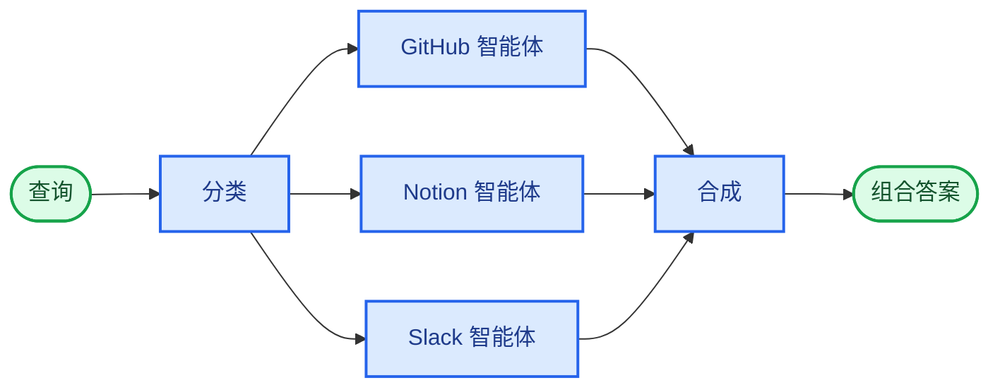

import ChatModelTabsPy from "/snippets/chat-model-tabs.mdx";
import ChatModelTabsJs from "/snippets/chat-model-tabs-js.mdx";

## 概述

**路由器模式**是一种[多智能体](/oss/python/langchain/multi-agent)架构，其中路由步骤对输入进行分类，并将其定向到专门的智能体，最后将结果合成为一个组合响应。当您的组织知识分布在不同的**垂直领域**（每个领域都需要自己的智能体，配备专门的工具和提示）时，此模式表现出色。

在本教程中，您将构建一个多源知识库路由器，通过一个真实的企业场景来展示这些优势。该系统将协调三个专家：

- **GitHub 智能体**：搜索代码、问题和拉取请求。
- **Notion 智能体**：搜索内部文档和维基。
- **Slack 智能体**：搜索相关讨论和对话。

当用户询问“如何验证 API 请求？”时，路由器会将查询分解为特定于源的子问题，将它们并行路由到相关的智能体，并将结果合成为一个连贯的答案。



### 为什么使用路由器？

路由器模式提供以下优势：

- **并行执行**：同时查询多个源，与顺序方法相比可减少延迟。
- **专门的智能体**：每个垂直领域都有针对其领域优化的专注工具和提示。
- **选择性路由**：并非每个查询都需要所有源——路由器会智能地选择相关垂直领域。
- **针对性的子问题**：每个智能体都会收到一个为其领域量身定制的问题，从而提高结果质量。
- **清晰的合成**：来自多个源的结果被组合成一个单一、连贯的响应。

### 概念

我们将涵盖以下概念：

- [多智能体系统](/oss/python/langchain/multi-agent)
- 用于工作流编排的 [StateGraph](/oss/python/langgraph/graph-api)
- 用于并行执行的 [Send API](/oss/python/langgraph/graph-api#send)

<Tip>
  **路由器与子智能体**：[子智能体模式](/oss/python/langchain/multi-agent/subagents)也可以路由到多个智能体。当您需要专门的预处理、自定义路由逻辑或想要显式控制并行执行时，请使用路由器模式。当您希望
  LLM 动态决定调用哪些智能体时，请使用子智能体模式。
</Tip>

## 设置

### 安装

本教程需要 `langchain` 和 `langgraph` 包：

<CodeGroup>
  ```bash pip pip install langchain langgraph ``` ```bash uv uv add langchain
  langgraph ``` ```bash conda conda install langchain langgraph -c conda-forge
  ```
</CodeGroup>

有关更多详细信息，请参阅我们的[安装指南](/oss/python/langchain/install)。

### LangSmith

设置 [LangSmith](https://smith.langchain.com) 以检查智能体内部发生的情况。然后设置以下环境变量：

<CodeGroup>
```bash bash
export LANGSMITH_TRACING="true"
export LANGSMITH_API_KEY="..."
```
```python python
import getpass
import os

os.environ["LANGSMITH_TRACING"] = "true"
os.environ["LANGSMITH_API_KEY"] = getpass.getpass()

````
</CodeGroup>

### 选择 LLM

从 LangChain 的集成套件中选择一个聊天模型：

<ChatModelTabsPy />

## 1. 定义状态

首先，定义状态模式。我们使用三种类型：

- **`AgentInput`**：传递给每个子智能体的简单状态（仅查询）
- **`AgentOutput`**：每个子智能体返回的结果（源名称 + 结果）
- **`RouterState`**：跟踪查询、分类、结果和最终答案的主工作流状态

```python
from typing import Annotated, Literal, TypedDict
import operator


class AgentInput(TypedDict):
    """每个子智能体的简单输入状态。"""
    query: str


class AgentOutput(TypedDict):
    """每个子智能体的输出。"""
    source: str
    result: str


class Classification(TypedDict):
    """单个路由决策：使用什么查询调用哪个智能体。"""
    source: Literal["github", "notion", "slack"]
    query: str


class RouterState(TypedDict):
    query: str
    classifications: list[Classification]
    results: Annotated[list[AgentOutput], operator.add]  # Reducer 收集并行结果
    final_answer: str
````

`results` 字段使用**归约器**（Python 中的 `operator.add`，JS 中的 concat 函数）将并行智能体执行的输出收集到单个列表中。

## 2. 为每个垂直领域定义工具

为每个知识领域创建工具。在生产系统中，这些工具会调用实际的 API。在本教程中，我们使用返回模拟数据的存根实现。我们在 3 个垂直领域定义了 7 个工具：GitHub（搜索代码、问题、PR）、Notion（搜索文档、获取页面）和 Slack（搜索消息、获取讨论串）。

```python expandable
from langchain.tools import tool


@tool
def search_code(query: str, repo: str = "main") -> str:
    """在 GitHub 仓库中搜索代码。"""
    return f"在 {repo} 中找到匹配 '{query}' 的代码：src/auth.py 中的身份验证中间件"


@tool
def search_issues(query: str) -> str:
    """搜索 GitHub 问题和拉取请求。"""
    return f"找到 3 个匹配 '{query}' 的问题：#142（API 身份验证文档）、#89（OAuth 流程）、#203（令牌刷新）"


@tool
def search_prs(query: str) -> str:
    """搜索拉取请求以获取实现细节。"""
    return f"PR #156 添加了 JWT 身份验证，PR #178 更新了 OAuth 范围"


@tool
def search_notion(query: str) -> str:
    """在 Notion 工作区中搜索文档。"""
    return f"找到文档：'API 身份验证指南' - 涵盖 OAuth2 流程、API 密钥和 JWT 令牌"


@tool
def get_page(page_id: str) -> str:
    """通过 ID 获取特定的 Notion 页面。"""
    return f"页面内容：分步身份验证设置说明"


@tool
def search_slack(query: str) -> str:
    """搜索 Slack 消息和讨论串。"""
    return f"在 #engineering 中找到讨论：'使用 Bearer 令牌进行 API 身份验证，请参阅文档了解刷新流程'"


@tool
def get_thread(thread_id: str) -> str:
    """获取特定的 Slack 讨论串。"""
    return f"讨论串讨论了 API 密钥轮换的最佳实践"
```

## 3. 创建专门的智能体

为每个垂直领域创建一个智能体。每个智能体都有领域特定的工具和针对其知识源优化的提示。所有三个智能体都遵循相同的模式——只有工具和系统提示不同。

```python expandable
from langchain.agents import create_agent
from langchain.chat_models import init_chat_model

model = init_chat_model("openai:gpt-4.1")

github_agent = create_agent(
    model,
    tools=[search_code, search_issues, search_prs],
    system_prompt=(
        "您是 GitHub 专家。通过搜索仓库、问题和拉取请求，"
        "回答有关代码、API 参考和实现细节的问题。"
    ),
)

notion_agent = create_agent(
    model,
    tools=[search_notion, get_page],
    system_prompt=(
        "您是 Notion 专家。通过搜索组织的 Notion 工作区，"
        "回答有关内部流程、政策和团队文档的问题。"
    ),
)

slack_agent = create_agent(
    model,
    tools=[search_slack, get_thread],
    system_prompt=(
        "您是 Slack 专家。通过搜索相关讨论串和对话来回答问题，"
        "团队成员在这些地方分享了知识和解决方案。"
    ),
)
```

## 4. 构建路由器工作流

现在使用 StateGraph 构建路由器工作流。该工作流有四个主要步骤：

1. **分类**：分析查询并确定要调用哪些智能体以及使用什么子问题
2. **路由**：使用 `Send` 并行分发到选定的智能体
3. **查询智能体**：每个智能体接收一个简单的 `AgentInput` 并返回一个 `AgentOutput`
4. **合成**：将收集的结果组合成一个连贯的响应

```python
from pydantic import BaseModel, Field
from langgraph.graph import StateGraph, START, END
from langgraph.types import Send

router_llm = init_chat_model("openai:gpt-4.1-mini")


# 为分类器定义结构化输出模式
class ClassificationResult(BaseModel):  # [!code highlight]
    """将用户查询分类为特定于智能体的子问题的结果。"""
    classifications: list[Classification] = Field(
        description="要调用的智能体列表及其目标子问题"
    )


def classify_query(state: RouterState) -> dict:
    """分类查询并确定要调用哪些智能体。"""
    structured_llm = router_llm.with_structured_output(ClassificationResult)  # [!code highlight]

    result = structured_llm.invoke([
        {
            "role": "system",
            "content": """分析此查询并确定要咨询哪些知识库。
对于每个相关源，生成针对该源优化的目标子问题。

可用源：
- github：代码、API 参考、实现细节、问题、拉取请求
- notion：内部文档、流程、政策、团队维基
- slack：团队讨论、非正式知识共享、最近的对话

仅返回与查询相关的源。每个源都应有一个针对该特定知识领域优化的目标子问题。

例如，对于“如何验证 API 请求？”：
- github：“存在什么身份验证代码？搜索身份验证中间件、JWT 处理”
- notion：“存在什么身份验证文档？查找 API 身份验证指南”
（slack 被省略，因为它与这个技术问题无关）"""
        },
        {"role": "user", "content": state["query"]}
    ])

    return {"classifications": result.classifications}


def route_to_agents(state: RouterState) -> list[Send]:
    """根据分类分发到智能体。"""
    return [
        Send(c["source"], {"query": c["query"]})  # [!code highlight]
        for c in state["classifications"]
    ]


def query_github(state: AgentInput) -> dict:
    """查询 GitHub 智能体。"""
    result = github_agent.invoke({
        "messages": [{"role": "user", "content": state["query"]}]  # [!code highlight]
    })
    return {"results": [{"source": "github", "result": result["messages"][-1].content}]}


def query_notion(state: AgentInput) -> dict:
    """查询 Notion 智能体。"""
    result = notion_agent.invoke({
        "messages": [{"role": "user", "content": state["query"]}]  # [!code highlight]
    })
    return {"results": [{"source": "notion", "result": result["messages"][-1].content}]}


def query_slack(state: AgentInput) -> dict:
    """查询 Slack 智能体。"""
    result = slack_agent.invoke({
        "messages": [{"role": "user", "content": state["query"]}]  # [!code highlight]
    })
    return {"results": [{"source": "slack", "result": result["messages"][-1].content}]}


def synthesize_results(state: RouterState) -> dict:
    """将所有智能体的结果组合成一个连贯的答案。"""
    if not state["results"]:
        return {"final_answer": "未从任何知识源找到结果。"}

    # 为合成格式化结果
    formatted = [
        f"**来自 {r['source'].title()}：**\n{r['result']}"
        for r in state["results"]
    ]

    synthesis_response = router_llm.invoke([
        {
            "role": "system",
            "content": f"""合成这些搜索结果以回答原始问题："{state['query']}"

- 组合来自多个源的信息，避免冗余
- 突出最相关和可操作的信息
- 注意源之间的任何差异
- 保持响应简洁且组织良好"""
        },
        {"role": "user", "content": "\n\n".join(formatted)}
    ])

    return {"final_answer": synthesis_response.content}
```

## 5. 编译工作流

现在通过用边连接节点来组装工作流。关键是使用带有路由函数的 `add_conditional_edges` 来启用并行执行：

```python
workflow = (
    StateGraph(RouterState)
    .add_node("classify", classify_query)
    .add_node("github", query_github)
    .add_node("notion", query_notion)
    .add_node("slack", query_slack)
    .add_node("synthesize", synthesize_results)
    .add_edge(START, "classify")
    .add_conditional_edges("classify", route_to_agents, ["github", "notion", "slack"])
    .add_edge("github", "synthesize")
    .add_edge("notion", "synthesize")
    .add_edge("slack", "synthesize")
    .add_edge("synthesize", END)
    .compile()
)
```

`add_conditional_edges` 调用通过 `route_to_agents` 函数将分类节点连接到智能体节点。当 `route_to_agents` 返回多个 `Send` 对象时，这些节点会并行执行。

## 6. 使用路由器

使用跨越多个知识领域的查询测试您的路由器：

```python
result = workflow.invoke({
    "query": "How do I authenticate API requests?"
})

print("Original query:", result["query"])
print("\nClassifications:")
for c in result["classifications"]:
    print(f"  {c['source']}: {c['query']}")
print("\n" + "=" * 60 + "\n")
print("Final Answer:")
print(result["final_answer"])
```

预期输出：

```
Original query: How do I authenticate API requests?

Classifications:
  github: What authentication code exists? Search for auth middleware, JWT handling
  notion: What authentication documentation exists? Look for API auth guides

============================================================

Final Answer:
To authenticate API requests, you have several options:

1. **JWT Tokens**: The recommended approach for most use cases.
   Implementation details are in `src/auth.py` (PR #156).

2. **OAuth2 Flow**: For third-party integrations, follow the OAuth2
   flow documented in Notion's 'API Authentication Guide'.

3. **API Keys**: For server-to-server communication, use Bearer tokens
   in the Authorization header.

For token refresh handling, see issue #203 and PR #178 for the latest
OAuth scope updates.
```

路由器分析查询，对其进行分类以确定要调用哪些智能体（GitHub 和 Notion，但此技术问题不需要 Slack），并行查询两个智能体，并将结果合成为一个连贯的答案。

## 7. 理解架构

路由器工作流遵循清晰的模式：

### 分类阶段

`classify_query` 函数使用**结构化输出**来分析用户的查询并确定要调用哪些智能体。这是路由智能所在的位置：

- 使用 Pydantic 模型（Python）或 Zod 模式（JS）确保有效输出
- 返回 `Classification` 对象列表，每个对象都有 `source` 和目标 `query`
- 仅包含相关源——无关的源会被简单地省略

这种结构化方法比自由格式的 JSON 解析更可靠，并使路由逻辑明确。

### 使用 Send 进行并行执行

`route_to_agents` 函数将分类映射到 `Send` 对象。每个 `Send` 指定目标节点和要传递的状态：

```python
# 分类: [{"source": "github", "query": "..."}, {"source": "notion", "query": "..."}]
# 变为:
[Send("github", {"query": "..."}), Send("notion", {"query": "..."})]
# 两个智能体同时执行，每个只接收它需要的查询
```

每个智能体节点接收一个简单的 `AgentInput`，其中只有 `query` 字段——而不是完整的路由器状态。这保持了接口的清晰和明确。

### 使用归约器收集结果

智能体结果通过**归约器**流回主状态。每个智能体返回：

```python
{"results": [{"source": "github", "result": "..."}]}
```

归约器（Python 中的 `operator.add`）连接这些列表，将所有并行结果收集到 `state["results"]` 中。

### 合成阶段

所有智能体完成后，`synthesize_results` 函数会遍历收集的结果：

- 等待所有并行分支完成（LangGraph 会自动处理此问题）
- 引用原始查询以确保答案解决用户提出的问题
- 组合来自所有源的信息，避免冗余

<Note>**部分结果**：在本教程中，所有选定的智能体必须在合成之前完成。</Note>

## 8. 完整的工作示例

以下是可运行脚本中的所有内容：

<Expandable title="查看完整代码" defaultOpen={false}>

```python
"""
多源知识路由器示例

此示例演示了多智能体系统的路由器模式。
路由器对查询进行分类，将它们并行路由到专门的智能体，
并将结果合成为一个组合响应。
"""

import operator
from typing import Annotated, Literal, TypedDict

from langchain.agents import create_agent
from langchain.chat_models import init_chat_model
from langchain.tools import tool
from langgraph.graph import StateGraph, START, END
from langgraph.types import Send
from pydantic import BaseModel, Field


# 状态定义
class AgentInput(TypedDict):
    """每个子智能体的简单输入状态。"""
    query: str


class AgentOutput(TypedDict):
    """每个子智能体的输出。"""
    source: str
    result: str


class Classification(TypedDict):
    """单个路由决策：使用什么查询调用哪个智能体。"""
    source: Literal["github", "notion", "slack"]
    query: str


class RouterState(TypedDict):
    query: str
    classifications: list[Classification]
    results: Annotated[list[AgentOutput], operator.add]
    final_answer: str


# 分类器的结构化输出模式
class ClassificationResult(BaseModel):
    """将用户查询分类为特定于智能体的子问题的结果。"""
    classifications: list[Classification] = Field(
        description="要调用的智能体列表及其目标子问题"
    )


# 工具
@tool
def search_code(query: str, repo: str = "main") -> str:
    """在 GitHub 仓库中搜索代码。"""
    return f"在 {repo} 中找到匹配 '{query}' 的代码：src/auth.py 中的身份验证中间件"


@tool
def search_issues(query: str) -> str:
    """搜索 GitHub 问题和拉取请求。"""
    return f"找到 3 个匹配 '{query}' 的问题：#142（API 身份验证文档）、#89（OAuth 流程）、#203（令牌刷新）"


@tool
def search_prs(query: str) -> str:
    """搜索拉取请求以获取实现细节。"""
    return f"PR #156 添加了 JWT 身份验证，PR #178 更新了 OAuth 范围"


@tool
def search_notion(query: str) -> str:
    """在 Notion 工作区中搜索文档。"""
    return f"找到文档：'API 身份验证指南' - 涵盖 OAuth2 流程、API 密钥和 JWT 令牌"


@tool
def get_page(page_id: str) -> str:
    """通过 ID 获取特定的 Notion 页面。"""
    return f"页面内容：分步身份验证设置说明"


@tool
def search_slack(query: str) -> str:
    """搜索 Slack 消息和讨论串。"""
    return f"在 #engineering 中找到讨论：'使用 Bearer 令牌进行 API 身份验证，请参阅文档了解刷新流程'"


@tool
def get_thread(thread_id: str) -> str:
    """获取特定的 Slack 讨论串。"""
    return f"讨论串讨论了 API 密钥轮换的最佳实践"


# 模型和智能体
model = init_chat_model("openai:gpt-4.1")
router_llm = init_chat_model("openai:gpt-4.1-mini")

github_agent = create_agent(
    model,
    tools=[search_code, search_issues, search_prs],
    system_prompt=(
        "您是 GitHub 专家。通过搜索仓库、问题和拉取请求，"
        "回答有关代码、API 参考和实现细节的问题。"
    ),
)

notion_agent = create_agent(
    model,
    tools=[search_notion, get_page],
    system_prompt=(
        "您是 Notion 专家。通过搜索组织的 Notion 工作区，"
        "回答有关内部流程、政策和团队文档的问题。"
    ),
)

slack_agent = create_agent(
    model,
    tools=[search_slack, get_thread],
    system_prompt=(
        "您是 Slack 专家。通过搜索相关讨论串和对话来回答问题，"
        "团队成员在这些地方分享了知识和解决方案。"
    ),
)


# 工作流节点
def classify_query(state: RouterState) -> dict:
    """分类查询并确定要调用哪些智能体。"""
    structured_llm = router_llm.with_structured_output(ClassificationResult)

    result = structured_llm.invoke([
        {
            "role": "system",
            "content": """分析此查询并确定要咨询哪些知识库。
对于每个相关源，生成针对该源优化的目标子问题。

可用源：
- github：代码、API 参考、实现细节、问题、拉取请求
- notion：内部文档、流程、政策、团队维基
- slack：团队讨论、非正式知识共享、最近的对话

仅返回与查询相关的源。"""
        },
        {"role": "user", "content": state["query"]}
    ])

    return {"classifications": result.classifications}


def route_to_agents(state: RouterState) -> list[Send]:
    """根据分类分发到智能体。"""
    return [
        Send(c["source"], {"query": c["query"]})
        for c in state["classifications"]
    ]


def query_github(state: AgentInput) -> dict:
    """查询 GitHub 智能体。"""
    result = github_agent.invoke({
        "messages": [{"role": "user", "content": state["query"]}]
    })
    return {"results": [{"source": "github", "result": result["messages"][-1].content}]}


def query_notion(state: AgentInput) -> dict:
    """查询 Notion 智能体。"""
    result = notion_agent.invoke({
        "messages": [{"role": "user", "content": state["query"]}]
    })
    return {"results": [{"source": "notion", "result": result["messages"][-1].content}]}


def query_slack(state: AgentInput) -> dict:
    """查询 Slack 智能体。"""
    result = slack_agent.invoke({
        "messages": [{"role": "user", "content": state["query"]}]
    })
    return {"results": [{"source": "slack", "result": result["messages"][-1].content}]}


def synthesize_results(state: RouterState) -> dict:
    """将所有智能体的结果组合成一个连贯的答案。"""
    if not state["results"]:
        return {"final_answer": "未从任何知识源找到结果。"}

    formatted = [
        f"**来自 {r['source'].title()}：**\n{r['result']}"
        for r in state["results"]
    ]

    synthesis_response = router_llm.invoke([
        {
            "role": "system",
            "content": f"""合成这些搜索结果以回答原始问题："{state['query']}"

- 组合来自多个源的信息，避免冗余
- 突出最相关和可操作的信息
- 注意源之间的任何差异
- 保持响应简洁且组织良好"""
        },
        {"role": "user", "content": "\n\n".join(formatted)}
    ])

    return {"final_answer": synthesis_response.content}


# 构建工作流
workflow = (
    StateGraph(RouterState)
    .add_node("classify", classify_query)
    .add_node("github", query_github)
    .add_node("notion", query_notion)
    .add_node("slack", query_slack)
    .add_node("synthesize", synthesize_results)
    .add_edge(START, "classify")
    .add_conditional_edges("classify", route_to_agents, ["github", "notion", "slack"])
    .add_edge("github", "synthesize")
    .add_edge("notion", "synthesize")
    .add_edge("slack", "synthesize")
    .add_edge("synthesize", END)
    .compile()
)


if __name__ == "__main__":
    result = workflow.invoke({
        "query": "How do I authenticate API requests?"
    })

    print("Original query:", result["query"])
    print("\nClassifications:")
    for c in result["classifications"]:
        print(f"  {c['source']}: {c['query']}")
    print("\n" + "=" * 60 + "\n")
    print("Final Answer:")
    print(result["final_answer"])
```

</Expandable>

## 9. 高级：有状态路由器

到目前为止，我们构建的路由器是**无状态的**（每个请求都是独立处理的，调用之间没有内存）。对于多轮对话，您需要一种**有状态的**方法。

### 工具包装器方法

添加会话内存的最简单方法是将无状态路由器包装为一个工具，供对话智能体调用：

```python
from langgraph.checkpoint.memory import InMemorySaver


@tool
def search_knowledge_base(query: str) -> str:
    """跨多个知识源（GitHub、Notion、Slack）进行搜索。

    使用此功能查找有关代码、文档或团队讨论的信息。
    """
    result = workflow.invoke({"query": query})
    return result["final_answer"]


conversational_agent = create_agent(
    model,
    tools=[search_knowledge_base],
    system_prompt=(
        "您是一个有用的助手，回答有关我们组织的问题。"
        "使用 search_knowledge_base 工具在我们的代码、文档和团队讨论中查找信息。"
    ),
    checkpointer=InMemorySaver(),
)
```

这种方法保持路由器无状态，而对话智能体处理内存和上下文。用户可以进行多轮对话，智能体将根据需要调用路由器工具。

```python
config = {"configurable": {"thread_id": "user-123"}}

result = conversational_agent.invoke(
    {"messages": [{"role": "user", "content": "How do I authenticate API requests?"}]},
    config
)
print(result["messages"][-1].content)

result = conversational_agent.invoke(
    {"messages": [{"role": "user", "content": "What about rate limiting for those endpoints?"}]},
    config
)
print(result["messages"][-1].content)
```

<Tip>
  工具包装器方法适用于大多数用例。它提供了清晰的分离：路由器处理多源查询，而对话智能体处理上下文和内存。
</Tip>

### 完全持久化方法

如果路由器本身需要维护状态——例如，在路由决策中使用先前的搜索结果——请使用[持久化](/oss/python/langchain/short-term-memory)在路由器级别存储消息历史。

<Warning>
  **有状态路由器会增加复杂性。**
  当在不同轮次中路由到不同的智能体时，如果智能体具有不同的语气或提示，对话可能会感觉不一致。请考虑[交接模式](/oss/python/langchain/multi-agent/handoffs)或[子智能体模式](/oss/python/langchain/multi-agent/subagents)——两者都为涉及不同智能体的多轮对话提供了更清晰的语义。
</Warning>

## 10. 关键要点

当您具备以下条件时，路由器模式表现出色：

- **不同的垂直领域**：每个都需要专门工具和提示的独立知识领域
- **并行查询需求**：受益于同时查询多个源的问题
- **合成要求**：需要将来自多个源的结果组合成连贯的响应

该模式有三个阶段：**分解**（分析查询并生成目标子问题）、**路由**（并行执行查询）和**合成**（组合结果）。

<Tip>
**何时使用路由器模式**

当您有多个独立的知识源、需要低延迟并行查询并希望显式控制路由逻辑时，请使用路由器模式。

对于更简单的动态工具选择情况，请考虑[子智能体模式](/oss/python/langchain/multi-agent/subagents)。对于智能体需要与用户顺序对话的工作流，请考虑[交接](/oss/python/langchain/multi-agent/handoffs)。

</Tip>

## 后续步骤

- 了解智能体间对话的[交接](/oss/python/langchain/multi-agent/handoffs)
- 探索用于集中式编排的[子智能体模式](/oss/python/langchain/multi-agent/subagents-personal-assistant)
- 阅读[多智能体概述](/oss/python/langchain/multi-agent)以比较不同模式
- 使用 [LangSmith](https://smith.langchain.com) 调试和监控您的路由器

---

<div className="source-links">
  <Callout icon="edit">
    [在 GitHub
    上编辑此页面](https://github.com/langchain-ai/docs/edit/main/src/oss/langchain/multi-agent/router-knowledge-base.mdx)
    或[提交问题](https://github.com/langchain-ai/docs/issues/new/choose)。
  </Callout>
  <Callout icon="terminal-2">
    [通过 MCP 将这些文档连接到 Claude、VSCode 等](/use-these-docs)
    以获取实时答案。
  </Callout>
</div>
