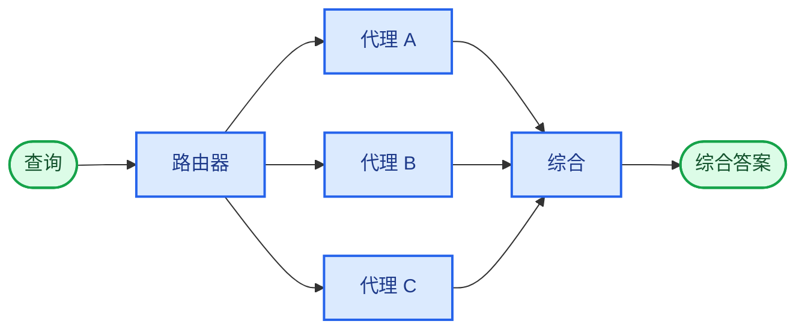

在**路由器**架构中，路由步骤对输入进行分类，并将其定向到专门的[代理](/oss/python/langchain/agents)。当您拥有不同的**垂直领域**（每个都需要自己的代理的独立知识领域）时，这非常有用。



## 关键特性

* 路由器分解查询
* 零个或多个专门代理并行调用
* 结果被合成为一个连贯的响应

## 何时使用

当您拥有不同的垂直领域（每个都需要自己的代理的独立知识领域），需要并行查询多个源，并希望将结果合成为一个组合响应时，请使用路由器模式。

## 基本实现

路由器对查询进行分类，并将其定向到适当的代理。对于单代理路由，使用 [`Command`](/oss/python/langgraph/graph-api#command)；对于并行分发到多个代理，使用 [`Send`](/oss/python/langgraph/graph-api#send)。

<Tabs>
<Tab title="单代理">

使用 `Command` 路由到单个专门代理：

```python
from langgraph.types import Command

def classify_query(query: str) -> str:
    """使用 LLM 对查询进行分类并确定适当的代理。"""
    # 分类逻辑在此
    ...

def route_query(state: State) -> Command:
    """根据查询分类路由到适当的代理。"""
    active_agent = classify_query(state["query"])

    # 路由到选定的代理
    return Command(goto=active_agent)
```


</Tab>
<Tab title="多代理（并行）">

使用 `Send` 并行分发到多个专门代理：

```python
from typing import TypedDict
from langgraph.types import Send

class ClassificationResult(TypedDict):
    query: str
    agent: str

def classify_query(query: str) -> list[ClassificationResult]:
    """使用 LLM 对查询进行分类并确定要调用哪些代理。"""
    # 分类逻辑在此
    ...

def route_query(state: State):
    """根据查询分类路由到相关代理。"""
    classifications = classify_query(state["query"])

    # 并行分发到选定的代理
    return [
        Send(c["agent"], {"query": c["query"]})
        for c in classifications
    ]
```


</Tab>
</Tabs>

有关完整实现，请参阅下面的教程。

<Card title="教程：使用路由构建多源知识库" icon="book" href="/oss/python/langchain/multi-agent/router-knowledge-base">
构建一个路由器，该路由器并行查询 GitHub、Notion 和 Slack，然后将结果合成为一个连贯的答案。涵盖状态定义、专门代理、使用 `Send` 的并行执行以及结果综合。
</Card>

## 无状态与有状态

两种方法：
* [**无状态路由器**](#stateless) 独立处理每个请求
* [**有状态路由器**](#stateful) 在请求之间维护对话历史

## 无状态

每个请求都被独立路由——调用之间没有记忆。对于多轮对话，请参阅[有状态路由器](#stateful)。

<Tip>
**路由器与子代理**：两种模式都可以将工作分派给多个代理，但它们在路由决策的制定方式上有所不同：

- **路由器**：一个专用的路由步骤（通常是一次 LLM 调用或基于规则的逻辑），用于对输入进行分类并分派给代理。路由器本身通常不维护对话历史或执行多轮编排——它是一个预处理步骤。
- **子代理**：一个主监督代理动态决定在持续对话中调用哪些[子代理](/oss/python/langchain/multi-agent/subagents)。主代理维护上下文，可以在多轮中调用多个子代理，并编排复杂的多步骤工作流。

当您有明确的输入类别并希望确定性或轻量级分类时，请使用**路由器**。当您需要灵活的、对话感知的编排，其中 LLM 根据不断变化的上下文决定下一步操作时，请使用**监督器**。
</Tip>

## 有状态

对于多轮对话，您需要在调用之间维护上下文。

### 工具包装器

最简单的方法：将无状态路由器包装为一个工具，供对话代理调用。对话代理处理内存和上下文；路由器保持无状态。这避免了在多个并行代理之间管理对话历史的复杂性。

```python
@tool
def search_docs(query: str) -> str:
    """跨多个文档源进行搜索。"""
    result = workflow.invoke({"query": query})  # [!code highlight]
    return result["final_answer"]

# 对话代理使用路由器作为工具
conversational_agent = create_agent(
    model,
    tools=[search_docs],
    prompt="您是一个有用的助手。使用 search_docs 来回答问题。"
)
```


### 完全持久化

如果路由器本身需要维护状态，请使用[持久化](/oss/python/langchain/short-term-memory)来存储消息历史。当路由到代理时，从状态中获取先前的消息，并选择性地将其包含在代理的上下文中——这是[上下文工程](/oss/python/langchain/context-engineering)的一个杠杆。

<Warning>
**有状态路由器需要自定义历史管理。** 如果路由器在多轮之间切换代理，当代理具有不同的语气或提示时，对话对最终用户可能感觉不流畅。使用并行调用时，您需要在路由器级别维护历史（输入和综合输出），并在路由逻辑中利用此历史。请考虑[交接模式](/oss/python/langchain/multi-agent/handoffs)或[子代理模式](/oss/python/langchain/multi-agent/subagents)——两者都为多轮对话提供了更清晰的语义。
</Warning>

---

<div className="source-links">
<Callout icon="edit">
    [在 GitHub 上编辑此页面](https://github.com/langchain-ai/docs/edit/main/src/oss/langchain/multi-agent/router.mdx) 或 [提交问题](https://github.com/langchain-ai/docs/issues/new/choose)。
</Callout>
<Callout icon="terminal-2">
    [通过 MCP 将这些文档](/use-these-docs) 连接到 Claude、VSCode 等，以获取实时答案。
</Callout>
</div>