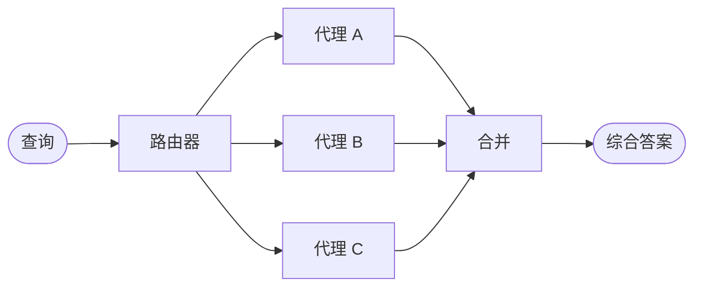

在**路由器**架构中，路由步骤对输入进行分类并将其定向到专业[代理](/oss/python/langchain/agents)。当你拥有不同的**垂直领域**——各自需要独立代理的分离知识域——时，这种方式非常有用。



## 关键特征

* 路由器分解查询
* 零个或多个专业代理并行调用
* 结果合并为连贯的响应

## 适用场景

当你拥有不同的垂直领域（各自需要独立代理的分离知识域）、需要并行查询多个来源，并希望将结果合并为综合响应时，请使用路由器模式。

## 基本实现

路由器对查询进行分类并将其定向到合适的代理。使用 [`Command`](/oss/python/langgraph/graph-api#command) 进行单代理路由，或使用 [`Send`](/oss/python/langgraph/graph-api#send) 并行扇出到多个代理。

<Tabs>
<Tab title="单个代理">

使用 `Command` 路由到单个专业代理：

```python
from langgraph.types import Command

def classify_query(query: str) -> str:
    """Use LLM to classify query and determine the appropriate agent."""
    # Classification logic here
    ...

def route_query(state: State) -> Command:
    """Route to the appropriate agent based on query classification."""
    active_agent = classify_query(state["query"])

    # Route to the selected agent
    return Command(goto=active_agent)
```


</Tab>
<Tab title="多个代理（并行）">

使用 `Send` 并行扇出到多个专业代理：

```python
from typing import TypedDict
from langgraph.types import Send

class ClassificationResult(TypedDict):
    query: str
    agent: str

def classify_query(query: str) -> list[ClassificationResult]:
    """Use LLM to classify query and determine which agents to invoke."""
    # Classification logic here
    ...

def route_query(state: State):
    """Route to relevant agents based on query classification."""
    classifications = classify_query(state["query"])

    # Fan out to selected agents in parallel
    return [
        Send(c["agent"], {"query": c["query"]})
        for c in classifications
    ]
```


</Tab>
</Tabs>

完整实现请参阅下方教程。

<Card title="教程：使用路由构建多源知识库" icon="book" href="/oss/python/langchain/multi-agent/router-knowledge-base">
构建一个并行查询 GitHub、Notion 和 Slack 的路由器，然后将结果合并为连贯的答案。涵盖状态定义、专业代理、使用 `Send` 并行执行以及结果合并。
</Card>

## 无状态与有状态

两种方式：
* [**无状态路由器**](#stateless) 独立处理每次请求
* [**有状态路由器**](#stateful) 在请求间维护对话历史

## 无状态

每次请求独立路由——调用之间无记忆。对于多轮对话，请参阅[有状态路由器](#stateful)。

<Tip>
**路由器 vs. 子代理**：两种模式都可以将工作分派给多个代理，但它们在路由决策的方式上有所不同：

- **路由器**：专用的路由步骤（通常是单次 LLM 调用或基于规则的逻辑），对输入进行分类并分派给代理。路由器本身通常不维护对话历史或执行多轮编排——它是一个预处理步骤。
- **子代理**：主监督代理在持续对话中动态决定调用哪些[子代理](/oss/python/langchain/multi-agent/subagents)。主代理维护上下文，可以跨轮次调用多个子代理，并编排复杂的多步骤工作流。

当你有明确的输入类别并希望进行确定性或轻量级分类时，使用**路由器**。当你需要灵活的、感知对话的编排（LLM 根据不断演变的上下文决定下一步行动）时，使用**监督器**。
</Tip>


## 有状态

对于多轮对话，你需要在调用之间维护上下文。

### 工具包装器

最简单的方式：将无状态路由器包装为对话代理可以调用的工具。对话代理负责记忆和上下文管理；路由器保持无状态。这避免了在多个并行代理间管理对话历史的复杂性。

```python
@tool
def search_docs(query: str) -> str:
    """Search across multiple documentation sources."""
    result = workflow.invoke({"query": query})  # [!code highlight]
    return result["final_answer"]

# Conversational agent uses the router as a tool
conversational_agent = create_agent(
    model,
    tools=[search_docs],
    prompt="You are a helpful assistant. Use search_docs to answer questions."
)
```


### 完整持久化

如果你需要路由器本身维护状态，请使用[持久化](/oss/python/langchain/short-term-memory)来存储消息历史。在路由到代理时，从状态中获取之前的消息并选择性地将其包含在代理的上下文中——这是进行[上下文工程](/oss/python/langchain/context-engineering)的一个杠杆。

<Warning>
**有状态路由器需要自定义历史管理。** 如果路由器在轮次之间切换代理，当代理具有不同的语气或提示词时，终端用户可能感觉对话不够流畅。使用并行调用时，你需要在路由器层面维护历史（输入和合并后的输出），并在路由逻辑中利用这些历史。建议考虑[移交模式](/oss/python/langchain/multi-agent/handoffs)或[子代理模式](/oss/python/langchain/multi-agent/subagents)——两者都为多轮对话提供了更清晰的语义。
</Warning>

---

<div className="source-links">
<Callout icon="edit">
    [在 GitHub 上编辑此页面](https://github.com/langchain-ai/docs/edit/main/src/oss/langchain/multi-agent/router.mdx) 或 [提交问题](https://github.com/langchain-ai/docs/issues/new/choose)。
</Callout>
<Callout icon="terminal-2">
    通过 MCP [将这些文档接入](/use-these-docs) Claude、VSCode 等工具以获取实时答案。
</Callout>
</div>
