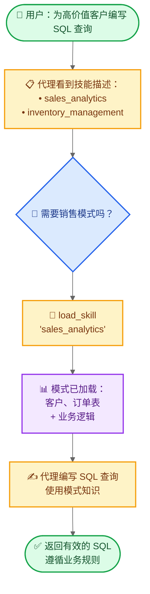

import ChatModelTabsPy from '/snippets/chat-model-tabs.mdx';
import ChatModelTabsJs from '/snippets/chat-model-tabs-js.mdx';

本教程展示如何使用**渐进式披露**——一种上下文管理技术，其中代理按需加载信息而非预先加载——来实现**技能**（基于提示的专门指令）。代理通过工具调用加载技能，而非动态更改系统提示，仅发现并加载每个任务所需的技能。

**用例：** 想象构建一个代理，帮助在大型企业中跨不同业务垂直领域编写 SQL 查询。您的组织可能为每个垂直领域拥有单独的数据存储，或一个包含数千张表的单一整体数据库。无论哪种情况，预先加载所有模式都会使上下文窗口不堪重负。渐进式披露通过仅在需要时加载相关模式来解决此问题。此架构还使不同的产品负责人和利益相关者能够独立贡献和维护其特定业务垂直领域的技能。

**您将构建什么：** 一个具有两种技能（销售分析和库存管理）的 SQL 查询助手。代理在其系统提示中看到轻量级技能描述，然后仅在与用户查询相关时通过工具调用加载完整的数据库模式和业务逻辑。

<Note>
有关具有查询执行、错误纠正和验证功能的 SQL 代理的完整示例，请参阅我们的 [SQL 代理教程](/oss/python/langchain/sql-agent)。本教程重点介绍可应用于任何领域的渐进式披露模式。
</Note>

<Tip>
渐进式披露由 Anthropic 推广，作为构建可扩展代理技能系统的技术。此方法使用三级架构（元数据 → 核心内容 → 详细资源），代理仅在需要时加载信息。有关此技术的更多信息，请参阅 [使用代理技能为代理配备现实世界能力](https://www.anthropic.com/engineering/equipping-agents-for-the-real-world-with-agent-skills)。
</Tip>

## 工作原理

当用户请求 SQL 查询时，流程如下：



**为什么使用渐进式披露：**
- **减少上下文使用** - 仅加载任务所需的 2-3 个技能，而非所有可用技能
- **实现团队自主性** - 不同团队可以独立开发专门技能（类似于其他多代理架构）
- **高效扩展** - 添加数十或数百个技能而不会使上下文不堪重负
- **简化对话历史** - 具有单个对话线程的单一代理

**什么是技能：** 技能，由 Claude Code 推广，主要是基于提示的：针对特定业务任务的自包含专门指令单元。在 Claude Code 中，技能作为目录暴露在文件系统上，通过文件操作发现。技能通过提示指导行为，并可以提供有关工具使用的信息或包含供编码代理执行的示例代码。

<Tip>
具有渐进式披露的技能可视为 [RAG（检索增强生成）](/oss/python/langchain/rag) 的一种形式，其中每个技能都是一个检索单元——尽管不一定由嵌入或关键字搜索支持，而是由浏览内容的工具支持（如文件操作或在本教程中直接查找）。
</Tip>

**权衡：**
- **延迟**：按需加载技能需要额外的工具调用，这会增加首次需要每个技能的请求的延迟
- **工作流控制**：基本实现依赖提示来指导技能使用——您无法强制执行硬性约束，如“始终在技能 B 之前尝试技能 A”，除非使用自定义逻辑

<Tip>
**实现您自己的技能系统**

在构建您自己的技能实现时（如本教程中所做），核心概念是渐进式披露——按需加载信息。除此之外，您在实现上拥有完全的灵活性：

- **存储**：数据库、S3、内存数据结构或任何后端
- **发现**：直接查找（本教程）、用于大型技能集合的 RAG、文件系统扫描或 API 调用
- **加载逻辑**：自定义延迟特性并添加逻辑以搜索技能内容或对相关性进行排序
- **副作用**：定义技能加载时发生的情况，例如暴露与该技能关联的工具（在第 8 节中介绍）

此灵活性使您可以根据性能、存储和工作流控制的具体要求进行优化。
</Tip>

## 设置

### 安装

本教程需要 `langchain` 包：

<CodeGroup>
```bash pip
pip install langchain
```
```bash uv
uv add langchain
```
```bash conda
conda install langchain -c conda-forge
```
</CodeGroup>

有关更多详细信息，请参阅我们的 [安装指南](/oss/python/langchain/install)。

### LangSmith

设置 [LangSmith](https://smith.langchain.com) 以检查代理内部发生的情况。然后设置以下环境变量：

<CodeGroup>
```bash bash
export LANGSMITH_TRACING="true"
export LANGSMITH_API_KEY="..."
```
```python python
import getpass
import os

os.environ["LANGSMITH_TRACING"] = "true"
os.environ["LANGSMITH_API_KEY"] = getpass.getpass()
```
</CodeGroup>

### 选择 LLM

从 LangChain 的集成套件中选择一个聊天模型：

<ChatModelTabsPy />

## 1. 定义技能

首先，定义技能的结构。每个技能都有一个名称、一个简短描述（显示在系统提示中）和完整内容（按需加载）：

```python
from typing import TypedDict

class Skill(TypedDict):  # [!code highlight]
    """可以逐步披露给代理的技能。"""
    name: str  # 技能的唯一标识符
    description: str  # 在系统提示中显示的 1-2 句描述
    content: str  # 包含详细说明的完整技能内容
```

现在为 SQL 查询助手定义示例技能。这些技能设计为**描述轻量级**（预先向代理显示）但**内容详细**（仅在需要时加载）：

<Accordion title="查看完整的技能定义">

```python
SKILLS: list[Skill] = [
    {
        "name": "sales_analytics",
        "description": "销售数据分析的数据库模式和业务逻辑，包括客户、订单和收入。",
        "content": """# 销售分析模式

## 表

### customers
- customer_id (主键)
- name
- email
- signup_date
- status (active/inactive)
- customer_tier (bronze/silver/gold/platinum)

### orders
- order_id (主键)
- customer_id (外键 -> customers)
- order_date
- status (pending/completed/cancelled/refunded)
- total_amount
- sales_region (north/south/east/west)

### order_items
- item_id (主键)
- order_id (外键 -> orders)
- product_id
- quantity
- unit_price
- discount_percent

## 业务逻辑

**活跃客户**：status = 'active' AND signup_date <= CURRENT_DATE - INTERVAL '90 days'

**收入计算**：仅计算 status = 'completed' 的订单。使用 orders 表中的 total_amount，其中已考虑折扣。

**客户终身价值 (CLV)**：客户所有已完成订单金额的总和。

**高价值订单**：total_amount > 1000 的订单

## 示例查询

-- 获取上一季度收入最高的前 10 名客户
SELECT
    c.customer_id,
    c.name,
    c.customer_tier,
    SUM(o.total_amount) as total_revenue
FROM customers c
JOIN orders o ON c.customer_id = o.customer_id
WHERE o.status = 'completed'
  AND o.order_date >= CURRENT_DATE - INTERVAL '3 months'
GROUP BY c.customer_id, c.name, c.customer_tier
ORDER BY total_revenue DESC
LIMIT 10;
""",
    },
    {
        "name": "inventory_management",
        "description": "库存跟踪的数据库模式和业务逻辑，包括产品、仓库和库存水平。",
        "content": """# 库存管理模式

## 表

### products
- product_id (主键)
- product_name
- sku
- category
- unit_cost
- reorder_point (重新订购前的最低库存水平)
- discontinued (布尔值)

### warehouses
- warehouse_id (主键)
- warehouse_name
- location
- capacity

### inventory
- inventory_id (主键)
- product_id (外键 -> products)
- warehouse_id (外键 -> warehouses)
- quantity_on_hand
- last_updated

### stock_movements
- movement_id (主键)
- product_id (外键 -> products)
- warehouse_id (外键 -> warehouses)
- movement_type (inbound/outbound/transfer/adjustment)
- quantity (正数表示入库，负数表示出库)
- movement_date
- reference_number

## 业务逻辑

**可用库存**：inventory 表中 quantity_on_hand > 0 的记录

**需要重新订购的产品**：所有仓库中总 quantity_on_hand 小于或等于产品 reorder_point 的产品

**仅限活跃产品**：排除 discontinued = true 的产品，除非专门分析已停产的物品

**库存估值**：每个产品的 quantity_on_hand * unit_cost

## 示例查询

-- 查找所有仓库中低于重新订购点的产品
SELECT
    p.product_id,
    p.product_name,
    p.reorder_point,
    SUM(i.quantity_on_hand) as total_stock,
    p.unit_cost,
    (p.reorder_point - SUM(i.quantity_on_hand)) as units_to_reorder
FROM products p
JOIN inventory i ON p.product_id = i.product_id
WHERE p.discontinued = false
GROUP BY p.product_id, p.product_name, p.reorder_point, p.unit_cost
HAVING SUM(i.quantity_on_hand) <= p.reorder_point
ORDER BY units_to_reorder DESC;
""",
    },
]
```

</Accordion>

## 2. 创建技能加载工具

创建一个工具，用于按需加载完整的技能内容：

```python
from langchain.tools import tool

@tool  # [!code highlight]
def load_skill(skill_name: str) -> str:
    """将技能的完整内容加载到代理的上下文中。

    当您需要有关如何处理特定类型请求的详细信息时使用此工具。这将为您提供全面的说明、策略和指南。

    Args:
        skill_name: 要加载的技能名称（例如 "expense_reporting", "travel_booking"）
    """
    # 查找并返回请求的技能
    for skill in SKILLS:
        if skill["name"] == skill_name:
            return f"已加载技能：{skill_name}\n\n{skill['content']}"  # [!code highlight]

    # 技能未找到
    available = ", ".join(s["name"] for s in SKILLS)
    return f"技能 '{skill_name}' 未找到。可用技能：{available}"
```

`load_skill` 工具将完整的技能内容作为字符串返回，该字符串作为 ToolMessage 成为对话的一部分。有关创建和使用工具的更多详细信息，请参阅 [工具指南](/oss/python/langchain/tools)。

## 3. 构建技能中间件

创建自定义中间件，将技能描述注入系统提示。此中间件使技能可发现，而无需预先加载其完整内容。

<Note>
本指南演示如何创建自定义中间件。有关中间件概念和模式的综合指南，请参阅 [自定义中间件文档](/oss/python/langchain/middleware/custom)。
</Note>

```python
from langchain.agents.middleware import ModelRequest, ModelResponse, AgentMiddleware
from langchain.messages import SystemMessage
from typing import Callable

class SkillMiddleware(AgentMiddleware):  # [!code highlight]
    """将技能描述注入系统提示的中间件。"""

    # 将 load_skill 工具注册为类变量
    tools = [load_skill]  # [!code highlight]

    def __init__(self):
        """初始化并从 SKILLS 生成技能提示。"""
        # 从 SKILLS 列表构建技能提示
        skills_list = []
        for skill in SKILLS:
            skills_list.append(
                f"- **{skill['name']}**: {skill['description']}"
            )
        self.skills_prompt = "\n".join(skills_list)

    def wrap_model_call(
        self,
        request: ModelRequest,
        handler: Callable[[ModelRequest], ModelResponse],
    ) -> ModelResponse:
        """同步：将技能描述注入系统提示。"""
        # 构建技能附录
        skills_addendum = ( # [!code highlight]
            f"\n\n## 可用技能\n\n{self.skills_prompt}\n\n" # [!code highlight]
            "当您需要有关处理特定类型请求的详细信息时，使用 load_skill 工具。" # [!code highlight]
        )

        # 附加到系统消息内容块
        new_content = list(request.system_message.content_blocks) + [
            {"type": "text", "text": skills_addendum}
        ]
        new_system_message = SystemMessage(content=new_content)
        modified_request = request.override(system_message=new_system_message)
        return handler(modified_request)
```

中间件将技能描述附加到系统提示，使代理了解可用技能，而无需加载其完整内容。`load_skill` 工具注册为类变量，使其对代理可用。

<Note>
**生产考虑**：本教程在 `__init__` 中加载技能列表以简化操作。在生产系统中，您可能希望在 `before_agent` 钩子中加载技能，以便定期刷新以反映最新更改（例如，添加新技能或修改现有技能）。有关详细信息，请参阅 [before_agent 钩子文档](/oss/python/langchain/middleware/custom#node-style-hooks)。
</Note>

## 4. 创建支持技能的代理

现在创建具有技能中间件和用于状态持久化的检查点的代理：

```python
from langchain.agents import create_agent
from langgraph.checkpoint.memory import InMemorySaver

# 创建支持技能的代理
agent = create_agent(
    model,
    system_prompt=(
        "您是一个 SQL 查询助手，帮助用户 "
        "针对业务数据库编写查询。"
    ),
    middleware=[SkillMiddleware()],  # [!code highlight]
    checkpointer=InMemorySaver(),
)
```

代理现在可以在其系统提示中访问技能描述，并可以在需要时调用 `load_skill` 来检索完整的技能内容。检查点维护跨轮次的对话历史。

## 5. 测试渐进式披露

使用需要特定技能知识的问题测试代理：

```python
from langchain_core.utils.uuid import uuid7

# 此对话线程的配置
thread_id = str(uuid7())
config = {"configurable": {"thread_id": thread_id}}

# 请求 SQL 查询
result = agent.invoke(  # [!code highlight]
    {
        "messages": [
            {
                "role": "user",
                "content": (
                    "编写一个 SQL 查询，查找上个月订单金额超过 1000 美元的所有客户"
                ),
            }
        ]
    },
    config
)

# 打印对话
for message in result["messages"]:
    if hasattr(message, 'pretty_print'):
        message.pretty_print()
    else:
        print(f"{message.type}: {message.content}")
```

预期输出：

```
================================ Human Message =================================

Write a SQL query to find all customers who made orders over $1000 in the last month
================================== Ai Message ==================================
Tool Calls:
  load_skill (call_abc123)
 Call ID: call_abc123
  Args:
    skill_name: sales_analytics
================================= Tool Message =================================
Name: load_skill

Loaded skill: sales_analytics

# Sales Analytics Schema

## Tables

### customers
- customer_id (PRIMARY KEY)
- name
- email
- signup_date
- status (active/inactive)
- customer_tier (bronze/silver/gold/platinum)

### orders
- order_id (PRIMARY KEY)
- customer_id (FOREIGN KEY -> customers)
- order_date
- status (pending/completed/cancelled/refunded)
- total_amount
- sales_region (north/south/east/west)

[... rest of schema ...]

## Business Logic

**High-value orders**: Orders with `total_amount > 1000`
**Revenue calculation**: Only count orders with `status = 'completed'`

================================== Ai Message ==================================

Here's a SQL query to find all customers who made orders over $1000 in the last month:

\`\`\`sql
SELECT DISTINCT
    c.customer_id,
    c.name,
    c.email,
    c.customer_tier
FROM customers c
JOIN orders o ON c.customer_id = o.customer_id
WHERE o.total_amount > 1000
  AND o.status = 'completed'
  AND o.order_date >= CURRENT_DATE - INTERVAL '1 month'
ORDER BY c.customer_id;
\`\`\`

This query:
- Joins customers with their orders
- Filters for high-value orders (>$1000) using the total_amount field
- Only includes completed orders (as per the business logic)
- Restricts to orders from the last month
- Returns distinct customers to avoid duplicates if they made multiple qualifying orders
```

代理在其系统提示中看到轻量级技能描述，识别出问题需要销售数据库知识，调用 `load_skill("sales_analytics")` 获取完整的模式和业务逻辑，然后使用该信息编写遵循数据库约定的正确查询。

## 6. 高级：使用自定义状态添加约束

<Accordion title="可选：跟踪已加载的技能并强制执行工具约束">

您可以添加约束以强制某些工具仅在特定技能加载后才可用。这需要在自定义代理状态中跟踪哪些技能已加载。

### 定义自定义状态

首先，扩展代理状态以跟踪已加载的技能：

```python
from langchain.agents.middleware import AgentState

class CustomState(AgentState):  # [!code highlight]
    skills_loaded: NotRequired[list[str]]  # 跟踪已加载的技能  # [!code highlight]
```

### 更新 load_skill 以修改状态

修改 `load_skill` 工具以在技能加载时更新状态：

```python
from langgraph.types import Command  # [!code highlight]
from langchain.tools import tool, ToolRuntime
from langchain.messages import ToolMessage  # [!code highlight]

@tool
def load_skill(skill_name: str, runtime: ToolRuntime) -> Command:  # [!code highlight]
    """将技能的完整内容加载到代理的上下文中。

    当您需要有关如何处理特定类型请求的详细信息时使用此工具。这将为您提供全面的说明、策略和指南。

    Args:
        skill_name: 要加载的技能名称
    """
    # 查找并返回请求的技能
    for skill in SKILLS:
        if skill["name"] == skill_name:
            skill_content = f"已加载技能：{skill_name}\n\n{skill['content']}"

            # 更新状态以跟踪已加载的技能
            return Command(  # [!code highlight]
                update={  # [!code highlight]
                    "messages": [  # [!code highlight]
                        ToolMessage(  # [!code highlight]
                            content=skill_content,  # [!code highlight]
                            tool_call_id=runtime.tool_call_id,  # [!code highlight]
                        )  # [!code highlight]
                    ],  # [!code highlight]
                    "skills_loaded": [skill_name],  # [!code highlight]
                }  # [!code highlight]
            )  # [!code highlight]

    # 技能未找到
    available = ", ".join(s["name"] for s in SKILLS)
    return Command(
        update={
            "messages": [
                ToolMessage(
                    content=f"技能 '{skill_name}' 未找到。可用技能：{available}",
                    tool_call_id=runtime.tool_call_id,
                )
            ]
        }
    )
```

### 创建受约束的工具

创建一个仅在特定技能加载后才可用的工具：

```python
@tool
def write_sql_query(  # [!code highlight]
    query: str,
    vertical: str,
    runtime: ToolRuntime,
) -> str:
    """为特定业务垂直领域编写和验证 SQL 查询。

    此工具有助于格式化和验证 SQL 查询。您必须先加载相应的技能以了解数据库模式。

    Args:
        query: 要编写的 SQL 查询
        vertical: 业务垂直领域（sales_analytics 或 inventory_management）
    """
    # 检查是否已加载所需的技能
    skills_loaded = runtime.state.get("skills_loaded", [])  # [!code highlight]

    if vertical not in skills_loaded:  # [!code highlight]
        return (  # [!code highlight]
            f"错误：您必须先加载 '{vertical}' 技能 "  # [!code highlight]
            f"以了解数据库模式，然后才能编写查询。"  # [!code highlight]
            f"使用 load_skill('{vertical}') 加载模式。"  # [!code highlight]
        )  # [!code highlight]

    # 验证并格式化查询
    return (
        f"SQL 查询，适用于 {vertical}：\n\n"
        f"```sql\n{query}\n```\n\n"
        f"✓ 查询已根据 {vertical} 模式验证\n"
        f"准备针对数据库执行。"
    )
```

### 更新中间件和代理

更新中间件以使用自定义状态模式：

```python
class SkillMiddleware(AgentMiddleware[CustomState]):  # [!code highlight]
    """将技能描述注入系统提示的中间件。"""

    state_schema = CustomState  # [!code highlight]
    tools = [load_skill, write_sql_query]  # [!code highlight]

    # ... 中间件实现的其余部分保持不变
```

创建具有注册受约束工具的中间件的代理：

```python
agent = create_agent(
    model,
    system_prompt=(
        "您是一个 SQL 查询助手，帮助用户 "
        "针对业务数据库编写查询。"
    ),
    middleware=[SkillMiddleware()],  # [!code highlight]
    checkpointer=InMemorySaver(),
)
```

现在，如果代理在加载所需技能之前尝试使用 `write_sql_query`，它将收到错误消息，提示它先加载相应的技能（例如 `sales_analytics` 或 `inventory_management`）。这确保代理在尝试验证查询之前拥有必要的模式知识。

</Accordion>

## 完整示例

<Accordion title="查看完整的可运行脚本">

以下是结合本教程所有部分的完整、可运行实现：

```python
from langchain_core.utils.uuid import uuid7
from typing import TypedDict, NotRequired
from langchain.tools import tool
from langchain.agents import create_agent
from langchain.agents.middleware import ModelRequest, ModelResponse, AgentMiddleware
from langchain.messages import SystemMessage
from langgraph.checkpoint.memory import InMemorySaver
from typing import Callable

# 定义技能结构
class Skill(TypedDict):
    """可以逐步披露给代理的技能。"""
    name: str
    description: str
    content: str

# 定义包含模式和业务逻辑的技能
SKILLS: list[Skill] = [
    {
        "name": "sales_analytics",
        "description": "销售数据分析的数据库模式和业务逻辑，包括客户、订单和收入。",
        "content": """# 销售分析模式

## 表

### customers
- customer_id (主键)
- name
- email
- signup_date
- status (active/inactive)
- customer_tier (bronze/silver/gold/platinum)

### orders
- order_id (主键)
- customer_id (外键 -> customers)
- order_date
- status (pending/completed/cancelled/refunded)
- total_amount
- sales_region (north/south/east/west)

### order_items
- item_id (主键)
- order_id (外键 -> orders)
- product_id
- quantity
- unit_price
- discount_percent

## 业务逻辑

**活跃客户**：status = 'active' AND signup_date <= CURRENT_DATE - INTERVAL '90 days'

**收入计算**：仅计算 status = 'completed' 的订单。使用 orders 表中的 total_amount，其中已考虑折扣。

**客户终身价值 (CLV)**：客户所有已完成订单金额的总和。

**高价值订单**：total_amount > 1000 的订单

## 示例查询

-- 获取上一季度收入最高的前 10 名客户
SELECT
    c.customer_id,
    c.name,
    c.customer_tier,
    SUM(o.total_amount) as total_revenue
FROM customers c
JOIN orders o ON c.customer_id = o.customer_id
WHERE o.status = 'completed'
  AND o.order_date >= CURRENT_DATE - INTERVAL '3 months'
GROUP BY c.customer_id, c.name, c.customer_tier
ORDER BY total_revenue DESC
LIMIT 10;
""",
    },
    {
        "name": "inventory_management",
        "description": "库存跟踪的数据库模式和业务逻辑，包括产品、仓库和库存水平。",
        "content": """# 库存管理模式

## 表

### products
- product_id (主键)
- product_name
- sku
- category
- unit_cost
- reorder_point (重新订购前的最低库存水平)
- discontinued (布尔值)

### warehouses
- warehouse_id (主键)
- warehouse_name
- location
- capacity

### inventory
- inventory_id (主键)
- product_id (外键 -> products)
- warehouse_id (外键 -> warehouses)
- quantity_on_hand
- last_updated

### stock_movements
- movement_id (主键)
- product_id (外键 -> products)
- warehouse_id (外键 -> warehouses)
- movement_type (inbound/outbound/transfer/adjustment)
- quantity (正数表示入库，负数表示出库)
- movement_date
- reference_number

## 业务逻辑

**可用库存**：inventory 表中 quantity_on_hand > 0 的记录

**需要重新订购的产品**：所有仓库中总 quantity_on_hand 小于或等于产品 reorder_point 的产品

**仅限活跃产品**：排除 discontinued = true 的产品，除非专门分析已停产的物品

**库存估值**：每个产品的 quantity_on_hand * unit_cost

## 示例查询

-- 查找所有仓库中低于重新订购点的产品
SELECT
    p.product_id,
    p.product_name,
    p.reorder_point,
    SUM(i.quantity_on_hand) as total_stock,
    p.unit_cost,
    (p.reorder_point - SUM(i.quantity_on_hand)) as units_to_reorder
FROM products p
JOIN inventory i ON p.product_id = i.product_id
WHERE p.discontinued = false
GROUP BY p.product_id, p.product_name, p.reorder_point, p.unit_cost
HAVING SUM(i.quantity_on_hand) <= p.reorder_point
ORDER BY units_to_reorder DESC;
""",
    },
]

# 创建技能加载工具
@tool
def load_skill(skill_name: str) -> str:
    """将技能的完整内容加载到代理的上下文中。

    当您需要有关如何处理特定类型请求的详细信息时使用此工具。这将为您提供全面的说明、策略和指南。

    Args:
        skill_name: 要加载的技能名称（例如 "sales_analytics", "inventory_management"）
    """
    # 查找并返回请求的技能
    for skill in SKILLS:
        if skill["name"] == skill_name:
            return f"已加载技能：{skill_name}\n\n{skill['content']}"

    # 技能未找到
    available = ", ".join(s["name"] for s in SKILLS)
    return f"技能 '{skill_name}' 未找到。可用技能：{available}"

# 创建技能中间件
class SkillMiddleware(AgentMiddleware):
    """将技能描述注入系统提示的中间件。"""

    # 将 load_skill 工具注册为类变量
    tools = [load_skill]

    def __init__(self):
        """初始化并从 SKILLS 生成技能提示。"""
        # 从 SKILLS 列表构建技能提示
        skills_list = []
        for skill in SKILLS:
            skills_list.append(
                f"- **{skill['name']}**: {skill['description']}"
            )
        self.skills_prompt = "\n".join(skills_list)

    def wrap_model_call(
        self,
        request: ModelRequest,
        handler: Callable[[ModelRequest], ModelResponse],
    ) -> ModelResponse:
        """同步：将技能描述注入系统提示。"""
        # 构建技能附录
        skills_addendum = (
            f"\n\n## 可用技能\n\n{self.skills_prompt}\n\n"
            "当您需要有关处理特定类型请求的详细信息时，使用 load_skill 工具。"
        )

        # 附加到系统消息内容块
        new_content = list(request.system_message.content_blocks) + [
            {"type": "text", "text": skills_addendum}
        ]
        new_system_message = SystemMessage(content=new_content)
        modified_request = request.override(system_message=new_system_message)
        return handler(modified_request)

# 初始化您的聊天模型（替换为您的模型）
# 示例：from langchain_anthropic import ChatAnthropic
# model = ChatAnthropic(model="claude-3-5-sonnet-20241022")
from langchain_openai import ChatOpenAI
model = ChatOpenAI(model="gpt-4")

# 创建支持技能的代理
agent = create_agent(
    model,
    system_prompt=(
        "您是一个 SQL 查询助手，帮助用户 "
        "针对业务数据库编写查询。"
    ),
    middleware=[SkillMiddleware()],
    checkpointer=InMemorySaver(),
)

# 示例用法
if __name__ == "__main__":
    # 此对话线程的配置
    thread_id = str(uuid7())
    config = {"configurable": {"thread_id": thread_id}}

    # 请求 SQL 查询
    result = agent.invoke(
        {
            "messages": [
                {
                    "role": "user",
                    "content": (
                        "编写一个 SQL 查询，查找上个月订单金额超过 1000 美元的所有客户"
                    ),
                }
            ]
        },
        config
    )

    # 打印对话
    for message in result["messages"]:
        if hasattr(message, 'pretty_print'):
            message.pretty_print()
        else:
            print(f"{message.type}: {message.content}")
```

此完整示例包括：
- 包含完整数据库模式的技能定义
- 用于按需加载的 `load_skill` 工具
- 将技能描述注入系统提示的 `SkillMiddleware`
- 具有中间件和检查点的代理创建
- 显示代理如何加载技能和编写 SQL 查询的示例用法

要运行此示例，您需要：
1. 安装所需包：`pip install langchain langchain-openai langgraph`
2. 设置您的 API 密钥（例如 `export OPENAI_API_KEY=...`）
3. 将模型初始化替换为您首选的 LLM 提供商

</Accordion>

## 实现变体

<Accordion title="查看实现选项和权衡">

本教程将技能实现为通过工具调用加载的内存中 Python 字典。然而，有几种方法可以实现具有技能的渐进式披露：

**存储后端：**
- **内存中**（本教程）：技能定义为 Python 数据结构，访问速度快，无 I/O 开销
- **文件系统**（Claude Code 方法）：技能作为目录和文件，通过文件操作（如 `read_file`）发现
- **远程存储**：技能存储在 S3、数据库、Notion 或 API 中，按需获取

**技能发现**（代理如何了解存在哪些技能）：
- **系统提示列出**：技能描述在系统提示中（本教程中使用）
- **基于文件**：通过扫描目录发现技能（Claude Code 方法）
- **基于注册表**：查询技能注册表服务或 API 以获取可用技能
- **动态查找**：通过工具调用列出可用技能

**渐进式披露策略**（如何加载技能内容）：
- **单次加载**：在一个工具调用中加载整个技能内容（本教程中使用）
- **分页**：对于大型技能，分多个页面/块加载技能内容
- **基于搜索**：在特定技能内容中搜索相关部分（例如，对技能文件使用 grep/read 操作）
- **分层**：先加载技能概述，然后深入特定子部分

**大小考虑**（未校准的心理模型 - 针对您的系统进行优化）：
- **小型技能**（< 1K 令牌 / ~750 词）：可以直接包含在系统提示中，并通过提示缓存进行缓存以节省成本并加快响应速度
- **中型技能**（1-10K 令牌 / ~750-7.5K 词）：受益于按需加载以避免上下文开销（本教程）
- **大型技能**（> 10K 令牌 / ~7.5K 词，或 > 上下文窗口的 5-10%）：应使用渐进式披露技术，如分页、基于搜索的加载或分层探索，以避免消耗过多上下文

选择取决于您的要求：内存中最快，但需要重新部署以更新技能，而基于文件或远程存储支持动态技能管理，无需更改代码。

</Accordion>

## 渐进式披露与上下文工程

<Accordion title="结合少样本提示和其他技术">

渐进式披露本质上是**[上下文工程](/oss/python/langchain/context-engineering)**技术——您管理代理可用的信息及其可用时间。本教程重点介绍加载数据库模式，但相同原则适用于其他类型的上下文。

### 结合少样本提示

对于 SQL 查询用例，您可以扩展渐进式披露以动态加载与用户查询匹配的**少样本示例**：

**示例方法：**
1. 用户询问：“查找 6 个月内未订购的客户”
2. 代理加载 `sales_analytics` 模式（如本教程所示）
3. 代理还通过语义搜索或基于标签的查找加载 2-3 个相关示例查询：
   - 查找不活跃客户的查询
   - 具有基于日期过滤的查询
   - 连接客户和订单表的查询
4. 代理使用模式知识和示例模式编写查询

这种渐进式披露（按需加载模式）和动态少样本提示（加载相关示例）的结合创建了一种强大的上下文工程模式，可扩展到大型知识库，同时提供高质量、有根据的输出。

</Accordion>

## 后续步骤

- 了解 [中间件](/oss/python/langchain/middleware) 以获取更多动态代理行为
- 探索 [上下文工程](/oss/python/langchain/context-engineering) 技术以管理代理上下文
- 探索 [交接模式](/oss/python/langchain/multi-agent/handoffs-customer-support) 用于顺序工作流
- 阅读 [子代理模式](/oss/python/langchain/multi-agent/subagents-personal-assistant) 用于并行任务路由
- 查看 [多代理模式](/oss/python/langchain/multi-agent) 以获取其他专门代理方法
- 使用 [LangSmith](https://smith.langchain.com) 调试和监控技能加载

---

<div className="source-links">
<Callout icon="edit">
    [在 GitHub 上编辑此页面](https://github.com/langchain-ai/docs/edit/main/src/oss/langchain/multi-agent/skills-sql-assistant.mdx) 或 [提交问题](https://github.com/langchain-ai/docs/issues/new/choose)。
</Callout>
<Callout icon="terminal-2">
    [连接这些文档](/use-these-docs) 到 Claude、VSCode 等，通过 MCP 获取实时答案。
</Callout>
</div>