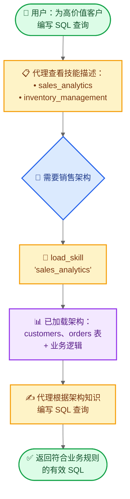

import ChatModelTabsPy from '/snippets/chat-model-tabs.mdx';
import ChatModelTabsJs from '/snippets/chat-model-tabs-js.mdx';

本教程展示如何使用**渐进式披露**——一种上下文管理技术，让代理按需加载信息而非预先全部加载——来实现**技能**（基于提示的专业化指令）。代理通过工具调用加载技能，而非动态修改系统提示，只发现和加载每个任务所需的技能。

**使用场景：** 设想构建一个代理，帮助在大型企业中跨不同业务垂直领域编写 SQL 查询。你的组织可能为每个垂直领域维护独立的数据存储，或者使用一个包含数千张表的单体数据库。无论哪种情况，预先加载所有架构都会超出上下文窗口的承载能力。渐进式披露通过仅在需要时加载相关架构来解决这一问题。这种架构还允许不同的产品负责人和利益相关者独立贡献并维护各自业务垂直领域的技能。

**你将构建什么：** 一个具有两项技能（销售分析和库存管理）的 SQL 查询助手。代理在系统提示中看到轻量级技能描述，然后仅在与用户查询相关时，才通过工具调用加载完整的数据库架构和业务逻辑。

<Note>
有关包含查询执行、错误修正和验证的更完整 SQL 代理示例，请参阅我们的 [SQL 代理教程](/oss/python/langchain/sql-agent)。本教程专注于渐进式披露模式，该模式可应用于任何领域。
</Note>

<Tip>
渐进式披露由 Anthropic 推广，作为构建可扩展代理技能系统的技术。该方法使用三级架构（元数据 → 核心内容 → 详细资源），代理仅在需要时加载信息。有关此技术的更多信息，请参阅 [Equipping agents for the real world with Agent Skills](https://www.anthropic.com/engineering/equipping-agents-for-the-real-world-with-agent-skills)。
</Tip>

## 工作原理

以下是用户请求 SQL 查询时的工作流程：



**为何使用渐进式披露：**
- **减少上下文占用** - 仅加载任务所需的 2-3 个技能，而非所有可用技能
- **实现团队自治** - 不同团队可以独立开发专业技能（类似于其他多代理架构）
- **高效扩展** - 可添加数十或数百个技能，而不会使上下文超载
- **简化对话历史** - 单一代理维护一条对话线程

**什么是技能：** 技能（由 Claude Code 推广）主要基于提示：它们是针对特定业务任务的自包含专业化指令单元。在 Claude Code 中，技能以文件系统上的目录和文件形式呈现，通过文件操作发现。技能通过提示引导行为，可提供工具使用说明，或为编码代理提供可执行的示例代码。

<Tip>
带有渐进式披露的技能可以被视为一种 [RAG（检索增强生成）](/oss/python/langchain/rag) 形式，其中每个技能都是一个检索单元——不一定依赖嵌入或关键字搜索，而是通过浏览内容的工具（如文件操作，或本教程中的直接查找）来实现。
</Tip>

**权衡：**
- **延迟**：按需加载技能需要额外的工具调用，这会为每个技能的首次请求增加延迟
- **工作流控制**：基础实现依赖提示来引导技能使用——如果没有自定义逻辑，你无法强制执行"始终先尝试技能 A，再尝试技能 B"之类的硬约束

<Tip>
**实现你自己的技能系统**

在构建自己的技能实现时（如本教程所示），核心概念是渐进式披露——按需加载信息。除此之外，你在实现上拥有完全的灵活性：

- **存储**：数据库、S3、内存数据结构或任何后端
- **发现**：直接查找（本教程）、针对大型技能集合的 RAG、文件系统扫描或 API 调用
- **加载逻辑**：自定义延迟特性，并添加逻辑来搜索技能内容或对相关性进行排名
- **副作用**：定义技能加载时发生的事情，例如暴露与该技能关联的工具（在第 8 节中介绍）

这种灵活性让你可以根据性能、存储和工作流控制的具体要求进行优化。
</Tip>

## 配置

### 安装

本教程需要 `langchain` 包：

<CodeGroup>
```bash pip
pip install langchain
```
```bash uv
uv add langchain
```
```bash conda
conda install langchain -c conda-forge
```
</CodeGroup>


有关更多详情，请参阅我们的[安装指南](/oss/python/langchain/install)。

### LangSmith

设置 [LangSmith](https://smith.langchain.com) 以检查代理内部发生的情况。然后设置以下环境变量：

<CodeGroup>
```bash bash
export LANGSMITH_TRACING="true"
export LANGSMITH_API_KEY="..."
```
```python python
import getpass
import os

os.environ["LANGSMITH_TRACING"] = "true"
os.environ["LANGSMITH_API_KEY"] = getpass.getpass()
```
</CodeGroup>


### 选择 LLM

从 LangChain 的集成套件中选择一个聊天模型：

<ChatModelTabsPy />


## 1. 定义技能

首先，定义技能的结构。每个技能包含名称、简短描述（显示在系统提示中）和完整内容（按需加载）：

```python
from typing import TypedDict

class Skill(TypedDict):  # [!code highlight]
    """A skill that can be progressively disclosed to the agent."""
    name: str  # Unique identifier for the skill
    description: str  # 1-2 sentence description to show in system prompt
    content: str  # Full skill content with detailed instructions
```


现在为 SQL 查询助手定义示例技能。这些技能被设计为**描述轻量**（预先显示给代理）但**内容详细**（仅在需要时加载）：

<Accordion title="查看完整技能定义">

```python
SKILLS: list[Skill] = [
    {
        "name": "sales_analytics",
        "description": "Database schema and business logic for sales data analysis including customers, orders, and revenue.",
        "content": """# Sales Analytics Schema

## Tables

### customers
- customer_id (PRIMARY KEY)
- name
- email
- signup_date
- status (active/inactive)
- customer_tier (bronze/silver/gold/platinum)

### orders
- order_id (PRIMARY KEY)
- customer_id (FOREIGN KEY -> customers)
- order_date
- status (pending/completed/cancelled/refunded)
- total_amount
- sales_region (north/south/east/west)

### order_items
- item_id (PRIMARY KEY)
- order_id (FOREIGN KEY -> orders)
- product_id
- quantity
- unit_price
- discount_percent

## Business Logic

**Active customers**: status = 'active' AND signup_date <= CURRENT_DATE - INTERVAL '90 days'

**Revenue calculation**: Only count orders with status = 'completed'. Use total_amount from orders table, which already accounts for discounts.

**Customer lifetime value (CLV)**: Sum of all completed order amounts for a customer.

**High-value orders**: Orders with total_amount > 1000

## Example Query

-- Get top 10 customers by revenue in the last quarter
SELECT
    c.customer_id,
    c.name,
    c.customer_tier,
    SUM(o.total_amount) as total_revenue
FROM customers c
JOIN orders o ON c.customer_id = o.customer_id
WHERE o.status = 'completed'
  AND o.order_date >= CURRENT_DATE - INTERVAL '3 months'
GROUP BY c.customer_id, c.name, c.customer_tier
ORDER BY total_revenue DESC
LIMIT 10;
""",
    },
    {
        "name": "inventory_management",
        "description": "Database schema and business logic for inventory tracking including products, warehouses, and stock levels.",
        "content": """# Inventory Management Schema

## Tables

### products
- product_id (PRIMARY KEY)
- product_name
- sku
- category
- unit_cost
- reorder_point (minimum stock level before reordering)
- discontinued (boolean)

### warehouses
- warehouse_id (PRIMARY KEY)
- warehouse_name
- location
- capacity

### inventory
- inventory_id (PRIMARY KEY)
- product_id (FOREIGN KEY -> products)
- warehouse_id (FOREIGN KEY -> warehouses)
- quantity_on_hand
- last_updated

### stock_movements
- movement_id (PRIMARY KEY)
- product_id (FOREIGN KEY -> products)
- warehouse_id (FOREIGN KEY -> warehouses)
- movement_type (inbound/outbound/transfer/adjustment)
- quantity (positive for inbound, negative for outbound)
- movement_date
- reference_number

## Business Logic

**Available stock**: quantity_on_hand from inventory table where quantity_on_hand > 0

**Products needing reorder**: Products where total quantity_on_hand across all warehouses is less than or equal to the product's reorder_point

**Active products only**: Exclude products where discontinued = true unless specifically analyzing discontinued items

**Stock valuation**: quantity_on_hand * unit_cost for each product

## Example Query

-- Find products below reorder point across all warehouses
SELECT
    p.product_id,
    p.product_name,
    p.reorder_point,
    SUM(i.quantity_on_hand) as total_stock,
    p.unit_cost,
    (p.reorder_point - SUM(i.quantity_on_hand)) as units_to_reorder
FROM products p
JOIN inventory i ON p.product_id = i.product_id
WHERE p.discontinued = false
GROUP BY p.product_id, p.product_name, p.reorder_point, p.unit_cost
HAVING SUM(i.quantity_on_hand) <= p.reorder_point
ORDER BY units_to_reorder DESC;
""",
    },
]
```


</Accordion>

## 2. 创建技能加载工具

创建一个按需加载完整技能内容的工具：

```python
from langchain.tools import tool

@tool  # [!code highlight]
def load_skill(skill_name: str) -> str:
    """Load the full content of a skill into the agent's context.

    Use this when you need detailed information about how to handle a specific
    type of request. This will provide you with comprehensive instructions,
    policies, and guidelines for the skill area.

    Args:
        skill_name: The name of the skill to load (e.g., "expense_reporting", "travel_booking")
    """
    # Find and return the requested skill
    for skill in SKILLS:
        if skill["name"] == skill_name:
            return f"Loaded skill: {skill_name}\n\n{skill['content']}"  # [!code highlight]

    # Skill not found
    available = ", ".join(s["name"] for s in SKILLS)
    return f"Skill '{skill_name}' not found. Available skills: {available}"
```


`load_skill` 工具以字符串形式返回完整的技能内容，该内容将作为 ToolMessage 成为对话的一部分。有关创建和使用工具的更多详情，请参阅[工具指南](/oss/python/langchain/tools)。

## 3. 构建技能中间件

创建自定义中间件，将技能描述注入系统提示。该中间件使技能可被发现，而无需预先加载其完整内容。

<Note>
本指南演示了如何创建自定义中间件。有关中间件概念和模式的完整指南，请参阅[自定义中间件文档](/oss/python/langchain/middleware/custom)。
</Note>

```python
from langchain.agents.middleware import ModelRequest, ModelResponse, AgentMiddleware
from langchain.messages import SystemMessage
from typing import Callable

class SkillMiddleware(AgentMiddleware):  # [!code highlight]
    """Middleware that injects skill descriptions into the system prompt."""

    # Register the load_skill tool as a class variable
    tools = [load_skill]  # [!code highlight]

    def __init__(self):
        """Initialize and generate the skills prompt from SKILLS."""
        # Build skills prompt from the SKILLS list
        skills_list = []
        for skill in SKILLS:
            skills_list.append(
                f"- **{skill['name']}**: {skill['description']}"
            )
        self.skills_prompt = "\n".join(skills_list)

    def wrap_model_call(
        self,
        request: ModelRequest,
        handler: Callable[[ModelRequest], ModelResponse],
    ) -> ModelResponse:
        """Sync: Inject skill descriptions into system prompt."""
        # Build the skills addendum
        skills_addendum = ( # [!code highlight]
            f"\n\n## Available Skills\n\n{self.skills_prompt}\n\n" # [!code highlight]
            "Use the load_skill tool when you need detailed information " # [!code highlight]
            "about handling a specific type of request." # [!code highlight]
        )

        # Append to system message content blocks
        new_content = list(request.system_message.content_blocks) + [
            {"type": "text", "text": skills_addendum}
        ]
        new_system_message = SystemMessage(content=new_content)
        modified_request = request.override(system_message=new_system_message)
        return handler(modified_request)
```


中间件将技能描述追加到系统提示中，使代理能够感知可用技能，而无需预先加载其完整内容。`load_skill` 工具作为类变量注册，使其对代理可用。

<Note>
**生产注意事项**：本教程为简单起见在 `__init__` 中加载技能列表。在生产系统中，你可能希望改在 `before_agent` 钩子中加载技能，以便定期刷新，反映最新变更（例如，添加新技能或修改现有技能时）。详情请参阅 [before_agent 钩子文档](/oss/python/langchain/middleware/custom#before_agent)。
</Note>

## 4. 创建支持技能的代理

现在创建具有技能中间件和用于状态持久化的检查点器的代理：

```python
from langchain.agents import create_agent
from langgraph.checkpoint.memory import InMemorySaver

# Create the agent with skill support
agent = create_agent(
    model,
    system_prompt=(
        "You are a SQL query assistant that helps users "
        "write queries against business databases."
    ),
    middleware=[SkillMiddleware()],  # [!code highlight]
    checkpointer=InMemorySaver(),
)
```


代理现在在系统提示中可以访问技能描述，并可调用 `load_skill` 在需要时获取完整的技能内容。检查点器在对话轮次之间维护对话历史。

## 5. 测试渐进式披露

使用需要技能专属知识的问题测试代理：

```python
import uuid

# Configuration for this conversation thread
thread_id = str(uuid.uuid4())
config = {"configurable": {"thread_id": thread_id}}

# Ask for a SQL query
result = agent.invoke(  # [!code highlight]
    {
        "messages": [
            {
                "role": "user",
                "content": (
                    "Write a SQL query to find all customers "
                    "who made orders over $1000 in the last month"
                ),
            }
        ]
    },
    config
)

# Print the conversation
for message in result["messages"]:
    if hasattr(message, 'pretty_print'):
        message.pretty_print()
    else:
        print(f"{message.type}: {message.content}")
```


预期输出：

```
================================ Human Message =================================

Write a SQL query to find all customers who made orders over $1000 in the last month
================================== Ai Message ==================================
Tool Calls:
  load_skill (call_abc123)
 Call ID: call_abc123
  Args:
    skill_name: sales_analytics
================================= Tool Message =================================
Name: load_skill

Loaded skill: sales_analytics

# Sales Analytics Schema

## Tables

### customers
- customer_id (PRIMARY KEY)
- name
- email
- signup_date
- status (active/inactive)
- customer_tier (bronze/silver/gold/platinum)

### orders
- order_id (PRIMARY KEY)
- customer_id (FOREIGN KEY -> customers)
- order_date
- status (pending/completed/cancelled/refunded)
- total_amount
- sales_region (north/south/east/west)

[... rest of schema ...]

## Business Logic

**High-value orders**: Orders with `total_amount > 1000`
**Revenue calculation**: Only count orders with `status = 'completed'`

================================== Ai Message ==================================

Here's a SQL query to find all customers who made orders over $1000 in the last month:

\`\`\`sql
SELECT DISTINCT
    c.customer_id,
    c.name,
    c.email,
    c.customer_tier
FROM customers c
JOIN orders o ON c.customer_id = o.customer_id
WHERE o.total_amount > 1000
  AND o.status = 'completed'
  AND o.order_date >= CURRENT_DATE - INTERVAL '1 month'
ORDER BY c.customer_id;
\`\`\`

This query:
- Joins customers with their orders
- Filters for high-value orders (>$1000) using the total_amount field
- Only includes completed orders (as per the business logic)
- Restricts to orders from the last month
- Returns distinct customers to avoid duplicates if they made multiple qualifying orders
```

代理在系统提示中看到了轻量级技能描述，识别出该问题需要销售数据库知识，调用 `load_skill("sales_analytics")` 获取完整的架构和业务逻辑，然后利用这些信息按照数据库约定编写了正确的查询。

## 6. 进阶：使用自定义状态添加约束

<Accordion title="可选：跟踪已加载技能并强制工具约束">

你可以添加约束，强制某些工具仅在加载特定技能后才可用。这需要在自定义代理状态中跟踪已加载的技能。

### 定义自定义状态

首先，扩展代理状态以跟踪已加载的技能：

```python
from langchain.agents.middleware import AgentState

class CustomState(AgentState):  # [!code highlight]
    skills_loaded: NotRequired[list[str]]  # Track which skills have been loaded  # [!code highlight]
```


### 更新 load_skill 以修改状态

修改 `load_skill` 工具，使其在加载技能时更新状态：

```python
from langgraph.types import Command  # [!code highlight]
from langchain.tools import tool, ToolRuntime
from langchain.messages import ToolMessage  # [!code highlight]

@tool
def load_skill(skill_name: str, runtime: ToolRuntime) -> Command:  # [!code highlight]
    """Load the full content of a skill into the agent's context.

    Use this when you need detailed information about how to handle a specific
    type of request. This will provide you with comprehensive instructions,
    policies, and guidelines for the skill area.

    Args:
        skill_name: The name of the skill to load
    """
    # Find and return the requested skill
    for skill in SKILLS:
        if skill["name"] == skill_name:
            skill_content = f"Loaded skill: {skill_name}\n\n{skill['content']}"

            # Update state to track loaded skill
            return Command(  # [!code highlight]
                update={  # [!code highlight]
                    "messages": [  # [!code highlight]
                        ToolMessage(  # [!code highlight]
                            content=skill_content,  # [!code highlight]
                            tool_call_id=runtime.tool_call_id,  # [!code highlight]
                        )  # [!code highlight]
                    ],  # [!code highlight]
                    "skills_loaded": [skill_name],  # [!code highlight]
                }  # [!code highlight]
            )  # [!code highlight]

    # Skill not found
    available = ", ".join(s["name"] for s in SKILLS)
    return Command(
        update={
            "messages": [
                ToolMessage(
                    content=f"Skill '{skill_name}' not found. Available skills: {available}",
                    tool_call_id=runtime.tool_call_id,
                )
            ]
        }
    )
```


### 创建受约束的工具

创建一个只有在加载特定技能后才可使用的工具：

```python
@tool
def write_sql_query(  # [!code highlight]
    query: str,
    vertical: str,
    runtime: ToolRuntime,
) -> str:
    """Write and validate a SQL query for a specific business vertical.

    This tool helps format and validate SQL queries. You must load the
    appropriate skill first to understand the database schema.

    Args:
        query: The SQL query to write
        vertical: The business vertical (sales_analytics or inventory_management)
    """
    # Check if the required skill has been loaded
    skills_loaded = runtime.state.get("skills_loaded", [])  # [!code highlight]

    if vertical not in skills_loaded:  # [!code highlight]
        return (  # [!code highlight]
            f"Error: You must load the '{vertical}' skill first "  # [!code highlight]
            f"to understand the database schema before writing queries. "  # [!code highlight]
            f"Use load_skill('{vertical}') to load the schema."  # [!code highlight]
        )  # [!code highlight]

    # Validate and format the query
    return (
        f"SQL Query for {vertical}:\n\n"
        f"```sql\n{query}\n```\n\n"
        f"✓ Query validated against {vertical} schema\n"
        f"Ready to execute against the database."
    )
```


### 更新中间件和代理

更新中间件以使用自定义状态架构：

```python
class SkillMiddleware(AgentMiddleware[CustomState]):  # [!code highlight]
    """Middleware that injects skill descriptions into the system prompt."""

    state_schema = CustomState  # [!code highlight]
    tools = [load_skill, write_sql_query]  # [!code highlight]

    # ... rest of the middleware implementation stays the same
```


使用注册了受约束工具的中间件创建代理：

```python
agent = create_agent(
    model,
    system_prompt=(
        "You are a SQL query assistant that helps users "
        "write queries against business databases."
    ),
    middleware=[SkillMiddleware()],  # [!code highlight]
    checkpointer=InMemorySaver(),
)
```


现在，如果代理在加载所需技能之前尝试使用 `write_sql_query`，它将收到一条错误消息，提示其先加载对应技能（例如 `sales_analytics` 或 `inventory_management`）。这确保了代理在尝试验证查询之前拥有必要的架构知识。

</Accordion>

## 完整示例

<Accordion title="查看完整可运行脚本">

以下是结合本教程所有部分的完整可运行实现：

```python
import uuid
from typing import TypedDict, NotRequired
from langchain.tools import tool
from langchain.agents import create_agent
from langchain.agents.middleware import ModelRequest, ModelResponse, AgentMiddleware
from langchain.messages import SystemMessage
from langgraph.checkpoint.memory import InMemorySaver
from typing import Callable

# Define skill structure
class Skill(TypedDict):
    """A skill that can be progressively disclosed to the agent."""
    name: str
    description: str
    content: str

# Define skills with schemas and business logic
SKILLS: list[Skill] = [
    {
        "name": "sales_analytics",
        "description": "Database schema and business logic for sales data analysis including customers, orders, and revenue.",
        "content": """# Sales Analytics Schema

## Tables

### customers
- customer_id (PRIMARY KEY)
- name
- email
- signup_date
- status (active/inactive)
- customer_tier (bronze/silver/gold/platinum)

### orders
- order_id (PRIMARY KEY)
- customer_id (FOREIGN KEY -> customers)
- order_date
- status (pending/completed/cancelled/refunded)
- total_amount
- sales_region (north/south/east/west)

### order_items
- item_id (PRIMARY KEY)
- order_id (FOREIGN KEY -> orders)
- product_id
- quantity
- unit_price
- discount_percent

## Business Logic

**Active customers**: status = 'active' AND signup_date <= CURRENT_DATE - INTERVAL '90 days'

**Revenue calculation**: Only count orders with status = 'completed'. Use total_amount from orders table, which already accounts for discounts.

**Customer lifetime value (CLV)**: Sum of all completed order amounts for a customer.

**High-value orders**: Orders with total_amount > 1000

## Example Query

-- Get top 10 customers by revenue in the last quarter
SELECT
    c.customer_id,
    c.name,
    c.customer_tier,
    SUM(o.total_amount) as total_revenue
FROM customers c
JOIN orders o ON c.customer_id = o.customer_id
WHERE o.status = 'completed'
  AND o.order_date >= CURRENT_DATE - INTERVAL '3 months'
GROUP BY c.customer_id, c.name, c.customer_tier
ORDER BY total_revenue DESC
LIMIT 10;
""",
    },
    {
        "name": "inventory_management",
        "description": "Database schema and business logic for inventory tracking including products, warehouses, and stock levels.",
        "content": """# Inventory Management Schema

## Tables

### products
- product_id (PRIMARY KEY)
- product_name
- sku
- category
- unit_cost
- reorder_point (minimum stock level before reordering)
- discontinued (boolean)

### warehouses
- warehouse_id (PRIMARY KEY)
- warehouse_name
- location
- capacity

### inventory
- inventory_id (PRIMARY KEY)
- product_id (FOREIGN KEY -> products)
- warehouse_id (FOREIGN KEY -> warehouses)
- quantity_on_hand
- last_updated

### stock_movements
- movement_id (PRIMARY KEY)
- product_id (FOREIGN KEY -> products)
- warehouse_id (FOREIGN KEY -> warehouses)
- movement_type (inbound/outbound/transfer/adjustment)
- quantity (positive for inbound, negative for outbound)
- movement_date
- reference_number

## Business Logic

**Available stock**: quantity_on_hand from inventory table where quantity_on_hand > 0

**Products needing reorder**: Products where total quantity_on_hand across all warehouses is less than or equal to the product's reorder_point

**Active products only**: Exclude products where discontinued = true unless specifically analyzing discontinued items

**Stock valuation**: quantity_on_hand * unit_cost for each product

## Example Query

-- Find products below reorder point across all warehouses
SELECT
    p.product_id,
    p.product_name,
    p.reorder_point,
    SUM(i.quantity_on_hand) as total_stock,
    p.unit_cost,
    (p.reorder_point - SUM(i.quantity_on_hand)) as units_to_reorder
FROM products p
JOIN inventory i ON p.product_id = i.product_id
WHERE p.discontinued = false
GROUP BY p.product_id, p.product_name, p.reorder_point, p.unit_cost
HAVING SUM(i.quantity_on_hand) <= p.reorder_point
ORDER BY units_to_reorder DESC;
""",
    },
]

# Create skill loading tool
@tool
def load_skill(skill_name: str) -> str:
    """Load the full content of a skill into the agent's context.

    Use this when you need detailed information about how to handle a specific
    type of request. This will provide you with comprehensive instructions,
    policies, and guidelines for the skill area.

    Args:
        skill_name: The name of the skill to load (e.g., "sales_analytics", "inventory_management")
    """
    # Find and return the requested skill
    for skill in SKILLS:
        if skill["name"] == skill_name:
            return f"Loaded skill: {skill_name}\n\n{skill['content']}"

    # Skill not found
    available = ", ".join(s["name"] for s in SKILLS)
    return f"Skill '{skill_name}' not found. Available skills: {available}"

# Create skill middleware
class SkillMiddleware(AgentMiddleware):
    """Middleware that injects skill descriptions into the system prompt."""

    # Register the load_skill tool as a class variable
    tools = [load_skill]

    def __init__(self):
        """Initialize and generate the skills prompt from SKILLS."""
        # Build skills prompt from the SKILLS list
        skills_list = []
        for skill in SKILLS:
            skills_list.append(
                f"- **{skill['name']}**: {skill['description']}"
            )
        self.skills_prompt = "\n".join(skills_list)

    def wrap_model_call(
        self,
        request: ModelRequest,
        handler: Callable[[ModelRequest], ModelResponse],
    ) -> ModelResponse:
        """Sync: Inject skill descriptions into system prompt."""
        # Build the skills addendum
        skills_addendum = (
            f"\n\n## Available Skills\n\n{self.skills_prompt}\n\n"
            "Use the load_skill tool when you need detailed information "
            "about handling a specific type of request."
        )

        # Append to system message content blocks
        new_content = list(request.system_message.content_blocks) + [
            {"type": "text", "text": skills_addendum}
        ]
        new_system_message = SystemMessage(content=new_content)
        modified_request = request.override(system_message=new_system_message)
        return handler(modified_request)

# Initialize your chat model (replace with your model)
# Example: from langchain_anthropic import ChatAnthropic
# model = ChatAnthropic(model="claude-3-5-sonnet-20241022")
from langchain_openai import ChatOpenAI
model = ChatOpenAI(model="gpt-4")

# Create the agent with skill support
agent = create_agent(
    model,
    system_prompt=(
        "You are a SQL query assistant that helps users "
        "write queries against business databases."
    ),
    middleware=[SkillMiddleware()],
    checkpointer=InMemorySaver(),
)

# Example usage
if __name__ == "__main__":
    # Configuration for this conversation thread
    thread_id = str(uuid.uuid4())
    config = {"configurable": {"thread_id": thread_id}}

    # Ask for a SQL query
    result = agent.invoke(
        {
            "messages": [
                {
                    "role": "user",
                    "content": (
                        "Write a SQL query to find all customers "
                        "who made orders over $1000 in the last month"
                    ),
                }
            ]
        },
        config
    )

    # Print the conversation
    for message in result["messages"]:
        if hasattr(message, 'pretty_print'):
            message.pretty_print()
        else:
            print(f"{message.type}: {message.content}")
```


此完整示例包括：
- 带有完整数据库架构的技能定义
- 用于按需加载的 `load_skill` 工具
- 将技能描述注入系统提示的 `SkillMiddleware`
- 使用中间件和检查点器创建代理
- 展示代理如何加载技能并编写 SQL 查询的示例用法

运行此示例，你需要：
1. 安装所需包：`pip install langchain langchain-openai langgraph`
2. 设置 API 密钥（例如，`export OPENAI_API_KEY=...`）
3. 将模型初始化替换为你偏好的 LLM 提供商

</Accordion>

## 实现变体

<Accordion title="查看实现选项和权衡">

本教程将技能实现为通过工具调用加载的内存 Python 字典。然而，实现带技能的渐进式披露有多种方式：

**存储后端：**
- **内存**（本教程）：技能定义为 Python 数据结构，访问速度快，无 I/O 开销
- **文件系统**（Claude Code 方式）：技能以包含文件的目录形式存在，通过 `read_file` 等文件操作发现
- **远程存储**：技能存储在 S3、数据库、Notion 或 API 中，按需获取

**技能发现**（代理如何了解哪些技能存在）：
- **系统提示列表**：技能描述在系统提示中（本教程采用）
- **基于文件**：通过扫描目录发现技能（Claude Code 方式）
- **基于注册表**：查询技能注册表服务或 API 获取可用技能
- **动态查找**：通过工具调用列出可用技能

**渐进式披露策略**（如何加载技能内容）：
- **单次加载**：在一次工具调用中加载整个技能内容（本教程采用）
- **分页加载**：以多页/块形式加载技能内容（适用于大型技能）
- **基于搜索**：在特定技能内容中搜索相关部分（例如，对技能文件使用 grep/read 操作）
- **层次化**：先加载技能概览，再深入特定子部分

**规模考量**（未校准的思维模型——请根据你的系统优化）：
- **小型技能**（< 1K token / ~750 词）：可直接包含在系统提示中，并通过提示缓存节省成本、加快响应
- **中型技能**（1-10K token / ~750-7.5K 词）：受益于按需加载，避免上下文开销（本教程）
- **大型技能**（> 10K token / ~7.5K 词，或占上下文窗口的 5-10% 以上）：应使用分页、基于搜索的加载或层次化探索等渐进式披露技术，避免占用过多上下文

选择取决于你的需求：内存方式最快但需要重新部署才能更新技能；而基于文件或远程存储则无需更改代码即可实现动态技能管理。

</Accordion>

## 渐进式披露与上下文工程

<Accordion title="与少样本提示及其他技术结合">

渐进式披露本质上是一种**[上下文工程](/oss/python/langchain/context-engineering)技术**——你管理着代理可获取哪些信息以及何时获取。本教程专注于加载数据库架构，但相同的原则适用于其他类型的上下文。

### 与少样本提示结合

对于 SQL 查询使用场景，你可以扩展渐进式披露，动态加载与用户查询相匹配的**少样本示例**：

**示例方案：**
1. 用户提问："查找 6 个月内未下单的客户"
2. 代理加载 `sales_analytics` 架构（如本教程所示）
3. 代理还加载 2-3 个相关示例查询（通过语义搜索或基于标签的查找）：
   - 查找非活跃客户的查询
   - 带日期过滤的查询
   - 连接 customers 和 orders 表的查询
4. 代理同时利用架构知识和示例模式编写查询

渐进式披露（按需加载架构）与动态少样本提示（加载相关示例）的组合，创造了一种强大的上下文工程模式，可扩展到大型知识库，同时提供高质量、有据可查的输出。

</Accordion>

## 后续步骤

- 了解[中间件](/oss/python/langchain/middleware)以实现更动态的代理行为
- 探索[上下文工程](/oss/python/langchain/context-engineering)技术来管理代理上下文
- 探索[交接模式](/oss/python/langchain/multi-agent/handoffs-customer-support)用于顺序工作流
- 阅读[子代理模式](/oss/python/langchain/multi-agent/subagents-personal-assistant)用于并行任务路由
- 查看[多代理模式](/oss/python/langchain/multi-agent)了解专业代理的其他方法
- 使用 [LangSmith](https://smith.langchain.com) 调试和监控技能加载

---

<div className="source-links">
<Callout icon="edit">
    [在 GitHub 上编辑此页面](https://github.com/langchain-ai/docs/edit/main/src/oss/langchain/multi-agent/skills-sql-assistant.mdx) 或[提交问题](https://github.com/langchain-ai/docs/issues/new/choose)。
</Callout>
<Callout icon="terminal-2">
    [将这些文档连接](/use-these-docs)到 Claude、VSCode 等，通过 MCP 获取实时答案。
</Callout>
</div>
