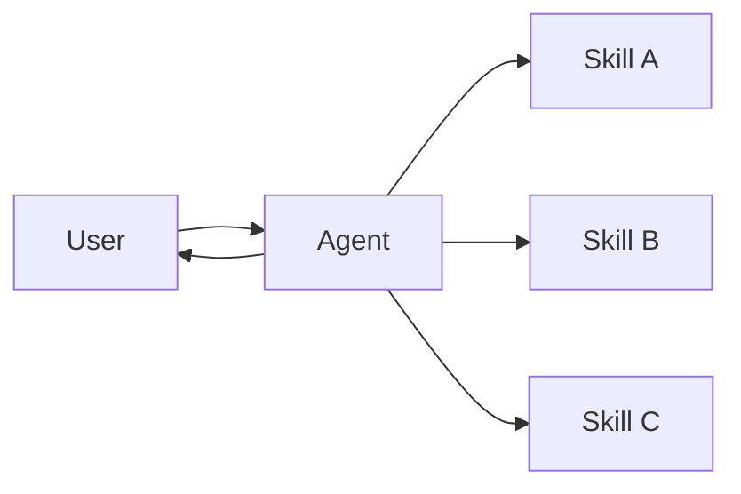

在 **skills** 架构中，专门的能力被打包为可调用的"技能"，以增强 [agent](/oss/python/langchain/agents) 的行为。技能主要是代理可以按需调用的提示驱动的专业化。
有关内置技能支持，请参阅 [Deep Agents](/oss/python/deepagents/skills)。

<Tip>
此模式在概念上与 [llms.txt](https://llmstxt.org/)（由 Jeremy Howard 引入）相同，它使用工具调用来渐进式公开文档。skills 模式将相同的方法应用于专门的提示和领域知识，而不仅仅是文档页面。
</Tip>



## 关键特性

* 提示驱动的专业化：技能主要由专门的提示定义
* 渐进式公开：技能根据上下文或用户需求变得可用
* 团队分布：不同团队可以独立开发和维护技能
* 轻量级组合：技能比完整的子代理更简单

## 何时使用

当你想要一个具有许多可能专业化的单个 [agent](/oss/python/langchain/agents)、不需要在技能之间强制执行特定约束，或者不同团队需要独立开发能力时，使用 skills 模式。常见示例包括编码助手（不同语言或任务的技能）、知识库（不同领域的技能）和创意助手（不同格式的技能）。

## 基本实现

```python
from langchain.tools import tool
from langchain.agents import create_agent

@tool
def load_skill(skill_name: str) -> str:
    """Load a specialized skill prompt.

    Available skills:
    - write_sql: SQL query writing expert
    - review_legal_doc: Legal document reviewer

    Returns the skill's prompt and context.
    """
    # Load skill content from file/database
    ...

agent = create_agent(
    model="gpt-4o",
    tools=[load_skill],
    system_prompt=(
        "You are a helpful assistant. "
        "You have access to two skills: "
        "write_sql and review_legal_doc. "
        "Use load_skill to access them."
    ),
)
```


有关完整实现，请参阅下面的教程。

<Card
    title="教程：构建按需技能的 SQL 助手"
    icon="wand-magic-sparkles"
    href="/oss/python/langchain/multi-agent/skills-sql-assistant"
    arrow cta="了解更多"
>
    学习如何使用渐进式公开实现技能，其中代理按需而不是预先加载专门的提示和模式。
</Card>

## 扩展模式

在编写自定义实现时，你可以通过几种方式扩展基本的 skills 模式：

- **动态工具注册**：将渐进式公开与状态管理结合起来，在技能加载时注册新的 [tools](/oss/python/langchain/tools)。例如，加载"database_admin"技能可以同时添加专门的上下文并注册特定于数据库的工具（备份、恢复、迁移）。这使用了跨多代理模式使用的相同工具和状态机制——工具更新状态以动态更改代理能力。

- **分层技能**：技能可以在树结构中定义其他技能，创建嵌套的专业化。例如，加载"data_science"技能可能会使"pandas_expert"、"visualization"和"statistical_analysis"等子技能可用。每个子技能可以根据需要独立加载，允许对领域知识进行细粒度的渐进式公开。这种分层方法通过将能力组织成可以按需发现和加载的逻辑分组来帮助管理大型知识库。

---

<Callout icon="pen-to-square" iconType="regular">
    [Edit this page on GitHub](https://github.com/langchain-ai/docs/edit/main/src/oss/langchain/multi-agent/skills.mdx) or [file an issue](https://github.com/langchain-ai/docs/issues/new/choose).
</Callout>
<Tip icon="terminal" iconType="regular">
    [Connect these docs](/use-these-docs) to Claude, VSCode, and more via MCP for real-time answers.
</Tip>
<div class='fixed right-2 bg-white bottom-2'></div>