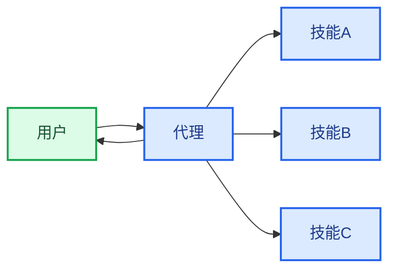

在**技能**架构中，专门的能力被封装为可调用的“技能”，以增强[代理](/oss/python/langchain/agents)的行为。技能主要是由提示驱动的专门化，代理可以按需调用。
有关内置技能支持，请参阅[深度代理](/oss/python/deepagents/skills)。

<Tip>
此模式在概念上与[代理技能](https://agentskills.io/)和[llms.txt](https://llmstxt.org/)（由Jeremy Howard引入）相同，后者使用工具调用来逐步披露文档。技能模式将逐步披露应用于专门的提示和领域知识，而不仅仅是文档页面。

有关可立即使用的技能，这些技能可提高您的代理在LangChain生态系统任务上的性能，请参阅[LangChain技能](https://github.com/langchain-ai/langchain-skills)仓库。
</Tip>



## 关键特性

* 提示驱动的专门化：技能主要由专门的提示定义
* 逐步披露：技能根据上下文或用户需求变得可用
* 团队分发：不同的团队可以独立开发和维护技能
* 轻量级组合：技能比完整的子代理更简单
* 引用感知：技能可以引用脚本、模板和其他资源

## 使用时机

当您希望一个[代理](/oss/python/langchain/agents)具有多种可能的专门化，不需要在技能之间强制执行特定约束，或者不同团队需要独立开发能力时，请使用技能模式。常见示例包括编码助手（针对不同语言或任务的技能）、知识库（针对不同领域的技能）和创意助手（针对不同格式的技能）。

## 基本实现

```python
from langchain.tools import tool
from langchain.agents import create_agent

@tool
def load_skill(skill_name: str) -> str:
    """加载专门的技能提示。

    可用技能：
    - write_sql: SQL查询编写专家
    - review_legal_doc: 法律文档审查器

    返回技能的提示和上下文。
    """
    # 从文件/数据库加载技能内容
    ...

agent = create_agent(
    model="gpt-4.1",
    tools=[load_skill],
    system_prompt=(
        "您是一个有用的助手。 "
        "您可以访问两个技能： "
        "write_sql 和 review_legal_doc。 "
        "使用 load_skill 来访问它们。"
    ),
)
```


有关完整实现，请参阅下面的教程。

<Card
    title="教程：使用按需技能构建SQL助手"
    icon="wand"
    href="/oss/python/langchain/multi-agent/skills-sql-assistant"
    arrow cta="了解更多"
>
    了解如何实现具有逐步披露的技能，其中代理按需加载专门的提示和模式，而不是预先加载。
</Card>

## 扩展模式

在编写自定义实现时，您可以通过以下几种方式扩展基本技能模式：

- **动态工具注册**：将逐步披露与状态管理相结合，在技能加载时注册新的[工具](/oss/python/langchain/tools)。例如，加载“database_admin”技能可以同时添加专门的上下文并注册数据库特定的工具（备份、恢复、迁移）。这使用了跨多代理模式相同的工具和状态机制——工具更新状态以动态更改代理能力。

- **分层技能**：技能可以在树结构中定义其他技能，创建嵌套的专门化。例如，加载“data_science”技能可能会使子技能如“pandas_expert”、“visualization”和“statistical_analysis”可用。每个子技能可以按需独立加载，允许对领域知识进行细粒度的逐步披露。这种分层方法通过将能力组织成逻辑组来帮助管理大型知识库，这些组可以按需发现和加载。

- **引用感知**：虽然每个技能只有一个提示，但该提示可以引用其他资产的位置，并提供有关代理何时应使用这些资产的信息。
当这些资产变得相关时，代理将知道这些文件存在，并在需要时将它们读入内存以完成任务。
这也遵循逐步披露模式，并限制上下文窗口中的信息。

---

<div className="source-links">
<Callout icon="edit">
    [在GitHub上编辑此页面](https://github.com/langchain-ai/docs/edit/main/src/oss/langchain/multi-agent/skills.mdx) 或 [提交问题](https://github.com/langchain-ai/docs/issues/new/choose)。
</Callout>
<Callout icon="terminal-2">
    [通过MCP将这些文档](/use-these-docs)连接到Claude、VSCode等，以获取实时答案。
</Callout>
</div>
