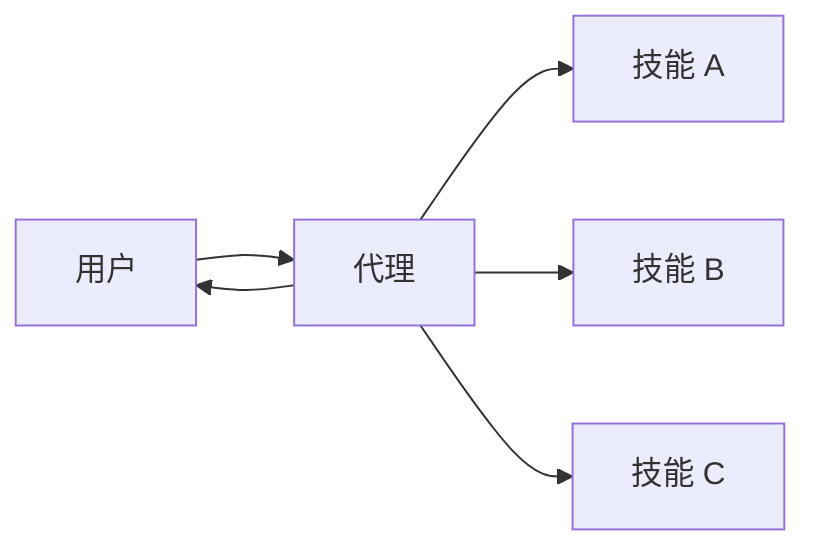

在**技能**架构中，专业能力被打包为可调用的"技能"，用于增强[代理](/oss/python/langchain/agents)的行为。技能主要是由提示词驱动的专业化能力，代理可以按需调用。
如需了解内置技能支持，请参阅 [Deep Agents](/oss/python/deepagents/skills)。

<Tip>
此模式在概念上与 [Agent Skills](https://agentskills.io/) 和 [llms.txt](https://llmstxt.org/)（由 Jeremy Howard 提出）相同，后者使用工具调用实现文档的渐进式披露。技能模式将渐进式披露应用于专业提示词和领域知识，而不仅仅是文档页面。
</Tip>



## 关键特征

* 提示词驱动的专业化：技能主要由专业提示词定义
* 渐进式披露：技能根据上下文或用户需求按需提供
* 团队分布：不同团队可以独立开发和维护技能
* 轻量级组合：技能比完整的子代理更简单
* 资源感知：技能可以引用脚本、模板和其他资源

## 适用场景

当你希望单个[代理](/oss/python/langchain/agents)具备多种专业化能力、不需要在技能之间强制执行特定约束，或者不同团队需要独立开发能力时，请使用技能模式。常见示例包括编程助手（针对不同语言或任务的技能）、知识库（针对不同领域的技能）和创意助手（针对不同格式的技能）。

## 基本实现

```python
from langchain.tools import tool
from langchain.agents import create_agent

@tool
def load_skill(skill_name: str) -> str:
    """Load a specialized skill prompt.

    Available skills:
    - write_sql: SQL query writing expert
    - review_legal_doc: Legal document reviewer

    Returns the skill's prompt and context.
    """
    # Load skill content from file/database
    ...

agent = create_agent(
    model="gpt-4.1",
    tools=[load_skill],
    system_prompt=(
        "You are a helpful assistant. "
        "You have access to two skills: "
        "write_sql and review_legal_doc. "
        "Use load_skill to access them."
    ),
)
```


完整实现请参阅下方教程。

<Card
    title="教程：使用按需技能构建 SQL 助手"
    icon="wand"
    href="/oss/python/langchain/multi-agent/skills-sql-assistant"
    arrow cta="了解更多"
>
    了解如何通过渐进式披露实现技能，代理按需加载专业提示词和模式，而不是在启动时一次性加载。
</Card>

## 扩展模式

在编写自定义实现时，你可以通过多种方式扩展基本技能模式：

- **动态工具注册**：将渐进式披露与状态管理结合，在技能加载时注册新的[工具](/oss/python/langchain/tools)。例如，加载"database_admin"技能可以同时添加专业上下文并注册数据库专用工具（备份、恢复、迁移）。这使用了多代理模式中相同的工具与状态机制——通过工具更新状态来动态改变代理能力。

- **分层技能**：技能可以以树状结构定义其他技能，创建嵌套专业化。例如，加载"data_science"技能可能会提供"pandas_expert"、"visualization"和"statistical_analysis"等子技能。每个子技能可以根据需要独立加载，从而实现对领域知识的细粒度渐进式披露。这种分层方式通过将能力组织成可发现、可按需加载的逻辑分组，有助于管理大型知识库。

- **资源感知**：虽然每个技能只有一个提示词，但这个提示词可以引用其他资源的位置，并提供代理应何时使用这些资源的信息。当这些资源变得相关时，代理将知道这些文件的存在，并根据需要将其读入内存以完成任务。这同样遵循渐进式披露模式，并限制了上下文窗口中的信息量。

---

<div className="source-links">
<Callout icon="edit">
    [在 GitHub 上编辑此页面](https://github.com/langchain-ai/docs/edit/main/src/oss/langchain/multi-agent/skills.mdx) 或 [提交问题](https://github.com/langchain-ai/docs/issues/new/choose)。
</Callout>
<Callout icon="terminal-2">
    通过 MCP [将这些文档接入](/use-these-docs) Claude、VSCode 等工具以获取实时答案。
</Callout>
</div>
