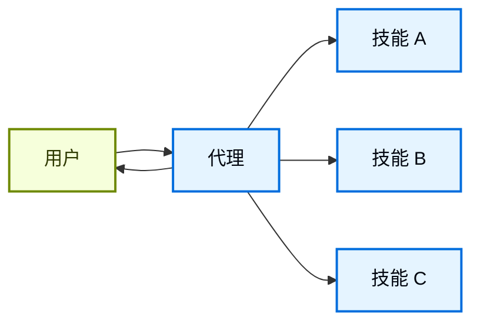

在**技能**架构中，专门的能力被封装为可调用的“技能”，用于增强[代理](/oss/python/langchain/agents)的行为。技能主要是基于提示的专门化功能，代理可以按需调用。
有关内置技能支持，请参阅 [Deep Agents](/oss/python/deepagents/skills)。

<Tip>
此模式在概念上与 [Agent Skills](https://agentskills.io/) 和 [llms.txt](https://llmstxt.org/)（由 Jeremy Howard 提出）相同，后者使用工具调用来渐进式披露文档。技能模式将渐进式披露应用于专门的提示和领域知识，而不仅仅是文档页面。

有关可直接使用、能提升代理在 LangChain 生态系统任务中表现的技能，请参阅 [LangChain Skills](https://github.com/langchain-ai/langchain-skills) 仓库。
</Tip>


```mermaid
graph LR
    A[用户] --> B[代理]
    B --> C[技能 A]
    B --> D[技能 B]
    B --> E[技能 C]
    B --> A

    classDef trigger fill:#F6FFDB,stroke:#6E8900,stroke-width:2px,color:#2E3900
    classDef process fill:#E5F4FF,stroke:#006DDD,stroke-width:2px,color:#030710

    class A trigger
    class B,C,D,E process
```

## 关键特性

*   基于提示的专门化：技能主要由专门的提示定义
*   渐进式披露：技能根据上下文或用户需求变得可用
*   团队分发：不同团队可以独立开发和维护技能
*   轻量级组合：技能比完整的子代理更简单
*   引用感知：技能可以引用脚本、模板和其他资源

## 何时使用

当你想要一个具有多种可能专门化功能的单一[代理](/oss/python/langchain/agents)，不需要在技能之间强制执行特定约束，或者不同团队需要独立开发能力时，请使用技能模式。常见示例包括编码助手（针对不同语言或任务的技能）、知识库（针对不同领域的技能）和创意助手（针对不同格式的技能）。

## 基本实现

```python
from langchain.tools import tool
from langchain.agents import create_agent

@tool
def load_skill(skill_name: str) -> str:
    """加载一个专门的技能提示。

    可用技能：
    - write_sql：SQL 查询编写专家
    - review_legal_doc：法律文档审查员

    返回技能的提示和上下文。
    """
    # 从文件/数据库加载技能内容
    ...

agent = create_agent(
    model="gpt-5.4",
    tools=[load_skill],
    system_prompt=(
        "你是一个有用的助手。"
        "你可以访问两个技能："
        "write_sql 和 review_legal_doc。"
        "使用 load_skill 来访问它们。"
    ),
)
```

有关完整实现，请参阅下面的教程。

<Card
    title="教程：构建一个按需加载技能的 SQL 助手"
    icon="wand"
    href="/oss/python/langchain/multi-agent/skills-sql-assistant"
    arrow cta="了解更多"
>
    了解如何实现具有渐进式披露的技能，代理按需加载专门的提示和模式，而不是预先加载。
</Card>

## 扩展模式

编写自定义实现时，你可以通过多种方式扩展基本技能模式：

- **动态工具注册**：将渐进式披露与状态管理相结合，在技能加载时注册新的[工具](/oss/python/langchain/tools)。例如，加载一个“database_admin”技能可以同时添加专门的上下文并注册特定于数据库的工具（备份、恢复、迁移）。这使用了跨多代理模式使用的相同工具和状态机制——工具更新状态以动态改变代理能力。

- **分层技能**：技能可以在树状结构中定义其他技能，创建嵌套的专门化。例如，加载一个“data_science”技能可能会提供子技能，如“pandas_expert”、“visualization”和“statistical_analysis”。每个子技能可以根据需要独立加载，从而实现领域知识的细粒度渐进式披露。这种分层方法通过将能力组织成逻辑分组来帮助管理大型知识库，这些分组可以按需发现和加载。

- **引用感知**：虽然每个技能只有一个提示，但此提示可以引用其他资源的位置，并提供代理应在何时使用这些资源的信息。当这些资源变得相关时，代理将知道这些文件存在，并根据需要将它们读入内存以完成任务。这也遵循渐进式披露模式，并限制了上下文窗口中的信息。

---

<div className="source-links">
<Callout icon="terminal-2">
    [将这些文档](/use-these-docs)通过 MCP 连接到 Claude、VSCode 等，以获取实时答案。
</Callout>
<Callout icon="edit">
    [在 GitHub 上编辑此页面](https://github.com/langchain-ai/docs/edit/main/src/oss/langchain/multi-agent/skills.mdx) 或 [提交问题](https://github.com/langchain-ai/docs/issues/new/choose)。
</Callout>
</div>