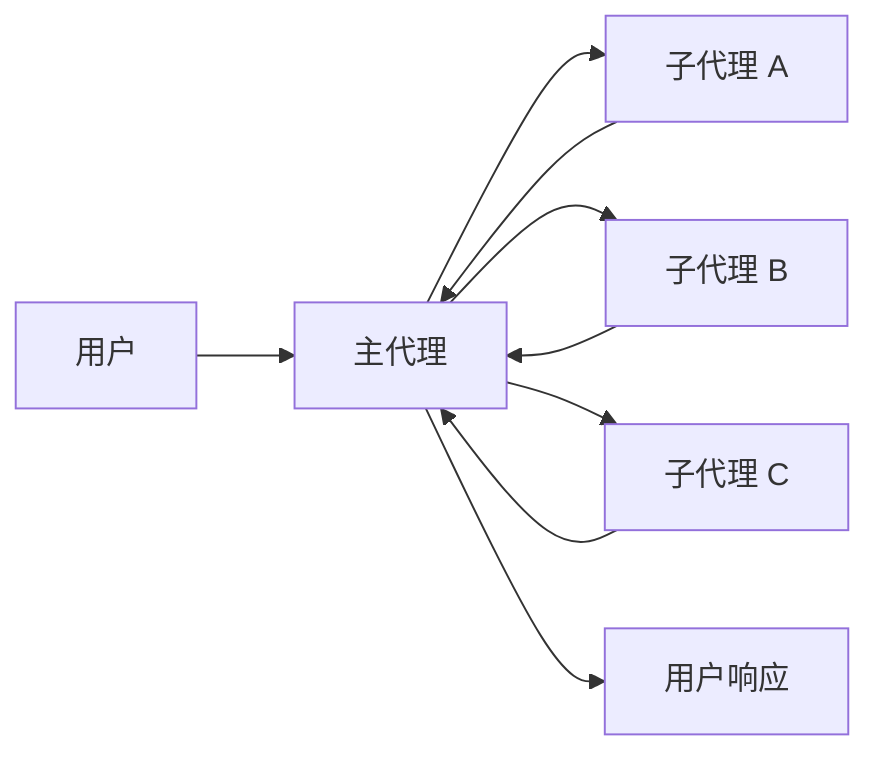
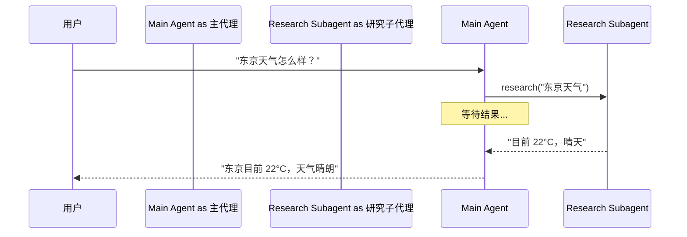
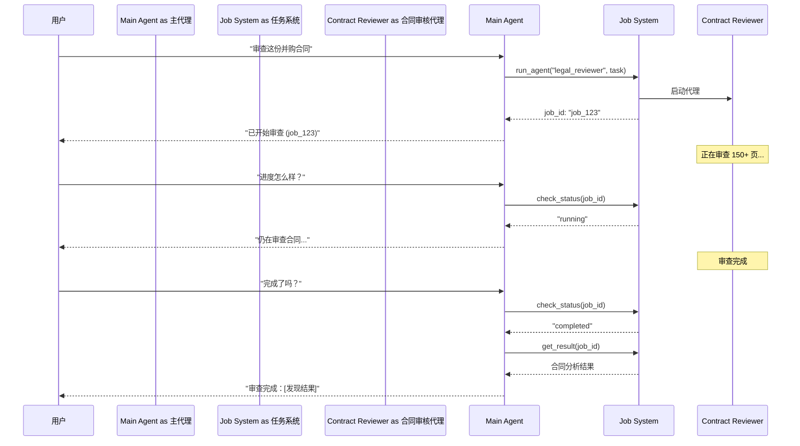
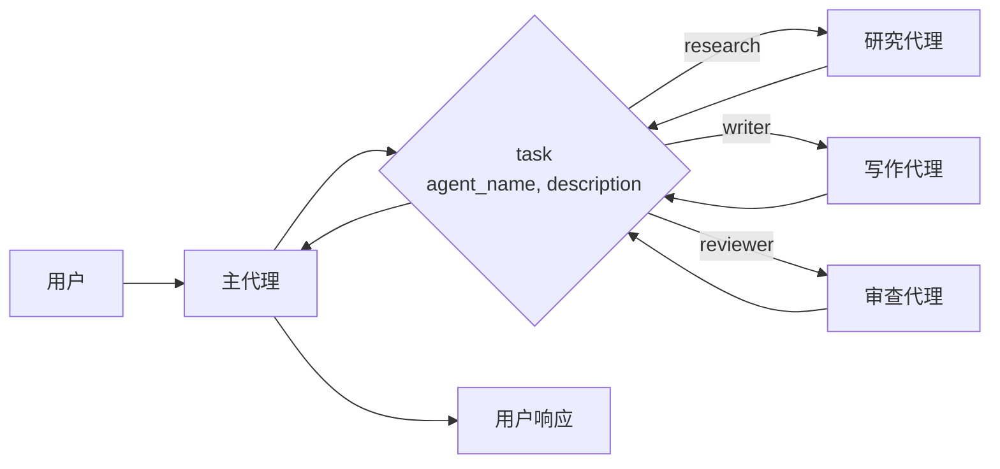

在**子代理（subagents）**架构中，一个中央主[代理](/oss/python/langchain/agents)（通常称为**监督者**）通过将子代理作为[工具](/oss/python/langchain/tools)来调用，从而协调各个子代理。主代理决定调用哪个子代理、提供什么输入，以及如何合并结果。子代理是无状态的——它们不记得过去的交互，所有对话记忆由主代理维护。这提供了[上下文](/oss/python/langchain/context-engineering)隔离：每次子代理调用都在干净的上下文窗口中进行，防止主对话中的上下文膨胀。



## 核心特征

* 集中控制：所有路由都通过主代理
* 无直接用户交互：子代理将结果返回给主代理，而不是用户（尽管您可以在子代理中使用[中断](/oss/python/langgraph/interrupts#interrupt)来允许用户交互）
* 通过工具调用子代理：子代理通过工具调用
* 并行执行：主代理可以在单次轮次中调用多个子代理

<Note>
**监督者与路由器**：监督者代理（此模式）与[路由器](/oss/python/langchain/multi-agent/router)不同。监督者是一个完整的代理，它维护对话上下文并在多个轮次中动态决定调用哪些子代理。路由器通常是一个单一的分类步骤，将请求分发给代理，而不维护持续的对话状态。
</Note>

## 适用场景

当您有多个不同的领域（例如日历、邮件、CRM、数据库），子代理不需要直接与用户对话，或者您希望进行集中式工作流控制时，请使用子代理模式。对于只有少量[工具](/oss/python/langchain/tools)的简单情况，请使用[单代理](/oss/python/langchain/agents)。

<Tip>
**需要在子代理中进行用户交互？** 虽然子代理通常将结果返回给主代理而不是直接与用户对话，但您可以在子代理中使用[中断](/oss/python/langgraph/interrupts#interrupt)来暂停执行并收集用户输入。当子代理在继续处理前需要澄清或审批时，这非常有用。主代理仍然是协调者，但子代理可以在任务中途从用户处收集信息。
</Tip>

## 基础实现

核心机制是将子代理包装为主代理可以调用的工具：

```python
from langchain.tools import tool
from langchain.agents import create_agent

# Create a subagent
subagent = create_agent(model="anthropic:claude-sonnet-4-20250514", tools=[...])

# Wrap it as a tool
@tool("research", description="Research a topic and return findings")
def call_research_agent(query: str):
    result = subagent.invoke({"messages": [{"role": "user", "content": query}]})
    return result["messages"][-1].content

# Main agent with subagent as a tool
main_agent = create_agent(model="anthropic:claude-sonnet-4-20250514", tools=[call_research_agent])
```


<Card
    title="教程：使用子代理构建个人助手"
    icon="sitemap"
    href="/oss/python/langchain/multi-agent/subagents-personal-assistant"
    arrow cta="了解更多"
>
    学习如何使用子代理模式构建个人助手，其中一个中央主代理（监督者）协调多个专业工作代理。
</Card>

## 设计决策

在实现子代理模式时，您需要做出几个关键的设计选择。下表总结了各选项——每项都在以下章节中详细介绍。

| 决策 | 选项 |
|----------|---------|
| [**同步 vs. 异步**](#sync-vs-async) | 同步（阻塞）vs. 异步（后台） |
| [**工具模式**](#tool-patterns) | 每个代理一个工具 vs. 单一调度工具 |
| [**子代理规格**](#subagent-specs) | 系统提示词 vs. 枚举约束 vs. 基于工具的发现（仅限单一调度工具） |
| [**子代理输入**](#subagent-inputs) | 仅查询 vs. 完整上下文 |
| [**子代理输出**](#subagent-outputs) | 子代理结果 vs. 完整对话历史 |

## 同步 vs. 异步

子代理执行可以是**同步**（阻塞）或**异步**（后台）的。您的选择取决于主代理是否需要结果才能继续。

| 模式 | 主代理行为 | 最适合 | 权衡 |
|------|---------------------|----------|----------|
| **同步** | 等待子代理完成 | 主代理需要结果才能继续 | 简单，但会阻塞对话 |
| **异步** | 子代理在后台运行时继续执行 | 独立任务，用户无需等待 | 响应快，但更复杂 |

<Tip>
不要与 Python 的 `async`/`await` 混淆。这里的"异步"意味着主代理启动一个后台任务（通常在单独的进程或服务中），并在不阻塞的情况下继续运行。
</Tip>

### 同步（默认）

默认情况下，子代理调用是**同步的**——主代理等待每个子代理完成后再继续。当主代理的下一步操作依赖于子代理的结果时，请使用同步方式。



**何时使用同步：**
- 主代理需要子代理的结果才能构建响应
- 任务有顺序依赖（例如，获取数据 → 分析 → 响应）
- 子代理失败应阻止主代理的响应

**权衡：**
- 实现简单——只需调用并等待
- 在所有子代理完成之前，用户看不到任何响应
- 长时间运行的任务会冻结对话

### 异步

当子代理的工作是独立的时，请使用**异步执行**——主代理不需要结果来继续与用户对话。主代理启动一个后台任务，同时保持响应。



**何时使用异步：**
- 子代理的工作独立于主对话流程
- 用户应该能够在后台工作进行时继续聊天
- 您想并行运行多个独立任务

**三工具模式：**
1. **启动任务**：启动后台任务，返回任务 ID
2. **检查状态**：返回当前状态（等待中、运行中、已完成、失败）
3. **获取结果**：检索已完成的结果

**处理任务完成：** 当任务完成时，您的应用程序需要通知用户。一种方法：显示一条通知，点击后发送一条 `HumanMessage`，例如"检查 job_123 并总结结果。"

## 工具模式

将子代理暴露为工具的主要方式有两种：

| 模式 | 最适合 | 权衡 |
|---------|----------|-----------|
| [**每个代理一个工具**](#tool-per-agent) | 对每个子代理的输入/输出进行精细控制 | 设置更多，但可自定义性更强 |
| [**单一调度工具**](#single-dispatch-tool) | 多个代理、分布式团队、约定优于配置 | 组合更简单，但每个代理的自定义性较少 |

### 每个代理一个工具


核心思路是将子代理包装为主代理可以调用的工具：

```python
from langchain.tools import tool
from langchain.agents import create_agent

# Create a sub-agent
subagent = create_agent(model="...", tools=[...])  # [!code highlight]

# Wrap it as a tool  # [!code highlight]
@tool("subagent_name", description="subagent_description")  # [!code highlight]
def call_subagent(query: str):  # [!code highlight]
    result = subagent.invoke({"messages": [{"role": "user", "content": query}]})
    return result["messages"][-1].content

# Main agent with subagent as a tool  # [!code highlight]
main_agent = create_agent(model="...", tools=[call_subagent])  # [!code highlight]
```


主代理在认为任务符合子代理描述时调用子代理工具，接收结果，然后继续协调。有关精细控制，请参阅[上下文工程](#context-engineering)。

### 单一调度工具

另一种方法是使用单个参数化工具来调用处理独立任务的临时子代理。与[每个代理一个工具](#tool-per-agent)方法（每个子代理被包装为独立工具）不同，这种方法使用基于约定的单个 `task` 工具：任务描述作为 human message 传递给子代理，子代理的最终消息作为工具结果返回。

当您希望将代理开发分布在多个团队中、需要将复杂任务隔离到单独的上下文窗口中、需要一种可扩展的方式来添加新代理而无需修改协调者，或者偏好约定优于自定义时，请使用此方法。此方法以上下文工程的灵活性换取代理组合的简单性和强大的上下文隔离。



**核心特征：**

* 单一任务工具：一个参数化工具，可以通过名称调用任何已注册的子代理
* 基于约定的调用：通过名称选择代理，任务作为 human message 传递，最终消息作为工具结果返回
* 团队分布：不同团队可以独立开发和部署代理
* 代理发现：子代理可以通过系统提示词（列出可用代理）或[渐进式披露](/oss/python/langchain/multi-agent/skills-sql-assistant)（通过工具按需加载代理信息）来发现

<Tip>
这种方法的一个有趣之处在于，子代理可能与主代理具有完全相同的能力。在这种情况下，调用子代理**真正的目的是上下文隔离**——允许复杂的多步骤任务在隔离的上下文窗口中运行，而不会使主代理的对话历史膨胀。子代理自主完成其工作，并只返回简洁的摘要，使主线程保持专注和高效。
</Tip>

<Accordion title="带任务调度器的代理注册表">

```python
from langchain.tools import tool
from langchain.agents import create_agent

# Sub-agents developed by different teams
research_agent = create_agent(
    model="gpt-4.1",
    prompt="You are a research specialist..."
)

writer_agent = create_agent(
    model="gpt-4.1",
    prompt="You are a writing specialist..."
)

# Registry of available sub-agents
SUBAGENTS = {
    "research": research_agent,
    "writer": writer_agent,
}

@tool
def task(
    agent_name: str,
    description: str
) -> str:
    """Launch an ephemeral subagent for a task.

    Available agents:
    - research: Research and fact-finding
    - writer: Content creation and editing
    """
    agent = SUBAGENTS[agent_name]
    result = agent.invoke({
        "messages": [
            {"role": "user", "content": description}
        ]
    })
    return result["messages"][-1].content

# Main coordinator agent
main_agent = create_agent(
    model="gpt-4.1",
    tools=[task],
    system_prompt=(
        "You coordinate specialized sub-agents. "
        "Available: research (fact-finding), "
        "writer (content creation). "
        "Use the task tool to delegate work."
    ),
)
```


</Accordion>

## 上下文工程

控制上下文在主代理和子代理之间的流动方式：

| 类别 | 目的 | 影响 |
|----------|---------|---------|
| [**子代理规格**](#subagent-specs) | 确保在应该调用子代理时调用它们 | 主代理路由决策 |
| [**子代理输入**](#subagent-inputs) | 确保子代理能够以优化的上下文高效执行 | 子代理性能 |
| [**子代理输出**](#subagent-outputs) | 确保监督者能够根据子代理结果采取行动 | 主代理性能 |

另请参阅我们关于代理[上下文工程](/oss/python/langchain/context-engineering)的综合指南。

### 子代理规格

与子代理关联的**名称**和**描述**是主代理了解调用哪个子代理的主要方式。这些是提示词杠杆——请谨慎选择。

* **名称**：主代理如何引用子代理。保持清晰且以行动为导向（例如 `research_agent`、`code_reviewer`）。
* **描述**：主代理了解子代理能力的内容。具体说明它处理哪些任务以及何时使用它。

对于[单一调度工具](#single-dispatch-tool)设计，您还必须向主代理提供有关其可以调用的子代理的信息。
您可以根据代理数量以及注册表是静态还是动态来以不同方式提供此信息：

| 方法 | 最适合 | 权衡 |
|--------|----------|----------|
| **系统提示词枚举** | 小型静态代理列表（< 10 个代理） | 简单，但代理变更时需要更新提示词 |
| **枚举约束** | 小型静态代理列表（< 10 个代理） | 类型安全且明确，但代理变更时需要修改代码 |
| **基于工具的发现** | 大型或动态代理注册表 | 灵活可扩展，但增加了复杂性 |

#### 系统提示词枚举

直接在主代理的系统提示词中列出可用代理。主代理将代理列表及其描述视为指令的一部分。

**何时使用：**
- 您有一小组固定的代理（< 10 个）
- 代理注册表很少更改
- 您想要最简单的实现

**示例：**
```python
main_agent = create_agent(
    model="...",
    tools=[task],
    system_prompt=(
        "You coordinate specialized sub-agents. "
        "Available agents:\n"
        "- research: Research and fact-finding\n"
        "- writer: Content creation and editing\n"
        "- reviewer: Code and document review\n"
        "Use the task tool to delegate work."
    ),
)
```

#### 调度工具上的枚举约束

在调度工具的 `agent_name` 参数中添加枚举约束。这提供了类型安全性，并在工具模式中明确了可用代理。

**何时使用：**
- 您有一小组固定的代理（< 10 个）
- 您需要类型安全性和明确的代理名称
- 您更倾向于基于模式的验证而非基于提示词的指引

**示例：**
```python
from enum import Enum

class AgentName(str, Enum):
    RESEARCH = "research"
    WRITER = "writer"
    REVIEWER = "reviewer"

@tool
def task(
    agent_name: AgentName,  # Enum constraint
    description: str
) -> str:
    """Launch an ephemeral subagent for a task."""
    # ...
```

#### 基于工具的发现

提供一个单独的工具（例如 `list_agents` 或 `search_agents`），主代理可以调用它来按需发现可用代理。这实现了渐进式披露并支持动态注册表。

**何时使用：**
- 您有许多代理（> 10 个）或不断增长的注册表
- 代理注册表经常变化或是动态的
- 您想减少提示词大小和 token 使用量
- 不同团队独立管理不同代理

**示例：**
```python
@tool
def list_agents(query: str = "") -> str:
    """List available subagents, optionally filtered by query."""
    agents = search_agent_registry(query)
    return format_agent_list(agents)

@tool
def task(agent_name: str, description: str) -> str:
    """Launch an ephemeral subagent for a task."""
    # ...

main_agent = create_agent(
    model="...",
    tools=[task, list_agents],
    system_prompt="Use list_agents to discover available subagents, then use task to invoke them."
)
```

### 子代理输入

自定义子代理接收到的上下文以执行其任务。通过从代理的状态中提取信息，添加在静态提示词中无法实际捕获的输入——完整消息历史、先前结果或任务元数据。

```python Subagent inputs example expandable
from langchain.agents import AgentState
from langchain.tools import tool, ToolRuntime

class CustomState(AgentState):
    example_state_key: str

@tool(
    "subagent1_name",
    description="subagent1_description"
)
def call_subagent1(query: str, runtime: ToolRuntime[None, CustomState]):
    # Apply any logic needed to transform the messages into a suitable input
    subagent_input = some_logic(query, runtime.state["messages"])
    result = subagent1.invoke({
        "messages": subagent_input,
        # You could also pass other state keys here as needed.
        # Make sure to define these in both the main and subagent's
        # state schemas.
        "example_state_key": runtime.state["example_state_key"]
    })
    return result["messages"][-1].content
```


### 子代理输出

自定义主代理接收到的内容，以便它能够做出良好的决策。两种策略：

1. **提示子代理**：明确指定应该返回什么。一个常见的失败模式是子代理执行工具调用或推理，但未在最终消息中包含结果——提醒它监督者只能看到最终输出。
2. **在代码中格式化**：在返回响应之前调整或丰富响应。例如，使用 [`Command`](/oss/python/langgraph/graph-api#command) 将特定状态键连同最终文本一起传回。

```python Subagent outputs example expandable
from typing import Annotated
from langchain.agents import AgentState
from langchain.tools import InjectedToolCallId
from langgraph.types import Command


@tool(
    "subagent1_name",
    description="subagent1_description"
)
def call_subagent1(
    query: str,
    tool_call_id: Annotated[str, InjectedToolCallId],
) -> Command:
    result = subagent1.invoke({
        "messages": [{"role": "user", "content": query}]
    })
    return Command(update={
        # Pass back additional state from the subagent
        "example_state_key": result["example_state_key"],
        "messages": [
            ToolMessage(
                content=result["messages"][-1].content,
                tool_call_id=tool_call_id
            )
        ]
    })
```


## 检查点与状态检查

默认情况下，子代理使用**继承检查点**模式——每次调用都以新鲜状态开始，支持[中断](/oss/python/langgraph/interrupts#interrupt)，并且可以安全地并行运行。如果您需要子代理在多次调用中维护自己的持久对话历史，请使用 `checkpointer=True`（续接模式）编译它。有关各模式的完整比较，请参阅[子图持久化](/oss/python/langgraph/use-subgraphs#subgraph-persistence)。

由于子代理是在工具函数内部调用的，LangGraph 无法[静态发现](/oss/python/langgraph/use-subgraphs#view-subgraph-state)它们。这意味着带 `subgraphs` 参数的 [`get_state`](/oss/python/langgraph/use-subgraphs#view-subgraph-state) 不会返回子代理状态。如果您需要读取嵌套图状态（例如在[中断](/oss/python/langgraph/interrupts#interrupt)期间），请改为从自定义图中的[节点函数](/oss/python/langgraph/use-subgraphs#call-a-subgraph-inside-a-node)调用子代理。有关每种模式如何影响状态可见性的详细信息，请参阅[子图持久化](/oss/python/langgraph/use-subgraphs#subgraph-persistence)。

---

<div className="source-links">
<Callout icon="edit">
    [在 GitHub 上编辑此页面](https://github.com/langchain-ai/docs/edit/main/src/oss/langchain/multi-agent/subagents.mdx) 或[提交问题](https://github.com/langchain-ai/docs/issues/new/choose)。
</Callout>
<Callout icon="terminal-2">
    [连接这些文档](/use-these-docs)到 Claude、VSCode 等，通过 MCP 获取实时解答。
</Callout>
</div>
