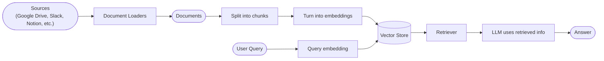
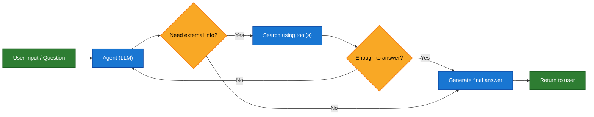
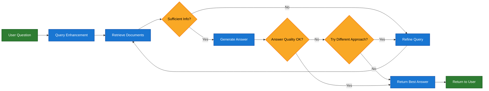

大型语言模型（LLMs）功能强大，但它们有两个关键限制：

* **有限的上下文** — 它们无法一次性处理整个语料库。
* **静态知识** — 它们的训练数据在某个时间点被冻结。

检索通过在查询时获取相关的外部知识来解决这些问题。这是**检索增强生成（RAG）**的基础：用特定上下文的信息增强 LLM 的回答。


## 构建知识库

**知识库**是在检索过程中使用的文档或结构化数据的存储库。

如果你需要自定义知识库，可以使用 LangChain 的文档加载器和向量存储从你自己的数据构建一个。

<Note>
    如果你已经有一个知识库（例如 SQL 数据库、CRM 或内部文档系统），你**不需要**重新构建它。你可以：
    - 将其作为 Agentic RAG 中 agent 的**工具**连接。
    - 查询它并将检索到的内容作为上下文提供给 LLM [（2-Step RAG）](#2-step-rag)。
</Note>

请参阅以下教程来构建可搜索的知识库和最小化的 RAG 工作流：

<Card
    title="教程：语义搜索"
    icon="database"
    href="/oss/python/langchain/knowledge-base"
    arrow cta="了解更多"
>
    学习如何使用 LangChain 的文档加载器、嵌入和向量存储从你自己的数据创建可搜索的知识库。
    在本教程中，你将在 PDF 上构建一个搜索引擎，实现与查询相关的段落检索。你还将在此引擎之上实现一个最小化的 RAG 工作流，以了解如何将外部知识集成到 LLM 推理中。
</Card>

### 从检索到 RAG

检索允许 LLMs 在运行时访问相关上下文。但大多数实际应用更进一步：它们**将检索与生成集成**以产生有依据的、上下文感知的答案。

这是**检索增强生成（RAG）**背后的核心思想。检索管道成为一个更广泛系统的基础，该系统将搜索与生成相结合。

### 检索管道

典型的检索工作流如下所示：



每个组件都是模块化的：你可以在不重写应用逻辑的情况下替换加载器、分割器、嵌入或向量存储。

### 构建模块

<Columns cols={2}>
    <Card
        title="文档加载器"
        icon="file-import"
        href="/oss/python/integrations/document_loaders"
        arrow cta="了解更多"
    >
        从外部来源（Google Drive、Slack、Notion 等）摄取数据，返回标准化的 [`Document`](https://reference.langchain.com/python/langchain_core/documents/#langchain_core.documents.base.Document) 对象。
    </Card>

    <Card
        title="文本分割器"
        icon="scissors"
        href="/oss/python/integrations/splitters"
        arrow
        cta="了解更多"
    >
        将大型文档分割成更小的块，这些块可以单独检索并适合模型的上下文窗口。
    </Card>

    <Card
        title="嵌入模型"
        icon="diagram-project"
        href="/oss/python/integrations/text_embedding"
        arrow
        cta="了解更多"
    >
        嵌入模型将文本转换为数字向量，使具有相似含义的文本在该向量空间中彼此接近。
    </Card>

    <Card
        title="向量存储"
        icon="database"
        href="/oss/python/integrations/vectorstores/"
        arrow
        cta="了解更多"
    >
        用于存储和搜索嵌入的专用数据库。
    </Card>

    <Card
        title="检索器"
        icon="binoculars"
        href="/oss/python/integrations/retrievers/"
        arrow
        cta="了解更多"
    >
        检索器是一个接口，根据非结构化查询返回文档。
    </Card>
</Columns>

## RAG 架构

RAG 可以根据系统需求以多种方式实现。我们在以下部分概述每种类型。

| 架构            | 描述                                                                | 控制   | 灵活性 | 延迟        | 示例用例                                   |
|-------------------------|----------------------------------------------------------------------------|-----------|-------------|----------------|----------------------------------------------------|
| **2-Step RAG**          | 检索总是在生成之前进行。简单且可预测         | ✅ 高    | ❌ 低       | ⚡ 快         | FAQ、文档机器人                           |
| **Agentic RAG**         | 由 LLM 驱动的 agent 在推理过程中决定*何时*和*如何*检索 | ❌ 低     | ✅ 高      | ⏳ 可变     | 可访问多种工具的研究助手  |
| **混合**              | 结合两种方法的特点，带有验证步骤          | ⚖️ 中等 | ⚖️ 中等   | ⏳ 可变     | 带质量验证的领域特定问答        |

<Info>
**延迟**：在 **2-Step RAG** 中，延迟通常更**可预测**，因为 LLM 调用的最大次数是已知且有上限的。这种可预测性假设 LLM 推理时间是主导因素。然而，实际延迟也可能受到检索步骤性能的影响——如 API 响应时间、网络延迟或数据库查询——这些因素会根据使用的工具和基础设施而变化。
</Info>

### 2-step RAG

在 **2-Step RAG** 中，检索步骤总是在生成步骤之前执行。这种架构简单且可预测，适用于许多需要将相关文档检索作为生成答案明确前提的应用。


<Card
    title="教程：检索增强生成（RAG）"
    icon="robot"
    href="/oss/python/langchain/rag#rag-chains"
    arrow cta="了解更多"
>
    了解如何使用检索增强生成构建一个可以回答基于你数据的问题的问答聊天机器人。
    本教程介绍了两种方法：
    * 一个 **RAG agent**，使用灵活的工具运行搜索——非常适合通用用途。
    * 一个 **2-step RAG** chain，每个查询只需一次 LLM 调用——对于更简单的任务快速高效。
</Card>

### Agentic RAG

**Agentic RAG（Agentic 检索增强生成）**结合了检索增强生成和基于 agent 推理的优势。agent（由 LLM 驱动）不是在回答之前检索文档，而是逐步推理并在交互过程中决定**何时**和**如何**检索信息。

<Tip>
agent 启用 RAG 行为所需的唯一条件是访问一个或多个可以获取外部知识的 **tools**——如文档加载器、web API 或数据库查询。
</Tip>



```python
import requests
from langchain.tools import tool
from langchain.chat_models import init_chat_model
from langchain.agents import create_agent


@tool
def fetch_url(url: str) -> str:
    """Fetch text content from a URL"""
    response = requests.get(url, timeout=10.0)
    response.raise_for_status()
    return response.text

system_prompt = """\
Use fetch_url when you need to fetch information from a web-page; quote relevant snippets.
"""

agent = create_agent(
    model="claude-sonnet-4-5-20250929",
    tools=[fetch_url], # A tool for retrieval [!code highlight]
    system_prompt=system_prompt,
)
```


<Expandable title="Extended example: Agentic RAG for LangGraph's llms.txt">

This example implements an **Agentic RAG system** to assist users in querying LangGraph documentation. The agent begins by loading [llms.txt](https://llmstxt.org/), which lists available documentation URLs, and can then dynamically use a `fetch_documentation` tool to retrieve and process the relevant content based on the user’s question.

```python
import requests
from langchain.agents import create_agent
from langchain.messages import HumanMessage
from langchain.tools import tool
from markdownify import markdownify


ALLOWED_DOMAINS = ["https://langchain-ai.github.io/"]
LLMS_TXT = 'https://langchain-ai.github.io/langgraph/llms.txt'


@tool
def fetch_documentation(url: str) -> str:  # [!code highlight]
    """Fetch and convert documentation from a URL"""
    if not any(url.startswith(domain) for domain in ALLOWED_DOMAINS):
        return (
            "Error: URL not allowed. "
            f"Must start with one of: {', '.join(ALLOWED_DOMAINS)}"
        )
    response = requests.get(url, timeout=10.0)
    response.raise_for_status()
    return markdownify(response.text)


# We will fetch the content of llms.txt, so this can
# be done ahead of time without requiring an LLM request.
llms_txt_content = requests.get(LLMS_TXT).text

# System prompt for the agent
system_prompt = f"""
You are an expert Python developer and technical assistant.
Your primary role is to help users with questions about LangGraph and related tools.

Instructions:

1. If a user asks a question you're unsure about — or one that likely involves API usage,
   behavior, or configuration — you MUST use the `fetch_documentation` tool to consult the relevant docs.
2. When citing documentation, summarize clearly and include relevant context from the content.
3. Do not use any URLs outside of the allowed domain.
4. If a documentation fetch fails, tell the user and proceed with your best expert understanding.

You can access official documentation from the following approved sources:

{llms_txt_content}

You MUST consult the documentation to get up to date documentation
before answering a user's question about LangGraph.

Your answers should be clear, concise, and technically accurate.
"""

tools = [fetch_documentation]

model = init_chat_model("claude-sonnet-4-0", max_tokens=32_000)

agent = create_agent(
    model=model,
    tools=tools,  # [!code highlight]
    system_prompt=system_prompt,  # [!code highlight]
    name="Agentic RAG",
)

response = agent.invoke({
    'messages': [
        HumanMessage(content=(
            "Write a short example of a langgraph agent using the "
            "prebuilt create react agent. the agent should be able "
            "to look up stock pricing information."
        ))
    ]
})

print(response['messages'][-1].content)
```


</Expandable>

<Card
    title="教程：检索增强生成（RAG）"
    icon="robot"
    href="/oss/python/langchain/rag"
    arrow cta="了解更多"
>
    了解如何使用检索增强生成构建一个可以回答基于你数据的问题的问答聊天机器人。
    本教程介绍了两种方法：
    * 一个 **RAG agent**，使用灵活的工具运行搜索——非常适合通用用途。
    * 一个 **2-step RAG** chain，每个查询只需一次 LLM 调用——对于更简单的任务快速高效。
</Card>

### 混合 RAG

混合 RAG 结合了 2-Step 和 Agentic RAG 的特点。它引入了中间步骤，如查询预处理、检索验证和生成后检查。这些系统比固定管道提供更多灵活性，同时保持对执行的一些控制。

典型组件包括：

* **查询增强**：修改输入问题以提高检索质量。这可能涉及重写不清晰的查询、生成多个变体或使用额外上下文扩展查询。
* **检索验证**：评估检索到的文档是否相关且充分。如果不是，系统可能会优化查询并再次检索。
* **答案验证**：检查生成的答案的准确性、完整性和与源内容的一致性。如果需要，系统可以重新生成或修改答案。

该架构通常支持这些步骤之间的多次迭代：



此架构适用于：

* 具有模糊或未充分指定查询的应用
* 需要验证或质量控制步骤的系统
* 涉及多个源或迭代优化的工作流

<Card
    title="教程：带有自我纠正的 Agentic RAG"
    icon="robot"
    href="/oss/python/langgraph/agentic-rag"
    arrow cta="了解更多"
>
    一个 **混合 RAG** 示例，结合了 agentic 推理与检索和自我纠正。
</Card>

---

<Callout icon="pen-to-square" iconType="regular">
    [Edit this page on GitHub](https://github.com/langchain-ai/docs/edit/main/src/oss/langchain/retrieval.mdx) or [file an issue](https://github.com/langchain-ai/docs/issues/new/choose).
</Callout>
<Tip icon="terminal" iconType="regular">
    [Connect these docs](/use-these-docs) to Claude, VSCode, and more via MCP for real-time answers.
</Tip>
<div class='fixed right-2 bg-white bottom-2'></div>