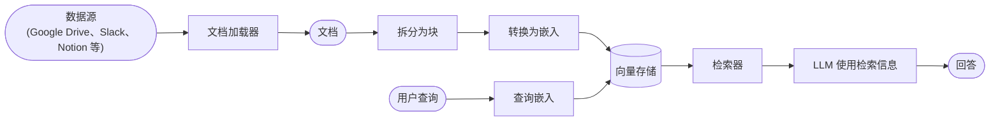
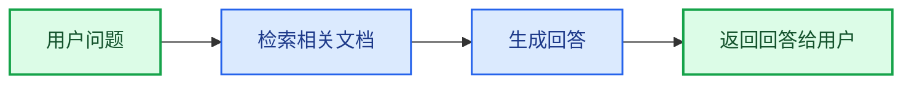
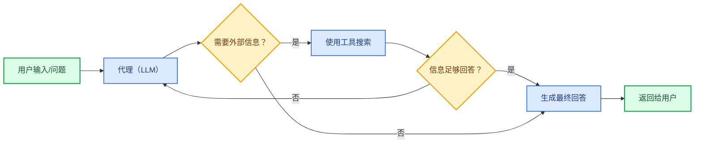
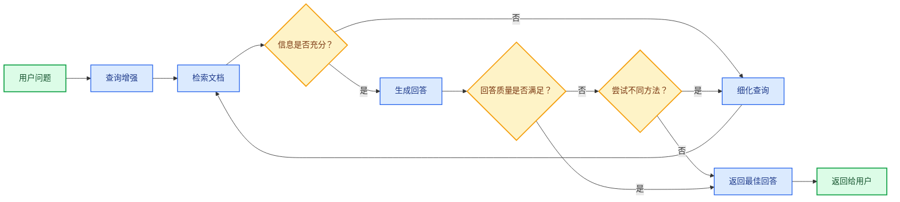

大型语言模型（LLM）功能强大，但存在两个关键局限：

* **有限的上下文** — 无法一次性处理整个语料库。
* **静态知识** — 训练数据在某一时间点被冻结。

检索通过在查询时获取相关的外部知识来解决这些问题。这是**检索增强生成（RAG）**的基础：用特定上下文信息来增强 LLM 的回答。


## 构建知识库

**知识库**是在检索过程中使用的文档或结构化数据的存储库。

如果需要自定义知识库，可以使用 LangChain 的文档加载器和向量存储从自己的数据中构建一个。

<Note>
    如果你已经拥有知识库（例如 SQL 数据库、CRM 或内部文档系统），**无需**重新构建。你可以：
    - 在 Agentic RAG 中将其作为**工具**连接到代理。
    - 查询它并将检索到的内容作为上下文提供给 LLM [（2-Step RAG）](#2-step-rag)。
</Note>

参阅以下教程，构建可搜索的知识库和最简 RAG 工作流：

<Card
    title="教程：语义搜索"
    icon="database"
    href="/oss/python/langchain/knowledge-base"
    arrow cta="了解更多"
>
    学习如何使用 LangChain 的文档加载器、嵌入和向量存储，从自己的数据创建可搜索的知识库。
    在本教程中，你将构建一个基于 PDF 的搜索引擎，实现与查询相关段落的检索。你还将在此引擎之上实现一个最简 RAG 工作流，了解外部知识如何融入 LLM 推理。
</Card>

### 从检索到 RAG

检索使 LLM 能够在运行时访问相关上下文。但大多数真实世界的应用会更进一步：将**检索与生成相结合**，产生有依据、具上下文感知的回答。

这正是**检索增强生成（RAG）**的核心理念。检索流水线成为一个更广泛系统的基础，将搜索与生成相结合。

### 检索流水线

典型的检索工作流如下所示：



每个组件都是模块化的：你可以替换加载器、分割器、嵌入或向量存储，而无需重写应用逻辑。

### 构建模块

<Columns cols={2}>
    <Card
        title="文档加载器"
        icon="file-import"
        href="/oss/python/integrations/document_loaders"
        arrow cta="了解更多"
    >
        从外部来源（Google Drive、Slack、Notion 等）摄取数据，返回标准化的 [`Document`](https://reference.langchain.com/python/langchain-core/documents/base/Document) 对象。
    </Card>

    <Card
        title="文本分割器"
        icon="scissors"
        href="/oss/python/integrations/splitters"
        arrow
        cta="了解更多"
    >
        将大型文档拆分为较小的块，以便单独检索并适应模型的上下文窗口。
    </Card>

    <Card
        title="嵌入模型"
        icon="sitemap"
        href="/oss/python/integrations/text_embedding"
        arrow
        cta="了解更多"
    >
        嵌入模型将文本转换为数字向量，使含义相近的文本在该向量空间中彼此靠近。
    </Card>

    <Card
        title="向量存储"
        icon="database"
        href="/oss/python/integrations/vectorstores/"
        arrow
        cta="了解更多"
    >
        用于存储和搜索嵌入的专用数据库。
    </Card>

    <Card
        title="检索器"
        icon="binoculars"
        href="/oss/python/integrations/retrievers/"
        arrow
        cta="了解更多"
    >
        检索器是一种接口，根据非结构化查询返回文档。
    </Card>
</Columns>

## RAG 架构

RAG 可以通过多种方式实现，具体取决于系统需求。以下各节分别介绍每种类型。

| 架构                    | 描述                                                                       | 可控性    | 灵活性      | 延迟           | 示例用例                                             |
|-------------------------|----------------------------------------------------------------------------|-----------|-------------|----------------|------------------------------------------------------|
| **2-Step RAG**          | 检索始终在生成之前执行。简单且可预测                                       | ✅ 高     | ❌ 低        | ⚡ 快           | FAQ、文档机器人                                      |
| **Agentic RAG**         | 由 LLM 驱动的代理在推理过程中决定*何时*以及*如何*检索                     | ❌ 低     | ✅ 高        | ⏳ 不稳定       | 可访问多种工具的研究助手                             |
| **混合型**              | 结合两种方法的特点，包含验证步骤                                           | ⚖️ 中等  | ⚖️ 中等     | ⏳ 不稳定       | 带质量验证的特定领域问答                             |

<Info>
**延迟**：在 **2-Step RAG** 中，延迟通常更加**可预测**，因为 LLM 调用的最大次数已知且有上限。这一可预测性假设 LLM 推理时间是主要影响因素。但实际延迟也可能受检索步骤性能的影响——例如 API 响应时间、网络延迟或数据库查询——这些因素会因所用工具和基础设施而异。
</Info>

### 2-step RAG

在 **2-Step RAG** 中，检索步骤始终在生成步骤之前执行。该架构简单直接且可预测，适用于许多将相关文档检索视为生成回答明确前提条件的应用场景。



<Card
    title="教程：检索增强生成（RAG）"
    icon="robot"
    href="/oss/python/langchain/rag#rag-chains"
    arrow cta="了解更多"
>
    了解如何使用检索增强生成构建一个能够基于你的数据回答问题的问答聊天机器人。
    本教程介绍两种方法：
    * **RAG 代理**，使用灵活的工具运行搜索——适用于通用场景。
    * **2-step RAG** 链，每次查询只需一次 LLM 调用——适用于更简单任务，快速高效。
</Card>

### Agentic RAG

**Agentic 检索增强生成（RAG）**将检索增强生成的优势与基于代理的推理相结合。代理（由 LLM 驱动）不是在回答前检索文档，而是逐步推理，并在交互过程中决定**何时**以及**如何**检索信息。

<Tip>
代理要启用 RAG 行为，唯一需要的是访问一个或多个能够获取外部知识的**工具**——例如文档加载器、Web API 或数据库查询。
</Tip>



```python
import requests
from langchain.tools import tool
from langchain.chat_models import init_chat_model
from langchain.agents import create_agent


@tool
def fetch_url(url: str) -> str:
    """Fetch text content from a URL"""
    response = requests.get(url, timeout=10.0)
    response.raise_for_status()
    return response.text

system_prompt = """\
Use fetch_url when you need to fetch information from a web-page; quote relevant snippets.
"""

agent = create_agent(
    model="claude-sonnet-4-6",
    tools=[fetch_url], # A tool for retrieval [!code highlight]
    system_prompt=system_prompt,
)
```


<Expandable title="扩展示例：用于 LangGraph llms.txt 的 Agentic RAG">

本示例实现了一个 **Agentic RAG 系统**，用于帮助用户查询 LangGraph 文档。代理首先加载 [llms.txt](https://llmstxt.org/)（其中列出了可用的文档 URL），然后可以根据用户的问题动态使用 `fetch_documentation` 工具检索并处理相关内容。

```python
import requests
from langchain.agents import create_agent
from langchain.messages import HumanMessage
from langchain.tools import tool
from markdownify import markdownify


ALLOWED_DOMAINS = ["https://langchain-ai.github.io/"]
LLMS_TXT = 'https://langchain-ai.github.io/langgraph/llms.txt'


@tool
def fetch_documentation(url: str) -> str:  # [!code highlight]
    """Fetch and convert documentation from a URL"""
    if not any(url.startswith(domain) for domain in ALLOWED_DOMAINS):
        return (
            "Error: URL not allowed. "
            f"Must start with one of: {', '.join(ALLOWED_DOMAINS)}"
        )
    response = requests.get(url, timeout=10.0)
    response.raise_for_status()
    return markdownify(response.text)


# We will fetch the content of llms.txt, so this can
# be done ahead of time without requiring an LLM request.
llms_txt_content = requests.get(LLMS_TXT).text

# System prompt for the agent
system_prompt = f"""
You are an expert Python developer and technical assistant.
Your primary role is to help users with questions about LangGraph and related tools.

Instructions:

1. If a user asks a question you're unsure about — or one that likely involves API usage,
   behavior, or configuration — you MUST use the `fetch_documentation` tool to consult the relevant docs.
2. When citing documentation, summarize clearly and include relevant context from the content.
3. Do not use any URLs outside of the allowed domain.
4. If a documentation fetch fails, tell the user and proceed with your best expert understanding.

You can access official documentation from the following approved sources:

{llms_txt_content}

You MUST consult the documentation to get up to date documentation
before answering a user's question about LangGraph.

Your answers should be clear, concise, and technically accurate.
"""

tools = [fetch_documentation]

model = init_chat_model("claude-sonnet-4-0", max_tokens=32_000)

agent = create_agent(
    model=model,
    tools=tools,  # [!code highlight]
    system_prompt=system_prompt,  # [!code highlight]
    name="Agentic RAG",
)

response = agent.invoke({
    'messages': [
        HumanMessage(content=(
            "Write a short example of a langgraph agent using the "
            "prebuilt create react agent. the agent should be able "
            "to look up stock pricing information."
        ))
    ]
})

print(response['messages'][-1].content)
```


</Expandable>

<Card
    title="教程：检索增强生成（RAG）"
    icon="robot"
    href="/oss/python/langchain/rag"
    arrow cta="了解更多"
>
    了解如何使用检索增强生成构建一个能够基于你的数据回答问题的问答聊天机器人。
    本教程介绍两种方法：
    * **RAG 代理**，使用灵活的工具运行搜索——适用于通用场景。
    * **2-step RAG** 链，每次查询只需一次 LLM 调用——适用于更简单任务，快速高效。
</Card>

### 混合型 RAG

混合型 RAG 结合了 2-Step RAG 和 Agentic RAG 的特点。它引入了查询预处理、检索验证和生成后检查等中间步骤。这类系统比固定流水线提供更多灵活性，同时保持一定的执行控制力。

典型组件包括：

* **查询增强**：修改输入问题以提高检索质量。这可以包括重写不清晰的查询、生成多个变体或通过额外上下文扩展查询。
* **检索验证**：评估检索到的文档是否相关且充分。若不满足，系统可以细化查询并重新检索。
* **回答验证**：检查生成回答的准确性、完整性及与源内容的一致性。如有需要，系统可以重新生成或修订回答。

该架构通常支持这些步骤之间的多次迭代：



该架构适用于：

* 查询模糊或描述不充分的应用
* 需要验证或质量控制步骤的系统
* 涉及多个来源或迭代优化的工作流

<Card
    title="教程：带自我纠错的 Agentic RAG"
    icon="robot"
    href="/oss/python/langgraph/agentic-rag"
    arrow cta="了解更多"
>
    一个**混合型 RAG** 的示例，将代理推理与检索和自我纠错相结合。
</Card>

---

<div className="source-links">
<Callout icon="edit">
    [在 GitHub 上编辑此页面](https://github.com/langchain-ai/docs/edit/main/src/oss/langchain/retrieval.mdx) 或 [提交问题](https://github.com/langchain-ai/docs/issues/new/choose)。
</Callout>
<Callout icon="terminal-2">
    通过 MCP [将这些文档连接](/use-these-docs)到 Claude、VSCode 等，获取实时答案。
</Callout>
</div>
