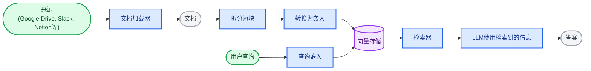
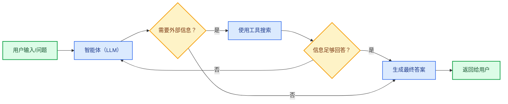
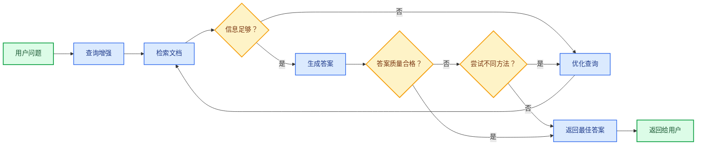

大型语言模型（LLM）功能强大，但存在两个关键限制：

* **有限的上下文**——它们无法一次性处理整个语料库。
* **静态知识**——其训练数据在某个时间点后便不再更新。

检索通过在查询时获取相关的外部知识来解决这些问题。这是**检索增强生成（RAG）**的基础：利用特定上下文信息来增强LLM的回答。

## 构建知识库

**知识库**是检索过程中使用的文档或结构化数据的存储库。

如果您需要自定义知识库，可以使用LangChain的文档加载器和向量存储从您自己的数据中构建一个。

<Note>
    如果您已经拥有知识库（例如SQL数据库、CRM或内部文档系统），则**无需**重新构建。您可以：
    - 将其作为**工具**连接到智能体RAG中的智能体。
    - 查询它并将检索到的内容作为上下文提供给LLM [（2步RAG）](#2-step-rag)。
</Note>

请参阅以下教程，构建一个可搜索的知识库和最小化的RAG工作流：

<Card
    title="教程：语义搜索"
    icon="database"
    href="/oss/python/langchain/knowledge-base"
    arrow cta="了解更多"
>
    了解如何使用LangChain的文档加载器、嵌入和向量存储从您自己的数据创建可搜索的知识库。
    在本教程中，您将构建一个PDF搜索引擎，以检索与查询相关的段落。您还将在此引擎之上实现一个最小化的RAG工作流，以了解如何将外部知识集成到LLM推理中。
</Card>

### 从检索到RAG

检索允许LLM在运行时访问相关上下文。但大多数实际应用更进一步：它们将**检索与生成相结合**，以生成基于事实、上下文感知的答案。

这是**检索增强生成（RAG）**背后的核心思想。检索管道成为更广泛系统的基础，该系统将搜索与生成相结合。

### 检索管道

典型的检索工作流如下所示：



每个组件都是模块化的：您可以更换加载器、拆分器、嵌入或向量存储，而无需重写应用程序的逻辑。

### 构建块

<Columns cols={2}>
    <Card
        title="文档加载器"
        icon="file-import"
        href="/oss/python/integrations/document_loaders"
        arrow cta="了解更多"
    >
        从外部来源（Google Drive、Slack、Notion等）摄取数据，返回标准化的 [`Document`](https://reference.langchain.com/python/langchain-core/documents/base/Document) 对象。
    </Card>

    <Card
        title="文本拆分器"
        icon="scissors"
        href="/oss/python/integrations/splitters"
        arrow
        cta="了解更多"
    >
        将大型文档拆分为较小的块，以便单独检索并适应模型的上下文窗口。
    </Card>

    <Card
        title="嵌入模型"
        icon="sitemap"
        href="/oss/python/integrations/embeddings"
        arrow
        cta="了解更多"
    >
        嵌入模型将文本转换为数字向量，使得含义相似的文本在该向量空间中彼此靠近。
    </Card>

    <Card
        title="向量存储"
        icon="database"
        href="/oss/python/integrations/vectorstores/"
        arrow
        cta="了解更多"
    >
        用于存储和搜索嵌入的专用数据库。
    </Card>

    <Card
        title="检索器"
        icon="binoculars"
        href="/oss/python/integrations/retrievers/"
        arrow
        cta="了解更多"
    >
        检索器是一个接口，根据非结构化查询返回文档。
    </Card>
</Columns>

## RAG架构

RAG可以通过多种方式实现，具体取决于您的系统需求。我们在以下部分概述每种类型。

| 架构 | 描述 | 控制 | 灵活性 | 延迟 | 示例用例 |
|-------------------------|----------------------------------------------------------------------------|-----------|-------------|----------------|----------------------------------------------------|
| **2步RAG** | 检索总是在生成之前发生。简单且可预测 | ✅ 高 | ❌ 低 | ⚡ 快 | 常见问题解答、文档机器人 |
| **智能体RAG** | 由LLM驱动的智能体在推理过程中决定*何时*以及*如何*检索 | ❌ 低 | ✅ 高 | ⏳ 可变 | 具有访问多个工具的研究助手 |
| **混合** | 结合两种方法的特点，并包含验证步骤 | ⚖️ 中 | ⚖️ 中 | ⏳ 可变 | 具有质量验证的领域特定问答 |

<Info>
**延迟**：在**2步RAG**中，延迟通常更**可预测**，因为LLM调用的最大数量是已知且有限的。这种可预测性假设LLM推理时间是主导因素。然而，实际延迟也可能受检索步骤性能的影响——例如API响应时间、网络延迟或数据库查询——这些可能因使用的工具和基础设施而异。
</Info>

### 2步RAG

在**2步RAG**中，检索步骤总是在生成步骤之前执行。这种架构简单且可预测，适用于许多检索相关文档是生成答案的明确前提的应用。


<Card
    title="教程：检索增强生成（RAG）"
    icon="robot"
    href="/oss/python/langchain/rag#rag-chains"
    arrow cta="了解更多"
>
    了解如何使用检索增强生成构建一个基于您数据的问答聊天机器人。
    本教程介绍两种方法：
    * **RAG智能体**，使用灵活的工具运行搜索——非常适合通用用途。
    * **2步RAG**链，每个查询只需一次LLM调用——对于简单任务快速高效。
</Card>

### 智能体RAG

**智能体检索增强生成（RAG）**结合了检索增强生成和基于智能体的推理的优势。智能体（由LLM驱动）不是先检索文档再回答，而是在交互过程中逐步推理，并决定**何时**以及**如何**检索信息。

<Tip>
智能体启用RAG行为所需的唯一条件是访问一个或多个可以获取外部知识的**工具**——例如文档加载器、Web API或数据库查询。
</Tip>



```python
import requests
from langchain.tools import tool
from langchain.chat_models import init_chat_model
from langchain.agents import create_agent


@tool
def fetch_url(url: str) -> str:
    """从URL获取文本内容"""
    response = requests.get(url, timeout=10.0)
    response.raise_for_status()
    return response.text

system_prompt = """\
当您需要从网页获取信息时使用fetch_url；引用相关片段。
"""

agent = create_agent(
    model="claude-sonnet-4-6",
    tools=[fetch_url], # 用于检索的工具 [!code highlight]
    system_prompt=system_prompt,
)
```


<Expandable title="扩展示例：用于LangGraph的llms.txt的智能体RAG">

此示例实现了一个**智能体RAG系统**，以帮助用户查询LangGraph文档。智能体首先加载 [llms.txt](https://llmstxt.org/)，该文件列出了可用的文档URL，然后可以根据用户的问题动态使用 `fetch_documentation` 工具来检索和处理相关内容。

```python
import requests
from langchain.agents import create_agent
from langchain.messages import HumanMessage
from langchain.tools import tool
from markdownify import markdownify


ALLOWED_DOMAINS = ["https://langchain-ai.github.io/"]
LLMS_TXT = 'https://langchain-ai.github.io/langgraph/llms.txt'


@tool
def fetch_documentation(url: str) -> str:  # [!code highlight]
    """从URL获取并转换文档"""
    if not any(url.startswith(domain) for domain in ALLOWED_DOMAINS):
        return (
            "错误：URL不允许。 "
            f"必须以以下之一开头：{', '.join(ALLOWED_DOMAINS)}"
        )
    response = requests.get(url, timeout=10.0)
    response.raise_for_status()
    return markdownify(response.text)


# 我们将获取llms.txt的内容，因此这可以
# 提前完成，无需LLM请求。
llms_txt_content = requests.get(LLMS_TXT).text

# 智能体的系统提示
system_prompt = f"""
您是一位专业的Python开发人员和技术助手。
您的主要角色是帮助用户解决有关LangGraph和相关工具的问题。

说明：

1. 如果用户提出您不确定的问题——或者可能涉及API使用、行为或配置的问题——您必须使用 `fetch_documentation` 工具查阅相关文档。
2. 引用文档时，请清晰总结并包含内容中的相关上下文。
3. 不要使用允许域之外的任何URL。
4. 如果文档获取失败，请告知用户并继续以您最好的专业理解进行。

您可以从以下批准的来源访问官方文档：

{llms_txt_content}

在回答用户关于LangGraph的问题之前，您必须查阅文档以获取最新文档。

您的回答应清晰、简洁且技术准确。
"""

tools = [fetch_documentation]

model = init_chat_model("claude-sonnet-4-0", max_tokens=32_000)

agent = create_agent(
    model=model,
    tools=tools,  # [!code highlight]
    system_prompt=system_prompt,  # [!code highlight]
    name="Agentic RAG",
)

response = agent.invoke({
    'messages': [
        HumanMessage(content=(
            "编写一个使用预构建创建React智能体的langgraph智能体的简短示例。"
            "该智能体应能够查找股票定价信息。"
        ))
    ]
})

print(response['messages'][-1].content)
```


</Expandable>

<Card
    title="教程：检索增强生成（RAG）"
    icon="robot"
    href="/oss/python/langchain/rag"
    arrow cta="了解更多"
>
    了解如何使用检索增强生成构建一个基于您数据的问答聊天机器人。
    本教程介绍两种方法：
    * **RAG智能体**，使用灵活的工具运行搜索——非常适合通用用途。
    * **2步RAG**链，每个查询只需一次LLM调用——对于简单任务快速高效。
</Card>

### 混合RAG

混合RAG结合了2步RAG和智能体RAG的特点。它引入了中间步骤，例如查询预处理、检索验证和生成后检查。这些系统比固定管道提供了更大的灵活性，同时保持了对执行的一定控制。

典型组件包括：

* **查询增强**：修改输入问题以提高检索质量。这可能涉及重写不明确的查询、生成多个变体或使用额外上下文扩展查询。
* **检索验证**：评估检索到的文档是否相关且充分。如果不是，系统可能会优化查询并重新检索。
* **答案验证**：检查生成的答案的准确性、完整性和与源内容的一致性。如果需要，系统可以重新生成或修改答案。

该架构通常支持这些步骤之间的多次迭代：



此架构适用于：

* 具有模糊或未明确指定查询的应用程序
* 需要验证或质量控制步骤的系统
* 涉及多个来源或迭代优化的流程

<Card
    title="教程：具有自我校正的智能体RAG"
    icon="robot"
    href="/oss/python/langgraph/agentic-rag"
    arrow cta="了解更多"
>
    **混合RAG**的示例，结合了智能体推理、检索和自我校正。
</Card>

---

<div className="source-links">
<Callout icon="edit">
    [在GitHub上编辑此页面](https://github.com/langchain-ai/docs/edit/main/src/oss/langchain/retrieval.mdx) 或 [提交问题](https://github.com/langchain-ai/docs/issues/new/choose)。
</Callout>
<Callout icon="terminal-2">
    [通过MCP将这些文档连接到Claude、VSCode等](/use-these-docs)以获取实时答案。
</Callout>
</div>