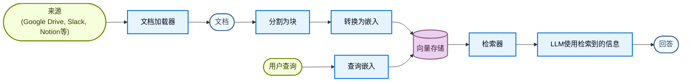
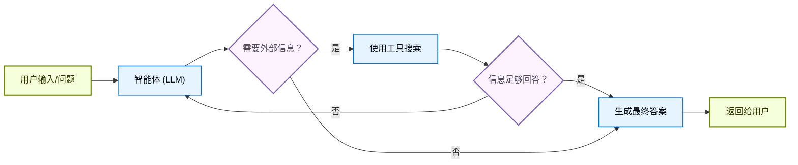
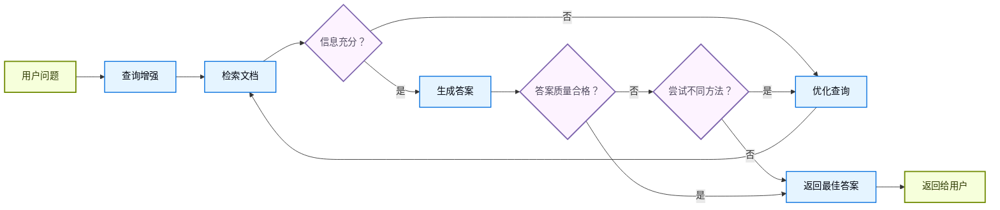

大型语言模型（LLM）功能强大，但存在两个关键局限：

* **有限的上下文**——它们无法一次性处理整个语料库。
* **静态知识**——其训练数据在某个时间点后便固定不变。

检索通过在查询时获取相关的外部知识来解决这些问题。这是**检索增强生成（RAG）**的基础：利用特定上下文信息来增强LLM的回答。


## 构建知识库

**知识库**是用于检索过程的文档或结构化数据存储库。

如果您需要自定义知识库，可以使用LangChain的文档加载器和向量存储从自有数据构建一个。

<Note>
    如果您已有知识库（例如SQL数据库、CRM或内部文档系统），则**无需**重新构建。您可以：
    - 将其作为**工具**连接到智能体RAG中的智能体。
    - 查询它并将检索到的内容作为上下文提供给LLM（[两步RAG](#两步rag)）。
</Note>

参阅以下教程构建可搜索的知识库和最小化RAG工作流：

<Card
    title="教程：语义搜索"
    icon="database"
    href="/oss/python/langchain/knowledge-base"
    arrow cta="了解更多"
>
    学习如何使用LangChain的文档加载器、嵌入和向量存储从自有数据创建可搜索的知识库。
    在本教程中，您将构建一个PDF搜索引擎，实现根据查询检索相关段落。您还将在此引擎上实现最小化RAG工作流，了解如何将外部知识集成到LLM推理中。
</Card>

### 从检索到RAG

检索使LLM能够在运行时访问相关上下文。但大多数实际应用更进一步：它们**将检索与生成集成**，以产生基于事实、感知上下文的回答。

这是**检索增强生成（RAG）**背后的核心思想。检索管道成为结合搜索与生成的更广泛系统的基础。

### 检索管道

典型的检索工作流如下所示：


```mermaid
flowchart LR
  S(["来源<br>(Google Drive, Slack, Notion等)"]) --> L[文档加载器]
  L --> A([文档])
  A --> B[分割为块]
  B --> C[转换为嵌入]
  C --> D[(向量存储)]
  Q([用户查询]) --> E[查询嵌入]
  E --> D
  D --> F[检索器]
  F --> G[LLM使用检索到的信息]
  G --> H([回答])

  classDef trigger fill:#F6FFDB,stroke:#6E8900,stroke-width:2px,color:#2E3900
  classDef process fill:#E5F4FF,stroke:#006DDD,stroke-width:2px,color:#030710
  classDef output fill:#EBD0F0,stroke:#885270,stroke-width:2px,color:#441E33
  classDef neutral fill:#F2FAFF,stroke:#40668D,stroke-width:2px,color:#2F4B68

  class S,Q trigger
  class L,B,C,E,F,G process
  class D output
  class A,H neutral
```

每个组件都是模块化的：您可以更换加载器、分割器、嵌入或向量存储，而无需重写应用逻辑。

### 构建模块

<Columns cols={2}>
    <Card
        title="文档加载器"
        icon="file-import"
        href="/oss/python/integrations/document_loaders"
        arrow cta="了解更多"
    >
        从外部来源（Google Drive、Slack、Notion等）摄取数据，返回标准化的[`Document`](https://reference.langchain.com/python/langchain-core/documents/base/Document)对象。
    </Card>

    <Card
        title="文本分割器"
        icon="scissors"
        href="/oss/python/integrations/splitters"
        arrow
        cta="了解更多"
    >
        将大型文档分割成较小的块，以便单独检索并适应模型的上下文窗口。
    </Card>

    <Card
        title="嵌入模型"
        icon="sitemap"
        href="/oss/python/integrations/embeddings"
        arrow
        cta="了解更多"
    >
        嵌入模型将文本转换为数字向量，使含义相似的文本在该向量空间中彼此接近。
    </Card>

    <Card
        title="向量存储"
        icon="database"
        href="/oss/python/integrations/vectorstores/"
        arrow
        cta="了解更多"
    >
        用于存储和搜索嵌入的专用数据库。
    </Card>

    <Card
        title="检索器"
        icon="binoculars"
        href="/oss/python/integrations/retrievers/"
        arrow
        cta="了解更多"
    >
        检索器是一个接口，根据非结构化查询返回文档。
    </Card>
</Columns>

## RAG架构

RAG可以通过多种方式实现，具体取决于系统需求。我们在以下各节中概述每种类型。

| 架构            | 描述                                                                | 控制性   | 灵活性 | 延迟        | 示例用例                                   |
|-----------------|---------------------------------------------------------------------|----------|--------|-------------|--------------------------------------------|
| **两步RAG**     | 检索总是在生成之前发生。简单且可预测                                 | ✅ 高    | ❌ 低   | ⚡ 快速     | 常见问题解答、文档机器人                   |
| **智能体RAG**   | 由LLM驱动的智能体在推理过程中决定*何时*以及*如何*检索                 | ❌ 低     | ✅ 高   | ⏳ 可变     | 可访问多种工具的研究助手                   |
| **混合RAG**     | 结合两种方法的特点，并包含验证步骤                                   | ⚖️ 中等 | ⚖️ 中等 | ⏳ 可变     | 带有质量验证的特定领域问答                 |

<Info>
**延迟**：在**两步RAG**中，延迟通常更**可预测**，因为LLM调用的最大次数是已知且有上限的。这种可预测性假设LLM推理时间是主要因素。然而，实际延迟也可能受到检索步骤性能的影响——例如API响应时间、网络延迟或数据库查询——这些会根据所使用的工具和基础设施而变化。
</Info>

### 两步RAG

在**两步RAG**中，检索步骤总是在生成步骤之前执行。这种架构简单且可预测，适用于许多检索相关文档是生成答案明确前提的应用。


```mermaid
graph LR
    A[用户问题] --> B["检索相关文档"]
    B --> C["生成答案"]
    C --> D[将答案返回给用户]

    %% 样式
    classDef startend fill:#F6FFDB,stroke:#6E8900,stroke-width:2px,color:#2E3900
    classDef process fill:#E5F4FF,stroke:#006DDD,stroke-width:1.5px,color:#030710

    class A,D startend
    class B,C process
```

<Card
    title="教程：检索增强生成（RAG）"
    icon="robot"
    href="/oss/python/langchain/rag#rag-chains"
    arrow cta="了解更多"
>
    了解如何构建一个问答聊天机器人，该机器人可以使用检索增强生成来回答基于您数据的问题。
    本教程介绍两种方法：
    * **RAG智能体**，使用灵活工具运行搜索——非常适合通用用途。
    * **两步RAG**链，每次查询只需一次LLM调用——对于较简单的任务快速高效。
</Card>

### 智能体RAG

**智能体检索增强生成（RAG）**将检索增强生成的优势与基于智能体的推理相结合。智能体（由LLM驱动）不是在回答前检索文档，而是逐步推理，并在交互过程中决定**何时**以及**如何**检索信息。

<Tip>
智能体启用RAG行为所需的唯一条件是能够访问一个或多个可以获取外部知识的**工具**——例如文档加载器、Web API或数据库查询。
</Tip>


```mermaid
graph LR
    A[用户输入/问题] --> B["智能体 (LLM)"]
    B --> C{需要外部信息？}
    C -- 是 --> D["使用工具搜索"]
    D --> H{信息足够回答？}
    H -- 否 --> B
    H -- 是 --> I[生成最终答案]
    C -- 否 --> I
    I --> J[返回给用户]

    %% 深色模式友好的样式
    classDef startend fill:#F6FFDB,stroke:#6E8900,stroke-width:2px,color:#2E3900
    classDef decision fill:#FDF3FF,stroke:#7E65AE,stroke-width:2px,color:#504B5F
    classDef process fill:#E5F4FF,stroke:#006DDD,stroke-width:1.5px,color:#030710

    class A,J startend
    class B,D,I process
    class C,H decision
```

```python
import requests
from langchain.tools import tool
from langchain.chat_models import init_chat_model
from langchain.agents import create_agent


@tool
def fetch_url(url: str) -> str:
    """从URL获取文本内容"""
    response = requests.get(url, timeout=10.0)
    response.raise_for_status()
    return response.text

system_prompt = """\
当您需要从网页获取信息时使用 fetch_url；引用相关片段。
"""

agent = create_agent(
    model="claude-sonnet-4-6",
    tools=[fetch_url], # 用于检索的工具 [!code highlight]
    system_prompt=system_prompt,
)
```


<Expandable title="扩展示例：用于LangGraph的llms.txt的智能体RAG">

本示例实现了一个**智能体RAG系统**，以帮助用户查询LangGraph文档。智能体首先加载[llms.txt](https://llmstxt.org/)，其中列出了可用的文档URL，然后可以根据用户问题动态使用`fetch_documentation`工具来检索和处理相关内容。

```python
import requests
from langchain.agents import create_agent
from langchain.messages import HumanMessage
from langchain.tools import tool
from markdownify import markdownify


ALLOWED_DOMAINS = ["https://langchain-ai.github.io/"]
LLMS_TXT = 'https://langchain-ai.github.io/langgraph/llms.txt'


@tool
def fetch_documentation(url: str) -> str:  # [!code highlight]
    """从URL获取并转换文档"""
    if not any(url.startswith(domain) for domain in ALLOWED_DOMAINS):
        return (
            "错误：URL不允许。"
            f"必须以以下之一开头：{', '.join(ALLOWED_DOMAINS)}"
        )
    response = requests.get(url, timeout=10.0)
    response.raise_for_status()
    return markdownify(response.text)


# 我们将获取 llms.txt 的内容，因此可以
# 提前完成，无需LLM请求。
llms_txt_content = requests.get(LLMS_TXT).text

# 智能体的系统提示
system_prompt = f"""
您是一位专业的Python开发人员和技术助理。
您的主要角色是帮助用户解决关于LangGraph及相关工具的问题。

说明：

1. 如果用户提出您不确定的问题——或者可能涉及API使用、
   行为或配置的问题——您必须使用 `fetch_documentation` 工具查阅相关文档。
2. 引用文档时，请清晰总结并包含内容中的相关上下文。
3. 不要使用允许域名之外的任何URL。
4. 如果文档获取失败，请告知用户，并根据您最佳的专业理解继续。

您可以从以下批准的来源访问官方文档：

{llms_txt_content}

在回答用户关于LangGraph的问题之前，您必须查阅文档以获取最新文档。

您的回答应清晰、简洁且技术准确。
"""

tools = [fetch_documentation]

model = init_chat_model("claude-sonnet-4-0", max_tokens=32_000)

agent = create_agent(
    model=model,
    tools=tools,  # [!code highlight]
    system_prompt=system_prompt,  # [!code highlight]
    name="智能体RAG",
)

response = agent.invoke({
    'messages': [
        HumanMessage(content=(
            "编写一个使用预构建的 create react agent 的 langgraph 智能体的简短示例。"
            "该智能体应能查找股票定价信息。"
        ))
    ]
})

print(response['messages'][-1].content)
```


</Expandable>

<Card
    title="教程：检索增强生成（RAG）"
    icon="robot"
    href="/oss/python/langchain/rag"
    arrow cta="了解更多"
>
    了解如何构建一个问答聊天机器人，该机器人可以使用检索增强生成来回答基于您数据的问题。
    本教程介绍两种方法：
    * **RAG智能体**，使用灵活工具运行搜索——非常适合通用用途。
    * **两步RAG**链，每次查询只需一次LLM调用——对于较简单的任务快速高效。
</Card>

### 混合RAG

混合RAG结合了两步RAG和智能体RAG的特点。它引入了中间步骤，如查询预处理、检索验证和生成后检查。这些系统比固定管道提供更大的灵活性，同时保持对执行的一定控制。

典型组件包括：

* **查询增强**：修改输入问题以提高检索质量。这可能涉及重写不明确的查询、生成多个变体或使用额外上下文扩展查询。
* **检索验证**：评估检索到的文档是否相关且充分。如果不充分，系统可能会优化查询并重新检索。
* **答案验证**：检查生成的答案的准确性、完整性以及与源内容的一致性。如果需要，系统可以重新生成或修改答案。

该架构通常支持这些步骤之间的多次迭代：


```mermaid
graph LR
    A[用户问题] --> B[查询增强]
    B --> C[检索文档]
    C --> D{信息充分？}
    D -- 否 --> E[优化查询]
    E --> C
    D -- 是 --> F[生成答案]
    F --> G{答案质量合格？}
    G -- 否 --> H{尝试不同方法？}
    H -- 是 --> E
    H -- 否 --> I[返回最佳答案]
    G -- 是 --> I
    I --> J[返回给用户]

    classDef startend fill:#F6FFDB,stroke:#6E8900,stroke-width:2px,color:#2E3900
    classDef decision fill:#FDF3FF,stroke:#7E65AE,stroke-width:2px,color:#504B5F
    classDef process fill:#E5F4FF,stroke:#006DDD,stroke-width:1.5px,color:#030710

    class A,J startend
    class B,C,E,F,I process
    class D,G,H decision
```

此架构适用于：

* 具有模糊或不明确查询的应用
* 需要验证或质量控制步骤的系统
* 涉及多个来源或迭代优化的工作流

<Card
    title="教程：带自我纠正的智能体RAG"
    icon="robot"
    href="/oss/python/langgraph/agentic-rag"
    arrow cta="了解更多"
>
    **混合RAG**的一个示例，结合了智能体推理、检索和自我纠正。
</Card>

---

<div className="source-links">
<Callout icon="terminal-2">
    [将这些文档连接](/use-these-docs)到Claude、VSCode等，通过MCP获取实时答案。
</Callout>
<Callout icon="edit">
    [在GitHub上编辑此页面](https://github.com/langchain-ai/docs/edit/main/src/oss/langchain/retrieval.mdx)或[提交问题](https://github.com/langchain-ai/docs/issues/new/choose)。
</Callout>
</div>