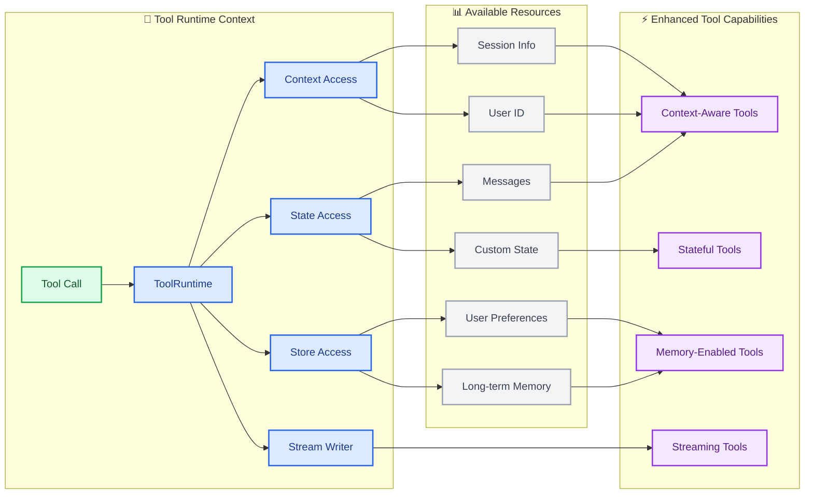

import ToolReturnValuesPy from '/snippets/code-samples/tool-return-values-py.mdx';
import ToolReturnValuesJs from '/snippets/code-samples/tool-return-values-js.mdx';
import ToolReturnObjectPy from '/snippets/code-samples/tool-return-object-py.mdx';
import ToolReturnObjectJs from '/snippets/code-samples/tool-return-object-js.mdx';
import ToolReturnCommandPy from '/snippets/code-samples/tool-return-command-py.mdx';
import ToolReturnCommandJs from '/snippets/code-samples/tool-return-command-js.mdx';

工具扩展了[代理](/oss/python/langchain/agents)的能力——让它们能够获取实时数据、执行代码、查询外部数据库并在现实世界中采取行动。

在底层，工具是具有明确定义输入和输出的可调用函数，这些函数被传递给[聊天模型](/oss/python/langchain/models)。模型根据对话上下文决定何时调用工具，以及提供哪些输入参数。

<Tip>
    有关模型如何处理工具调用的详细信息，请参阅[工具调用](/oss/python/langchain/models#tool-calling)。
</Tip>

## 创建工具

### 基本工具定义

创建工具的最简单方法是使用 [`@tool`](https://reference.langchain.com/python/langchain-core/tools/convert/tool) 装饰器。默认情况下，函数的文档字符串将成为工具的描述，帮助模型理解何时使用它：

```python
from langchain.tools import tool

@tool
def search_database(query: str, limit: int = 10) -> str:
    """Search the customer database for records matching the query.

    Args:
        query: Search terms to look for
        limit: Maximum number of results to return
    """
    return f"Found {limit} results for '{query}'"
```

类型提示是**必需的**，因为它们定义了工具的输入模式。文档字符串应信息丰富且简洁，以帮助模型理解工具的用途。


<Note>
    **服务器端工具使用：** 一些聊天模型具有内置工具（网络搜索、代码解释器），这些工具在服务器端执行。有关详细信息，请参阅[服务器端工具使用](#server-side-tool-use)。
</Note>

<Warning>
    优先使用 `snake_case` 作为工具名称（例如，`web_search` 而不是 `Web Search`）。一些模型提供商会因名称包含空格或特殊字符而出现问题或拒绝。坚持使用字母数字字符、下划线和连字符有助于提高跨提供商的兼容性。
</Warning>

### 自定义工具属性

#### 自定义工具名称

默认情况下，工具名称来自函数名称。当您需要更具描述性的名称时，可以覆盖它：

```python
@tool("web_search")  # 自定义名称
def search(query: str) -> str:
    """Search the web for information."""
    return f"Results for: {query}"

print(search.name)  # web_search
```

#### 自定义工具描述

覆盖自动生成的工具描述，以提供更清晰的模型指导：

```python
@tool("calculator", description="Performs arithmetic calculations. Use this for any math problems.")
def calc(expression: str) -> str:
    """Evaluate mathematical expressions."""
    return str(eval(expression))
```

### 高级模式定义

使用 Pydantic 模型或 JSON 模式定义复杂输入：

<CodeGroup>
    ```python Pydantic model
    from pydantic import BaseModel, Field
    from typing import Literal

    class WeatherInput(BaseModel):
        """Input for weather queries."""
        location: str = Field(description="City name or coordinates")
        units: Literal["celsius", "fahrenheit"] = Field(
            default="celsius",
            description="Temperature unit preference"
        )
        include_forecast: bool = Field(
            default=False,
            description="Include 5-day forecast"
        )

    @tool(args_schema=WeatherInput)
    def get_weather(location: str, units: str = "celsius", include_forecast: bool = False) -> str:
        """Get current weather and optional forecast."""
        temp = 22 if units == "celsius" else 72
        result = f"Current weather in {location}: {temp} degrees {units[0].upper()}"
        if include_forecast:
            result += "\nNext 5 days: Sunny"
        return result
    ```

    ```python JSON Schema
    weather_schema = {
        "type": "object",
        "properties": {
            "location": {"type": "string"},
            "units": {"type": "string"},
            "include_forecast": {"type": "boolean"}
        },
        "required": ["location", "units", "include_forecast"]
    }

    @tool(args_schema=weather_schema)
    def get_weather(location: str, units: str = "celsius", include_forecast: bool = False) -> str:
        """Get current weather and optional forecast."""
        temp = 22 if units == "celsius" else 72
        result = f"Current weather in {location}: {temp} degrees {units[0].upper()}"
        if include_forecast:
            result += "\nNext 5 days: Sunny"
        return result
    ```
</CodeGroup>

### 保留参数名称

以下参数名称是保留的，不能用作工具参数。使用这些名称将导致运行时错误。

| 参数名称 | 用途 |
|----------------|---------|
| `config` | 保留用于在内部将 `RunnableConfig` 传递给工具 |
| `runtime` | 保留用于 `ToolRuntime` 参数（访问状态、上下文、存储） |

要访问运行时信息，请使用 [`ToolRuntime`](https://reference.langchain.com/python/langchain/tools/#langchain.tools.ToolRuntime) 参数，而不是将自己的参数命名为 `config` 或 `runtime`。


## 访问上下文

当工具能够访问运行时信息（如对话历史、用户数据和持久内存）时，它们最为强大。本节介绍如何从工具内部访问和更新此信息。

工具可以通过 [`ToolRuntime`](https://reference.langchain.com/python/langchain/tools/#langchain.tools.ToolRuntime) 参数访问运行时信息，该参数提供：

| 组件 | 描述 | 用例 |
|-----------|-------------|----------|
| **State** | 短期内存 - 当前对话存在的可变数据（消息、计数器、自定义字段） | 访问对话历史、跟踪工具调用计数 |
| **Context** | 调用时传递的不可变配置（用户 ID、会话信息） | 基于用户身份个性化响应 |
| **Store** | 长期内存 - 在对话之间持久存在的数据 | 保存用户偏好、维护知识库 |
| **Stream Writer** | 在工具执行期间发出实时更新 | 显示长时间运行操作的进度 |
| **Execution Info** | 当前执行的身份和重试信息（线程 ID、运行 ID、尝试次数） | 访问线程/运行 ID、根据重试状态调整行为 |
| **Server Info** | 在 LangGraph Server 上运行时的服务器特定元数据（助理 ID、图 ID、经过身份验证的用户） | 访问助理 ID、图 ID 或经过身份验证的用户信息 |
| **Config** | 执行的 [`RunnableConfig`](https://reference.langchain.com/python/langchain-core/runnables/config/RunnableConfig) | 访问回调、标签和元数据 |
| **Tool Call ID** | 当前工具调用的唯一标识符 | 用于日志和模型调用关联工具调用 |



### 短期内存（State）

State 表示在对话持续期间存在的短期内存。它包括消息历史和您在[图状态](/oss/python/langgraph/graph-api#state)中定义的任何自定义字段。

<Info>
    将 `runtime: ToolRuntime` 添加到工具签名中以访问状态。此参数会自动注入并从 LLM 中隐藏——它不会出现在工具的模式中。
</Info>

#### 访问状态

工具可以使用 `runtime.state` 访问当前对话状态：

```python
from langchain.tools import tool, ToolRuntime
from langchain.messages import HumanMessage

@tool
def get_last_user_message(runtime: ToolRuntime) -> str:
    """Get the most recent message from the user."""
    messages = runtime.state["messages"]

    # Find the last human message
    for message in reversed(messages):
        if isinstance(message, HumanMessage):
            return message.content

    return "No user messages found"

# Access custom state fields
@tool
def get_user_preference(
    pref_name: str,
    runtime: ToolRuntime
) -> str:
    """Get a user preference value."""
    preferences = runtime.state.get("user_preferences", {})
    return preferences.get(pref_name, "Not set")
```

<Warning>
    `runtime` 参数对模型是隐藏的。对于上面的示例，模型在工具模式中只看到 `pref_name`。
</Warning>

#### 更新状态

使用 [`Command`](https://reference.langchain.com/python/langgraph/types/Command) 更新代理的状态。这对于需要更新自定义状态字段的工具很有用：

```python
from langgraph.types import Command
from langchain.tools import tool

@tool
def set_user_name(new_name: str) -> Command:
    """Set the user's name in the conversation state."""
    return Command(update={"user_name": new_name})
```

<Tip>
    当工具更新状态变量时，请考虑为这些字段定义一个[归约器](/oss/python/langgraph/graph-api#reducers)。由于 LLM 可以并行调用多个工具，归约器决定了当同一状态字段被并发工具调用更新时如何解决冲突。
</Tip>


### 上下文

上下文提供在调用时传递的不可变配置数据。将其用于用户 ID、会话详细信息或在对话期间不应更改的应用程序特定设置。

通过 `runtime.context` 访问上下文：

```python
from dataclasses import dataclass
from langchain_openai import ChatOpenAI
from langchain.agents import create_agent
from langchain.tools import tool, ToolRuntime


USER_DATABASE = {
    "user123": {
        "name": "Alice Johnson",
        "account_type": "Premium",
        "balance": 5000,
        "email": "alice@example.com"
    },
    "user456": {
        "name": "Bob Smith",
        "account_type": "Standard",
        "balance": 1200,
        "email": "bob@example.com"
    }
}

@dataclass
class UserContext:
    user_id: str

@tool
def get_account_info(runtime: ToolRuntime[UserContext]) -> str:
    """Get the current user's account information."""
    user_id = runtime.context.user_id

    if user_id in USER_DATABASE:
        user = USER_DATABASE[user_id]
        return f"Account holder: {user['name']}\nType: {user['account_type']}\nBalance: ${user['balance']}"
    return "User not found"

model = ChatOpenAI(model="gpt-4.1")
agent = create_agent(
    model,
    tools=[get_account_info],
    context_schema=UserContext,
    system_prompt="You are a financial assistant."
)

result = agent.invoke(
    {"messages": [{"role": "user", "content": "What's my current balance?"}]},
    context=UserContext(user_id="user123")
)
```


### 长期内存（Store）

[`BaseStore`](https://reference.langchain.com/python/langchain-core/stores/BaseStore) 提供持久存储，可在对话之间持续存在。与状态（短期内存）不同，保存到存储的数据在未来的会话中仍然可用。

通过 `runtime.store` 访问存储。存储使用命名空间/键模式来组织数据：

<Tip>
    对于生产部署，请使用持久存储实现，如 [`PostgresStore`](https://reference.langchain.com/python/langgraph/store/#langgraph.store.postgres.PostgresStore)，而不是 `InMemoryStore`。有关设置详细信息，请参阅[内存文档](/oss/python/langgraph/memory)。
</Tip>

```python expandable
from typing import Any
from langgraph.store.memory import InMemoryStore
from langchain.agents import create_agent
from langchain.tools import tool, ToolRuntime
from langchain_openai import ChatOpenAI

# Access memory
@tool
def get_user_info(user_id: str, runtime: ToolRuntime) -> str:
    """Look up user info."""
    store = runtime.store
    user_info = store.get(("users",), user_id)
    return str(user_info.value) if user_info else "Unknown user"

# Update memory
@tool
def save_user_info(user_id: str, user_info: dict[str, Any], runtime: ToolRuntime) -> str:
    """Save user info."""
    store = runtime.store
    store.put(("users",), user_id, user_info)
    return "Successfully saved user info."

model = ChatOpenAI(model="gpt-4.1")

store = InMemoryStore()
agent = create_agent(
    model,
    tools=[get_user_info, save_user_info],
    store=store
)

# First session: save user info
agent.invoke({
    "messages": [{"role": "user", "content": "Save the following user: userid: abc123, name: Foo, age: 25, email: foo@langchain.dev"}]
})

# Second session: get user info
agent.invoke({
    "messages": [{"role": "user", "content": "Get user info for user with id 'abc123'"}]
})
# Here is the user info for user with ID "abc123":
# - Name: Foo
# - Age: 25
# - Email: foo@langchain.dev
```


### Stream writer

在执行期间从工具流式传输实时更新。这对于在长时间运行的操作期间向用户提供进度反馈很有用。

使用 `runtime.stream_writer` 发出自定义更新：

```python
from langchain.tools import tool, ToolRuntime

@tool
def get_weather(city: str, runtime: ToolRuntime) -> str:
    """Get weather for a given city."""
    writer = runtime.stream_writer

    # Stream custom updates as the tool executes
    writer(f"Looking up data for city: {city}")
    writer(f"Acquired data for city: {city}")

    return f"It's always sunny in {city}!"
```

<Note>
如果在工具内部使用 `runtime.stream_writer`，则工具必须在 LangGraph 执行上下文中调用。有关更多详细信息，请参阅[流式传输](/oss/python/langchain/streaming)。
</Note>


### 执行信息

通过 `runtime.execution_info` 从工具内部访问线程 ID、运行 ID 和重试状态：

```python
from langchain.tools import tool, ToolRuntime

@tool
def log_execution_context(runtime: ToolRuntime) -> str:
    """Log execution identity information."""
    info = runtime.execution_info
    print(f"Thread: {info.thread_id}, Run: {info.run_id}")  # [!code highlight]
    print(f"Attempt: {info.node_attempt}")
    return "done"
```


<Note>
需要 `deepagents>=0.5.0`（或 `langgraph>=1.1.5`）。
</Note>


### 服务器信息

当您的工具在 LangGraph Server 上运行时，通过 `runtime.server_info` 访问助理 ID、图 ID 和经过身份验证的用户：

```python
from langchain.tools import tool, ToolRuntime

@tool
def get_assistant_scoped_data(runtime: ToolRuntime) -> str:
    """Fetch data scoped to the current assistant."""
    server = runtime.server_info
    if server is not None:
        print(f"Assistant: {server.assistant_id}, Graph: {server.graph_id}")  # [!code highlight]
        if server.user is not None:
            print(f"User: {server.user.identity}")  # [!code highlight]
    return "done"
```

当工具不在 LangGraph Server 上运行时（例如，在本地开发或测试期间），`server_info` 为 `None`。


<Note>
需要 `deepagents>=0.5.0`（或 `langgraph>=1.1.5`）。
</Note>


## ToolNode

[`ToolNode`](https://reference.langchain.com/python/langgraph/agents/#langgraph.prebuilt.tool_node.ToolNode) 是一个预构建的节点，用于在 LangGraph 工作流中执行工具。它自动处理并行工具执行、错误处理和状态注入。

<Info>
    对于需要精细控制工具执行模式的自定义工作流，请使用 [`ToolNode`](https://reference.langchain.com/python/langgraph/agents/#langgraph.prebuilt.tool_node.ToolNode) 而不是 [`create_agent`](https://reference.langchain.com/python/langchain/agents/factory/create_agent)。它是驱动代理工具执行的构建块。
</Info>

### 基本用法

```python
from langchain.tools import tool
from langgraph.prebuilt import ToolNode
from langgraph.graph import StateGraph, MessagesState, START, END

@tool
def search(query: str) -> str:
    """Search for information."""
    return f"Results for: {query}"

@tool
def calculator(expression: str) -> str:
    """Evaluate a math expression."""
    return str(eval(expression))

# Create the ToolNode with your tools
tool_node = ToolNode([search, calculator])

# Use in a graph
builder = StateGraph(MessagesState)
builder.add_node("tools", tool_node)
# ... add other nodes and edges
```


### 工具返回值

您可以为工具选择不同的返回值：

- 返回 `string` 以提供人类可读的结果。
- 返回 `object` 以提供模型应解析的结构化结果。
- 返回 `Command`（可选消息），当您需要写入状态时。

#### 返回字符串

当工具应提供纯文本供模型读取并在其下一个响应中使用时，返回字符串。

<ToolReturnValuesPy />


行为：

- 返回值转换为 `ToolMessage`。
- 模型看到该文本并决定下一步做什么。
- 除非模型或其他工具稍后执行操作，否则不会更改代理状态字段。

当结果自然是人类可读的文本时，使用此方法。

#### 返回对象

当您的工具生成模型应检查的结构化数据时，返回对象（例如，`dict`）。

<ToolReturnObjectPy />


行为：

- 对象被序列化并作为工具输出发送回。
- 模型可以读取特定字段并对其进行推理。
- 与字符串返回一样，这不会直接更新图状态。

当下游推理受益于显式字段而不是自由格式文本时，使用此方法。

#### 返回 Command

当工具需要更新图状态（例如，设置用户偏好或应用程序状态）时，返回 [`Command`](https://reference.langchain.com/python/langgraph/types/Command)。
您可以返回带或不带 `ToolMessage` 的 `Command`。
如果模型需要看到工具成功（例如，确认偏好更改），请在更新中包含 `ToolMessage`，使用 `runtime.tool_call_id` 作为 `tool_call_id` 参数。

<ToolReturnCommandPy />


行为：

- 命令使用 `update` 更新状态。
- 更新后的状态在同一运行的后续步骤中可用。
- 对于可能由并行工具调用更新的字段，请使用归约器。

当工具不仅返回数据，而且还改变代理状态时，使用此方法。

### 错误处理

配置工具错误的处理方式。有关所有选项，请参阅 [`ToolNode`](https://reference.langchain.com/python/langgraph/agents/#langgraph.prebuilt.tool_node.ToolNode) API 参考。

```python
from langgraph.prebuilt import ToolNode

# Default: catch invocation errors, re-raise execution errors
tool_node = ToolNode(tools)

# Catch all errors and return error message to LLM
tool_node = ToolNode(tools, handle_tool_errors=True)

# Custom error message
tool_node = ToolNode(tools, handle_tool_errors="Something went wrong, please try again.")

# Custom error handler
def handle_error(e: ValueError) -> str:
    return f"Invalid input: {e}"

tool_node = ToolNode(tools, handle_tool_errors=handle_error)

# Only catch specific exception types
tool_node = ToolNode(tools, handle_tool_errors=(ValueError, TypeError))
```


### 使用 tools_condition 路由

使用 [`tools_condition`](https://reference.langchain.com/python/langgraph/agents/#langgraph.prebuilt.tool_node.tools_condition) 根据 LLM 是否进行工具调用进行条件路由：

```python
from langgraph.prebuilt import ToolNode, tools_condition
from langgraph.graph import StateGraph, MessagesState, START, END

builder = StateGraph(MessagesState)
builder.add_node("llm", call_llm)
builder.add_node("tools", ToolNode(tools))

builder.add_edge(START, "llm")
builder.add_conditional_edges("llm", tools_condition)  # Routes to "tools" or END
builder.add_edge("tools", "llm")

graph = builder.compile()
```


### 状态注入

工具可以通过 [`ToolRuntime`](https://reference.langchain.com/python/langchain/tools/#langchain.tools.ToolRuntime) 访问当前图状态：

```python
from langchain.tools import tool, ToolRuntime
from langgraph.prebuilt import ToolNode

@tool
def get_message_count(runtime: ToolRuntime) -> str:
    """Get the number of messages in the conversation."""
    messages = runtime.state["messages"]
    return f"There are {len(messages)} messages."

tool_node = ToolNode([get_message_count])
```


有关从工具访问状态、上下文和长期内存的更多详细信息，请参阅[访问上下文](#access-context)。

## 预构建工具

LangChain 提供了大量预构建的工具和工具包，用于常见任务，如网络搜索、代码解释、数据库访问等。这些即用型工具可以直接集成到您的代理中，而无需编写自定义代码。

请参阅[工具和工具包](/oss/python/integrations/tools)集成页面，获取按类别组织的可用工具的完整列表。

## 服务器端工具使用

一些聊天模型具有内置工具，这些工具由模型提供程序在服务器端执行。这些功能包括网络搜索和代码解释器，无需您定义或托管工具逻辑。

请参阅各个[聊天模型集成页面](/oss/python/integrations/providers)和[工具调用文档](/oss/python/langchain/models#server-side-tool-use)，了解如何启用和使用这些内置工具。

---

<div className="source-links">
<Callout icon="edit">
    [在 GitHub 上编辑此页面](https://github.com/langchain-ai/docs/edit/main/src/oss/langchain/tools.mdx) 或[提交问题](https://github.com/langchain-ai/docs/issues/new/choose)。
</Callout>
<Callout icon="terminal-2">
    [通过 MCP 将这些文档](/use-these-docs)连接到 Claude、VSCode 等，以获取实时答案。
</Callout>
</div>