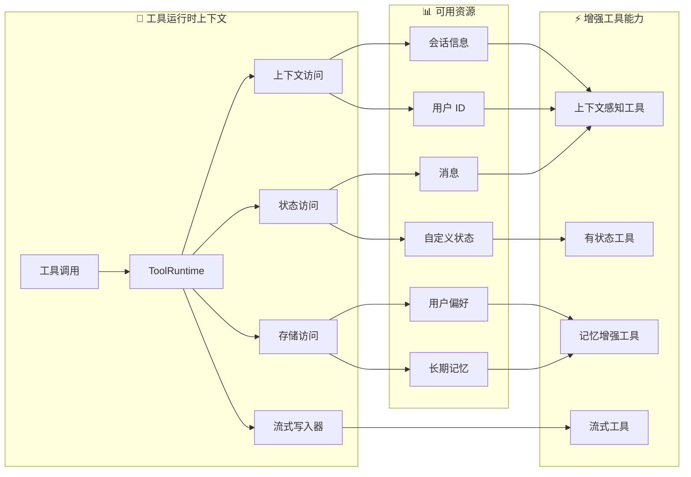

工具扩展了[代理](/oss/python/langchain/agents)的能力——让代理能够获取实时数据、执行代码、查询外部数据库，并在现实世界中采取行动。

在底层，工具是具有明确定义输入输出的可调用函数，这些函数会被传递给[聊天模型](/oss/python/langchain/models)。模型根据对话上下文决定何时调用工具以及提供什么输入参数。

<Tip>
    有关模型如何处理工具调用的详情，请参阅[工具调用](/oss/python/langchain/models#tool-calling)。
</Tip>

## 创建工具

### 基本工具定义

创建工具最简单的方式是使用 [`@tool`](https://reference.langchain.com/python/langchain-core/tools/convert/tool) 装饰器。默认情况下，函数的文档字符串会作为工具描述，帮助模型理解何时使用该工具：

```python
from langchain.tools import tool

@tool
def search_database(query: str, limit: int = 10) -> str:
    """Search the customer database for records matching the query.

    Args:
        query: Search terms to look for
        limit: Maximum number of results to return
    """
    return f"Found {limit} results for '{query}'"
```

类型注解是**必须的**，因为它们定义了工具的输入模式。文档字符串应简洁明了，帮助模型理解工具的用途。


<Note>
    **服务端工具使用：** 部分聊天模型内置了在服务端执行的工具（网页搜索、代码解释器等）。详见[服务端工具使用](#server-side-tool-use)。
</Note>

<Warning>
    建议工具名称使用 `snake_case`（如 `web_search` 而非 `Web Search`）。部分模型提供商对包含空格或特殊字符的名称会报错或拒绝支持。坚持使用字母数字字符、下划线和连字符有助于提高跨提供商的兼容性。
</Warning>

### 自定义工具属性

#### 自定义工具名称

默认情况下，工具名称来自函数名。当你需要更具描述性的名称时，可以覆盖它：

```python
@tool("web_search")  # Custom name
def search(query: str) -> str:
    """Search the web for information."""
    return f"Results for: {query}"

print(search.name)  # web_search
```

#### 自定义工具描述

覆盖自动生成的工具描述，为模型提供更清晰的指引：

```python
@tool("calculator", description="Performs arithmetic calculations. Use this for any math problems.")
def calc(expression: str) -> str:
    """Evaluate mathematical expressions."""
    return str(eval(expression))
```

### 高级模式定义

使用 Pydantic 模型或 JSON 模式定义复杂输入：

<CodeGroup>
    ```python Pydantic model
    from pydantic import BaseModel, Field
    from typing import Literal

    class WeatherInput(BaseModel):
        """Input for weather queries."""
        location: str = Field(description="City name or coordinates")
        units: Literal["celsius", "fahrenheit"] = Field(
            default="celsius",
            description="Temperature unit preference"
        )
        include_forecast: bool = Field(
            default=False,
            description="Include 5-day forecast"
        )

    @tool(args_schema=WeatherInput)
    def get_weather(location: str, units: str = "celsius", include_forecast: bool = False) -> str:
        """Get current weather and optional forecast."""
        temp = 22 if units == "celsius" else 72
        result = f"Current weather in {location}: {temp} degrees {units[0].upper()}"
        if include_forecast:
            result += "\nNext 5 days: Sunny"
        return result
    ```

    ```python JSON Schema
    weather_schema = {
        "type": "object",
        "properties": {
            "location": {"type": "string"},
            "units": {"type": "string"},
            "include_forecast": {"type": "boolean"}
        },
        "required": ["location", "units", "include_forecast"]
    }

    @tool(args_schema=weather_schema)
    def get_weather(location: str, units: str = "celsius", include_forecast: bool = False) -> str:
        """Get current weather and optional forecast."""
        temp = 22 if units == "celsius" else 72
        result = f"Current weather in {location}: {temp} degrees {units[0].upper()}"
        if include_forecast:
            result += "\nNext 5 days: Sunny"
        return result
    ```
</CodeGroup>

### 保留参数名称

以下参数名称为保留名称，不能用作工具参数。使用这些名称将导致运行时错误。

| 参数名称 | 用途 |
|----------------|---------|
| `config` | 保留用于在工具内部传递 `RunnableConfig` |
| `runtime` | 保留用于 `ToolRuntime` 参数（访问状态、上下文、存储） |

要访问运行时信息，请使用 [`ToolRuntime`](https://reference.langchain.com/python/langchain/tools/#langchain.tools.ToolRuntime) 参数，而不是将自己的参数命名为 `config` 或 `runtime`。


## 访问上下文

当工具能够访问运行时信息（如对话历史、用户数据和持久记忆）时，其能力将大幅增强。本节介绍如何在工具中访问和更新这些信息。

工具可以通过 [`ToolRuntime`](https://reference.langchain.com/python/langchain/tools/#langchain.tools.ToolRuntime) 参数访问运行时信息，该参数提供：

| 组件 | 描述 | 使用场景 |
|-----------|-------------|----------|
| **状态（State）** | 短期记忆——当前对话中存在的可变数据（消息、计数器、自定义字段） | 访问对话历史、追踪工具调用次数 |
| **上下文（Context）** | 调用时传入的不可变配置（用户 ID、会话信息） | 根据用户身份个性化响应 |
| **存储（Store）** | 长期记忆——跨对话持久存储的数据 | 保存用户偏好、维护知识库 |
| **流式写入器（Stream Writer）** | 在工具执行期间发送实时更新 | 为长时间运行的操作显示进度 |
| **配置（Config）** | 执行时的 [`RunnableConfig`](https://reference.langchain.com/python/langchain-core/runnables/config/RunnableConfig) | 访问回调、标签和元数据 |
| **工具调用 ID（Tool Call ID）** | 当前工具调用的唯一标识符 | 关联工具调用以用于日志和模型调用 |



### 短期记忆（状态）

状态表示在对话期间存在的短期记忆。它包含消息历史以及你在[图状态](/oss/python/langgraph/graph-api#state)中定义的任何自定义字段。

<Info>
    在工具签名中添加 `runtime: ToolRuntime` 即可访问状态。该参数会自动注入并对 LLM 隐藏——它不会出现在工具的模式中。
</Info>

#### 访问状态

工具可以使用 `runtime.state` 访问当前对话状态：

```python
from langchain.tools import tool, ToolRuntime
from langchain.messages import HumanMessage

@tool
def get_last_user_message(runtime: ToolRuntime) -> str:
    """Get the most recent message from the user."""
    messages = runtime.state["messages"]

    # Find the last human message
    for message in reversed(messages):
        if isinstance(message, HumanMessage):
            return message.content

    return "No user messages found"

# Access custom state fields
@tool
def get_user_preference(
    pref_name: str,
    runtime: ToolRuntime
) -> str:
    """Get a user preference value."""
    preferences = runtime.state.get("user_preferences", {})
    return preferences.get(pref_name, "Not set")
```

<Warning>
    `runtime` 参数对模型隐藏。对于上面的示例，模型在工具模式中只能看到 `pref_name`。
</Warning>

#### 更新状态

使用 [`Command`](https://reference.langchain.com/python/langgraph/types/Command) 更新代理状态。这对于需要更新自定义状态字段的工具非常有用：

```python
from langgraph.types import Command
from langchain.tools import tool

@tool
def set_user_name(new_name: str) -> Command:
    """Set the user's name in the conversation state."""
    return Command(update={"user_name": new_name})
```

<Tip>
    当工具更新状态变量时，考虑为这些字段定义[归约器](/oss/python/langgraph/graph-api#reducers)。由于 LLM 可以并行调用多个工具，归约器可以确定当并发工具调用同时更新相同状态字段时如何解决冲突。
</Tip>


### 上下文

上下文提供在调用时传入的不可变配置数据。用于在对话期间不应更改的用户 ID、会话详情或应用程序特定设置。

通过 `runtime.context` 访问上下文：

```python
from dataclasses import dataclass
from langchain_openai import ChatOpenAI
from langchain.agents import create_agent
from langchain.tools import tool, ToolRuntime


USER_DATABASE = {
    "user123": {
        "name": "Alice Johnson",
        "account_type": "Premium",
        "balance": 5000,
        "email": "alice@example.com"
    },
    "user456": {
        "name": "Bob Smith",
        "account_type": "Standard",
        "balance": 1200,
        "email": "bob@example.com"
    }
}

@dataclass
class UserContext:
    user_id: str

@tool
def get_account_info(runtime: ToolRuntime[UserContext]) -> str:
    """Get the current user's account information."""
    user_id = runtime.context.user_id

    if user_id in USER_DATABASE:
        user = USER_DATABASE[user_id]
        return f"Account holder: {user['name']}\nType: {user['account_type']}\nBalance: ${user['balance']}"
    return "User not found"

model = ChatOpenAI(model="gpt-4.1")
agent = create_agent(
    model,
    tools=[get_account_info],
    context_schema=UserContext,
    system_prompt="You are a financial assistant."
)

result = agent.invoke(
    {"messages": [{"role": "user", "content": "What's my current balance?"}]},
    context=UserContext(user_id="user123")
)
```


### 长期记忆（存储）

[`BaseStore`](https://reference.langchain.com/python/langchain-core/stores/BaseStore) 提供跨对话持久存储。与状态（短期记忆）不同，保存到存储中的数据在未来的会话中仍然可用。

通过 `runtime.store` 访问存储。存储使用命名空间/键模式来组织数据：

<Tip>
    对于生产部署，建议使用持久存储实现，如 [`PostgresStore`](https://reference.langchain.com/python/langgraph/store/#langgraph.store.postgres.PostgresStore)，而不是 `InMemoryStore`。详见[记忆文档](/oss/python/langgraph/memory)。
</Tip>

```python expandable
from typing import Any
from langgraph.store.memory import InMemoryStore
from langchain.agents import create_agent
from langchain.tools import tool, ToolRuntime


# Access memory
@tool
def get_user_info(user_id: str, runtime: ToolRuntime) -> str:
    """Look up user info."""
    store = runtime.store
    user_info = store.get(("users",), user_id)
    return str(user_info.value) if user_info else "Unknown user"

# Update memory
@tool
def save_user_info(user_id: str, user_info: dict[str, Any], runtime: ToolRuntime) -> str:
    """Save user info."""
    store = runtime.store
    store.put(("users",), user_id, user_info)
    return "Successfully saved user info."

store = InMemoryStore()
agent = create_agent(
    model,
    tools=[get_user_info, save_user_info],
    store=store
)

# First session: save user info
agent.invoke({
    "messages": [{"role": "user", "content": "Save the following user: userid: abc123, name: Foo, age: 25, email: foo@langchain.dev"}]
})

# Second session: get user info
agent.invoke({
    "messages": [{"role": "user", "content": "Get user info for user with id 'abc123'"}]
})
# Here is the user info for user with ID "abc123":
# - Name: Foo
# - Age: 25
# - Email: foo@langchain.dev
```


### 流式写入器

在工具执行期间流式传输实时更新。这对于在长时间运行的操作期间向用户提供进度反馈非常有用。

使用 `runtime.stream_writer` 发出自定义更新：

```python
from langchain.tools import tool, ToolRuntime

@tool
def get_weather(city: str, runtime: ToolRuntime) -> str:
    """Get weather for a given city."""
    writer = runtime.stream_writer

    # Stream custom updates as the tool executes
    writer(f"Looking up data for city: {city}")
    writer(f"Acquired data for city: {city}")

    return f"It's always sunny in {city}!"
```

<Note>
如果你在工具中使用 `runtime.stream_writer`，该工具必须在 LangGraph 执行上下文中调用。详见[流式传输](/oss/python/langchain/streaming)。
</Note>


## ToolNode

[`ToolNode`](https://reference.langchain.com/python/langgraph/agents/#langgraph.prebuilt.tool_node.ToolNode) 是在 LangGraph 工作流中执行工具的预置节点。它自动处理并行工具执行、错误处理和状态注入。

<Info>
    对于需要对工具执行模式进行精细控制的自定义工作流，使用 [`ToolNode`](https://reference.langchain.com/python/langgraph/agents/#langgraph.prebuilt.tool_node.ToolNode) 而非 [`create_agent`](https://reference.langchain.com/python/langchain/agents/factory/create_agent)。它是支撑代理工具执行的基础构件。
</Info>

### 基本用法

```python
from langchain.tools import tool
from langgraph.prebuilt import ToolNode
from langgraph.graph import StateGraph, MessagesState, START, END

@tool
def search(query: str) -> str:
    """Search for information."""
    return f"Results for: {query}"

@tool
def calculator(expression: str) -> str:
    """Evaluate a math expression."""
    return str(eval(expression))

# Create the ToolNode with your tools
tool_node = ToolNode([search, calculator])

# Use in a graph
builder = StateGraph(MessagesState)
builder.add_node("tools", tool_node)
# ... add other nodes and edges
```


### 错误处理

配置工具错误的处理方式。所有选项请参阅 [`ToolNode`](https://reference.langchain.com/python/langgraph/agents/#langgraph.prebuilt.tool_node.ToolNode) API 参考。

```python
from langgraph.prebuilt import ToolNode

# Default: catch invocation errors, re-raise execution errors
tool_node = ToolNode(tools)

# Catch all errors and return error message to LLM
tool_node = ToolNode(tools, handle_tool_errors=True)

# Custom error message
tool_node = ToolNode(tools, handle_tool_errors="Something went wrong, please try again.")

# Custom error handler
def handle_error(e: ValueError) -> str:
    return f"Invalid input: {e}"

tool_node = ToolNode(tools, handle_tool_errors=handle_error)

# Only catch specific exception types
tool_node = ToolNode(tools, handle_tool_errors=(ValueError, TypeError))
```


### 使用 tools_condition 路由

使用 [`tools_condition`](https://reference.langchain.com/python/langgraph/agents/#langgraph.prebuilt.tool_node.tools_condition) 根据 LLM 是否发起工具调用进行条件路由：

```python
from langgraph.prebuilt import ToolNode, tools_condition
from langgraph.graph import StateGraph, MessagesState, START, END

builder = StateGraph(MessagesState)
builder.add_node("llm", call_llm)
builder.add_node("tools", ToolNode(tools))

builder.add_edge(START, "llm")
builder.add_conditional_edges("llm", tools_condition)  # Routes to "tools" or END
builder.add_edge("tools", "llm")

graph = builder.compile()
```


### 状态注入

工具可以通过 [`ToolRuntime`](https://reference.langchain.com/python/langchain/tools/#langchain.tools.ToolRuntime) 访问当前图状态：

```python
from langchain.tools import tool, ToolRuntime
from langgraph.prebuilt import ToolNode

@tool
def get_message_count(runtime: ToolRuntime) -> str:
    """Get the number of messages in the conversation."""
    messages = runtime.state["messages"]
    return f"There are {len(messages)} messages."

tool_node = ToolNode([get_message_count])
```


有关从工具中访问状态、上下文和长期记忆的更多详情，请参阅[访问上下文](#access-context)。

## 预置工具

LangChain 为网页搜索、代码解释、数据库访问等常见任务提供了大量预置工具和工具包。这些开箱即用的工具可以直接集成到你的代理中，无需编写自定义代码。

完整可用工具列表请参阅[工具和工具包](/oss/python/integrations/tools)集成页面（按类别组织）。

## 服务端工具使用

部分聊天模型内置了由模型提供商在服务端执行的工具，包括网页搜索和代码解释器等功能，无需你定义或托管工具逻辑。

详情请参阅各[聊天模型集成页面](/oss/python/integrations/providers)和[工具调用文档](/oss/python/langchain/models#server-side-tool-use)，了解如何启用和使用这些内置工具。

---

<div className="source-links">
<Callout icon="edit">
    [在 GitHub 上编辑此页面](https://github.com/langchain-ai/docs/edit/main/src/oss/langchain/tools.mdx) 或[提交问题](https://github.com/langchain-ai/docs/issues/new/choose)。
</Callout>
<Callout icon="terminal-2">
    通过 MCP [将这些文档连接](/use-these-docs)到 Claude、VSCode 等以获取实时解答。
</Callout>
</div>
