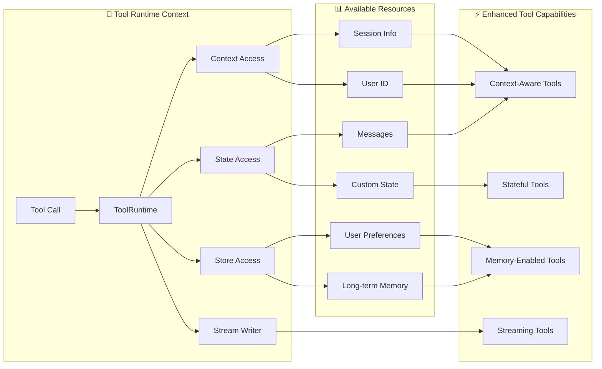

工具扩展了 [Agent](/oss/python/langchain/agents) 的能力——让它们可以获取实时数据、执行代码、查询外部数据库并在世界中采取行动。

在底层，工具是具有明确定义的输入和输出的可调用函数，它们被传递给[聊天模型](/oss/python/langchain/models)。模型根据对话上下文决定何时调用工具以及提供什么输入参数。

<Tip>
    有关模型如何处理工具调用的详细信息，请参阅[工具调用](/oss/python/langchain/models#tool-calling)。
</Tip>

## 创建工具

### 基本工具定义

创建工具最简单的方式是使用 [`@tool`](https://reference.langchain.com/python/langchain/tools/#langchain.tools.tool) 装饰器。默认情况下，函数的文档字符串成为工具的描述，帮助模型理解何时使用它：

```python
from langchain.tools import tool

@tool
def search_database(query: str, limit: int = 10) -> str:
    """Search the customer database for records matching the query.

    Args:
        query: Search terms to look for
        limit: Maximum number of results to return
    """
    return f"Found {limit} results for '{query}'"
```

类型提示是**必需的**，因为它们定义了工具的输入模式。文档字符串应该信息丰富且简洁，以帮助模型理解工具的用途。


<Note>
    **服务器端工具使用**

    一些聊天模型（例如 [OpenAI](/oss/python/integrations/chat/openai)、[Anthropic](/oss/python/integrations/chat/anthropic) 和 [Gemini](/oss/python/integrations/chat/google_generative_ai)）具有在服务器端执行的[内置工具](/oss/python/langchain/models#server-side-tool-use)，如网络搜索和代码解释器。请参阅[服务商概述](/oss/python/integrations/providers/overview)了解如何使用特定聊天模型访问这些工具。
</Note>

### 自定义工具属性

#### 自定义工具名称

默认情况下，工具名称来自函数名。当你需要更具描述性的名称时，可以覆盖它：

```python
@tool("web_search")  # Custom name
def search(query: str) -> str:
    """Search the web for information."""
    return f"Results for: {query}"

print(search.name)  # web_search
```

#### 自定义工具描述

覆盖自动生成的工具描述以提供更清晰的模型指导：

```python
@tool("calculator", description="Performs arithmetic calculations. Use this for any math problems.")
def calc(expression: str) -> str:
    """Evaluate mathematical expressions."""
    return str(eval(expression))
```

### 高级模式定义

使用 Pydantic 模型或 JSON schema 定义复杂输入：

<CodeGroup>
    ```python Pydantic model
    from pydantic import BaseModel, Field
    from typing import Literal

    class WeatherInput(BaseModel):
        """Input for weather queries."""
        location: str = Field(description="City name or coordinates")
        units: Literal["celsius", "fahrenheit"] = Field(
            default="celsius",
            description="Temperature unit preference"
        )
        include_forecast: bool = Field(
            default=False,
            description="Include 5-day forecast"
        )

    @tool(args_schema=WeatherInput)
    def get_weather(location: str, units: str = "celsius", include_forecast: bool = False) -> str:
        """Get current weather and optional forecast."""
        temp = 22 if units == "celsius" else 72
        result = f"Current weather in {location}: {temp} degrees {units[0].upper()}"
        if include_forecast:
            result += "\nNext 5 days: Sunny"
        return result
    ```

    ```python JSON Schema
    weather_schema = {
        "type": "object",
        "properties": {
            "location": {"type": "string"},
            "units": {"type": "string"},
            "include_forecast": {"type": "boolean"}
        },
        "required": ["location", "units", "include_forecast"]
    }

    @tool(args_schema=weather_schema)
    def get_weather(location: str, units: str = "celsius", include_forecast: bool = False) -> str:
        """Get current weather and optional forecast."""
        temp = 22 if units == "celsius" else 72
        result = f"Current weather in {location}: {temp} degrees {units[0].upper()}"
        if include_forecast:
            result += "\nNext 5 days: Sunny"
        return result
    ```
</CodeGroup>

### 保留参数名

以下参数名是保留的，不能用作工具参数。使用这些名称将导致运行时错误。

| 参数名 | 用途 |
|--------|------|
| `config` | 保留用于内部向工具传递 `RunnableConfig` |
| `runtime` | 保留用于 `ToolRuntime` 参数（访问状态、上下文、存储） |

要访问运行时信息，请使用 [`ToolRuntime`](https://reference.langchain.com/python/langchain/tools/#langchain.tools.ToolRuntime) 参数，而不是将你自己的参数命名为 `config` 或 `runtime`。


## 访问上下文

<Info>
**为什么这很重要：**当工具可以访问 Agent 状态、运行时上下文和长期记忆时，它们是最强大的。这使工具能够做出上下文感知的决策、个性化响应并在对话之间维护信息。

运行时上下文提供了一种在运行时将依赖项（如数据库连接、用户 ID 或配置）注入工具的方式，使它们更易于测试和重用。


</Info>

工具可以通过 `ToolRuntime` 参数访问运行时信息，该参数提供：

- **State** - 流经执行的可变数据（例如消息、计数器、自定义字段）
- **Context** - 不可变配置，如用户 ID、会话详情或应用程序特定配置
- **Store** - 跨对话的持久长期记忆
- **Stream Writer** - 工具执行时流式传输自定义更新
- **Config** - 执行的 `RunnableConfig`
- **Tool Call ID** - 当前工具调用的 ID



### `ToolRuntime`

使用 `ToolRuntime` 在单个参数中访问所有运行时信息。只需在工具签名中添加 `runtime: ToolRuntime`，它将自动注入而不会暴露给 LLM。

<Info>
**`ToolRuntime`**：一个统一的参数，为工具提供对状态、上下文、存储、流式传输、配置和工具调用 ID 的访问。这取代了使用单独的 [`InjectedState`](https://reference.langchain.com/python/langgraph/agents/#langgraph.prebuilt.tool_node.InjectedState)、[`InjectedStore`](https://reference.langchain.com/python/langgraph/agents/#langgraph.prebuilt.tool_node.InjectedStore)、[`get_runtime`](https://reference.langchain.com/python/langgraph/runtime/#langgraph.runtime.get_runtime) 和 [`InjectedToolCallId`](https://reference.langchain.com/python/langchain/tools/#langchain.tools.InjectedToolCallId) 注解的旧模式。

运行时自动为你的工具函数提供这些功能，而无需你显式传递它们或使用全局状态。
</Info>

**访问状态：**

工具可以使用 `ToolRuntime` 访问当前图状态：

```python
from langchain.tools import tool, ToolRuntime

# Access the current conversation state
@tool
def summarize_conversation(
    runtime: ToolRuntime
) -> str:
    """Summarize the conversation so far."""
    messages = runtime.state["messages"]

    human_msgs = sum(1 for m in messages if m.__class__.__name__ == "HumanMessage")
    ai_msgs = sum(1 for m in messages if m.__class__.__name__ == "AIMessage")
    tool_msgs = sum(1 for m in messages if m.__class__.__name__ == "ToolMessage")

    return f"Conversation has {human_msgs} user messages, {ai_msgs} AI responses, and {tool_msgs} tool results"

# Access custom state fields
@tool
def get_user_preference(
    pref_name: str,
    runtime: ToolRuntime  # ToolRuntime parameter is not visible to the model
) -> str:
    """Get a user preference value."""
    preferences = runtime.state.get("user_preferences", {})
    return preferences.get(pref_name, "Not set")
```

<Warning>
`runtime` 参数对模型是隐藏的。对于上面的示例，模型在工具模式中只看到 `pref_name` - `runtime` *不会*包含在请求中。
</Warning>

**更新状态：**

使用 [`Command`](https://reference.langchain.com/python/langgraph/types/#langgraph.types.Command) 更新 Agent 的状态或控制图的执行流程：

```python
from langgraph.types import Command
from langchain.messages import RemoveMessage
from langgraph.graph.message import REMOVE_ALL_MESSAGES
from langchain.tools import tool, ToolRuntime

# Update the conversation history by removing all messages
@tool
def clear_conversation() -> Command:
    """Clear the conversation history."""

    return Command(
        update={
            "messages": [RemoveMessage(id=REMOVE_ALL_MESSAGES)],
        }
    )

# Update the user_name in the agent state
@tool
def update_user_name(
    new_name: str,
    runtime: ToolRuntime
) -> Command:
    """Update the user's name."""
    return Command(update={"user_name": new_name})
```


#### 上下文

通过 `runtime.context` 访问不可变配置和上下文数据，如用户 ID、会话详情或应用程序特定配置。

工具可以通过 `ToolRuntime` 访问运行时上下文：

```python
from dataclasses import dataclass
from langchain_openai import ChatOpenAI
from langchain.agents import create_agent
from langchain.tools import tool, ToolRuntime


USER_DATABASE = {
    "user123": {
        "name": "Alice Johnson",
        "account_type": "Premium",
        "balance": 5000,
        "email": "alice@example.com"
    },
    "user456": {
        "name": "Bob Smith",
        "account_type": "Standard",
        "balance": 1200,
        "email": "bob@example.com"
    }
}

@dataclass
class UserContext:
    user_id: str

@tool
def get_account_info(runtime: ToolRuntime[UserContext]) -> str:
    """Get the current user's account information."""
    user_id = runtime.context.user_id

    if user_id in USER_DATABASE:
        user = USER_DATABASE[user_id]
        return f"Account holder: {user['name']}\nType: {user['account_type']}\nBalance: ${user['balance']}"
    return "User not found"

model = ChatOpenAI(model="gpt-4o")
agent = create_agent(
    model,
    tools=[get_account_info],
    context_schema=UserContext,
    system_prompt="You are a financial assistant."
)

result = agent.invoke(
    {"messages": [{"role": "user", "content": "What's my current balance?"}]},
    context=UserContext(user_id="user123")
)
```


#### 记忆（Store）

使用 store 跨对话访问持久数据。store 通过 `runtime.store` 访问，允许你保存和检索用户特定或应用程序特定的数据。

工具可以通过 `ToolRuntime` 访问和更新 store：

```python expandable
from typing import Any
from langgraph.store.memory import InMemoryStore
from langchain.agents import create_agent
from langchain.tools import tool, ToolRuntime


# Access memory
@tool
def get_user_info(user_id: str, runtime: ToolRuntime) -> str:
    """Look up user info."""
    store = runtime.store
    user_info = store.get(("users",), user_id)
    return str(user_info.value) if user_info else "Unknown user"

# Update memory
@tool
def save_user_info(user_id: str, user_info: dict[str, Any], runtime: ToolRuntime) -> str:
    """Save user info."""
    store = runtime.store
    store.put(("users",), user_id, user_info)
    return "Successfully saved user info."

store = InMemoryStore()
agent = create_agent(
    model,
    tools=[get_user_info, save_user_info],
    store=store
)

# First session: save user info
agent.invoke({
    "messages": [{"role": "user", "content": "Save the following user: userid: abc123, name: Foo, age: 25, email: foo@langchain.dev"}]
})

# Second session: get user info
agent.invoke({
    "messages": [{"role": "user", "content": "Get user info for user with id 'abc123'"}]
})
# Here is the user info for user with ID "abc123":
# - Name: Foo
# - Age: 25
# - Email: foo@langchain.dev
```


#### 流式写入器

使用 `runtime.stream_writer` 在工具执行时流式传输自定义更新。这对于向用户提供有关工具正在做什么的实时反馈很有用。

```python
from langchain.tools import tool, ToolRuntime

@tool
def get_weather(city: str, runtime: ToolRuntime) -> str:
    """Get weather for a given city."""
    writer = runtime.stream_writer

    # Stream custom updates as the tool executes
    writer(f"Looking up data for city: {city}")
    writer(f"Acquired data for city: {city}")

    return f"It's always sunny in {city}!"
```

<Note>
如果你在工具内部使用 `runtime.stream_writer`，该工具必须在 LangGraph 执行上下文中调用。有关更多详细信息，请参阅[流式传输](/oss/python/langchain/streaming)。
</Note>

---

<Callout icon="pen-to-square" iconType="regular">
    [Edit this page on GitHub](https://github.com/langchain-ai/docs/edit/main/src/oss/langchain/tools.mdx) or [file an issue](https://github.com/langchain-ai/docs/issues/new/choose).
</Callout>
<Tip icon="terminal" iconType="regular">
    [Connect these docs](/use-these-docs) to Claude, VSCode, and more via MCP for real-time answers.
</Tip>
<div class='fixed right-2 bg-white bottom-2'></div>