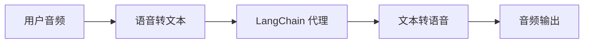
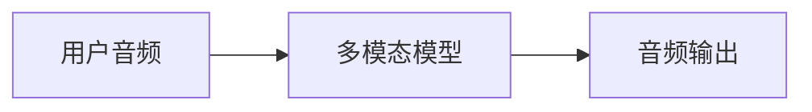

## 概览

聊天界面一直是我们与 AI 交互的主要方式，但多模态 AI 的最新突破正在开辟令人兴奋的新可能性。高质量的生成模型和富有表现力的文本转语音（TTS）系统，使构建感觉不像工具、而更像对话伙伴的代理成为可能。

语音代理就是一个典型例子。你无需通过键盘和鼠标向代理输入文字，而是可以通过语言与其交互。这种方式更自然、更具吸引力，在某些特定场景中尤为实用。

### 什么是语音代理？

语音代理是能够与用户进行自然语音对话的[代理](/oss/python/langchain/agents)。这类代理融合了语音识别、自然语言处理、生成式 AI 和文本转语音技术，打造流畅自然的对话体验。

适用的场景包括：

- 客户支持
- 个人助理
- 免手持交互界面
- 辅导与培训

### 语音代理如何工作？

从宏观角度看，每个语音代理都需要处理三项任务：

1. **聆听** - 捕获音频并转录
2. **思考** - 理解意图、推理、规划
3. **说话** - 生成音频并流式传回用户

区别在于这些步骤的排列和耦合方式。在实践中，生产级代理通常遵循以下两种主要架构之一：

#### 1. STT > 代理 > TTS 架构（"三明治"架构）

三明治架构由三个独立组件组成：语音转文本（STT）、基于文本的 LangChain 代理，以及文本转语音（TTS）。



**优点：**
- 对每个组件拥有完全控制权（可按需更换 STT/TTS 提供商）
- 可利用现代文本模态模型的最新能力
- 组件边界清晰，行为透明

**缺点：**
- 需要协调多个服务
- 管理流水线增加了额外复杂度
- 语音转文字过程中会丢失部分信息（如语气、情绪）

#### 2. 语音到语音架构（S2S）

语音到语音架构使用一个多模态模型，原生处理音频输入并生成音频输出。



**优点：**
- 架构更简单，组成部件更少
- 对于简单交互，延迟通常更低
- 直接处理音频，能捕捉语气等语音细微特征

**缺点：**
- 可选模型有限，提供商锁定风险较高
- 功能可能落后于文本模态模型
- 音频处理过程透明度较低
- 可控性和自定义选项有限

本指南演示**三明治架构**，以平衡性能、可控性和对现代模型能力的利用。在某些 STT 和 TTS 提供商的配合下，三明治架构可实现低于 700ms 的延迟，同时保持对各模块组件的控制。

### 示例应用概览

我们将演示如何使用三明治架构构建一个基于语音的代理。该代理将管理一家三明治店的订单。应用将展示三明治架构的所有三个组件，使用 [AssemblyAI](https://www.assemblyai.com/) 进行 STT，使用 [Cartesia](https://cartesia.ai/) 进行 TTS（也可以为大多数提供商构建适配器）。

完整的端到端参考应用可在 [voice-sandwich-demo](https://github.com/langchain-ai/voice-sandwich-demo) 仓库中找到，我们将在本文中逐步讲解。

该 Demo 使用 WebSocket 实现浏览器与服务器之间的实时双向通信。同样的架构可适配其他传输协议，如电话系统（Twilio、Vonage）或 WebRTC 连接。

### 架构

该 Demo 实现了一个流式处理流水线，每个阶段异步处理数据：

**客户端（浏览器）**
- 捕获麦克风音频并编码为 PCM 格式
- 与后端服务器建立 WebSocket 连接
- 实时将音频块流式传输到服务器
- 接收并播放合成的语音音频

**服务端（Python）**


- 接受来自客户端的 WebSocket 连接
- 协调三步流水线：
  - [语音转文字（STT）](#1-speech-to-text)：将音频转发给 STT 提供商（如 AssemblyAI），接收转录事件
  - [代理](#2-langchain-agent)：通过 LangChain 代理处理转录文本，流式传输响应 token
  - [文本转语音（TTS）](#3-text-to-speech)：将代理响应发送给 TTS 提供商（如 Cartesia），接收音频块

- 将合成音频返回客户端播放

流水线使用异步生成器实现每个阶段的流式处理，允许下游组件在上游阶段完成之前就开始处理，从而最大限度地降低端到端延迟。


## 准备工作

详细的安装说明和配置，请参阅[仓库 README](https://github.com/langchain-ai/voice-sandwich-demo#readme)。

## 1. 语音转文字

STT 阶段将传入的音频流转换为文本转录。该实现使用生产者-消费者模式并发处理音频流式传输和转录接收。

### 关键概念

**生产者-消费者模式**：音频块的发送与转录事件的接收并发进行，允许在所有音频到达之前就开始转录。

**事件类型**：
- `stt_chunk`：STT 服务处理音频时提供的部分转录
- `stt_output`：触发代理处理的最终格式化转录

**WebSocket 连接**：与 AssemblyAI 实时 STT API 维持持久连接，配置为 16kHz PCM 音频并启用自动轮次格式化。

### 实现

```python
from typing import AsyncIterator
import asyncio
from assemblyai_stt import AssemblyAISTT
from events import VoiceAgentEvent

async def stt_stream(
    audio_stream: AsyncIterator[bytes],
) -> AsyncIterator[VoiceAgentEvent]:
    """
    Transform stream: Audio (Bytes) → Voice Events (VoiceAgentEvent)

    Uses a producer-consumer pattern where:
    - Producer: Reads audio chunks and sends them to AssemblyAI
    - Consumer: Receives transcription events from AssemblyAI
    """
    stt = AssemblyAISTT(sample_rate=16000)

    async def send_audio():
        """Background task that pumps audio chunks to AssemblyAI."""
        try:
            async for audio_chunk in audio_stream:
                await stt.send_audio(audio_chunk)
        finally:
            # Signal completion when audio stream ends
            await stt.close()

    # Launch audio sending in background
    send_task = asyncio.create_task(send_audio())

    try:
        # Receive and yield transcription events as they arrive
        async for event in stt.receive_events():
            yield event
    finally:
        # Cleanup
        with contextlib.suppress(asyncio.CancelledError):
            send_task.cancel()
            await send_task
        await stt.close()
```


应用实现了一个 AssemblyAI 客户端来管理 WebSocket 连接和消息解析。详见下方实现；类似的适配器也可以为其他 STT 提供商构建。

<Accordion title="AssemblyAI 客户端">

```python
class AssemblyAISTT:
    def __init__(self, api_key: str | None = None, sample_rate: int = 16000):
        self.api_key = api_key or os.getenv("ASSEMBLYAI_API_KEY")
        self.sample_rate = sample_rate
        self._ws: WebSocketClientProtocol | None = None

    async def send_audio(self, audio_chunk: bytes) -> None:
        """Send PCM audio bytes to AssemblyAI."""
        ws = await self._ensure_connection()
        await ws.send(audio_chunk)

    async def receive_events(self) -> AsyncIterator[STTEvent]:
        """Yield STT events as they arrive from AssemblyAI."""
        async for raw_message in self._ws:
            message = json.loads(raw_message)

            if message["type"] == "Turn":
                # Final formatted transcript
                if message.get("turn_is_formatted"):
                    yield STTOutputEvent.create(message["transcript"])
                # Partial transcript
                else:
                    yield STTChunkEvent.create(message["transcript"])

    async def _ensure_connection(self) -> WebSocketClientProtocol:
        """Establish WebSocket connection if not already connected."""
        if self._ws is None:
            url = f"wss://streaming.assemblyai.com/v3/ws?sample_rate={self.sample_rate}&format_turns=true"
            self._ws = await websockets.connect(
                url,
                additional_headers={"Authorization": self.api_key}
            )
        return self._ws
```


</Accordion>

## 2. LangChain 代理

代理阶段通过 LangChain [代理](/oss/python/langchain/agents)处理文本转录并流式传输响应 token。在本例中，我们流式传输代理生成的所有[文本内容块](/oss/python/langchain/messages#textcontentblock)。

### 关键概念

**流式响应**：代理使用 [`stream_mode="messages"`](/oss/python/langchain/streaming#llm-tokens) 在生成时即时发出响应 token，而非等待完整响应。这使 TTS 阶段可以立即开始合成。

**对话记忆**：[检查点](/oss/python/langchain/short-term-memory)通过唯一线程 ID 跨轮次维护对话状态，允许代理在对话中引用先前的交流内容。

### 实现

```python
from uuid import uuid4
from langchain.agents import create_agent
from langchain.messages import HumanMessage
from langgraph.checkpoint.memory import InMemorySaver

# Define agent tools
def add_to_order(item: str, quantity: int) -> str:
    """Add an item to the customer's sandwich order."""
    return f"Added {quantity} x {item} to the order."

def confirm_order(order_summary: str) -> str:
    """Confirm the final order with the customer."""
    return f"Order confirmed: {order_summary}. Sending to kitchen."

# Create agent with tools and memory
agent = create_agent(
    model="anthropic:claude-haiku-4-5",  # Select your model
    tools=[add_to_order, confirm_order],
    system_prompt="""You are a helpful sandwich shop assistant.
    Your goal is to take the user's order. Be concise and friendly.
    Do NOT use emojis, special characters, or markdown.
    Your responses will be read by a text-to-speech engine.""",
    checkpointer=InMemorySaver(),
)

async def agent_stream(
    event_stream: AsyncIterator[VoiceAgentEvent],
) -> AsyncIterator[VoiceAgentEvent]:
    """
    Transform stream: Voice Events → Voice Events (with Agent Responses)

    Passes through all upstream events and adds agent_chunk events
    when processing STT transcripts.
    """
    # Generate unique thread ID for conversation memory
    thread_id = str(uuid4())

    async for event in event_stream:
        # Pass through all upstream events
        yield event

        # Process final transcripts through the agent
        if event.type == "stt_output":
            # Stream agent response with conversation context
            stream = agent.astream(
                {"messages": [HumanMessage(content=event.transcript)]},
                {"configurable": {"thread_id": thread_id}},
                stream_mode="messages",
            )

            # Yield agent response chunks as they arrive
            async for message, _ in stream:
                if message.text:
                    yield AgentChunkEvent.create(message.text)
```


## 3. 文本转语音

TTS 阶段将代理响应文本合成为音频并流式传回客户端。与 STT 阶段类似，它使用生产者-消费者模式并发处理文本发送和音频接收。

### 关键概念

**并发处理**：该实现合并了两个异步流：
- **上游处理**：传递所有事件并将代理文本块发送给 TTS 提供商
- **音频接收**：从 TTS 提供商接收合成的音频块

**流式 TTS**：部分提供商（如 [Cartesia](https://cartesia.ai/)）在收到文本后立即开始合成音频，使音频播放可以在代理完成整个响应生成之前就开始。

**事件透传**：所有上游事件原封不动地流过，允许客户端或其他观察者追踪完整的流水线状态。

### 实现

```python
from cartesia_tts import CartesiaTTS
from utils import merge_async_iters

async def tts_stream(
    event_stream: AsyncIterator[VoiceAgentEvent],
) -> AsyncIterator[VoiceAgentEvent]:
    """
    Transform stream: Voice Events → Voice Events (with Audio)

    Merges two concurrent streams:
    1. process_upstream(): passes through events and sends text to Cartesia
    2. tts.receive_events(): yields audio chunks from Cartesia
    """
    tts = CartesiaTTS()

    async def process_upstream() -> AsyncIterator[VoiceAgentEvent]:
        """Process upstream events and send agent text to Cartesia."""
        async for event in event_stream:
            # Pass through all events
            yield event
            # Send agent text to Cartesia for synthesis
            if event.type == "agent_chunk":
                await tts.send_text(event.text)

    try:
        # Merge upstream events with TTS audio events
        # Both streams run concurrently
        async for event in merge_async_iters(
            process_upstream(),
            tts.receive_events()
        ):
            yield event
    finally:
        await tts.close()
```


应用实现了一个 Cartesia 客户端来管理 WebSocket 连接和音频流式传输。详见下方实现；类似的适配器也可以为其他 TTS 提供商构建。

<Accordion title="Cartesia 客户端">

```python
import base64
import json
import websockets

class CartesiaTTS:
    def __init__(
        self,
        api_key: Optional[str] = None,
        voice_id: str = "f6ff7c0c-e396-40a9-a70b-f7607edb6937",
        model_id: str = "sonic-3",
        sample_rate: int = 24000,
        encoding: str = "pcm_s16le",
    ):
        self.api_key = api_key or os.getenv("CARTESIA_API_KEY")
        self.voice_id = voice_id
        self.model_id = model_id
        self.sample_rate = sample_rate
        self.encoding = encoding
        self._ws: WebSocketClientProtocol | None = None

    def _generate_context_id(self) -> str:
        """Generate a valid context_id for Cartesia."""
        timestamp = int(time.time() * 1000)
        counter = self._context_counter
        self._context_counter += 1
        return f"ctx_{timestamp}_{counter}"

    async def send_text(self, text: str | None) -> None:
        """Send text to Cartesia for synthesis."""
        if not text or not text.strip():
            return

        ws = await self._ensure_connection()
        payload = {
            "model_id": self.model_id,
            "transcript": text,
            "voice": {
                "mode": "id",
                "id": self.voice_id,
            },
            "output_format": {
                "container": "raw",
                "encoding": self.encoding,
                "sample_rate": self.sample_rate,
            },
            "language": self.language,
            "context_id": self._generate_context_id(),
        }
        await ws.send(json.dumps(payload))

    async def receive_events(self) -> AsyncIterator[TTSChunkEvent]:
        """Yield audio chunks as they arrive from Cartesia."""
        async for raw_message in self._ws:
            message = json.loads(raw_message)

            # Decode and yield audio chunks
            if "data" in message and message["data"]:
                audio_chunk = base64.b64decode(message["data"])
                if audio_chunk:
                    yield TTSChunkEvent.create(audio_chunk)

    async def _ensure_connection(self) -> WebSocketClientProtocol:
        """Establish WebSocket connection if not already connected."""
        if self._ws is None:
            url = (
                f"wss://api.cartesia.ai/tts/websocket"
                f"?api_key={self.api_key}&cartesia_version={self.cartesia_version}"
            )
            self._ws = await websockets.connect(url)

        return self._ws
```


</Accordion>

### LangSmith

使用 LangChain 构建的许多应用会包含多个步骤和多次 LLM 调用。随着应用变得越来越复杂，能够检查链或代理内部究竟发生了什么变得至关重要。最好的方式是使用 [LangSmith](https://smith.langchain.com)。

在上方链接注册后，设置以下环境变量以开始记录追踪：

```shell
export LANGSMITH_TRACING="true"
export LANGSMITH_API_KEY="..."
```

或者，在 Python 中设置：

```python
import getpass
import os

os.environ["LANGSMITH_TRACING"] = "true"
os.environ["LANGSMITH_API_KEY"] = getpass.getpass()
```


## 整合在一起

完整流水线将三个阶段链式组合：

```python
from langchain_core.runnables import RunnableGenerator

pipeline = (
    RunnableGenerator(stt_stream)      # Audio → STT events
    | RunnableGenerator(agent_stream)  # STT events → Agent events
    | RunnableGenerator(tts_stream)    # Agent events → TTS audio
)

# Use in WebSocket endpoint
@app.websocket("/ws")
async def websocket_endpoint(websocket: WebSocket):
    await websocket.accept()

    async def websocket_audio_stream():
        """Yield audio bytes from WebSocket."""
        while True:
            data = await websocket.receive_bytes()
            yield data

    # Transform audio through pipeline
    output_stream = pipeline.atransform(websocket_audio_stream())

    # Send TTS audio back to client
    async for event in output_stream:
        if event.type == "tts_chunk":
            await websocket.send_bytes(event.audio)
```

我们使用 [RunnableGenerators](https://reference.langchain.com/python/langchain_core/runnables/#langchain_core.runnables.base.RunnableGenerator) 组合流水线的每个步骤。这是 LangChain 内部用于管理[跨组件流式传输](https://reference.langchain.com/python/langchain_core/runnables/)的抽象。


每个阶段独立并发处理事件：一旦音频到达就开始转录，一旦转录可用就开始推理，一旦生成代理文本就开始语音合成。这种架构可实现低于 700ms 的延迟，支持自然流畅的对话。

了解更多关于使用 LangChain 构建代理的内容，请参阅[代理指南](/oss/python/langchain/agents)。

---

<div className="source-links">
<Callout icon="edit">
    [在 GitHub 上编辑此页面](https://github.com/langchain-ai/docs/edit/main/src/oss/langchain/voice-agent.mdx) 或[提交问题](https://github.com/langchain-ai/docs/issues/new/choose)。
</Callout>
<Callout icon="terminal-2">
    通过 MCP [将这些文档连接](/use-these-docs)到 Claude、VSCode 等以获取实时解答。
</Callout>
</div>
