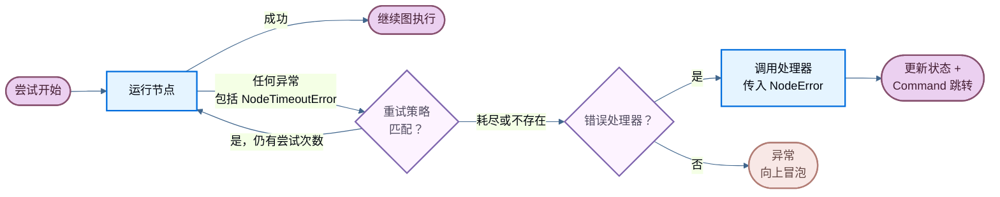

当节点失败时——无论是由于外部 API 响应缓慢、瞬时网络错误还是未处理的异常——LangGraph 提供了三种可组合的机制来应对：

- [**重试**](#重试) — 根据异常类型和退避设置自动重新运行失败的尝试
- [**超时**](#超时) — 限制单次尝试的运行时间
- [**错误处理**](#错误处理) — 在所有重试耗尽后运行恢复函数

这些机制按固定顺序组合：当节点尝试引发任何异常（包括超时产生的 [`NodeTimeoutError`](https://reference.langchain.com/python/langgraph/errors/NodeTimeoutError)）时，重试策略决定是否重试。只有在重试耗尽后，错误处理器才会运行。

有关在超步边界干净地停止运行并在稍后恢复的信息，请参阅[优雅关闭](/oss/python/langgraph/durable-execution#graceful-shutdown)。

<Note>
节点级超时和节点级错误处理器需要 `langgraph>=1.2`，目前处于 alpha 阶段。
</Note>



## 重试

重试策略根据异常类型和退避设置自动重新运行失败的节点尝试。通过 [`add_node`](https://reference.langchain.com/python/langgraph/graph/state/StateGraph/add_node) 传递 `retry_policy=`：

```python
from langgraph.types import RetryPolicy

builder.add_node(
    "call_api",
    call_api,
    retry_policy=RetryPolicy(max_attempts=3),
)
```

### 默认行为

默认情况下，`retry_on` 使用 `default_retry_on`，它会对**任何**异常进行重试，但以下异常（及其子类）除外：

- `ValueError`
- `TypeError`
- `ArithmeticError`
- `ImportError`
- `LookupError`
- `NameError`
- `SyntaxError`
- `RuntimeError`
- `ReferenceError`
- `StopIteration`
- `StopAsyncIteration`
- `OSError`

对于来自 `requests` 和 `httpx` 等流行 HTTP 库的异常，它仅对 5xx 状态码进行重试。[`NodeTimeoutError`](https://reference.langchain.com/python/langgraph/errors/NodeTimeoutError) 默认可重试。

### 参数

| 参数 | 类型 | 默认值 | 描述 |
| --------- | ---- | ------- | ----------- |
| `max_attempts` | `int` | `3` | 最大尝试次数，包括第一次。 |
| `initial_interval` | `float` | `0.5` | 第一次重试前的秒数。 |
| `backoff_factor` | `float` | `2.0` | 每次重试后应用于间隔的乘数。 |
| `max_interval` | `float` | `128.0` | 重试之间的最大秒数。 |
| `jitter` | `bool` | `True` | 为间隔添加随机抖动。 |
| `retry_on` | `type[Exception] \| Sequence[type[Exception]] \| Callable[[Exception], bool]` | `default_retry_on` | 要重试的异常，或一个可调用对象，对可重试异常返回 `True`。 |

### 自定义重试逻辑

将可调用对象或异常类型传递给 `retry_on`。导入 `default_retry_on` 以扩展默认行为：

```python
from langgraph.types import RetryPolicy, default_retry_on

def custom_retry_on(exc: BaseException) -> bool:
    if isinstance(exc, MyCustomError):
        return False
    return default_retry_on(exc)

builder.add_node(
    "call_api",
    call_api,
    retry_policy=RetryPolicy(max_attempts=3, retry_on=custom_retry_on),
)
```

### 检查重试状态

在节点内使用 `runtime.execution_info` 检查当前尝试次数。当主要调用持续失败时，这对于切换到备用方案很有用：

```python
from langgraph.graph import StateGraph, START, END
from langgraph.runtime import Runtime
from langgraph.types import RetryPolicy
from typing_extensions import TypedDict

class State(TypedDict):
    result: str

def my_node(state: State, runtime: Runtime) -> State:
    if runtime.execution_info.node_attempt > 1:  # [!code highlight]
        return {"result": call_fallback_api()}
    return {"result": call_primary_api()}

builder = StateGraph(State)
builder.add_node("my_node", my_node, retry_policy=RetryPolicy(max_attempts=3))
builder.add_edge(START, "my_node")
builder.add_edge("my_node", END)
```

`execution_info` 暴露以下字段：

| 属性 | 类型 | 描述 |
| --------- | ---- | ----------- |
| `node_attempt` | `int` | 当前尝试次数（从 1 开始）。第一次尝试为 `1`，第一次重试为 `2`，依此类推。 |
| `node_first_attempt_time` | `float \| None` | 第一次尝试开始的 Unix 时间戳。在重试期间保持不变。 |
| `thread_id` | `str \| None` | 当前执行的线程 ID。没有检查点时为 `None`。 |
| `run_id` | `str \| None` | 当前执行的运行 ID。配置中未提供时为 `None`。 |
| `checkpoint_id` | `str` | 当前执行的检查点 ID。 |
| `task_id` | `str` | 当前执行的任务 ID。 |

即使没有重试策略，`execution_info` 也可用——`node_attempt` 默认为 `1`。

## 超时

<Note>
需要 `langgraph>=1.2`，目前处于 alpha 阶段。
</Note>

[`add_node`](https://reference.langchain.com/python/langgraph/graph/state/StateGraph/add_node) 上的 `timeout=` 参数限制单次节点尝试的运行时间。传递一个数字（秒）、一个 `timedelta` 或一个 [`TimeoutPolicy`](https://reference.langchain.com/python/langgraph/types/TimeoutPolicy) 以分别设置运行和空闲限制：

```python
from datetime import timedelta
from langgraph.types import TimeoutPolicy

# 简单的挂钟时间限制
builder.add_node("call_model", call_model, timeout=60)
builder.add_node("call_model", call_model, timeout=timedelta(minutes=2))

# 分别设置运行和空闲限制
builder.add_node(
    "call_model",
    call_model,
    timeout=TimeoutPolicy(run_timeout=120, idle_timeout=30),
)
```

<Warning>
节点超时仅适用于**异步**节点。带有 `timeout` 的同步节点在编译时会被拒绝。要包装阻塞 I/O，请在异步节点内使用 `asyncio.to_thread`。
</Warning>

### 运行超时

`run_timeout` 是单次尝试的硬性挂钟时间限制。无论节点活动如何，它都不会刷新：

```python
from langgraph.types import TimeoutPolicy

builder.add_node(
    "call_model",
    call_model,
    timeout=TimeoutPolicy(run_timeout=120),
)
```

当超过限制时，LangGraph 会引发 [`NodeTimeoutError`](https://reference.langchain.com/python/langgraph/errors/NodeTimeoutError)，清除失败尝试的任何写入，并让重试策略决定是否重试。

### 空闲超时

`idle_timeout` 是一个进度重置限制。它仅在节点停止产生可观察进度指定持续时间后触发——与 `run_timeout` 不同，只要节点产生进度信号，时钟就会重置：

```python
builder.add_node(
    "call_model",
    call_model,
    timeout=TimeoutPolicy(idle_timeout=30),
)
```

你可以同时设置 `run_timeout` 和 `idle_timeout`。先触发的那个将取消尝试。

#### 进度信号

在默认的 `refresh_on="auto"` 下，空闲时钟在以下任何情况下重置：

- 通过 `CONFIG_KEY_SEND` 进行状态写入
- 流输出（生成的异步流块）
- 子任务调度
- 运行时流写入器调用
- 节点或其后代的任何 LangChain 回调事件（LLM 令牌、工具调用、链开始/结束等）

#### 心跳模式

设置 `refresh_on="heartbeat"` 以将刷新源限制为仅显式的 `runtime.heartbeat()` 调用。当你想要一个严格的空闲定义，不会被健谈的子节点重置时，这很有用：

```python
builder.add_node(
    "call_model",
    call_model,
    timeout=TimeoutPolicy(idle_timeout=30, refresh_on="heartbeat"),
)
```

#### 手动心跳

对于不自然发出进度信号的长时间运行异步工作，调用 `runtime.heartbeat()` 以手动重置空闲时钟：

```python
from langgraph.graph import StateGraph, START, END
from langgraph.runtime import Runtime
from langgraph.types import TimeoutPolicy
from typing_extensions import TypedDict

class State(TypedDict):
    result: str

async def long_running_node(state: State, runtime: Runtime) -> State:
    for batch in fetch_batches():
        process(batch)
        runtime.heartbeat()  # [!code highlight]
    return {"result": "done"}

builder = StateGraph(State)
builder.add_node(
    "long_running_node",
    long_running_node,
    timeout=TimeoutPolicy(idle_timeout=30, refresh_on="heartbeat"),
)
builder.add_edge(START, "long_running_node")
builder.add_edge("long_running_node", END)
```

`runtime.heartbeat()` 在空闲计时尝试之外是空操作，因此你可以无条件调用它。

### NodeTimeoutError

当超时触发时，LangGraph 会引发 [`NodeTimeoutError`](https://reference.langchain.com/python/langgraph/errors/NodeTimeoutError)，并包含关于触发了哪个限制的结构化上下文：

| 属性 | 类型 | 描述 |
| --------- | ---- | ----------- |
| `node` | `str` | 执行超时的节点名称。 |
| `elapsed` | `float` | 超时触发前经过的秒数。 |
| `kind` | `Literal["idle", "run"]` | 触发了哪种超时。 |
| `idle_timeout` | `float \| None` | 配置的空闲超时（秒），如果有的话。 |
| `run_timeout` | `float \| None` | 配置的运行超时（秒），如果有的话。 |

`NodeTimeoutError` 默认可重试。将 `timeout=` 与 `retry_policy=` 结合使用开箱即用——超时时钟在每次新尝试时重置，并且在下一次重试之前会清除超时尝试的写入：

```python
from langgraph.types import RetryPolicy, TimeoutPolicy

builder.add_node(
    "call_model",
    call_model,
    timeout=TimeoutPolicy(idle_timeout=30),
    retry_policy=RetryPolicy(max_attempts=3),
)
```

### 使用 Send 的动态超时

当使用 [`Send`](https://reference.langchain.com/python/langgraph/types/Send) 动态分派节点时（例如，在 map-reduce 模式中），你可以直接在 `Send` 上传递 `timeout=` 以覆盖该特定推送的目标节点的静态超时：

```python
from langgraph.types import Send, TimeoutPolicy

def fan_out(state: OverallState):
    return [
        Send("process_item", {"item": item}, timeout=TimeoutPolicy(idle_timeout=15))
        for item in state["items"]
    ]
```

如果在 `Send` 上省略了 `timeout=`，则应用目标节点的超时（在 `add_node` 时设置）。这允许你在节点上设置默认超时，并为单个调用收紧它。

## 错误处理

<Note>
需要 `langgraph>=1.2`，目前处于 alpha 阶段。
</Note>

错误处理器在节点失败且所有重试耗尽后运行。它接收当前状态，并可以使用 [`Command`](https://reference.langchain.com/python/langgraph/types/Command) 更新状态或路由到不同的节点。这对于补偿流程（Saga 模式）很有用，你希望优雅地恢复而不是中止整个图。

通过 [`add_node`](https://reference.langchain.com/python/langgraph/graph/state/StateGraph/add_node) 传递 `error_handler=`：

```python
from langgraph.errors import NodeError
from langgraph.types import Command, RetryPolicy
from langgraph.graph import StateGraph, START
from typing_extensions import TypedDict

class State(TypedDict):
    status: str

def charge_payment(state: State) -> State:
    raise RuntimeError("payment gateway timeout")

def payment_error_handler(state: State, error: NodeError) -> Command:
    return Command(
        update={"status": f"compensated: {error.error}"},
        goto="finalize",
    )

def finalize(state: State) -> State:
    return state

graph = (
    StateGraph(State)
    .add_node(
        "charge_payment",
        charge_payment,
        retry_policy=RetryPolicy(max_attempts=3, retry_on=ConnectionError),
        error_handler=payment_error_handler,
    )
    .add_node("finalize", finalize)
    .add_edge(START, "charge_payment")
    .compile()
)
```

处理器仅在 `retry_policy` 耗尽后触发，或者如果未配置重试策略则立即触发。重试策略和错误处理器保持解耦：独立配置何时重试和何时补偿。

### NodeError

错误处理器通过类型化的 `error: NodeError` 参数接收失败上下文，该参数通过类型注解注入（与 `runtime: Runtime` 相同的模式）：

```python
from langgraph.errors import NodeError

def my_handler(state: State, error: NodeError) -> Command:
    print(f"Node {error.node} failed with: {error.error}")
    return Command(update={"status": "recovered"}, goto="next_step")
```

[`NodeError`](https://reference.langchain.com/python/langgraph/errors/NodeError) 是一个冻结的数据类，包含两个字段：

| 属性 | 类型 | 描述 |
| --------- | ---- | ----------- |
| `node` | `str` | 执行失败的节点名称。 |
| `error` | `BaseException` | 失败节点引发的异常。 |

`error: NodeError` 参数是可选的。不需要失败上下文的处理器可以使用更简单的签名，如 `(state)` 或 `(state, runtime)`。

### 使用 Command 路由

错误处理器可以返回一个 [`Command`](https://reference.langchain.com/python/langgraph/types/Command) 来更新状态并路由到特定节点，从而实现 Saga / 补偿模式：

```python
from langgraph.errors import NodeError
from langgraph.types import Command, RetryPolicy
from langgraph.graph import StateGraph, START
from typing_extensions import TypedDict

class State(TypedDict):
    status: str

def reserve_inventory(state: State) -> State:
    return {"status": "reserved"}

def charge_payment(state: State) -> State:
    raise RuntimeError("payment timeout")

def payment_error_handler(state: State, error: NodeError) -> Command:
    return Command(
        update={"status": f"compensated_after_{error.node}: {error.error}"},
        goto="finalize",
    )

def finalize(state: State) -> State:
    return state

graph = (
    StateGraph(State)
    .add_node("reserve_inventory", reserve_inventory)
    .add_node(
        "charge_payment",
        charge_payment,
        retry_policy=RetryPolicy(max_attempts=3, retry_on=ConnectionError),
        error_handler=payment_error_handler,
    )
    .add_node("finalize", finalize)
    .add_edge(START, "reserve_inventory")
    .add_edge("reserve_inventory", "charge_payment")
    .compile()
)
```

`charge_payment` 对 `ConnectionError` 重试最多 3 次。如果重试耗尽（或者错误不是 `ConnectionError`），处理器通过更新状态并路由到 `finalize` 进行补偿，而不是中止图。

### 可恢复的失败

<Note>
失败来源会被检查点记录。如果图在节点失败后、处理器完成前被中断或进程崩溃，当图从其检查点恢复时，处理器将看到相同的 `NodeError` 上下文。
</Note>

### 与 `interrupt()` 的行为

<Warning>
在节点内引发的 `interrupt()` **不会**路由到错误处理器。中断使用 `GraphBubbleUp` 机制来暂停图执行以进行人在回路工作流，绕过重试策略和错误处理器。图照常暂停。
</Warning>

### 子图失败

如果一个节点包装了一个子图，并且子图引发了未处理的异常，该异常将出现在父节点。如果父节点有 `error_handler`，处理器将使用子图的异常（在 `error.error` 中）触发。

## 函数式 API

相同的 `timeout=` 和 `retry_policy=` 参数在函数式 API 的 `@task` 和 `@entrypoint` 上也可用：

```python
from langgraph.func import entrypoint, task
from langgraph.types import RetryPolicy, TimeoutPolicy

@task(
    timeout=TimeoutPolicy(idle_timeout=30),
    retry_policy=RetryPolicy(max_attempts=3),
)
async def call_api(url: str) -> str:
    response = await fetch(url)
    return response.text

@entrypoint(timeout=60)
async def my_workflow(inputs: dict) -> str:
    result = await call_api("https://api.example.com/data")
    return result
```

行为与 `add_node` 相同：超时时引发 `NodeTimeoutError`，清除缓冲写入，重试策略决定是否重试。

## 限制

- **仅限 Python**：超时和错误处理器在 JavaScript/TypeScript SDK 中不可用。重试策略在 Python 和 TypeScript 中都有效。
- **超时仅限异步**：带有 `timeout` 的同步节点在编译时会被拒绝。
- **每个节点一个处理器**：每个节点最多只能有一个 `error_handler`。
- **处理器失败会向上冒泡**：如果错误处理器本身引发异常，该异常将像节点没有处理器一样传播。

---

<div className="source-links">
<Callout icon="terminal-2">
    [将这些文档连接](/use-these-docs)到 Claude、VSCode 等，通过 MCP 获取实时答案。
</Callout>
<Callout icon="edit">
    [在 GitHub 上编辑此页面](https://github.com/langchain-ai/docs/edit/main/src/oss/langgraph/fault-tolerance.mdx) 或 [提交问题](https://github.com/langchain-ai/docs/issues/new/choose)。
</Callout>
</div>